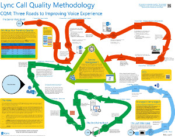
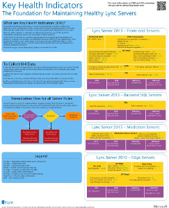
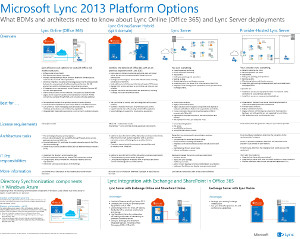

# Lync Server 2013에 대 한 기술 다이어그램

 

_**마지막으로 수정 된 항목:** 2014-03-14_

**요약:** 이러한 다이어그램에서는 Lync 2013에 대 한 권장 솔루션을 시각적으로 보여 줍니다.

이러한 리소스는 Visio (.vsd) 형식 (Visio 2010 또는 Visio 2013) 및 PDF 형식으로 사용할 수 있습니다. 문서를 인쇄 하는 방법에 대 한 자세한 내용은 포스터 인쇄용 팁을 참조 하십시오.

이러한 파일을 보는 데 추가 소프트웨어가 필요할 수도 있습니다. 자세한 내용은 다음 표를 참조하세요.

<table>
<colgroup>
<col style="width: 50%" />
<col style="width: 50%" />
</colgroup>
<thead>
<tr class="header">
<th>파일 형식</th>
<th>소프트웨어</th>
</tr>
</thead>
<tbody>
<tr class="odd">
<td>
.vsd
</td>
<td>
Visio 2010, Visio 2013 또는 <a href="https://go.microsoft.com/fwlink/?linkid=393676">무료 Visio viewer</a>

Visio Viewer를 사용하는 경우 VSD 링크를 마우스 오른쪽 단추로 클릭하고 <strong>다른 이름으로 대상 저장</strong>을 클릭하여 컴퓨터에 파일을 저장한 다음 컴퓨터에서 파일을 엽니다.
</td>
</tr>
<tr class="even">
<td>
.pdf
</td>
<td>
<a href="https://go.microsoft.com/fwlink/?linkid=393675">Adobe Reader</a> 등의 PDF 뷰어
</td>
</tr>
<tr class="odd">
<td>
.zip
</td>
<td>
모든 파일 압축 유틸리티 Windows 7과 8에서는 이러한 파일을 기본적으로 엽니다.
</td>
</tr>
</tbody>
</table>

## 포스터

이러한 포스터는 특정 기술 영역을 상세히 설명 하며, TechNet의 해당 문서와 함께 사용 하거나 다운로드 센터에서 사용할 수 있는 콘텐츠를 대상으로 합니다.

<table>
<colgroup>
<col style="width: 50%" />
<col style="width: 50%" />
</colgroup>
<thead>
<tr class="header">
<th>제목</th>
<th>설명</th>
</tr>
</thead>
<tbody>
<tr class="odd">
<td>
<strong>Lync Server 2013 온-프레미스 아키텍처</strong>

<a href="https://go.microsoft.com/fwlink/?linkid=392974">Microsoft에서 Zoom.it를 사용 하 여 포스터 확대 세부 정보</a>(데스크톱 또는 랩탑 컴퓨터에서 가장 적합)

<a href="https://go.microsoft.com/fwlink/?linkid=392578">PDF 버전</a> (모바일 장치 또는 태블릿 컴퓨터에서 가장 적합)

<a href="https://go.microsoft.com/fwlink/?linkid=392579">Visio 버전</a> (visio 사용자에 게 가장 적합)
</td>
<td>
포스터는 계획 및 배포에 대 한 아키텍처 지침을 제공 합니다. 포스터에는 Lync Server의 일반 구성 요소, 배포 계획 시 사용 되는 용어, 새 기능, 서버 역할 및 설치 개요에 대 한 정보가 포함 되어 있습니다. 또한 포스터에는 소형, 중형 및 대형 샘플 토폴로지의 고가용성 및 재해 복구를 향상 시키기 위한 예제 아키텍처가 포함 되어 있습니다.

크기: 34-44 인치

이 포스터는 Visio 2013를 사용 하 여 만들었습니다. 특정 환경에 대 한 수정이 필요 하지 않아야 합니다.
</td>
</tr>
<tr class="even">
<td>
<strong>Lync 통화 품질 방법론</strong>

<a href="https://go.microsoft.com/fwlink/?linkid=392972">Microsoft에서 Zoom.it를 사용 하 여 포스터 확대 세부 정보</a>(데스크톱 또는 랩탑 컴퓨터에서 가장 적합)

<a href="https://go.microsoft.com/fwlink/?linkid=391841">.Zip 파일에 Visio 및 PDF 버전 함께</a>
</td>
<td>
Lync 시스템 문제 해결에 대해 설명 하는 포스터, 특히 엔터프라이즈 음성 품질에 영향을 주는 문제입니다. 사용할 포스터:

<ul>
<li>
<a href="https://go.microsoft.com/fwlink/p/?linkid=390677">Lync Server 네트워킹 가이드</a>
</li>
<li>
<a href="lync-server-2013-poster-lync-call-quality-methodology.md">Lync Server 2013의 Lync 통화 품질 방법론</a> (접근성 문서)
</li>
<li>
<a href="lync-server-2013-poster-key-health-indicators.md">Lync Server 2013의 주요 상태 지표</a> (접근성 문서)
</li>
</ul>

크기: 34-44 인치

이 포스터는 Visio 2010를 사용 하 여 만들었습니다. 특정 환경에 대 한 수정이 필요 하지 않아야 합니다.
</td>
</tr>
<tr class="odd">
<td>
<strong>주요 상태 표시기</strong>

<a href="https://go.microsoft.com/fwlink/?linkid=392971">Microsoft에서 Zoom.it를 사용 하 여 포스터 확대 세부 정보</a>(데스크톱 또는 랩탑 컴퓨터에서 가장 적합)

<a href="https://go.microsoft.com/fwlink/?linkid=391838">.Zip 파일에 Visio 및 PDF 버전 함께</a>
</td>
<td>
서버 문제 해결 메트릭 및 Lync 구현에서 주어진 서버의 역할에 대 한 기본 서버 상태를 설명 하는 포스터입니다. 사용할 포스터:

<ul>
<li>
<a href="https://go.microsoft.com/fwlink/p/?linkid=390677">Lync Server 네트워킹 가이드</a>
</li>
<li>
<a href="lync-server-2013-poster-lync-call-quality-methodology.md">Lync Server 2013의 Lync 통화 품질 방법론</a> (접근성 문서)
</li>
<li>
<a href="lync-server-2013-poster-key-health-indicators.md">Lync Server 2013의 주요 상태 지표</a> (접근성 문서)
</li>
</ul>

크기: 17 x 22 인치

이 포스터는 Visio 2010를 사용 하 여 만들었습니다. 특정 환경에 대 한 수정이 필요 하지 않아야 합니다.
</td>
</tr>
<tr class="even">
<td>
<strong>Lync 2013 플랫폼 옵션</strong>

<a href="https://go.microsoft.com/fwlink/p/?linkid=391840">Microsoft에서 Zoom.it로 전체 세부 정보로 포스터 확대</a>

<a href="https://go.microsoft.com/fwlink/p/?linkid=391837">PDF 버전</a> (모바일 장치 또는 태블릿 컴퓨터에서 가장 적합)

<a href="https://go.microsoft.com/fwlink/p/?linkid=391839">Visio 버전</a> (visio 사용자에 게 가장 적합)
</td>
<td>
이 포스터에서는 Lync 2013에 대 한 사용 가능한 플랫폼 옵션에 대해 설명 하 고, BDMs 설계자는 Office 365, Hybrid Lync, Lync Server 온-프레미스 및 호스팅된 Lync를 사용 하 여 Lync Online에서 선택할 수 있습니다. 이 포스터에는 각 라이선스 요구 사항 및 IT 전문가 업무에 가장 적합한 시나리오를 포함하여 각 아키텍처 옵션에 대한 세부 정보를 포함합니다.

크기: 34-44 인치

이 포스터는 Visio 2013를 사용 하 여 만들었습니다. 특정 환경에 대 한 수정이 필요 하지 않아야 합니다.
</td>
</tr>
<tr class="odd">
<td>
<strong>Microsoft Lync Server 2013 프로토콜 작업</strong>

<a href="https://go.microsoft.com/fwlink/?linkid=392970">Microsoft에서 Zoom.it로 전체 세부 정보로 포스터 확대</a>

<a href="https://go.microsoft.com/fwlink/?linkid=392512">PDF 버전</a> (모바일 장치 또는 태블릿 컴퓨터에서 가장 적합)

<a href="https://go.microsoft.com/fwlink/?linkid=392513">Visio 버전</a> (visio 사용자에 게 가장 적합)
</td>
<td>
이 포스터를 다운로드 하 여 Lync 2013, Lync Phone, Lync Web App, lync for Mac 및 Lync Mobile w의 기능 및 요구 사항을 이해 합니다. Lync Server 워크 로드를 통해 조직 전체의 통신을 활용 하는 방법을 참조 하세요.

크기: 24 x 36 인치

이 포스터는 Visio 2013를 사용 하 여 만들었습니다. 특정 환경에 대 한 수정이 필요 하지 않아야 합니다.
</td>
</tr>
</tbody>
</table>

## 포스터 인쇄 팁

플로터가 있는 경우 이러한 포스터를 최대 크기로 인쇄할 수 있습니다. 플로터가 없으면 다음 단계에 따라 더 작은 용지에 인쇄하십시오.

**더 작은 용지에 포스터 인쇄**

1.  Visio에서 포스터를 엽니다.

2.  **파일** 메뉴에서 **페이지 설정**을 클릭합니다.

3.  **인쇄 설정** 탭의 **프린터 용지** 섹션에서 인쇄할 용지 크기를 선택합니다.

4.  **인쇄 설정** 탭의 **확대/축소 인쇄** 섹션에서 **자동 맞춤**을 클릭하고 **1 용지 너비/1 용지 높이**를 입력합니다.

5.  **페이지 크기** 탭에서 **드로잉 내용에 맞게 크기 조정**을 클릭한 다음 **확인**을 클릭합니다.

6.  **파일** 메뉴에서 **인쇄**를 클릭합니다.

 

