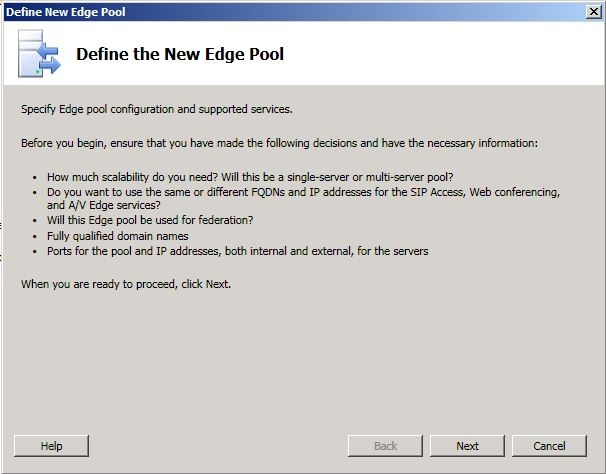
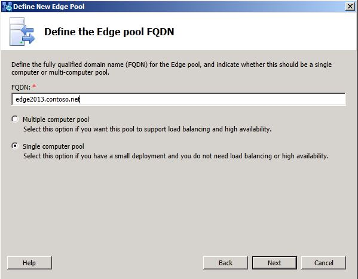
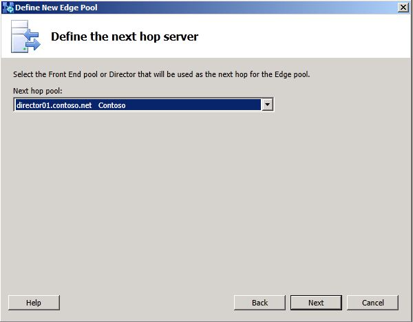

# 파일럿 Edge 서버 배포

이 항목에서는 비즈니스용 Skype 서버 2019 에지 서버를 배포하기 전에 알고 있어야 하는 구성 설정을 강조합니다. 비즈니스용 Skype 서버 2019의 배포 및 구성 프로세스는 비즈니스용 Skype 서버 2015와 매우 유사합니다. 또한 이 섹션에서는 파일럿 풀 배포 중에 고려해야 하는 핵심 사항들에 대해서도 설명합니다. <!-- For detailed steps, see 
 [Deploying external user access in Skype for Business Server 2019](../deployment/deploying-external-user-access/deploying-external-user-access.md) in the Deployment documentation, which describes the deployment process and also gives configuration information for external user access.  -->
  
**새 에지 풀 정의** 마법사를 탐색할 때 다음 단계에 표시된 핵심 구성 설정을 검토합니다. **새 에지 풀 정의** 마법사의 일부 페이지만 표시됩니다. 
  
### 에지 풀을 정의하는 경우

1. 토폴로지 작성기가 Domain Admins 그룹 및 RTCUniversalServerAdmins 그룹의 구성원으로 설치되어 있는 컴퓨터에 로그온합니다.
    
2. 비즈니스용 Skype 서버 2019 노드로 이동합니다. **에지 풀** 을 마우스 오른쪽 단추로 클릭하고 **새 에지 풀** 을 클릭합니다.
    
     
  
3. 에지 풀은 **다중 컴퓨터 풀** 또는 **단일 컴퓨터 풀** 일 수 있습니다.
    
     
  
4. **기능 선택** 페이지에서 페더레이션을 사용하도록 설정하지 마십시오. 페더ation과 XMPP 페더ation은 모두 현재 레거시 에지 서버를 통해 라우팅됩니다. 이러한 기능은 마이그레이션의 이후 단계에서 구성됩니다. 

  
5. 외부 **FQDNS,** 내부 **IP** 주소 정의 및 외부 IP 주소 정의 마법사 페이지 **완료를 계속합니다.**
    
6. 다음 홉 **서버** 정의 페이지에서 레거시 에지 풀의 다음 홉에 대한 Director를 선택합니다. 
    
     
  
7. 프런트 엔드 또는 중재 풀 연결 **페이지에서** 현재 풀을 이 에지 풀과 연결하지 않습니다. 외부 미디어 트래픽은 현재 레거시 에지 서버를 통해 라우팅됩니다. 이 설정은 마이그레이션의 이후 단계에서 구성됩니다. 
    
     
  
8. 마친 **다음**  토폴로지 게시를 클릭합니다. 
    
9. 배포 설명서의 단계에 따라 새 에지 서버에 파일을 설치하고 인증서를 구성한 다음 서비스를 시작하십시오. 
<!-- [Install Edge Servers for Skype for Business Server 2019](../deployment/deploying-external-user-access/install-edge-servers.md) in -->
    
배포 설명서의 항목에 있는 지침을 따르는 것이 매우 중요합니다. 이 섹션에는 단순히 이러한 서버 역할을 설치할 때의 구성 설정에 대한 일부 지침만 제공됩니다. 
<!-- [Deploying external user access in Skype for Business Server 2019](../deployment/deploying-external-user-access/deploying-external-user-access.md) -->
  
이제 레거시 에지 서버가 비즈니스용 Skype 서버 2019 에지 서버 배포와 동시에 배포됩니다. 두 배포가 올바르게 실행되고 있는지, 서비스가 시작되었는지, 다음 단계로 이동하기 전에 각 배포를 관리할 수 있는지를 확인합니다. 
  

