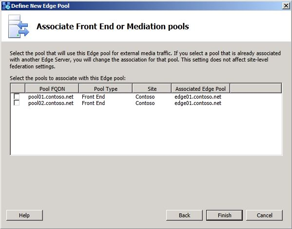

# 파일럿 Edge 서버 배포Deploy pilot Edge Server

이 항목에서는 비즈니스용 Skype 서버 2019 에지 서버를 배포하기 전에 알고 있어야 하는 구성 설정을 강조합니다.This topic highlights configuration settings you should be aware of before deploying your Skype for Business Server 2019 Edge Server. 비즈니스용 Skype 서버 2019의 배포 및 구성 프로세스는 비즈니스용 Skype 서버 2015와 매우 유사합니다.The deployment and configuration processes for Skype for Business Server 2019 are very similar to Skype for Business Server 2015. 또한 이 섹션에서는 파일럿 풀 배포 중에 고려해야 하는 핵심 사항들에 대해서도 설명합니다.This section only highlights key points you should consider as part of your pilot pool deployment. <!-- For detailed steps, see 
 [Deploying external user access in Skype for Business Server 2019](../deployment/deploying-external-user-access/deploying-external-user-access.md) in the Deployment documentation, which describes the deployment process and also gives configuration information for external user access.  -->
  
**새 에지 풀 정의** 마법사를 탐색할 때 다음 단계에 표시된 핵심 구성 설정을 검토합니다. **새 에지 풀 정의** 마법사의 일부 페이지만 표시됩니다.As you navigate through the **Define New Edge Pool** wizard, review the key configuration settings shown in the following steps. Note that only a few pages of the **Define New Edge Pool** wizard are shown. 
  
### 에지 풀을 정의하는 경우To define an Edge Pool

1. 토폴로지 작성기가 Domain Admins 그룹 및 RTCUniversalServerAdmins 그룹의 구성원으로 설치되어 있는 컴퓨터에 로그온합니다.Log on to the computer where Topology Builder is installed as a member of the Domain Admins group and the RTCUniversalServerAdmins group.
    
2. 비즈니스용 Skype 서버 2019 노드로 이동합니다.Navigate to the Skype for Business Server 2019 node. **에지 풀** 을 마우스 오른쪽 단추로 클릭하고 **새 에지 풀** 을 클릭합니다.Right-click **Edge pools**, and click **New Edge pool**.
    
     
  
3. 에지 풀은 **다중 컴퓨터 풀** 또는 **단일 컴퓨터 풀** 일 수 있습니다.An Edge pool can be a **Multiple computer pool** or **Single computer pool**.
    
     
  
4. **기능 선택** 페이지에서 페더레이션을 사용하도록 설정하지 마십시오.On the **Select features** page, do not enable federation or XMPP federation. 페더ation과 XMPP 페더ation은 모두 현재 레거시 에지 서버를 통해 라우팅됩니다.Federation and XMPP federation are both currently routed through the legacy Edge Server. 이러한 기능은 마이그레이션의 이후 단계에서 구성됩니다.These features will be configured in a later phase of migration. 

  
5. 외부 **FQDNS,** 내부 **IP** 주소 정의 및 외부 IP 주소 정의 마법사 페이지 **완료를 계속합니다.**Continue completing the following wizard pages: **External FQDNs**, **Define the internal IP address**, and **Define the external IP address**.
    
6. 다음 홉 **서버** 정의 페이지에서 레거시 에지 풀의 다음 홉에 대한 Director를 선택합니다.On the **Define the next hop server** page, select the Director for the next hop of the legacy Edge pool. 
    
     
  
7. 프런트 엔드 또는 중재 풀 연결 **페이지에서** 현재 풀을 이 에지 풀과 연결하지 않습니다.On the **Associate Front End or Mediation pools** page, do not associate a pool with this Edge pool at this time. 외부 미디어 트래픽은 현재 레거시 에지 서버를 통해 라우팅됩니다.External media traffic is currently routed through the legacy Edge Server. 이 설정은 마이그레이션의 이후 단계에서 구성됩니다.This setting will be configured in a later phase of migration. 
    
     
  
8. 마친 **다음**  토폴로지 게시를 클릭합니다.Click **Finish**, and then **Publish** the topology. 
    
9. 배포 설명서의 단계에 따라 새 에지 서버에 파일을 설치하고 인증서를 구성한 다음 서비스를 시작하십시오.Follow the steps in the Deployment documentation to install the files on the new Edge Server, configure certificates, and start the services. 
<!-- [Install Edge Servers for Skype for Business Server 2019](../deployment/deploying-external-user-access/install-edge-servers.md) in -->
    
배포 설명서의 항목에 있는 지침을 따르는 것이 매우 중요합니다.It's very important that you follow the guidelines in the topics in the Deployment documentation. 이 섹션에는 단순히 이러한 서버 역할을 설치할 때의 구성 설정에 대한 일부 지침만 제공됩니다.This section merely provided some guidance on configuration settings when installing these server roles. 
<!-- [Deploying external user access in Skype for Business Server 2019](../deployment/deploying-external-user-access/deploying-external-user-access.md) -->
  
이제 레거시 에지 서버가 비즈니스용 Skype 서버 2019 에지 서버 배포와 동시에 배포됩니다.You should now have a legacy Edge Server deployed in parallel with a Skype for Business Server 2019 Edge server deployment. 두 배포가 올바르게 실행되고 있는지, 서비스가 시작되었는지, 다음 단계로 이동하기 전에 각 배포를 관리할 수 있는지를 확인합니다.Verify that both deployments are running properly, services are started, and you can administer each deployment prior to moving to the next phase. 
  

