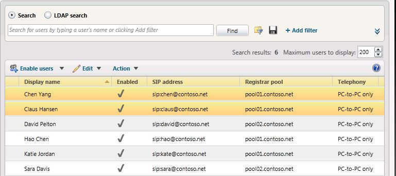
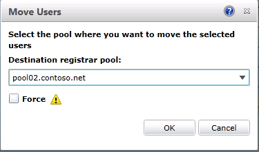
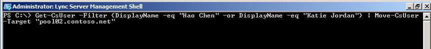

# <a name="move-multiple-users-to-the-pilot-pool"></a><span data-ttu-id="782bf-103">파일럿 풀로 여러 사용자 이동</span><span class="sxs-lookup"><span data-stu-id="782bf-103">Move multiple users to the pilot pool</span></span>

<span data-ttu-id="782bf-104">비즈니스용 Skype 서버 2019 제어판 또는 비즈니스용 Skype 서버 2019 관리 셸을 사용하여 레거시 풀에서 비즈니스용 Skype 서버 2019 파일럿 풀로 여러 사용자를 이동할 수 있습니다.</span><span class="sxs-lookup"><span data-stu-id="782bf-104">You can move multiple users from your legacy pool to your Skype for Business Server 2019 pilot pool using Skype for Business Server 2019 Control Panel or Skype for Business Server 2019 Management Shell.</span></span>

 <span data-ttu-id="782bf-105">**이 문서의**</span><span class="sxs-lookup"><span data-stu-id="782bf-105">**In this article**</span></span>
  
[<span data-ttu-id="782bf-106">비즈니스용 Skype 서버 2019 제어판을 사용하여 여러 사용자를 이동</span><span class="sxs-lookup"><span data-stu-id="782bf-106">To move multiple users by using the Skype for Business Server 2019 Control Panel</span></span>](#sectionSection0)
  
[<span data-ttu-id="782bf-107">비즈니스용 Skype 서버 2019 관리 셸을 사용하여 여러 사용자를 이동</span><span class="sxs-lookup"><span data-stu-id="782bf-107">To move multiple users by using the Skype for Business Server 2019 Management Shell</span></span>](#sectionSection1)
  
[<span data-ttu-id="782bf-108">비즈니스용 Skype 서버 2019 관리 셸을 사용하여 모든 사용자를 동시에 이동</span><span class="sxs-lookup"><span data-stu-id="782bf-108">To move all users at the same time by using the Skype for Business Server 2019 Management Shell</span></span>](#sectionSection2)
  
  
## <a name="to-move-multiple-users-by-using-the-skype-for-business-server-2019-control-panel"></a><span data-ttu-id="782bf-109">비즈니스용 Skype 서버 2019 제어판을 사용하여 여러 사용자를 이동</span><span class="sxs-lookup"><span data-stu-id="782bf-109">To move multiple users by using the Skype for Business Server 2019 Control Panel</span></span>
<span data-ttu-id="782bf-110"><a name="sectionSection0"> </a></span><span class="sxs-lookup"><span data-stu-id="782bf-110"><a name="sectionSection0"> </a></span></span>

1. <span data-ttu-id="782bf-111">비즈니스용 Skype 서버 제어판을 니다.</span><span class="sxs-lookup"><span data-stu-id="782bf-111">Open Skype for Business Server Control Panel.</span></span>
    
2. <span data-ttu-id="782bf-112">사용자, **검색을** 클릭한 다음 찾기를 **클릭합니다.** </span><span class="sxs-lookup"><span data-stu-id="782bf-112">Click **Users**, click **Search**, and then click **Find**.</span></span>
    
3. <span data-ttu-id="782bf-113">비즈니스용 Skype 서버 2019 풀로 이동하려는 두 사용자를 선택합니다.</span><span class="sxs-lookup"><span data-stu-id="782bf-113">Select two users that you want to move to the Skype for Business Server 2019 pool.</span></span> <span data-ttu-id="782bf-114">이 예에서는 사용자 Chen Yang과 Claus Hansen을 이동하겠습니다.</span><span class="sxs-lookup"><span data-stu-id="782bf-114">In this example, we will move users Chen Yang and Claus Hansen.</span></span>
    
     
  
4. <span data-ttu-id="782bf-116">**동작** 메뉴에서 **선택한 사용자를 풀로 이동** 을 선택합니다.</span><span class="sxs-lookup"><span data-stu-id="782bf-116">From the **Action** menu, select **Move selected users to pool**.</span></span>
    
5. <span data-ttu-id="782bf-117">드롭다운 목록에서 비즈니스용 Skype 서버 2019 풀을 선택합니다.</span><span class="sxs-lookup"><span data-stu-id="782bf-117">From the drop-down list, select the Skype for Business Server 2019 pool.</span></span>
    
6. <span data-ttu-id="782bf-118">**동작** 을 클릭하고 **선택한 사용자를 풀로 이동** 을 클릭합니다.</span><span class="sxs-lookup"><span data-stu-id="782bf-118">Click **Action**, and then click **Move selected users to pool**.</span></span> <span data-ttu-id="782bf-119">**확인** 을 클릭합니다.</span><span class="sxs-lookup"><span data-stu-id="782bf-119">Click **OK**.</span></span>
    
     
  
7. <span data-ttu-id="782bf-121">사용자의 등록자 **풀** 열에 이제 사용자가 성공적으로 이동된 비즈니스용 Skype 서버 2019 풀이 포함되어 있는지 확인해야 합니다.</span><span class="sxs-lookup"><span data-stu-id="782bf-121">Verify that the **Registrar pool** column for the users now contains the Skype for Business Server 2019 pool, which indicates that the users have been successfully moved.</span></span> 
    
## <a name="to-move-multiple-users-by-using-the-skype-for-business-server-2019-management-shell"></a><span data-ttu-id="782bf-122">비즈니스용 Skype 서버 2019 관리 셸을 사용하여 여러 사용자를 이동</span><span class="sxs-lookup"><span data-stu-id="782bf-122">To move multiple users by using the Skype for Business Server 2019 Management Shell</span></span>
<span data-ttu-id="782bf-123"><a name="sectionSection1"> </a></span><span class="sxs-lookup"><span data-stu-id="782bf-123"><a name="sectionSection1"> </a></span></span>

1. <span data-ttu-id="782bf-124">비즈니스용 Skype 서버 2019 관리 셸을 열 수 있습니다.</span><span class="sxs-lookup"><span data-stu-id="782bf-124">Open the Skype for Business Server 2019 Management Shell.</span></span> 
    
2. <span data-ttu-id="782bf-125">명령줄에 다음을 입력하고 **User1** 및 **User2를** 이동하려는 특정 사용자  이름으로 바꾸고 pool_FQDN 풀의 이름으로 대체합니다.</span><span class="sxs-lookup"><span data-stu-id="782bf-125">At the command line, type the following and replace **User1** and **User2** with specific user names you want to move, and replace **pool_FQDN** with the name of the destination pool.</span></span> <span data-ttu-id="782bf-126">이 예에서는 Hao Chen과 Katie Jordan을 이동하겠습니다.</span><span class="sxs-lookup"><span data-stu-id="782bf-126">In this example we will move users Hao Chen and Katie Jordan.</span></span> 
    
   ```PowerShell
   Get-CsUser -Filter {DisplayName -eq "User1" -or DisplayName - eq "User2"} | Move-CsUser -Target "pool_FQDN"
   ```

    
  
3. <span data-ttu-id="782bf-128">명령줄에 다음을 입력합니다.</span><span class="sxs-lookup"><span data-stu-id="782bf-128">At the command line, type the following:</span></span> 
    
   ```PowerShell
   Get-CsUser -Identity "User1"
   ```

4. <span data-ttu-id="782bf-129">등록자 **풀** ID는 이제 이전 단계에서  pool_FQDN 지정한 풀을 지정합니다.</span><span class="sxs-lookup"><span data-stu-id="782bf-129">The **Registrar Pool** identity should now point to the pool you specified as **pool_FQDN** in the previous step.</span></span> <span data-ttu-id="782bf-130">ID는 이제 사용자가 이전 단계에서 pool_FQDN으로 지정한 풀을 가리킵니다.이 ID가 있으면 사용자가 성공적으로 이동된 것입니다.</span><span class="sxs-lookup"><span data-stu-id="782bf-130">The presence of this identity confirms that the user has been successfully moved.</span></span> <span data-ttu-id="782bf-131">단계를 반복하여 **User2가** 이동된 것을 확인할 수 있습니다.</span><span class="sxs-lookup"><span data-stu-id="782bf-131">Repeat step to verify that **User2** has been moved.</span></span> 
    
     
  
## <a name="to-move-all-users-at-the-same-time-by-using-the-skype-for-business-server-2019-management-shell"></a><span data-ttu-id="782bf-133">비즈니스용 Skype 서버 2019 관리 셸을 사용하여 모든 사용자를 동시에 이동</span><span class="sxs-lookup"><span data-stu-id="782bf-133">To move all users at the same time by using the Skype for Business Server 2019 Management Shell</span></span>
<span data-ttu-id="782bf-134"><a name="sectionSection2"> </a></span><span class="sxs-lookup"><span data-stu-id="782bf-134"><a name="sectionSection2"> </a></span></span>

<span data-ttu-id="782bf-135">이 예에서는 모든 사용자가 레거시 풀(pool01.contoso.net.</span><span class="sxs-lookup"><span data-stu-id="782bf-135">In this example, all users have been returned to the legacy pool (pool01.contoso.net).</span></span> <span data-ttu-id="782bf-136">비즈니스용 Skype 서버 2019 관리 셸을 사용하여 모든 사용자를 동시에 비즈니스용 Skype 서버 2019 풀(pool02.contoso.net)로 이동합니다.</span><span class="sxs-lookup"><span data-stu-id="782bf-136">Using the Skype for Business Server 2019 Management Shell, we will move all users at the same time to the Skype for Business Server 2019 pool (pool02.contoso.net).</span></span>
  
1. <span data-ttu-id="782bf-137">비즈니스용 Skype 서버 2019 관리 셸을 열 수 있습니다.</span><span class="sxs-lookup"><span data-stu-id="782bf-137">Open the Skype for Business Server 2019 Management Shell.</span></span>
    
2. <span data-ttu-id="782bf-138">명령줄에 다음을 입력합니다.</span><span class="sxs-lookup"><span data-stu-id="782bf-138">At the command line, type the following:</span></span> 
    
   ```PowerShell
   Get-CsUser -OnLyncServer | Move-CsUser -Target "pool_FQDN"
   ```

     
  
3. <span data-ttu-id="782bf-140">파일럿 사용자 중 하나에 대해 **Get-CsUser를** 실행합니다.</span><span class="sxs-lookup"><span data-stu-id="782bf-140">Run **Get-CsUser** for one of the pilot users.</span></span> 
    
   ```PowerShell
   Get-CsUser -Identity "Hao Chen"
   ```

4. <span data-ttu-id="782bf-141">각 **사용자의 등록자** 풀 ID는 이제 이전  단계에서 pool_FQDN 지정한 풀을 포인트로 지정합니다.</span><span class="sxs-lookup"><span data-stu-id="782bf-141">The **Registrar Pool** identity for each user now points to the pool you specified as **pool_FQDN** in the previous step.</span></span> <span data-ttu-id="782bf-142">이 ID가 있으면 사용자가 성공적으로 이동되었음을 나타냅니다.</span><span class="sxs-lookup"><span data-stu-id="782bf-142">The presence of this identity confirms that the user has been successfully moved.</span></span> 
    
5. <span data-ttu-id="782bf-143">또한 비즈니스용 Skype 서버 2019 제어판에서 사용자 목록을 보고 등록자 풀 값이 이제 비즈니스용 Skype 서버 2019 풀을 포인트로 하는지 확인할 수 있습니다.</span><span class="sxs-lookup"><span data-stu-id="782bf-143">Additionally, we can view the list of users in the Skype for Business Server 2019 Control Panel and verify that the Registrar Pool value now points to the Skype for Business Server 2019 pool.</span></span>
    
     
  

