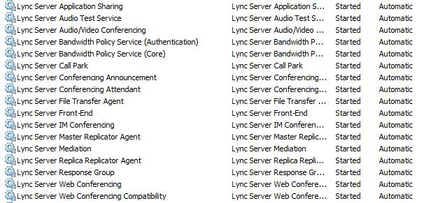
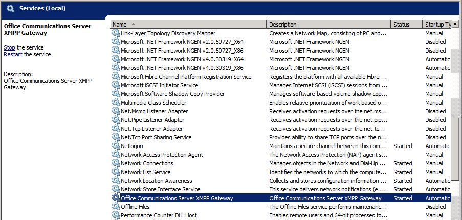

# 레거시 환경 확인Verify the legacy environment

비즈니스용 Skype 서버 2019을 공존 상태로 배포 하기 전에 레거시 서비스가 구성 및 시작 되었는지 확인 해야 합니다.Before deploying Skype for Business Server 2019 in a coexistence state, you need to verify that legacy services have been configured and started. 비즈니스용 Skype Server 2019 파일럿 풀을 배포 하기 전에 레거시 환경에 존재 하는 주요 서비스 및 기능을 식별 하는 것이 중요 합니다.It is important to identify key services and features that exist in your legacy environment prior to deploying a Skype for Business Server 2019 pilot pool. Microsoft Skype for Business Server 2019 XMPP를 레거시 XMPP 배포를 사용 하 여 배포 하기 전에 레거시 XMPP 서비스가 구성 및 시작 되었는지 확인 하 고 레거시 XMPP의 페더레이션 파트너를 식별 해야 합니다. 구성을 지원 합니다.Before deploying Microsoft Skype for Business Server 2019 XMPP in a coexistence state with a legacy XMPP deployment, you need to verify that the legacy XMPP services have been configured and started, and identify which federated partner the legacy XMPP configuration is supporting. 레거시 배포 확인에는 다음이 수반 됩니다.Verifying your legacy deployment entails the following:
  
- 레거시 서비스가 시작 되었는지 확인Verifying that the legacy services are started
    
- 토폴로지 및 사용자 검토Reviewing the topology and users
    
- 페더레이션 및 Edge 서버 설정 확인Verifying the federation and Edge server settings
    
- XMPP 서비스 및 페더레이션 파트너 확인Verifying XMPP services and federated partners
    
## 레거시 서비스가 시작 되었는지 확인Verify that legacy services are started

1. 레거시 프런트 엔드 서버에서 관리 toolservices 애플릿으로 이동 합니다.From the legacy Front End Server, navigate to the Administrative Tools\Services applet.
    
2. 프런트 엔드 서버에서 다음 서비스가 실행 중인지 확인 합니다.Verify that the following services are running on the Front End Server:
    
     
  
## 비즈니스용 Skype Server 제어판에서 레거시 토폴로지 검토Review the legacy topology in Skype for Business Server Control Panel

1. RTCUniversalServerAdmins 그룹의 구성원 이거나 CsAdministrator 또는 CsUserAdministrator 관리 역할의 구성원 인 계정을 사용 하 여 프런트 엔드 서버에 로그온 합니다.Log on to the Front End Server with an account that is a member of the RTCUniversalServerAdmins group or a member of the CsAdministrator or CsUserAdministrator administrative role.
    
2. 비즈니스용 Skype Server 제어판을 엽니다.Open the Skype for Business Server Control Panel.
    
3. **토폴로지**를 선택 합니다.Select **Topology**. 레거시 배포의 다양 한 서버가 나열 되는지 확인 합니다.Verify that the various servers in your legacy deployment are listed.
    
     
  
## 비즈니스용 Skype Server 제어판에서 레거시 사용자 검토Review legacy users in Skype for Business Server Control Panel

1. 비즈니스용 Skype Server 제어판을 엽니다.Open the Skype for Business Server Control Panel.
    
2. **사용자**를 선택 하 고 **찾기를**클릭 합니다.Select **Users**, and then click **Find**.
    
3. **등록자 그룹** 열이 나열 된 각 사용자의 레거시 풀을 가리키는지 확인 합니다.Verify that the **Registrar Pool** column points to the legacy pool for each user listed. 
    
     
  
## 레거시 Edge 및 페더레이션 설정 확인Verify legacy Edge and federation settings

1. 토폴로지 작성기를 시작 합니다.Start Topology Builder.
    
2. **기존 배포에서 토폴로지 다운로드를**선택 합니다.Select **Download Topology from existing deployment**.
    
3. 파일 이름을 선택 하 고 기본 tbxml 파일 형식으로 토폴로지를 저장 합니다.Choose a file name, and save the topology with the default .tbxml file type.
    
4. 레거시 설치 노드를 확장 하 여 배포에 다양 한 서버 역할을 표시 합니다.Expand the legacy installs node to reveal the various server roles in the deployment.
    
5. 사이트 노드를 선택 하 고 **사이트 페더레이션 경로 할당** 값이 설정 되어 있는지 확인 합니다.Select the site node and verify that a **Site federation route assignment** value is set. 
    
     
  
6. Standard Edition Server 또는 Enterprise Edition 프런트 엔드 풀을 선택 합니다.Select the Standard Edition Server or Enterprise Edition front end pool. **연결**아래 미디어에 대해 Edge 풀이 구성 되었는지 확인 합니다.Determine whether an Edge pool has been configured for media below **Associations**. 
    
     
  
7. Edge 풀을 선택 하 고 다음 홉 풀이 **다음 홉 선택**아래에 구성 되어 있는지 확인 합니다.Select the Edge pool and identify whether a Next hop pool is configured below **Next hop selection**.
    
     
  
## 레거시 XMPP 페더레이션 파트너 구성 확인Verify legacy XMPP federated partner Configuration

1. 레거시 XMPP 서버에서 관리 toolservices 애플릿으로 이동 합니다.From the legacy XMPP server, navigate to the Administrative Tools\Services applet.
    
2. Office Communications Server XMPP 게이트웨이 서비스가 시작 되었는지 확인 합니다.Verify that the Office Communications Server XMPP Gateway service is started. 
    
     
  

