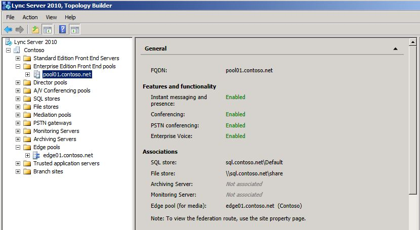

# 레거시 환경 확인

비즈니스용 Skype 서버 2019을 공존 상태로 배포 하기 전에 레거시 서비스가 구성 및 시작 되었는지 확인 해야 합니다. 비즈니스용 Skype Server 2019 파일럿 풀을 배포 하기 전에 레거시 환경에 존재 하는 주요 서비스 및 기능을 식별 하는 것이 중요 합니다. Microsoft Skype for Business Server 2019 XMPP를 레거시 XMPP 배포를 사용 하 여 배포 하기 전에 레거시 XMPP 서비스가 구성 및 시작 되었는지 확인 하 고 레거시 XMPP의 페더레이션 파트너를 식별 해야 합니다. 구성을 지원 합니다. 레거시 배포 확인에는 다음이 수반 됩니다.
  
- 레거시 서비스가 시작 되었는지 확인
    
- 토폴로지 및 사용자 검토
    
- 페더레이션 및 Edge 서버 설정 확인
    
- XMPP 서비스 및 페더레이션 파트너 확인
    
## 레거시 서비스가 시작 되었는지 확인

1. 레거시 프런트 엔드 서버에서 관리 toolservices 애플릿으로 이동 합니다.
    
2. 프런트 엔드 서버에서 다음 서비스가 실행 중인지 확인 합니다.
    
     
  
## 비즈니스용 Skype Server 제어판에서 레거시 토폴로지 검토

1. RTCUniversalServerAdmins 그룹의 구성원 이거나 CsAdministrator 또는 CsUserAdministrator 관리 역할의 구성원 인 계정을 사용 하 여 프런트 엔드 서버에 로그온 합니다.
    
2. 비즈니스용 Skype Server 제어판을 엽니다.
    
3. **토폴로지**를 선택 합니다. 레거시 배포의 다양 한 서버가 나열 되는지 확인 합니다.
    
     
  
## 비즈니스용 Skype Server 제어판에서 레거시 사용자 검토

1. 비즈니스용 Skype Server 제어판을 엽니다.
    
2. **사용자**를 선택 하 고 **찾기를**클릭 합니다.
    
3. **등록자 그룹** 열이 나열 된 각 사용자의 레거시 풀을 가리키는지 확인 합니다. 
    
     
  
## 레거시 Edge 및 페더레이션 설정 확인

1. 토폴로지 작성기를 시작 합니다.
    
2. **기존 배포에서 토폴로지 다운로드를**선택 합니다.
    
3. 파일 이름을 선택 하 고 기본 tbxml 파일 형식으로 토폴로지를 저장 합니다.
    
4. 레거시 설치 노드를 확장 하 여 배포에 다양 한 서버 역할을 표시 합니다.
    
5. 사이트 노드를 선택 하 고 **사이트 페더레이션 경로 할당** 값이 설정 되어 있는지 확인 합니다. 
    
     
  
6. Standard Edition Server 또는 Enterprise Edition 프런트 엔드 풀을 선택 합니다. **연결**아래 미디어에 대해 Edge 풀이 구성 되었는지 확인 합니다. 
    
     
  
7. Edge 풀을 선택 하 고 다음 홉 풀이 **다음 홉 선택**아래에 구성 되어 있는지 확인 합니다.
    
     
  
## 레거시 XMPP 페더레이션 파트너 구성 확인

1. 레거시 XMPP 서버에서 관리 toolservices 애플릿으로 이동 합니다.
    
2. Office Communications Server XMPP 게이트웨이 서비스가 시작 되었는지 확인 합니다. 
    
     
  

