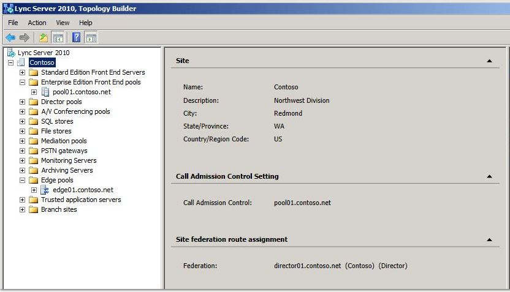

# 레거시 환경 확인

비즈니스용 Skype 서버 2019를 동시 사용 상태로 배포하기 전에 레거시 서비스가 구성되고 시작된지 확인해야 합니다. 비즈니스용 Skype 서버 2019 파일럿 풀을 배포하기 전에 레거시 환경에 있는 주요 서비스 및 기능을 파악하는 것이 중요합니다. 레거시 XMPP 배포와 동시 사용 상태로 Microsoft 비즈니스용 Skype 서버 2019 XMPP를 배포하기 전에 레거시 XMPP 서비스가 구성 및 시작되어 있는지 확인하고 레거시 XMPP 구성이 지원하는 페더링 파트너를 식별해야 합니다. 레거시 배포를 확인하면 다음이 필요합니다.
  
- 레거시 서비스가 시작된지 확인
    
- 토폴로지 및 사용자 검토
    
- 페더링 및 에지 서버 설정 확인
    
- XMPP 서비스 및 페더링 파트너 확인
    
## 레거시 서비스가 시작된지 확인

1. 레거시 프런트 엔드 서버에서 관리 도구\서비스 애플릿으로 이동합니다.
    
2. 프런트 엔드 서버에서 다음 서비스가 실행되고 있는지 확인합니다.
    
     
  
## 비즈니스용 Skype 서버 제어판에서 레거시 토폴로지 검토

1. RTCUniversalServerAdmins 그룹의 구성원이거나 CsAdministrator 또는 CsUserAdministrator 관리 역할의 구성원인 계정으로 프런트 엔드 서버에 로그온합니다.
    
2. 비즈니스용 Skype 서버 제어판을 니다.
    
3. **토폴로지** 를 선택합니다. 레거시 배포의 다양한 서버가 나열되어 있는지 확인
    
     
  
## 비즈니스용 Skype 서버 제어판에서 레거시 사용자 검토

1. 비즈니스용 Skype 서버 제어판을 니다.
    
2. 사용자를 **선택하고** 찾기를 **클릭합니다.**
    
3. 등록자 풀 **열이** 나열된 각 사용자의 레거시 풀을 포인트로 하는지 확인해야 합니다. 
    
     
  
## 레거시 에지 및 페더전 설정 확인

1. 토폴로지 작성기를 시작합니다.
    
2. **기존 배포에서 토폴로지 다운로드** 를 선택합니다.
    
3. 파일 이름을 선택하고 기본 .tbxml 파일 형식으로 토폴로지 저장
    
4. 레거시 설치 노드를 확장하여 배포의 다양한 서버 역할을 공개합니다.
    
5. 사이트 노드를 선택하고 사이트 **페더ation** 경로 할당 값이 설정되어 있는지 확인해야 합니다. 
    
     
  
6. Standard Edition Server 또는 Enterprise Edition 프런트 엔드 풀을 선택합니다. 연결 아래의 미디어에 대해 에지 풀이 구성되어 있는지 **여부를 확인하십시오.** 
    
     
  
7. 에지 풀을 선택하고 다음 홉 풀이 다음 홉 선택 아래에 구성되어 있는지 **여부를 식별합니다.**
    
     
  
## 레거시 XMPP 페더럴 파트너 구성 확인

1. 레거시 XMPP 서버에서 관리 도구의 서비스 애플릿으로 이동합니다.
    
2. Office Communications Server XMPP 게이트웨이 서비스가 시작되었는지 확인합니다. 
    
     
  

