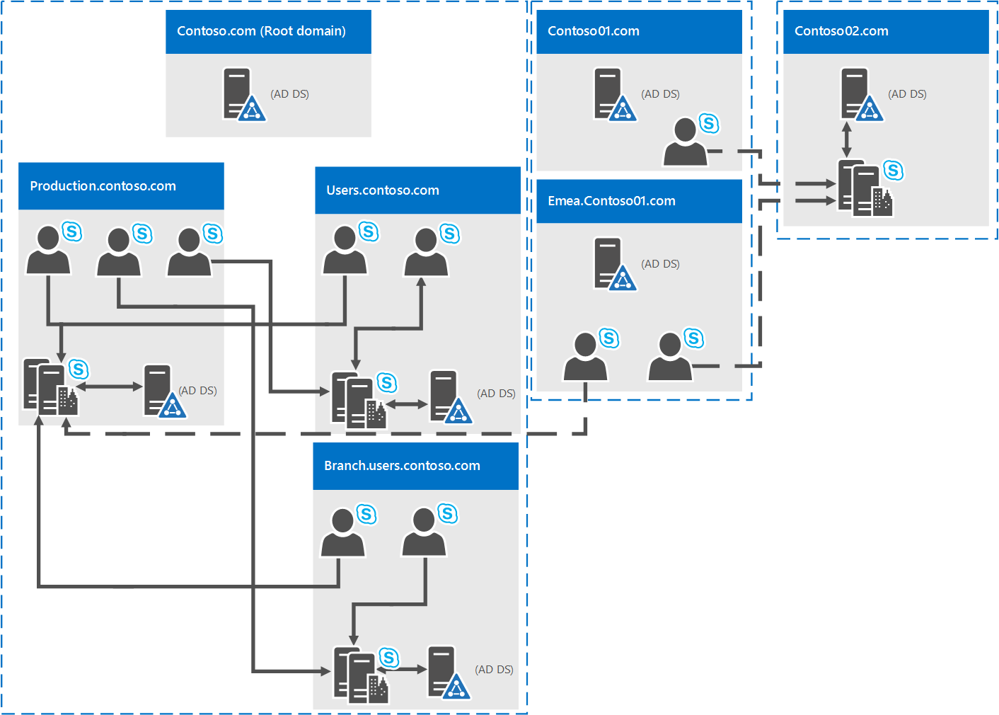

# <a name="system-requirements-for-skype-for-business-server-2019"></a><span data-ttu-id="c55ca-104">비즈니스용 Skype 서버 2019에 대 한 시스템 요구 사항</span><span class="sxs-lookup"><span data-stu-id="c55ca-104">System requirements for Skype for Business Server 2019</span></span>
 
<span data-ttu-id="c55ca-105">**요약:** 이 주제를 사용 하 여 비즈니스용 Skype 서버 2019을 설치할 준비를 합니다.</span><span class="sxs-lookup"><span data-stu-id="c55ca-105">**Summary:** Prepare to install Skype for Business Server 2019 with this topic.</span></span> <span data-ttu-id="c55ca-106">여기에는 하드웨어, OS, 소프트웨어, 데이터베이스, 인증서, 활성,, Ory, DNS 및 fileshares 포함 됩니다.</span><span class="sxs-lookup"><span data-stu-id="c55ca-106">Hardware, OS, software, databases, certificates, Active Diretory, DNS, and fileshares are covered here.</span></span> <span data-ttu-id="c55ca-107">서버 팜을 성공적으로 설치 및 배포 하는 데 도움이 되는 모든 시스템 요구 사항 및 권장 사항이 여기에 나와 있습니다.</span><span class="sxs-lookup"><span data-stu-id="c55ca-107">All the system requirements and recommendations are here to help ensure a successful install and deployment of your server farm.</span></span>
  
<span data-ttu-id="c55ca-108">예상 대로 비즈니스용 Skype 서버 2019에 대 한 배포를 시작 하기 전에 몇 가지 준비를 수행 해야 할 수 있습니다.</span><span class="sxs-lookup"><span data-stu-id="c55ca-108">As you might expect, there are some preparations to make before you begin deploying Skype for Business Server 2019.</span></span> <span data-ttu-id="c55ca-109">이 문서에서는 다음에 대 한 계획을 안내 합니다.</span><span class="sxs-lookup"><span data-stu-id="c55ca-109">This article will walk you through planning for the following:</span></span>
  
- [<span data-ttu-id="c55ca-110">하드웨어</span><span class="sxs-lookup"><span data-stu-id="c55ca-110">Hardware</span></span>](system-requirements.md#Hardware)
  
- [<span data-ttu-id="c55ca-111">운영 체제</span><span class="sxs-lookup"><span data-stu-id="c55ca-111">Operating systems</span></span>](system-requirements.md#OS)
  
- [<span data-ttu-id="c55ca-112">소프트웨어</span><span class="sxs-lookup"><span data-stu-id="c55ca-112">Software</span></span>](system-requirements.md#Software)

- [<span data-ttu-id="c55ca-113">백 엔드 SQL 데이터베이스</span><span class="sxs-lookup"><span data-stu-id="c55ca-113">Back end SQL databases</span></span>](system-requirements.md#DBs)
  
- [<span data-ttu-id="c55ca-114">Active Directory</span><span class="sxs-lookup"><span data-stu-id="c55ca-114">Active Directory</span></span>](system-requirements.md#AD)
  
- [<span data-ttu-id="c55ca-115">DNS (Domain Name System)</span><span class="sxs-lookup"><span data-stu-id="c55ca-115">Domain Name System (DNS)</span></span>](system-requirements.md#DNS)
  
- [<span data-ttu-id="c55ca-116">인증</span><span class="sxs-lookup"><span data-stu-id="c55ca-116">Certificates</span></span>](system-requirements.md#Certs)
  
- [<span data-ttu-id="c55ca-117">파일 공유</span><span class="sxs-lookup"><span data-stu-id="c55ca-117">File Share</span></span>](system-requirements.md#Fileshare)

  
## <a name="hardware-for-skype-for-business-server-2019"></a><span data-ttu-id="c55ca-118">비즈니스용 Skype 서버 2019의 하드웨어</span><span class="sxs-lookup"><span data-stu-id="c55ca-118">Hardware for Skype for Business Server 2019</span></span>
<span data-ttu-id="c55ca-119"><a name="Hardware"> </a></span><span class="sxs-lookup"><span data-stu-id="c55ca-119"></span></span>

<span data-ttu-id="c55ca-120">토폴로지가 종료 된 후 (그렇지 않은 경우 [비즈니스용 Skype Server 2019 항목에 대 한 토폴로지 기본 사항](../../SfbServer/plan-your-deployment/topology-basics/topology-basics.md) 확인), 서버에 대해 고려해 야 할 때가 있습니다.</span><span class="sxs-lookup"><span data-stu-id="c55ca-120">After you have your topology down (and if you don't, you can check out the [Topology Basics for Skype for Business Server 2019](../../SfbServer/plan-your-deployment/topology-basics/topology-basics.md) topic), it's time to think about servers.</span></span> <span data-ttu-id="c55ca-121">비즈니스용 Skype Server 2019 서버에는 64 비트 하드웨어가 필요 합니다.</span><span class="sxs-lookup"><span data-stu-id="c55ca-121">Skype for Business Server 2019 servers require 64-bit hardware.</span></span> <span data-ttu-id="c55ca-122">하드웨어에 대 한 권장 사항은 아래에 있습니다.</span><span class="sxs-lookup"><span data-stu-id="c55ca-122">Our recommendations for hardware are below.</span></span> <span data-ttu-id="c55ca-123">이러한 요구 사항은 필요 하지 않지만 최적의 성능에 필요한 요구 사항을 반영 합니다.</span><span class="sxs-lookup"><span data-stu-id="c55ca-123">These aren't requirements, but they reflect the requirements necessary for optimal performance.</span></span> <span data-ttu-id="c55ca-124">이 문서에는 사용자의 상황에 따라 이러한 작업을 수행 해야 하는지 결정 하는 데 도움이 되는 용량 계획 설명서가 있습니다.</span><span class="sxs-lookup"><span data-stu-id="c55ca-124">We have capacity planning documentation that will help you determine if you need more than this, depending on your circumstances.</span></span>
  
<span data-ttu-id="c55ca-125">Standard Edition 서버용 권장 하드웨어:</span><span class="sxs-lookup"><span data-stu-id="c55ca-125">Recommended hardware for Standard Edition servers:</span></span>

|<span data-ttu-id="c55ca-126">**하드웨어 구성 요소**</span><span class="sxs-lookup"><span data-stu-id="c55ca-126">**Hardware component**</span></span>|<span data-ttu-id="c55ca-127">**권장**</span><span class="sxs-lookup"><span data-stu-id="c55ca-127">**Recommended**</span></span>|
|:-----|:-----|
|<span data-ttu-id="c55ca-128">%</span><span class="sxs-lookup"><span data-stu-id="c55ca-128">CPU</span></span>  <br/> |<span data-ttu-id="c55ca-129">인텔 제온 E5-2673 v3 듀얼 프로세서, 6-코어, 2.4 ghz 이상.</span><span class="sxs-lookup"><span data-stu-id="c55ca-129">Intel Xeon E5-2673 v3 dual processor, 6-core, 2.4 gigahertz (GHz) or higher.</span></span>  <br/> <span data-ttu-id="c55ca-130">인텔 아이테니엄 프로세서는 비즈니스용 Skype 서버 2019 역할에 지원 되지 않습니다.</span><span class="sxs-lookup"><span data-stu-id="c55ca-130">Intel Itanium processors are not supported for Skype for Business Server 2019 roles.</span></span>  <br/> |
|<span data-ttu-id="c55ca-131">Memory</span><span class="sxs-lookup"><span data-stu-id="c55ca-131">Memory</span></span>  <br/> |<span data-ttu-id="c55ca-132">32 기가바이트 (GB).</span><span class="sxs-lookup"><span data-stu-id="c55ca-132">32 gigabytes (GB).</span></span>  <br/> |
|<span data-ttu-id="c55ca-133">공간</span><span class="sxs-lookup"><span data-stu-id="c55ca-133">Disk</span></span>  <br/> |<span data-ttu-id="c55ca-134">어떤</span><span class="sxs-lookup"><span data-stu-id="c55ca-134">EITHER:</span></span>  <br/> <span data-ttu-id="c55ca-135">• 최소 72 GB의 무료 디스크 공간을 제공 하는 8 개 이상의 1만 RPM (raid 10을 사용 하는 RAID 1 및 6을 사용 하는 두 개의 디스크)</span><span class="sxs-lookup"><span data-stu-id="c55ca-135">• 8 or more 10000 RPM hard disk drives with at least 72 GB free disk space (two of the disks using RAID 1 and 6 using RAID 10).</span></span>  <br/> <span data-ttu-id="c55ca-136">또는</span><span class="sxs-lookup"><span data-stu-id="c55ca-136">OR</span></span>  <br/> <span data-ttu-id="c55ca-137">• Ssd (고체 드라이브)는 8 1만 RPM 기계적 디스크 드라이브에 동일한 여유 공간 및 유사한 성능을 제공할 수 있습니다.</span><span class="sxs-lookup"><span data-stu-id="c55ca-137">• Solid state drives (SSDs) able to provide the same free space and similar performance to 8 10000 RPM mechanical disk drives.</span></span>  <br/> |
|<span data-ttu-id="c55ca-138">네트워크</span><span class="sxs-lookup"><span data-stu-id="c55ca-138">Network</span></span>  <br/> |<span data-ttu-id="c55ca-139">1 Gbps 이상의 듀얼 포트 네트워크 어댑터 (2 개의 네트워크 어댑터를 사용할 수 있지만 단일 MAC 주소 및 단일 IP 주소로 팀에 있어야 함).</span><span class="sxs-lookup"><span data-stu-id="c55ca-139">1 dual-port network adapter, 1 Gbps or higher (2 network adapters can be used, but they need to be teamed with a single MAC address and a single IP address).</span></span>  <br/> <span data-ttu-id="c55ca-140">프런트 엔드 서버, 백 엔드 서버 및 Standard Edition 서버에서는 듀얼 또는 멀티홈 구성이 지원 **되지 않습니다** .</span><span class="sxs-lookup"><span data-stu-id="c55ca-140">Dual or multi-homed configurations are **not** supported for Front End Servers, Back End Servers, and Standard Edition servers.</span></span> <br/> <span data-ttu-id="c55ca-141">운영 체제에 표시 되지 않고 서버 하드웨어를 모니터링 하 고 관리 하는 데 사용 되는 동안에는 DRAC 또는 ILO와 같은 대역외 관리 시스템을 사용할 수 있습니다.</span><span class="sxs-lookup"><span data-stu-id="c55ca-141">As long as they are not exposed to the operating system and are being used to monitor and manage server hardware, you can have out-of-band management systems, such as DRAC or ILO.</span></span> <span data-ttu-id="c55ca-142">이 시나리오는 멀티홈 서버를 구성 하지 않으며 지원 됩니다.</span><span class="sxs-lookup"><span data-stu-id="c55ca-142">This scenario doesn't constitute a multi-homed server, and it is supported.</span></span>  <br/> |


<span data-ttu-id="c55ca-143">프런트 엔드 서버 및 백 엔드 서버에 권장 되는 하드웨어:</span><span class="sxs-lookup"><span data-stu-id="c55ca-143">Recommended hardware for Front End Servers and Back End Servers:</span></span>
  
|<span data-ttu-id="c55ca-144">**하드웨어 구성 요소**</span><span class="sxs-lookup"><span data-stu-id="c55ca-144">**Hardware component**</span></span>|<span data-ttu-id="c55ca-145">**권장**</span><span class="sxs-lookup"><span data-stu-id="c55ca-145">**Recommended**</span></span>|
|:-----|:-----|
|<span data-ttu-id="c55ca-146">%</span><span class="sxs-lookup"><span data-stu-id="c55ca-146">CPU</span></span>  <br/> |<span data-ttu-id="c55ca-147">인텔 제온 E5-2673 v3 듀얼 프로세서, 6-코어, 2.4 ghz 이상.</span><span class="sxs-lookup"><span data-stu-id="c55ca-147">Intel Xeon E5-2673 v3 dual processor, 6-core, 2.4 gigahertz (GHz) or higher.</span></span> <br/> <span data-ttu-id="c55ca-148">인텔 아이테니엄 프로세서는 비즈니스용 Skype 서버 2019 역할에 지원 되지 않습니다.</span><span class="sxs-lookup"><span data-stu-id="c55ca-148">Intel Itanium processors are not supported for Skype for Business Server 2019 roles.</span></span>  <br/> |
|<span data-ttu-id="c55ca-149">Memory</span><span class="sxs-lookup"><span data-stu-id="c55ca-149">Memory</span></span>  <br/> |<span data-ttu-id="c55ca-150">64 기가바이트 (GB).</span><span class="sxs-lookup"><span data-stu-id="c55ca-150">64 gigabytes (GB).</span></span>  <br/> |
|<span data-ttu-id="c55ca-151">공간</span><span class="sxs-lookup"><span data-stu-id="c55ca-151">Disk</span></span>  <br/> |<span data-ttu-id="c55ca-152">어떤</span><span class="sxs-lookup"><span data-stu-id="c55ca-152">EITHER:</span></span>  <br/> <span data-ttu-id="c55ca-153">• 최소 72 GB의 무료 디스크 공간을 제공 하는 8 개 이상의 1만 RPM (raid 10을 사용 하는 RAID 1 및 6을 사용 하는 두 개의 디스크)</span><span class="sxs-lookup"><span data-stu-id="c55ca-153">• 8 or more 10000 RPM hard disk drives with at least 72 GB free disk space (two of the disks using RAID 1 and 6 using RAID 10).</span></span>  <br/> <span data-ttu-id="c55ca-154">또는</span><span class="sxs-lookup"><span data-stu-id="c55ca-154">OR</span></span>  <br/> <span data-ttu-id="c55ca-155">• Ssd (고체 드라이브)는 8 1만 RPM 기계적 디스크 드라이브에 동일한 여유 공간 및 유사한 성능을 제공할 수 있습니다.</span><span class="sxs-lookup"><span data-stu-id="c55ca-155">• Solid state drives (SSDs) able to provide the same free space and similar performance to 8 10000 RPM mechanical disk drives.</span></span>  <br/> |
|<span data-ttu-id="c55ca-156">네트워크</span><span class="sxs-lookup"><span data-stu-id="c55ca-156">Network</span></span>  <br/> |<span data-ttu-id="c55ca-157">1 Gbps 이상의 듀얼 포트 네트워크 어댑터 (2 개의 네트워크 어댑터를 사용할 수 있지만 단일 MAC 주소 및 단일 IP 주소로 팀에 있어야 함).</span><span class="sxs-lookup"><span data-stu-id="c55ca-157">1 dual-port network adapter, 1 Gbps or higher (2 network adapters can be used, but they need to be teamed with a single MAC address and a single IP address).</span></span>  <br/> <span data-ttu-id="c55ca-158">프런트 엔드 서버, 백 엔드 서버 및 Standard Edition 서버에서는 듀얼 또는 멀티홈 구성이 지원 **되지 않습니다** .</span><span class="sxs-lookup"><span data-stu-id="c55ca-158">Dual or multi-homed configurations are **not** supported for Front End Servers, Back End Servers, and Standard Edition servers.</span></span> <br/> <span data-ttu-id="c55ca-159">운영 체제에 표시 되지 않고 서버 하드웨어를 모니터링 하 고 관리 하는 데 사용 되는 동안에는 DRAC 또는 ILO와 같은 대역외 관리 시스템을 사용할 수 있습니다.</span><span class="sxs-lookup"><span data-stu-id="c55ca-159">As long as they are not exposed to the operating system and are being used to monitor and manage server hardware, you can have out-of-band management systems, such as DRAC or ILO.</span></span> <span data-ttu-id="c55ca-160">이 시나리오는 멀티홈 서버를 구성 하지 않으며 지원 됩니다.</span><span class="sxs-lookup"><span data-stu-id="c55ca-160">This scenario doesn't constitute a multi-homed server, and it is supported.</span></span>  <br/> |
   
<span data-ttu-id="c55ca-161">Edge 서버, 독립형 중재 서버, 디렉터에 권장 되는 하드웨어:</span><span class="sxs-lookup"><span data-stu-id="c55ca-161">Recommended hardware for Edge Servers, standalone Mediation Servers, and Directors:</span></span>
  
|<span data-ttu-id="c55ca-162">**하드웨어 구성 요소**</span><span class="sxs-lookup"><span data-stu-id="c55ca-162">**Hardware component**</span></span>|<span data-ttu-id="c55ca-163">**권장**</span><span class="sxs-lookup"><span data-stu-id="c55ca-163">**Recommended**</span></span>|
|:-----|:-----|
|<span data-ttu-id="c55ca-164">%</span><span class="sxs-lookup"><span data-stu-id="c55ca-164">CPU</span></span>  <br/> |<span data-ttu-id="c55ca-165">인텔 제온 E5-2673 v3 듀얼 프로세서, 6-코어, 2.4 ghz 이상.</span><span class="sxs-lookup"><span data-stu-id="c55ca-165">Intel Xeon E5-2673 v3 dual processor, 6-core, 2.4 gigahertz (GHz) or higher.</span></span>  <br/> <span data-ttu-id="c55ca-166">인텔 아이테니엄 프로세서는 비즈니스용 Skype 서버 2019 역할에 지원 되지 않습니다.</span><span class="sxs-lookup"><span data-stu-id="c55ca-166">Intel Itanium processors are not supported for Skype for Business Server 2019 roles.</span></span>  <br/> |
|<span data-ttu-id="c55ca-167">Memory</span><span class="sxs-lookup"><span data-stu-id="c55ca-167">Memory</span></span>  <br/> |<span data-ttu-id="c55ca-168">32 기가바이트.</span><span class="sxs-lookup"><span data-stu-id="c55ca-168">32 gigabytes.</span></span>  <br/> |
|<span data-ttu-id="c55ca-169">공간</span><span class="sxs-lookup"><span data-stu-id="c55ca-169">Disk</span></span>  <br/> |<span data-ttu-id="c55ca-170">어떤</span><span class="sxs-lookup"><span data-stu-id="c55ca-170">EITHER:</span></span>  <br/> <span data-ttu-id="c55ca-171">• 최소 72 GB의 무료 디스크 공간을 제공 하는 4 개 이상의 1만 RPM 하드 디스크 드라이브 (디스크가 2 배로 RAID 1 구성 되어 있어야 함).</span><span class="sxs-lookup"><span data-stu-id="c55ca-171">• 4 or more 10000 RPM hard disk drives with at least 72 GB free disk space (the disks should be in a 2x RAID 1 configuration).</span></span>  <br/> <span data-ttu-id="c55ca-172">또는</span><span class="sxs-lookup"><span data-stu-id="c55ca-172">OR</span></span>  <br/> <span data-ttu-id="c55ca-173">• Ssd (고체 드라이브)는 4 1만 RPM 기계적 디스크 드라이브에 동일한 여유 공간 및 유사한 성능을 제공할 수 있습니다.</span><span class="sxs-lookup"><span data-stu-id="c55ca-173">• Solid state drives (SSDs) able to provide the same free space and similar performance to 4 10000 RPM mechanical disk drives.</span></span>  <br/> |
|<span data-ttu-id="c55ca-174">네트워크</span><span class="sxs-lookup"><span data-stu-id="c55ca-174">Network</span></span>  <br/> |<span data-ttu-id="c55ca-175">1 Gbps 이상의 듀얼 포트 네트워크 어댑터 (2 개의 네트워크 어댑터를 사용할 수 있지만 단일 MAC 주소 및 단일 IP 주소로 팀에 있어야 함).</span><span class="sxs-lookup"><span data-stu-id="c55ca-175">1 dual-port network adapter, 1 Gbps or higher (2 network adapters can be used, but they need to be teamed with a single MAC address and a single IP address).</span></span>  <br/> <span data-ttu-id="c55ca-176">듀얼 또는 멀티홈 구성은 비디오 Interop 서버 및 디렉터에 대해 지원 **되지 않습니다** .</span><span class="sxs-lookup"><span data-stu-id="c55ca-176">Dual or multi-homed configurations are **not** supported for Video Interop Servers and Directors.</span></span> <br/> <span data-ttu-id="c55ca-177">Edge 서버에는 이중 포트 네트워크 어댑터용 1 Gbps 이상 (또는 두 개의 연결 된 네트워크 어댑터와 총 4 개, 단일 MAC 주소와 단일 IP 주소로 그룹화 된 각 쌍 중 총 2 쌍) 인 2 개의 네트워크 인터페이스가 필요 합니다.</span><span class="sxs-lookup"><span data-stu-id="c55ca-177">Edge servers will require two network interfaces that are dual-port network adapters, 1 Gbps or higher (or two paired network adapters, for a total of four, each pair being teamed with a single MAC address and a single IP address, for a total of two pairs).</span></span>  <br/> <span data-ttu-id="c55ca-178">독립 실행형 중재 서버에서 특정 PSTN IP 주소의 구성을 허용 하는 추가 Nic (네트워크 인터페이스 카드) 설치가 지원 됩니다.</span><span class="sxs-lookup"><span data-stu-id="c55ca-178">On standalone Mediation Servers, the installation of additional network interface cards (NICs) to allow the configuration of a specific PSTN IP address is supported.</span></span>  <br/> |


> [!NOTE]
> <span data-ttu-id="c55ca-179">서버 역할에 관계 없이 비즈니스용 Skype Server 2019에 대해 다음 하드웨어 설정을 권장 합니다 (이는 구매한 하드웨어 브랜드에 따라 달라질 수 있음). 자세한 내용은 제조업체 설명서를 참조 하세요.</span><span class="sxs-lookup"><span data-stu-id="c55ca-179">Regardless of the server role, we also recommend the following hardware settings for Skype for Business Server 2019 (this may vary depending on the brand of hardware you've purchased, so please refer to manufacturer documentation for specifics):</span></span>
> - <span data-ttu-id="c55ca-180">BIOS 구성-NUMA에서 FLAT로 설정 해야 합니다.</span><span class="sxs-lookup"><span data-stu-id="c55ca-180">BIOS config - should be set to FLAT from NUMA.</span></span>
> - <span data-ttu-id="c55ca-181">하이퍼스레딩을 활성화 합니다.</span><span class="sxs-lookup"><span data-stu-id="c55ca-181">Enable Hyperthreading.</span></span>
> - <span data-ttu-id="c55ca-182">RSS 큐 설정은 큐에서 8 개로 설정 해야 합니다.</span><span class="sxs-lookup"><span data-stu-id="c55ca-182">The RSS queue setting should be set to 8 queue.</span></span>

   
## <a name="operating-systems-for-skype-for-business-server-2019"></a><span data-ttu-id="c55ca-183">비즈니스용 Skype Server 2019의 운영 체제</span><span class="sxs-lookup"><span data-stu-id="c55ca-183">Operating systems for Skype for Business Server 2019</span></span>
<span data-ttu-id="c55ca-184"><a name="OS"> </a></span><span class="sxs-lookup"><span data-stu-id="c55ca-184"></span></span>

<span data-ttu-id="c55ca-185">하드웨어를 설치한 후에는 비즈니스용 Skype 서버 2019을 설치 하 고 성공적으로 사용할 수 있도록 하는 OS (설치 운영 체제)가 필요 합니다.</span><span class="sxs-lookup"><span data-stu-id="c55ca-185">After you have the hardware in place, you'll need to the install operating system (OS) that will allow you to install and successfully use Skype for Business Server 2019.</span></span>
  
|||
|:-----|:-----|
|<span data-ttu-id="c55ca-186">Windows Server 2019</span><span class="sxs-lookup"><span data-stu-id="c55ca-186">Windows Server 2019</span></span> <br/> |
|<span data-ttu-id="c55ca-187">Windows Server 2016</span><span class="sxs-lookup"><span data-stu-id="c55ca-187">Windows Server 2016</span></span> <br/> ||
||
   
<span data-ttu-id="c55ca-188">여기에 나열 된 운영 체제 이외의 다른 항목은 제대로 작동 하지 않습니다. 비즈니스용 Skype 서버 2019 설치에 대해 사용해 보세요.</span><span class="sxs-lookup"><span data-stu-id="c55ca-188">Anything other than the operating systems listed here won't work properly; please don't try it for installs of Skype for Business Server 2019.</span></span> <span data-ttu-id="c55ca-189">예를 들어 Server Core 옵션이 나열 되지 않으며, 따라서 지원 되지 않습니다.</span><span class="sxs-lookup"><span data-stu-id="c55ca-189">For example, Server Core option is not listed, and is thus not Supported.</span></span>  <span data-ttu-id="c55ca-190">참고: OS의 현재 위치 업그레이드는 Lync Server 2013에서 지원 되지 않습니다.</span><span class="sxs-lookup"><span data-stu-id="c55ca-190">Note:  In-place upgrade of the OS is not supported with Lync Server 2013.</span></span>  <span data-ttu-id="c55ca-191">다른 OS를 사용 하 여 별도의 풀을 배포 하 고 새 풀로 사용자를 마이그레이션해야 합니다.</span><span class="sxs-lookup"><span data-stu-id="c55ca-191">You must deploy a separate pool and migrate users to the new pool with a difference OS.</span></span>

> [!NOTE]
> 
> <span data-ttu-id="c55ca-192">Windows Server 2019 컴퓨터에 Windows 관리 센터 2019을 설치 하는 경우 수신 대기할 포트를 입력 하 라는 메시지가 표시 됩니다.</span><span class="sxs-lookup"><span data-stu-id="c55ca-192">If you are installing Windows Admin Center 2019 on your Windows Server 2019 machine, it will prompt you for a port to listen on.</span></span> <span data-ttu-id="c55ca-193">포트 443을 선택할 수 있는 liklihood, 해당 컴퓨터에 비즈니스용 Skype Server 2019이 설치 되어 있거나 비즈니스용 Skype 서버 2019이 설치 되어 있는 경우에는 다른 포트 번호를 선택 해야 합니다.</span><span class="sxs-lookup"><span data-stu-id="c55ca-193">There's a liklihood you might choose port 443, but if that machine has Skype for Business Server 2019 installed on it, or is going to have Skype for Business Server 2019 installed on it, then you must choose a different port number.</span></span>
> 
><span data-ttu-id="c55ca-194">이런 경우는 무엇 인가요?</span><span class="sxs-lookup"><span data-stu-id="c55ca-194">Why is this the case?</span></span> <span data-ttu-id="c55ca-195">Windows 관리 센터 2019이 포트 443에서 실행 되 고 있는 경우 비즈니스용 Skype 제어판을 사용 하 여 서버에 연결할 수 없으며, 서버에서 실행 되는 내부 웹 서비스 (주소록 웹 서비스)에 연결할 수 없게 됩니다. , 자동 검색 서비스, WebTicket 서비스 등).</span><span class="sxs-lookup"><span data-stu-id="c55ca-195">If Windows Admin Center 2019 is running on port 443, you will not be able to connect to the server using the Skype for Business Control Panel, nor will you be able to connect to any internal web service running on the server (Address Book Web Service, Autodiscover Service, WebTicket Service, etc).</span></span>  <span data-ttu-id="c55ca-196">사실 내부 웹 서비스 URL에는 연결할 수 없습니다.</span><span class="sxs-lookup"><span data-stu-id="c55ca-196">In fact, you will not be able to connect to any Internal Web Service URL.</span></span> <span data-ttu-id="c55ca-197">필요한 이벤트에서 다른 포트를 선택 하거나 비즈니스용 Skype Server 2019를 사용 하 여 Windows 관리 센터 2019를 서버에 배치 합니다.</span><span class="sxs-lookup"><span data-stu-id="c55ca-197">Please choose a different port, in the event you need or want to put Windows Admin Center 2019 on a server with Skype for Business Server 2019.</span></span>
> 

  
## <a name="software-that-should-be-installed-before-a-skype-for-business-server-2019-deployment"></a><span data-ttu-id="c55ca-198">비즈니스용 Skype Server 2019 배포 전에 설치 해야 하는 소프트웨어</span><span class="sxs-lookup"><span data-stu-id="c55ca-198">Software that should be installed before a Skype for Business Server 2019 deployment</span></span>
<span data-ttu-id="c55ca-199"><a name="Software"> </a></span><span class="sxs-lookup"><span data-stu-id="c55ca-199"></span></span>

<span data-ttu-id="c55ca-200">비즈니스용 Skype 서버 2019을 실행 하는 모든 서버에 설치 하거나 구성 해야 할 몇 가지 사항이 있습니다.</span><span class="sxs-lookup"><span data-stu-id="c55ca-200">There are some things you're going to need to install or configure for any server running Skype for Business Server 2019.</span></span> <span data-ttu-id="c55ca-201">다음 목록에는 특정 서버 역할에 대 한 추가 요구 사항이 포함 되어 있습니다.</span><span class="sxs-lookup"><span data-stu-id="c55ca-201">These are listed below, followed by additional requirements for specific server roles.</span></span>

> [!IMPORTANT]
> <span data-ttu-id="c55ca-202">비즈니스용 Skype 2019는 .Net Framework 4.8를 지원 합니다.</span><span class="sxs-lookup"><span data-stu-id="c55ca-202">Skype For Business 2019 supports .Net Framework 4.8.</span></span> 
  
 <span data-ttu-id="c55ca-203">**모든 서버:**</span><span class="sxs-lookup"><span data-stu-id="c55ca-203">**All servers:**</span></span>
  
|<span data-ttu-id="c55ca-204">**소프트웨어/역할**</span><span class="sxs-lookup"><span data-stu-id="c55ca-204">**Software/role**</span></span>|<span data-ttu-id="c55ca-205">**세부적인**</span><span class="sxs-lookup"><span data-stu-id="c55ca-205">**Details**</span></span>|
|:-----|:-----|
|<span data-ttu-id="c55ca-206">Windows PowerShell 3.0</span><span class="sxs-lookup"><span data-stu-id="c55ca-206">Windows PowerShell 3.0</span></span>  <br/> |<span data-ttu-id="c55ca-207">모든 비즈니스용 Skype 서버 서버에는 Windows PowerShell 3.0가 설치 되어 있어야 합니다.</span><span class="sxs-lookup"><span data-stu-id="c55ca-207">All Skype for Business Server servers need Windows PowerShell 3.0 installed.</span></span>  <br/> <span data-ttu-id="c55ca-208">• 기본적으로 Windows Server 2016에 설치 되어 있어야 합니다.</span><span class="sxs-lookup"><span data-stu-id="c55ca-208">• This should be installed by default with Windows Server 2016.</span></span><br/> |
|<span data-ttu-id="c55ca-209">Microsoft .NET Framework</span><span class="sxs-lookup"><span data-stu-id="c55ca-209">Microsoft .NET Framework</span></span>  <br/> |<span data-ttu-id="c55ca-210">WCF 서비스는 Windows 기능으로 설치 된 **기능** 으로, **서버 관리자**에는 처음에 다운로드가 필요 하지 않습니다.</span><span class="sxs-lookup"><span data-stu-id="c55ca-210">WCF services is a **Feature** that's installed as a Windows feature, under **Server Manager**, initially no downloads needed.</span></span> <br/> <span data-ttu-id="c55ca-211">•이 기능을 설치 하거나, 이미 설치 되어 있고, 검사 하는 경우에는 다음과 같이 **HTTP 활성화** 옵션도 선택 되어 설치 되어 있는지 확인 해야 합니다.</span><span class="sxs-lookup"><span data-stu-id="c55ca-211">• You need to make sure, when you install this feature, or if it's already installed and you're checking on it, that the **HTTP Activation** option is also checked and installed, like so:</span></span> <br/> <span data-ttu-id="c55ca-212"></span><span class="sxs-lookup"><span data-stu-id="c55ca-212"></span></span> <br/> <span data-ttu-id="c55ca-213">HTTP 정품 인증을 설치 하기 위해 다른 항목을 설치 해야 하는 추가 팝업이 표시 되는 경우 걱정 하지 마세요.</span><span class="sxs-lookup"><span data-stu-id="c55ca-213">Don't worry if you get an additional pop-up saying some other things need to be installed for HTTP Activation to be installed.</span></span> <span data-ttu-id="c55ca-214">그 게 평소입니다. 확인을 클릭 하 고 계속 진행 합니다.</span><span class="sxs-lookup"><span data-stu-id="c55ca-214">That's normal; click OK and go ahead.</span></span> <span data-ttu-id="c55ca-215">이 팝업이 표시 되지 않는 경우 해당 항목이 이미 설치 되어 있는 것으로 간주할 수 있습니다.</span><span class="sxs-lookup"><span data-stu-id="c55ca-215">If you don't get this pop-up, you can assume those things are already installed and go ahead.</span></span>  <br/> <span data-ttu-id="c55ca-216">Microsoft .NET Framework는 일반적으로 Windows Server 2016이 설치 되어 있는 경우에 설치 됩니다.</span><span class="sxs-lookup"><span data-stu-id="c55ca-216">Microsoft .NET Framework is usually installed when Windows Server 2016 is installed.</span></span> <span data-ttu-id="c55ca-217">비즈니스용 Skype Server에는 Microsoft .NET Framework 4.7 또는 4.8이 필요 하므로이를 업데이트 해야 할 것입니다.</span><span class="sxs-lookup"><span data-stu-id="c55ca-217">Skype for Business Server requires Microsoft .NET Framework 4.7 or 4.8 though, so you'd probably need to update it.</span></span> <span data-ttu-id="c55ca-218">[여기](https://support.microsoft.com/help/3186497/the-net-framework-4-7-offline-installer-for-windows/) 에서 업데이트를 찾을 수 있습니다.</span><span class="sxs-lookup"><span data-stu-id="c55ca-218">You can find the update [here](https://support.microsoft.com/help/3186497/the-net-framework-4-7-offline-installer-for-windows/)</span></span><br/> |
|<span data-ttu-id="c55ca-219">미디어 파운데이션</span><span class="sxs-lookup"><span data-stu-id="c55ca-219">Media Foundation</span></span>  <br/> |<span data-ttu-id="c55ca-220">Windows Server 2016의 경우 Windows Media 형식 런타임이 Microsoft 미디어 파운데이션을 사용 하 여 설치 됩니다.</span><span class="sxs-lookup"><span data-stu-id="c55ca-220">For Windows Server 2016, the Windows Media Format Runtime installs with Microsoft Media Foundation.</span></span>  <br/> <span data-ttu-id="c55ca-221">회의에 사용 되는 모든 프런트 엔드 서버와 Standard Edition 서버는 Windows Media 형식 런타임을 통해 통화 공원, 알림 및 응답 그룹 응용 프로그램이 공지 사항 및 음악에 대해 재생 하는 Windows Media 오디오 (.wma) 파일을 실행 해야 합니다.</span><span class="sxs-lookup"><span data-stu-id="c55ca-221">All Front End Servers and Standard Edition servers used for conferencing require Windows Media Format Runtime to run the Windows Media Audio (.wma) files that the Call Park, Announcement, and Response Group applications play for announcements and music.</span></span>  <br/> |
|<span data-ttu-id="c55ca-222">Windows Identity Foundation</span><span class="sxs-lookup"><span data-stu-id="c55ca-222">Windows Identity Foundation</span></span>  <br/> |<span data-ttu-id="c55ca-223">비즈니스용 Skype Server 2019에 대 한 서버 간 인증 시나리오를 지원 하려면 Windows Identity Foundation 3.5이 필요 합니다.</span><span class="sxs-lookup"><span data-stu-id="c55ca-223">We need Windows Identity Foundation 3.5 to support server-to-server authentication scenarios for Skype for Business Server 2019.</span></span>  <br/> <span data-ttu-id="c55ca-224">• Windows Server 2016의 경우 아무 것도 다운로드할 필요가 없습니다.</span><span class="sxs-lookup"><span data-stu-id="c55ca-224">• For Windows Server 2016, there's no need to download anything.</span></span> <span data-ttu-id="c55ca-225">**서버 관리자**를 열고 **역할 및 기능 추가 마법사**로 이동 합니다.</span><span class="sxs-lookup"><span data-stu-id="c55ca-225">Open **Server Manager**, and go to the **Add Roles and Features Wizard**.</span></span> <span data-ttu-id="c55ca-226">**Windows Id 파운데이션 3.5** 이 **기능** 섹션 아래에 나열 됩니다.</span><span class="sxs-lookup"><span data-stu-id="c55ca-226">**Windows Identity Foundation 3.5** is listed under the **Features** section.</span></span> <span data-ttu-id="c55ca-227">선택 되어 있는 경우에는 좋은 방법입니다.</span><span class="sxs-lookup"><span data-stu-id="c55ca-227">If it's selected, you're good.</span></span> <span data-ttu-id="c55ca-228">그렇지 않으면 선택 하 고 **다음** 을 클릭 하 여 **설치** 단추에 도달 합니다.</span><span class="sxs-lookup"><span data-stu-id="c55ca-228">Otherwise select it and click **Next** to reach the **Install** button.</span></span> <br/> |
|<span data-ttu-id="c55ca-229">원격 서버 관리 도구</span><span class="sxs-lookup"><span data-stu-id="c55ca-229">Remote Server Administration Tools</span></span>  <br/> |<span data-ttu-id="c55ca-230">역할 관리 도구: AD DS 및 AD LDS 도구</span><span class="sxs-lookup"><span data-stu-id="c55ca-230">Role Administration Tools: AD DS and AD LDS tools</span></span>  <br/> |
   
 <span data-ttu-id="c55ca-231">**프런트 엔드 서버와 스탠더드 버전 서버에도 다음이 필요 합니다.**</span><span class="sxs-lookup"><span data-stu-id="c55ca-231">**Front End Servers and Standard Edition server also need:**</span></span>
  
|<span data-ttu-id="c55ca-232">**소프트웨어/역할**</span><span class="sxs-lookup"><span data-stu-id="c55ca-232">**Software/role**</span></span>|<span data-ttu-id="c55ca-233">**세부적인**</span><span class="sxs-lookup"><span data-stu-id="c55ca-233">**Details**</span></span>|
|:-----|:-----|
|<span data-ttu-id="c55ca-234">IIS (인터넷 정보 서비스)</span><span class="sxs-lookup"><span data-stu-id="c55ca-234">Internet Information Services (IIS)</span></span>  <br/> |<span data-ttu-id="c55ca-235">모든 프런트 엔드 서버와 모든 Standard Edition 서버에는 IIS가 필요 하며 다음 모듈이 선택 되어 있습니다.</span><span class="sxs-lookup"><span data-stu-id="c55ca-235">IIS is needed on all Front End Servers, as well as all Standard Edition servers, with the following modules selected:</span></span>  <br/> <span data-ttu-id="c55ca-236">• 일반적인 HTTP 기능: 기본 문서, HTTP 오류, 정적 콘텐츠</span><span class="sxs-lookup"><span data-stu-id="c55ca-236">• Common HTTP Features: Default Document, HTTP Errors, Static Content</span></span>  <br/> <span data-ttu-id="c55ca-237">• 상태 및 진단: HTTP 로깅, 로깅 도구, 추적</span><span class="sxs-lookup"><span data-stu-id="c55ca-237">• Health and Diagnostics: HTTP Logging, Logging Tools, Tracing</span></span>  <br/> <span data-ttu-id="c55ca-238">• 성능: 정적 콘텐츠 압축, 동적 콘텐츠 압축</span><span class="sxs-lookup"><span data-stu-id="c55ca-238">• Performance: Static Content Compression, Dynamic Content Compression</span></span>  <br/> <span data-ttu-id="c55ca-239">• 보안: 요청 필터링, 클라이언트 인증서 매핑 인증, Windows 인증</span><span class="sxs-lookup"><span data-stu-id="c55ca-239">• Security: Request Filtering, Client Certificate Mapping Authentication, Windows Authentication</span></span>  <br/> <span data-ttu-id="c55ca-240">• 응용 프로그램 개발: .NET 확장성 3.5, .NET 확장성 4.5, ASP.NET 3.5, ASP.NET 4.5, ISAPI 확장, ISAPI 필터</span><span class="sxs-lookup"><span data-stu-id="c55ca-240">• Application Development: .NET Extensibility 3.5, .NET Extensibility 4.5, ASP.NET 3.5, ASP.NET 4.5, ISAPI Extensions, ISAPI Filters</span></span>  <br/> <span data-ttu-id="c55ca-241">• 관리 도구: IIS 관리 콘솔, IIS 관리 스크립트 및 도구</span><span class="sxs-lookup"><span data-stu-id="c55ca-241">• Management Tools: IIS Management Console, IIS Management Scripts and Tools</span></span>  <br/> <span data-ttu-id="c55ca-242">익명 액세스만 필요 하지만, IIS를 설치 하는 경우 목록에서 선택할 수 있는 위치가 없는 것을 볼 수 있습니다.</span><span class="sxs-lookup"><span data-stu-id="c55ca-242">Note that Anonymous Access is also needed, but you get that when you install IIS, so you don't have a place to select it on the list.</span></span>  <br/> |
|<span data-ttu-id="c55ca-243">Windows Media 형식 런타임</span><span class="sxs-lookup"><span data-stu-id="c55ca-243">Windows Media Format Runtime</span></span>  <br/> | <span data-ttu-id="c55ca-244">Windows Server 2016의 경우 **서버 관리자**에서 **Media Foundation** 기능을 설치 해야 합니다.</span><span class="sxs-lookup"><span data-stu-id="c55ca-244">For Windows Server 2016, you'll need to install the **Media Foundation** feature in **Server Manager**.</span></span> <span data-ttu-id="c55ca-245">Skype for Business Server 2019 설치를이 없이 시작할 수 있지만,이를 설치 하 라는 메시지가 표시 되지만 비즈니스용 Skype Server 2019 설치를 계속 하기 전에 서버를 다시 부팅 해야 합니다.</span><span class="sxs-lookup"><span data-stu-id="c55ca-245">You actually can start your Skype for Business Server 2019 installation without this, but you'll be prompted to install it, and then reboot the server, before the Skype for Business Server 2019 install continues.</span></span> <span data-ttu-id="c55ca-246">미리 작업을 수행 하는 것이 좋습니다.</span><span class="sxs-lookup"><span data-stu-id="c55ca-246">It's better to do it ahead of time.</span></span> <br/> |
|<span data-ttu-id="c55ca-247">Silverlight</span><span class="sxs-lookup"><span data-stu-id="c55ca-247">Silverlight</span></span>  <br/> |<span data-ttu-id="c55ca-248">최신 버전의 Silverlight를 [여기](https://www.microsoft.com/silverlight/)에 설치할 수 있습니다.</span><span class="sxs-lookup"><span data-stu-id="c55ca-248">You can install the latest version of Silverlight [here](https://www.microsoft.com/silverlight/).</span></span>  <br/> |
   
<span data-ttu-id="c55ca-249">이를 돕기 위해 다음과 같은 샘플 PowerShell 스크립트를 실행 하 여이를 자동화할 수 있습니다.</span><span class="sxs-lookup"><span data-stu-id="c55ca-249">To help you out, here's a sample PowerShell script you can run to automate this:</span></span>
  
```PowerShell
Add-WindowsFeature RSAT-ADDS, Web-Server, Web-Static-Content, Web-Default-Doc, Web-Http-Errors, Web-Asp-Net, Web-Net-Ext, Web-ISAPI-Ext, Web-ISAPI-Filter, Web-Http-Logging, Web-Log-Libraries, Web-Request-Monitor, Web-Http-Tracing, Web-Basic-Auth, Web-Windows-Auth, Web-Client-Auth, Web-Filtering, Web-Stat-Compression, Web-Dyn-Compression, NET-WCF-HTTP-Activation45, Web-Asp-Net45, Web-Mgmt-Tools, Web-Scripting-Tools, Web-Mgmt-Compat, Windows-Identity-Foundation, Server-Media-Foundation, Telnet-Client, BITS, ManagementOData, Web-Mgmt-Console, Web-Metabase, Web-Lgcy-Mgmt-Console, Web-Lgcy-Scripting, Web-WMI, Web-Scripting-Tools, Web-Mgmt-Service
```

 <span data-ttu-id="c55ca-250">**또한 디렉터에는 다음이 필요 합니다.**</span><span class="sxs-lookup"><span data-stu-id="c55ca-250">**Directors also need:**</span></span>
  
<span data-ttu-id="c55ca-251">다음 모듈이 선택 된 상태로 IIS를 실행 합니다.</span><span class="sxs-lookup"><span data-stu-id="c55ca-251">IIS, with the following modules selected:</span></span>
  
- <span data-ttu-id="c55ca-252">일반적인 HTTP 기능</span><span class="sxs-lookup"><span data-stu-id="c55ca-252">Common HTTP Features</span></span>
    
  - <span data-ttu-id="c55ca-253">기본 문서</span><span class="sxs-lookup"><span data-stu-id="c55ca-253">Default Document</span></span>
    
  - <span data-ttu-id="c55ca-254">HTTP 오류</span><span class="sxs-lookup"><span data-stu-id="c55ca-254">HTTP Errors</span></span>
    
  - <span data-ttu-id="c55ca-255">정적 콘텐츠</span><span class="sxs-lookup"><span data-stu-id="c55ca-255">Static Content</span></span>
    
- <span data-ttu-id="c55ca-256">상태 및 진단</span><span class="sxs-lookup"><span data-stu-id="c55ca-256">Health and Diagnostics</span></span>
    
  - <span data-ttu-id="c55ca-257">HTTP 로깅</span><span class="sxs-lookup"><span data-stu-id="c55ca-257">HTTP Logging</span></span>
    
  - <span data-ttu-id="c55ca-258">로깅 도구</span><span class="sxs-lookup"><span data-stu-id="c55ca-258">Logging Tools</span></span>
    
  - <span data-ttu-id="c55ca-259">추적할</span><span class="sxs-lookup"><span data-stu-id="c55ca-259">Tracing</span></span>
    
- <span data-ttu-id="c55ca-260">성능을</span><span class="sxs-lookup"><span data-stu-id="c55ca-260">Performance</span></span>
    
  - <span data-ttu-id="c55ca-261">정적 콘텐츠 압축</span><span class="sxs-lookup"><span data-stu-id="c55ca-261">Static Content Compression</span></span>
    
- <span data-ttu-id="c55ca-262">보안</span><span class="sxs-lookup"><span data-stu-id="c55ca-262">Security</span></span>
    
  - <span data-ttu-id="c55ca-263">요청 필터링</span><span class="sxs-lookup"><span data-stu-id="c55ca-263">Request Filtering</span></span>
    
  - <span data-ttu-id="c55ca-264">클라이언트 인증서 매핑 인증</span><span class="sxs-lookup"><span data-stu-id="c55ca-264">Client Certificate Mapping Authentication</span></span>
    
  - <span data-ttu-id="c55ca-265">Windows 인증</span><span class="sxs-lookup"><span data-stu-id="c55ca-265">Windows Authentication</span></span>
    
- <span data-ttu-id="c55ca-266">응용 프로그램 개발</span><span class="sxs-lookup"><span data-stu-id="c55ca-266">Application Development</span></span>
    
  - <span data-ttu-id="c55ca-267">.NET 확장성 3.5</span><span class="sxs-lookup"><span data-stu-id="c55ca-267">.NET Extensibility 3.5</span></span>
    
  - <span data-ttu-id="c55ca-268">.NET 확장성 4.5</span><span class="sxs-lookup"><span data-stu-id="c55ca-268">.NET Extensibility 4.5</span></span>
    
  - <span data-ttu-id="c55ca-269">ASP.NET 3.5</span><span class="sxs-lookup"><span data-stu-id="c55ca-269">ASP.NET 3.5</span></span>
    
  - <span data-ttu-id="c55ca-270">ASP.NET 4.5</span><span class="sxs-lookup"><span data-stu-id="c55ca-270">ASP.NET 4.5</span></span>
    
  - <span data-ttu-id="c55ca-271">ISAPI 확장</span><span class="sxs-lookup"><span data-stu-id="c55ca-271">ISAPI Extension</span></span>
    
  - <span data-ttu-id="c55ca-272">ISAPI 필터</span><span class="sxs-lookup"><span data-stu-id="c55ca-272">ISAPI Filters</span></span>
    
<span data-ttu-id="c55ca-273">(이에 대 한 자세한 내용은 프런트 엔드 서버 및 스탠더드 버전 서버와 동일한 모듈으로, 동적 콘텐츠 압축 및 관리 도구를 사용 하지 않는 것이 좋습니다.)</span><span class="sxs-lookup"><span data-stu-id="c55ca-273">(If you're wondering, it's the same module set as the Front End Servers and Standard Edition servers, with the Dynamic Content Compression and Management Tools left out.)</span></span>
  
<span data-ttu-id="c55ca-274">또한 다음과 같은 몇 가지 PowerShell 코드가 있습니다.</span><span class="sxs-lookup"><span data-stu-id="c55ca-274">And we have some PowerShell code below for this too:</span></span>
  
```PowerShell
Add-WindowsFeature RSAT-ADDS, Web-Server, Web-Static-Content, Web-Default-Doc, Web-Http-Errors, Web-Asp-Net, Web-Net-Ext, Web-ISAPI-Ext, Web-ISAPI-Filter, Web-Http-Logging, Web-Log-Libraries, Web-Request-Monitor, Web-Http-Tracing, Web-Basic-Auth, Web-Windows-Auth, Web-Client-Auth, Web-Filtering, Web-Stat-Compression, NET-WCF-HTTP-Activation45, Web-Asp-Net45, Web-Scripting-Tools, Web-Mgmt-Compat, Server-Media-Foundation, Telnet-Client
```

## <a name="back-end-databases-that-will-work-with-skype-for-business-server-2019"></a><span data-ttu-id="c55ca-275">비즈니스용 Skype 서버 2019에서 작동 하는 백 엔드 데이터베이스</span><span class="sxs-lookup"><span data-stu-id="c55ca-275">Back end databases that will work with Skype for Business Server 2019</span></span>
<span data-ttu-id="c55ca-276"><a name="DBs"> </a></span><span class="sxs-lookup"><span data-stu-id="c55ca-276"></span></span>

<span data-ttu-id="c55ca-277">비즈니스용 Skype Server 2019 Standard Edition을 설치 하는 경우 SQL Server 2016 Express (64 비트 버전)가 제공 됩니다.</span><span class="sxs-lookup"><span data-stu-id="c55ca-277">When installing Skype for Business Server 2019 Standard Edition, you'll have SQL Server 2016 Express (64-bit edition).</span></span>

<span data-ttu-id="c55ca-278">비즈니스용 Skype Server 2019 엔터프라이즈 에디션에는 아래 표시 된 것 처럼 전체 SQL Server가 필요 합니다 (64 비트 버전 에서만 32 비트 버전을 사용 하지 마세요).</span><span class="sxs-lookup"><span data-stu-id="c55ca-278">Skype for Business Server 2019 Enterprise Edition will require full SQL Server, as indicated below (only 64-bit edition; please don't use 32-bit editions):</span></span>
  
||||
|:-----|:-----|:-----|
|<span data-ttu-id="c55ca-279">Microsoft SQL Server 2019 (64 비트 버전), 최신 업데이트를 사용 하 여 실행 해야 합니다.</span><span class="sxs-lookup"><span data-stu-id="c55ca-279">Microsoft SQL Server 2019 (64-bit edition), and you must run with the latest updates.</span></span>  <br/> |<span data-ttu-id="c55ca-280">Microsoft SQL Server 2017 (64 비트 버전), 최신 업데이트를 사용 하 여 실행 해야 합니다.</span><span class="sxs-lookup"><span data-stu-id="c55ca-280">Microsoft SQL Server 2017 (64-bit edition), and you must run with the latest updates.</span></span>  <br/> |
<span data-ttu-id="c55ca-281">Microsoft SQL Server 2016 (64 비트 버전), 최신 업데이트를 사용 하 여 실행 해야 합니다.</span><span class="sxs-lookup"><span data-stu-id="c55ca-281">Microsoft SQL Server 2016 (64-bit edition), and you must run with the latest updates.</span></span>|
 |

<span data-ttu-id="c55ca-282">사용 하려는 SQL Server 버전이 여기에 나와 있지 않으면 사용할 수 없습니다.</span><span class="sxs-lookup"><span data-stu-id="c55ca-282">If you don't see the SQL Server edition you want to use listed here, you can't use it.</span></span>
  
> [!NOTE]
> <span data-ttu-id="c55ca-283">모니터링 서버 역할에 대 한 SQL Server Reporting Services도 설치 해야 합니다.</span><span class="sxs-lookup"><span data-stu-id="c55ca-283">You also need to install SQL Server Reporting Services for the Monitoring Server role.</span></span> 
  
### <a name="sql-clustering-and-sql-always-on"></a><span data-ttu-id="c55ca-284">SQL 클러스터링 및 SQL은 항상 켜져 있습니다.</span><span class="sxs-lookup"><span data-stu-id="c55ca-284">SQL Clustering, and SQL Always On</span></span>

<span data-ttu-id="c55ca-285">비즈니스용 Skype 서버 2019에서 SQL 클러스터링이 지원 됩니다.</span><span class="sxs-lookup"><span data-stu-id="c55ca-285">SQL Clustering with Skype for Business Server 2019 is supported.</span></span> <span data-ttu-id="c55ca-286">Sql 클러스터링을 설정 하려는 경우에는 SQL Server에서 수행 됩니다.</span><span class="sxs-lookup"><span data-stu-id="c55ca-286">If you want to set up SQL Clustering, that's done in SQL Server.</span></span>
  
<span data-ttu-id="c55ca-287">지원 되는 SQL 클러스터링에 대 한 능동/수동 구성이 있는지 확인 합니다.</span><span class="sxs-lookup"><span data-stu-id="c55ca-287">Make sure you have an active/passive configuration for SQL Clustering, which is supported.</span></span> <span data-ttu-id="c55ca-288">수동 노드를 다른 SQL 인스턴스와 공유 하지 마세요.</span><span class="sxs-lookup"><span data-stu-id="c55ca-288">Don't share the passive node with any other SQL instance.</span></span>
  
<span data-ttu-id="c55ca-289">장애 조치 클러스터링용으로 사용할 수 있는 작업은 다음과 같습니다.</span><span class="sxs-lookup"><span data-stu-id="c55ca-289">You can have the following for failover clustering:</span></span>
  
<span data-ttu-id="c55ca-290">2 노드:</span><span class="sxs-lookup"><span data-stu-id="c55ca-290">Two-node:</span></span>
  
- <span data-ttu-id="c55ca-291">Microsoft SQL Server 2019 Standard (64 비트 버전), 최신 서비스 팩으로 실행 하는 것이 좋습니다.</span><span class="sxs-lookup"><span data-stu-id="c55ca-291">Microsoft SQL Server 2019 Standard (64-bit edition), and we recommend running with the latest service pack.</span></span>
- <span data-ttu-id="c55ca-292">Microsoft SQL Server 2017 Standard (64 비트 버전), 최신 서비스 팩으로 실행 하는 것이 좋습니다.</span><span class="sxs-lookup"><span data-stu-id="c55ca-292">Microsoft SQL Server 2017 Standard (64-bit edition), and we recommend running with the latest service pack.</span></span>
- <span data-ttu-id="c55ca-293">Microsoft SQL Server 2016 Standard (64 비트 버전), 최신 서비스 팩으로 실행 하는 것이 좋습니다.</span><span class="sxs-lookup"><span data-stu-id="c55ca-293">Microsoft SQL Server 2016 Standard (64-bit edition), and we recommend running with the latest service pack.</span></span>

<span data-ttu-id="c55ca-294">16 개 노드:</span><span class="sxs-lookup"><span data-stu-id="c55ca-294">Sixteen-node:</span></span>
  
- <span data-ttu-id="c55ca-295">Microsoft SQL Server 2019 Enterprise (64 비트 버전), 최신 서비스 팩으로 실행 하는 것이 좋습니다.</span><span class="sxs-lookup"><span data-stu-id="c55ca-295">Microsoft SQL Server 2019 Enterprise (64-bit edition), and we recommend running with the latest service pack.</span></span>
- <span data-ttu-id="c55ca-296">Microsoft SQL Server 2017 Enterprise (64 비트 버전), 최신 서비스 팩으로 실행 하는 것이 좋습니다.</span><span class="sxs-lookup"><span data-stu-id="c55ca-296">Microsoft SQL Server 2017 Enterprise (64-bit edition), and we recommend running with the latest service pack.</span></span>
- <span data-ttu-id="c55ca-297">Microsoft SQL Server 2016 Enterprise (64 비트 버전), 최신 서비스 팩으로 실행 하는 것이 좋습니다.</span><span class="sxs-lookup"><span data-stu-id="c55ca-297">Microsoft SQL Server 2016 Enterprise (64-bit edition), and we recommend running with the latest service pack.</span></span>

<span data-ttu-id="c55ca-298">SQL은 항상 On으로 지원 되며 [백 엔드 서버에서 비즈니스용 Skype 서버 2019의](../../SfbServer/plan-your-deployment/high-availability-and-disaster-recovery/back-end-server.md)고가용성을 읽을 수 있습니다.</span><span class="sxs-lookup"><span data-stu-id="c55ca-298">SQL Always On is supported, and you can read more about it in [Back End Server high availability in Skype for Business Server 2019](../../SfbServer/plan-your-deployment/high-availability-and-disaster-recovery/back-end-server.md).</span></span>
  

###  <a name="additional-server-installation-recommendations"></a><span data-ttu-id="c55ca-299">추가 서버 설치 권장 사항:</span><span class="sxs-lookup"><span data-stu-id="c55ca-299">Additional server installation recommendations:</span></span>
  
<span data-ttu-id="c55ca-300">Microsoft 인터넷 보안 및 가속 (ISA) 서버 클라이언트 소프트웨어를 설치 하지 마세요. 또는 다른 모든 타사 방화벽 또는 바이러스 백신 네트워크 검사 소프트웨어를 여기에 포함 시킬 수 있습니다. 모든 프런트 엔드 서버 또는 독립 실행형 중재 서버</span><span class="sxs-lookup"><span data-stu-id="c55ca-300">Please don't install any Microsoft Internet Security and Acceleration (ISA) Server client software, or any other Winsock Layered Service Providers (LSP) software (any third-party firewalls or anti-virus network inspection software would be included here) on any of your front end servers or standalone mediation servers.</span></span> <span data-ttu-id="c55ca-301">소프트웨어를 설치할 때 불량 미디어 소통량 성능이 표시 되었습니다.</span><span class="sxs-lookup"><span data-stu-id="c55ca-301">Poor media traffic performance has been seen when that software is installed.</span></span>
  

## <a name="active-directory"></a><span data-ttu-id="c55ca-302">Active Directory</span><span class="sxs-lookup"><span data-stu-id="c55ca-302">Active Directory</span></span>
<span data-ttu-id="c55ca-303"><a name="AD"> </a></span><span class="sxs-lookup"><span data-stu-id="c55ca-303"></span></span>

<span data-ttu-id="c55ca-304">서버 및 서비스에 대 한 대부분의 구성 데이터는 비즈니스용 Skype 서버 2019 중앙 관리 저장소에 저장 되지만 Active Directory에 저장 된 몇 가지 사항이 남아 있습니다.</span><span class="sxs-lookup"><span data-stu-id="c55ca-304">Although much of the configuration data for servers and services is stored in the Skype for Business Server 2019 Central Management store, there are some things still stored in Active Directory:</span></span>
  
|<span data-ttu-id="c55ca-305">**Active Directory 개체**</span><span class="sxs-lookup"><span data-stu-id="c55ca-305">**Active Directory objects**</span></span>|<span data-ttu-id="c55ca-306">**개체 형식**</span><span class="sxs-lookup"><span data-stu-id="c55ca-306">**Object types**</span></span>|
|:-----|:-----|
|<span data-ttu-id="c55ca-307">스키마 확장</span><span class="sxs-lookup"><span data-stu-id="c55ca-307">Schema extensions</span></span>  <br/> |<span data-ttu-id="c55ca-308">사용자 개체 확장</span><span class="sxs-lookup"><span data-stu-id="c55ca-308">User object extensions</span></span>  <br/> |
||<span data-ttu-id="c55ca-309">이전 지원 버전과의 호환성을 유지 하기 위해 비즈니스용 Skype 서버 2015 및 Lync Server 2013의 확장 기능</span><span class="sxs-lookup"><span data-stu-id="c55ca-309">Extensions for Skype for Business Server 2015 and Lync Server 2013, to maintain backward compatibility with the previous supported versions</span></span>  <br/> |
|<span data-ttu-id="c55ca-310">데이터</span><span class="sxs-lookup"><span data-stu-id="c55ca-310">Data</span></span>  <br/> |<span data-ttu-id="c55ca-311">사용자 SIP URI 및 기타 사용자 설정</span><span class="sxs-lookup"><span data-stu-id="c55ca-311">User SIP URI and other user settings</span></span>  <br/> |
||<span data-ttu-id="c55ca-312">응용 프로그램 (예: 응답 그룹 응용 프로그램 및 회의 수행자 응용 프로그램)에 대 한 연락처 개체</span><span class="sxs-lookup"><span data-stu-id="c55ca-312">Contact objects for applications (like the Response Group application and the Conferencing Attendant application)</span></span>  <br/> |
||<span data-ttu-id="c55ca-313">이전 버전과의 호환성을 위해 게시 된 데이터</span><span class="sxs-lookup"><span data-stu-id="c55ca-313">Data published for backward compatibility</span></span>  <br/> |
||<span data-ttu-id="c55ca-314">중앙 관리 저장소에 대 한 SCP (서비스 제어 지점)</span><span class="sxs-lookup"><span data-stu-id="c55ca-314">A service control point (SCP) for the Central Management store</span></span>  <br/> |
||<span data-ttu-id="c55ca-315">Kerberos 인증 계정 (선택적 컴퓨터 개체)</span><span class="sxs-lookup"><span data-stu-id="c55ca-315">Kerberos Authentication Account (an optional computer object)</span></span>  <br/> |
   
### <a name="os-for-domain-controllers"></a><span data-ttu-id="c55ca-316">도메인 컨트롤러용 OS</span><span class="sxs-lookup"><span data-stu-id="c55ca-316">OS for Domain Controllers</span></span>

<span data-ttu-id="c55ca-317">다음 도메인 컨트롤러 운영 체제를 사용할 수 있습니다.</span><span class="sxs-lookup"><span data-stu-id="c55ca-317">The following Domain Controller operating systems can be used:</span></span>
  
- <span data-ttu-id="c55ca-318">Windows Server 2019</span><span class="sxs-lookup"><span data-stu-id="c55ca-318">Windows Server 2019</span></span>

- <span data-ttu-id="c55ca-319">Windows Server 2016</span><span class="sxs-lookup"><span data-stu-id="c55ca-319">Windows Server 2016</span></span>
    
- <span data-ttu-id="c55ca-320">Windows Server 2012 R2</span><span class="sxs-lookup"><span data-stu-id="c55ca-320">Windows Server 2012 R2</span></span>
    
- <span data-ttu-id="c55ca-321">Windows Server 2012</span><span class="sxs-lookup"><span data-stu-id="c55ca-321">Windows Server 2012</span></span>
    
<span data-ttu-id="c55ca-322">비즈니스용 Skype Server 2019을 배포 하는 도메인의 도메인 기능 수준 및 비즈니스용 Skype Server 2019에 배포 하는 포리스트의 포리스트 기능 수준은 다음 중 하나 여야 합니다.</span><span class="sxs-lookup"><span data-stu-id="c55ca-322">The domain functional level of any domain you deploy Skype for Business Server 2019 into, and the forest functional level of any forest you deploy Skype for Business Server 2019 into, must be one of the following:</span></span>
  
- <span data-ttu-id="c55ca-323">Windows Server 2019</span><span class="sxs-lookup"><span data-stu-id="c55ca-323">Windows Server 2019</span></span>

- <span data-ttu-id="c55ca-324">Windows Server 2016</span><span class="sxs-lookup"><span data-stu-id="c55ca-324">Windows Server 2016</span></span>
    
- <span data-ttu-id="c55ca-325">Windows Server 2012 R2</span><span class="sxs-lookup"><span data-stu-id="c55ca-325">Windows Server 2012 R2</span></span>
    
- <span data-ttu-id="c55ca-326">Windows Server 2012</span><span class="sxs-lookup"><span data-stu-id="c55ca-326">Windows Server 2012</span></span>
    
<span data-ttu-id="c55ca-327">이러한 환경에서 읽기 전용 도메인 컨트롤러를 사용할 수 있나요?</span><span class="sxs-lookup"><span data-stu-id="c55ca-327">Can you have read-only domain controllers in these environments?</span></span> <span data-ttu-id="c55ca-328">사용할 수 있는 쓰기 가능한 도메인 컨트롤러도 있는 경우에만 가능 합니다.</span><span class="sxs-lookup"><span data-stu-id="c55ca-328">Sure, as long as there are also writable domain controllers available.</span></span>
  
<span data-ttu-id="c55ca-329">비즈니스용 Skype 서버 2019는 단일 레이블 도메인을 지원 하지 않는다는 것을 알아야 합니다.</span><span class="sxs-lookup"><span data-stu-id="c55ca-329">It's important to know that Skype for Business Server 2019 doesn't support single-labeled domains.</span></span> <span data-ttu-id="c55ca-330">그 게 뭐 야?</span><span class="sxs-lookup"><span data-stu-id="c55ca-330">What are they?</span></span> <span data-ttu-id="c55ca-331">루트 도메인에 contoso. local 이라는 레이블이 있는 경우이는 정상입니다.</span><span class="sxs-lookup"><span data-stu-id="c55ca-331">If you have a root domain labeled contoso.local, that's going to be fine.</span></span> <span data-ttu-id="c55ca-332">로컬에 명명 된 루트 도메인이 있는 경우 해당 도메인은 작동 하지 않으며 결과적으로 지원 되지 않습니다.</span><span class="sxs-lookup"><span data-stu-id="c55ca-332">If you have a root domain that's just named local, that's not going to work, and it's not supported as a result.</span></span> <span data-ttu-id="c55ca-333">이에 대 한 자세한 내용은 [이 기술 자료 문서를 참고](https://support.microsoft.com/kb/300684/)하세요.</span><span class="sxs-lookup"><span data-stu-id="c55ca-333">A little more about this has been written [in this Knowledge Base article](https://support.microsoft.com/kb/300684/).</span></span>
  
<span data-ttu-id="c55ca-334">비즈니스용 Skype 서버 2019도 도메인 이름 바꾸기를 지원 하지 않습니다.</span><span class="sxs-lookup"><span data-stu-id="c55ca-334">Skype for Business Server 2019 also doesn't support renaming domains.</span></span> <span data-ttu-id="c55ca-335">도메인의 이름을 변경 해야 하는 경우에는 비즈니스용 Skype Server 2019을 제거 하 고, 도메인 이름 바꾸기를 수행 하 고, 비즈니스용 Skype Server 2019을 다시 설치 합니다.</span><span class="sxs-lookup"><span data-stu-id="c55ca-335">If you really have to rename your domain, you'll need to uninstall Skype for Business Server 2019, do the domain rename, and then reinstall Skype for Business Server 2019.</span></span>
  
<span data-ttu-id="c55ca-336">마지막으로, 잠긴 AD DS 환경을 사용 하는 도메인을 다룰 수 있으며,이는 좋은 방법입니다.</span><span class="sxs-lookup"><span data-stu-id="c55ca-336">Finally, you may be dealing with a domain with a locked-down AD DS environment, and that's alright.</span></span> <span data-ttu-id="c55ca-337">배포 설명서의 잠겨진 AD DS 환경에 비즈니스용 Skype 서버 2019를 배포 하는 방법에 대 한 자세한 내용은 다음을 참조 하세요.</span><span class="sxs-lookup"><span data-stu-id="c55ca-337">We have more information on how to deploy Skype for Business Server 2019 into a locked-down AD DS environment in the Deployment documentation.</span></span>
  
### <a name="ad-topologies"></a><span data-ttu-id="c55ca-338">광고 토폴로지</span><span class="sxs-lookup"><span data-stu-id="c55ca-338">AD Topologies</span></span>

<span data-ttu-id="c55ca-339">비즈니스용 Skype 서버 2019에서 지원 되는 토폴로지는 다음과 같습니다.</span><span class="sxs-lookup"><span data-stu-id="c55ca-339">Supported topologies in Skype for Business Server 2019 are:</span></span>
  
- <span data-ttu-id="c55ca-340">단일 도메인이 있는 단일 포리스트</span><span class="sxs-lookup"><span data-stu-id="c55ca-340">Single forest with single domain</span></span>
    
- <span data-ttu-id="c55ca-341">단일 트리 및 여러 도메인이 있는 단일 포리스트</span><span class="sxs-lookup"><span data-stu-id="c55ca-341">Single forest with a single tree and multiple domains</span></span>
    
- <span data-ttu-id="c55ca-342">여러 트리 및 분리 네임 스페이스가 있는 단일 포리스트</span><span class="sxs-lookup"><span data-stu-id="c55ca-342">Single forest with multiple trees and disjoint namespaces</span></span>
    
- <span data-ttu-id="c55ca-343">중앙 포리스트 토폴로지의 여러 포리스트</span><span class="sxs-lookup"><span data-stu-id="c55ca-343">Multiple forests in a central forest topology</span></span>
    
- <span data-ttu-id="c55ca-344">리소스 포리스트 토폴로지의 여러 포리스트</span><span class="sxs-lookup"><span data-stu-id="c55ca-344">Multiple forests in a resource forest topology</span></span>
    
- <span data-ttu-id="c55ca-345">Exchange Online을 사용 하는 비즈니스용 Skype 리소스 포리스트 토폴로지에 있는 다중 포리스트</span><span class="sxs-lookup"><span data-stu-id="c55ca-345">Multiple forests in a Skype for Business resource forest topology with Exchange Online</span></span>
    
- <span data-ttu-id="c55ca-346">비즈니스용 Skype Online 및 Azure Active Directory Connect를 사용 하는 리소스 포리스트 토폴로지의 여러 포리스트</span><span class="sxs-lookup"><span data-stu-id="c55ca-346">Multiple forests in a resource forest topology with Skype for Business Online and Azure Active Directory Connect</span></span>
    
<span data-ttu-id="c55ca-347">환경에서 사용 하는 토폴로지를 확인 하는 데 도움이 되는 다이어그램과 설명이 있거나 비즈니스용 Skype 서버 2019을 설치 하기 전에 설정 해야 할 수 있는 사항이 있습니다.</span><span class="sxs-lookup"><span data-stu-id="c55ca-347">We have diagrams and descriptions to help you determine what topology you have in your environment, or what you may need to set up prior to installing Skype for Business Server 2019.</span></span> <span data-ttu-id="c55ca-348">간단 하 게 유지 하기 위해 다음과 같은 키를 포함 하 고 있습니다.</span><span class="sxs-lookup"><span data-stu-id="c55ca-348">To keep it simple, we're also including a key:</span></span>
  

  
#### <a name="single-forest-with-single-domain"></a><span data-ttu-id="c55ca-350">단일 도메인이 있는 단일 포리스트</span><span class="sxs-lookup"><span data-stu-id="c55ca-350">Single forest with single domain</span></span>


  
<span data-ttu-id="c55ca-352">이는 보다 쉽게 사용할 수 있습니다. 단일 도메인 포리스트 인 공통 토폴로지입니다.</span><span class="sxs-lookup"><span data-stu-id="c55ca-352">It doesn't get easier than this; it's a single domain forest, a common topology.</span></span>
  
#### <a name="single-forest-with-a-single-tree-and-multiple-domains"></a><span data-ttu-id="c55ca-353">단일 트리 및 여러 도메인이 있는 단일 포리스트</span><span class="sxs-lookup"><span data-stu-id="c55ca-353">Single forest with a single tree and multiple domains</span></span>


  
<span data-ttu-id="c55ca-355">이 다이어그램에는 하나의 포리스트가 다시 표시 되지만 하나 이상의 자식 도메인이 있는 경우 (이 특정 예제에는 3 개 있음)</span><span class="sxs-lookup"><span data-stu-id="c55ca-355">This diagram shows a single forest, again, but it has one or more child domains as well (there are three in this specific example).</span></span> <span data-ttu-id="c55ca-356">따라서 사용자가 만들어지는 도메인은 비즈니스용 Skype 서버 2019이 배포 되는 도메인과 다를 수 있습니다.</span><span class="sxs-lookup"><span data-stu-id="c55ca-356">So the domain the users are created in might be different from the domain Skype for Business Server 2019 is deployed to.</span></span> <span data-ttu-id="c55ca-357">이에 대해 걱정할 필요가 없는 경우</span><span class="sxs-lookup"><span data-stu-id="c55ca-357">Why worry about this?</span></span> <span data-ttu-id="c55ca-358">비즈니스용 Skype 서버 프런트 엔드 풀을 배포할 때는 해당 풀의 모든 서버가 단일 도메인에 있어야 한다는 점에 유의 해야 합니다.</span><span class="sxs-lookup"><span data-stu-id="c55ca-358">It's important to remember that when you deploy a Skype for Business Server Front End pool, all the servers in that pool need to be in a single domain.</span></span> <span data-ttu-id="c55ca-359">Windows 유니버설 관리자 그룹의 비즈니스용 Skype 서버 지원을 통해 도메인 간 관리를 할 수 있습니다.</span><span class="sxs-lookup"><span data-stu-id="c55ca-359">You can have cross-domain administration via Skype for Business Server support of Windows universal administrator groups.</span></span>
  
<span data-ttu-id="c55ca-360">위의 다이어그램에서는 한 도메인의 사용자가 하위 도메인에 있는 경우에도 동일한 도메인 또는 다른 도메인에서 비즈니스용 Skype 서버 풀에 액세스할 수 있음을 알 수 있습니다.</span><span class="sxs-lookup"><span data-stu-id="c55ca-360">In the diagram above, you can see that users from one domain are able to access Skype for Business Server pools from the same domain or from different domains, even if those users are in a child domain.</span></span>
  
#### <a name="single-forest-with-multiple-trees-and-disjoint-namespaces"></a><span data-ttu-id="c55ca-361">여러 트리 및 분리 네임 스페이스가 있는 단일 포리스트</span><span class="sxs-lookup"><span data-stu-id="c55ca-361">Single forest with multiple trees and disjoint namespaces</span></span>


  
<span data-ttu-id="c55ca-363">이 다이어그램과 유사한 토폴로지가 있는데,이는 포리스트 내에서 별도의 AD 네임 스페이스를 사용 하는 여러 도메인을 보유 하 고 있는 것입니다.</span><span class="sxs-lookup"><span data-stu-id="c55ca-363">You may have a topology similar to this diagram, where you have one forest, but within that forest are multiple domains, with separate AD namespaces.</span></span> <span data-ttu-id="c55ca-364">이 경우이 다이어그램은 비즈니스용 Skype 서버 2019에 액세스 하는 세 가지 도메인의 사용자를 포함 하기 때문에 좋은 그림입니다.</span><span class="sxs-lookup"><span data-stu-id="c55ca-364">In this case, this diagram is a good illustration, because it includes users in three different domains accessing Skype for Business Server 2019.</span></span> <span data-ttu-id="c55ca-365">실선은 해당 도메인의 비즈니스용 Skype 서버 풀에 액세스 하 고 있음을 나타내고, 점선은 다른 트리의 풀로 진행 되 고 있음을 나타냅니다.</span><span class="sxs-lookup"><span data-stu-id="c55ca-365">Solid lines indicate they're accessing a Skype for Business Server pool in their own domain, whereas a dashed line indicates they're going to a pool in a different tree altogether.</span></span>
  
<span data-ttu-id="c55ca-366">볼 수 있듯이 같은 도메인의 사용자, 같은 트리 또는 다른 트리로도 풀에 성공적으로 액세스할 수 있습니다.</span><span class="sxs-lookup"><span data-stu-id="c55ca-366">As you can see, users in the same domain, the same tree, or even a different tree can access pools successfully.</span></span>
  
#### <a name="multiple-forests-in-a-central-forest-topology"></a><span data-ttu-id="c55ca-367">중앙 포리스트 토폴로지의 여러 포리스트</span><span class="sxs-lookup"><span data-stu-id="c55ca-367">Multiple forests in a central forest topology</span></span>


  
<span data-ttu-id="c55ca-369">비즈니스용 Skype 서버 2019는 중앙 포리스트 토폴로지에 구성 된 여러 포리스트를 지원 합니다.</span><span class="sxs-lookup"><span data-stu-id="c55ca-369">Skype for Business Server 2019 does support multiple forests configured in a central forest topology.</span></span> <span data-ttu-id="c55ca-370">보유 하 고 있는지 확실 하지 않은 경우 토폴로지에 있는 중앙 포리스트에서 다른 포리스트의 사용자를 나타내는 개체를 사용 하 고 포리스트의 모든 사용자에 대 한 사용자 계정을 호스팅합니다.</span><span class="sxs-lookup"><span data-stu-id="c55ca-370">If you're not sure that's what you have, the central forest in the topology uses objects in it to represent users in the other forests, and hosts user accounts for any users in the forest.</span></span>
  
<span data-ttu-id="c55ca-371">이 작업을 수행 하는 방법</span><span class="sxs-lookup"><span data-stu-id="c55ca-371">How does this work?</span></span> <span data-ttu-id="c55ca-372">디렉터리 동기화 제품 (예: Forefront Identity Manager 또는 FIM)은 자신의 존재에 대해 조직의 사용자 계정을 관리 합니다.</span><span class="sxs-lookup"><span data-stu-id="c55ca-372">A directory synchronization product (such as Forefront Identity Manager, or FIM) manages your organization's user accounts throughout their existence.</span></span> <span data-ttu-id="c55ca-373">포리스트에서 계정이 만들어지거나 삭제 되 면 해당 변경 내용이 중앙 포리스트의 해당 연락처로 동기화 됩니다.</span><span class="sxs-lookup"><span data-stu-id="c55ca-373">When an account is created or deleted from a forest, that change is synched up to the corresponding contact in the central forest.</span></span>
  
<span data-ttu-id="c55ca-374">물론, 광고 인프라가 있는 경우이 토폴로지로 이동 하는 것이 쉽지 않을 수 있지만, 이미 있는 경우 또는 아직 포리스트 인프라를 계획 하 고 있는 경우에는 좋은 선택 일 수 있습니다.</span><span class="sxs-lookup"><span data-stu-id="c55ca-374">Clearly, if your AD infrastructure is in place, moving to this topology might not be easy, but if you're already there, or still planning out your forest infrastructure, this can be a good choice.</span></span> <span data-ttu-id="c55ca-375">단일 포리스트 내에서 비즈니스용 Skype 서버 2019 배포를 중앙 집중화할 수 있지만, 사용자는 모든 포리스트에서 다른 사용자가 검색, 통신 및 현재 상태를 볼 수 있습니다.</span><span class="sxs-lookup"><span data-stu-id="c55ca-375">You can centralize your Skype for Business Server 2019 deployment within a single forest, while users can search, communicate, and view the presence of other users in any forest.</span></span> <span data-ttu-id="c55ca-376">모든 사용자 연락처 업데이트는 동기화 소프트웨어와 함께 자동으로 처리 됩니다.</span><span class="sxs-lookup"><span data-stu-id="c55ca-376">All user contact updates are handled automatically with synchronization software.</span></span>
  
#### <a name="multiple-forests-in-a-skype-for-business-resource-forest-topology"></a><span data-ttu-id="c55ca-377">비즈니스용 Skype 리소스 포리스트 토폴로지에 있는 다중 포리스트</span><span class="sxs-lookup"><span data-stu-id="c55ca-377">Multiple forests in a Skype for Business resource forest topology</span></span>
<span data-ttu-id="c55ca-378"><a name="BKMK_multipleforestopology"> </a></span><span class="sxs-lookup"><span data-stu-id="c55ca-378"></span></span>


  
<span data-ttu-id="c55ca-380">또한 리소스 포리스트 토폴로지가 지원 됩니다. 이는 포리스트는 Microsoft Exchange Server 및 비즈니스용 Skype 서버 2019 등의 서버 응용 프로그램을 실행 하는 것을 전담 합니다.</span><span class="sxs-lookup"><span data-stu-id="c55ca-380">A resource forest topology is also supported; it's where a forest is dedicated to running your server applications, like Microsoft Exchange Server and Skype for Business Server 2019.</span></span> <span data-ttu-id="c55ca-381">또한이 리소스 포리스트는 활성 사용자 개체의 동기화 된 표현을 호스팅하며만 로그온 할 수 있는 사용자 계정은 호스팅합니다.</span><span class="sxs-lookup"><span data-stu-id="c55ca-381">This resource forests also hosts a synchronized representation of active user objects, but no logon-enabled user accounts.</span></span> <span data-ttu-id="c55ca-382">따라서 리소스 포리스트는 사용자 개체가 상주 하는 다른 포리스트의 공유 서비스 환경 이므로 리소스 포리스트와 포리스트 수준의 신뢰 관계를 갖습니다.</span><span class="sxs-lookup"><span data-stu-id="c55ca-382">So the resource forest is a shared services environment for other forests in which user objects reside, and they have a forest-level trust relationship with the resource forest.</span></span>
  
<span data-ttu-id="c55ca-383">Exchange Server는 비즈니스용 Skype 서버 또는 다른 포리스트에 있는 동일한 리소스 포리스트에 배포할 수 있습니다.</span><span class="sxs-lookup"><span data-stu-id="c55ca-383">Note that Exchange Server can be deployed in the same resource forest as Skype for Business Server or in a different forest.</span></span>
  
<span data-ttu-id="c55ca-384">이 유형의 토폴로지에서 비즈니스용 Skype 서버 2019을 배포 하려면 사용자 포리스트의 각 사용자 계정에 대해 사용 하지 않는 사용자 개체를 하나 만듭니다 (Microsoft Exchange Server가 이미 환경에 있는 경우에는이 작업을 수행할 수 있음).</span><span class="sxs-lookup"><span data-stu-id="c55ca-384">To deploy Skype for Business Server 2019 in this type of topology, you would create one disabled user object in the resource forest for each user account in the user forests (if Microsoft Exchange Server is already in the environment, this might be done for you).</span></span> <span data-ttu-id="c55ca-385">그런 다음 디렉터리 동기화 도구 (예: Forefront Identity Manager 또는 FIM)가 있어야 수명 주기를 통해 사용자 계정을 관리할 수 있습니다.</span><span class="sxs-lookup"><span data-stu-id="c55ca-385">Then you need a directory synchronization tool (like Forefront Identity Manager, or FIM) to manage user accounts through their life cycle.</span></span>
  
#### <a name="multiple-forests-in-a-skype-for-business-resource-forest-topology-with-exchange-online"></a><span data-ttu-id="c55ca-386">Exchange Online을 사용 하는 비즈니스용 Skype 리소스 포리스트 토폴로지에 있는 다중 포리스트</span><span class="sxs-lookup"><span data-stu-id="c55ca-386">Multiple forests in a Skype for Business resource forest topology with Exchange Online</span></span>
<span data-ttu-id="c55ca-387"><a name="BKMK_multipleforestopology"> </a></span><span class="sxs-lookup"><span data-stu-id="c55ca-387"></span></span>

<span data-ttu-id="c55ca-388">이 토폴로지는 [비즈니스용 Skype 리소스 포리스트 토폴로지에 있는 여러 포리스트에](system-requirements.md#BKMK_multipleforestopology)설명 된 토폴로지와 유사 합니다.</span><span class="sxs-lookup"><span data-stu-id="c55ca-388">This topology is similar to the topology described in [Multiple forests in a Skype for Business resource forest topology](system-requirements.md#BKMK_multipleforestopology).</span></span>
  
<span data-ttu-id="c55ca-389">이 토폴로지에서는 하나 이상의 사용자 포리스트가 있고 비즈니스용 Skype 서버는 전용 리소스 포리스트에 배포 됩니다.</span><span class="sxs-lookup"><span data-stu-id="c55ca-389">In this topology, there are one or more user forests, and Skype for Business Server is deployed in a dedicated resource forest.</span></span> <span data-ttu-id="c55ca-390">Exchange Server는 동일한 리소스 포리스트나 다른 포리스트에 온-프레미스로 배포 될 수 있으며 Exchange Online과 혼합 하 여 구성 하거나 전자 메일 서비스를 Exchange Online에서 온-프레미스 계정에 대해 독점적으로 제공할 수 있습니다.</span><span class="sxs-lookup"><span data-stu-id="c55ca-390">Exchange Server can be deployed on-premises in the same resource forest or a different forest and configured for hybrid with Exchange Online, or email services may be provided exclusively by Exchange Online for the on-premises accounts.</span></span> <span data-ttu-id="c55ca-391">이 토폴로지에 사용할 수 있는 다이어그램이 없습니다.</span><span class="sxs-lookup"><span data-stu-id="c55ca-391">There is no diagram available for this topology.</span></span>
  
#### <a name="multiple-forests-in-a-resource-forest-topology-with-skype-for-business-online-and-azure-active-directory-connect"></a><span data-ttu-id="c55ca-392">비즈니스용 Skype Online 및 Azure Active Directory Connect를 사용 하는 리소스 포리스트 토폴로지의 여러 포리스트</span><span class="sxs-lookup"><span data-stu-id="c55ca-392">Multiple forests in a resource forest topology with Skype for Business Online and Azure Active Directory Connect</span></span>
<span data-ttu-id="c55ca-393"><a name="BKMK_multipleforestopology"> </a></span><span class="sxs-lookup"><span data-stu-id="c55ca-393"></span></span>


  
<span data-ttu-id="c55ca-398">이 시나리오에는 리소스 포리스트 토폴로지가 있는 여러 포리스트가 온-프레미스입니다.</span><span class="sxs-lookup"><span data-stu-id="c55ca-398">With this scenario, there are multiple forests on-premises, with a resource forest topology.</span></span> <span data-ttu-id="c55ca-399">Active Directory 포리스트 간에 완전 신뢰 관계가 있습니다.</span><span class="sxs-lookup"><span data-stu-id="c55ca-399">There is a full trust relationship between the Active Directory forests.</span></span> <span data-ttu-id="c55ca-400">Azure Active Directory Connect 도구는 온-프레미스 사용자 포리스트와 Office 365 간의 계정을 동기화 하는 데 사용 됩니다.</span><span class="sxs-lookup"><span data-stu-id="c55ca-400">The Azure Active Directory Connect tool is used to synchronize accounts between the on-premises user forests and Office 365.</span></span>
  
 <span data-ttu-id="c55ca-401">또한 조직에 Office 365이 있으며 [Azure Active Directory Connect](https://docs.microsoft.com/azure/active-directory/connect/active-directory-aadconnect) 를 사용 하 여 온-프레미스 계정을 office 365와 동기화 합니다.</span><span class="sxs-lookup"><span data-stu-id="c55ca-401">The organization also has Office 365, and uses [Azure Active Directory Connect](https://docs.microsoft.com/azure/active-directory/connect/active-directory-aadconnect) to synchronize their on-premises accounts with Office 365.</span></span> <span data-ttu-id="c55ca-402">비즈니스용 Skype를 사용 하도록 설정 된 사용자는 Office 365 및 비즈니스용 Skype Online을 통해 사용할 수 있습니다.</span><span class="sxs-lookup"><span data-stu-id="c55ca-402">Users who are enabled for Skype for Business are enabled via Office 365 and Skype for Business Online.</span></span> <span data-ttu-id="c55ca-403">비즈니스용 Skype 서버는 온-프레미스에 배포 되어 있지 않습니다.</span><span class="sxs-lookup"><span data-stu-id="c55ca-403">Skype for Business Server is not deployed on-premises.</span></span>
  
<span data-ttu-id="c55ca-404">Single sign-on 인증은 사용자 포리스트에 있는 Active Directory Federation Services 팜에 의해 제공 됩니다.</span><span class="sxs-lookup"><span data-stu-id="c55ca-404">Single sign-on authentication is provided by an Active Directory Federation Services farm located in the user forest.</span></span>
  
<span data-ttu-id="c55ca-405">이 시나리오에서는 exchange 온-프레미스, Exchange Online, 하이브리드 Exchange 솔루션을 배포 하거나 Exchange를 배포 하지 않는 것이 지원 됩니다.</span><span class="sxs-lookup"><span data-stu-id="c55ca-405">In this scenario, it is supported to deploy Exchange on-premises, Exchange Online, a hybrid Exchange solution, or to not have Exchange deployed at all.</span></span> <span data-ttu-id="c55ca-406">(다이어그램에는 Exchange 온-프레미스만 표시 되지만 다른 Exchange 솔루션도 완벽 하 게 지원 됩니다.)</span><span class="sxs-lookup"><span data-stu-id="c55ca-406">(The diagram shows only Exchange on-premises, but the other Exchange solutions are also fully supported.)</span></span>
  
#### <a name="multiple-forests-in-a-resource-forest-topology-with-hybrid-skype-for-business"></a><span data-ttu-id="c55ca-407">하이브리드 비즈니스용 Skype를 사용 하는 리소스 포리스트 토폴로지의 여러 포리스트</span><span class="sxs-lookup"><span data-stu-id="c55ca-407">Multiple forests in a resource forest topology with hybrid Skype for Business</span></span>
<span data-ttu-id="c55ca-408"><a name="BKMK_multipleforestopology"> </a></span><span class="sxs-lookup"><span data-stu-id="c55ca-408"></span></span>

<span data-ttu-id="c55ca-409">이 시나리오에는 하나 이상의 온-프레미스 사용자 포리스트가 있고 비즈니스용 Skype는 전용 리소스 포리스트에 배포 되며 비즈니스용 Skype Online을 사용 하 여 하이브리드 모드로 구성 되어 있습니다.</span><span class="sxs-lookup"><span data-stu-id="c55ca-409">In this scenario, there are one or more on-premises user forests, and Skype for Business is deployed in a dedicated resource forest and is configured for hybrid mode with Skype for Business Online.</span></span> <span data-ttu-id="c55ca-410">Exchange Server는 동일한 리소스 포리스트나 다른 포리스트에 있는 온-프레미스에 배포 될 수 있으며 Exchange Online과 하이브리드으로 구성 될 수 있습니다.</span><span class="sxs-lookup"><span data-stu-id="c55ca-410">Exchange Server can be deployed on-premises in the same resource forest or a different forest and may be configured for hybrid with Exchange Online.</span></span> <span data-ttu-id="c55ca-411">또는 온-프레미스 계정에 대해 Exchange Online에서 독점적으로 전자 메일 서비스를 제공할 수 있습니다.</span><span class="sxs-lookup"><span data-stu-id="c55ca-411">Alternatively, email services may be provided exclusively by Exchange Online for the on-premises accounts.</span></span>
  
<span data-ttu-id="c55ca-412">자세한 내용은 [하이브리드 비즈니스용 Skype에 대 한 다중 포리스트 환경 구성을](../../SfbServer/skype-for-business-hybrid-solutions/deploy-hybrid-connectivity/configure-a-multi-forest-environment-for-hybrid.md)참조 하세요.</span><span class="sxs-lookup"><span data-stu-id="c55ca-412">For more information, see [Configure a multi-forest environment for hybrid Skype for Business](../../SfbServer/skype-for-business-hybrid-solutions/deploy-hybrid-connectivity/configure-a-multi-forest-environment-for-hybrid.md).</span></span>
  
## <a name="domain-name-system-dns"></a><span data-ttu-id="c55ca-413">DNS (Domain Name System)</span><span class="sxs-lookup"><span data-stu-id="c55ca-413">Domain Name System (DNS)</span></span>
<span data-ttu-id="c55ca-414"><a name="DNS"> </a></span><span class="sxs-lookup"><span data-stu-id="c55ca-414"></span></span>

<span data-ttu-id="c55ca-415">비즈니스용 Skype 서버 2019에는 다음과 같은 이유로 인해 DNS가 필요 합니다.</span><span class="sxs-lookup"><span data-stu-id="c55ca-415">Skype for Business Server 2019 requires DNS, for the following reasons:</span></span>
  
- <span data-ttu-id="c55ca-416">DNS를 사용 하면 비즈니스용 Skype 서버 2019에서 내부 서버 또는 풀을 검색 하 고 서버 간 통신을 허용 합니다.</span><span class="sxs-lookup"><span data-stu-id="c55ca-416">DNS enables Skype for Business Server 2019 to discover internal servers or pools, allowing for server-to-server communications.</span></span>
    
- <span data-ttu-id="c55ca-417">DNS를 사용 하면 클라이언트 컴퓨터가 SIP 트랜잭션을 위해 사용 되는 프런트 엔드 풀 또는 Standard Edition 서버를 검색할 수 있습니다.</span><span class="sxs-lookup"><span data-stu-id="c55ca-417">DNS allows client machines to discover the Front End pool or Standard Edition server being used for SIP transactions.</span></span>
    
- <span data-ttu-id="c55ca-418">이러한 회의를 호스트 하는 서버와의 회의를 위한 간단한 Url을 연결 합니다.</span><span class="sxs-lookup"><span data-stu-id="c55ca-418">It associates simple URLs for conferences with the servers hosting those conferences.</span></span>
    
- <span data-ttu-id="c55ca-419">DNS를 통해 외부 사용자 및 클라이언트 컴퓨터는 사용자의 Edge 서버 또는 인스턴트 메시징 (IM) 이나 회의에 대 한 HTTP 역방향 프록시에 연결할 수 있습니다.</span><span class="sxs-lookup"><span data-stu-id="c55ca-419">DNS allows external users and client machines to connect to your Edge Servers, or the HTTP reverse proxy, for instant messaging (IM) or conferencing.</span></span>
    
- <span data-ttu-id="c55ca-420">장치 업데이트 웹 서비스를 실행 하는 프런트 엔드 풀 또는 Standard Edition 서버에서 로그인 하지 않은 통합 커뮤니케이션 (UC) 장치를 통해 업데이트를 받고 로그를 보낼 수 있습니다.</span><span class="sxs-lookup"><span data-stu-id="c55ca-420">It lets unified communications (UC) devices that aren't logged in discover the Front End pool or Standard Edition server that's running the Device Update web service to get updates and send logs.</span></span>
    
- <span data-ttu-id="c55ca-421">DNS를 사용 하면 모바일 클라이언트가 사용자가 수동으로 해당 장치 설정에 Url을 입력할 필요 없이 웹 서비스 리소스를 자동으로 검색할 수 있습니다.</span><span class="sxs-lookup"><span data-stu-id="c55ca-421">Using DNS allows mobile clients to automatically discover web services resources without requiring users to manually enter URLs in their device settings.</span></span>
    
- <span data-ttu-id="c55ca-422">DNS 로드 균형 조정에 사용 됩니다.</span><span class="sxs-lookup"><span data-stu-id="c55ca-422">It's used in DNS load balancing.</span></span>
    
<span data-ttu-id="c55ca-423">비즈니스용 Skype 서버 2019는 다국어 도메인 이름 (IDNs)을 지원 하지 않는다는 점에 유의 해야 합니다.</span><span class="sxs-lookup"><span data-stu-id="c55ca-423">It's important to note that Skype for Business Server 2019 doesn't support internationalized domain names (IDNs).</span></span>
  
<span data-ttu-id="c55ca-424">또한 DNS의 모든 이름이 비즈니스용 Skype 서버 2019에서 사용 되는 모든 서버에 구성 된 컴퓨터 이름과 동일 하다는 것을 기억해 야 하는 것이 매우 중요 합니다.</span><span class="sxs-lookup"><span data-stu-id="c55ca-424">And it's extremely important to remember that any name in DNS be identical to the computer name configured on any server being used by Skype for Business Server 2019.</span></span> <span data-ttu-id="c55ca-425">특히, 환경에 짧은 이름을 사용할 수 없으며 토폴로지 작성기에 대 한 Fqdn이 있어야 합니다.</span><span class="sxs-lookup"><span data-stu-id="c55ca-425">Specifically, we can't have any short-names in the environment, and must have FQDNs for Topology Builder.</span></span>
  
<span data-ttu-id="c55ca-426">이는 이미 도메인에 가입 된 컴퓨터에 대해 논리적으로 사용 되지만 도메인에 가입 되어 있지 않은 Edge 서버를 사용 하는 경우에는 도메인 접미사가 없는 약식 이름이 기본 이름으로 표시 될 수 있습니다.</span><span class="sxs-lookup"><span data-stu-id="c55ca-426">This seems like it would be logical for any computer already joined to a domain, but if you have an Edge Server that's not joined to your domain, it may have a default of a short name, with no domain suffix.</span></span> <span data-ttu-id="c55ca-427">DNS 또는 Edge 서버 또는 비즈니스용 Skype Server 2019 Server 또는 풀에 대 한 사례가 아닌지 확인 합니다.</span><span class="sxs-lookup"><span data-stu-id="c55ca-427">Make sure that's not the case, either in DNS or on the Edge Server, or any Skype for Business Server 2019 server or pool, for that matter.</span></span>
  
<span data-ttu-id="c55ca-428">유니코드 문자나 밑줄은 사용 하지 않습니다.</span><span class="sxs-lookup"><span data-stu-id="c55ca-428">Definitely don't use Unicode characters or underscores.</span></span> <span data-ttu-id="c55ca-429">표준 문자 (A-z, a-z, 0-9 및 하이픈)는 외부 DNS 및 공개 인증 기관에서 지원 되며 (인증서의 SN에 Fqdn을 할당 해야 함), 사용자가 이름을 입력할 때 많은 문제가 발생할 수 있습니다. 시작부터이 점을 염두에 두어야 합니다.</span><span class="sxs-lookup"><span data-stu-id="c55ca-429">Standard characters (which are A-Z, a-z, 0-9, and hyphens) are supported by external DNS and public Certificate Authorities (you'll need to assign FQDNs to the SN in the certificate, it's important to remember), so you'll spare yourself a lot of trouble if you name with this in mind from the start.</span></span>
  
<span data-ttu-id="c55ca-430">네트워킹 DNS 요구 사항에 대 한 자세한 내용은 계획 설명서의 [네트워킹](../../SfbServer/plan-your-deployment/network-requirements/network-requirements.md) 섹션을 참조 하세요.</span><span class="sxs-lookup"><span data-stu-id="c55ca-430">For further reading on DNS requirements for Networking, check out the [Networking](../../SfbServer/plan-your-deployment/network-requirements/network-requirements.md) section of our Planning documentation.</span></span>
  
## <a name="certificates"></a><span data-ttu-id="c55ca-431">인증</span><span class="sxs-lookup"><span data-stu-id="c55ca-431">Certificates</span></span>
<span data-ttu-id="c55ca-432"><a name="Certs"> </a></span><span class="sxs-lookup"><span data-stu-id="c55ca-432"></span></span>

<span data-ttu-id="c55ca-433">배포 하기 전에 수행할 수 있는 가장 중요 한 작업 중 하나는 인증서가 순서 대로 되어 있는지 확인 하는 것입니다.</span><span class="sxs-lookup"><span data-stu-id="c55ca-433">One of the most important things you can do before deploying is make sure you have your certificates in order.</span></span> <span data-ttu-id="c55ca-434">비즈니스용 Skype 서버 2019에는 TLS (전송 계층 보안) 및 MTLS (상호 전송 계층 보안) 연결을 위한 PKI (공개 키 인프라)가 필요 합니다.</span><span class="sxs-lookup"><span data-stu-id="c55ca-434">Skype for Business Server 2019 needs a public key infrastructure (PKI) for transport layer security (TLS) and mutual transport layer security (MTLS) connections.</span></span> <span data-ttu-id="c55ca-435">기본적으로 표준화 된 방식으로 통신 하기 위해 비즈니스용 Skype 서버는 Ca (인증 기관)에서 발급 하는 인증서를 사용 합니다.</span><span class="sxs-lookup"><span data-stu-id="c55ca-435">Basically, to communicate securely in a standardized way, Skype for Business Server uses certificates issued by Certificate Authorities (CAs).</span></span>
  
<span data-ttu-id="c55ca-436">다음은 비즈니스용 Skype 서버 2019에서 인증서를 사용 하는 몇 가지 사항입니다.</span><span class="sxs-lookup"><span data-stu-id="c55ca-436">These are some of the things that Skype for Business Server 2019 uses certificates for:</span></span>
  
- <span data-ttu-id="c55ca-437">클라이언트와 서버 간의 TLS 연결</span><span class="sxs-lookup"><span data-stu-id="c55ca-437">TLS connections between clients and servers</span></span>
    
- <span data-ttu-id="c55ca-438">서버 간 MTLS 연결</span><span class="sxs-lookup"><span data-stu-id="c55ca-438">MTLS connections between servers</span></span>
    
- <span data-ttu-id="c55ca-439">파트너의 자동 DNS 검색을 사용 하는 페더레이션</span><span class="sxs-lookup"><span data-stu-id="c55ca-439">Federation using automatic DNS discovery of partners</span></span>
    
- <span data-ttu-id="c55ca-440">IM (인스턴트 메시징)에 대 한 원격 사용자 액세스</span><span class="sxs-lookup"><span data-stu-id="c55ca-440">Remote user access for instant messaging (IM)</span></span>
    
- <span data-ttu-id="c55ca-441">오디오/비디오 (AV) 세션, 응용 프로그램 공유, 회의에 대 한 외부 사용자 액세스</span><span class="sxs-lookup"><span data-stu-id="c55ca-441">External user access to audio/video (AV) sessions, application sharing, and conferencing</span></span>
    
- <span data-ttu-id="c55ca-442">웹 응용 프로그램 및 OWA (Outlook Web Access)로 말하기</span><span class="sxs-lookup"><span data-stu-id="c55ca-442">Talking to web applications and Outlook Web Access (OWA)</span></span>
    
<span data-ttu-id="c55ca-443">따라서 인증서 계획은 반드시 필요 합니다.</span><span class="sxs-lookup"><span data-stu-id="c55ca-443">So certificate planning is a must.</span></span> <span data-ttu-id="c55ca-444">이제 인증서를 요청할 때 염두에 두어야 할 몇 가지 사항에 대해 살펴보겠습니다.</span><span class="sxs-lookup"><span data-stu-id="c55ca-444">Now, let's look at a list of some of the things you need to keep in mind when requesting certificates:</span></span>
  
- <span data-ttu-id="c55ca-445">모든 서버 인증서는 서버 권한 부여 (서버 EKU)를 지원 해야 합니다.</span><span class="sxs-lookup"><span data-stu-id="c55ca-445">All server certificates must support server authorization (Server EKU).</span></span>
    
- <span data-ttu-id="c55ca-446">모든 서버 인증서에는 CDP (CRL 배포 지점이)가 포함 되어 있어야 합니다.</span><span class="sxs-lookup"><span data-stu-id="c55ca-446">All server certificates must contain a CRL Distribution Point (CDP).</span></span>
    
- <span data-ttu-id="c55ca-447">모든 인증서는 운영 체제에서 지원 되는 서명 알고리즘을 사용 하 여 서명 해야 합니다.</span><span class="sxs-lookup"><span data-stu-id="c55ca-447">All certificates must be signed using a signing algorithm supported by the operating system.</span></span> <span data-ttu-id="c55ca-448">비즈니스용 Skype 서버 2019는 다이제스트 크기의 SHA-1 및 SHA-2 제품군 (224, 256, 384, 512 비트)을 지원 하 고 운영 체제 요구 사항을 충족 하거나 초과 합니다.</span><span class="sxs-lookup"><span data-stu-id="c55ca-448">Skype for Business Server 2019 supports the SHA-1 and SHA-2 suite of digest sizes (224, 256, 384 and 512-bit), and meets or exceeds the operating system requirements.</span></span>
    
- <span data-ttu-id="c55ca-449">자동 등록은 비즈니스용 Skype Server 2019을 실행 하는 내부 서버에 대해 지원 됩니다.</span><span class="sxs-lookup"><span data-stu-id="c55ca-449">Auto-enrollment is supported for internal servers running Skype for Business Server 2019.</span></span>
    
- <span data-ttu-id="c55ca-450">자동 등록은 비즈니스용 Skype 서버 2019 Edge 서버에서 지원 되지 않습니다.</span><span class="sxs-lookup"><span data-stu-id="c55ca-450">Auto-enrollment is not supported for Skype for Business Server 2019 Edge Servers.</span></span>
    
> [!NOTE]
> <span data-ttu-id="c55ca-451">RSASSA 서명 알고리즘을 사용 하는 것은 지원 되지 않으며,이 경우 로그인 및 착신 전환 문제에 대 한 오류가 발생할 수 있습니다 (다른 여러 가지 문제).</span><span class="sxs-lookup"><span data-stu-id="c55ca-451">Using the RSASSA-PSS signature algorithm is unsupported, and may lead to errors on login and call forwarding issues, among other problems.</span></span> 
  
- <span data-ttu-id="c55ca-452">1024, 2048, 4096의 암호화 키 길이가 지원 됩니다.</span><span class="sxs-lookup"><span data-stu-id="c55ca-452">Encryption key lengths of 1024, 2048, and 4096 are supported.</span></span> <span data-ttu-id="c55ca-453">2048 이상의 키 길이를 권장 합니다.</span><span class="sxs-lookup"><span data-stu-id="c55ca-453">Key lengths of 2048 and greater are recommended.</span></span>
    
- <span data-ttu-id="c55ca-454">기본 다이제스트 또는 해시 서명 알고리즘은 RSA입니다.</span><span class="sxs-lookup"><span data-stu-id="c55ca-454">The default digest, or hash signing, algorithm is RSA.</span></span> <span data-ttu-id="c55ca-455">또한 ECDH_P256, ECDH_P384 및 ECDH_P521 알고리즘이 지원 됩니다.</span><span class="sxs-lookup"><span data-stu-id="c55ca-455">The ECDH_P256, ECDH_P384, and ECDH_P521 algorithms are also supported.</span></span>
    
<span data-ttu-id="c55ca-456">이것은 생각 하는 것이 많고, CA에서 인증서를 요청 하는 다양 한 편안 함이 있습니다.</span><span class="sxs-lookup"><span data-stu-id="c55ca-456">That's a lot to think about, and there are a variety of comfort levels with requesting certificates from a CA.</span></span> <span data-ttu-id="c55ca-457">다음의 몇 가지 추가 지침을 사용 하 여 계획을 최대한 쉽게 파악할 수 있습니다.</span><span class="sxs-lookup"><span data-stu-id="c55ca-457">We'll give you some further guidance below to make your planning as painless as possible.</span></span>
  
### <a name="certificates-for-your-internal-servers"></a><span data-ttu-id="c55ca-458">내부 서버용 인증서</span><span class="sxs-lookup"><span data-stu-id="c55ca-458">Certificates for your internal servers</span></span>

<span data-ttu-id="c55ca-459">대부분의 내부 서버에 대 한 인증서가 필요 하며,이는 내부 CA (도메인에 있는 CA)에서 얻을 수 있습니다.</span><span class="sxs-lookup"><span data-stu-id="c55ca-459">You'll need certificates for most of your internal servers, and most likely, you'll get them from an internal CA (that's a CA located in your domain).</span></span> <span data-ttu-id="c55ca-460">필요한 경우 외부 CA (인터넷에 있음)에서 인증서를 요청할 수 있습니다.</span><span class="sxs-lookup"><span data-stu-id="c55ca-460">If you want to, you can request these certificates from an external CA (one located on the Internet).</span></span> <span data-ttu-id="c55ca-461">어떤 공용 CA를 사용할 것인지 궁금할 경우 [통합 커뮤니케이션 인증서 파트너](/SkypeForBusiness/certification/services-ssl) 목록을 확인해 보세요.</span><span class="sxs-lookup"><span data-stu-id="c55ca-461">If you're wondering what public CA you should go to, you can check out the [Unified Communications certificate partners](/SkypeForBusiness/certification/services-ssl) list.</span></span>
  
<span data-ttu-id="c55ca-462">또한 비즈니스용 Skype 서버 2019가 Microsoft Exchange Server와 같은 다른 응용 프로그램 및 서버와 통신 하는 경우에도 인증서가 필요 합니다.</span><span class="sxs-lookup"><span data-stu-id="c55ca-462">You're also going to need certificates when Skype for Business Server 2019 communicates with other applications and servers, such as Microsoft Exchange Server.</span></span> <span data-ttu-id="c55ca-463">이는 다른 앱과 서버에서 지원 되는 방식으로 사용할 수 있는 인증서 일 것입니다.</span><span class="sxs-lookup"><span data-stu-id="c55ca-463">This will, obviously, need to be a certificate that these other apps and servers can use in a supported way.</span></span> <span data-ttu-id="c55ca-464">비즈니스용 Skype 서버 2019 및 기타 Microsoft 제품은 서버 간 인증 및 권한 부여를 위한 개방형 인증 (OAuth) 프로토콜을 지원 합니다.</span><span class="sxs-lookup"><span data-stu-id="c55ca-464">Skype for Business Server 2019 and other Microsoft products support the Open Authorization (OAuth) protocol for server-to-server authentication and authorization.</span></span> <span data-ttu-id="c55ca-465">이에 관심이 있는 경우 OAuth 및 비즈니스용 Skype Server 2019에 대 한 추가 계획 문서를 사용 하 고 있습니다.</span><span class="sxs-lookup"><span data-stu-id="c55ca-465">If you're interested in this, we have an additional planning article for OAuth and Skype for Business Server 2019.</span></span>
  
<span data-ttu-id="c55ca-466">비즈니스용 Skype 서버 2019에는 SHA-256 암호화 해시 함수를 사용 하 여 서명 된 인증서도 지원 됩니다.</span><span class="sxs-lookup"><span data-stu-id="c55ca-466">Skype for Business Server 2019 also includes support for (without requiring) certificates signed using the SHA-256 cryptographic hash function.</span></span> <span data-ttu-id="c55ca-467">SHA-256를 사용 하 여 외부 액세스를 지원 하려면 외부 인증서가 SHA-256를 사용 하 여 공용 CA에서 발급 되어야 합니다.</span><span class="sxs-lookup"><span data-stu-id="c55ca-467">To support external access using SHA-256, the external certificate needs to be issued by a public CA using SHA-256.</span></span>
  
<span data-ttu-id="c55ca-468">간단 하 게 사용할 수 있도록 표준 버전 서버, 프런트 엔드 풀 및 기타 역할에 대 한 인증서 요구 사항은 예제에 사용 되는 가공의 contoso.com를 사용 하 여 다음 테이블에 저장 합니다. 사용자 환경).</span><span class="sxs-lookup"><span data-stu-id="c55ca-468">To keep things straightforward, we've put the certificate requirements for Standard Edition servers, Front End pools, and other roles, into the following tables, with the fictional contoso.com being used for examples (you'll probably be using something else for your environment).</span></span> <span data-ttu-id="c55ca-469">이러한 인증서는 모두 내보낼 수 없는 개인 키와 함께 표준 웹 서버입니다.</span><span class="sxs-lookup"><span data-stu-id="c55ca-469">These are all standard web server certificates, with private keys that are non-exportable.</span></span> <span data-ttu-id="c55ca-470">몇 가지 추가 참고 사항:</span><span class="sxs-lookup"><span data-stu-id="c55ca-470">Some additional things to note:</span></span>
  
- <span data-ttu-id="c55ca-471">인증서 마법사를 사용 하 여 인증서를 요청할 때 서버 EKU (확장 키 사용)가 자동으로 구성 됩니다.</span><span class="sxs-lookup"><span data-stu-id="c55ca-471">Server enhanced key usage (EKU) is automatically configured when you use the certificate wizard to request certificates.</span></span>
    
- <span data-ttu-id="c55ca-472">각 인증서 이름은 컴퓨터 스토어에서 고유 해야 합니다.</span><span class="sxs-lookup"><span data-stu-id="c55ca-472">Each certificate friendly name has to be unique in the computer store.</span></span>
    
- <span data-ttu-id="c55ca-473">아래 샘플 이름에 따라 DNS에서 sipinternal.contoso.com 또는 sipexternal.contoso.com을 구성한 경우 인증서의 주체 대체 이름 (SAN)에 추가 해야 합니다.</span><span class="sxs-lookup"><span data-stu-id="c55ca-473">As per the sample names below, if you've configured sipinternal.contoso.com or sipexternal.contoso.com in your DNS, they need to be added to the certificate's Subject Alternative Name (SAN).</span></span>
    
<span data-ttu-id="c55ca-474">Standard Edition 서버용 인증서:</span><span class="sxs-lookup"><span data-stu-id="c55ca-474">Certificates for Standard Edition servers:</span></span>
  
|<span data-ttu-id="c55ca-475">**인증**</span><span class="sxs-lookup"><span data-stu-id="c55ca-475">**Certificate**</span></span>|<span data-ttu-id="c55ca-476">**주체 이름/일반 이름**</span><span class="sxs-lookup"><span data-stu-id="c55ca-476">**Subject name/common name**</span></span>|<span data-ttu-id="c55ca-477">**주체 대체 이름**</span><span class="sxs-lookup"><span data-stu-id="c55ca-477">**Subject alternative name**</span></span>|<span data-ttu-id="c55ca-478">**예**</span><span class="sxs-lookup"><span data-stu-id="c55ca-478">**Example**</span></span>|<span data-ttu-id="c55ca-479">**메모**</span><span class="sxs-lookup"><span data-stu-id="c55ca-479">**Comments**</span></span>|
|:-----|:-----|:-----|:-----|:-----|
|<span data-ttu-id="c55ca-480">기본값</span><span class="sxs-lookup"><span data-stu-id="c55ca-480">Default</span></span>  <br/> |<span data-ttu-id="c55ca-481">풀의 FQDN</span><span class="sxs-lookup"><span data-stu-id="c55ca-481">FQDN of the pool</span></span>  <br/> |<span data-ttu-id="c55ca-482">풀의 FQDN 및 서버의 FQDN</span><span class="sxs-lookup"><span data-stu-id="c55ca-482">FQDN of the pool and FQDN of the server</span></span>  <br/> <span data-ttu-id="c55ca-483">여러 SIP 도메인이 있고 자동 클라이언트 구성을 사용 하도록 설정한 경우 인증서 마법사가 지원 되는 각 SIP 도메인 Fqdn을 감지 하 여 추가 합니다.</span><span class="sxs-lookup"><span data-stu-id="c55ca-483">If you have multiple SIP domains and have enabled automatic client configuration, the certificate wizard detects and adds each supported SIP domain FQDNs.</span></span>  <br/> <span data-ttu-id="c55ca-484">이 풀이 클라이언트에 대 한 자동 로그온 서버이 고 그룹 정책에 DNS (strict Domain Name System) 일치가 필요 하면 sipdomain (각 SIP 도메인에 대해)에 대 한 항목이 필요 합니다.</span><span class="sxs-lookup"><span data-stu-id="c55ca-484">If this pool is the auto-logon server for clients and strict Domain Name System (DNS) matching is required in group policy, you also need entries for sip.sipdomain (for each SIP domain you have).</span></span>  <br/> |<span data-ttu-id="c55ca-485">SN = se01; SAN = se01</span><span class="sxs-lookup"><span data-stu-id="c55ca-485">SN=se01.contoso.com; SAN=se01.contoso.com</span></span>  <br/> <span data-ttu-id="c55ca-486">이 풀이 클라이언트에 대 한 자동 로그온 서버이 고 그룹 정책에 엄격한 DNS 일치가 필요한 경우에는 SAN = sip. m a c e;이 필요 합니다. SAN = sip. c a p</span><span class="sxs-lookup"><span data-stu-id="c55ca-486">If this pool is the auto-logon server for clients and strict DNS matching is required in group policy, you also need SAN=sip.contoso.com; SAN=sip.fabrikam.com</span></span>  <br/> |<span data-ttu-id="c55ca-487">스탠더드 버전의 서버에서 서버 FQDN은 풀 FQDN과 동일 합니다.</span><span class="sxs-lookup"><span data-stu-id="c55ca-487">On Standard Edition servers, the server FQDN is the same as the pool FQDN.</span></span>  <br/> <span data-ttu-id="c55ca-488">마법사가 설치 중에 지정한 SIP 도메인을 감지 하 고 주체 대체 이름에 자동으로 추가 합니다.</span><span class="sxs-lookup"><span data-stu-id="c55ca-488">The wizard detects any SIP domains you specified during setup and automatically adds them to the subject alternative name.</span></span>  <br/> <span data-ttu-id="c55ca-489">서버 간 인증에도이 인증서를 사용할 수 있습니다.</span><span class="sxs-lookup"><span data-stu-id="c55ca-489">You can also use this certificate for Server-to-Server Authentication.</span></span>  <br/> |
|<span data-ttu-id="c55ca-490">웹 내부</span><span class="sxs-lookup"><span data-stu-id="c55ca-490">Web internal</span></span>  <br/> |<span data-ttu-id="c55ca-491">서버의 FQDN</span><span class="sxs-lookup"><span data-stu-id="c55ca-491">FQDN of the server</span></span>  <br/> |<span data-ttu-id="c55ca-492">다음을 각각 수행 합니다.</span><span class="sxs-lookup"><span data-stu-id="c55ca-492">Each of the following:</span></span>  <br/> <span data-ttu-id="c55ca-493">• 서버의 FQDN과 동일한 내부 웹 FQDN</span><span class="sxs-lookup"><span data-stu-id="c55ca-493">• Internal web FQDN (which is the same as the FQDN of the server)</span></span>  <br/> <span data-ttu-id="c55ca-494">이름과</span><span class="sxs-lookup"><span data-stu-id="c55ca-494">AND</span></span>  <br/> <span data-ttu-id="c55ca-495">• 간단한 Url 소개</span><span class="sxs-lookup"><span data-stu-id="c55ca-495">• Meet simple URLs</span></span>  <br/> <span data-ttu-id="c55ca-496">• 전화 접속 간단한 URL</span><span class="sxs-lookup"><span data-stu-id="c55ca-496">• Dial-in simple URL</span></span>  <br/> <span data-ttu-id="c55ca-497">• 관리자 단순 URL</span><span class="sxs-lookup"><span data-stu-id="c55ca-497">• Admin simple URL</span></span>  <br/> <span data-ttu-id="c55ca-498">또는</span><span class="sxs-lookup"><span data-stu-id="c55ca-498">OR</span></span>  <br/> <span data-ttu-id="c55ca-499">• 간단한 Url의 와일드 카드 항목</span><span class="sxs-lookup"><span data-stu-id="c55ca-499">• A wildcard entry for the simple URLs</span></span>  <br/> |<span data-ttu-id="c55ca-500">SN = se01; SAN = se01. SAN =. m a c에 맞습니다. SAN = fabrikam에 맞습니다. SAN = 전화 접속. m a c. SAN = 관리자. m a c</span><span class="sxs-lookup"><span data-stu-id="c55ca-500">SN=se01.contoso.com; SAN=se01.contoso.com; SAN=meet.contoso.com; SAN=meet.fabrikam.com; SAN=dialin.contoso.com; SAN=admin.contoso.com</span></span>  <br/> <span data-ttu-id="c55ca-501">와일드 카드 인증서 사용:</span><span class="sxs-lookup"><span data-stu-id="c55ca-501">Using a wildcard certificate:</span></span>  <br/> <span data-ttu-id="c55ca-502">SN = se01; SAN = se01. SAN =\*. contoso.com</span><span class="sxs-lookup"><span data-stu-id="c55ca-502">SN=se01.contoso.com; SAN=se01.contoso.com; SAN=\*.contoso.com</span></span>  <br/> |<span data-ttu-id="c55ca-503">토폴로지 작성기에서 내부 웹 FQDN을 재정의할 수 없습니다.</span><span class="sxs-lookup"><span data-stu-id="c55ca-503">You can't override the Internal web FQDN in Topology Builder.</span></span>  <br/> <span data-ttu-id="c55ca-504">여러 개의 단순 Url이 있는 경우에는 모든 것을 San으로 포함 해야 합니다.</span><span class="sxs-lookup"><span data-stu-id="c55ca-504">If you have multiple Meet simple URLs, you must include all of them as SANs.</span></span>  <br/> <span data-ttu-id="c55ca-505">간단한 URL 항목에 대해 와일드 카드 항목이 지원 됩니다.</span><span class="sxs-lookup"><span data-stu-id="c55ca-505">Wildcard entries are supported for the simple URL entries.</span></span>  <br/> |
|<span data-ttu-id="c55ca-506">웹 외부</span><span class="sxs-lookup"><span data-stu-id="c55ca-506">Web external</span></span>  <br/> |<span data-ttu-id="c55ca-507">서버의 FQDN</span><span class="sxs-lookup"><span data-stu-id="c55ca-507">FQDN of the server</span></span>  <br/> |<span data-ttu-id="c55ca-508">다음을 각각 수행 합니다.</span><span class="sxs-lookup"><span data-stu-id="c55ca-508">Each of the following:</span></span>  <br/> <span data-ttu-id="c55ca-509">• 외부 웹 FQDN</span><span class="sxs-lookup"><span data-stu-id="c55ca-509">• External web FQDN</span></span>  <br/> <span data-ttu-id="c55ca-510">이름과</span><span class="sxs-lookup"><span data-stu-id="c55ca-510">AND</span></span>  <br/> <span data-ttu-id="c55ca-511">• 전화 접속 간단한 URL</span><span class="sxs-lookup"><span data-stu-id="c55ca-511">• Dial-in simple URL</span></span>  <br/> <span data-ttu-id="c55ca-512">• SIP 도메인당 간단한 Url 소개</span><span class="sxs-lookup"><span data-stu-id="c55ca-512">• Meet simple URLs per SIP domain</span></span>  <br/> <span data-ttu-id="c55ca-513">또는</span><span class="sxs-lookup"><span data-stu-id="c55ca-513">OR</span></span>  <br/> <span data-ttu-id="c55ca-514">• 간단한 Url의 와일드 카드 항목</span><span class="sxs-lookup"><span data-stu-id="c55ca-514">• A wildcard entry for the simple URLs</span></span>  <br/> |<span data-ttu-id="c55ca-515">SN = se01; SAN = webcon01. SAN =. m a c에 맞습니다. SAN = fabrikam에 맞습니다. SAN = 전화 접속. m a c</span><span class="sxs-lookup"><span data-stu-id="c55ca-515">SN=se01.contoso.com; SAN=webcon01.contoso.com; SAN=meet.contoso.com; SAN=meet.fabrikam.com; SAN=dialin.contoso.com</span></span>  <br/> <span data-ttu-id="c55ca-516">와일드 카드 인증서 사용:</span><span class="sxs-lookup"><span data-stu-id="c55ca-516">Using a wildcard certificate:</span></span>  <br/> <span data-ttu-id="c55ca-517">SN = se01; SAN = webcon01. SAN =\*. contoso.com</span><span class="sxs-lookup"><span data-stu-id="c55ca-517">SN=se01.contoso.com; SAN=webcon01.contoso.com; SAN=\*.contoso.com</span></span>  <br/> |<span data-ttu-id="c55ca-518">여러 개의 단순 Url이 있는 경우 모든 항목을 제목 대체 이름으로 포함 해야 합니다.</span><span class="sxs-lookup"><span data-stu-id="c55ca-518">If you have multiple Meet simple URLs, you must include all of them as subject alternative names.</span></span>  <br/> <span data-ttu-id="c55ca-519">간단한 URL 항목에 대해 와일드 카드 항목이 지원 됩니다.</span><span class="sxs-lookup"><span data-stu-id="c55ca-519">Wildcard entries are supported for the simple URL entries.</span></span>  <br/> |
   
<span data-ttu-id="c55ca-520">프런트 엔드 풀의 프런트 엔드 서버에 대 한 인증서:</span><span class="sxs-lookup"><span data-stu-id="c55ca-520">Certificates for Front End Servers in a Front End pool:</span></span>
  
|<span data-ttu-id="c55ca-521">**인증**</span><span class="sxs-lookup"><span data-stu-id="c55ca-521">**Certificate**</span></span>|<span data-ttu-id="c55ca-522">**주체 이름/일반 이름**</span><span class="sxs-lookup"><span data-stu-id="c55ca-522">**Subject name/common name**</span></span>|<span data-ttu-id="c55ca-523">**주체 대체 이름**</span><span class="sxs-lookup"><span data-stu-id="c55ca-523">**Subject alternative name**</span></span>|<span data-ttu-id="c55ca-524">**예**</span><span class="sxs-lookup"><span data-stu-id="c55ca-524">**Example**</span></span>|<span data-ttu-id="c55ca-525">**메모**</span><span class="sxs-lookup"><span data-stu-id="c55ca-525">**Comments**</span></span>|
|:-----|:-----|:-----|:-----|:-----|
|<span data-ttu-id="c55ca-526">기본값</span><span class="sxs-lookup"><span data-stu-id="c55ca-526">Default</span></span>  <br/> |<span data-ttu-id="c55ca-527">풀의 FQDN</span><span class="sxs-lookup"><span data-stu-id="c55ca-527">FQDN of the pool</span></span>  <br/> |<span data-ttu-id="c55ca-528">풀의 FQDN 및 서버의 FQDN</span><span class="sxs-lookup"><span data-stu-id="c55ca-528">FQDN of the pool and FQDN of the server</span></span>  <br/> <span data-ttu-id="c55ca-529">여러 SIP 도메인이 있고 자동 클라이언트 구성을 사용 하도록 설정한 경우 인증서 마법사가 지원 되는 각 SIP 도메인 Fqdn을 감지 하 여 추가 합니다.</span><span class="sxs-lookup"><span data-stu-id="c55ca-529">If you have multiple SIP domains and have enabled automatic client configuration, the certificate wizard detects and adds each supported SIP domain FQDNs.</span></span>  <br/> <span data-ttu-id="c55ca-530">이 풀이 클라이언트에 대 한 자동 로그온 서버이 고 그룹 정책에 DNS (strict Domain Name System) 일치가 필요 하면 sipdomain (각 SIP 도메인에 대해)에 대 한 항목이 필요 합니다.</span><span class="sxs-lookup"><span data-stu-id="c55ca-530">If this pool is the auto-logon server for clients and strict Domain Name System (DNS) matching is required in group policy, you also need entries for sip.sipdomain (for each SIP domain you have).</span></span>  <br/> |<span data-ttu-id="c55ca-531">SN = eepool. m a c. SAN = eepool. m a c. SAN = ee01</span><span class="sxs-lookup"><span data-stu-id="c55ca-531">SN=eepool.contoso.com; SAN=eepool.contoso.com; SAN=ee01.contoso.com</span></span>  <br/> <span data-ttu-id="c55ca-532">이 풀이 클라이언트에 대 한 자동 로그온 서버이 고 그룹 정책에 엄격한 DNS 일치가 필요한 경우에는 SAN = sip. m a c e;이 필요 합니다. SAN = sip. c a p</span><span class="sxs-lookup"><span data-stu-id="c55ca-532">If this pool is the auto-logon server for clients and strict DNS matching is required in group policy, you also need SAN=sip.contoso.com; SAN=sip.fabrikam.com</span></span>  <br/> |<span data-ttu-id="c55ca-533">마법사가 설치 중에 지정한 SIP 도메인을 감지 하 고 주체 대체 이름에 자동으로 추가 합니다.</span><span class="sxs-lookup"><span data-stu-id="c55ca-533">The wizard detects any SIP domains you specified during setup and automatically adds them to the subject alternative name.</span></span>  <br/> <span data-ttu-id="c55ca-534">서버 간 인증에도이 인증서를 사용할 수 있습니다.</span><span class="sxs-lookup"><span data-stu-id="c55ca-534">You can also use this certificate for Server-to-Server Authentication.</span></span>  <br/> |
|<span data-ttu-id="c55ca-535">웹 내부</span><span class="sxs-lookup"><span data-stu-id="c55ca-535">Web internal</span></span>  <br/> |<span data-ttu-id="c55ca-536">풀의 FQDN</span><span class="sxs-lookup"><span data-stu-id="c55ca-536">FQDN of the pool</span></span>  <br/> |<span data-ttu-id="c55ca-537">다음을 각각 수행 합니다.</span><span class="sxs-lookup"><span data-stu-id="c55ca-537">Each of the following:</span></span>  <br/> <span data-ttu-id="c55ca-538">• 내부 웹 FQDN (서버의 FQDN과 같지 않음)</span><span class="sxs-lookup"><span data-stu-id="c55ca-538">• Internal web FQDN (which is NOT the same as the FQDN of the server)</span></span>  <br/> <span data-ttu-id="c55ca-539">• 서버 FQDN</span><span class="sxs-lookup"><span data-stu-id="c55ca-539">• Server FQDN</span></span>  <br/> <span data-ttu-id="c55ca-540">• 비즈니스용 Skype 풀 FQDN</span><span class="sxs-lookup"><span data-stu-id="c55ca-540">• Skype for Business pool FQDN</span></span>  <br/> <span data-ttu-id="c55ca-541">이름과</span><span class="sxs-lookup"><span data-stu-id="c55ca-541">AND</span></span>  <br/> <span data-ttu-id="c55ca-542">• 간단한 Url 소개</span><span class="sxs-lookup"><span data-stu-id="c55ca-542">• Meet simple URLs</span></span>  <br/> <span data-ttu-id="c55ca-543">• 전화 접속 간단한 URL</span><span class="sxs-lookup"><span data-stu-id="c55ca-543">• Dial-in simple URL</span></span>  <br/> <span data-ttu-id="c55ca-544">• 관리자 단순 URL</span><span class="sxs-lookup"><span data-stu-id="c55ca-544">• Admin simple URL</span></span>  <br/> <span data-ttu-id="c55ca-545">또는</span><span class="sxs-lookup"><span data-stu-id="c55ca-545">OR</span></span>  <br/> <span data-ttu-id="c55ca-546">• 간단한 Url의 와일드 카드 항목</span><span class="sxs-lookup"><span data-stu-id="c55ca-546">• A wildcard entry for the simple URLs</span></span>  <br/> |<span data-ttu-id="c55ca-547">SN = ee01; SAN = ee01. SAN =. m a c에 맞습니다. SAN = fabrikam에 맞습니다. SAN = 전화 접속. m a c. SAN = 관리자. m a c</span><span class="sxs-lookup"><span data-stu-id="c55ca-547">SN=ee01.contoso.com; SAN=ee01.contoso.com; SAN=meet.contoso.com; SAN=meet.fabrikam.com; SAN=dialin.contoso.com; SAN=admin.contoso.com</span></span>  <br/> <span data-ttu-id="c55ca-548">와일드 카드 인증서 사용:</span><span class="sxs-lookup"><span data-stu-id="c55ca-548">Using a wildcard certificate:</span></span>  <br/> <span data-ttu-id="c55ca-549">SN = ee01; SAN = ee01. SAN =\*. contoso.com</span><span class="sxs-lookup"><span data-stu-id="c55ca-549">SN=ee01.contoso.com; SAN=ee01.contoso.com; SAN=\*.contoso.com</span></span>  <br/> |<span data-ttu-id="c55ca-550">여러 개의 단순 Url이 있는 경우 모든 항목을 제목 대체 이름으로 포함 해야 합니다.</span><span class="sxs-lookup"><span data-stu-id="c55ca-550">If you have multiple Meet simple URLs, you must include all of them as subject alternative names.</span></span>  <br/> <span data-ttu-id="c55ca-551">간단한 URL 항목에 대해 와일드 카드 항목이 지원 됩니다.</span><span class="sxs-lookup"><span data-stu-id="c55ca-551">Wildcard entries are supported for the simple URL entries.</span></span>  <br/> |
|<span data-ttu-id="c55ca-552">웹 외부</span><span class="sxs-lookup"><span data-stu-id="c55ca-552">Web external</span></span>  <br/> |<span data-ttu-id="c55ca-553">풀의 FQDN</span><span class="sxs-lookup"><span data-stu-id="c55ca-553">FQDN of the pool</span></span>  <br/> |<span data-ttu-id="c55ca-554">다음을 각각 수행 합니다.</span><span class="sxs-lookup"><span data-stu-id="c55ca-554">Each of the following:</span></span>  <br/> <span data-ttu-id="c55ca-555">• 외부 웹 FQDN</span><span class="sxs-lookup"><span data-stu-id="c55ca-555">• External web FQDN</span></span>  <br/> <span data-ttu-id="c55ca-556">이름과</span><span class="sxs-lookup"><span data-stu-id="c55ca-556">AND</span></span>  <br/> <span data-ttu-id="c55ca-557">• 전화 접속 간단한 URL</span><span class="sxs-lookup"><span data-stu-id="c55ca-557">• Dial-in simple URL</span></span>  <br/> <span data-ttu-id="c55ca-558">• 관리자 단순 URL</span><span class="sxs-lookup"><span data-stu-id="c55ca-558">• Admin simple URL</span></span>  <br/> <span data-ttu-id="c55ca-559">또는</span><span class="sxs-lookup"><span data-stu-id="c55ca-559">OR</span></span>  <br/> <span data-ttu-id="c55ca-560">• 간단한 Url의 와일드 카드 항목</span><span class="sxs-lookup"><span data-stu-id="c55ca-560">• A wildcard entry for the simple URLs</span></span>  <br/> |<span data-ttu-id="c55ca-561">SN = ee01; SAN = webcon01. SAN =. m a c에 맞습니다. SAN = fabrikam에 맞습니다. SAN = 전화 접속. m a c</span><span class="sxs-lookup"><span data-stu-id="c55ca-561">SN=ee01.contoso.com; SAN=webcon01.contoso.com; SAN=meet.contoso.com; SAN=meet.fabrikam.com; SAN=dialin.contoso.com</span></span>  <br/> <span data-ttu-id="c55ca-562">와일드 카드 인증서 사용:</span><span class="sxs-lookup"><span data-stu-id="c55ca-562">Using a wildcard certificate:</span></span>  <br/> <span data-ttu-id="c55ca-563">SN = ee01; SAN = webcon01. SAN =\*. contoso.com</span><span class="sxs-lookup"><span data-stu-id="c55ca-563">SN=ee01.contoso.com; SAN=webcon01.contoso.com; SAN=\*.contoso.com</span></span>  <br/> |<span data-ttu-id="c55ca-564">여러 개의 단순 Url이 있는 경우 모든 항목을 제목 대체 이름으로 포함 해야 합니다.</span><span class="sxs-lookup"><span data-stu-id="c55ca-564">If you have multiple Meet simple URLs, you must include all of them as subject alternative names.</span></span>  <br/> <span data-ttu-id="c55ca-565">간단한 URL 항목에 대해 와일드 카드 항목이 지원 됩니다.</span><span class="sxs-lookup"><span data-stu-id="c55ca-565">Wildcard entries are supported for the simple URL entries.</span></span>  <br/> |
   
<span data-ttu-id="c55ca-566">디렉터에 대 한 인증서:</span><span class="sxs-lookup"><span data-stu-id="c55ca-566">Certificates for the Director:</span></span>
  
|<span data-ttu-id="c55ca-567">**인증**</span><span class="sxs-lookup"><span data-stu-id="c55ca-567">**Certificate**</span></span>|<span data-ttu-id="c55ca-568">**주체 이름/일반 이름**</span><span class="sxs-lookup"><span data-stu-id="c55ca-568">**Subject name/common name**</span></span>|<span data-ttu-id="c55ca-569">**주체 대체 이름**</span><span class="sxs-lookup"><span data-stu-id="c55ca-569">**Subject alternative name**</span></span>|<span data-ttu-id="c55ca-570">**예**</span><span class="sxs-lookup"><span data-stu-id="c55ca-570">**Example**</span></span>|
|:-----|:-----|:-----|:-----|
|<span data-ttu-id="c55ca-571">기본값</span><span class="sxs-lookup"><span data-stu-id="c55ca-571">Default</span></span>  <br/> |<span data-ttu-id="c55ca-572">디렉터 풀</span><span class="sxs-lookup"><span data-stu-id="c55ca-572">Director pool</span></span>  <br/> |<span data-ttu-id="c55ca-573">디렉터의 FQDN, 디렉터 풀의 FQDN.</span><span class="sxs-lookup"><span data-stu-id="c55ca-573">FQDN of the Director, FQDN of the Director pool.</span></span>  <br/> <span data-ttu-id="c55ca-574">이 풀이 클라이언트에 대 한 자동 로그온 서버이 고 그룹 정책에 엄격한 DNS 일치가 필요한 경우 sipdomain (사용 하는 각 SIP 도메인)에 대해서도 항목이 필요 합니다.</span><span class="sxs-lookup"><span data-stu-id="c55ca-574">If this pool is the auto-logon server for clients and strict DNS matching is required in group policy, you'll also need entries for sip.sipdomain (for each SIP domain you have).</span></span>  <br/> |<span data-ttu-id="c55ca-575">pool.contoso.com SAN = dir01</span><span class="sxs-lookup"><span data-stu-id="c55ca-575">pool.contoso.com; SAN=dir01.contoso.com</span></span>  <br/> <span data-ttu-id="c55ca-576">이 디렉터 풀이 클라이언트에 대 한 자동 로그온 서버이 고 그룹 정책에 엄격한 DNS 일치가 필요한 경우에는 SAN = sip. m a m;이 필요 합니다. SAN = sip. c a p</span><span class="sxs-lookup"><span data-stu-id="c55ca-576">If this Director pool is the auto-logon server for clients and strict DNS matching is required in group policy, you also need SAN=sip.contoso.com; SAN=sip.fabrikam.com</span></span>  <br/> |
|<span data-ttu-id="c55ca-577">웹 내부</span><span class="sxs-lookup"><span data-stu-id="c55ca-577">Web internal</span></span>  <br/> |<span data-ttu-id="c55ca-578">서버의 FQDN</span><span class="sxs-lookup"><span data-stu-id="c55ca-578">FQDN of the server</span></span>  <br/> |<span data-ttu-id="c55ca-579">다음을 각각 수행 합니다.</span><span class="sxs-lookup"><span data-stu-id="c55ca-579">Each of the following:</span></span>  <br/> <span data-ttu-id="c55ca-580">• 서버의 FQDN과 동일한 내부 웹 FQDN</span><span class="sxs-lookup"><span data-stu-id="c55ca-580">• Internal web FQDN (which is the same as the FQDN of the server)</span></span>  <br/> <span data-ttu-id="c55ca-581">• 서버 FQDN</span><span class="sxs-lookup"><span data-stu-id="c55ca-581">• Server FQDN</span></span>  <br/> <span data-ttu-id="c55ca-582">• 비즈니스용 Skype 풀 FQDN</span><span class="sxs-lookup"><span data-stu-id="c55ca-582">• Skype for Business pool FQDN</span></span>  <br/> <span data-ttu-id="c55ca-583">이름과</span><span class="sxs-lookup"><span data-stu-id="c55ca-583">AND</span></span>  <br/> <span data-ttu-id="c55ca-584">• 간단한 Url 소개</span><span class="sxs-lookup"><span data-stu-id="c55ca-584">• Meet simple URLs</span></span>  <br/> <span data-ttu-id="c55ca-585">• 전화 접속 간단한 URL</span><span class="sxs-lookup"><span data-stu-id="c55ca-585">• Dial-in simple URL</span></span>  <br/> <span data-ttu-id="c55ca-586">• 관리자 단순 URL</span><span class="sxs-lookup"><span data-stu-id="c55ca-586">• Admin simple URL</span></span>  <br/> <span data-ttu-id="c55ca-587">또는</span><span class="sxs-lookup"><span data-stu-id="c55ca-587">OR</span></span>  <br/> <span data-ttu-id="c55ca-588">• 간단한 Url의 와일드 카드 항목</span><span class="sxs-lookup"><span data-stu-id="c55ca-588">• A wildcard entry for the simple URLs</span></span>  <br/> |<span data-ttu-id="c55ca-589">SN = dir01; SAN = dir01. SAN =. m a c에 맞습니다. SAN = fabrikam에 맞습니다. SAN = 전화 접속. m a c. SAN = 관리자. m a c</span><span class="sxs-lookup"><span data-stu-id="c55ca-589">SN=dir01.contoso.com; SAN=dir01.contoso.com; SAN=meet.contoso.com; SAN=meet.fabrikam.com; SAN=dialin.contoso.com; SAN=admin.contoso.com</span></span>  <br/> <span data-ttu-id="c55ca-590">와일드 카드 인증서 사용:</span><span class="sxs-lookup"><span data-stu-id="c55ca-590">Using a wildcard certificate:</span></span>  <br/> <span data-ttu-id="c55ca-591">SN = dir01; SAN = dir01 SAN =\*. contoso.com</span><span class="sxs-lookup"><span data-stu-id="c55ca-591">SN=dir01.contoso.com; SAN=dir01.contoso.com SAN=\*.contoso.com</span></span>  <br/> |
|<span data-ttu-id="c55ca-592">웹 외부</span><span class="sxs-lookup"><span data-stu-id="c55ca-592">Web external</span></span>  <br/> |<span data-ttu-id="c55ca-593">서버의 FQDN</span><span class="sxs-lookup"><span data-stu-id="c55ca-593">FQDN of the server</span></span>  <br/> |<span data-ttu-id="c55ca-594">다음을 각각 수행 합니다.</span><span class="sxs-lookup"><span data-stu-id="c55ca-594">Each of the following:</span></span>  <br/> <span data-ttu-id="c55ca-595">• 외부 웹 FQDN</span><span class="sxs-lookup"><span data-stu-id="c55ca-595">• External web FQDN</span></span>  <br/> <span data-ttu-id="c55ca-596">이름과</span><span class="sxs-lookup"><span data-stu-id="c55ca-596">AND</span></span>  <br/> <span data-ttu-id="c55ca-597">• SIP 도메인당 간단한 Url 소개</span><span class="sxs-lookup"><span data-stu-id="c55ca-597">• Meet simple URLs per SIP domain</span></span>  <br/> <span data-ttu-id="c55ca-598">• 전화 접속 간단한 URL</span><span class="sxs-lookup"><span data-stu-id="c55ca-598">• Dial-in simple URL</span></span>  <br/> <span data-ttu-id="c55ca-599">또는</span><span class="sxs-lookup"><span data-stu-id="c55ca-599">OR</span></span>  <br/> <span data-ttu-id="c55ca-600">• 간단한 Url의 와일드 카드 항목</span><span class="sxs-lookup"><span data-stu-id="c55ca-600">• A wildcard entry for the simple URLs</span></span>  <br/> |<span data-ttu-id="c55ca-601">디렉터 외부 웹 FQDN은 프런트 엔드 풀 또는 프런트 엔드 서버와 달라 야 합니다.</span><span class="sxs-lookup"><span data-stu-id="c55ca-601">The Director external web FQDN must be different from the Front End pool or Front End Server.</span></span>  <br/> <span data-ttu-id="c55ca-602">SN = dir01; SAN = directorwebcon01 SAN =. m a c. SAN = fabrikam에 맞습니다. SAN = 전화 접속. m a c</span><span class="sxs-lookup"><span data-stu-id="c55ca-602">SN=dir01.contoso.com; SAN=directorwebcon01.contoso.com SAN=meet.contoso.com; SAN=meet.fabrikam.com; SAN=dialin.contoso.com</span></span>  <br/> <span data-ttu-id="c55ca-603">와일드 카드 인증서 사용:</span><span class="sxs-lookup"><span data-stu-id="c55ca-603">Using a wildcard certificate:</span></span>  <br/> <span data-ttu-id="c55ca-604">SN = dir01; SAN = directorwebcon01 SAN =\*. contoso.com</span><span class="sxs-lookup"><span data-stu-id="c55ca-604">SN=dir01.contoso.com; SAN=directorwebcon01.contoso.com SAN=\*.contoso.com</span></span>  <br/> |
   
<span data-ttu-id="c55ca-605">독립 실행형 중재 서버용 인증서:</span><span class="sxs-lookup"><span data-stu-id="c55ca-605">Certificates for Stand-alone Mediation Server:</span></span>
  
|<span data-ttu-id="c55ca-606">**인증**</span><span class="sxs-lookup"><span data-stu-id="c55ca-606">**Certificate**</span></span>|<span data-ttu-id="c55ca-607">**주체 이름/일반 이름**</span><span class="sxs-lookup"><span data-stu-id="c55ca-607">**Subject name/common name**</span></span>|<span data-ttu-id="c55ca-608">**주체 대체 이름**</span><span class="sxs-lookup"><span data-stu-id="c55ca-608">**Subject alternative name**</span></span>|<span data-ttu-id="c55ca-609">**예**</span><span class="sxs-lookup"><span data-stu-id="c55ca-609">**Example**</span></span>|
|:-----|:-----|:-----|:-----|
|<span data-ttu-id="c55ca-610">기본값</span><span class="sxs-lookup"><span data-stu-id="c55ca-610">Default</span></span>  <br/> |<span data-ttu-id="c55ca-611">풀의 FQDN</span><span class="sxs-lookup"><span data-stu-id="c55ca-611">FQDN of the pool</span></span>  <br/> |<span data-ttu-id="c55ca-612">풀의 FQDN</span><span class="sxs-lookup"><span data-stu-id="c55ca-612">FQDN of the pool</span></span>  <br/> <span data-ttu-id="c55ca-613">풀 구성원 서버의 FQDN</span><span class="sxs-lookup"><span data-stu-id="c55ca-613">FQDN of the pool member server</span></span>  <br/> |<span data-ttu-id="c55ca-614">SN = medsvr-pool.contoso.net SAN = medsvr-pool.contoso.net SAN = medsvr01</span><span class="sxs-lookup"><span data-stu-id="c55ca-614">SN=medsvr-pool.contoso.net; SAN=medsvr-pool.contoso.net; SAN=medsvr01.contoso.net</span></span>  <br/> |
   
<span data-ttu-id="c55ca-615">Survivable Branch 기기 인증서 (특히, 비즈니스용 Skype Server 2019에 대 한 Survivable Branch 기기 2015):</span><span class="sxs-lookup"><span data-stu-id="c55ca-615">Certificates for Survivable Branch Appliance (Specifically, Survivable Branch Appliance 2015 for Skype for Business Server 2019):</span></span>
  
|<span data-ttu-id="c55ca-616">**인증**</span><span class="sxs-lookup"><span data-stu-id="c55ca-616">**Certificate**</span></span>|<span data-ttu-id="c55ca-617">**주체 이름/일반 이름**</span><span class="sxs-lookup"><span data-stu-id="c55ca-617">**Subject name/common name**</span></span>|<span data-ttu-id="c55ca-618">**주체 대체 이름**</span><span class="sxs-lookup"><span data-stu-id="c55ca-618">**Subject alternative name**</span></span>|<span data-ttu-id="c55ca-619">**예**</span><span class="sxs-lookup"><span data-stu-id="c55ca-619">**Example**</span></span>|
|:-----|:-----|:-----|:-----|
|<span data-ttu-id="c55ca-620">기본값</span><span class="sxs-lookup"><span data-stu-id="c55ca-620">Default</span></span>  <br/> |<span data-ttu-id="c55ca-621">기기의 FQDN</span><span class="sxs-lookup"><span data-stu-id="c55ca-621">FQDN of the appliance</span></span>  <br/> |<span data-ttu-id="c55ca-622">SIP. \<SIPDOMAIN\> (SIP 도메인당 하나의 항목만 필요 함)</span><span class="sxs-lookup"><span data-stu-id="c55ca-622">SIP.\<sipdomain\> (you need only one entry per SIP domain)</span></span>  <br/> |<span data-ttu-id="c55ca-623">SN = sba01; SAN = sip. SAN = sip. c a p</span><span class="sxs-lookup"><span data-stu-id="c55ca-623">SN=sba01.contoso.net; SAN=sip.contoso.com; SAN=sip.fabrikam.com</span></span>  <br/> |
   
### <a name="certificates-for-external-user-access-edge"></a><span data-ttu-id="c55ca-624">외부 사용자 액세스 (Edge)의 인증서</span><span class="sxs-lookup"><span data-stu-id="c55ca-624">Certificates for external user access (Edge)</span></span>

<span data-ttu-id="c55ca-625">비즈니스용 Skype 서버 2019는 액세스 및 웹 회의에 지 외부 인터페이스에 대 한 **단일 공개 인증서** 와 edge 서버를 통해 제공 되는 a/V 인증 서비스를 모두 사용할 수 있도록 지원 합니다.</span><span class="sxs-lookup"><span data-stu-id="c55ca-625">Skype for Business Server 2019 supports the use of a **single public certificate** for access and web conferencing Edge external interfaces, plus the A/V Authentication service, which is all provided via the Edge Server(s).</span></span> <span data-ttu-id="c55ca-626">Edge 내부 인터페이스는 일반적으로 내부 CA에서 발급 하는 개인 인증서를 사용 하지만, 원한다 면 신뢰할 수 있는 CA에서 공개 인증서를 사용할 수도 있습니다.</span><span class="sxs-lookup"><span data-stu-id="c55ca-626">Your Edge internal interface will typically use a private certificate issued by your internal CA, but if you'd prefer, you can use a public certificate for this as well, if it's from a trusted CA.</span></span>
  
<span data-ttu-id="c55ca-627">또한, 역방향 프록시 (RP)는 공용 인증서를 사용 하 고, RP에서 클라이언트로의 통신 및 https를 사용 하 여 HTTP (또는 더 정확 하 게 말하면 HTTP를 통해)를 내부 서버로 암호화 합니다.</span><span class="sxs-lookup"><span data-stu-id="c55ca-627">Your reverse proxy (RP) is also going to use a public certificate, and it encrypts the communication from your RP to clients, and the RP to internal servers by using HTTP (or more precisely, TLS over HTTP).</span></span>
  
### <a name="certificates-for-mobility"></a><span data-ttu-id="c55ca-628">이동성을 위한 인증서</span><span class="sxs-lookup"><span data-stu-id="c55ca-628">Certificates for mobility</span></span>

<span data-ttu-id="c55ca-629">모바일 클라이언트에 대 한 자동 검색을 지 원하는 이동성을 배포 하는 경우 모바일 클라이언트의 보안 연결을 지원 하기 위해 인증서에 추가 주체 대체 이름 항목을 포함 해야 합니다.</span><span class="sxs-lookup"><span data-stu-id="c55ca-629">If you're deploying mobility and you're supporting automatic discovery for mobile clients, you're going to need to include some additional subject alternate name entries on your certificates to support the secure connections from the mobile clients.</span></span>
  
<span data-ttu-id="c55ca-630">다음 인증서에 대해 자동 검색에 대 한 SAN 이름이 필요 합니다.</span><span class="sxs-lookup"><span data-stu-id="c55ca-630">You'll need SAN names for automatic discovery on the following certificates:</span></span>
  
- <span data-ttu-id="c55ca-631">디렉터 풀</span><span class="sxs-lookup"><span data-stu-id="c55ca-631">Director pool</span></span>
    
- <span data-ttu-id="c55ca-632">프런트 엔드 풀</span><span class="sxs-lookup"><span data-stu-id="c55ca-632">Front End pool</span></span>
    
- <span data-ttu-id="c55ca-633">역방향 프록시</span><span class="sxs-lookup"><span data-stu-id="c55ca-633">Reverse Proxy</span></span>
    
<span data-ttu-id="c55ca-634">구체적인 내용은 아래 표에 나와 있습니다.</span><span class="sxs-lookup"><span data-stu-id="c55ca-634">The specifics are listed in the tables below.</span></span>
  
<span data-ttu-id="c55ca-635">이는 사전 계획이 매우 좋은 방법 이지만, 이동성을 배포 하기 위해 의도 하지 않고 비즈니스용 Skype 서버 2019을 배포한 경우와 나중에 환경에 이미 인증서가 있는 경우에도이 문제가 발생 하는 경우가 여기에 해당 합니다.</span><span class="sxs-lookup"><span data-stu-id="c55ca-635">This is where a little pre-planning is good, but sometimes you've deployed Skype for Business Server 2019 without intending to deploy mobility, and that comes up later when you already have certificates in your environment.</span></span> <span data-ttu-id="c55ca-636">내부 CA를 통해이를 재발급 하는 것은 일반적으로 매우 간단 하지만 공개 CA의 공개 인증서를 사용 하는 것이 더 pricy 수 있습니다.</span><span class="sxs-lookup"><span data-stu-id="c55ca-636">Reissuing them via an internal CA is typically pretty easy, but with public certificates from a public CA, that can be a little more pricy.</span></span>
  
<span data-ttu-id="c55ca-637">원하는 결과를 찾고, 많은 SIP 도메인이 있는 경우 (SAN 추가 비용이 더 많이 들기 시작), HTTPS를 사용 하는 대신 초기 자동 검색 서비스 요청에 대해 HTTP를 사용 하도록 역방향 프록시를 구성할 수 있습니다 (기본 설정 구성).</span><span class="sxs-lookup"><span data-stu-id="c55ca-637">If that's what you're looking at, and if you have a lot of SIP domains (which would make adding SANS more expensive), you can configure your reverse proxy to use HTTP for the initial Autodiscover Service request, instead of using HTTPS (which is the default configuration).</span></span> <span data-ttu-id="c55ca-638">이에 대 한 자세한 내용은 [이동성 계획](../../SfbServer/plan-your-deployment/mobility.md) 문서를 참조 하세요.</span><span class="sxs-lookup"><span data-stu-id="c55ca-638">The [Plan for Mobility](../../SfbServer/plan-your-deployment/mobility.md) article has more information on this.</span></span>
  
<span data-ttu-id="c55ca-639">디렉터 풀 및 프런트 엔드 풀 인증서 요구 사항:</span><span class="sxs-lookup"><span data-stu-id="c55ca-639">Director pool and Front End pool certificate requirements:</span></span>
  
|<span data-ttu-id="c55ca-640">**설명**</span><span class="sxs-lookup"><span data-stu-id="c55ca-640">**Description**</span></span>|<span data-ttu-id="c55ca-641">**SAN 항목**</span><span class="sxs-lookup"><span data-stu-id="c55ca-641">**SAN entry**</span></span>|
|:-----|:-----|
|<span data-ttu-id="c55ca-642">내부 자동 검색 서비스 URL</span><span class="sxs-lookup"><span data-stu-id="c55ca-642">Internal Autodiscover service URL</span></span>  <br/> |<span data-ttu-id="c55ca-643">SAN = lyncdiscoverinternal. \<sipdomain\></span><span class="sxs-lookup"><span data-stu-id="c55ca-643">SAN=lyncdiscoverinternal.\<sipdomain\></span></span>  <br/> |
|<span data-ttu-id="c55ca-644">외부 자동 검색 서비스 URL</span><span class="sxs-lookup"><span data-stu-id="c55ca-644">External Autodiscover service URL</span></span>  <br/> |<span data-ttu-id="c55ca-645">SAN = lyncdiscover. \<sipdomain\></span><span class="sxs-lookup"><span data-stu-id="c55ca-645">SAN=lyncdiscover.\<sipdomain\></span></span>  <br/> |
   
<span data-ttu-id="c55ca-646">또는 SAN =\*을 사용할 수도 있습니다. \<sipdomain\></span><span class="sxs-lookup"><span data-stu-id="c55ca-646">You can alternatively use SAN=\*.\<sipdomain\></span></span>
  
<span data-ttu-id="c55ca-647">역방향 프록시 (공개 CA) 인증서 요구 사항:</span><span class="sxs-lookup"><span data-stu-id="c55ca-647">Reverse Proxy (Public CA) certificate requirements:</span></span>
  
|<span data-ttu-id="c55ca-648">**설명**</span><span class="sxs-lookup"><span data-stu-id="c55ca-648">**Description**</span></span>|<span data-ttu-id="c55ca-649">**SAN 항목**</span><span class="sxs-lookup"><span data-stu-id="c55ca-649">**SAN entry**</span></span>|
|:-----|:-----|
|<span data-ttu-id="c55ca-650">외부 자동 검색 서비스 URL</span><span class="sxs-lookup"><span data-stu-id="c55ca-650">External Autodiscover service URL</span></span>  <br/> |<span data-ttu-id="c55ca-651">SAN = lyncdiscover. \<sipdomain\></span><span class="sxs-lookup"><span data-stu-id="c55ca-651">SAN=lyncdiscover.\<sipdomain\></span></span>  <br/> |
   
<span data-ttu-id="c55ca-652">이 SAN은 역방향 프록시의 SSL 수신기에 할당 된 인증서에 할당 해야 합니다.</span><span class="sxs-lookup"><span data-stu-id="c55ca-652">This SAN needs to be assigned to the certificate that's assigned to the SSL Listener on your reverse proxy.</span></span>
  
> [!NOTE]
> <span data-ttu-id="c55ca-653">역방향 프록시 수신기가 외부 웹 서비스 URL에 대 한 San을 보유 하 고 있습니다.</span><span class="sxs-lookup"><span data-stu-id="c55ca-653">Your reverse proxy listener is going to have SANs for your external Web Services URL(s).</span></span> <span data-ttu-id="c55ca-654">일부 예는 SAN = skypewebextpool01 및 dirwebexternal.contoso.com (디렉터를 배포한 경우)입니다 (선택 사항).</span><span class="sxs-lookup"><span data-stu-id="c55ca-654">Some examples would be SAN=skypewebextpool01.contoso.com and dirwebexternal.contoso.com, if you've deployed the Director, (which is optional).</span></span> 
  
## <a name="file-share"></a><span data-ttu-id="c55ca-655">파일 공유</span><span class="sxs-lookup"><span data-stu-id="c55ca-655">File Share</span></span>
<span data-ttu-id="c55ca-656"><a name="Fileshare"> </a></span><span class="sxs-lookup"><span data-stu-id="c55ca-656"></span></span>

<span data-ttu-id="c55ca-657">비즈니스용 Skype 서버 2019는 모든 파일 저장소에 동일한 파일 공유를 사용할 수 있습니다.</span><span class="sxs-lookup"><span data-stu-id="c55ca-657">Skype for Business Server 2019 can use the same file share for all file storage.</span></span> <span data-ttu-id="c55ca-658">다음 사항을 염두에 두어야 합니다.</span><span class="sxs-lookup"><span data-stu-id="c55ca-658">You do need to keep the following in mind:</span></span>
  
- <span data-ttu-id="c55ca-659">파일 공유는 DAS (직접 연결 저장소) 또는 SAN (저장소 영역 네트워크)에 있어야 하며, 여기에는 DFS (분산 파일 시스템)와 파일 저장소에 대 한 독립 디스크 (RAID)의 중복 배열이 포함 됩니다.</span><span class="sxs-lookup"><span data-stu-id="c55ca-659">A file share needs to be on either direct attached storage (DAS) or a storage area network (SAN), and this includes the Distributed File System (DFS) as well as a redundant array of independent disks (RAID) for file stores.</span></span> <span data-ttu-id="c55ca-660">Windows Server 2012의 DFS에서 더 읽기 위해서는 [이 DFS 페이지](https://technet.microsoft.com/library/jj127250.aspx)를 확인 하세요.</span><span class="sxs-lookup"><span data-stu-id="c55ca-660">For further reading on DFS for Windows Server 2012, check out [this DFS page](https://technet.microsoft.com/library/jj127250.aspx).</span></span>
    
- <span data-ttu-id="c55ca-661">파일 공유에 대 한 공유 클러스터를 권장 합니다.</span><span class="sxs-lookup"><span data-stu-id="c55ca-661">We recommend a shared cluster for the file share.</span></span> <span data-ttu-id="c55ca-662">이미 계정을 사용 하 고 있는 경우에는 Windows Server 2012 이상 버전을 클러스터 해야 합니다.</span><span class="sxs-lookup"><span data-stu-id="c55ca-662">If you're already using one, you should cluster Windows Server 2012 or higher versions</span></span>

> [!Note]
> <span data-ttu-id="c55ca-663">**최신 Windows의 이유**</span><span class="sxs-lookup"><span data-stu-id="c55ca-663">**Why the latest Windows?**</span></span> <span data-ttu-id="c55ca-664">이전 버전에는 모든 기능을 사용 하도록 설정 하는 적절 한 권한이 없을 수 있습니다.</span><span class="sxs-lookup"><span data-stu-id="c55ca-664">Older versions may not have the right permissions to enable all features.</span></span> <span data-ttu-id="c55ca-665">클러스터 관리자를 사용 하 여 파일 공유를 만들 수 있습니다.</span><span class="sxs-lookup"><span data-stu-id="c55ca-665">You can use Cluster Administrator to create the file shares.</span></span> <span data-ttu-id="c55ca-666">자세한 내용은 [클러스터에서 파일 공유를 만드는 방법](https://support.microsoft.com/help/224967) 에 대 한이 지원 문서를 참조 하세요.</span><span class="sxs-lookup"><span data-stu-id="c55ca-666">See this support article [How to create file shares on a cluster](https://support.microsoft.com/help/224967) for more details.</span></span>
    
> [!CAUTION]
> <span data-ttu-id="c55ca-667">파일 공유로 NAS (네트워크 연결 저장소)를 사용 하는 것이 지원 되지 않으므로 위에 나열 된 옵션 중 하나를 사용 합니다.</span><span class="sxs-lookup"><span data-stu-id="c55ca-667">You should know that using network attached storage (NAS) as a file share isn't supported, so use one of the options listed above.</span></span> <span data-ttu-id="c55ca-668">이 지원 제한은 장치 공유 파일 시스템에 액세스 하는 Windows Server 기반 컴퓨터에 파일 시스템 적응성을 제공 해야 하는 NAS 디바이스의 변수 디자인 때문에 발생 합니다.</span><span class="sxs-lookup"><span data-stu-id="c55ca-668">This support limitation is caused by the variable design of NAS devices that have to provide file system adaptability to the Windows Server-based computer that accesses the devices' shared file system.</span></span>
  


