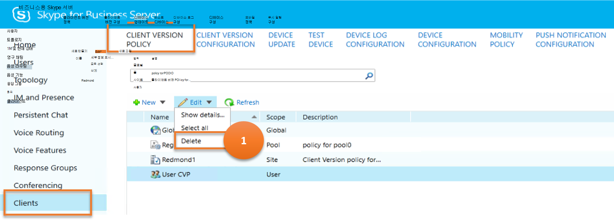
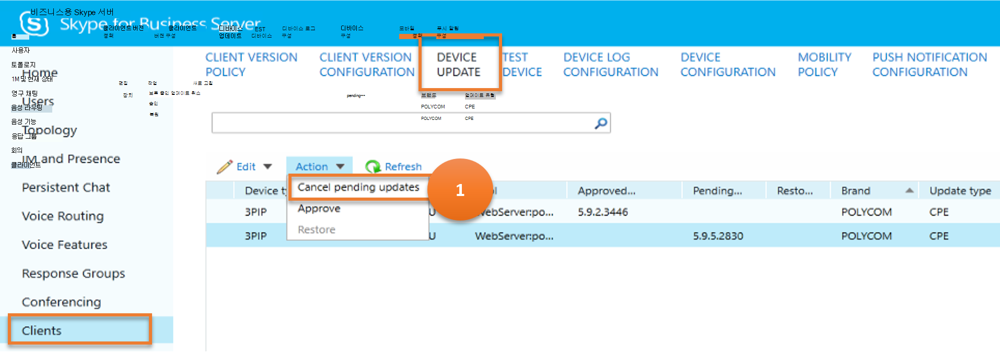
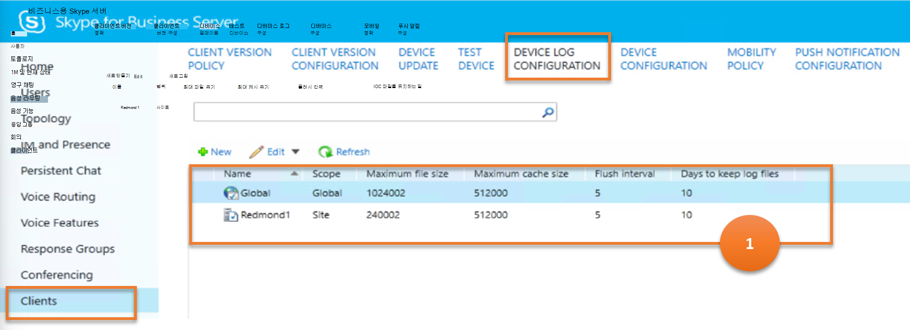
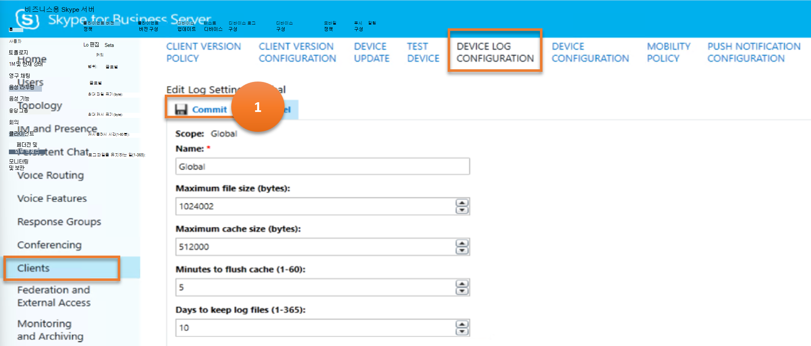

# <a name="client"></a>클라이언트

이 문서에서는 cmdlet을 사용하여  레거시 제어판의 클라이언트 메뉴 항목과 비슷한 결과를 얻을 수 있는 방법에 대해 설명합니다.

이 문서에서는 다음과 같은 하위 메뉴에 대해 설명합니다.

- [클라이언트](#client)
  - [클라이언트 버전 정책](#client-version-policy)
  - [클라이언트 버전 구성](#client-version-configuration)
  - [장치 업데이트](#device-update)
  - [장치 테스트](#test-device)
  - [장치 로그 구성](#device-log-configuration)
  - [장치 구성](#device-configuration)
  - [모바일 정책](#mobility-policy)
  - [푸시 알림 구성](#push-notification-configuration)

## <a name="client-version-policy"></a>클라이언트 버전 정책

클라이언트 **메뉴의 CLIENT VERSION POLICY** 하위 메뉴 항목은 클라이언트 환경에서 지원되는 클라이언트에 대한 비즈니스용 Skype 서버 반환합니다.  클라이언트 버전 정책을 사용하면 클라이언트 버전 시스템에 로그인할 수 있는 클라이언트를 비즈니스용 Skype 서버 있습니다.

사용자가 CLIENT **VERSION POLICY** 및 클라이언트 버전 정책에 대해 수행할 수 있는 다양한 작업을 비즈니스용 Skype cmdlet에 매핑합니다.

---
> **시나리오 1:** 모든 클라이언트 버전 정책 나열

   

***Cmdlet***

[Get-CsClientVersionPolicy](/powershell/module/skype/get-csclientversionpolicy)

***예***

```powershell
 Get-CsClientVersionPolicy
```

---

> **시나리오 2:** 새 클라이언트 버전 정책 만들기

   

***Cmdlet***

[New-CsClientVersionPolicy](/powershell/module/skype/new-csclientversionpolicy)  

***예***

```powershell
 New-CsClientVersionPolicy -Identity site:Redmond
```

---

> **시나리오 3:** 선택한 클라이언트 버전 정책에 대한 세부 정보 확인

   

***Cmdlet***

[Get-CsClientVersionPolicy](/powershell/module/skype/get-csclientversionpolicy)

***예***

```powershell
 Get-CsClientVersionPolicy -Identity site:Redmond
```

---

> **시나리오 4:** 선택한 클라이언트 버전 정책 삭제

   

***Cmdlet***

[Remove-CsClientVersionPolicy](/powershell/module/skype/remove-csclientversionpolicy)

***예***

```powershell
 Remove-CsClientVersionPolicy -Identity site:Redmond
```

---

> **시나리오 5:** 클라이언트 버전 정책 업데이트

   

- **주석 1 - 결과**

    이미지에 대한 이 주석은 결과, 즉 검색 및 표시되는 데이터를 나타냅니다.

    ***Cmdlet***

    [Get-CsClientVersionPolicyRule](/powershell/module/skype/get-csclientversionpolicyrule)

    ***예***

    ```powershell
    Get-CsClientVersionPolicyRule -Filter "Global/*"
    ```

- **주석 2 - 옵션(사용자용)**

    이미지에 대한 이 주석은 사용자가 구현하는 옵션, 즉 클라이언트 버전 정책 규칙의 세부 정보를 얻을 수 있는 옵션을 나타냅니다.

    ***Cmdlet***

    [Get-CsClientVersionPolicyRule](/powershell/module/skype/get-csclientversionpolicyrule)

    ***예***

    ```powershell
    Get-CsClientVersionPolicyRule -Identity "Global/2336c611-a243-4c5d-994b-eea8a524d0e4"
    ```

- **주석 3 - 옵션(사용자용)**

    이미지에 대한 이 주석은 사용자가 구현할 수 있는 옵션, 즉 새 클라이언트 버전 정책 규칙을 만들 수 있는 옵션을 나타냅니다.

    ***Cmdlet***

    [New-CsClientVersionPolicyRule](/powershell/module/skype/new-csclientversionpolicyrule)

    ***예***

    ```powershell
    $x = \[guid\]::NewGuid()

    New-CsClientVersionPolicyRule -Parent "site:Redmond" -RuleId $x -MajorVersion 4 -UserAgent InHouse
    ```

- **주석 4 - 옵션(사용자용)**

    이미지에 대한 이 주석은 사용자가 구현할 수 있는 옵션, 즉 새로 만든 클라이언트 버전 정책 규칙을 커밋/저장하기 위한 옵션을 나타냅니다.

    ***Cmdlet***

    [Set-CsClientVersionPolicy](/powershell/module/skype/set-csclientversionpolicy)

    ***예***

    ```powershell
    Set-CsClientVersionPolicy -Identity site:Redmond -Rules $Null

    $x = Get-CsClientVersionPolicy -Identity site:Dublin | Select-Object -ExpandProperty Rules

    Set-CsClientVersionPolicy -Identity site:Redmond -Rules $x
    ```

---

## <a name="client-version-configuration"></a>클라이언트 버전 구성

 CLIENT **VERSION CONFIGURATION** 하위 메뉴 항목은 클라이언트 환경에서 지원되는 클라이언트에 대한 비즈니스용 Skype 서버 반환합니다.

사용자가 클라이언트 버전 구성에 대해 수행할 수 있는 다양한 작업을 고려해 비즈니스용 Skype 매핑할 수 있습니다.

---
> **시나리오 1:** 모든 클라이언트 버전 구성 나열

   

***Cmdlet***

[Get-CsClientVersionConfiguration](/powershell/module/skype/get-csclientversionconfiguration)

***예***

```powershell
 Get-CsClientVersionConfiguration
```

---

> **시나리오 2:** 새 클라이언트 버전 구성 만들기

   

***Cmdlet***

[New-CsClientVersionConfiguration](/powershell/module/skype/new-csclientversionconfiguration)  

***예***

```powershell
 New-CsClientVersionConfiguration -Identity site:Redmond -Enabled $False
```

---

> **시나리오 3:** 선택한 클라이언트 버전 구성에 대한 세부 정보 확인

   

***Cmdlet***

[Get-CsClientVersionConfiguration](/powershell/module/skype/get-csclientversionconfiguration)

***예***

```powershell
 Get-CsClientVersionConfiguration -Identity site:Redmond
```

---

> **시나리오 4:** 선택한 클라이언트 버전 구성 삭제

   

***Cmdlet***

[Remove-CsClientVersionConfiguration](/powershell/module/skype/remove-csclientversionconfiguration)

***예***

```powershell
 Remove-CsClientVersionConfiguration -Identity site:Redmond
```

---

> **시나리오 5:** 클라이언트 버전 구성 업데이트

   

***Cmdlet***

[Set-CsClientVersionConfiguration](/powershell/module/skype/set-csclientversionconfiguration)

***예***

```powershell
Get-CsClientVersionConfiguration | Set-CsClientVersionConfiguration -DefaultURL "https://litwareinc.com/csclients"
```

---

> **시나리오 6:** 클라이언트 버전 구성 사용/사용 안 하도록 설정


***Cmdlet***

[Set-CsClientVersionConfiguration](/powershell/module/skype/set-csclientversionconfiguration)

***예***

```powershell
Set-CsClientVersionConfiguration -Identity site:Redmond -Enabled $False
```

---

## <a name="device-update"></a>장치 업데이트

**장치 업데이트** 규칙은 펌웨어 업데이트를 비즈니스용 Skype 전화 장치와 연결합니다.

사용자가 **DEVICE UPDATE에서** 수행할 수 있는 다양한 작업을 고려해 비즈니스용 Skype 이러한 작업을 매핑합니다.

---
> **시나리오 1:** 모든 장치 업데이트 나열

   

***Cmdlet***

[Get-CsDeviceUpdateRule](/powershell/module/skype/get-csdeviceupdaterule)

***예***

```powershell
 Get-CsDeviceUpdateRule
```

---

> **시나리오 2:** 장치 업데이트 삭제

   

***Cmdlet***

[Remove-CsDeviceUpdateRule](/powershell/module/skype/remove-csdeviceupdaterule)  

***예***

```powershell
 Remove-CsDeviceUpdateRule -Identity service:WebServer:atl-cs-001.litwareinc.com/d5ce3c10-2588-420a-82ac-dc2d9b1222ff9
```

---

> **시나리오 3:** 장치 업데이트 취소

   

***Cmdlet***

[Clear-CsDeviceUpdateFile](/powershell/module/skype/clear-csdeviceupdatefile)

***예***

```powershell
 Clear-CsDeviceUpdateFile -Identity "service:WebServer:atl-cs-001.litwareinc.com"
```

---

> **시나리오 4:** 장치 업데이트 승인

   

***Cmdlet***

[Approve-CsDeviceUpdateRule](/powershell/module/skype/approve-csdeviceupdaterule)

***예***

```powershell
 Approve-CsDeviceUpdateRule -Identity service:WebServer:atl-cs-001.litwareinc.com/d5ce3c10-2588-420a-82ac-dc2d9b1222ff9
```

---

> **시나리오 5:** 장치 업데이트 복원

   

***Cmdlet***

[Restore-CsDeviceUpdateRule](/powershell/module/skype/restore-csdeviceupdaterule)

***예***

```powershell
 Restore-CsDeviceUpdateRule -Identity service:WebServer:atl-cs-001.litwareinc.com/d5ce3c10-2588-420a-82ac-dc2d9b1222ff9
```

---

## <a name="test-device"></a>테스트 장치

테스트 **장치** 하위 메뉴 항목은 관리자가 펌웨어 업데이트를 조직의 모든 장치에 배포하기 전에 테스트할 수 있는 방법을 제공합니다.

사용자가 테스트 디바이스에서 수행할 수 있는 다양한 작업을 고려해 비즈니스용 Skype cmdlet이 매핑됩니다.

---
> **시나리오 1:** 모든 테스트 장치 나열

   

***Cmdlet***

[Get-CsTestDevice](/powershell/module/skype/get-cstestdevice)

***예***

```powershell
 Get-CsTestDevice
```

---

> **시나리오 2:** 새 테스트 장치 만들기

   

***Cmdlet***

[New-CsTestDevice](/powershell/module/skype/new-cstestdevice)  

***예***

```powershell
 New-CsTestDevice -Identity site:Redmond/UCPhone -IdentifierType SerialNumber -Identifier "07823-A345"
```

---

> **시나리오 3:** 선택한 테스트 장치에 대한 세부 정보 확인

   

***Cmdlet***

[Get-CsTestDevice](/powershell/module/skype/get-cstestdevice)

***예***

```powershell
 Get-CsTestDevice -Identity site:Redmond/UCPhone
```

---

> **시나리오 4:** 선택한 테스트 장치 삭제

   

***Cmdlet***

[Remove-CsTestDevice](/powershell/module/skype/remove-cstestdevice)

***예***

```powershell
 Remove-CsTestDevice -Identity site:Redmond
```

---

> **시나리오 5:** 테스트 장치 업데이트

   

***Cmdlet***

[Set-CsTestDevice](/powershell/module/skype/set-cstestdevice)

***예***

```powershell
Set-CsTestDevice -Identity site:Redmond/UCPhone -IdentifierType SerialNumber -Identifier "09768-ABDR-83295"
```

---

## <a name="device-log-configuration"></a>장치 로그 구성

**장치 로그 구성** 하위 메뉴 항목은 관리자가 펌웨어 업데이트를 배포할 수 있는 비즈니스용 Skype 서버 구성 요소인 장치 업데이트 웹 서비스를 관리하는 데 도움이 비즈니스용 Skype.

사용자가 장치 로그 구성에 대해 수행할 수 있는 다양한 작업을 고려해 비즈니스용 Skype cmdlet을 구성합니다.

---
> **시나리오 1:** 모든 장치 로그 구성 나열

   

***Cmdlet***

[Get-CsDeviceUpdateConfiguration](/powershell/module/skype/get-csdeviceupdateconfiguration)

***예***

```powershell
 Get-CsDeviceUpdateConfiguration
```

---

> **시나리오 2:** 새 장치 로그 구성 만들기

   

***Cmdlet***

[New-CsDeviceUpdateConfiguration](/powershell/module/skype/new-csdeviceupdateconfiguration)  

***예***

```powershell
 New-CsDeviceUpdateConfiguration -Identity site:Redmond "07823-A345"
```

---

> **시나리오 3:** 선택한 장치 로그 구성에 대한 세부 정보 확인

   

***Cmdlet***

[Get-CsDeviceUpdateConfiguration](/powershell/module/skype/get-csdeviceupdateconfiguration)

***예***

```powershell
 Get-CsDeviceUpdateConfiguration -Identity Global
```

---

> **시나리오 4:** 선택한 장치 로그 구성 삭제

   

***Cmdlet***

[Remove-CsDeviceUpdateConfiguration](/powershell/module/skype/remove-csdeviceupdateconfiguration)

***예***

```powershell
 Remove-CsDeviceUpdateConfiguration -Identity site:Redmond
```

---

> **시나리오 5:** 장치 로그 구성 업데이트

   

***Cmdlet***

[Set-CsDeviceUpdateConfiguration](/powershell/module/skype/set-csdeviceupdateconfiguration)

***예***

```powershell
Set-CsDeviceUpdateConfiguration -Identity global -MaxLogFileSize 2048000 -MaxLogCacheLimit 1024000
```

---

## <a name="device-configuration"></a>장치 구성

**장치 구성** 하위 메뉴 항목은 UC 전화의 관리 옵션에 대한 정보를 관리하는 데 도움이 됩니다. 이러한 옵션에는 필수 보안 모드와 지정된 기간 동안 비활성으로 전화가 자동으로 잠겨야 하는지 여부가 포함됩니다.

사용자가 장치 구성에 대해 수행할 수 있는 다양한 작업을 고려해 비즈니스용 Skype cmdlet을 구성합니다.

---

> **시나리오 1:** 모든 모바일 정책 나열

   

***Cmdlet***

[Get-CsUCPhoneConfiguration](/powershell/module/skype/get-csucphoneconfiguration)

***예***

```powershell
 Get-CsUCPhoneConfiguration
```

---

> **시나리오 2:** 새 장치 구성 만들기

   

***Cmdlet***

[New-CsUCPhoneConfiguration](/powershell/module/skype/new-csucphoneconfiguration)  

***예***

```powershell
 New-CsUCPhoneConfiguration -Identity site:Redmond -CalendarPollInterval "00:10:00" -LoggingLevel "Medium"
```

---

> **시나리오 3:** 선택한 장치 구성에 대한 세부 정보 확인

   

***Cmdlet***

[Get-CsUCPhoneConfiguration](/powershell/module/skype/get-csucphoneconfiguration)

***예***

```powershell
 Get-CsUCPhoneConfiguration -Identity site:Redmond
```

---

> **시나리오 4:** 선택한 장치 구성 삭제

   

***Cmdlet***

[Remove-CsUCPhoneConfiguration](/powershell/module/skype/remove-csucphoneconfiguration)

***예***

```powershell
 Remove-CsUCPhoneConfiguration -Identity site:Redmond
```

---

> **시나리오 5:** 장치 구성 업데이트

   

***Cmdlet***

[Set-CsUCPhoneConfiguration](/powershell/module/skype/set-csucphoneconfiguration)

***예***

```powershell
 Set-CsUCPhoneConfiguration -Identity site:Redmond -PhoneLockTimeout "00:30:00"
```

---

## <a name="mobility-policy"></a>모바일 정책

**모바일 정책은** 사용자가 모바일에서 사용할 수 비즈니스용 Skype 여부를 결정합니다. 또한 이러한 정책은 사용자가 회사번호로 전화를 거는 기능을 관리하는데, 이 기능을 사용하면 휴대폰에서 자신의 휴대폰 번호 대신 회사 전화 번호를 사용하여 전화를 걸고 받을 수 있습니다. 모바일 정책을 사용하여 통화를 걸거나 받을 Wi-Fi 연결을 요구하는 데도 사용할 수 있습니다.

사용자가 모바일 정책 및 모바일 정책에 대해 수행할 수 있는 다양한 작업을 비즈니스용 Skype cmdlet에 매핑합니다. 

---

> **시나리오 1:** 모든 모바일 정책 나열

   

***Cmdlet***

[Get-CsMobilityPolicy](/powershell/module/skype/get-csmobilitypolicy)

***예***

```powershell
 Get-CsMobilityPolicy
```

---

> **시나리오 2:** 새 모바일 정책 만들기

   

***Cmdlet***

[New-CsMobilityPolicy](/powershell/module/skype/new-csmobilitypolicy)  

***예***

```powershell
 New-CsMobilityPolicy -Identity site:Redmond -EnableOutsideVoice $False
```

---

> **시나리오 3:** 선택한 모바일 정책에 대한 세부 정보 확인

   

***Cmdlet***

[Get-CsMobilityPolicy](/powershell/module/skype/get-csmobilitypolicy)

***예***

```powershell
 Get-CsMobilityPolicy -Identity "site:Redmond"
```

---

> **시나리오 4:** 선택한 모바일 정책 삭제

   

***Cmdlet***

[Remove-CsMobilityPolicy](/powershell/module/skype/remove-csmobilitypolicy)

***예***

```powershell
 Remove-CsMobilityPolicy -Identity "site:Redmond"
```

---

> **시나리오 5:** 모바일 정책 업데이트

   

***Cmdlet***

[Set-CsMobilityPolicy](/powershell/module/skype/set-csmobilitypolicy)

***예***

```powershell
Set-CsMobilityPolicy -Identity "site:Redmond" -EnableOutsideVoice $False
```

---

## <a name="push-notification-configuration"></a>푸시 알림 구성

푸시 알림 서비스(Apple 푸시 알림 서비스 및 Microsoft 푸시 알림 서비스)는 새 인스턴트 메시지 또는 새 음성 메일과 같은 이벤트에 대한 알림을 iPhone 및 Windows 모바일 장치로 보낼 수 있는 방법을 제공합니다. 이러한 알림은 해당 장치의 비즈니스용 Skype 응용 프로그램이 현재 일시 중단되거나 백그라운드에서 실행 중인 경우에도 전송하도록 구성됩니다.

사용자가 푸시 알림 구성에 대해 수행할 수 있는 다양한 작업을 고려해 비즈니스용 Skype 매핑할 수 있습니다.

---

> **시나리오 1:** 모든 모바일 정책 나열

   

***Cmdlet***

[Get-CsPushNotificationConfiguration](/powershell/module/skype/get-cspushnotificationconfiguration)

***예***

```powershell
 Get-CsPushNotificationConfiguration
```

---

> **시나리오 2:** 새 푸시 알림 구성 만들기

   

***Cmdlet***

[New-CsPushNotificationConfiguration](/powershell/module/skype/new-cspushnotificationconfiguration)  

***예***

```powershell
 New-CsPushNotificationConfiguration -Identity "site:Redmond" -EnableApplePushNotificationService $True -EnableMicrosoftPushNotificationService -$True
```

---

> **시나리오 3:** 선택한 푸시 알림 구성에 대한 세부 정보 확인

   

***Cmdlet***

[Get-CsPushNotificationConfiguration](/powershell/module/skype/get-cspushnotificationconfiguration)

***예***

```powershell
 Get-CsPushNotificationConfiguration -Identity "site:Redmond"
```

---

> **시나리오 4:** 선택한 푸시 알림 구성 삭제

   

***Cmdlet***

[Remove-CsPushNotificationConfiguration](/powershell/module/skype/remove-cspushnotificationconfiguration)

***예***

```powershell
 Remove-CsPushNotificationConfiguration -Identity "site:Redmond"
```

---

> **시나리오 5:** 푸시 알림 구성 업데이트

   

***Cmdlet***

[Set-CsPushNotificationConfiguration](/powershell/module/skype/set-cspushnotificationconfiguration)

***예***

```powershell
 Set-CsPushNotificationConfiguration -Identity "site:Redmond" -EnableApplePushNotificationService $False
```

---
