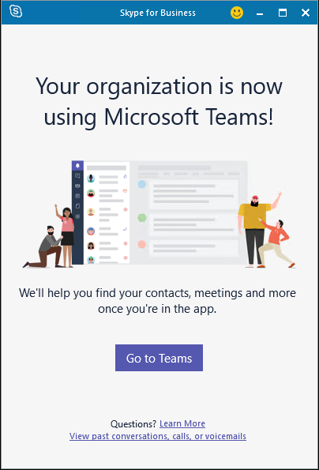

# <a name="move-users-from-on-premises-to-teams"></a><span data-ttu-id="cd4c2-103">사용자를 온-프레미스에서 Teams로 이동</span><span class="sxs-lookup"><span data-stu-id="cd4c2-103">Move users from on-premises to Teams</span></span>

<span data-ttu-id="cd4c2-104">사용자가 프레미스에서 Teams 전용으로 이동하면 사용자의 비즈니스용 Skype 홈이 사내에서 온라인으로 이동하고 사용자에게 mode=TeamsOnly를 통해 TeamsUpgradePolicy가 할당됩니다.</span><span class="sxs-lookup"><span data-stu-id="cd4c2-104">When a user is moved from on premises to Teams Only, the user’s Skype for Business home is moved from on premises to online and the user is assigned TeamsUpgradePolicy with mode=TeamsOnly.</span></span>  <span data-ttu-id="cd4c2-105">사용자가 사내에서 TeamsOnly 모드로 이동된 후:</span><span class="sxs-lookup"><span data-stu-id="cd4c2-105">After a user is moved from on-premises to TeamsOnly mode:</span></span>

- <span data-ttu-id="cd4c2-106">다른 사용자의 모든 수신 전화 및 채팅(비즈니스용 Skype 또는 Teams에서 전송)은 사용자의 Teams 클라이언트에 연결됩니다.</span><span class="sxs-lookup"><span data-stu-id="cd4c2-106">All incoming calls and chats from other users (whether sent from Skype for Business or Teams), will land in the user’s Teams client.</span></span>
- <span data-ttu-id="cd4c2-107">사용자는 비즈니스용 Skype를 사용하는 다른 사용자(온라인 또는 프레미스에 관계 없이)와 상호 협력할 수 있습니다.</span><span class="sxs-lookup"><span data-stu-id="cd4c2-107">The user will be able to interoperate with other users who use Skype for Business (whether online or on premises).</span></span>
- <span data-ttu-id="cd4c2-108">사용자는 페더러 조직의 사용자와 통신할 수 있습니다.</span><span class="sxs-lookup"><span data-stu-id="cd4c2-108">The user will be able to communicate with users in federated organizations.</span></span>
- <span data-ttu-id="cd4c2-109">해당 사용자가 예약한 새 모임이 Teams 모임입니다.</span><span class="sxs-lookup"><span data-stu-id="cd4c2-109">New meetings scheduled by that user are Teams meetings.</span></span>
- <span data-ttu-id="cd4c2-110">사용자는 여전히 비즈니스용 Skype 모임에 참가할 수 있습니다.</span><span class="sxs-lookup"><span data-stu-id="cd4c2-110">User can still join any Skype for Business meetings.</span></span>
- <span data-ttu-id="cd4c2-111">앞으로 예약된 사용자의 기존 모임은 사내에서 Teams로 마이그레이션됩니다.</span><span class="sxs-lookup"><span data-stu-id="cd4c2-111">The user’s pre-existing meetings scheduled for the future will be migrated from on-premises to Teams.</span></span>
- <span data-ttu-id="cd4c2-112">사용자가 처음으로 로그온한 직후에 Teams에서 사내에 있는 연락처를 사용할 수 있습니다.</span><span class="sxs-lookup"><span data-stu-id="cd4c2-112">Contacts that existed on-premises are available in Teams shortly after the user logs on for the first time.</span></span>
- <span data-ttu-id="cd4c2-113">사용자는 비즈니스용 Skype에서 통화 또는 채팅을 시작하거나 비즈니스용 Skype에서 새 모임을 예약할 수 없습니다.</span><span class="sxs-lookup"><span data-stu-id="cd4c2-113">Users cannot initiate calls or chats from Skype for Business, nor can they schedule new meetings in Skype for Business.</span></span> <span data-ttu-id="cd4c2-114">사용자가 비즈니스용 Skype 클라이언트를 열려고 하면 아래와 같이 Teams를 사용하게 리디렉션됩니다.</span><span class="sxs-lookup"><span data-stu-id="cd4c2-114">If they attempt to open the Skype for Business client, they will be redirected to use Teams as shown below.</span></span> <span data-ttu-id="cd4c2-115">Teams 클라이언트가 설치되어 있지 않은 경우 브라우저를 사용하여 웹 버전의 Teams로 연결됩니다.</span><span class="sxs-lookup"><span data-stu-id="cd4c2-115">If the Teams client is not installed, they will be directed to the web version of Teams using their browser.</span></span><br><br>
    <span data-ttu-id="cd4c2-116"></span><span class="sxs-lookup"><span data-stu-id="cd4c2-116"></span></span>

<span data-ttu-id="cd4c2-117">사용자를 이동하기 전에 사용자를 클라우드로 이동하기 위한 선행 준비를 검토해야 합니다. [](move-users-between-on-premises-and-cloud.md#prerequisites)</span><span class="sxs-lookup"><span data-stu-id="cd4c2-117">Before moving any users, be sure to review the [prerequisites](move-users-between-on-premises-and-cloud.md#prerequisites) to move users to the cloud.</span></span> <span data-ttu-id="cd4c2-118">또한 Teams를 비즈니스용 Skype와 함께 사용하는 조직에 대한 마이그레이션 및 상호 관리 지침을 [검토해야 합니다.](/microsoftteams/migration-interop-guidance-for-teams-with-skype)</span><span class="sxs-lookup"><span data-stu-id="cd4c2-118">Also be sure to review [Migration and interoperability guidance for organizations using Teams together with Skype for Business](/microsoftteams/migration-interop-guidance-for-teams-with-skype).</span></span>


> [!NOTE]
> <span data-ttu-id="cd4c2-119">연락처를 Teams로 이동하려면 프레미스 SfB 계정에서 통합 연락처 저장소를 사용하지 않도록 설정해야 합니다.</span><span class="sxs-lookup"><span data-stu-id="cd4c2-119">Unified Contact Store should be disabled on the on-prem SfB account for the contact to be moved to Teams.</span></span>


<span data-ttu-id="cd4c2-120">사용자를 프레미스에서 Teams로 이동하는 방법에는 다음 두 가지가 있습니다.</span><span class="sxs-lookup"><span data-stu-id="cd4c2-120">There are two methods to move a user from on premises to Teams:</span></span>

- <span data-ttu-id="cd4c2-121">비즈니스용 Skype 서버 2015 CU8 이전 버전을 사용하는 경우 이동에는 두 단계가 필요합니다(필요한 경우 한 단계로 함께 스크립팅할 수 있습니다.</span><span class="sxs-lookup"><span data-stu-id="cd4c2-121">If you are using a version earlier than Skype for Business Server 2015 CU8, the move requires two steps (which can be scripted to be done together as a single step, if desired):</span></span>
  - <span data-ttu-id="cd4c2-122">[사용자를 비즈니스용 Skype 서버(프레미스)에서](move-users-from-on-premises-to-skype-for-business-online.md)비즈니스용 Skype Online으로 이동</span><span class="sxs-lookup"><span data-stu-id="cd4c2-122">[Move the user from Skype for Business Server (on premises) to Skype for Business Online](move-users-from-on-premises-to-skype-for-business-online.md).</span></span>
  - <span data-ttu-id="cd4c2-123">사용자가 비즈니스용 Skype Online에 있는 경우 mode= TeamsOnly를 통해 사용자에게 TeamsUpgradePolicy를 할당합니다.</span><span class="sxs-lookup"><span data-stu-id="cd4c2-123">Once the user is homed in Skype for Business Online, assign the user TeamsUpgradePolicy with mode= TeamsOnly.</span></span> <span data-ttu-id="cd4c2-124">TeamsOnly 모드를 부여하기 위해 비즈니스용 Skype Online PowerShell 창에서 다음 cmdlet을 실행합니다. `Grant-CsTeamsUpgradePolicy -Identity $user -PolicyName UpgradeToTeams`</span><span class="sxs-lookup"><span data-stu-id="cd4c2-124">To grant TeamsOnly mode, run the following cmdlet from a Skype for Business Online PowerShell window: `Grant-CsTeamsUpgradePolicy -Identity $user -PolicyName UpgradeToTeams`</span></span>
- <span data-ttu-id="cd4c2-125">비즈니스용 Skype 서버 2015 CU8 이상에서 관리 도구가 있는 경우 위의 방법을 사용할 수도 있습니다. 또는 아래 설명된 대로 한 단계에서 이 이동을 할 수 있습니다.</span><span class="sxs-lookup"><span data-stu-id="cd4c2-125">If you have admin tools from Skype for Business Server 2015 CU8 or later, you can use the method above, or you can do this move in one step as described below.</span></span> <span data-ttu-id="cd4c2-126">또한 선택적으로 Teams 전용으로 이동하기 전에 비즈니스용 Skype 클라이언트 내에서 알림을 제공할 수 있습니다. 또한 선택적으로 비즈니스용 Skype 클라이언트에서 Teams 클라이언트를 자동으로 다운로드할 수 있습니다.</span><span class="sxs-lookup"><span data-stu-id="cd4c2-126">In addition, you can optionally provide a notification within the Skype for Business client prior to moving them to Teams Only as well as optionally have the Teams client silently downloaded by the Skype for Business client.</span></span>

## <a name="move-a-user-directly-from-skype-for-business-on-premises-to-teams-only"></a><span data-ttu-id="cd4c2-127">사용자를 프레미스 비즈니스용 Skype에서 Teams 전용으로 직접 이동</span><span class="sxs-lookup"><span data-stu-id="cd4c2-127">Move a user directly from Skype for Business on premises to Teams Only</span></span>

<span data-ttu-id="cd4c2-128">비즈니스용 Skype 서버 2015 및 비즈니스용 Skype 서버 2019의 프레미스 관리 도구를 사용하면 아래 설명된 바와 같이 PowerShell의 Move-CsUser cmdlet 또는 비즈니스용 Skype 서버 제어판을 사용하여 단일 단계에서 사용자를 프레미스에서 Teams 전용 모드로 이동할 수 있습니다.</span><span class="sxs-lookup"><span data-stu-id="cd4c2-128">The on-premises admin tools in Skype for Business Server 2015 with CU8, as well as in Skype for Business Server 2019, enable you to move users from on premises to Teams Only mode in a single step using either the Move-CsUser cmdlet in PowerShell or the Skype for Business Server Control Panel, as described below.</span></span>

### <a name="move-to-teams-using-move-csuser"></a><span data-ttu-id="cd4c2-129">팀을 사용하여 Teams로 Move-CsUser</span><span class="sxs-lookup"><span data-stu-id="cd4c2-129">Move to Teams using Move-CsUser</span></span>

<span data-ttu-id="cd4c2-130">Move-CsUser 비즈니스용 Skype 관리 셸 PowerShell 창에서 사용할 수 있습니다.</span><span class="sxs-lookup"><span data-stu-id="cd4c2-130">Move-CsUser is available from an on-premises Skype for Business Management Shell PowerShell window.</span></span> <span data-ttu-id="cd4c2-131">아래 단계와 필요한 사용 권한은 사용자를 비즈니스용 Skype Online으로 이동하는 작업과 동일합니다. 단, MoveToTeams 스위치도 지정해야 하며 사용자에게 Teams에 대한 라이선스(비즈니스용 Skype Online 외에)도 부여되어야 합니다.</span><span class="sxs-lookup"><span data-stu-id="cd4c2-131">The steps below and permissions required are the same as moving a user to Skype for Business Online, except that you must also specify the MoveToTeams switch and you must ensure that the user has also been granted a license for Teams (in addition to Skype for Business Online).</span></span>

<span data-ttu-id="cd4c2-132">필수 관리 자격 증명 에 설명된 바와 같이, 사내 환경과 클라우드 서비스(Microsoft 365 또는 Office 365)에 충분한 권한이 [있어야 합니다.](move-users-between-on-premises-and-cloud.md#required-administrative-credentials)</span><span class="sxs-lookup"><span data-stu-id="cd4c2-132">You must have sufficient privileges in both the on-premises environment and the cloud service (Microsoft 365 or Office 365), as described in [Required administrative credentials](move-users-between-on-premises-and-cloud.md#required-administrative-credentials).</span></span> <span data-ttu-id="cd4c2-133">두 환경에서 권한이 있는 단일 계정을 사용할 수도 있습니다. 또는 사내 자격 증명으로 비즈니스용 Skype 서버 관리 셸 창을 시작하고 이 매개 변수를 사용하여 필요한 관리 역할이 있는 `-Credential` Microsoft 365 또는 Office 365 계정에 대한 자격 증명을 지정할 수 있습니다.</span><span class="sxs-lookup"><span data-stu-id="cd4c2-133">You can either use a single account that has privileges in both environments, or you can start an on-premises Skype for Business Server Management Shell window with on-premises credentials, and use the `-Credential` parameter to specify credentials for a Microsoft 365 or Office 365 account with the necessary administrative role.</span></span>

<span data-ttu-id="cd4c2-134">Move-CsUser를 사용하여 사용자를 Teams 전용 모드로 이동:</span><span class="sxs-lookup"><span data-stu-id="cd4c2-134">To move a user to Teams Only mode using Move-CsUser:</span></span>

- <span data-ttu-id="cd4c2-135">매개 변수를 사용하여 이동할 사용자를 `Identity` 지정합니다.</span><span class="sxs-lookup"><span data-stu-id="cd4c2-135">Specify the user to move using the `Identity` parameter.</span></span>
- <span data-ttu-id="cd4c2-136">-Target 매개 변수를 값 "sipfed.online.lync"로 지정합니다. <span> com".</span><span class="sxs-lookup"><span data-stu-id="cd4c2-136">Specify the     -Target     parameter with the value “sipfed.online.lync.<span>com”.</span></span>
- <span data-ttu-id="cd4c2-137">스위치를 `MoveToTeams` 지정합니다.</span><span class="sxs-lookup"><span data-stu-id="cd4c2-137">Specify the `MoveToTeams` switch.</span></span>
- <span data-ttu-id="cd4c2-138">사내 및 클라우드 서비스(Microsoft 365 또는 Office 365)에서 충분한 사용 권한이 있는 계정이 하나도 없는 경우 매개 변수를 사용하여 Office 365에 충분한 사용 권한을 제공하는 계정을 `-credential` 제공합니다.</span><span class="sxs-lookup"><span data-stu-id="cd4c2-138">If you do not have one account with sufficient permissions in both on premises and the cloud service (Microsoft 365 or Office 365), use the `-credential` parameter to supply an account with sufficient permissions in Office 365.</span></span>
- <span data-ttu-id="cd4c2-139">Microsoft 365 또는 Office 365에서 사용 권한이 있는 계정이 "onmicrosoft"로 끝나지 않는 경우. <span> com", 필수 관리 자격 증명에 설명된 올바른 값을 사용하여 매개 `-HostedMigrationOverrideUrl` [변수를 지정해야 합니다.](move-users-between-on-premises-and-cloud.md#required-administrative-credentials)</span><span class="sxs-lookup"><span data-stu-id="cd4c2-139">If the account with permissions in Microsoft 365 or Office 365 does not end in “onmicrosoft.<span>com”, you must specify the `-HostedMigrationOverrideUrl` parameter, with the correct value as described in [Required administrative credentials](move-users-between-on-premises-and-cloud.md#required-administrative-credentials).</span></span>

<span data-ttu-id="cd4c2-140">다음 cmdlet 시퀀스를 사용하여 사용자를 TeamsOnly로 이동할 수 있으며 Microsoft 365 또는 Office 365 자격 증명이 별도의 계정으로 제공된 것으로 가정하고 Get-Credential 프롬프트에 대한 입력으로 제공됩니다.</span><span class="sxs-lookup"><span data-stu-id="cd4c2-140">The following cmdlet sequence can be used to move a user to TeamsOnly, and assumes the Microsoft 365 or Office 365 credential is a separate account and supplied as input for the Get-Credential prompt.</span></span>

  ```powershell
  $cred=Get-Credential
  $url="https://admin1a.online.lync.com/HostedMigration/hostedmigrationService.svc"
  Move-CsUser -Identity username@contoso.com -Target sipfed.online.lync.com -MoveToTeams -Credential $cred -HostedMigrationOverrideUrl $url
  ```

> [!TIP]
> <span data-ttu-id="cd4c2-141">서로 다른 매개 변수가 필요한 상황에 따라 대부분의 경우 기본 명령은 다음을 나타냅니다.</span><span class="sxs-lookup"><span data-stu-id="cd4c2-141">As there are different circumstances requiring different parameters, the default command for most cases is:</span></span>

```powershell
Move-CsUser -Identity username@contoso.com -Target sipfed.online.lync.com -MoveToTeams -UseOAuth -HostedMigrationOverrideUrl $url
```

### <a name="move-to-teams-using-skype-for-business-server-control-panel"></a><span data-ttu-id="cd4c2-142">비즈니스용 Skype 서버 제어판을 사용하여 Teams로 이동</span><span class="sxs-lookup"><span data-stu-id="cd4c2-142">Move to Teams using Skype for Business Server Control Panel</span></span>

1. <span data-ttu-id="cd4c2-143">비즈니스용 Skype 서버 제어판 앱을 니다.</span><span class="sxs-lookup"><span data-stu-id="cd4c2-143">Open the Skype for Business Server Control Panel app.</span></span>
2. <span data-ttu-id="cd4c2-144">왼쪽 탐색에서 사용자 를 **선택 합니다.**</span><span class="sxs-lookup"><span data-stu-id="cd4c2-144">In the left navigation, choose **Users**.</span></span>
3. <span data-ttu-id="cd4c2-145">**찾기를** 사용하여 Teams로 이동할 사용자를 찾습니다.</span><span class="sxs-lookup"><span data-stu-id="cd4c2-145">Use **Find** to locate the user(s) you would like to move to Teams.</span></span>
4. <span data-ttu-id="cd4c2-146">사용자를 선택하고 목록 위의 작업 드롭다운에서 선택한 사용자를  **Teams로 이동을 선택합니다.**</span><span class="sxs-lookup"><span data-stu-id="cd4c2-146">Select the user(s), and then, from the **Action** dropdown above the list, choose **Move selected users to Teams**.</span></span>
5. <span data-ttu-id="cd4c2-147">마법사에서 **다음** 을 클릭합니다.</span><span class="sxs-lookup"><span data-stu-id="cd4c2-147">In the wizard, click **Next**.</span></span>
6. <span data-ttu-id="cd4c2-148">메시지가 표시될 경우 .onmicrosoft.com 계정으로 Microsoft 365 또는 Office 365에 로그인합니다.</span><span class="sxs-lookup"><span data-stu-id="cd4c2-148">If prompted, sign in to Microsoft 365 or Office 365 with an account that ends in .onmicrosoft.com and has sufficient permissions.</span></span>
7. <span data-ttu-id="cd4c2-149">**다음을** 클릭하고 **다음을** 한 번 더 클릭하여 사용자를 이동합니다.</span><span class="sxs-lookup"><span data-stu-id="cd4c2-149">Click **Next**, and then **Next** one more time to move the user.</span></span>
8. <span data-ttu-id="cd4c2-150">성공 또는 실패와 관련한 상태 메시지는 마법사가 아니라 주 제어판 앱의 맨 위에 제공됩니다.</span><span class="sxs-lookup"><span data-stu-id="cd4c2-150">Note that status messages regarding success or failure are provided at the top of the main Control Panel app, not in the wizard.</span></span>

## <a name="notify-your-skype-for-business-on-premises-users-of-the-upcoming-move-to-teams"></a><span data-ttu-id="cd4c2-151">비즈니스용 Skype의 사내 사용자에게 Teams로의 예정된 이동을 알릴 수 있습니다.</span><span class="sxs-lookup"><span data-stu-id="cd4c2-151">Notify your Skype for Business on-premises users of the upcoming move to Teams</span></span>

<span data-ttu-id="cd4c2-152">비즈니스용 Skype 서버 2015 및 비즈니스용 Skype 서버 2019의 비즈니스용 Skype 서버 2015의 프레미스 관리 도구를 사용하여 예정된 Teams로의 예정된 이동을 비즈니스용 Skype 사용자에게 알릴 수 있습니다.</span><span class="sxs-lookup"><span data-stu-id="cd4c2-152">The on-premises admin tools in Skype for Business Server 2015 with CU8, as well as in Skype for Business Server 2019, enable you to notify on-premises Skype for Business users of their upcoming move to Teams.</span></span> <span data-ttu-id="cd4c2-153">이러한 알림을 사용하도록 설정하면 사용자에게 아래 표시된 비즈니스용 Skype 클라이언트(Win32, Mac, 웹 및 모바일)에서 알림이 표시됩니다.</span><span class="sxs-lookup"><span data-stu-id="cd4c2-153">When you enable these notifications, users will see a notification in their Skype for Business client (Win32, Mac, web, and mobile) as shown below.</span></span> <span data-ttu-id="cd4c2-154">사용자가 시도 **단추를 클릭하면** Teams 클라이언트가 설치된 경우 실행됩니다. 그렇지 않으면 사용자가 브라우저에서 Teams의 웹 버전으로 이동합니다.</span><span class="sxs-lookup"><span data-stu-id="cd4c2-154">If users click the **Try it** button, the Teams client will be launched if it is installed; otherwise, users will be navigated to the web version of Teams in their browser.</span></span> <span data-ttu-id="cd4c2-155">기본적으로 알림을 사용하도록 설정하면 Win32 비즈니스용 Skype 클라이언트는 사용자를 Teams 전용 모드로 이동하기 전에 풍부한 클라이언트를 사용할 수 있도록 Teams 클라이언트를 자동으로 다운로드합니다. 그러나 이 동작을 사용하지 않도록 설정할 수도 있습니다.</span><span class="sxs-lookup"><span data-stu-id="cd4c2-155">By default, when notifications are enabled, Win32 Skype for Business clients silently download the Teams client so that the rich client is available prior to moving the user to Teams Only mode; however, you can also disable this behavior.</span></span>  <span data-ttu-id="cd4c2-156">알림은 의 On-프레미스 버전을 사용하여 구성하며, Win32 클라이언트에 대한 자동 다운로드는 `TeamsUpgradePolicy` 사내 `TeamsUpgradeConfiguration` cmdlet을 통해 제어됩니다.</span><span class="sxs-lookup"><span data-stu-id="cd4c2-156">Notifications are configured using the on-premises version of `TeamsUpgradePolicy`, and silent download for Win32 clients is controlled via the on-premises `TeamsUpgradeConfiguration` cmdlet.</span></span>

> [!TIP]
> <span data-ttu-id="cd4c2-157">일부 서버는 CU8을 통해 비즈니스용 Skype 2015에서 작동하기 위해 다시 시작해야 할 수 있습니다.</span><span class="sxs-lookup"><span data-stu-id="cd4c2-157">Some servers may need to reboot for this to work in Skype for Business 2015 with CU8.</span></span>


<span data-ttu-id="cd4c2-159">곧 Teams로 업그레이드될 것임에 대한 알림을 사내 사용자에게 알리기 위해 NotifySfBUsers=true를 사용하여 TeamsUpgradePolicy의 새 인스턴스를 만들 수 있습니다.</span><span class="sxs-lookup"><span data-stu-id="cd4c2-159">To notify on-premises users that they will soon be upgraded to Teams, create a new instance of TeamsUpgradePolicy with NotifySfBUsers=true.</span></span> <span data-ttu-id="cd4c2-160">그런 다음 사용자에게 직접 정책을 할당하거나 사이트, 풀 또는 전역 수준에서 정책을 설정하여 알림을 하려는 사용자에게 해당 정책을 할당합니다.</span><span class="sxs-lookup"><span data-stu-id="cd4c2-160">Then assign that policy to the users who you want to notify, either by assigning the policy directly to the user or by setting the policy at the site, pool, or global level.</span></span> <span data-ttu-id="cd4c2-161">다음 cmdlet은 사용자 수준 정책을 만들고 부여합니다.</span><span class="sxs-lookup"><span data-stu-id="cd4c2-161">The following cmdlets create and grant a user-level policy:</span></span>

```powershell
New-CsTeamsUpgradePolicy -Identity EnableNotifications -NotifySfbUser $true
Grant-CsTeamsUpgradePolicy -Identity username@contoso.com -PolicyName EnableNotifications
```

<span data-ttu-id="cd4c2-162">비즈니스용 Skype Win32 클라이언트를 통해 Teams의 자동 다운로드는 DownloadTeams 매개 변수를 사용하여 사내 TeamsUpgradeConfiguration cmdlet을 통해 제어됩니다.</span><span class="sxs-lookup"><span data-stu-id="cd4c2-162">Automatic download of Teams via the Skype for Business Win32 client is controlled via the on-premises TeamsUpgradeConfiguration cmdlet with the DownloadTeams parameter.</span></span> <span data-ttu-id="cd4c2-163">전역, 사이트 및 풀 수준에서 이 구성을 만들 수 있습니다.</span><span class="sxs-lookup"><span data-stu-id="cd4c2-163">You create this configuration on a global, site, and pool level.</span></span> <span data-ttu-id="cd4c2-164">예를 들어 다음 명령은 Redmond1 사이트에 대한 구성을 만듭니다.</span><span class="sxs-lookup"><span data-stu-id="cd4c2-164">For example, the following command creates the configuration for the site Redmond1:</span></span>

```powershell
New-CsTeamsUpgradeConfiguration -Identity "site:redmond1"
```

<span data-ttu-id="cd4c2-165">기본적으로 DownloadTeams 값은 True입니다. 그러나 특정 *사용자에* 대해 NotifySfbUser = True인 경우만 사용할 수 있습니다.</span><span class="sxs-lookup"><span data-stu-id="cd4c2-165">By default, the value of DownloadTeams is True; however, it is *only* honored if NotifySfbUser = True for a given user.</span></span>

## <a name="see-also"></a><span data-ttu-id="cd4c2-166">참고 항목</span><span class="sxs-lookup"><span data-stu-id="cd4c2-166">See also</span></span>

[<span data-ttu-id="cd4c2-167">Move-CsUser</span><span class="sxs-lookup"><span data-stu-id="cd4c2-167">Move-CsUser</span></span>](/powershell/module/skype/move-csuser)

[<span data-ttu-id="cd4c2-168">Grant-CsTeamsUpgradePolicy</span><span class="sxs-lookup"><span data-stu-id="cd4c2-168">Grant-CsTeamsUpgradePolicy</span></span>](/powershell/module/skype/grant-csteamsupgradepolicy
)

[<span data-ttu-id="cd4c2-169">Team를 비즈니스용 Skype와 함께 사용하는 조직에 대한 마이그레이션 및 상호 운용성 가이드</span><span class="sxs-lookup"><span data-stu-id="cd4c2-169">Migration and interoperability guidance for organizations using Teams together with Skype for Business</span></span>](/microsoftteams/migration-interop-guidance-for-teams-with-skype)

[<span data-ttu-id="cd4c2-170">비즈니스용 Skype와 공존</span><span class="sxs-lookup"><span data-stu-id="cd4c2-170">Coexistence with Skype for Business</span></span>](/microsoftteams/coexistence-chat-calls-presence)