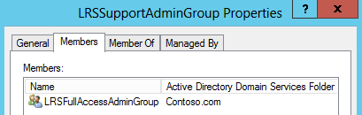

# <a name="deploy-srs-v1-administrative-web-portal-in-skype-for-business-server"></a>비즈니스용 Skype 서버에서 SRS v1 관리 웹 포털 배포

비즈니스용 Skype 서버 Skype (SRS v1, 이전의 Lync 대화방 시스템) 관리 웹 포털은 조직에서 Skype 대화방 시스템 회의실을 유지 관리 하는 데 사용할 수 있는 웹 포털입니다. 관리자는 SRS v1 관리 웹 포털을 사용 하 여 오디오/비디오 장치 모니터링과 같은 디바이스 상태를 모니터링할 수 있습니다. 이 포털을 사용 하면 관리자가 진단 정보를 원격으로 수집 하 여 회의실 상태를 모니터링할 수 있습니다.

이 기능을 사용 하려면 모든 비즈니스용 Skype Server 프런트 엔드 서버에 SRS v1 관리 웹 포털을 배포 해야 합니다. 이 가이드에서는 관리자가 SRS 관리 웹 포털을 설치 하 고 구성 하는 방법에 대 한 지침을 제공 합니다. 이는 비즈니스용 Skype 서버 관리에 대 한 지식이 있고, 비즈니스용 Skype 서버 토폴로지를 수정할 수 있는 관리자 권한이 있는 관리자를 대상으로 합니다.

SRS v1 관리 웹 포털이 서버에 배포 된 후 관리자는 자신의 컴퓨터 또는 랩톱에서 사이트에 로그온 하 여 상태 SRS v1 장치를 확인할 수 있습니다.

> [!IMPORTANT]
> 비즈니스용 [Skype 서버 2015에 대 한 Microsoft Skype 대화방 시스템 V1 관리 웹 포털](https://www.microsoft.com/en-us/download/details.aspx?id=46906)을 다운로드 하세요.

이 항목의 내용:

- [SRS v1 관리 웹 포털에 대 한 환경 구성](room-system-v1-administrative-web-portal.md#Config_Env)

- [SRS v1 관리 웹 포털 설치](room-system-v1-administrative-web-portal.md#Install_SRS)

- [SRS 관리 웹 포털 사용](room-system-v1-administrative-web-portal.md#Use_Portal)

## <a name="configure-your-environment-for-the-srs-v1-administrative-web-portal"></a>SRS v1 관리 웹 포털에 대 한 환경 구성
<a name="Config_Env"> </a>

SRS v1 관리 웹 포털을 사용 하려면 다음 필수 구성 요소를 설치 하거나 구성 해야 합니다.

> [!IMPORTANT]
> 서버가 Kerberos 및 NTLM 인증을 모두 사용 하도록 구성 되었고 SRS가 도메인에 가입 되어 있지 않은 컴퓨터에서 실행 되는 경우 Kerberos 인증은 실패 하 고 사용자는 관리 포털에서 SRS의 상태를 볼 수 없습니다. 이 문제를 해결 하려면 ntlm 인증 또는 NTLM 및 TLS DSK 인증 (Kerberos 불포함)을 사용 하 여 서버를 구성 하거나 SRS 컴퓨터를 도메인에 참가 합니다.

1. 비즈니스용 Skype 서버 토폴로지에 비즈니스용 Skype 서버 누적 업데이트를 설치 합니다.

    업데이트를 다운로드 하거나 포함 된 항목을 확인 하려면 [비즈니스용 Skype 서버 2015에 대 한 업데이트](https://support.microsoft.com/en-us/help/3061064/updates-for-skype-for-business-server-2015)를 참조 하세요.

2. SIP 지원 Active Directory 사용자를 만듭니다.

    SRS v1 관리 웹 포털은 이러한 자격 증명을 사용 하 여 비즈니스용 Skype 서버에서 정보를 쿼리 합니다. 제공 된 예제에서 사용자 이름은 LRSApp입니다.

3. 이름 LRSSupportAdminGroup를 사용 하 여 Active Directory 보안 그룹을 만듭니다.

    그룹 범위가 전역 및 그룹 유형으로 보안으로 지정 된 그룹을 만듭니다. SIP 사용이 가능이 그룹에 추가 된 사용자는 채팅방 목록을 볼 수 있도록 승인 되 고 로그 수집과 같은 특정 명령을 실행 합니다.

4. 이름 LRSFullAccessAdminGroup를 사용 하 여 Active Directory 보안 그룹을 만듭니다.

    그룹 범위가 글로벌이 고 그룹 유형이 보안으로 설정 된 그룹을 만듭니다 .이 그룹에 추가 되는 사용자는 단일 Skype 채팅방에서 모든 관리 포털 기능을 사용할 수 있습니다. Skype 채팅방의 일괄 관리에 대 한 지원을 포함 하려면 5 단계를 참조 하세요.

     

5. 이름 LRSPowerUserAdminsGroup를 사용 하 여 Active Directory 보안 그룹을 만듭니다.

    그룹 범위가 전역 및 그룹 유형으로 보안으로 지정 된 그룹을 만듭니다. SIP 사용이 그룹에 추가 된 사용자는 비즈니스용 Skype의 대량 관리를 포함 하 여 모든 관리 포털 기능을 사용할 권한이 있습니다.

6. LRSFullAccessAdminGroup를 LRSSupportAdminGroup의 구성원으로 추가 합니다.

     

7. 이름 LRSSupport를 사용 하 여 SIP 활성화 된 Active Directory 사용자를 만듭니다. 이 사용자를 LRSSupportAdminGroup에 추가 합니다.

     

8. [Visual Studio 2010 sp1 및 Visual Web Developer 2010 SP1 용 ASP.NET MVC 4를](https://go.microsoft.com/fwlink/p/?LinkId=323967)설치 합니다.

## <a name="install-the-srs-v1-administrative-web-portal"></a>SRS v1 관리 웹 포털 설치
<a name="Install_SRS"> </a>

비즈니스용 [Skype 서버 2015에 대 한 Microsoft Skype 대화방 시스템 V1 관리 웹 포털](https://www.microsoft.com/en-us/download/details.aspx?id=46906)을 다운로드 하세요.

SRS v1 관리 웹 포털을 설치 하려면 다음 단계를 사용 합니다.

1. 비즈니스용 Skype 서버 관리 셸에서 다음 cmdlet을 실행 하 여 신뢰할 수 있는 응용 프로그램 포트를 구성 합니다.

   ```powershell
   Set-CsWebServer -Identity POOLFQDN -MeetingRoomAdminPortalInternalListeningPort 4456 -MeetingRoomAdminPortalExternalListeningPort 4457
   ```

2. 회의실 포털을 설치 하려면 **MeetingRoomPortalInstaller** 를 다운로드 한 다음 관리자 권한으로 실행 합니다.

3. 다음 위치에서 web.config 파일을 엽니다.

    비즈니스용 Files%\Skype Server 2015 \ Web Components\Meeting 채팅방 Portal\Int\Handler\의 프로그램

4. Web.config 파일에서 PortalUserName을 2 단계에서 만든 사용자 이름으로 변경 하 고 "[SRS V1 관리 웹 포털에 맞게 환경 구성](room-system-v1-administrative-web-portal.md#Config_Env)" 섹션 (단계에서 권장 되는 이름 LRSApp).

    ```xml
    <add key="PortalUserName" value="sip:LRSApp@domain.com" />
    ```

5. SRS v1 관리 포털은 신뢰할 수 있는 응용 프로그램 이므로 포털 구성에 암호를 제공할 필요가 없습니다. 이 사용자가 로컬 등록 기관 이외의 다른 등록 기관을 사용 하는 경우 web.config 파일에 다음 줄을 추가 하 여 등록 기관에 대 한 등록자를 지정 해야 합니다.

   ```xml
   <add key="PortalUserRegistrarFQDN" value="pool-xxxx.domain.com" />
   ```

6. 사용 된 포트가 5061이 아니면 web.config 파일에 다음 줄을 추가 합니다.

   ```xml
   <add key="PortalUserRegistrarPort" value="5061" />
   ```

### <a name="verify-installation-of-the-srs-administrative-web-portal"></a>SRS 관리 웹 포털의 설치 확인

SRS v1 관리 웹 포털의 설치를 확인 하려면 다음을 수행 합니다.

1. 프런트 엔드 서버에서 다음 URL을 찾습니다.

    https://\<fe-서버\>/lrs

    다음 이미지와 같이 오류가 표시 되지 않아야 합니다.

     

2. 오류가 표시 되지 않으면 토폴로지의 다른 컴퓨터에서 다음 URL에 액세스 해 보세요.

    https://\<fe-서버\>/lrs

    페이지에 액세스 하려면 "[자동 클라이언트 로그인에 필요한 Dns 레코드](https://go.microsoft.com/fwlink/p/?LinkId=318056)"에 설명 된 대로 DNS 레코드를 추가 해야 합니다.

## <a name="use-the-srs-administrative-web-portal"></a>SRS 관리 웹 포털 사용
<a name="Use_Portal"> </a>

서버에 SRS를 배포한 후에는 브라우저에서 SRS v1 관리 웹 포털에 로그인 하 여 모든 SRS 대화방의 상태를 확인할 수 있습니다.

### <a name="sign-in"></a>서명하세요

1. 다음 URL을 찾습니다.

    https://\<fe-서버\>/lrs

2. LRSSupport 계정 또는 LRSSupportAdminGroup 보안 그룹에 추가 된 계정에 대 한 자격 증명을 입력 합니다.


### <a name="srs-administrative-web-portal-summary-page"></a>SRS 관리 웹 포털 요약 페이지

요약 페이지는 서버에 배포 된 모든 SRS 채팅방에 대해 다음 정보를 제공 합니다.

- **태그** 관리자가 채팅방에 제공 하는 사용자 지정 이름입니다. 룸 이름을 클릭 하 여 포털에서 태그를 설정할 수 있습니다.

- **상태** 룸의 상태 (채팅방 설정 페이지의 상태 섹션 아래에 표시 되는 룸의 집계 상태에서 파생 됨)

- **다음 모임** 다음 모임이 예약 된 날짜 및 시간입니다.

- **SRS 버전, 제조업체, 모델** 이러한 값은 SRS에서 미리 설정 되어 있습니다. 이 필드는 제조업체에 따라 비어 있을 수 있습니다.

- **마지막 새로 고침** 웹 페이지를 마지막으로 새로 고친 시간을 표시 합니다.


> [!NOTE]
> LRSPowerUserAdminsGroup 보안 그룹의 일부인 경우 일괄 관리 메뉴만 표시 됩니다.

### <a name="srs-room-information"></a>SRS 방 정보

포털의 채팅방 정보 섹션을 통해 개별 SRS 대화방을 보고 구성할 수 있습니다. 여기에는 네 가지 섹션 (설정, 세부 정보, 기록, 상태)이 포함 되어 있습니다.

#### <a name="settings"></a>설정

설정 섹션에서 회의실에 대 한 암호, 방 태그 및 기본 볼륨 수준을 설정할 수 있습니다. 이러한 설정을 구성 하는 경우에는 SRS 콘솔을 다시 시작한 후에만 변경 내용이 복제 됩니다. 릴리스 15.12 이상을 사용 하는 SRS 장치용 시스템 업데이트 설정만 볼 수 있습니다.


#### <a name="details"></a>세부적인

세부 정보 섹션은 다음을 포함 하 여 SRS 룸의 설정에 대 한 읽기 전용 요약을 제공 합니다 (예: 마지막 새로 고침 시간). 다음 모임 마지막 업데이트, 유지 관리 및 보정 기본 스피커, 마이크 및 벨소리 설정 7.0 SIP URI, 각 화면에 대 한 화면 수 및 세부 정보 상태 및 활동.


#### <a name="troubleshooting"></a>해결사

문제 해결 섹션을 사용 하 여 로그를 원격으로 수집 하 고 지정 된 위치에 저장할 수 있습니다. SRS 콘솔 (SRS 사용자 인터페이스)을 다시 시작 하거나 전체 시스템을 다시 시작할 수도 있습니다. 로그를 수집 하려면 지정 된 형식으로 폴더 경로를 제공 하 고 해당 폴더에 SRS 컴퓨터 계정에 대 한 쓰기 권한이 있는지 확인 합니다. 로그 크기가 너무 크면 로그 수집을 완료 하는 데 최대 5 분이 걸릴 수 있습니다. 페이지를 새로 고치면 최신 상태가 제공 됩니다.

#### <a name="health"></a>체력과

상태 섹션에는 비즈니스용 Skype 서버 연결, 오디오 장치, 비디오 장치, 복구 상태 및 화면 장치의 상태가 시각적으로 표시 됩니다.


### <a name="additional-notes-about-the-administrative-web-portal"></a>관리 웹 포털에 대 한 추가 참고 사항

> [!NOTE]
>  설정 변경 사항은 SRS 시스템을 다시 시작한 후에만 적용 됩니다. LRSApp 계정 암호가 만료 되는 경우에는 채팅방의 상태를 볼 수 없게 됩니다 >. LRSAppuser 계정 암호가 만료 되지 않도록 구성 하거나, 만료가 가까운 경우 암호를 업데이트 해야 합니다. > SRS 관리 웹 포털은 온-프레미스 배포에만 지원 됩니다.

### <a name="bulk-management"></a>대량 관리

SRS의 대규모 관리는 고급 IT 관리자를 위해 디자인 된 기능으로, 자신의 워크플로를 단순화 하 고, 대량으로 여러 채팅방을 원격으로 관리할 수 있는 시간을 절약 하는 편리한 도구를 사용할 수 있도록 합니다.

이 기능을 보려면 사용자를 특수 보안 그룹인 **LRSPowerUserAdminsGroup**의 구성원으로 구축 해야 합니다.

일괄 관리를 위해 선택할 수 있는 SRS의 수에는 제한이 없습니다. 그러나 일괄 관리 작업을 한 번에 하나만 수행할 수 있습니다.

대량 관리 작업을 수행 하려면 모니터링할 방을 선택 하 고 일괄 관리 메뉴를 클릭 합니다.

### <a name="frequently-asked-questions"></a>자주하는 질문

#### <a name="why-cant-i-sign-in-to-the-administrative-web-portal"></a>관리 웹 포털에 로그인 할 수 없는 이유는 무엇 인가요?

을 열면 https://localhost/lrs로그인 페이지가 표시 되지만 자격 증명을 입력할 때에는 로그인 할 수 없습니다. 이 경우 열려 https://FQDNofFEserver/SRS 있어야 관리 웹 포털에 로그인 할 수 있습니다.

#### <a name="why-cant-i-see-srs-v1-in-the-administrative-web-portal"></a>관리 웹 포털에 SRS v1이 표시 되지 않는 이유는 무엇 인가요?

- 배포에 SRS 계정이 있으며 SRS 관리 웹 포털 배포 권장 사항에 따라 생성 되었는지 확인 합니다. 비즈니스용 Skype 서버에서 CsMeetingRoom, Enable이 아닌 사용자를 사용 하 여 SRS 계정이 구축 되었는지 확인 합니다.

- SRS 계정을 만든 경우 관리 웹 포털에서 계정을 볼 수 없는 경우 **MeetingPortal** 구성 요소가 선택 된 비즈니스용 Skype 서버 로깅 도구를 사용 하 여 서버 로그를 수집 하 고이를 SRS 지원 연락처로 보냅니다.

- SRS 계정을 만든 경우 관리 웹 포털에서 계정을 볼 수 없는 경우 Fiddler를 사용 하 여 클라이언트 로그를 수집 하 고 브라우저 개발 도구에서 콘솔 로그를 복사한 다음 SRS 지원 연락처로 보냅니다. Web.config에서 추적 수준 값을 수정 하 여 자세한 로그를 얻을 수도 있습니다.

  ```xml
  <system.diagnostics>
    <switches>
      <!--
      This switch controls logging message levels. 0 implies
      logging is turned off. 1 implies only errors are logged,
      2 implies errors &amp; warnings. 4 is the most detailed.
      -->
      <add name="TraceLevelSwitch" value="3" />
    </switches>
  </system.diagnostics>
  ```

#### <a name="why-cant-i-see-the-status-of-srs-in-the-administrative-web-portal"></a>관리 웹 포털에서 SRS의 상태를 볼 수 없는 이유는 무엇 인가요?

- LRSApp 사용자 계정이 SIP를 사용 하도록 설정 되어 있는지 확인 합니다.

- 문제가 지속 되는 경우 D:\Tracing\LRSAdminLogs\, 에서 srs 시스템의 **추적** 파일을 수집한 다음 srs 지원 연락처로 보냅니다.

#### <a name="why-cant-i-see-the-bulk-management-menus-for-srs-in-the-administrative-web-portal"></a>관리 웹 포털에서 SRS에 대 한 대량 관리 메뉴를 볼 수 없는 이유는 무엇 인가요?

LRSApp 사용자 계정이 SIP를 사용 하도록 설정 되어 있고 LRSPowerUserAdminsGroup 보안 그룹에 포함 되어 있는지 확인 합니다.

#### <a name="does-the-srs-v1-administrative-web-portal-work-with-microsoft-teams-rooms"></a>SRS v1 관리 웹 포털에서 Microsoft 팀 대화방을 사용 합니까?

아니요.


