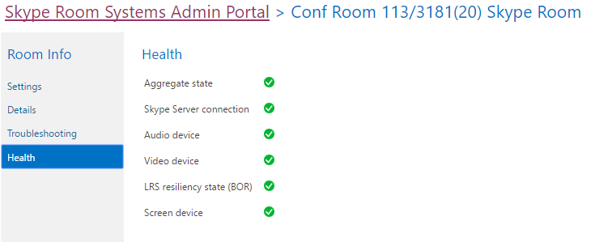

# <a name="deploy-srs-v1-administrative-web-portal-in-skype-for-business-server"></a>비즈니스용 Skype 서버에서 SRS v1 관리 웹 포털 배포

비즈니스용 Skype 서버 Skype 룸 시스템 v1(이전의 Lync Room System) 관리 웹 포털은 조직에서 Skype 룸 시스템 회의실을 유지 관리하는 데 사용할 수 있는 웹 포털입니다. 관리자는 SRS v1 관리 웹 포털을 사용하여 오디오/비디오 장치 모니터링과 같은 장치 상태 모니터링을 할 수 있습니다. 이 포털을 사용하여 관리자는 원격으로 진단 정보를 수집하여 회의실의 상태 모니터링을 할 수 있습니다.

이 기능을 사용하기 위해 SRS v1 관리 웹 포털을 모든 비즈니스용 Skype 서버 프런트 엔드 서버에 배포해야 합니다. 이 가이드에서는 SRS 관리 웹 포털을 설치 및 구성하는 방법에 대한 관리자를 위한 지침을 제공합니다. 비즈니스용 Skype 서버 관리에 대한 지식이 있는 관리자와 비즈니스용 Skype 서버 토폴로지 수정 권한이 있는 관리자를 위한 것입니다.

SRS v1 관리 웹 포털이 서버에 배포된 후 관리자는 자신의 컴퓨터 또는 랩톱에서 사이트에 로그온하여 SRS v1 디바이스 상태를 확인할 수 있습니다.

> [!IMPORTANT]
> [비즈니스용 Skype 서버 2015용 Microsoft Skype 룸 시스템 v1 관리 웹 포털을 다운로드합니다.](https://www.microsoft.com/download/details.aspx?id=46906)

이 항목의 내용:

- [SRS v1 관리 웹 포털에 대한 환경 구성](room-system-v1-administrative-web-portal.md#Config_Env)

- [SRS v1 관리 웹 포털 설치](room-system-v1-administrative-web-portal.md#Install_SRS)

- [SRS 관리 웹 포털 사용](room-system-v1-administrative-web-portal.md#Use_Portal)

## <a name="configure-your-environment-for-the-srs-v1-administrative-web-portal"></a>SRS v1 관리 웹 포털에 대한 환경 구성
<a name="Config_Env"> </a>

SRS v1 관리 웹 포털을 사용하려면 다음의 선행 작업을 설치하거나 구성해야 합니다.

> [!IMPORTANT]
> 서버가 Kerberos 및 NTLM 인증으로 구성된 경우 도메인에 가입되지 않은 컴퓨터에서 SRS를 실행 중인 경우 Kerberos 인증이 실패하고 사용자가 관리 포털에서 SRS 상태를 볼 수 없습니다. 이 문제를 해결하려면 NTLM 인증 또는 NTLM 및 TLS-DSK 인증(Kerberos 없이)으로 서버를 구성하거나 SRS 컴퓨터를 도메인에 가입합니다.

1. 비즈니스용 Skype 서버 토폴로지에서 비즈니스용 Skype 서버 누적 업데이트를 설치합니다.

    업데이트를 다운로드하거나 업데이트에 포함된 내용은 [비즈니스용 Skype 서버 2015 업데이트를 참조하세요.](https://support.microsoft.com/help/3061064/updates-for-skype-for-business-server-2015)

2. SIP 사용이 가능한 Active Directory 사용자를 만드십시오.

    SRS v1 관리 웹 포털은 이러한 자격 증명을 사용하여 비즈니스용 Skype 서버의 정보를 쿼리합니다. 제공된 예제의 사용자 이름은 LRSApp입니다.

3. 이름이 LRSSupportAdminGroup인 Active Directory 보안 그룹을 만드십시오.

    그룹 범위를 전역으로, 그룹 유형을 보안으로 사용하여 그룹을 만들 수 있습니다. 이 그룹에 추가된 SIP 사용 가능 사용자는 방 목록을 보고 로그 수집과 같은 특정 명령을 실행할 수 있습니다.

4. 이름이 LRSFullAccessAdminGroup인 Active Directory 보안 그룹을 만드십시오.

    이 그룹에 추가된 사용자는 그룹 범위를 전역으로, 그룹 유형으로 그룹을 만들면 이 그룹에 추가된 사용자는 단일 Skype 방에서 모든 관리 포털 기능을 사용할 수 있습니다. Skype 채팅방의 대량 관리 지원을 포함하기 위해 5단계를 참조하세요.

     

5. 이름이 LRSPowerUserAdminsGroup인 Active Directory 보안 그룹을 만드십시오.

    그룹 범위를 전역으로, 그룹 유형을 보안으로 사용하여 그룹을 만들 수 있습니다. 이 그룹에 추가된 SIP 사용 가능 사용자는 비즈니스용 Skype 채팅방의 대량 관리를 비롯한 모든 관리 포털 기능을 사용할 수 있습니다.

6. LRSFullAccessAdminGroup을 LRSSupportAdminGroup의 구성원으로 추가합니다.

     

7. 이름이 LRSSupport인 SIP 사용 Active Directory 사용자를 만드십시오. 이 사용자를 LRSSupportAdminGroup에 추가합니다.

     

8. ASP.NET [2010 SP1 및 Visual Web Developer 2010 SP1용 Visual Studio MVC 4를 설치합니다.](https://go.microsoft.com/fwlink/p/?LinkId=323967)

## <a name="install-the-srs-v1-administrative-web-portal"></a>SRS v1 관리 웹 포털 설치
<a name="Install_SRS"> </a>

[비즈니스용 Skype 서버 2015용 Microsoft Skype 룸 시스템 v1 관리 웹 포털을 다운로드합니다.](https://www.microsoft.com/download/details.aspx?id=46906)

SRS v1 관리 웹 포털을 설치하려면 다음 단계를 수행합니다.

1. 비즈니스용 Skype 서버 관리 셸에서 다음 cmdlet을 실행하여 신뢰할 수 있는 응용 프로그램 포트를 구성합니다.

   ```powershell
   Set-CsWebServer -Identity POOLFQDN -MeetingRoomAdminPortalInternalListeningPort 4456 -MeetingRoomAdminPortalExternalListeningPort 4457
   ```

2. 회의실 포털을 설치하려면 회의실 포털을 **MeetingRoomPortalInstaller.msi** 관리자 권한으로 실행합니다.

3. 다음 위치에서 Web.config 파일을 열 수 있습니다.

    %Program Files%\Skype for Business Server 2015\Web Components\Meeting Room Portal\Int\Handler\

4. Web.Config 파일에서 "[Configure your environment for the SRS v1 Administrative Web Portal](room-system-v1-administrative-web-portal.md#Config_Env)" 섹션 아래 2단계에서 만든 사용자 이름으로 PortalUserName을 변경합니다(이 단계에서 권장되는 이름은 LRSApp임).

    ```xml
    <add key="PortalUserName" value="sip:LRSApp@domain.com" />
    ```

5. SRS v1 관리 포털은 신뢰할 수 있는 응용 프로그램으로, 포털 구성에서 암호를 제공할 필요가 없습니다. 이 사용자가 로컬 등록 기관과 다른 등록 기관을 사용하는 경우 로컬 등록 기관 파일에 다음 줄을 추가하여 등록 기관을 Web.Config 합니다.

   ```xml
   <add key="PortalUserRegistrarFQDN" value="pool-xxxx.domain.com" />
   ```

6. 사용된 포트가 5061이 아면 파일에서 다음 Web.Config 추가합니다.

   ```xml
   <add key="PortalUserRegistrarPort" value="5061" />
   ```

### <a name="verify-installation-of-the-srs-administrative-web-portal"></a>SRS 관리 웹 포털 설치 확인

SRS v1 관리 웹 포털의 설치를 확인하기 위해 다음을 합니다.

1. 프런트 엔드 서버에서 다음 URL을 검색합니다.

    https:// \<fe-server\> /lrs

    다음 이미지와 같이 오류가 표시되지 않습니다.

     

2. 오류가 없는 경우 토폴로지의 다른 컴퓨터에서 다음 URL에 액세스해 봐야 합니다.

    https:// \<fe-server\> /lrs

    페이지에 액세스하려면 "자동 클라이언트 로그인에 필요한 DNS 레코드"에 설명된 DNS 레코드를[추가해야 합니다.](/previous-versions/office/communications-server/bb663700(v=office.12))

## <a name="use-the-srs-administrative-web-portal"></a>SRS 관리 웹 포털 사용
<a name="Use_Portal"> </a>

서버에 SRS를 배포한 후 브라우저에서 SRS v1 관리 웹 포털에 로그인하여 모든 SRS 방의 상태를 확인할 수 있습니다.

### <a name="sign-in"></a>로그인

1. 다음 URL로 이동하십시오.

    https:// \<fe-server\> /lrs

2. LRSSupport 계정 또는 LRSSupportAdminGroup 보안 그룹에 추가된 계정의 자격 증명을 입력합니다.


### <a name="srs-administrative-web-portal-summary-page"></a>SRS 관리 웹 포털 요약 페이지

요약 페이지에서는 서버에 배포된 모든 SRS 회의실에 대해 다음 정보를 제공합니다.

- **태그** 관리자가 방에 지정한 사용자 지정 이름입니다. 포털에서 방 이름을 클릭하여 태그를 설정할 수 있습니다.

- **상태** 방의 상태입니다. 이 상태는 방 설정 페이지의 상태 섹션에 표시되는 방의 집계 상태에서 파생됩니다.

- **다음 모임** 다음 모임이 예약된 날짜 및 시간입니다.

- **SRS 버전, 제조업체, 모델** 이러한 값은 SRS에서 미리 설정됩니다. 제조업체에 따라 이러한 필드를 비워 두면 됩니다.

- **마지막 새로 고침** 웹 페이지를 마지막으로 새로 고쳐진 시간을 표시됩니다.


> [!NOTE]
> LRSPowerUserAdminsGroup 보안 그룹의 일부인 경우 대량 관리 메뉴만 표시됩니다.

### <a name="srs-room-information"></a>SRS 룸 정보

포털의 방 정보 섹션에서는 개별 SRS 방을 보고 구성할 수 있습니다. 설정, 세부 정보, 로깅 및 상태의 네 가지 섹션으로 구성됩니다.

#### <a name="settings"></a>설정

설정 섹션에서 방의 암호, 방 태그 및 기본 볼륨 수준을 설정할 수 있습니다. 이러한 설정을 구성하면 SRS 콘솔을 다시 시작한 후에만 변경 내용이 복제됩니다. 릴리스 15.12 이상을 사용하는 SRS 장치에 대한 시스템 업데이트 설정만 표시됩니다.


#### <a name="details"></a>세부 정보

세부 정보 섹션에서는 마지막 새로 고침 시간을 포함하여 SRS 방의 설정에 대한 읽기 전용 요약을 제공합니다. 다음 모임 마지막 업데이트, 유지 관리 및 보정 기본 스피커, 마이크 및 벨소리 설정 version; SIP URI 각 화면에 대한 화면 수 및 세부 정보 상태 및 활동.


#### <a name="troubleshooting"></a>문제 해결

문제 해결 섹션을 사용하여 로그를 원격으로 수집하고 지정된 위치에 저장할 수 있습니다. SRS 콘솔(SRS 사용자 인터페이스)을 다시 시작하거나 전체 시스템을 다시 시작할 수도 있습니다. 로그를 수집하려면 지정된 형식으로 폴더 경로를 제공하고 폴더에 SRS 컴퓨터 계정에 대한 쓰기 권한이 있는지 확인합니다. 로그 크기가 너무 큰 경우 로그 수집을 완료하는 데 최대 5분이 걸릴 수 있습니다. 페이지를 새로 고치면 최신 상태가 표시됩니다.

#### <a name="health"></a>상태

상태 섹션에서는 비즈니스용 Skype 서버 연결, 오디오 장치, 비디오 장치, 탄력성 상태 및 화면 장치의 상태를 시각적으로 표시합니다.



### <a name="additional-notes-about-the-administrative-web-portal"></a>관리 웹 포털에 대한 추가 참고 사항

> [!NOTE]
>  설정 변경 내용은 SRS 시스템을 다시 시작한 후에만 적용됩니다.> LRSApp 계정 암호가 만료되면 회의실의 상태를 볼 수 없습니다. 만료되지 않을 수 있도록 LRSAppuser 계정 암호를 구성하거나 만료가 다가오면 암호를 업데이트해야 합니다.> SRS 관리 웹 포털은 사내 배포에만 지원됩니다.

### <a name="bulk-management"></a>대량 관리

SRS 회의실의 대량 관리는 고급 IT 관리자를 위해 설계된 기능으로, 워크플로를 단순화하고 시간을 절약하는 편리한 도구를 사용하여 여러 방을 일괄적으로 관리할 수 있도록 합니다.

이 기능을 표시하려면 사용자를 특수 보안 **그룹인 LRSPowerUserAdminsGroup의** 구성원으로 프로비전해야 합니다.

대량 관리를 위해 선택할 수 있는 SRS 방 수는 제한이 없습니다. 그러나 한 번의 대량 관리 작업만 수행할 수 있습니다.

대량 관리 작업을 수행하려면 모니터링할 방을 선택하고 대량 관리 메뉴를 클릭합니다.

### <a name="frequently-asked-questions"></a>자주하는 질문

#### <a name="why-cant-i-sign-in-to-the-administrative-web-portal"></a>관리 웹 포털에 로그인할 수 없는 이유는 무엇입니까?

를 열면 로그인 페이지를 볼 수 있지만 자격 증명을 입력하면 https://localhost/lrs 로그인할 수 없습니다. 이 경우 관리 웹 포털에 로그인하려면 열 https://FQDNofFEserver/SRS 있어야 합니다.

#### <a name="why-cant-i-see-srs-v1-in-the-administrative-web-portal"></a>관리 웹 포털에서 SRS v1을 볼 수 없는 이유는 무엇입니까?

- 배포에 SRS 계정이 있으며 SRS 관리 웹 포털 배포 권장 사항에 따라 만들어야 합니다. 비즈니스용 Skype 서버에서 Enable-CsMeetingRoom이 아닌 Enable-CsMeetingRoom을 사용하여 SRS 계정을 프로비전하는지 확인

- SRS 계정을 만들 때 관리 웹 포털에서 계정을 볼 수 없는 경우 **MeetingPortal** 구성 요소가 선택된 비즈니스용 Skype 서버 로깅 도구를 사용하여 서버 로그를 수집한 다음 SRS 지원 담당자에게 전송합니다.

- SRS 계정을 만들 때 관리 웹 포털에서 계정을 볼 수 없는 경우 Fiddler를 사용하여 클라이언트 로그를 수집하고 브라우저 개발 도구에서 콘솔 로그를 복사한 다음 SRS 지원 담당자에게 전송합니다. 또한 추가 로그에서 추적 수준 값을 수정하여 Web.config 로그를 얻을 수도 있습니다.

  ```xml
  <system.diagnostics>
    <switches>
      <!--
      This switch controls logging message levels. 0 implies
      logging is turned off. 1 implies only errors are logged,
      2 implies errors &amp; warnings. 4 is the most detailed.
      -->
      <add name="TraceLevelSwitch" value="3" />
    </switches>
  </system.diagnostics>
  ```

#### <a name="why-cant-i-see-the-status-of-srs-in-the-administrative-web-portal"></a>관리 웹 포털에서 SRS 상태를 볼 수 없는 이유는 무엇입니까?

- LRSApp 사용자 계정이 SIP를 사용하도록 설정되어 있는지 확인합니다.

- 문제가 계속 있는 경우 D:\Tracing\LRSAdminLogs에서 SRS 시스템에서 **Trace.log** 파일을 수집한 다음 SRS 지원 담당자에게 \, 전송합니다.

#### <a name="why-cant-i-see-the-bulk-management-menus-for-srs-in-the-administrative-web-portal"></a>관리 웹 포털에서 SRS에 대한 대량 관리 메뉴를 볼 수 없는 이유는 무엇입니까?

LRSApp 사용자 계정이 SIP를 사용할 수 있으며 LRSPowerUserAdminsGroup 보안 그룹의 일부인지 확인합니다.

#### <a name="does-the-srs-v1-administrative-web-portal-work-with-microsoft-teams-rooms"></a>SRS v1 관리 웹 포털이 Microsoft Teams 룸에서 작동하나요?

아니요.