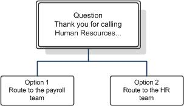

# <a name="designing-and-creating-response-group-workflows-in-skype-for-business"></a><span data-ttu-id="673b2-104">비즈니스용 Skype에서 응답 그룹 워크플로 디자인 및 만들기</span><span class="sxs-lookup"><span data-stu-id="673b2-104">Designing and creating response group workflows in Skype for Business</span></span>

<span data-ttu-id="673b2-105">비즈니스용 Skype Server Enterprise Voice에서 응답 그룹 워크플로를 디자인 하 고 만듭니다.</span><span class="sxs-lookup"><span data-stu-id="673b2-105">Design and create Response Group workflows, in Skype for Business Server Enterprise Voice.</span></span> <span data-ttu-id="673b2-106">헌트 그룹 워크플로 및 대화형 워크플로 둘 다에 적용 됩니다.</span><span class="sxs-lookup"><span data-stu-id="673b2-106">Both hunt group workflows and interactive workflows are covered.</span></span>

<span data-ttu-id="673b2-107">워크플로는 다른 사용자가 전화를 건 시간으로 울릴 때 까지의 통화 동작을 정의 합니다.</span><span class="sxs-lookup"><span data-stu-id="673b2-107">A workflow defines the behavior of a call from the time that the phone rings to the time that someone answers the call.</span></span> <span data-ttu-id="673b2-108">워크플로는 통화를 보류 하는 데 사용할 큐를 지정 하 고, 헌트 그룹 워크플로 또는 대화형 응답 그룹 워크플로에 사용할 질문 및 답변에 사용할 라우팅 방법을 지정 합니다.</span><span class="sxs-lookup"><span data-stu-id="673b2-108">The workflow specifies the queue to use for holding the call, and specifies the routing method to use for hunt group workflows or the questions and answers to use for interactive response group workflows.</span></span>

<span data-ttu-id="673b2-109">워크플로는 환영 메시지, 보류 중인 음악, 업무 시간, 휴일 등의 설정도 정의 합니다.</span><span class="sxs-lookup"><span data-stu-id="673b2-109">A workflow also defines settings such as a welcome message, music on hold, business hours, and holidays.</span></span>

> [!NOTE]
> <span data-ttu-id="673b2-110">에이전트 그룹과 큐를 사용 하는 워크플로를 만들기 전에 만들어야 합니다.</span><span class="sxs-lookup"><span data-stu-id="673b2-110">You must create agent groups and queues before you create a workflow that uses them.</span></span>

## <a name="creating-or-modifying-a-hunt-group-workflow"></a><span data-ttu-id="673b2-111">헌트 그룹 워크플로 만들기 또는 수정</span><span class="sxs-lookup"><span data-stu-id="673b2-111">Creating or modifying a hunt group workflow</span></span>

### <a name="to-use-response-group-configuration-tool-to-create-or-modify-a-hunt-group-workflow"></a><span data-ttu-id="673b2-112">응답 그룹 구성 도구를 사용 하 여 헌트 그룹 워크플로를 만들거나 수정 하려면</span><span class="sxs-lookup"><span data-stu-id="673b2-112">To use Response Group Configuration Tool to create or modify a hunt group workflow</span></span>

1. <span data-ttu-id="673b2-113">RTCUniversalServerAdmins 그룹의 구성원 또는 응답 그룹을 지 원하는 미리 정의 된 관리 역할 중 하나의 구성원으로 로그온 합니다.</span><span class="sxs-lookup"><span data-stu-id="673b2-113">Log on as a member of the RTCUniversalServerAdmins group, or as a member of one of the predefined administrative roles that support Response Group.</span></span>

2. <span data-ttu-id="673b2-114">브라우저 창을 열고 관리자 URL을 입력 하 여 비즈니스용 Skype 서버 제어판을 엽니다.</span><span class="sxs-lookup"><span data-stu-id="673b2-114">Open a browser window, and then enter the Admin URL to open the Skype for Business Server Control Panel.</span></span>

3. <span data-ttu-id="673b2-115">왼쪽 탐색 모음에서 **응답 그룹**을 클릭 한 다음 **워크플로**를 클릭 합니다.</span><span class="sxs-lookup"><span data-stu-id="673b2-115">In the left navigation bar, click **Response Groups**, and then click **Workflow**.</span></span>

4. <span data-ttu-id="673b2-116">**워크플로** 페이지에서 **워크플로 만들기 또는 편집**을 클릭 합니다.</span><span class="sxs-lookup"><span data-stu-id="673b2-116">On the **Workflow** page, click **Create or edit a workflow**.</span></span>

5. <span data-ttu-id="673b2-117">서비스 검색 **선택** 필드에 만들거나 변경할 워크플로를 호스트 하는 **applicationserver** 서비스 이름의 전부 또는 일부를 입력 합니다.</span><span class="sxs-lookup"><span data-stu-id="673b2-117">In the **Select a Service** search field, type all or part of the name of the **ApplicationServer** service that hosts the workflow that you want to create or change.</span></span> <span data-ttu-id="673b2-118">서비스 결과 목록에서 원하는 서비스를 클릭 한 다음 **확인**을 클릭 합니다.</span><span class="sxs-lookup"><span data-stu-id="673b2-118">In the resulting list of services, click the service that you want, and then click **OK**.</span></span>

    > [!NOTE]
    > <span data-ttu-id="673b2-119">응답 그룹 구성 도구가 열립니다.</span><span class="sxs-lookup"><span data-stu-id="673b2-119">The Response Group Configuration Tool opens.</span></span> <span data-ttu-id="673b2-120">다음 URL을 입력 하 여 웹 브라우저에서 직접 응답 그룹 구성 도구를 열 수도 있습니다. https://\<webpoolfqdn/RgsConfig.\></span><span class="sxs-lookup"><span data-stu-id="673b2-120">You can also open the Response Group Configuration Tool directly from a web browser by typing the following URL: https://\<webPoolFqdn\>/RgsConfig.</span></span>

6. <span data-ttu-id="673b2-121">다음 중 하나를 수행 합니다.</span><span class="sxs-lookup"><span data-stu-id="673b2-121">Do one of the following:</span></span>

   - <span data-ttu-id="673b2-122">**새 워크플로 만들기**에서 **헌트 그룹**옆에 있는 **만들기**를 클릭 합니다.</span><span class="sxs-lookup"><span data-stu-id="673b2-122">Under **Create a New Workflow**, next to **Hunt Group**, click **Create**.</span></span>

   - <span data-ttu-id="673b2-123">**기존 워크플로 관리**에서 변경 하려는 워크플로를 찾은 다음, **실행**에서 **편집**을 클릭 합니다.</span><span class="sxs-lookup"><span data-stu-id="673b2-123">Under **Manage an Existing Workflow**, locate the workflow you want to change, and then under **Action**, click **Edit**.</span></span>

7. <span data-ttu-id="673b2-124">사용자가 워크플로 호출을 시작할 준비가 되었으면 **워크플로 활성화**를 선택 합니다.</span><span class="sxs-lookup"><span data-stu-id="673b2-124">If you are ready for users to start calling the workflow, select **Activate the workflow**.</span></span>

    > [!NOTE]
    >  <span data-ttu-id="673b2-125">관리 되는 워크플로를 만드는 경우 **워크플로 활성화**를 선택 해야 합니다.</span><span class="sxs-lookup"><span data-stu-id="673b2-125">If you are creating a managed workflow, you need to select **Activate the workflow**.</span></span> <span data-ttu-id="673b2-126">관리 되는 활성 워크플로를 저장 한 후에는 수정 하 고 비활성화할 수 있습니다.</span><span class="sxs-lookup"><span data-stu-id="673b2-126">After you save the active, managed workflow, you can then modify and deactivate it.</span></span>

8. <span data-ttu-id="673b2-127">페더레이션 사용자가 그룹에 전화를 걸 수 있도록 허용 하려면 **페더레이션 사용** 확인란을 선택 합니다.</span><span class="sxs-lookup"><span data-stu-id="673b2-127">To allow federated users to call the group, select the **Enable for federation** check box.</span></span> <span data-ttu-id="673b2-128">또한 페더레이션에 대해 구성 된 응답 그룹 응용 프로그램에 적용 되는 외부 액세스 정책만 있어야 합니다.</span><span class="sxs-lookup"><span data-stu-id="673b2-128">You must also have an external access policy that applies to the Response Group application configured for federation.</span></span>

    > [!NOTE]
    > <span data-ttu-id="673b2-129">글로벌 외부 액세스 정책이 응답 그룹 응용 프로그램에 적용 됩니다.</span><span class="sxs-lookup"><span data-stu-id="673b2-129">The global external access policy applies to the Response Group application.</span></span> <span data-ttu-id="673b2-130">비즈니스용 Skype Server 제어판을 사용 하거나 **Set-CsExternalAccessPolicy** cmdlet을 사용 하 여 Enableout 액세스 매개 변수를 True로 설정 하 여 응답 그룹 페더레이션에 대 한 전역 정책을 구성할 수 있습니다.</span><span class="sxs-lookup"><span data-stu-id="673b2-130">You can configure the global policy for response group federation by using Skype for Business Server Control Panel or by using the **Set-CsExternalAccessPolicy** cmdlet to set the EnableOutsideAccess parameter to True.</span></span> <span data-ttu-id="673b2-131">전역 정책 설정은 사이트 또는 사용자 정책을 할당 하지 않는 한 모든 사용자에 게 적용 된다는 점에 유의 하세요.</span><span class="sxs-lookup"><span data-stu-id="673b2-131">Keep in mind that global policy settings apply to all users unless they are assigned a site or user policy.</span></span> <span data-ttu-id="673b2-132">따라서 응답 그룹에 대해이 설정을 변경 하기 전에 페더레이션 설정이 조직의 요구 사항에 맞는지 확인 해야 합니다.</span><span class="sxs-lookup"><span data-stu-id="673b2-132">Therefore, before changing this setting for response groups, make sure that the federation setting meets the requirements of your organization.</span></span> <span data-ttu-id="673b2-133">정책이 사용자에 게 적용 되는 방법에 대 한 자세한 내용은 [조직의 외부 액세스 정책 관리](https://technet.microsoft.com/library/5571811e-34c8-443a-b94c-1ab5d4275581.aspx)를 참조 하세요.</span><span class="sxs-lookup"><span data-stu-id="673b2-133">For details about how policies apply to users, see [Manage External Access Policy for Your Organization](https://technet.microsoft.com/library/5571811e-34c8-443a-b94c-1ab5d4275581.aspx).</span></span> <span data-ttu-id="673b2-134">페더레이션 설정에 대 한 자세한 내용은 [Set-CsExternalAccessPolicy](https://docs.microsoft.com/powershell/module/skype/set-csexternalaccesspolicy?view=skype-ps)를 참조 하세요.</span><span class="sxs-lookup"><span data-stu-id="673b2-134">For details about the federation setting, see [Set-CsExternalAccessPolicy](https://docs.microsoft.com/powershell/module/skype/set-csexternalaccesspolicy?view=skype-ps).</span></span>

    > [!NOTE]
    > <span data-ttu-id="673b2-135">비즈니스용 Skype Online에서 호스트 되는 사용자는 온-프레미스 배포에서 호스트 되는 응답 그룹에 전화를 걸 수 없습니다.</span><span class="sxs-lookup"><span data-stu-id="673b2-135">Users who are hosted in Skype for Business Online can't place calls to response groups that are hosted in an on-premises deployment.</span></span> <span data-ttu-id="673b2-136">이는 하이브리드 배포와 온-프레미스 배포를 비즈니스용 Skype Online 배포에 연결 하는 경우에 모두 마찬가지입니다.</span><span class="sxs-lookup"><span data-stu-id="673b2-136">This is true in both hybrid deployments and in cases where an on-premises deployment is federated with a Skype for Business Online deployment.</span></span>

9. <span data-ttu-id="673b2-137">통화 중 에이전트의 id를 숨기려면 **에이전트 익명 사용** 확인란을 선택 합니다.</span><span class="sxs-lookup"><span data-stu-id="673b2-137">To hide the identity of agents during calls, select the **Enable agent anonymity** check box.</span></span>

    > [!NOTE]
    > <span data-ttu-id="673b2-138">관리자나 발신자는 전화를 설정한 후에 IM 및 비디오를 추가할 수 있지만, 익명 호출은 메신저 또는 비디오로 시작할 수 없습니다.</span><span class="sxs-lookup"><span data-stu-id="673b2-138">Anonymous calls cannot start with instant messaging (IM) or video, although the agent or the caller can add IM and video after the call is established.</span></span> <span data-ttu-id="673b2-139">익명 에이전트는 통화 대기, 통화 전환 (블라인드 및 consultative 전송 모두)을 할 수 있으며 통화를 전환 하 고 검색할 수도 있습니다.</span><span class="sxs-lookup"><span data-stu-id="673b2-139">An anonymous agent can also put calls on hold, transfer calls (both blind and consultative transfers), and park and retrieve calls.</span></span> <span data-ttu-id="673b2-140">익명 통화는 회의, 응용 프로그램 공유 및 데스크톱 공유, 파일 전송, whiteboarding, 데이터 공동 작업, 통화 기록을 지원 하지 않습니다.</span><span class="sxs-lookup"><span data-stu-id="673b2-140">Anonymous calls do not support conferencing, application sharing and desktop sharing, file transfer, whiteboarding and data collaboration, and call recording.</span></span> <span data-ttu-id="673b2-141">Lync VDI 플러그 인을 사용 하는 상담원은 들어오는 호출을 익명으로 받을 수 있지만, 나가는 호출을 익명으로 할 수는 없습니다.</span><span class="sxs-lookup"><span data-stu-id="673b2-141">Agents using the Lync VDI Plugin can receive incoming calls anonymously, but they cannot make outgoing calls anonymously.</span></span>

10. <span data-ttu-id="673b2-142">에서 **전화를 받을 그룹의 주소 입력**에 워크플로 호출에 응답할 그룹의 기본 SIP uri (uniform resource identifier) 주소를 입력 합니다.</span><span class="sxs-lookup"><span data-stu-id="673b2-142">Under **Enter the address of the group that will receive the calls**, type the primary SIP uniform resource identifier (URI) address of the group that will answer calls to the workflow.</span></span>

    > [!NOTE]
    > <span data-ttu-id="673b2-143">워크플로의 기본 URI는 워크플로를 식별 하 고 참조 하는 방법입니다.</span><span class="sxs-lookup"><span data-stu-id="673b2-143">The primary URI for a workflow is how the workflow is identified and referenced.</span></span> <span data-ttu-id="673b2-144">입력 하는 SIP URI는 Active Directory 도메인 서비스의 contact 개체로 만들어집니다.</span><span class="sxs-lookup"><span data-stu-id="673b2-144">The SIP URI that you enter is created as a contact object in Active Directory Domain Services.</span></span> <span data-ttu-id="673b2-145">URI를 만들려면 개체가 Active Directory에서 고유 해야 합니다.</span><span class="sxs-lookup"><span data-stu-id="673b2-145">To create the URI, the object must be unique in Active Directory.</span></span>

11. <span data-ttu-id="673b2-146">**표시 이름**에 워크플로에 대해 표시할 이름 (예: 영업 응답 그룹)을 입력 합니다.</span><span class="sxs-lookup"><span data-stu-id="673b2-146">In **Display name**, type the name that you want to display for the workflow (for example, Sales Response Group).</span></span>

    > [!NOTE]
    > <span data-ttu-id="673b2-147">표시 이름에 "<" 또는 ">" 문자를 포함 하지 마세요.</span><span class="sxs-lookup"><span data-stu-id="673b2-147">Do not include the "<" or ">" characters in the display name.</span></span> <span data-ttu-id="673b2-148">다음 표시 이름은 예약 됨: **RGS 현재 감시자** 또는 **알림 서비스**이므로 사용 하지 마세요.</span><span class="sxs-lookup"><span data-stu-id="673b2-148">Do not use the following display names because they are reserved: **RGS Presence Watcher** or **Announcement Service**.</span></span>

12. <span data-ttu-id="673b2-149">**전화 번호**에서 응답 그룹의 줄 URI를 입력 합니다 (예: + 14255550165).</span><span class="sxs-lookup"><span data-stu-id="673b2-149">Under **Telephone number**, type the line URI for the response group (for example, +14255550165).</span></span>

13. <span data-ttu-id="673b2-150">**표시 번호**에서 응답 그룹에 대해 표시할 숫자를 입력 합니다 (예: + 1 (425) 555-0165).</span><span class="sxs-lookup"><span data-stu-id="673b2-150">In **Display number**, type the number as you want it to appear for the response group (for example, +1 (425) 555-0165).</span></span>

14. <span data-ttu-id="673b2-151">) **설명**에 비즈니스용 Skype에서 연락처 카드에 표시할 워크플로 설명을 입력 합니다.</span><span class="sxs-lookup"><span data-stu-id="673b2-151">(Optional) In **Description**, type a description for the workflow as you want it to appear on the contact card in Skype for Business.</span></span>

15. <span data-ttu-id="673b2-152">**워크플로 유형에**서이 워크플로를 응답 그룹 관리자가 관리 하는 경우 **관리** 를 선택 합니다.</span><span class="sxs-lookup"><span data-stu-id="673b2-152">In **Workflow Type**, select **Managed** if this workflow will be managed by a Response Group Manager.</span></span> <span data-ttu-id="673b2-153">응답 그룹 관리자를 워크플로에 할당 하려면 다음을 실행 합니다.</span><span class="sxs-lookup"><span data-stu-id="673b2-153">Do the following to assign Response Group Managers to the workflow:</span></span>

    <span data-ttu-id="673b2-154">에서.</span><span class="sxs-lookup"><span data-stu-id="673b2-154">a.</span></span> <span data-ttu-id="673b2-155">이 워크플로에 대 한 관리자의 SIP URI를 입력 하 고 **추가**를 클릭 합니다.</span><span class="sxs-lookup"><span data-stu-id="673b2-155">Type the SIP URI of a manager for this workflow, and click **Add**.</span></span>

    <span data-ttu-id="673b2-156">b.</span><span class="sxs-lookup"><span data-stu-id="673b2-156">b.</span></span> <span data-ttu-id="673b2-157">추가 관리자의 SIP URI를 입력 하 여 워크플로에 추가 하 고 **추가**를 클릭 합니다.</span><span class="sxs-lookup"><span data-stu-id="673b2-157">Type the SIP URI of additional managers to add to the workflow, and click **Add**.</span></span>

    > [!IMPORTANT]
    > <span data-ttu-id="673b2-158">응답 그룹의 관리자로 지정 된 모든 사용자에 게 CsResponseGroupManager 역할을 할당 해야 합니다.</span><span class="sxs-lookup"><span data-stu-id="673b2-158">Every user who is designated as a manager of a response group must be assigned the CsResponseGroupManager role.</span></span> <span data-ttu-id="673b2-159">사용자에 게이 역할이 할당 되지 않은 경우 응답 그룹을 관리할 수 없습니다.</span><span class="sxs-lookup"><span data-stu-id="673b2-159">If users are not assigned this role, they cannot manage response groups.</span></span>

16. <span data-ttu-id="673b2-160">**2 단계에서 언어를 선택**하 고 음성 인식 및 텍스트 음성 변환에 사용할 언어를 클릭 합니다.</span><span class="sxs-lookup"><span data-stu-id="673b2-160">Under **Step 2 Select a Language**, click the language that you want to use for speech recognition and text-to-speech.</span></span>

17. <span data-ttu-id="673b2-161">환영 메시지를 구성 하려면 **3 단계에서 환영 메시지 구성**확인란을 선택 하 고 다음 중 하나 \*\*\*\* 를 수행 합니다.</span><span class="sxs-lookup"><span data-stu-id="673b2-161">If you want to configure a welcome message, under **Step 3 Configure a Welcome Message**, select the **Play a welcome message** check box, and then do one of the following:</span></span>

    - <span data-ttu-id="673b2-162">환영 메시지를 발신자를 위해 음성으로 변환 되는 텍스트로 입력 하려면 **텍스트 음성 변환 사용**을 클릭 한 다음 텍스트 상자에 환영 메시지를 입력 합니다.</span><span class="sxs-lookup"><span data-stu-id="673b2-162">To enter the welcome message as text that is converted to speech for callers, click **Use text-to-speech**, and then type the welcome message in the text box.</span></span>

    > [!NOTE]
    > <span data-ttu-id="673b2-163">입력 한 텍스트에 HTML 태그를 포함 하지 않습니다.</span><span class="sxs-lookup"><span data-stu-id="673b2-163">Do not include HTML tags in the text you enter.</span></span> <span data-ttu-id="673b2-164">HTML 태그를 포함 하면 오류 메시지가 표시 됩니다.</span><span class="sxs-lookup"><span data-stu-id="673b2-164">If you include HTML tags, you will receive an error message.</span></span>

    - <span data-ttu-id="673b2-165">환영 메시지에 웨이브 (.wav) 또는 Windows Media 오디오 (.wma) 파일 기록을 사용 하려면 **기록 선택을**클릭 합니다.</span><span class="sxs-lookup"><span data-stu-id="673b2-165">To use a wave (.wav) or Windows Media audio (.wma) file recording for the welcome message, click **Select a recording**.</span></span> <span data-ttu-id="673b2-166">새 오디오 파일을 업로드 하려면 **기록** 링크를 클릭 합니다.</span><span class="sxs-lookup"><span data-stu-id="673b2-166">If you want to upload a new audio file, click the **a recording** link.</span></span> <span data-ttu-id="673b2-167">새 브라우저 창에서 **찾아보기를**클릭 하 고 사용 하려는 오디오 파일을 선택한 다음 **열기**를 클릭 합니다.</span><span class="sxs-lookup"><span data-stu-id="673b2-167">In the new browser window, click **Browse**, select the audio file that you want to use, and then click **Open**.</span></span> <span data-ttu-id="673b2-168">**업로드** 를 클릭 하 여 오디오 파일을 로드 합니다.</span><span class="sxs-lookup"><span data-stu-id="673b2-168">Click **Upload** to load the audio file.</span></span>

    > [!NOTE]
    > <span data-ttu-id="673b2-169">모든 사용자 제공 오디오 파일은 특정 요구 사항을 충족 해야 합니다.</span><span class="sxs-lookup"><span data-stu-id="673b2-169">All user-provided audio files must meet certain requirements.</span></span> <span data-ttu-id="673b2-170">지원 되는 파일 형식에 대 한 자세한 내용은 [응답 그룹에 대 한 기술 요구 사항을](https://technet.microsoft.com/library/477488bd-124f-437b-9327-732a0d7271ca.aspx)참조 하세요.</span><span class="sxs-lookup"><span data-stu-id="673b2-170">For details about supported file formats, see [Technical Requirements for Response Groups](https://technet.microsoft.com/library/477488bd-124f-437b-9327-732a0d7271ca.aspx).</span></span>

18. <span data-ttu-id="673b2-171">**4 단계에서 업무 시간을 지정**하 고 **표준 시간대**에서 워크플로의 표준 시간대를 클릭 합니다.</span><span class="sxs-lookup"><span data-stu-id="673b2-171">Under **Step 4 Specify Your Business Hours**, in **Your time zone**, click the time zone for the workflow.</span></span>

    > [!NOTE]
    > <span data-ttu-id="673b2-172">표준 시간대는 워크플로의 호출자와 에이전트가 상주 하는 표준 시간대입니다.</span><span class="sxs-lookup"><span data-stu-id="673b2-172">The time zone is the time zone where the callers and agents of the workflow reside.</span></span> <span data-ttu-id="673b2-173">이 메서드는 시작 시간과 종료 시간을 계산 하는 데 사용 됩니다.</span><span class="sxs-lookup"><span data-stu-id="673b2-173">It is used to calculate the open and close hours.</span></span> <span data-ttu-id="673b2-174">예를 들어 워크플로가 북미 동부 표준 시간대를 사용 하도록 구성 되 고 워크플로가 오전 7:00 시에 열리도록 예약 된 경우</span><span class="sxs-lookup"><span data-stu-id="673b2-174">For example, if the workflow is configured to use the North American Eastern Time zone and the workflow is scheduled to open at 7:00 A.M.</span></span> <span data-ttu-id="673b2-175">11:00 P.M.에서 시작 하 여 닫은 시간은 각각 7:00 동부 표준시와 23:00 동부 시간으로 간주 됩니다.</span><span class="sxs-lookup"><span data-stu-id="673b2-175">and close at 11:00 P.M., the open and close times are assumed to be 7:00 Eastern Time and 23:00 Eastern Time respectively.</span></span> <span data-ttu-id="673b2-176">(24 시간 표시법으로 시간을 입력 해야 합니다.)</span><span class="sxs-lookup"><span data-stu-id="673b2-176">(You must enter the times in 24-hour time notation.)</span></span>

19. <span data-ttu-id="673b2-177">다음 중 하나를 실행 하 여 사용 하려는 업무 시간 일정의 유형을 선택 합니다.</span><span class="sxs-lookup"><span data-stu-id="673b2-177">Select the type of business hours schedule you want to use by doing one of the following:</span></span>

    - <span data-ttu-id="673b2-178">미리 정의 된 업무 시간 일정을 사용 하려면 **미리 설정 된 일정 사용**을 클릭 한 다음 드롭다운 목록에서 사용할 일정을 선택 합니다.</span><span class="sxs-lookup"><span data-stu-id="673b2-178">To use a predefined schedule of business hours, click **Use a preset schedule**, and then select the schedule you want to use from the drop-down list.</span></span>

      > [!NOTE]
      > <span data-ttu-id="673b2-179">이 옵션을 선택할 수 있으려면 이전에 미리 설정 된 일정이 하나 이상 정의 되어 있어야 합니다.</span><span class="sxs-lookup"><span data-stu-id="673b2-179">You must have defined at least one preset schedule previously to be able to select this option.</span></span> <span data-ttu-id="673b2-180">**새 CSRgsHoursOfBusiness** cmdlet을 사용 하 여 미리 설정 된 일정을 정의 합니다.</span><span class="sxs-lookup"><span data-stu-id="673b2-180">You define preset schedules by using the **New-CSRgsHoursOfBusiness** cmdlet.</span></span> <span data-ttu-id="673b2-181">자세한 내용은 [(선택 사항) 비즈니스용 Skype에서 응답 그룹 업무 시간 정의](optional-define-response-group-business-hours.md)를 참조 하세요.</span><span class="sxs-lookup"><span data-stu-id="673b2-181">For details, see [(Optional) Define Response Group business hours in Skype for Business](optional-define-response-group-business-hours.md).</span></span>

      > [!NOTE]
      > <span data-ttu-id="673b2-182">미리 설정 된 일정을 선택 하면 **일**, **열기**및 **닫기** 가 자동으로 응답 그룹을 사용할 수 있는 날짜와 시간으로 채워집니다.</span><span class="sxs-lookup"><span data-stu-id="673b2-182">When you select a preset schedule, **Day**, **Open**, and **Close** are automatically filled with the days and hours that the response group is available.</span></span>

    - <span data-ttu-id="673b2-183">이 워크플로에만 적용 되는 사용자 지정 일정을 사용 하려면 **사용자 지정 일정 사용**을 클릭 합니다.</span><span class="sxs-lookup"><span data-stu-id="673b2-183">To use a custom schedule that applies only to this workflow, click **Use a custom schedule**.</span></span>

20. <span data-ttu-id="673b2-184">이 워크플로에 대 한 사용자 지정 일정을 만드는 경우 응답 그룹을 사용할 수 있는 요일의 확인란을 클릭 합니다.</span><span class="sxs-lookup"><span data-stu-id="673b2-184">If you are creating a custom schedule for this workflow, click the check boxes for the days of the week that the response group is available.</span></span>

21. <span data-ttu-id="673b2-185">사용자 지정 일정을 만드는 경우 응답 그룹을 사용할 수 있는 각 요일에 대해 **열기** 및 **닫기** 시간을 입력 합니다.</span><span class="sxs-lookup"><span data-stu-id="673b2-185">If you are creating a custom schedule, type the **Open** and **Close** hours for each day of the week that the response group is available.</span></span>

    > [!NOTE]
    > <span data-ttu-id="673b2-186">**열기** 시간과 **종료** 시간은 24 시간 표기 형식 이어야 합니다.</span><span class="sxs-lookup"><span data-stu-id="673b2-186">The **Open** and **Close** hours must be in 24-hour time notation.</span></span> <span data-ttu-id="673b2-187">예를 들어, office가 9 ~ 5 개의 작업일로 근무 하 고 점심 시간에 종료 되는 경우 업무 시간은 **열린** 9:00, **종료** 12:00, **열기** 13:00 및 **닫기** 17:00로 지정 됩니다.</span><span class="sxs-lookup"><span data-stu-id="673b2-187">For example, if your office works a 9-to-5 work day and closes at noon for lunch, the business hours are specified as **Open** 9:00, **Close** 12:00, **Open** 13:00, and **Close** 17:00.</span></span>

22. <span data-ttu-id="673b2-188">Office가 열려 있지 않은 경우 메시지를 재생 하려면 **응답 그룹이 업무 시간을 초과 하면 메시지 재생** 확인란을 선택 하 고 다음 중 하나를 실행 하 여 재생할 메시지를 지정 합니다.</span><span class="sxs-lookup"><span data-stu-id="673b2-188">If you want to play a message when the office is not open, select the **Play a message when the response group is outside of business hours** check box, and then specify the message to play by doing one of the following:</span></span>

    - <span data-ttu-id="673b2-189">메시지를 호출자의 음성으로 변환 되는 텍스트로 입력 하려면 **텍스트 음성 변환 사용**을 클릭 한 다음 텍스트 상자에 메시지를 입력 합니다.</span><span class="sxs-lookup"><span data-stu-id="673b2-189">To enter the message as text that is converted to speech for the caller, click **Use text-to-speech**, and then type the message in the text box.</span></span>

      > [!NOTE]
      > <span data-ttu-id="673b2-190">입력 한 텍스트에 HTML 태그를 포함 하지 않습니다.</span><span class="sxs-lookup"><span data-stu-id="673b2-190">Do not include HTML tags in the text you enter.</span></span> <span data-ttu-id="673b2-191">HTML 태그를 포함 하면 오류 메시지가 표시 됩니다.</span><span class="sxs-lookup"><span data-stu-id="673b2-191">If you include HTML tags, you will receive an error message.</span></span>

    - <span data-ttu-id="673b2-192">메시지에 오디오 파일 녹음/녹화를 사용 하려면 **기록 선택을**클릭 합니다.</span><span class="sxs-lookup"><span data-stu-id="673b2-192">To use an audio file recording for the message, click **Select a recording**.</span></span> <span data-ttu-id="673b2-193">새 오디오 파일을 업로드 하려면 **기록** 링크를 클릭 합니다.</span><span class="sxs-lookup"><span data-stu-id="673b2-193">If you want to upload a new audio file, click the **a recording** link.</span></span> <span data-ttu-id="673b2-194">새 브라우저 창에서 **찾아보기를**클릭 하 고 사용할 파일을 선택한 다음 **열기**를 클릭 합니다.</span><span class="sxs-lookup"><span data-stu-id="673b2-194">In the new browser window, click **Browse**, select the file that you want to use, and then click **Open**.</span></span> <span data-ttu-id="673b2-195">**업로드** 를 클릭 하 여 오디오 파일을 로드 합니다.</span><span class="sxs-lookup"><span data-stu-id="673b2-195">Click **Upload** to load the audio file.</span></span>

      > [!NOTE]
      > <span data-ttu-id="673b2-196">모든 사용자 제공 오디오 파일은 특정 요구 사항을 충족 해야 합니다.</span><span class="sxs-lookup"><span data-stu-id="673b2-196">All user-provided audio files must meet certain requirements.</span></span> <span data-ttu-id="673b2-197">지원 되는 오디오 파일 형식에 대 한 자세한 내용은 [응답 그룹에 대 한 기술 요구 사항을](https://technet.microsoft.com/library/477488bd-124f-437b-9327-732a0d7271ca.aspx)참조 하세요.</span><span class="sxs-lookup"><span data-stu-id="673b2-197">For details about supported audio file formats, see [Technical Requirements for Response Groups](https://technet.microsoft.com/library/477488bd-124f-437b-9327-732a0d7271ca.aspx).</span></span>

23. <span data-ttu-id="673b2-198">메시지가 재생 된 후 호출을 처리 하는 방법 지정 (메시지가 구성 된 경우):</span><span class="sxs-lookup"><span data-stu-id="673b2-198">Specify how to handle calls after the message is played (if a message is configured):</span></span>

    - <span data-ttu-id="673b2-199">통화 연결을 끊으려면 **통화 연결 끊기를**클릭 합니다.</span><span class="sxs-lookup"><span data-stu-id="673b2-199">To disconnect the call, click **Disconnect Call**.</span></span>

    - <span data-ttu-id="673b2-200">전화를 음성 메일로 착신 전환 하려면 **음성 메일로 전달을**클릭 한 다음 음성 메일 주소를 입력 합니다.</span><span class="sxs-lookup"><span data-stu-id="673b2-200">To forward the call to voice mail, click **Forward to voice mail**, and then type the voice mail address.</span></span> <span data-ttu-id="673b2-201">음성 메일 주소의 형식은 \* \<사용자 이름\>*@*\<domainName\> \* (예: bob@contoso.com)입니다.</span><span class="sxs-lookup"><span data-stu-id="673b2-201">The format for the voice mail address is  *\<username\>*@*\<domainName\>* (for example, bob@contoso.com).</span></span>

    - <span data-ttu-id="673b2-202">다른 사용자에 게 통화를 착신 전환 하려면 **SIP URI로 전달을**클릭 한 다음 사용자 주소를 입력 합니다.</span><span class="sxs-lookup"><span data-stu-id="673b2-202">To forward the call to another user, click **Forward to SIP URI**, and then type a user address.</span></span> <span data-ttu-id="673b2-203">사용자 주소의 형식은 _ \<username\>_@_\<domainName\>_ 입니다.</span><span class="sxs-lookup"><span data-stu-id="673b2-203">The format for the user address is  _\<username\>_@_\<domainName\>_.</span></span>

    - <span data-ttu-id="673b2-204">통화를 다른 전화 번호로 착신 전환 하려면 **전화 번호로 전달을**클릭 한 다음 전화 번호를 입력 합니다.</span><span class="sxs-lookup"><span data-stu-id="673b2-204">To forward the call to another telephone number, click **Forward to telephone number**, and then type the telephone number.</span></span> <span data-ttu-id="673b2-205">전화 번호의 형식은 \* \<번호\>*@*\<의 이름\> \* (예: + 14255550121@contoso.com)입니다.</span><span class="sxs-lookup"><span data-stu-id="673b2-205">The format for the telephone number is  *\<number\>*@*\<domainName\>* (for example, +14255550121@contoso.com).</span></span> <span data-ttu-id="673b2-206">도메인 이름은 호출자를 올바른 대상으로 라우팅하는 데 사용 됩니다.</span><span class="sxs-lookup"><span data-stu-id="673b2-206">The domain name is used to route the caller to the correct destination.</span></span>

24. <span data-ttu-id="673b2-207">**5 단계에서 공휴일을 지정**하 고 응답 그룹을 비즈니스용으로 닫은 날을 정의 하는 하나 이상의 공휴일 집합에 해당 하는 확인란을 클릭 합니다.</span><span class="sxs-lookup"><span data-stu-id="673b2-207">Under **Step 5 Specify Your Holidays**, click the check boxes for one or more sets of holidays that define the days when the response group is closed for business.</span></span>

    > [!NOTE]
    > <span data-ttu-id="673b2-208">워크플로를 구성 하기 전에 휴일 및 휴일 집합을 정의 해야 합니다.</span><span class="sxs-lookup"><span data-stu-id="673b2-208">You need to define holidays and holiday sets before you configure the workflow.</span></span> <span data-ttu-id="673b2-209">**CsRgsHoliday** 및 **new-CsRgsHolidaySet** cmdlet을 사용 하 여 휴일 및 휴일 집합을 정의 합니다.</span><span class="sxs-lookup"><span data-stu-id="673b2-209">Use the **New-CsRgsHoliday** and **New-CsRgsHolidaySet** cmdlets to define holidays and holiday sets.</span></span> <span data-ttu-id="673b2-210">자세한 내용은 [(선택 사항) 비즈니스용 Skype에서 응답 그룹 공휴일 집합 정의](optional-define-response-group-holiday-sets.md)를 참조 하세요.</span><span class="sxs-lookup"><span data-stu-id="673b2-210">For details, see [(Optional) Define Response Group holiday sets in Skype for Business](optional-define-response-group-holiday-sets.md).</span></span>

25. <span data-ttu-id="673b2-211">휴일에서 메시지를 재생 하려면 **공휴일 중 메시지 재생** 확인란을 선택한 후 다음 중 하나를 실행 하 여 재생할 메시지를 지정 합니다.</span><span class="sxs-lookup"><span data-stu-id="673b2-211">If you want to play a message on holidays, select the **Play a message during holidays** check box, and then specify the message to play by doing one of the following:</span></span>

    - <span data-ttu-id="673b2-212">메시지를 호출자의 음성으로 변환 되는 텍스트로 입력 하려면 **텍스트 음성 변환 사용**을 클릭 한 다음 텍스트 상자에 메시지를 입력 합니다.</span><span class="sxs-lookup"><span data-stu-id="673b2-212">To enter the message as text that is converted to speech for the caller, click **Use text-to-speech**, and then type the message in the text box.</span></span>

    > [!NOTE]
    > <span data-ttu-id="673b2-213">입력 한 텍스트에 HTML 태그를 포함 하지 않습니다.</span><span class="sxs-lookup"><span data-stu-id="673b2-213">Do not include HTML tags in the text you enter.</span></span> <span data-ttu-id="673b2-214">HTML 태그를 포함 하면 오류 메시지가 표시 됩니다.</span><span class="sxs-lookup"><span data-stu-id="673b2-214">If you include HTML tags, you will receive an error message.</span></span>

    - <span data-ttu-id="673b2-215">메시지에 오디오 파일 녹음/녹화를 사용 하려면 **기록 선택을**클릭 합니다.</span><span class="sxs-lookup"><span data-stu-id="673b2-215">To use an audio file recording for the message, click **Select a recording**.</span></span> <span data-ttu-id="673b2-216">새 오디오 파일을 업로드 하려면 **기록** 링크를 클릭 합니다.</span><span class="sxs-lookup"><span data-stu-id="673b2-216">If you want to upload a new audio file, click the **a recording** link.</span></span> <span data-ttu-id="673b2-217">새 브라우저 창에서 **찾아보기를**클릭 하 고 사용할 파일을 선택한 다음 **열기**를 클릭 합니다.</span><span class="sxs-lookup"><span data-stu-id="673b2-217">In the new browser window, click **Browse**, select the file that you want to use, and then click **Open**.</span></span> <span data-ttu-id="673b2-218">**업로드** 를 클릭 하 여 오디오 파일을 로드 합니다.</span><span class="sxs-lookup"><span data-stu-id="673b2-218">Click **Upload** to load the audio file.</span></span>

      > [!NOTE]
      > <span data-ttu-id="673b2-219">모든 사용자 제공 오디오 파일은 특정 요구 사항을 충족 해야 합니다.</span><span class="sxs-lookup"><span data-stu-id="673b2-219">All user-provided audio files must meet certain requirements.</span></span> <span data-ttu-id="673b2-220">지원 되는 오디오 파일 형식에 대 한 자세한 내용은 [응답 그룹에 대 한 기술 요구 사항을](https://technet.microsoft.com/library/477488bd-124f-437b-9327-732a0d7271ca.aspx)참조 하세요.</span><span class="sxs-lookup"><span data-stu-id="673b2-220">For details about supported audio file formats, see [Technical Requirements for Response Groups](https://technet.microsoft.com/library/477488bd-124f-437b-9327-732a0d7271ca.aspx).</span></span>

26. <span data-ttu-id="673b2-221">메시지가 재생 된 후 호출을 처리 하는 방법 지정 (메시지가 구성 된 경우):</span><span class="sxs-lookup"><span data-stu-id="673b2-221">Specify how to handle calls after the message is played (if a message is configured):</span></span>

    - <span data-ttu-id="673b2-222">통화 연결을 끊으려면 **통화 연결 끊기를**클릭 합니다.</span><span class="sxs-lookup"><span data-stu-id="673b2-222">To disconnect the call, click **Disconnect Call**.</span></span>

    - <span data-ttu-id="673b2-223">전화를 음성 메일로 착신 전환 하려면 **음성 메일로 전달을**클릭 한 다음 음성 메일 주소를 입력 합니다.</span><span class="sxs-lookup"><span data-stu-id="673b2-223">To forward the call to voice mail, click **Forward to voice mail**, and then type the voice mail address.</span></span> <span data-ttu-id="673b2-224">음성 메일 주소의 형식은 \* \<사용자 이름\>*@*\<domainName\> \* (예: bob@contoso.com)입니다.</span><span class="sxs-lookup"><span data-stu-id="673b2-224">The format for the voice mail address is  *\<username\>*@*\<domainName\>* (for example, bob@contoso.com).</span></span>

    - <span data-ttu-id="673b2-225">다른 사용자에 게 통화를 착신 전환 하려면 **SIP URI로 전달을**클릭 한 다음 사용자 주소를 입력 합니다.</span><span class="sxs-lookup"><span data-stu-id="673b2-225">To forward the call to another user, click **Forward to SIP URI**, and then type a user address.</span></span> <span data-ttu-id="673b2-226">사용자 주소의 형식은 _ \<username\>_@_\<domainName\>_ 입니다.</span><span class="sxs-lookup"><span data-stu-id="673b2-226">The format for the user address is  _\<username\>_@_\<domainName\>_.</span></span>

    - <span data-ttu-id="673b2-227">통화를 다른 전화 번호로 착신 전환 하려면 **전화 번호로 전달을**클릭 한 다음 전화 번호를 입력 합니다.</span><span class="sxs-lookup"><span data-stu-id="673b2-227">To forward the call to another telephone number, click **Forward to telephone number**, and then type the telephone number.</span></span> <span data-ttu-id="673b2-228">전화 번호의 형식은 \* \<번호\>*@*\<의 이름\> \* (예: + 14255550121@contoso.com)입니다.</span><span class="sxs-lookup"><span data-stu-id="673b2-228">The format for the telephone number is  *\<number\>*@*\<domainName\>* (for example, +14255550121@contoso.com).</span></span> <span data-ttu-id="673b2-229">도메인 이름은 호출자를 올바른 대상으로 라우팅하는 데 사용 됩니다.</span><span class="sxs-lookup"><span data-stu-id="673b2-229">The domain name is used to route the caller to the correct destination.</span></span>

27. <span data-ttu-id="673b2-230">**6 단계에서 큐 구성**에서 전화를 **받을 큐를 선택**하 고 에이전트를 사용할 수 있게 될 때까지 호출자를 보관할 큐를 선택 합니다.</span><span class="sxs-lookup"><span data-stu-id="673b2-230">Under **Step 6 Configure a Queue**, in **Select the queue that will receive the calls**, select the queue that you want to hold callers until an agent becomes available.</span></span>

28. <span data-ttu-id="673b2-231">**7 단계에서 음악을 보류할**때 다음 중 하나를 수행 하 여 에이전트를 기다리는 동안 호출자가 수신할 음악을 선택 합니다.</span><span class="sxs-lookup"><span data-stu-id="673b2-231">Under **Step 7 Configure Music on Hold**, choose the music you want callers to listen to while waiting for an agent by doing one of the following:</span></span>

    - <span data-ttu-id="673b2-232">기본 음악 보관 기록을 사용 하려면 **기본값 사용**을 클릭 합니다.</span><span class="sxs-lookup"><span data-stu-id="673b2-232">To use the default music-on-hold recording, click **Use default**.</span></span>

    - <span data-ttu-id="673b2-233">대기 중인 음악에 오디오 파일 녹음/녹화를 사용 하려면 **음악 파일 선택을**클릭 합니다.</span><span class="sxs-lookup"><span data-stu-id="673b2-233">To use an audio file recording for the music on hold, click **Select a music file**.</span></span> <span data-ttu-id="673b2-234">새 오디오 파일을 업로드 하려면 **음악 파일** 링크를 클릭 합니다.</span><span class="sxs-lookup"><span data-stu-id="673b2-234">If you want to upload a new audio file, click the **a music file** link.</span></span> <span data-ttu-id="673b2-235">새 브라우저 창에서 **찾아보기를**클릭 하 고 사용할 파일을 선택한 다음 **열기**를 클릭 합니다.</span><span class="sxs-lookup"><span data-stu-id="673b2-235">In the new browser window, click **Browse**, select the file that you want to use, and then click **Open**.</span></span> <span data-ttu-id="673b2-236">**업로드** 를 클릭 하 여 오디오 파일을 로드 합니다.</span><span class="sxs-lookup"><span data-stu-id="673b2-236">Click **Upload** to load the audio file.</span></span>

      > [!NOTE]
      > <span data-ttu-id="673b2-237">모든 사용자가 제공 하는 오디오 파일은 특정 요구 사항을 충족 해야 합니다.</span><span class="sxs-lookup"><span data-stu-id="673b2-237">All user provided audio files must meet certain requirements.</span></span> <span data-ttu-id="673b2-238">지원 되는 오디오 파일 형식에 대 한 자세한 내용은 [응답 그룹에 대 한 기술 요구 사항을](https://technet.microsoft.com/library/477488bd-124f-437b-9327-732a0d7271ca.aspx)참조 하세요.</span><span class="sxs-lookup"><span data-stu-id="673b2-238">For details about supported audio file formats, see [Technical Requirements for Response Groups](https://technet.microsoft.com/library/477488bd-124f-437b-9327-732a0d7271ca.aspx).</span></span>

29. <span data-ttu-id="673b2-239">**배포**를 클릭 합니다.</span><span class="sxs-lookup"><span data-stu-id="673b2-239">Click **Deploy**.</span></span>

### <a name="to-use-skype-for-business-server-management-shell-to-create-or-modify-a-hunt-group-workflow"></a><span data-ttu-id="673b2-240">비즈니스용 Skype Server Management Shell을 사용 하 여 헌트 그룹 워크플로를 만들거나 수정 하려면</span><span class="sxs-lookup"><span data-stu-id="673b2-240">To use Skype for Business Server Management Shell to create or modify a hunt group workflow</span></span>

1. <span data-ttu-id="673b2-241">RTCUniversalServerAdmins 그룹의 구성원 또는 응답 그룹을 지 원하는 미리 정의 된 관리 역할 중 하나의 구성원으로 로그온 합니다.</span><span class="sxs-lookup"><span data-stu-id="673b2-241">Log on as a member of the RTCUniversalServerAdmins group, or as a member of one of the predefined administrative roles that support Response Group.</span></span>

2. <span data-ttu-id="673b2-242">비즈니스용 Skype 서버 관리 셸을 시작 합니다. **시작**, **모든 프로그램**, **비즈니스용 skype 2015**을 차례로 클릭 한 다음 비즈니스용 **skype Server management Shell**을 클릭 합니다.</span><span class="sxs-lookup"><span data-stu-id="673b2-242">Start the Skype for Business Server Management Shell: Click **Start**, click **All Programs**, click **Skype for Business 2015**, and then click **Skype for Business Server Management Shell**.</span></span>

3. <span data-ttu-id="673b2-243">환영 메시지에 대해 재생할 프롬프트를 만들고 변수에 저장 합니다.</span><span class="sxs-lookup"><span data-stu-id="673b2-243">Create the prompt to be played for the welcome message, and save it in a variable.</span></span> <span data-ttu-id="673b2-244">명령줄에서 다음을 실행 합니다.</span><span class="sxs-lookup"><span data-stu-id="673b2-244">At the command line, run:</span></span>

   ```
   $promptWM = New-CsRgsPrompt -TextToSpeechPrompt "<text for TTS prompt>"
   ```

    <span data-ttu-id="673b2-245">예를 들면 다음과 같습니다.</span><span class="sxs-lookup"><span data-stu-id="673b2-245">For example:</span></span>

   ```
   $promptWM = New-CsRgsPrompt -TextToSpeechPrompt "Welcome to Contoso. Please wait for an available agent."
   ```

     > [!NOTE]
     > <span data-ttu-id="673b2-246">프롬프트에 오디오 파일을 사용 하려면 **CsRgsAudioFile** cmdlet을 사용 합니다.</span><span class="sxs-lookup"><span data-stu-id="673b2-246">To use an audio file for the prompt, use the **Import-CsRgsAudioFile** cmdlet.</span></span> <span data-ttu-id="673b2-247">자세한 내용은 [가져오기-CsRgsAudioFile](https://docs.microsoft.com/powershell/module/skype/import-csrgsaudiofile?view=skype-ps)을 참조 하세요.</span><span class="sxs-lookup"><span data-stu-id="673b2-247">For details, see [Import-CsRgsAudioFile](https://docs.microsoft.com/powershell/module/skype/import-csrgsaudiofile?view=skype-ps).</span></span>

4. <span data-ttu-id="673b2-248">호출이 리디렉션되는 큐 또는 질문의 id를 가져옵니다.</span><span class="sxs-lookup"><span data-stu-id="673b2-248">Get the identity of the queue or question where the calls will be directed.</span></span> <span data-ttu-id="673b2-249">명령줄에서 다음을 실행 합니다.</span><span class="sxs-lookup"><span data-stu-id="673b2-249">At the command line, run:</span></span>

   ```
   $qid = (Get-CsRgsQueue -Name "Help Desk").Identity
   ```

    <span data-ttu-id="673b2-250">큐 만들기에 대 한 자세한 내용은 [New-CsRgsQueue](https://docs.microsoft.com/powershell/module/skype/new-csrgsqueue?view=skype-ps)를 참조 하세요.</span><span class="sxs-lookup"><span data-stu-id="673b2-250">For details about creating the queue, see [New-CsRgsQueue](https://docs.microsoft.com/powershell/module/skype/new-csrgsqueue?view=skype-ps).</span></span>

5. <span data-ttu-id="673b2-251">업무 시간 동안 워크플로가 열려 있을 때 수행할 기본 작업을 정의 하 고 변수에 저장 합니다.</span><span class="sxs-lookup"><span data-stu-id="673b2-251">Define the default action to be taken when a workflow is opened during business hours, and save it in a variable.</span></span> <span data-ttu-id="673b2-252">명령줄에서 다음을 실행 합니다.</span><span class="sxs-lookup"><span data-stu-id="673b2-252">At the command line, run:</span></span>

   ```
   $actionWM = New-CsRgsCallAction -Prompt <saved prompt from previous step> -Action <action to be taken> -QueueID $qid
   ```

    > [!NOTE]
    > <span data-ttu-id="673b2-253">헌트 그룹 워크플로의 경우 기본 동작은 큐로 호출을 보내야 합니다.</span><span class="sxs-lookup"><span data-stu-id="673b2-253">For hunt group workflows, the default action must direct the call to a queue.</span></span> <span data-ttu-id="673b2-254">이 매개 변수는 활성 워크플로에 필요 합니다.</span><span class="sxs-lookup"><span data-stu-id="673b2-254">This parameter is required for active workflows.</span></span> <span data-ttu-id="673b2-255">비활성 워크플로에는 필요 하지 않습니다.</span><span class="sxs-lookup"><span data-stu-id="673b2-255">It is not required for inactive workflows.</span></span>

    <span data-ttu-id="673b2-256">예를 들면 다음과 같습니다.</span><span class="sxs-lookup"><span data-stu-id="673b2-256">For example:</span></span>

   ```
   $actionWM = New-CsRgsCallAction -Prompt $promptWM -Action TransferToQueue -QueueID $qid.Identity
   ```

6. <span data-ttu-id="673b2-257">비즈니스 시간 및 휴일을 정의 하려는 경우 워크플로를 만들거나 수정 하기 전에 만들어야 합니다.</span><span class="sxs-lookup"><span data-stu-id="673b2-257">If you want to define business hours and holidays, you need to create them before you create or modify the workflow.</span></span> <span data-ttu-id="673b2-258">자세한 내용은 [(선택 사항) 비즈니스용 skype에서 응답 그룹 업무 시간 정의](optional-define-response-group-business-hours.md) 및 [(선택 사항) 비즈니스용 Skype에서 응답 그룹 명절 집합을 정의](optional-define-response-group-holiday-sets.md)하세요.</span><span class="sxs-lookup"><span data-stu-id="673b2-258">For details, see [(Optional) Define Response Group business hours in Skype for Business](optional-define-response-group-business-hours.md) and [(Optional) Define Response Group holiday sets in Skype for Business](optional-define-response-group-holiday-sets.md).</span></span>

7. <span data-ttu-id="673b2-259">업무 시간 또는 휴일을 통해 받은 통화에 대 한 메시지를 표시 하려면 **CsRgsPrompt** cmdlet을 사용 하 여 프롬프트를 정의 하 고 **new-CsRgsCallAction** 를 사용 하 여 프롬프트 후 수행할 작업을 정의 합니다.</span><span class="sxs-lookup"><span data-stu-id="673b2-259">If you want to have prompts for calls that are received out of business hours or on holidays, use the **New-CsRgsPrompt** cmdlet to define the prompt, and use the **New-CsRgsCallAction** to define the action to be taken after the prompt.</span></span> <span data-ttu-id="673b2-260">자세한 내용은 [new-CsRgsPrompt](https://docs.microsoft.com/powershell/module/skype/new-csrgsprompt?view=skype-ps) 및 [new-CsRgsCallAction](https://docs.microsoft.com/powershell/module/skype/new-csrgscallaction?view=skype-ps)를 참조 하세요.</span><span class="sxs-lookup"><span data-stu-id="673b2-260">For details, see [New-CsRgsPrompt](https://docs.microsoft.com/powershell/module/skype/new-csrgsprompt?view=skype-ps) and [New-CsRgsCallAction](https://docs.microsoft.com/powershell/module/skype/new-csrgscallaction?view=skype-ps).</span></span>

8. <span data-ttu-id="673b2-261">Lync Server 응답 그룹 서비스의 서비스 이름을 검색 하 여 변수에 할당 합니다.</span><span class="sxs-lookup"><span data-stu-id="673b2-261">Retrieve the service name for the Lync Server Response Group service and assign it to a variable.</span></span> <span data-ttu-id="673b2-262">명령에서 다음을 실행 합니다.</span><span class="sxs-lookup"><span data-stu-id="673b2-262">At the command, run:</span></span>

   ```
   $serviceId = "service:" + (Get-CsService | ?{$_.Applications -like "*RGS*"}).ServiceId;
   ```

9. <span data-ttu-id="673b2-263">워크플로를 만들거나 수정 합니다.</span><span class="sxs-lookup"><span data-stu-id="673b2-263">Create or modify the workflow.</span></span> <span data-ttu-id="673b2-264">워크플로를 만들려면 **New-CsRgsWorkflow**을 사용 합니다.</span><span class="sxs-lookup"><span data-stu-id="673b2-264">To create a workflow, use **New-CsRgsWorkflow**.</span></span> <span data-ttu-id="673b2-265">워크플로를 수정 하려면 **Set-CsRgsWorkflow**를 사용 합니다.</span><span class="sxs-lookup"><span data-stu-id="673b2-265">To modify a workflow, use **Set-CsRgsWorkflow**.</span></span> <span data-ttu-id="673b2-266">명령줄에 다음을 입력 합니다.</span><span class="sxs-lookup"><span data-stu-id="673b2-266">At the command line, type:</span></span>

   ```
   $workflowHG = New-CsRgsWorkflow -Parent <service ID for the Response Group service> -Name "<hunt group name>" [-Description "<hunt group description>"] -PrimaryUri "<SIP address for the workflow>" [-LineUri "<Phone number for the workflow>"] [-DisplayNumber "<Phone number displayed in Lync>"] [-Active <$true | $false>] [-Anonymous <$true | $false>] [-DefaultAction <variable from preceding step>] [-EnabledForFederation <$true | $false>] [-Managed <$true | $false>] [-ManagersByUri <SIP addresses for Response Group Managers who can manage the workflow>]
   ```

    <span data-ttu-id="673b2-267">예를 들면 다음과 같습니다.</span><span class="sxs-lookup"><span data-stu-id="673b2-267">For example:</span></span>

   ```
   $workflowHG = New-CsRgsWorkflow -Parent $serviceID -Name "Human Resources" -Description "Human Resources workflow" -PrimaryUri "sip:humanresources@contoso.com" -LineUri "TEL:+14255551219" -DisplayNumber "555-1219" -Active $true -Anonymous $true -DefaultAction $actionWM -EnabledForFederation $false -Managed $true -ManagersByUri "sip:bob@contoso.com", "mindy@contoso.com"
   ```

     > [!IMPORTANT]
     > <span data-ttu-id="673b2-268">워크플로에 대해 지정 된 모든 사용자에 게 CsResponseGroupManager 역할을 할당 해야 합니다.</span><span class="sxs-lookup"><span data-stu-id="673b2-268">All users who are designated managers for workflows must be assigned the CsResponseGroupManager role.</span></span>

     > [!NOTE]
     > <span data-ttu-id="673b2-269">추가 선택적 매개 변수에 대 한 자세한 내용은 [New-CsRgsWorkflow](https://docs.microsoft.com/powershell/module/skype/new-csrgsworkflow?view=skype-ps) 또는 [Set-CsRgsWorkflow](https://docs.microsoft.com/powershell/module/skype/set-csrgsworkflow?view=skype-ps) 을 참조 하세요.</span><span class="sxs-lookup"><span data-stu-id="673b2-269">For details about additional optional parameters, see [New-CsRgsWorkflow](https://docs.microsoft.com/powershell/module/skype/new-csrgsworkflow?view=skype-ps) or [Set-CsRgsWorkflow](https://docs.microsoft.com/powershell/module/skype/set-csrgsworkflow?view=skype-ps)</span></span>

## <a name="designing-an-interactive-workflow"></a><span data-ttu-id="673b2-270">대화형 워크플로 디자인</span><span class="sxs-lookup"><span data-stu-id="673b2-270">Designing an interactive workflow</span></span>

<span data-ttu-id="673b2-271">IVR (대화형 음성 응답)을 사용 하 여 발신자의 정보를 얻고 해당 큐로 전화를 보낼 수 있습니다.</span><span class="sxs-lookup"><span data-stu-id="673b2-271">You can use interactive voice response (IVR) to obtain information from callers and direct the call to the appropriate queue.</span></span> <span data-ttu-id="673b2-272">질문 및 답변 쌍에 따라 사용할 대기열이 결정 됩니다.</span><span class="sxs-lookup"><span data-stu-id="673b2-272">Question-and-answer pairs determine which queue to use.</span></span> <span data-ttu-id="673b2-273">호출자의 응답에 따라 호출자가 후속 질문을 알리거나 해당 큐에 라우팅됩니다.</span><span class="sxs-lookup"><span data-stu-id="673b2-273">Depending on the caller's response, the caller either hears a follow-up question, or is routed to the appropriate queue.</span></span> <span data-ttu-id="673b2-274">IVR 질문이 나 발신자의 응답은 통화를 수락 하는 응답 에이전트에 제공 되며, 상담원에 게 중요 한 정보를 제공 합니다.</span><span class="sxs-lookup"><span data-stu-id="673b2-274">The IVR questions and the caller's responses are provided to the responding agent who accepts the call, providing valuable information to the agent.</span></span>

### <a name="overview-of-ivr-features"></a><span data-ttu-id="673b2-275">IVR 기능 개요</span><span class="sxs-lookup"><span data-stu-id="673b2-275">Overview of IVR Features</span></span>

<span data-ttu-id="673b2-276">응답 그룹 응용 프로그램은 26 개 언어의 음성 인식 및 텍스트 음성 변환 기능을 제공 합니다.</span><span class="sxs-lookup"><span data-stu-id="673b2-276">The Response Group application offers speech recognition and text-to-speech capabilities in 26 languages.</span></span> <span data-ttu-id="673b2-277">텍스트 음성 변환 또는 웨이브 (.wav) 또는 Windows Media 오디오 (.wma) 파일을 사용 하 여 IVR 질문을 입력할 수 있습니다.</span><span class="sxs-lookup"><span data-stu-id="673b2-277">You can enter IVR questions using text-to-speech or a wave (.wav) or Windows Media audio (.wma) file.</span></span> <span data-ttu-id="673b2-278">발신자는 음성 또는 DTMF (multifrequency) 응답을 사용 하 여 응답할 수 있습니다.</span><span class="sxs-lookup"><span data-stu-id="673b2-278">Callers can respond by using voice or dual-tone multifrequency (DTMF) responses.</span></span>

<span data-ttu-id="673b2-279">대화형 워크플로는 두 가지 수준의 질문을 지원 하며 각 질문에 대 한 답변은 4 개까지 가능 합니다.</span><span class="sxs-lookup"><span data-stu-id="673b2-279">Interactive workflows support up to two levels of questions, with each question having up to four possible answers.</span></span> <span data-ttu-id="673b2-280">IVR은 호출자에 게 질문을 하 고 호출자의 응답에 따라 호출자를 큐에 라우팅하고 또는 두 번째 질문을 요청 합니다.</span><span class="sxs-lookup"><span data-stu-id="673b2-280">The IVR asks the caller a question, and depending on the caller's response, routes the caller to a queue or asks a second question.</span></span> <span data-ttu-id="673b2-281">두 번째 질문에는 네 가지 가능한 답을 사용할 수도 있습니다.</span><span class="sxs-lookup"><span data-stu-id="673b2-281">The second question can also have four possible answers.</span></span> <span data-ttu-id="673b2-282">두 번째 수준 질문에 대 한 응답에 따라 호출자가 적절 한 큐로 라우팅됩니다.</span><span class="sxs-lookup"><span data-stu-id="673b2-282">Depending on the answer to the second-level question, the caller is routed to the appropriate queue.</span></span>

> [!NOTE]
> <span data-ttu-id="673b2-283">비즈니스용 Skype Server Management Shell을 사용 하 여 통화 흐름을 디자인 하는 경우 IVR 질문에 대 한 다양 한 수준과 답변을 정의할 수 있습니다.</span><span class="sxs-lookup"><span data-stu-id="673b2-283">When you design call flows by using Skype for Business Server Management Shell, you can define any number of levels of IVR questions and any number of answers.</span></span> <span data-ttu-id="673b2-284">그러나 호출자의 사용 편리성을 위해 각각 6 개 이상의 질문을 사용 하지 않는 것이 좋습니다.</span><span class="sxs-lookup"><span data-stu-id="673b2-284">However, for caller usability, we recommend that you not use more than three levels of questions, with not more than five answers each.</span></span> <span data-ttu-id="673b2-285">또한 세 가지 이상의 질문에 대 한 답변이 세 개 이상 포함 된 통화 흐름을 디자인 하는 경우에는 비즈니스용 Skype 서버 제어판을 사용 하 여 통화 흐름을 편집할 수 없습니다.</span><span class="sxs-lookup"><span data-stu-id="673b2-285">In addition, if you design a call flow that has more than two levels of questions with more than four answers each, you cannot edit the call flow by using Skype for Business Server Control Panel.</span></span>

<span data-ttu-id="673b2-286">IVR 질문이 나 발신자의 응답은 통화를 수락 하는 응답 하는 상담원에 게 제공 됩니다.</span><span class="sxs-lookup"><span data-stu-id="673b2-286">The IVR questions and the caller's responses are provided to the responding agent who accepts the call.</span></span>

### <a name="working-with-speech-technologies"></a><span data-ttu-id="673b2-287">음성 기술 사용</span><span class="sxs-lookup"><span data-stu-id="673b2-287">Working with Speech Technologies</span></span>

<span data-ttu-id="673b2-288">음성 인식과 텍스트 음성 변환 등의 음성 기술은 고객 환경을 개선 하 고 사람들이 정보에 더욱 자연스럽 게 액세스할 수 있도록 합니다.</span><span class="sxs-lookup"><span data-stu-id="673b2-288">Speech technologies, such as speech recognition and text-to-speech, can enhance customer experience and let people access information more naturally and effectively.</span></span> <span data-ttu-id="673b2-289">그러나 음성 엔진에서 지정 된 텍스트 또는 사용자 음성 응답을 올바르게 인식 하지 못하는 경우가 있을 수 있습니다.</span><span class="sxs-lookup"><span data-stu-id="673b2-289">However, there can be cases where the specified text or the user voice response is not recognized correctly by the speech engine.</span></span> <span data-ttu-id="673b2-290">예를 들어 "#" 기호는 텍스트 음성 변환 엔진에 의해 "number" 라는 단어로 번역 됩니다.</span><span class="sxs-lookup"><span data-stu-id="673b2-290">For example, the "#" symbol is translated by the text-to-speech engine as the word "number."</span></span> <span data-ttu-id="673b2-291">이 문제는 다음과 같은 방법으로 완화할 수 있습니다.</span><span class="sxs-lookup"><span data-stu-id="673b2-291">This issue can be mitigated by the following:</span></span>

- <span data-ttu-id="673b2-292">음성 엔진은 발신자의 5 회 질문에 대 한 답변을 제공 합니다.</span><span class="sxs-lookup"><span data-stu-id="673b2-292">The speech engine gives the caller five attempts to answer the question.</span></span> <span data-ttu-id="673b2-293">발신자가 질문에 잘못 대답 하거나 (즉, 답변이 지정 된 응답 중 하나가 아님) 대답을 제공 하지 않으면 호출자가 질문에 대답할 수 있는 또 다른 기회를 얻습니다.</span><span class="sxs-lookup"><span data-stu-id="673b2-293">If the caller answers the question incorrectly (that is, the answer is not one of the specified responses) or does not provide an answer at all, the caller gets another chance to answer the question.</span></span> <span data-ttu-id="673b2-294">발신자는 연결이 끊어지기 전에 질문에 대 한 답변을 5 회 시도 합니다.</span><span class="sxs-lookup"><span data-stu-id="673b2-294">The caller has five attempts to answer the question before being disconnected.</span></span> <span data-ttu-id="673b2-295">각 발신자 오류 발생 후 사용자 지정 메시지를 재생 하도록 IVR을 구성할 수 있습니다.</span><span class="sxs-lookup"><span data-stu-id="673b2-295">You can configure the IVR to play a customized message after each caller error.</span></span> <span data-ttu-id="673b2-296">질문은 매번 반복 됩니다.</span><span class="sxs-lookup"><span data-stu-id="673b2-296">The question is repeated each time.</span></span>

- <span data-ttu-id="673b2-297">음성 엔진에서 응답으로 앰비언트 노이즈가 해석 될 가능성을 최소화 하려면 긴 응답을 사용 합니다.</span><span class="sxs-lookup"><span data-stu-id="673b2-297">To minimize the potential for ambient noise to be interpreted by the speech engine as a response, use longer responses.</span></span> <span data-ttu-id="673b2-298">예를 들어 답은 두 개 이상 음절을가지고 있으며 서로 크게 달라 야 합니다.</span><span class="sxs-lookup"><span data-stu-id="673b2-298">For example, responses should have more than one syllable and should sound significantly different from each other.</span></span>

- <span data-ttu-id="673b2-299">질문에 음성 및 DTMF 응답이 둘 다 있는 경우 DTMF 응답 대신 개념을 나타내는 단어를 사용 하 여 음성 응답을 구성 합니다.</span><span class="sxs-lookup"><span data-stu-id="673b2-299">If your questions have both speech and DTMF responses, configure the speech responses with words that represent the concept rather than the DTMF response.</span></span> <span data-ttu-id="673b2-300">예를 들어 "누르기"를 사용 하는 대신 "단 1 또는 대금 청구"를 사용 하는 것이 좋습니다.</span><span class="sxs-lookup"><span data-stu-id="673b2-300">For example, instead of using "Press or say one" use "Press 1 or say billing."</span></span>

- <span data-ttu-id="673b2-301">IVR을 디자인 한 후에는 워크플로를 호출 하 고, 메시지를 듣고, 음성을 사용 하는 각 프롬프트에 응답 하 고, IVR의 사운드가 예상 대로 작동 하는지 확인 합니다.</span><span class="sxs-lookup"><span data-stu-id="673b2-301">After you design your IVR, call the workflow, listen to the prompts, respond to each of the prompts using voice, and verify that the IVR sounds and behaves as expected.</span></span> <span data-ttu-id="673b2-302">그런 다음 IVR을 수정 하 여 해석 문제를 해결할 수 있습니다.</span><span class="sxs-lookup"><span data-stu-id="673b2-302">You can then modify the IVR to fix any interpretation issues.</span></span> <span data-ttu-id="673b2-303">앞의 예제를 따라 # key를 참조 해야 하는 경우 # symbol 대신 키 이름을 사용 하도록 IVR 프롬프트를 다시 작성할 수 있습니다.</span><span class="sxs-lookup"><span data-stu-id="673b2-303">Following the previous example, if you need to refer to the # key, you can rewrite your IVR prompt to use the key name, rather than the # symbol.</span></span> <span data-ttu-id="673b2-304">예를 들어 "영업부와 대화 하려면 우물 정자" 키를 누릅니다.</span><span class="sxs-lookup"><span data-stu-id="673b2-304">For example, "To talk to sales, press the pound key."</span></span>

### <a name="ivr-design-examples"></a><span data-ttu-id="673b2-305">IVR 디자인 예제</span><span class="sxs-lookup"><span data-stu-id="673b2-305">IVR Design Examples</span></span>

<span data-ttu-id="673b2-306">다음 섹션에는 다양 한 IVR 시나리오 및 질문과 대답 쌍의 예가 포함 되어 있습니다.</span><span class="sxs-lookup"><span data-stu-id="673b2-306">The following sections contain examples of different IVR scenarios and question-and-answer pairs.</span></span>

#### <a name="ivr-with-one-level-of-questions"></a><span data-ttu-id="673b2-307">한 가지 수준의 질문이 있는 IVR</span><span class="sxs-lookup"><span data-stu-id="673b2-307">IVR with One Level of Questions</span></span>

<span data-ttu-id="673b2-308">다음 예제에서는 한 가지 수준의 질문을 사용 하는 IVR을 보여 줍니다.</span><span class="sxs-lookup"><span data-stu-id="673b2-308">The following example shows an IVR that uses one level of questions.</span></span> <span data-ttu-id="673b2-309">음성 인식을 사용 하 여 발신자의 응답을 감지 합니다.</span><span class="sxs-lookup"><span data-stu-id="673b2-309">It uses speech recognition to detect the caller's response.</span></span>

 <span data-ttu-id="673b2-310">**질문:** "인적 자원을 통화 해 주셔서 감사 합니다.</span><span class="sxs-lookup"><span data-stu-id="673b2-310">**Question:** "Thank you for calling Human Resources.</span></span> <span data-ttu-id="673b2-311">급여에 대 한 통화를 원하시면 급여를 말합니다.</span><span class="sxs-lookup"><span data-stu-id="673b2-311">If you would like to speak to payroll, say payroll.</span></span> <span data-ttu-id="673b2-312">그렇지 않으면 HR "이라고 말합니다."</span><span class="sxs-lookup"><span data-stu-id="673b2-312">Otherwise, say HR."</span></span>

- <span data-ttu-id="673b2-313">**옵션 1이 선택 되어 있습니다.** 호출자는 급여 팀으로 라우팅됩니다.</span><span class="sxs-lookup"><span data-stu-id="673b2-313">**Option 1 is selected:** The caller is routed to the payroll team.</span></span>

- <span data-ttu-id="673b2-314">**옵션 2가 선택 되었습니다.** 발신자는 인적 자원 팀에 게 전달 됩니다.</span><span class="sxs-lookup"><span data-stu-id="673b2-314">**Option 2 is selected:** The caller is routed to the human resources team.</span></span>

<span data-ttu-id="673b2-315">다음 그림은 통화 흐름을 보여 줍니다.</span><span class="sxs-lookup"><span data-stu-id="673b2-315">The following figure shows the call flow.</span></span>

 <span data-ttu-id="673b2-316">**한 수준의 대화형 통화 흐름**</span><span class="sxs-lookup"><span data-stu-id="673b2-316">**One-level interactive call flow**</span></span>



#### <a name="ivr-with-two-levels-of-questions"></a><span data-ttu-id="673b2-318">두 가지 수준의 질문이 있는 IVR</span><span class="sxs-lookup"><span data-stu-id="673b2-318">IVR with Two Levels of Questions</span></span>

<span data-ttu-id="673b2-319">다음 예제에서는 두 가지 수준의 질문을 사용 하는 IVR을 보여 줍니다.</span><span class="sxs-lookup"><span data-stu-id="673b2-319">The following example shows an IVR that uses two levels of questions.</span></span> <span data-ttu-id="673b2-320">이를 통해 발신자는 음성 또는 DTMF 키패드 입력을 사용 하 여 응답할 수 있습니다.</span><span class="sxs-lookup"><span data-stu-id="673b2-320">It allows callers to respond using either speech or DTMF keypad input.</span></span>

 <span data-ttu-id="673b2-321">**질문:** "IT 지원 센터에 전화 해 주셔서 감사 합니다.</span><span class="sxs-lookup"><span data-stu-id="673b2-321">**Question:** "Thank you for calling the IT Help Desk.</span></span> <span data-ttu-id="673b2-322">네트워크 액세스 문제가 있는 경우 1 번 누르거나 네트워크를 말합니다.</span><span class="sxs-lookup"><span data-stu-id="673b2-322">If you have a network access problem, press 1 or say network.</span></span> <span data-ttu-id="673b2-323">소프트웨어 문제가 있는 경우 2 또는 말 소프트웨어를 누르세요.</span><span class="sxs-lookup"><span data-stu-id="673b2-323">If you have a software problem, press 2 or say software.</span></span> <span data-ttu-id="673b2-324">하드웨어 문제가 있는 경우 3 번을 누르거나 하드웨어를 말합니다. "</span><span class="sxs-lookup"><span data-stu-id="673b2-324">If you have a hardware problem, press 3 or say hardware."</span></span>

- <span data-ttu-id="673b2-325">**옵션 1이 선택 되어 있습니다.** 발신자는 네트워크 지원 팀에 라우팅됩니다.</span><span class="sxs-lookup"><span data-stu-id="673b2-325">**Option 1 is selected:** The caller is routed to the network support team.</span></span>

- <span data-ttu-id="673b2-326">**옵션 2가 선택 되었습니다.** 발신자에 게 후속 질문을 하는 메시지가 표시 됩니다.</span><span class="sxs-lookup"><span data-stu-id="673b2-326">**Option 2 is selected:** The caller is asked a follow-up question:</span></span>

    <span data-ttu-id="673b2-327">**질문:** "운영 체제 문제 라면 1 번을 누르거나 운영 체제를 말합니다.</span><span class="sxs-lookup"><span data-stu-id="673b2-327">**Question:** "If this is an operating system problem, press 1 or say operating system.</span></span> <span data-ttu-id="673b2-328">내부 응용 프로그램에 문제가 있는 경우 2를 누르거나 내부 응용 프로그램을 말합니다.</span><span class="sxs-lookup"><span data-stu-id="673b2-328">If this is a problem with an internal application, press 2 or say internal application.</span></span> <span data-ttu-id="673b2-329">그렇지 않으면 3을 누르거나 다른 단어를 말하기를 클릭 합니다.</span><span class="sxs-lookup"><span data-stu-id="673b2-329">Otherwise, press 3 or say other."</span></span>

  - <span data-ttu-id="673b2-330">**옵션 1이 선택 되어 있습니다.** 발신자는 운영 체제 지원 팀으로 라우팅됩니다.</span><span class="sxs-lookup"><span data-stu-id="673b2-330">**Option 1 is selected:** The caller is routed to the operating systems support team.</span></span>

  - <span data-ttu-id="673b2-331">**옵션 2가 선택 되었습니다.** 호출자는 내부 응용 프로그램 지원 팀으로 라우팅됩니다.</span><span class="sxs-lookup"><span data-stu-id="673b2-331">**Option 2 is selected:** The caller is routed to the internal applications support team.</span></span>

  - <span data-ttu-id="673b2-332">**옵션 3이 선택 되어 있습니다.** 발신자는 소프트웨어 지원 팀에 게 라우팅됩니다.</span><span class="sxs-lookup"><span data-stu-id="673b2-332">**Option 3 is selected:** The caller is routed to the software support team.</span></span>

- <span data-ttu-id="673b2-333">**옵션 3이 선택 되어 있습니다.** 발신자에 게 후속 질문을 하는 메시지가 표시 됩니다.</span><span class="sxs-lookup"><span data-stu-id="673b2-333">**Option 3 is selected:** The caller is asked a follow-up question:</span></span>

    <span data-ttu-id="673b2-334">**질문:** "프린터 문제인 경우 1을 누릅니다.</span><span class="sxs-lookup"><span data-stu-id="673b2-334">**Question:** "If this is a printer problem press 1.</span></span> <span data-ttu-id="673b2-335">그렇지 않으면 2를 누릅니다. "</span><span class="sxs-lookup"><span data-stu-id="673b2-335">Otherwise, press 2."</span></span>

  - <span data-ttu-id="673b2-336">**옵션 1이 선택 되어 있습니다.** 발신자는 프린터 지원 팀으로 라우팅됩니다.</span><span class="sxs-lookup"><span data-stu-id="673b2-336">**Option 1 is selected:** The caller is routed to the printer support team.</span></span>

  - <span data-ttu-id="673b2-337">**옵션 2가 선택 되었습니다.** 발신자는 하드웨어 지원 팀으로 라우팅됩니다.</span><span class="sxs-lookup"><span data-stu-id="673b2-337">**Option 2 is selected:** The caller is routed to the hardware support team.</span></span>

<span data-ttu-id="673b2-338">다음 그림은 통화 흐름을 보여 줍니다.</span><span class="sxs-lookup"><span data-stu-id="673b2-338">The following figure shows the call flow.</span></span>

 <span data-ttu-id="673b2-339">**2 수준 대화형 통화 흐름**</span><span class="sxs-lookup"><span data-stu-id="673b2-339">**Two-level interactive call flow**</span></span>


### <a name="best-practices"></a><span data-ttu-id="673b2-341">모범 사례</span><span class="sxs-lookup"><span data-stu-id="673b2-341">Best Practices</span></span>

<span data-ttu-id="673b2-342">다음 목록에서는 IVR을 디자인 하기 위한 몇 가지 모범 사례에 대해 설명 합니다.</span><span class="sxs-lookup"><span data-stu-id="673b2-342">The following list describes some best practices for designing your IVR:</span></span>

- <span data-ttu-id="673b2-343">호출자가 작업에 빠르게 액세스할 수 있도록 합니다.</span><span class="sxs-lookup"><span data-stu-id="673b2-343">Let the caller get to the task quickly.</span></span> <span data-ttu-id="673b2-344">IVR에 너무 많은 정보나 긴 마케팅 메시지를 제공 하지 마세요.</span><span class="sxs-lookup"><span data-stu-id="673b2-344">Avoid providing too much information or lengthy marketing messages in your IVR.</span></span>

- <span data-ttu-id="673b2-345">긴 메시지를 포함 하려는 경우 환영 메시지 대신 첫 번째 질문에 추가 하는 것이 좋습니다.</span><span class="sxs-lookup"><span data-stu-id="673b2-345">If you want to include a lengthy message, consider appending it to the first question instead of to the welcome message.</span></span> <span data-ttu-id="673b2-346">발신자는 질문에 대답 하 여 첫 번째 질문의 일부인 경우 메시지를 무시할 수 있지만,이 경우 환영 메시지를 우회할 수는 없습니다.</span><span class="sxs-lookup"><span data-stu-id="673b2-346">Callers can bypass the message if it is part of the first question by answering the question, but they cannot bypass the welcome message.</span></span>

- <span data-ttu-id="673b2-347">발신자의 언어로 말합니다.</span><span class="sxs-lookup"><span data-stu-id="673b2-347">Speak in the caller's language.</span></span> <span data-ttu-id="673b2-348">Stilted 언어를 사용 하지 마세요.</span><span class="sxs-lookup"><span data-stu-id="673b2-348">Avoid stilted language.</span></span> <span data-ttu-id="673b2-349">자연스럽 게 말할 것입니다.</span><span class="sxs-lookup"><span data-stu-id="673b2-349">Speak naturally.</span></span>

- <span data-ttu-id="673b2-350">효율적이 고 효과적인 메시지를 작성 합니다.</span><span class="sxs-lookup"><span data-stu-id="673b2-350">Write efficient and effective prompts.</span></span> <span data-ttu-id="673b2-351">불필요 한 옵션을 제거 합니다.</span><span class="sxs-lookup"><span data-stu-id="673b2-351">Remove any unnecessary options.</span></span> <span data-ttu-id="673b2-352">호출자의 예상 응답이 문장의 끝에 오도록 정보를 구조화 합니다.</span><span class="sxs-lookup"><span data-stu-id="673b2-352">Structure the information so that the caller's expected response is at the end of the sentence.</span></span> <span data-ttu-id="673b2-353">예를 들어 영업 팀에 게 문의 하려면 1을 누릅니다.</span><span class="sxs-lookup"><span data-stu-id="673b2-353">For example, "To speak to the sales team, press 1."</span></span>

- <span data-ttu-id="673b2-354">음성 응답을 사용자에 게 친숙 하 게 만듭니다.</span><span class="sxs-lookup"><span data-stu-id="673b2-354">Make voice responses user friendly.</span></span> <span data-ttu-id="673b2-355">예를 들어, DTMF 및 음성 응답을 모두 지정 하는 경우 "영업 팀에 게 말을 하려면 1을 누르고, 판매를 예로 들어"를 사용 합니다.</span><span class="sxs-lookup"><span data-stu-id="673b2-355">For example, if you specify both DTMF and voice responses, use something like: "To speak to the sales team, press 1 or say sales."</span></span>

- <span data-ttu-id="673b2-356">조직 전반에 배포 하기 전에 사용자 그룹에서 IVR을 테스트 합니다.</span><span class="sxs-lookup"><span data-stu-id="673b2-356">Test the IVR on a group of users before you deploy it across your organization.</span></span>

## <a name="creating-or-modifying-an-interactive-workflow"></a><span data-ttu-id="673b2-357">대화형 워크플로 만들기 또는 수정</span><span class="sxs-lookup"><span data-stu-id="673b2-357">Creating or modifying an interactive workflow</span></span>

### <a name="to-use-response-group-configuration-tool-to-create-or-modify-an-interactive-workflow"></a><span data-ttu-id="673b2-358">응답 그룹 구성 도구를 사용 하 여 대화형 워크플로를 만들거나 수정 하려면</span><span class="sxs-lookup"><span data-stu-id="673b2-358">To use Response Group Configuration Tool to create or modify an Interactive workflow</span></span>

1. <span data-ttu-id="673b2-359">RTCUniversalServerAdmins 그룹의 구성원 또는 응답 그룹을 지 원하는 미리 정의 된 관리 역할 중 하나의 구성원으로 로그온 합니다.</span><span class="sxs-lookup"><span data-stu-id="673b2-359">Log on as a member of the RTCUniversalServerAdmins group, or as a member of one of the predefined administrative roles that support Response Group.</span></span>

2. <span data-ttu-id="673b2-360">브라우저 창을 열고 관리자 URL을 입력 하 여 비즈니스용 Skype 서버 제어판을 엽니다.</span><span class="sxs-lookup"><span data-stu-id="673b2-360">Open a browser window, and then enter the Admin URL to open the Skype for Business Server Control Panel.</span></span>

3. <span data-ttu-id="673b2-361">왼쪽 탐색 모음에서 **응답 그룹**을 클릭 한 다음 **워크플로**를 클릭 합니다.</span><span class="sxs-lookup"><span data-stu-id="673b2-361">In the left navigation bar, click **Response Groups**, and then click **Workflow**.</span></span>

4. <span data-ttu-id="673b2-362">**워크플로** 페이지에서 **워크플로 만들기 또는 편집**을 클릭 합니다.</span><span class="sxs-lookup"><span data-stu-id="673b2-362">On the **Workflow** page, click **Create or edit a workflow**.</span></span>

5. <span data-ttu-id="673b2-363">서비스 검색 **선택** 필드에 만들거나 수정할 워크플로를 호스트 하는 **applicationserver** 서비스 이름의 전부 또는 일부를 입력 합니다.</span><span class="sxs-lookup"><span data-stu-id="673b2-363">In the **Select a Service** search field, type all or part of the name of the **ApplicationServer** service that hosts the workflow that you want to create or modify.</span></span> <span data-ttu-id="673b2-364">서비스 결과 목록에서 원하는 서비스를 클릭 한 다음 **확인**을 클릭 합니다.</span><span class="sxs-lookup"><span data-stu-id="673b2-364">In the resulting list of services, click the service that you want, and then click **OK**.</span></span>

    > [!NOTE]
    > <span data-ttu-id="673b2-365">응답 그룹 구성 도구가 열립니다.</span><span class="sxs-lookup"><span data-stu-id="673b2-365">The Response Group Configuration Tool opens.</span></span> <span data-ttu-id="673b2-366">다음 URL을 입력 하 여 웹 브라우저에서 직접 응답 그룹 구성 도구를 열 수도 있습니다. https://\<webpoolfqdn/RgsConfig.\></span><span class="sxs-lookup"><span data-stu-id="673b2-366">You can also open the Response Group Configuration Tool directly from a web browser by typing the following URL: https://\<webPoolFqdn\>/RgsConfig.</span></span>

6. <span data-ttu-id="673b2-367">다음 중 하나를 수행 합니다.</span><span class="sxs-lookup"><span data-stu-id="673b2-367">Do one of the following:</span></span>

   - <span data-ttu-id="673b2-368">**새 워크플로 만들기**에서 **대화형**옆에 있는 **만들기**를 클릭 합니다.</span><span class="sxs-lookup"><span data-stu-id="673b2-368">Under **Create a New Workflow**, next to **Interactive**, click **Create**.</span></span>

   - <span data-ttu-id="673b2-369">**기존 워크플로 관리**에서 변경 하려는 워크플로를 찾은 다음, **실행**에서 **편집**을 클릭 합니다.</span><span class="sxs-lookup"><span data-stu-id="673b2-369">Under **Manage an Existing Workflow**, locate the workflow you want to change, and then under **Action**, click **Edit**.</span></span>

7. <span data-ttu-id="673b2-370">사용자가 워크플로 호출을 시작할 준비가 되지 않은 경우 **워크플로 활성화** 확인란의 선택을 취소 합니다.</span><span class="sxs-lookup"><span data-stu-id="673b2-370">If you are not ready for users to start calling the workflow, clear the **Activate the workflow** check box.</span></span>

    > [!NOTE]
    >  <span data-ttu-id="673b2-371">관리 되는 워크플로를 만드는 경우 **워크플로 활성화**를 선택 해야 합니다.</span><span class="sxs-lookup"><span data-stu-id="673b2-371">If you are creating a managed workflow, you need to select **Activate the workflow**.</span></span> <span data-ttu-id="673b2-372">관리 되는 활성 워크플로를 저장 한 후에는 수정 하 고 비활성화할 수 있습니다.</span><span class="sxs-lookup"><span data-stu-id="673b2-372">After you save the active, managed workflow, you can then modify and deactivate it.</span></span>

8. <span data-ttu-id="673b2-373">페더레이션 사용자가 그룹에 전화를 걸 수 있도록 허용 하려면 **페더레이션 사용** 확인란을 선택 합니다.</span><span class="sxs-lookup"><span data-stu-id="673b2-373">To allow federated users to call the group, select the **Enable for federation** check box.</span></span> <span data-ttu-id="673b2-374">또한 페더레이션에 대해 구성 된 응답 그룹 응용 프로그램에 적용 되는 외부 액세스 정책만 있어야 합니다.</span><span class="sxs-lookup"><span data-stu-id="673b2-374">You must also have an external access policy that applies to the Response Group application configured for federation.</span></span>

    > [!NOTE]
    > <span data-ttu-id="673b2-375">글로벌 외부 액세스 정책이 응답 그룹 응용 프로그램에 적용 됩니다.</span><span class="sxs-lookup"><span data-stu-id="673b2-375">The global external access policy applies to the Response Group application.</span></span> <span data-ttu-id="673b2-376">비즈니스용 Skype Server 제어판을 사용 하거나 **Set-CsExternalAccessPolicy** cmdlet을 사용 하 여 Enableout 액세스 매개 변수를 True로 설정 하 여 응답 그룹 페더레이션에 대 한 전역 정책을 구성할 수 있습니다.</span><span class="sxs-lookup"><span data-stu-id="673b2-376">You can configure the global policy for response group federation by using Skype for Business Server Control Panel or by using the **Set-CsExternalAccessPolicy** cmdlet to set the EnableOutsideAccess parameter to True.</span></span> <span data-ttu-id="673b2-377">전역 정책 설정은 사이트 또는 사용자 정책을 할당 하지 않는 한 모든 사용자에 게 적용 된다는 점에 유의 하세요.</span><span class="sxs-lookup"><span data-stu-id="673b2-377">Keep in mind that global policy settings apply to all users unless they are assigned a site or user policy.</span></span> <span data-ttu-id="673b2-378">따라서 응답 그룹에 대해이 설정을 변경 하기 전에 페더레이션 설정이 조직의 요구 사항에 맞는지 확인 해야 합니다.</span><span class="sxs-lookup"><span data-stu-id="673b2-378">Therefore, before changing this setting for response groups, make sure that the federation setting meets the requirements of your organization.</span></span> <span data-ttu-id="673b2-379">정책이 사용자에 게 적용 되는 방법에 대 한 자세한 내용은 [조직의 외부 액세스 정책 관리](https://technet.microsoft.com/library/5571811e-34c8-443a-b94c-1ab5d4275581.aspx)를 참조 하세요.</span><span class="sxs-lookup"><span data-stu-id="673b2-379">For details about how policies apply to users, see [Manage External Access Policy for Your Organization](https://technet.microsoft.com/library/5571811e-34c8-443a-b94c-1ab5d4275581.aspx).</span></span> <span data-ttu-id="673b2-380">페더레이션 설정에 대 한 자세한 내용은 설명서의 **Set-CsExternalAccessPolicy** 을 참조 하세요.</span><span class="sxs-lookup"><span data-stu-id="673b2-380">For details about the federation setting, see **Set-CsExternalAccessPolicy** in documentation..</span></span>

    > [!NOTE]
    > <span data-ttu-id="673b2-381">비즈니스용 Skype Online에서 호스트 되는 사용자는 온-프레미스 배포에서 호스트 되는 응답 그룹에 전화를 걸 수 없습니다.</span><span class="sxs-lookup"><span data-stu-id="673b2-381">Users who are hosted in Skype for Business Online can't place calls to response groups that are hosted in an on-premises deployment.</span></span> <span data-ttu-id="673b2-382">이는 하이브리드 배포와 온-프레미스 배포를 비즈니스용 Skype Online 배포에 연결 하는 경우에 모두 마찬가지입니다.</span><span class="sxs-lookup"><span data-stu-id="673b2-382">This is true in both hybrid deployments and in cases where an on-premises deployment is federated with a Skype for Business Online deployment.</span></span>

9. <span data-ttu-id="673b2-383">통화 중 에이전트의 id를 숨기려면 **에이전트 익명 사용** 확인란을 선택 합니다.</span><span class="sxs-lookup"><span data-stu-id="673b2-383">To hide the identity of agents during calls, select the **Enable agent anonymity** check box.</span></span>

    > [!NOTE]
    > <span data-ttu-id="673b2-384">관리자나 발신자는 전화를 설정한 후에 IM 및 비디오를 추가할 수 있지만, 익명 호출은 메신저 또는 비디오로 시작할 수 없습니다.</span><span class="sxs-lookup"><span data-stu-id="673b2-384">Anonymous calls cannot start with instant messaging (IM) or video, although the agent or the caller can add IM and video after the call is established.</span></span> <span data-ttu-id="673b2-385">익명 에이전트는 통화 대기, 통화 전환 (블라인드 및 consultative 전송 모두)을 할 수 있으며 통화를 전환 하 고 검색할 수도 있습니다.</span><span class="sxs-lookup"><span data-stu-id="673b2-385">An anonymous agent can also put calls on hold, transfer calls (both blind and consultative transfers), and park and retrieve calls.</span></span> <span data-ttu-id="673b2-386">익명 통화는 회의, 응용 프로그램 공유 및 데스크톱 공유, 파일 전송, whiteboarding, 데이터 공동 작업, 통화 기록을 지원 하지 않습니다.</span><span class="sxs-lookup"><span data-stu-id="673b2-386">Anonymous calls do not support conferencing, application sharing and desktop sharing, file transfer, whiteboarding and data collaboration, and call recording.</span></span> <span data-ttu-id="673b2-387">Lync VDI 플러그 인을 사용 하는 상담원은 들어오는 호출을 익명으로 받을 수 있지만, 나가는 호출을 익명으로 할 수는 없습니다.</span><span class="sxs-lookup"><span data-stu-id="673b2-387">Agents using the Lync VDI Plugin can receive incoming calls anonymously, but they cannot make outgoing calls anonymously.</span></span>

10. <span data-ttu-id="673b2-388">에서 **전화를 받을 그룹의 주소 입력**에 워크플로 호출에 응답할 그룹의 기본 SIP uri (uniform resource identifier) 주소를 입력 합니다.</span><span class="sxs-lookup"><span data-stu-id="673b2-388">Under **Enter the address of the group that will receive the calls**, type the primary SIP uniform resource identifier (URI) address of the group that will answer calls to the workflow.</span></span>

11. <span data-ttu-id="673b2-389">**표시 이름**에 워크플로에 대해 표시할 이름 (예: 영업권 IVR 응답 그룹)을 입력 합니다.</span><span class="sxs-lookup"><span data-stu-id="673b2-389">In **Display name**, type the name that you want to display for the workflow (for example, Sales IVR Response Group).</span></span>

    > [!NOTE]
    > <span data-ttu-id="673b2-390">표시 이름에 "\<" 또는 "\>" 문자를 포함 하지 마세요.</span><span class="sxs-lookup"><span data-stu-id="673b2-390">Do not include the "\<" or "\>" characters in the display name.</span></span> <span data-ttu-id="673b2-391">다음 표시 이름은 예약 됨: **RGS 현재 감시자** 또는 **알림 서비스**이므로 사용 하지 마세요.</span><span class="sxs-lookup"><span data-stu-id="673b2-391">Do not use the following display names because they are reserved: **RGS Presence Watcher** or **Announcement Service**.</span></span>

12. <span data-ttu-id="673b2-392">**전화 번호**에서 응답 그룹에 대 한 줄 URI를 입력 합니다 (예: + 14255550165).</span><span class="sxs-lookup"><span data-stu-id="673b2-392">In **Telephone number**, type the line URI for the response group (for example, +14255550165).</span></span>

13. <span data-ttu-id="673b2-393">**표시 번호**에서 응답 그룹에 대해 표시할 숫자를 입력 합니다 (예: + 1 (425) 555-0165).</span><span class="sxs-lookup"><span data-stu-id="673b2-393">In **Display number**, type the number as you want it to appear for the response group (for example, +1 (425) 555-0165).</span></span>

14. <span data-ttu-id="673b2-394">) **설명**에 비즈니스용 Skype에서 연락처 카드에 표시할 워크플로에 대 한 설명을 입력 합니다.</span><span class="sxs-lookup"><span data-stu-id="673b2-394">(Optional) In **Description**, type a description for the workflow that you want to appear on the contact card in Skype for Business.</span></span>

15. <span data-ttu-id="673b2-395">**워크플로 유형에**서이 워크플로를 응답 그룹 관리자가 관리 하는 경우 **관리** 를 선택 합니다.</span><span class="sxs-lookup"><span data-stu-id="673b2-395">In **Workflow Type**, select **Managed** if this workflow will be managed by a Response Group Manager.</span></span> <span data-ttu-id="673b2-396">응답 그룹 관리자를 워크플로에 할당 하려면 다음을 실행 합니다.</span><span class="sxs-lookup"><span data-stu-id="673b2-396">Do the following to assign Response Group Managers to the workflow:</span></span>

    <span data-ttu-id="673b2-397">에서.</span><span class="sxs-lookup"><span data-stu-id="673b2-397">a.</span></span> <span data-ttu-id="673b2-398">이 워크플로에 대 한 관리자의 SIP URI를 입력 하 고 **추가**를 클릭 합니다.</span><span class="sxs-lookup"><span data-stu-id="673b2-398">Type the SIP URI of a manager for this workflow, and click **Add**.</span></span>

    <span data-ttu-id="673b2-399">b.</span><span class="sxs-lookup"><span data-stu-id="673b2-399">b.</span></span> <span data-ttu-id="673b2-400">추가 관리자의 SIP URI를 입력 하 여 워크플로에 추가 하 고 **추가**를 클릭 합니다.</span><span class="sxs-lookup"><span data-stu-id="673b2-400">Type the SIP URI of additional managers to add to the workflow, and click **Add**.</span></span>

    > [!IMPORTANT]
    > <span data-ttu-id="673b2-401">응답 그룹의 관리자로 지정 된 모든 사용자에 게 CsResponseGroupManager 역할을 할당 해야 합니다.</span><span class="sxs-lookup"><span data-stu-id="673b2-401">Every user who is designated as a manager of a response group must be assigned the CsResponseGroupManager role.</span></span> <span data-ttu-id="673b2-402">사용자에 게이 역할이 할당 되지 않은 경우 응답 그룹을 관리할 수 없습니다.</span><span class="sxs-lookup"><span data-stu-id="673b2-402">If users are not assigned this role, they cannot manage response groups.</span></span>

16. <span data-ttu-id="673b2-403">**2 단계에서 언어를 선택**하 고 음성 인식 및 텍스트 음성 변환에 사용할 언어를 클릭 합니다.</span><span class="sxs-lookup"><span data-stu-id="673b2-403">Under **Step 2 Select a Language**, click the language to use for speech recognition and text-to-speech.</span></span>

17. <span data-ttu-id="673b2-404">환영 메시지를 구성 하려면 **3 단계에서 환영 메시지 구성**확인란을 선택 하 고 다음 중 하나 \*\*\*\* 를 수행 합니다.</span><span class="sxs-lookup"><span data-stu-id="673b2-404">If you want to configure a welcome message, under **Step 3 Configure a Welcome Message**, select the **Play a welcome message** check box, and then do one of the following:</span></span>

    - <span data-ttu-id="673b2-405">환영 메시지를 발신자를 위해 음성으로 변환 되는 텍스트로 입력 하려면 **텍스트 음성 변환 사용**을 클릭 한 다음 텍스트 상자에 환영 메시지를 입력 합니다.</span><span class="sxs-lookup"><span data-stu-id="673b2-405">To enter the welcome message as text that is converted to speech for callers, click **Use text-to-speech**, and then type the welcome message in the text box.</span></span>

    > [!NOTE]
    > <span data-ttu-id="673b2-406">입력 한 텍스트에 HTML 태그를 포함 하지 않습니다.</span><span class="sxs-lookup"><span data-stu-id="673b2-406">Do not include HTML tags in the text you enter.</span></span> <span data-ttu-id="673b2-407">HTML 태그를 포함 하면 오류 메시지가 표시 됩니다.</span><span class="sxs-lookup"><span data-stu-id="673b2-407">If you include HTML tags, you will receive an error message.</span></span>

    - <span data-ttu-id="673b2-408">환영 메시지에 웨이브 또는 Windows Media 오디오 파일 기록을 사용 하려면 **기록 선택을**클릭 합니다.</span><span class="sxs-lookup"><span data-stu-id="673b2-408">To use a Wave or Windows Media Audio file recording for the welcome message, click **Select a recording**.</span></span> <span data-ttu-id="673b2-409">새 오디오 파일을 업로드 하려면 **기록** 링크를 클릭 합니다.</span><span class="sxs-lookup"><span data-stu-id="673b2-409">If you want to upload a new audio file, click the **a recording** link.</span></span> <span data-ttu-id="673b2-410">새 브라우저 창에서 **찾아보기를**클릭 하 고 사용 하려는 오디오 파일을 선택한 다음 **열기**를 클릭 합니다.</span><span class="sxs-lookup"><span data-stu-id="673b2-410">In the new browser window, click **Browse**, select the audio file that you want to use, and then click **Open**.</span></span> <span data-ttu-id="673b2-411">**업로드** 를 클릭 하 여 오디오 파일을 로드 합니다.</span><span class="sxs-lookup"><span data-stu-id="673b2-411">Click **Upload** to load the audio file.</span></span>

    > [!NOTE]
    > <span data-ttu-id="673b2-412">모든 사용자 제공 오디오 파일은 특정 요구 사항을 충족 해야 합니다.</span><span class="sxs-lookup"><span data-stu-id="673b2-412">All user-provided audio files must meet certain requirements.</span></span> <span data-ttu-id="673b2-413">지원 되는 파일 형식에 대 한 자세한 내용은 [응답 그룹에 대 한 기술 요구 사항을](https://technet.microsoft.com/library/477488bd-124f-437b-9327-732a0d7271ca.aspx)참조 하세요.</span><span class="sxs-lookup"><span data-stu-id="673b2-413">For details about supported file formats, see [Technical Requirements for Response Groups](https://technet.microsoft.com/library/477488bd-124f-437b-9327-732a0d7271ca.aspx).</span></span>

18. <span data-ttu-id="673b2-414">**4 단계에서 업무 시간을 지정**하 고 **표준 시간대** 상자에서 워크플로의 표준 시간대를 클릭 합니다.</span><span class="sxs-lookup"><span data-stu-id="673b2-414">Under **Step 4 Specify Your Business Hours**, in the **Your time zone** box, click the time zone of the workflow.</span></span>

    > [!NOTE]
    > <span data-ttu-id="673b2-415">표준 시간대는 워크플로의 호출자와 에이전트가 상주 하는 표준 시간대입니다.</span><span class="sxs-lookup"><span data-stu-id="673b2-415">The time zone is the time zone where the callers and agents of the workflow reside.</span></span> <span data-ttu-id="673b2-416">이 메서드는 시작 시간과 종료 시간을 계산 하는 데 사용 됩니다.</span><span class="sxs-lookup"><span data-stu-id="673b2-416">It is used to calculate the open and close hours.</span></span> <span data-ttu-id="673b2-417">예를 들어 워크플로가 북미 동부 표준 시간대를 사용 하도록 구성 되 고 워크플로가 오전 7:00 시에 열리도록 예약 된 경우</span><span class="sxs-lookup"><span data-stu-id="673b2-417">For example, if the workflow is configured to use the North American Eastern Time zone and the workflow is scheduled to open at 7:00 A.M.</span></span> <span data-ttu-id="673b2-418">11:00 P.M.에서 시작 하 여 닫은 시간은 각각 7:00 동부 표준시와 11:00 동부 시간으로 간주 됩니다.</span><span class="sxs-lookup"><span data-stu-id="673b2-418">and close at 11:00 P.M., the open and close times are assumed to be 7:00 Eastern Time and 11:00 Eastern Time respectively.</span></span> <span data-ttu-id="673b2-419">(24 시간 표시법으로 시간을 입력 해야 합니다.)</span><span class="sxs-lookup"><span data-stu-id="673b2-419">(You must enter the times in 24-hour time notation.)</span></span>

19. <span data-ttu-id="673b2-420">다음 중 하나를 실행 하 여 사용 하려는 업무 시간 일정의 유형을 선택 합니다.</span><span class="sxs-lookup"><span data-stu-id="673b2-420">Select the type of business hours schedule you want to use by doing one of the following:</span></span>

    - <span data-ttu-id="673b2-421">미리 정의 된 업무 시간 일정을 사용 하려면 **미리 설정 된 일정 사용**을 클릭 한 다음 드롭다운 목록에서 사용할 일정을 선택 합니다.</span><span class="sxs-lookup"><span data-stu-id="673b2-421">To use a predefined schedule of business hours, click **Use a preset schedule**, and then select the schedule you want to use from the drop-down list.</span></span>

      > [!NOTE]
      > <span data-ttu-id="673b2-422">이 옵션을 선택할 수 있으려면 이전에 미리 설정 된 일정이 하나 이상 정의 되어 있어야 합니다.</span><span class="sxs-lookup"><span data-stu-id="673b2-422">You must have defined at least one preset schedule previously to be able to select this option.</span></span> <span data-ttu-id="673b2-423">**새 CsRgsHoursOfBusiness** cmdlet을 사용 하 여 미리 설정 된 일정을 정의 합니다.</span><span class="sxs-lookup"><span data-stu-id="673b2-423">You define preset schedules by using the **New-CsRgsHoursOfBusiness** cmdlet.</span></span> <span data-ttu-id="673b2-424">자세한 내용은 [(선택 사항) 비즈니스용 Skype에서 응답 그룹 업무 시간 정의](optional-define-response-group-business-hours.md)를 참조 하세요.</span><span class="sxs-lookup"><span data-stu-id="673b2-424">For details, see [(Optional) Define Response Group business hours in Skype for Business](optional-define-response-group-business-hours.md).</span></span> <span data-ttu-id="673b2-425">미리 설정 된 일정을 선택 하면 **일**, **열기**및 **닫기** 가 자동으로 응답 그룹을 사용할 수 있는 날짜와 시간으로 채워집니다.</span><span class="sxs-lookup"><span data-stu-id="673b2-425">When you select a preset schedule, **Day**, **Open**, and **Close** are automatically filled with the days and hours that the response group is available.</span></span>

    - <span data-ttu-id="673b2-426">이 워크플로에만 적용 되는 사용자 지정 일정을 사용 하려면 **사용자 지정 일정 사용**을 클릭 합니다.</span><span class="sxs-lookup"><span data-stu-id="673b2-426">To use a custom schedule that applies only to this workflow, click **Use a custom schedule**.</span></span>

20. <span data-ttu-id="673b2-427">이 워크플로에 대 한 사용자 지정 일정을 만드는 경우 응답 그룹을 사용할 수 있는 요일의 확인란을 클릭 합니다.</span><span class="sxs-lookup"><span data-stu-id="673b2-427">If you are creating a custom schedule for this workflow, click the check boxes for the days of the week that the response group is available.</span></span>

21. <span data-ttu-id="673b2-428">사용자 지정 일정을 만드는 경우 응답 그룹을 사용할 \*\*\*\* 수 있는 시간을 입력 하 고 **닫습니다** .</span><span class="sxs-lookup"><span data-stu-id="673b2-428">If you are creating a custom schedule, type the **Open** and **Close** hours when the response group will be available.</span></span>

     > [!NOTE]
     > <span data-ttu-id="673b2-429">**열기** 시간과 **종료** 시간은 24 시간 표기 형식 이어야 합니다.</span><span class="sxs-lookup"><span data-stu-id="673b2-429">The **Open** and **Close** hours must be in 24-hour time notation.</span></span> <span data-ttu-id="673b2-430">예를 들어, office가 9 ~ 5 개의 작업일로 근무 하 고 점심 시간에 종료 되는 경우 업무 시간은 **열린** 9:00, **종료** 12:00, **열기** 13:00 및 **닫기** 17:00로 지정 됩니다.</span><span class="sxs-lookup"><span data-stu-id="673b2-430">For example, if your office works a 9-to-5 work day and closes at noon for lunch, the business hours are specified as **Open** 9:00, **Close** 12:00, **Open** 13:00, and **Close** 17:00.</span></span>

22. <span data-ttu-id="673b2-431">Office가 열려 있지 않은 경우 메시지를 재생 하려면 **응답 그룹이 업무 시간을 초과 하면 메시지 재생** 확인란을 선택 하 고 다음 중 하나를 실행 하 여 재생할 메시지를 지정 합니다.</span><span class="sxs-lookup"><span data-stu-id="673b2-431">If you want to play a message when the office is not open, select the **Play a message when the response group is outside of business hours** check box, and then specify the message to play by doing one of the following:</span></span>

    - <span data-ttu-id="673b2-432">메시지를 호출자의 음성으로 변환 되는 텍스트로 입력 하려면 **텍스트 음성 변환 사용**을 클릭 한 다음 텍스트 상자에 메시지를 입력 합니다.</span><span class="sxs-lookup"><span data-stu-id="673b2-432">To enter the message as text that is converted to speech for the caller, click **Use text-to-speech**, and then type the message in the text box.</span></span>

      > [!NOTE]
      > <span data-ttu-id="673b2-433">입력 한 텍스트에 HTML 태그를 포함 하지 않습니다.</span><span class="sxs-lookup"><span data-stu-id="673b2-433">Do not include HTML tags in the text you enter.</span></span> <span data-ttu-id="673b2-434">HTML 태그를 포함 하면 오류 메시지가 표시 됩니다.</span><span class="sxs-lookup"><span data-stu-id="673b2-434">If you include HTML tags, you will receive an error message.</span></span>

    - <span data-ttu-id="673b2-435">메시지에 오디오 파일 녹음/녹화를 사용 하려면 **기록 선택을**클릭 합니다.</span><span class="sxs-lookup"><span data-stu-id="673b2-435">To use an audio file recording for the message, click **Select a recording**.</span></span> <span data-ttu-id="673b2-436">새 오디오 파일을 업로드 하려면 **기록** 링크를 클릭 합니다.</span><span class="sxs-lookup"><span data-stu-id="673b2-436">If you want to upload a new audio file, click the **a recording** link.</span></span> <span data-ttu-id="673b2-437">새 브라우저 창에서 **찾아보기를**클릭 하 고 사용할 파일을 선택한 다음 **열기**를 클릭 합니다.</span><span class="sxs-lookup"><span data-stu-id="673b2-437">In the new browser window, click **Browse**, select the file that you want to use, and then click **Open**.</span></span> <span data-ttu-id="673b2-438">**업로드** 를 클릭 하 여 오디오 파일을 로드 합니다.</span><span class="sxs-lookup"><span data-stu-id="673b2-438">Click **Upload** to load the audio file.</span></span>

    > [!NOTE]
    > <span data-ttu-id="673b2-439">모든 사용자 제공 오디오 파일은 특정 요구 사항을 충족 해야 합니다.</span><span class="sxs-lookup"><span data-stu-id="673b2-439">All user-provided audio files must meet certain requirements.</span></span> <span data-ttu-id="673b2-440">지원 되는 파일 형식에 대 한 자세한 내용은 [응답 그룹에 대 한 기술 요구 사항을](https://technet.microsoft.com/library/477488bd-124f-437b-9327-732a0d7271ca.aspx)참조 하세요.</span><span class="sxs-lookup"><span data-stu-id="673b2-440">For details about supported file formats, see [Technical Requirements for Response Groups](https://technet.microsoft.com/library/477488bd-124f-437b-9327-732a0d7271ca.aspx).</span></span>

23. <span data-ttu-id="673b2-441">메시지가 재생 된 후 호출을 처리 하는 방법 지정 (메시지가 구성 된 경우):</span><span class="sxs-lookup"><span data-stu-id="673b2-441">Specify how to handle calls after the message is played (if a message is configured):</span></span>

    - <span data-ttu-id="673b2-442">통화 연결을 끊으려면 **통화 연결 끊기를**클릭 합니다.</span><span class="sxs-lookup"><span data-stu-id="673b2-442">To disconnect the call, click **Disconnect Call**.</span></span>

    - <span data-ttu-id="673b2-443">전화를 음성 메일로 착신 전환 하려면 **음성 메일로 전달을**클릭 한 다음 음성 메일 주소를 입력 합니다.</span><span class="sxs-lookup"><span data-stu-id="673b2-443">To forward the call to voice mail, click **Forward to voice mail**, and then type the voice mail address.</span></span> <span data-ttu-id="673b2-444">음성 메일 주소의 형식은 \* \<사용자 이름\>*@*\<domainname\> \* (예: bob@contoso.com)입니다.</span><span class="sxs-lookup"><span data-stu-id="673b2-444">The format for the voice mail address is  *\<username\>*@*\<domainname\>* (for example, bob@contoso.com).</span></span>

    - <span data-ttu-id="673b2-445">다른 사용자에 게 통화를 착신 전환 하려면 **SIP URI로 전달을**클릭 한 다음 사용자 주소를 입력 합니다.</span><span class="sxs-lookup"><span data-stu-id="673b2-445">To forward the call to another user, click **Forward to SIP URI**, and then type a user address.</span></span> <span data-ttu-id="673b2-446">사용자 주소의 형식은 _ \<username\>_@_\<domainname\>_ 입니다.</span><span class="sxs-lookup"><span data-stu-id="673b2-446">The format for the user address is  _\<username\>_@_\<domainname\>_.</span></span>

    - <span data-ttu-id="673b2-447">통화를 다른 전화 번호로 착신 전환 하려면 **전화 번호로 전달을**클릭 한 다음 전화 번호를 입력 합니다.</span><span class="sxs-lookup"><span data-stu-id="673b2-447">To forward the call to another telephone number, click **Forward to telephone number**, and then type the telephone number.</span></span> <span data-ttu-id="673b2-448">전화 번호의 형식은 \* \<번호\>*@*\<의 이름\> \* (예: + 14255550121@contoso.com)입니다.</span><span class="sxs-lookup"><span data-stu-id="673b2-448">The format for the telephone number is  *\<number\>*@*\<domainname\>* (for example, +14255550121@contoso.com).</span></span> <span data-ttu-id="673b2-449">도메인 이름은 호출자를 올바른 대상으로 라우팅하는 데 사용 됩니다.</span><span class="sxs-lookup"><span data-stu-id="673b2-449">The domain name is used to route the caller to the correct destination.</span></span>

24. <span data-ttu-id="673b2-450">**5 단계에서 공휴일을 지정**하 고 응답 그룹을 비즈니스용으로 닫은 날을 정의 하는 하나 이상의 공휴일 집합에 해당 하는 확인란을 클릭 합니다.</span><span class="sxs-lookup"><span data-stu-id="673b2-450">Under **Step 5 Specify Your Holidays**, click the check boxes for one or more sets of holidays that define the days when the response group is closed for business.</span></span>

    > [!NOTE]
    > <span data-ttu-id="673b2-451">워크플로를 구성 하기 전에 휴일 및 휴일 집합을 정의 해야 합니다.</span><span class="sxs-lookup"><span data-stu-id="673b2-451">You need to define holidays and holiday sets before you configure the workflow.</span></span> <span data-ttu-id="673b2-452">**CsRgsHoliday** 및 **new-CsRgsHolidaySet** cmdlet을 사용 하 여 휴일 및 휴일 집합을 정의 합니다.</span><span class="sxs-lookup"><span data-stu-id="673b2-452">Use the **New-CsRgsHoliday** and **New-CsRgsHolidaySet** cmdlets to define holidays and holiday sets.</span></span> <span data-ttu-id="673b2-453">자세한 내용은 [(선택 사항) 비즈니스용 Skype에서 응답 그룹 공휴일 집합 정의](optional-define-response-group-holiday-sets.md)를 참조 하세요.</span><span class="sxs-lookup"><span data-stu-id="673b2-453">For details, see [(Optional) Define Response Group holiday sets in Skype for Business](optional-define-response-group-holiday-sets.md).</span></span>

25. <span data-ttu-id="673b2-454">휴일에서 메시지를 재생 하려면 **공휴일 중 메시지 재생** 확인란을 선택한 후 다음 중 하나를 실행 하 여 재생할 메시지를 지정 합니다.</span><span class="sxs-lookup"><span data-stu-id="673b2-454">If you want to play a message on holidays, select the **Play a message during holidays** check box, and then specify the message to play by doing one of the following:</span></span>

    - <span data-ttu-id="673b2-455">메시지를 호출자의 음성으로 변환 되는 텍스트로 입력 하려면 **텍스트 음성 변환 사용**을 클릭 한 다음 텍스트 상자에 메시지를 입력 합니다.</span><span class="sxs-lookup"><span data-stu-id="673b2-455">To enter the message as text that is converted to speech for the caller, click **Use text-to-speech**, and then type the message in the text box.</span></span>

      > [!NOTE]
      > <span data-ttu-id="673b2-456">입력 한 텍스트에 HTML 태그를 포함 하지 않습니다.</span><span class="sxs-lookup"><span data-stu-id="673b2-456">Do not include HTML tags in the text you enter.</span></span> <span data-ttu-id="673b2-457">HTML 태그를 포함 하면 오류 메시지가 표시 됩니다.</span><span class="sxs-lookup"><span data-stu-id="673b2-457">If you include HTML tags, you will receive an error message.</span></span>

    - <span data-ttu-id="673b2-458">메시지에 오디오 파일 녹음/녹화를 사용 하려면 **기록 선택을**클릭 합니다.</span><span class="sxs-lookup"><span data-stu-id="673b2-458">To use an audio file recording for the message, click **Select a recording**.</span></span> <span data-ttu-id="673b2-459">새 오디오 파일을 업로드 하려면 **기록** 링크를 클릭 합니다.</span><span class="sxs-lookup"><span data-stu-id="673b2-459">If you want to upload a new audio file, click the **a recording** link.</span></span> <span data-ttu-id="673b2-460">새 브라우저 창에서 **찾아보기를**클릭 하 고 사용할 파일을 선택한 다음 **열기**를 클릭 합니다.</span><span class="sxs-lookup"><span data-stu-id="673b2-460">In the new browser window, click **Browse**, select the file that you want to use, and then click **Open**.</span></span> <span data-ttu-id="673b2-461">**업로드** 를 클릭 하 여 오디오 파일을 로드 합니다.</span><span class="sxs-lookup"><span data-stu-id="673b2-461">Click **Upload** to load the audio file.</span></span>

      > [!NOTE]
      > <span data-ttu-id="673b2-462">모든 사용자 제공 오디오 파일은 특정 요구 사항을 충족 해야 합니다.</span><span class="sxs-lookup"><span data-stu-id="673b2-462">All user-provided audio files must meet certain requirements.</span></span> <span data-ttu-id="673b2-463">지원 되는 오디오 파일 형식에 대 한 자세한 내용은 [응답 그룹에 대 한 기술 요구 사항을](https://technet.microsoft.com/library/477488bd-124f-437b-9327-732a0d7271ca.aspx)참조 하세요.</span><span class="sxs-lookup"><span data-stu-id="673b2-463">For details about supported audio file formats, see [Technical Requirements for Response Groups](https://technet.microsoft.com/library/477488bd-124f-437b-9327-732a0d7271ca.aspx).</span></span>

26. <span data-ttu-id="673b2-464">메시지가 재생 된 후 호출을 처리 하는 방법 지정 (메시지가 구성 된 경우):</span><span class="sxs-lookup"><span data-stu-id="673b2-464">Specify how to handle calls after the message is played (if a message is configured):</span></span>

    - <span data-ttu-id="673b2-465">통화 연결을 끊으려면 **통화 연결 끊기를**클릭 합니다.</span><span class="sxs-lookup"><span data-stu-id="673b2-465">To disconnect the call, click **Disconnect Call**.</span></span>

    - <span data-ttu-id="673b2-466">전화를 음성 메일로 착신 전환 하려면 **음성 메일로 전달을**클릭 한 다음 음성 메일 주소를 입력 합니다.</span><span class="sxs-lookup"><span data-stu-id="673b2-466">To forward the call to voice mail, click **Forward to voice mail**, and then type the voice mail address.</span></span> <span data-ttu-id="673b2-467">음성 메일 주소의 형식은 \* \<사용자 이름\>*@*\<domainname\> \* (예: bob@contoso.com)입니다.</span><span class="sxs-lookup"><span data-stu-id="673b2-467">The format for the voice mail address is  *\<username\>*@*\<domainname\>* (for example, bob@contoso.com).</span></span>

    - <span data-ttu-id="673b2-468">다른 사용자에 게 통화를 착신 전환 하려면 **SIP URI로 전달을**클릭 한 다음 사용자 주소를 입력 합니다.</span><span class="sxs-lookup"><span data-stu-id="673b2-468">To forward the call to another user, click **Forward to SIP URI**, and then type a user address.</span></span> <span data-ttu-id="673b2-469">사용자 주소의 형식은 _ \<username\>_@_\<domainname\>_ 입니다.</span><span class="sxs-lookup"><span data-stu-id="673b2-469">The format for the user address is  _\<username\>_@_\<domainname\>_.</span></span>

    - <span data-ttu-id="673b2-470">통화를 다른 전화 번호로 착신 전환 하려면 **전화 번호로 전달을**클릭 한 다음 전화 번호를 입력 합니다.</span><span class="sxs-lookup"><span data-stu-id="673b2-470">To forward the call to another telephone number, click **Forward to telephone number**, and then type the telephone number.</span></span> <span data-ttu-id="673b2-471">전화 번호의 형식은 \* \<번호\>*@*\<의 이름\> \* (예: + 14255550121@contoso.com)입니다.</span><span class="sxs-lookup"><span data-stu-id="673b2-471">The format for the telephone number is  *\<number\>*@*\<domainname\>* (for example, +14255550121@contoso.com).</span></span> <span data-ttu-id="673b2-472">도메인 이름은 호출자를 올바른 대상으로 라우팅하는 데 사용 됩니다.</span><span class="sxs-lookup"><span data-stu-id="673b2-472">The domain name is used to route the caller to the correct destination.</span></span>

27. <span data-ttu-id="673b2-473">**6 단계에서 음악 구성**에서 다음 중 하나를 수행 하 여 에이전트를 기다리는 동안 호출자가 수신할 작업을 선택 합니다.</span><span class="sxs-lookup"><span data-stu-id="673b2-473">Under **Step 6 Configure Music on Hold**, choose what you want callers to listen to while waiting for an agent by doing one of the following:</span></span>

    - <span data-ttu-id="673b2-474">기본 음악 보관 기록 기능을 사용 하려면 **기본값 사용**을 클릭 합니다.</span><span class="sxs-lookup"><span data-stu-id="673b2-474">To use the default music on-hold recording, click **Use default**.</span></span>

    - <span data-ttu-id="673b2-475">대기 중인 음악에 오디오 파일 녹음/녹화를 사용 하려면 **음악 파일 선택을**클릭 합니다.</span><span class="sxs-lookup"><span data-stu-id="673b2-475">To use an audio file recording for the on-hold music, click **Select a music file**.</span></span> <span data-ttu-id="673b2-476">새 오디오 파일을 업로드 하려면 **음악 파일** 링크를 클릭 합니다.</span><span class="sxs-lookup"><span data-stu-id="673b2-476">If you want to upload a new audio file, click the **a music file** link.</span></span> <span data-ttu-id="673b2-477">새 브라우저 창에서 **찾아보기를**클릭 하 고 사용할 파일을 선택한 다음 **열기**를 클릭 합니다.</span><span class="sxs-lookup"><span data-stu-id="673b2-477">In the new browser window, click **Browse**, select the file that you want to use, and then click **Open**.</span></span> <span data-ttu-id="673b2-478">**업로드** 를 클릭 하 여 오디오 파일을 로드 합니다.</span><span class="sxs-lookup"><span data-stu-id="673b2-478">Click **Upload** to load the audio file.</span></span>

    > [!NOTE]
    > <span data-ttu-id="673b2-479">모든 사용자 제공 오디오 파일은 특정 요구 사항을 충족 해야 합니다.</span><span class="sxs-lookup"><span data-stu-id="673b2-479">All user-provided audio files must meet certain requirements.</span></span> <span data-ttu-id="673b2-480">지원 되는 파일 형식에 대 한 자세한 내용은 [응답 그룹에 대 한 기술 요구 사항을](https://technet.microsoft.com/library/477488bd-124f-437b-9327-732a0d7271ca.aspx)참조 하세요.</span><span class="sxs-lookup"><span data-stu-id="673b2-480">For details about supported file formats, see [Technical Requirements for Response Groups](https://technet.microsoft.com/library/477488bd-124f-437b-9327-732a0d7271ca.aspx).</span></span>

28. <span data-ttu-id="673b2-481">**7 단계 대화형 음성 응답 구성**아래에 있는 **사용자는 다음 텍스트 또는 녹음 된 메시지 제목을 들** 을 수 있습니다. 라는 질문을 지정 하 여 다음과 같이 발신자를 요청 합니다.</span><span class="sxs-lookup"><span data-stu-id="673b2-481">Under **Step 7 Configure Interactive Voice Response**, under the **The user will hear the following text or recorded message** heading, specify the question to ask callers as follows:</span></span>

    - <span data-ttu-id="673b2-482">질문을 텍스트 형식으로 입력 하려면 **텍스트 읽어주기 사용**을 클릭 하 고 텍스트 상자에 질문을 입력 합니다.</span><span class="sxs-lookup"><span data-stu-id="673b2-482">To enter the question in text format, click **Use text-to-speech**, and type the question in the text box.</span></span>

    > [!NOTE]
    > <span data-ttu-id="673b2-483">입력 한 텍스트에 HTML 태그를 포함 하지 않습니다.</span><span class="sxs-lookup"><span data-stu-id="673b2-483">Do not include HTML tags in the text you enter.</span></span> <span data-ttu-id="673b2-484">HTML 태그를 포함 하면 오류 메시지가 표시 됩니다.</span><span class="sxs-lookup"><span data-stu-id="673b2-484">If you include HTML tags, you will receive an error message.</span></span>

    > [!NOTE]
    > <span data-ttu-id="673b2-485">"#" 기호는 텍스트 음성 변환 엔진에 의해 "number" 라는 단어로 번역 됩니다.</span><span class="sxs-lookup"><span data-stu-id="673b2-485">The "#" symbol is translated by the text-to-speech engine as the word "number".</span></span> <span data-ttu-id="673b2-486"># Key를 참조 해야 하는 경우에는 프롬프트에 기호 대신 키 이름을 사용 해야 합니다.</span><span class="sxs-lookup"><span data-stu-id="673b2-486">If you need to refer to the # key, you should use the key name, rather than the symbol, in your prompt.</span></span> <span data-ttu-id="673b2-487">예를 들어 "영업부와 대화 하려면 우물 정자" 키를 누릅니다.</span><span class="sxs-lookup"><span data-stu-id="673b2-487">For example, "To talk to sales, press the pound key."</span></span>

    - <span data-ttu-id="673b2-488">질문을 포함 하는 미리 녹음 된 오디오 파일을 사용 하려면 **기록 선택**을 클릭 한 다음 **기록** 링크를 클릭 하 여 파일을 업로드 합니다.</span><span class="sxs-lookup"><span data-stu-id="673b2-488">To use a prerecorded audio file that contains the question, click **Select a recording**, and then click the **a recording** link to upload the file.</span></span> <span data-ttu-id="673b2-489">새 브라우저 창에서 **찾아보기를**클릭 하 고 오디오 파일을 선택한 다음 **열기**를 클릭 합니다.</span><span class="sxs-lookup"><span data-stu-id="673b2-489">In the new browser window, click **Browse**, select the audio file, and then click **Open**.</span></span> <span data-ttu-id="673b2-490">**업로드** 를 클릭 하 여 파일을 로드 한 다음 선택적으로 텍스트 상자에 질문을 입력할 수 있습니다 (질문 및 호출자의 응답을 응답 하는 에이전트로 착신 전환 가능).</span><span class="sxs-lookup"><span data-stu-id="673b2-490">Click **Upload** to load the file, and then optionally you can type the question in the text box (this enables the question, and the caller's response, to be forwarded to the responding agent).</span></span>

      > [!NOTE]
      > <span data-ttu-id="673b2-491">모든 사용자 제공 오디오 파일은 특정 요구 사항을 충족 해야 합니다.</span><span class="sxs-lookup"><span data-stu-id="673b2-491">All user-provided audio files must meet certain requirements.</span></span> <span data-ttu-id="673b2-492">지원 되는 파일 형식에 대 한 자세한 내용은 [응답 그룹에 대 한 기술 요구 사항을](https://technet.microsoft.com/library/477488bd-124f-437b-9327-732a0d7271ca.aspx)참조 하세요.</span><span class="sxs-lookup"><span data-stu-id="673b2-492">For details about supported file formats, see [Technical Requirements for Response Groups](https://technet.microsoft.com/library/477488bd-124f-437b-9327-732a0d7271ca.aspx).</span></span>

29. <span data-ttu-id="673b2-493">**응답 1**아래에서 다음을 수행 하 여 질문에 대 한 첫 번째 응답을 지정 합니다.</span><span class="sxs-lookup"><span data-stu-id="673b2-493">Under **Response 1**, specify the first possible answer to the question by doing the following:</span></span>

    > [!IMPORTANT]
    > <span data-ttu-id="673b2-494">음성 응답에 따옴표 (")를 사용 하지 마세요.</span><span class="sxs-lookup"><span data-stu-id="673b2-494">Do not use quotation marks (") in any voice responses.</span></span> <span data-ttu-id="673b2-495">큰따옴표는 IVR을 실패 시킵니다.</span><span class="sxs-lookup"><span data-stu-id="673b2-495">Quotation marks cause the IVR to fail.</span></span>

    > [!NOTE]
    > <span data-ttu-id="673b2-496">전화 건 사람이 음성, 영숫자 키패드 입력 또는 둘 다를 사용 하 여 응답 하도록 선택할 수 있습니다.</span><span class="sxs-lookup"><span data-stu-id="673b2-496">You can choose to allow callers to answer using speech, alphanumeric keypad input, or both.</span></span>

    - <span data-ttu-id="673b2-497">발신자가 음성을 사용 하 여 응답할 수 있도록 허용 하려면 **음성 응답 입력**에 대답을 입력 합니다.</span><span class="sxs-lookup"><span data-stu-id="673b2-497">If you want to allow the caller to respond using speech, enter the answer in **Enter a voice response**.</span></span>

    - <span data-ttu-id="673b2-498">키패드에서 키를 눌러 발신자가 응답할 수 있도록 허용 하려면 키패드 숫자를 클릭 합니다. \*\*\*\*</span><span class="sxs-lookup"><span data-stu-id="673b2-498">If you want to allow the caller to respond by pressing a key on the keypad, in **Digit**, click the keypad digit.</span></span>

30. <span data-ttu-id="673b2-499">호출자를 큐로 보낼지 아니면 다음과 같이 다른 질문을 요청할지 여부를 지정 합니다.</span><span class="sxs-lookup"><span data-stu-id="673b2-499">Specify whether to route the caller to a queue, or to ask another question as follows:</span></span>

    - <span data-ttu-id="673b2-500">호출자를 큐로 라우팅하려면 큐 **에 보내기를**클릭 하 고 **큐에 선택**에서 사용할 큐를 클릭 합니다.</span><span class="sxs-lookup"><span data-stu-id="673b2-500">To route the caller to a queue, click **Send to a queue**, and in **Select a queue**, click the queue that you want to use.</span></span>

    - <span data-ttu-id="673b2-501">다른 질문을 요청 하려면 **다른 질문**하기를 클릭 한 다음 **텍스트 읽어주기 사용** 을 클릭 하 여 질문을 입력 하거나 **기록 선택을**클릭 합니다.</span><span class="sxs-lookup"><span data-stu-id="673b2-501">To ask another question, click **Ask another question**, and then click **Use text-to-speech** and type the question, or click **Select a recording**.</span></span> <span data-ttu-id="673b2-502">이 섹션의 응답 그룹을 사용 하 여 추가 질문 및 각 응답에 대해 사용할 큐에 대해 최대 4 개의 응답을 지정할 수 있습니다.</span><span class="sxs-lookup"><span data-stu-id="673b2-502">Use the response groupings in this section to specify up to four possible responses to the additional question and the queue to use for each response.</span></span> <span data-ttu-id="673b2-503">세 번째 또는 네 번째 가능 응답을 지정 하려면 **응답 3** 확인란 또는 **응답 4** 확인란을 클릭 합니다.</span><span class="sxs-lookup"><span data-stu-id="673b2-503">To specify a third or fourth possible response, click the **Response 3** check box or the **Response 4** check box.</span></span>

31. <span data-ttu-id="673b2-504">28 ~ 29 단계를 반복 하 여 가능 응답과 각 응답에 대해 수행할 작업을 지정 하 여 원래 질문에 대 한 답변을 최대 3 개까지 지정할 수 있습니다.</span><span class="sxs-lookup"><span data-stu-id="673b2-504">Specify up to three more possible answers to the original question by repeating steps 28 and 29 to specify the possible responses and the action to take for each response.</span></span> <span data-ttu-id="673b2-505">세 번째 또는 네 번째로 발생할 수 있는 답변을 지정 하려면 **응답 3** 확인란 또는 **응답 4** 확인란을 클릭 합니다.</span><span class="sxs-lookup"><span data-stu-id="673b2-505">To specify a third or fourth possible answer, click the **Response 3** check box or the **Response 4** check box.</span></span>

32. <span data-ttu-id="673b2-506">**배포**를 클릭 합니다.</span><span class="sxs-lookup"><span data-stu-id="673b2-506">Click **Deploy**.</span></span>

### <a name="to-use-skype-for-business-server-management-shell-to-create-or-modify-an-interactive-workflow"></a><span data-ttu-id="673b2-507">비즈니스용 Skype Server Management Shell을 사용 하 여 대화형 워크플로를 만들거나 수정 하려면</span><span class="sxs-lookup"><span data-stu-id="673b2-507">To use Skype for Business Server Management Shell to create or modify an Interactive workflow</span></span>

1.  <span data-ttu-id="673b2-508">RTCUniversalServerAdmins 그룹의 구성원 또는 응답 그룹을 지 원하는 미리 정의 된 관리 역할 중 하나의 구성원으로 로그온 합니다.</span><span class="sxs-lookup"><span data-stu-id="673b2-508">Log on as a member of the RTCUniversalServerAdmins group, or as a member of one of the predefined administrative roles that support Response Group.</span></span>

2. <span data-ttu-id="673b2-509">비즈니스용 Skype 서버 관리 셸을 시작 합니다. **시작**, **모든 프로그램**, **비즈니스용 skype 2015**을 차례로 클릭 한 다음 비즈니스용 **skype Server management Shell**을 클릭 합니다.</span><span class="sxs-lookup"><span data-stu-id="673b2-509">Start the Skype for Business Server Management Shell: Click **Start**, click **All Programs**, click **Skype for Business 2015**, and then click **Skype for Business Server Management Shell**.</span></span>

3. <span data-ttu-id="673b2-510">응답 그룹 서비스의 서비스 이름을 검색 하 고 변수에 할당 합니다.</span><span class="sxs-lookup"><span data-stu-id="673b2-510">Retrieve the service name for the Response Group service and assign it to a variable.</span></span> <span data-ttu-id="673b2-511">명령줄에서 다음을 실행 합니다.</span><span class="sxs-lookup"><span data-stu-id="673b2-511">At the command line, run:</span></span>

   ```
   $serviceId = "service:" + (Get-CsService | ?{$_.Applications -like "*RGS*"}).ServiceId;
   ```

4. <span data-ttu-id="673b2-512">대화형 워크플로에는 두 개 이상의 큐와 두 개 이상의 에이전트 그룹이 필요 합니다.</span><span class="sxs-lookup"><span data-stu-id="673b2-512">An interactive workflow requires two or more queues and two or more agent groups.</span></span> <span data-ttu-id="673b2-513">먼저 에이전트 그룹을 만듭니다.</span><span class="sxs-lookup"><span data-stu-id="673b2-513">First, create the agent groups.</span></span> <span data-ttu-id="673b2-514">런</span><span class="sxs-lookup"><span data-stu-id="673b2-514">Run:</span></span>

   ```
   $AGSupport = New-CsRgsAgentGroup -Parent $serviceId -Name "Technical Support" [-AgentAlertTime "20"] [-ParticipationPolicy "Informal"] [-RoutingMethod LongestIdle] [-AgentsByUri("sip:agent1@contoso.com", "sip:agent2@contoso.com")]
   $AGSales = New-CsRgsAgentGroup -Parent $serviceId -Name "Sales Team" [-AgentAlertTime "20"] [-ParticipationPolicy "Informal"] [-RoutingMethod LongestIdle] [-AgentsByUri("sip:bob@contoso.com", "sip:alice@contoso.com")]
   ```

5. <span data-ttu-id="673b2-515">큐를 만듭니다.</span><span class="sxs-lookup"><span data-stu-id="673b2-515">Create the queues.</span></span> <span data-ttu-id="673b2-516">런</span><span class="sxs-lookup"><span data-stu-id="673b2-516">Run:</span></span>

   ```
   $QSupport = New-CsRgsQueue -Parent $ServiceId -Name "Contoso Support" -AgentGroupIDList($AG-Support.Identity)
   $QSales = New-CsRgsQueue -Parent $ServiceId -Name "Contoso Sales" -AgentGroupIDList($AG-Sales.Identity)
   ```

6. <span data-ttu-id="673b2-517">첫 번째 응답 그룹 메시지를 만듭니다.</span><span class="sxs-lookup"><span data-stu-id="673b2-517">Create the first response group prompt.</span></span> <span data-ttu-id="673b2-518">런</span><span class="sxs-lookup"><span data-stu-id="673b2-518">Run:</span></span>

   ```
   $SupportPrompt = New-CsRgsPrompt -TextToSpeechPrompt "Please be patient while we connect you with Contoso Technical Support."
   ```

7. <span data-ttu-id="673b2-519">그런 다음 프롬프트 후에 수행할 작업을 만듭니다.</span><span class="sxs-lookup"><span data-stu-id="673b2-519">Then create the action to be performed after the prompt.</span></span> <span data-ttu-id="673b2-520">런</span><span class="sxs-lookup"><span data-stu-id="673b2-520">Run:</span></span>

   ```
   $SupportAction = New-CsRgsCallAction -Prompt $SupportPrompt -Action TransferToQueue -QueueID $QSupport.Identity
   ```

8. <span data-ttu-id="673b2-521">첫 번째 응답 그룹 응답을 만듭니다.</span><span class="sxs-lookup"><span data-stu-id="673b2-521">Create the first response group answer.</span></span> <span data-ttu-id="673b2-522">런</span><span class="sxs-lookup"><span data-stu-id="673b2-522">Run:</span></span>

   ```
   $SupportAnswer = New-CsRgsAnswer -Action $SupportAction [-DtmfResponse 1]
   ```

9. <span data-ttu-id="673b2-523">이제 두 번째 프롬프트를 만들고, 착신 동작을 수행 하 고, 응답 합니다.</span><span class="sxs-lookup"><span data-stu-id="673b2-523">Now create the second prompt, call action, and answer.</span></span> <span data-ttu-id="673b2-524">먼저 프롬프트를 만듭니다.</span><span class="sxs-lookup"><span data-stu-id="673b2-524">First create the prompt.</span></span> <span data-ttu-id="673b2-525">런</span><span class="sxs-lookup"><span data-stu-id="673b2-525">Run:</span></span>

   ```
   $SalesPrompt = New-CsRgsPrompt -TextToSpeechPrompt "Please hold while we connect you with Contoso Sales."
   ```

10. <span data-ttu-id="673b2-526">두 번째 호출 작업을 만듭니다.</span><span class="sxs-lookup"><span data-stu-id="673b2-526">Create the second call action.</span></span> <span data-ttu-id="673b2-527">런</span><span class="sxs-lookup"><span data-stu-id="673b2-527">Run:</span></span>

    ```
    $SalesAction = New-CsRgsCallAction -Prompt $SalesPrompt -Action TransferToQueue -QueueID $QSales.Identity
    ```

11. <span data-ttu-id="673b2-528">두 번째 응답 그룹 응답을 만듭니다.</span><span class="sxs-lookup"><span data-stu-id="673b2-528">Create the second response group answer.</span></span> <span data-ttu-id="673b2-529">런</span><span class="sxs-lookup"><span data-stu-id="673b2-529">Run:</span></span>

    ```
    $SalesAnswer = New-CsRgsAnswer -Action $SalesAction [-DtmfResponse 2]
    ```

12. <span data-ttu-id="673b2-530">최상위 수준의 프롬프트를 만듭니다.</span><span class="sxs-lookup"><span data-stu-id="673b2-530">Create the top-level prompt.</span></span> <span data-ttu-id="673b2-531">런</span><span class="sxs-lookup"><span data-stu-id="673b2-531">Run:</span></span>

    ```
    $TopLevelPrompt = New-CsRgsPrompt -TextToSpeechPrompt "Thank you for calling Contoso. For Technical Support, press 1. For a Sales Representative, press 2."
    ```

13. <span data-ttu-id="673b2-532">최상위 수준의 질문을 만듭니다.</span><span class="sxs-lookup"><span data-stu-id="673b2-532">Create the top-level question.</span></span> <span data-ttu-id="673b2-533">런</span><span class="sxs-lookup"><span data-stu-id="673b2-533">Run:</span></span>

    ```
    $TopLevelQuestion = New-CsRgsQuestion -Prompt $TopLevelPrompt [-AnswerList ($SupportAnswer, $SalesAnswer)]
    ```

14. <span data-ttu-id="673b2-534">이제 워크플로를 만듭니다.</span><span class="sxs-lookup"><span data-stu-id="673b2-534">Now create the workflow.</span></span> <span data-ttu-id="673b2-535">런</span><span class="sxs-lookup"><span data-stu-id="673b2-535">Run:</span></span>

    ```
    $IVRAction = New-CsRgsCallAction -Action TransferToQuestion [-Question $Question]
    $IVRWorkflow = New-CsRgsWorkflow -Parent $ServiceId -Name "Contoso Helpdesk" [-Description "The Contoso Helpdesk line."] -PrimaryUri "sip:helpdesk@contoso.com" [-LineUri tel:+14255554321] [-DisplayNumber "+1 (425) 555-4321"] [-Active $true] [-Anonymous $true] [-DefaultAction $IVRAction] [-Managed $true] [-ManagersByURI ("sip:mindy@contoso.com", "sip:bob@contoso.com")]
    ```

     > [!NOTE]
     > <span data-ttu-id="673b2-536">응답 그룹의 관리자로 지정 된 모든 사용자에 게 CsResponseGroupManager 역할을 할당 해야 합니다.</span><span class="sxs-lookup"><span data-stu-id="673b2-536">All users who have been designated as manager of a response group must be assigned the CsResponseGroupManager role.</span></span> <span data-ttu-id="673b2-537">사용자에 게이 역할이 할당 되지 않은 경우 응답 그룹을 관리할 수 없습니다.</span><span class="sxs-lookup"><span data-stu-id="673b2-537">If users are not assigned this role, they cannot manage response groups.</span></span>

## <a name="see-also"></a><span data-ttu-id="673b2-538">참고 항목</span><span class="sxs-lookup"><span data-stu-id="673b2-538">See also</span></span>

[<span data-ttu-id="673b2-539">) 비즈니스용 Skype에서 응답 그룹의 공휴일 집합 정의</span><span class="sxs-lookup"><span data-stu-id="673b2-539">(Optional) Define Response Group holiday sets in Skype for Business</span></span>](optional-define-response-group-holiday-sets.md)

[<span data-ttu-id="673b2-540">) 비즈니스용 Skype에서 응답 그룹 업무 시간 정의</span><span class="sxs-lookup"><span data-stu-id="673b2-540">(Optional) Define Response Group business hours in Skype for Business</span></span>](optional-define-response-group-business-hours.md)

[<span data-ttu-id="673b2-541">새로운 CsRgsWorkflow</span><span class="sxs-lookup"><span data-stu-id="673b2-541">New-CsRgsWorkflow</span></span>](https://docs.microsoft.com/powershell/module/skype/new-csrgsworkflow?view=skype-ps)

[<span data-ttu-id="673b2-542">Set-CsRgsWorkflow</span><span class="sxs-lookup"><span data-stu-id="673b2-542">Set-CsRgsWorkflow</span></span>](https://docs.microsoft.com/powershell/module/skype/set-csrgsworkflow?view=skype-ps)

[<span data-ttu-id="673b2-543">새로운 CsRgsPrompt</span><span class="sxs-lookup"><span data-stu-id="673b2-543">New-CsRgsPrompt</span></span>](https://docs.microsoft.com/powershell/module/skype/new-csrgsprompt?view=skype-ps)

[<span data-ttu-id="673b2-544">새로운 CsRgsCallAction</span><span class="sxs-lookup"><span data-stu-id="673b2-544">New-CsRgsCallAction</span></span>](https://docs.microsoft.com/powershell/module/skype/new-csrgscallaction?view=skype-ps)

