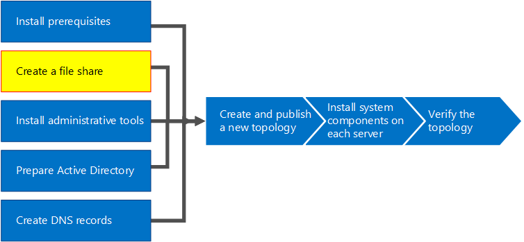

# 비즈니스용 Skype 서버에서 파일 공유 만들기Create a file share in Skype for Business Server
 
**요약:** 비즈니스용 Skype 서버용 설치의 일부로 Windows Server 파일 공유를 만드는 방법에 대해 알아봅니다.**Summary:** Learn how to create a Windows Server file share as part of the installation of Skype for Business Server. Microsoft 평가 센터에서 비즈니스용 Skype 서버의 무료 평가판을 다운로드[https://www.microsoft.com/evalcenter/evaluate-skype-for-business-server](https://www.microsoft.com/evalcenter/evaluate-skype-for-business-server)하세요.Download a free trial of Skype for Business Server from the Microsoft Evaluation center at:[https://www.microsoft.com/evalcenter/evaluate-skype-for-business-server](https://www.microsoft.com/evalcenter/evaluate-skype-for-business-server).
  
비즈니스용 Skype Server에는 파일 공유가 필요 하므로 토폴로지 전체 컴퓨터에서 파일을 교환할 수 있습니다.Skype for Business Server requires a file share so that computers throughout the topology can exchange files. 비즈니스용 Skype 서버용 설치 프로세스에서 파일 공유를 만들려면 8 단계를 실행 합니다.Creating a file share is step 2 of 8 in the installation process for Skype for Business Server. 1 ~ 5 단계는 순서에 관계 없이 수행할 수 있습니다.You can do steps 1 through 5 in any order. 그러나 다이어그램에 나와 있는 1 ~ 5 단계를 실행 하는 순서에 따라 6, 7, 8 단계를 수행 해야 합니다.However, you must do steps 6, 7, and 8 in order, and after steps 1 through 5 as outlined in the diagram. 파일 공유에 대 한 계획 세부 정보는 비즈니스용 [Skype 서버의 환경 요구 사항](../../plan-your-deployment/requirements-for-your-environment/environmental-requirements.md) 또는 비즈니스용 [skype 서버 2019에 대 한 서버 요구](../../../SfBServer2019/plan/system-requirements.md)사항을 참조 하세요.For planning details about file share, see [Environmental requirements for Skype for Business Server](../../plan-your-deployment/requirements-for-your-environment/environmental-requirements.md) or [Server requirements for Skype for Business Server 2019](../../../SfBServer2019/plan/system-requirements.md).
  

  
## 기본 파일 공유 만들기Create a basic file share

이 섹션에서는 기본 Windows Server 파일 공유를 만드는 과정을 안내 합니다.This section walks you through creating a basic Windows Server file share. 비즈니스용 Skype 서버에서 기본 Windows Server 파일 공유를 지원 합니다.A basic Windows Server file share is supported with Skype for Business Server. 그러나이는 명시적으로 고가용성을 제공 하지 않습니다.However, it does not explicitly provide high availability. 고가용성 환경의 경우 DFS (분산 파일 시스템) 파일 공유를 사용 하는 것이 좋습니다.For a high availability environment, a Distributed File System (DFS) file share is recommended. 고가용성 파일 공유 및 DFS에 대 한 자세한 내용은 비즈니스용 [Skype 서버에서 고가용성 및 재해 복구 계획](../../plan-your-deployment/high-availability-and-disaster-recovery/high-availability-and-disaster-recovery.md)을 참조 하세요.For more information about a high availability file share and DFS, see [Plan for high availability and disaster recovery in Skype for Business Server](../../plan-your-deployment/high-availability-and-disaster-recovery/high-availability-and-disaster-recovery.md).
  
> [!NOTE]
> Windows Server 2012 R2는 Windows Server 플랫폼을 사용 하는 파일 공유 솔루션 같은 SAN (저장소 영역 네트워크)을 제공 하기 위해 중요 한 leaps.Windows Server 2012 R2 has made major leaps in providing Storage Area Network (SAN)-like file share solutions using the Windows Server platform. 기존 SAN 기반 기기와 비교 하는 경우 Windows Server 2012 R2 저장소 솔루션은 성능에 미치는 영향을 최소화 하면서 비용을 절반까지 줄일 수 있습니다.When compared to a traditional SAN-based appliance, a Windows Server 2012 R2 storage solution can cut costs in half with very minimal impact to performance. Windows Server 2012 R2의 파일 공유 옵션에 대 한 자세한 내용은 다운로드 가능한 흰색 용지 [Windows Server 2012 R2 저장소](https://download.microsoft.com/download/9/4/A/94A15682-02D6-47AD-B209-79D6E2758A24/Windows_Server_2012_R2_Storage_White_Paper.pdf)를 참조 하세요.For more information about file share options in Windows Server 2012 R2, see the downloadable white paper [Windows Server 2012 R2 Storage](https://download.microsoft.com/download/9/4/A/94A15682-02D6-47AD-B209-79D6E2758A24/Windows_Server_2012_R2_Storage_White_Paper.pdf). 
  
**파일 공유를 만들기**위한 비디오 단계를 시청 하세요.Watch the video steps for **create a file share**:
  
> [!video https://www.microsoft.com/en-us/videoplayer/embed/dbef31be-e899-4a32-a1ca-370053284f56?autoplay=false]
  
### 기본 파일 공유 만들기Create a basic file share

1. 파일 공유를 호스트 하는 컴퓨터에 로그온 합니다.Log on to the computer that will host the file share.
    
2. 공유 하려는 폴더를 마우스 오른쪽 단추로 클릭 하 고 **속성**을 선택 합니다.Right-click the folder you plan to share, and select **Properties**.
    
3. **공유** 탭을 선택 하 고 **고급 공유**를 클릭 합니다.Select the **Sharing** tab, and click **Advanced Sharing**.
    
4. **이 폴더 공유**를 클릭 합니다.Click **Share this folder**.
    
5. **사용 권한을**클릭 합니다.Click **Permissions**.
    
6. 파일 공유를 호스트 하는 서버의 로컬 **관리자** 그룹을 추가 하 고 **허용: 모든 권한, 변경 및 읽기** 권한을 부여 하 고 **확인**을 클릭 합니다.Add the local **Administrators** group of the server hosting the file share, grant **Allow: Full Control, Change, and Read** rights, and then click **OK**.
    
7. **확인** 을 다시 클릭 하 고 네트워크 경로를 기록해 둡니다.Click **OK** again and take note of the network path.
    
8. **완료** 를 클릭 하 여 마법사를 닫습니다.Click **Done** to close the wizard.
    
     
  
> [!NOTE]
>파일 저장소가 DFS 공유에서 호스트 되는 경우 다음 경고가 수신 됩니다.If the file store is hosted on a DFS share, the following warning will be received:

경고: "\\<domain>\<공유>"에 대 한 공유 사용 권한에 액세스할 수 없습니다.Warning: Unable to access share permissions for "\\<domain>\<share>".

>이는 파일 서버의 관리자가 아니거나 DFS (분산 파일 시스템) 공유 인 경우에 필요 합니다.This is expected if you are not an administrator on the file server, or if this is a Distributed File System (DFS) share. 공유 사용 권한이 이미 구성 되어 있는 경우이 경고를 무시할 수 있습니다.If the share permissions have already been configured, this warning can be ignored. 새 공유 인 경우 수동으로 공유 사용 권한을 구성 하는 방법에 대 한 자세한 내용은 설명서를 참조 하세요.If it is a new share, refer to the documentation for details on manually configuring share permissions.

>DFS 공유에 대 한 공유 권한에 액세스할 수 없기 때문에 비즈니스용 Skype 서버는 파일 공유에서 그룹을 명시적으로 설정 하지 못할 수도 있습니다.Due to the inability to access the share permissions on a DFS share, Skype for Business Server will not be able to explicitly set groups on the file share. 비즈니스용 Skype 서버 구성 요소가 적절 한 권한을 사용 하 여 파일 공유에 액세스할 수 있도록 하려면 전체 제어 공유를 사용 하는 로컬 관리자 외에도 읽기 및 변경 수준 공유 권한을 사용 하 여 다음 RTC 그룹을 추가 해야 합니다. 필요한.To ensure Skype for Business Server components can access the file share with the appropriate permissions, ensure the following RTC groups are added with Read and Change level share permissions in addition to the local Administrators with Full Control share permissions.
* RTCHSUniversalServicesRTCHSUniversalServices
* RTCComponentUniversalServicesRTCComponentUniversalServices
* RTCUniversalServerAdminsRTCUniversalServerAdmins
