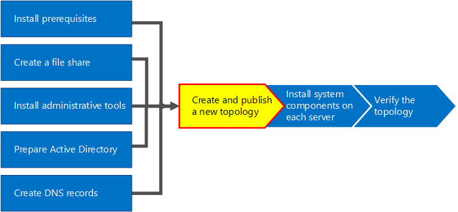
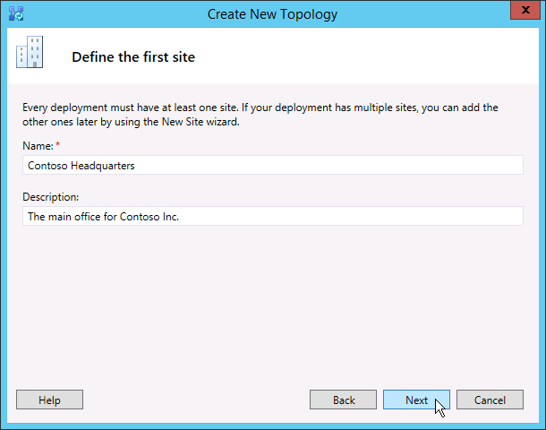

# 새 토폴로지 만들기 및 비즈니스용 Skype 서버
 
**요약:** 설치하기 전에 새 토폴로지 만들기, 게시 및 확인 방법을 비즈니스용 Skype 서버. Microsoft 평가판 센터에서 비즈니스용 Skype 서버 평가판을 [https://www.microsoft.com/evalcenter/evaluate-skype-for-business-server](https://www.microsoft.com/evalcenter/evaluate-skype-for-business-server) 다운로드합니다.
  
토폴로지의 각 서버에 비즈니스용 Skype 서버 설치하려면 먼저 토폴로지와 토폴로지 게시를 해야 합니다. 토폴로지 게시 시 토폴로지 정보를 중앙 관리 저장소 데이터베이스에 로드합니다. 이 풀이 Enterprise Edition 경우 새 토폴로지가 처음 게시될 때 중앙 관리 저장소 데이터베이스를 만듭니다. 이 Standard Edition 배포 마법사에서 첫 번째 Standard Edition 서버 준비 프로세스를 실행해야 토폴로지가 게시됩니다. 이렇게 하여 Standard Edition Edition 인스턴스를 설치하고 SQL Server Express 관리 저장소를 만들어 사용자 환경을 준비합니다. 1~5단계는 순서에 따라 수행하면 됩니다. 그러나 다이어그램에 설명된대로 1~5단계를 순서대로 6, 7, 8단계를 순서대로 수행해야 합니다. 새 토폴로지 만들기 및 게시 방법에 대한 설명은 8단계의 6단계에 설명되어 있습니다.
  

  
## 새 토폴로지 만들기 및 게시

토폴로지 작성기에서 비즈니스용 Skype 서버 토폴로지 디자인, 정의, 구성 및 게시할 수 있습니다. 이 도구는 문서 앞부분에서 관리 도구를 설치할 때 설치되었습니다. 토폴로지 작성 시 선택할 수 있는 여러 가지 선택이 있습니다. 이 절차에서는 회의가 있는 기본 토폴로지가 생성됩니다.
  
> [!IMPORTANT]
> 비즈니스용 Skype 서버 작동하려면 SQL Server 요구합니다. 기본 데이터베이스를 중앙 관리 저장소라고 합니다. 데이터베이스를 배포하는 Enterprise Edition 아래 단계를 사용하여 토폴로지 게시 시 이러한 데이터베이스가 만들어집니다. 이 경우 토폴로지 작성기에서 사용자 설치에 대한 연결 SQL Server 요청합니다. 새 토폴로지 배포를 Standard Edition 새 토폴로지가 정의 및 게시되기 전에 SQL Server Express Edition을 설치해야 합니다. SQL Server Express Edition을 설치하려면 프런트 엔드 역할을 할 서버에서 배포 마법사를 연 다음 First Standard Edition 실행해야 합니다. First Standard Edition Server 준비를 클릭하면 배포 마법사가 SQL Server Express Edition을 자동으로 설치하고 중앙 관리 저장소 데이터베이스를 만듭니다. 
  
### 새 토폴로지 만들기

1. 토폴로지 작성기 액세스 권한이 있는 표준 사용자로 로그인합니다.
    
2. 토폴로지 비즈니스용 Skype 서버 열기.
    
3. 새 **토폴로지 를** 선택하고 확인 을 **클릭합니다.**
    
4. 토폴로지 구성 파일의 위치 및 파일 이름을 선택합니다.
    
    > [!NOTE]
    > 토폴로지 구성은 토폴로지 작성기 XML(.tbxml) 파일로 저장됩니다. 토폴로지 게시 시 구성 정보를 파일에서 데이터베이스로 SQL Server 합니다. 나중에 토폴로지 작성기 열면 기존 구성을 토폴로지 작성기에서 직접 SQL Server 다운로드한 다음 토폴로지 작성기에 다시 게시하거나 SQL Server 토폴로지 작성기 구성 파일로 저장할 수 있습니다. 
  
5. 주 도메인 **정의 화면에서** 기본 **SIP** 도메인 을 입력하고 다음 을 **클릭합니다.** 이 예제에서는 그림과 같이 **contoso.local** 을 사용하고 있습니다.
    
     
  
6. 지원되는 SIP 도메인을 더 추가하고 다음 을 **클릭합니다.**
    
7. 그림과  같이  첫 번째 사이트(위치)에 대한 이름 및 설명을 입력하고 다음을 클릭합니다.
    
     
  
8. 사이트의 **시/도,** **시/도 및 국가/지역** 코드를 입력하고 다음 을  **클릭합니다.**
    
9. **마친을** 클릭하여 새 토폴로지 정의 프로세스를 완료합니다. 새 프런트 엔드 마법사가 자동으로 시작됩니다.
    
### 프런트 엔드 풀 또는 서버 Standard Edition 정의

1. 마법사 선행 준비를 검토하고 다음 을 **클릭합니다.**
    
2. 풀의 FQDN(FQDN)을 입력하고 그림과  같이 Enterprise Edition 프런트 엔드 풀 또는 Standard Edition **Server를** 선택한 후 다음을 클릭합니다. 
    
    > [!TIP]
    > 비즈니스용 Skype 서버 Enterprise Edition 프런트 엔드 역할을 제공하기 위해 함께 작업하는 여러 서버를 포함할 수 있습니다. 여러 서버를 사용하여 역할을 수행하면 풀이라고 합니다. 따라서 프런트 엔드 역할을 제공하기 위해 함께 작업하는 여러 서버를 프런트 엔드 풀이라고도 합니다. 비즈니스용 Skype 서버 Standard Edition 프런트 엔드 역할을 제공하는 단일 서버만 포함할 수 있습니다. 단일 서버만 역할을 제공하는 경우에도 프런트 엔드 풀을 참조하는 것이 일반적입니다. 
  
     
  
3. 풀에 있는 모든 컴퓨터의 FQDNS(정식 도메인 이름)를 입력하고 그림과 같이 **다음을** 클릭합니다.
    
     
  
4. 이 토폴로지에 포함될 기능을 선택하고 그림과 같이 **다음을** 클릭합니다.
    
    > [!NOTE]
    > 비즈니스용 Skype 서버 고급 기능이 많이 포함되어 있습니다. 사용하려는 각 기능에 대한 계획 및 배포 설명서를 검토합니다. 
  
     
  
5. 배치된  서버 역할 선택 페이지에서 중재 서버를 프런트 엔드 서버에 배치하거나 독립 실행형 서버로 배포할 수 있습니다.
    
    중재 서버를 프런트 엔드 풀에 Enterprise Edition 확인란을 선택해야 합니다. 서버 역할은 풀 서버에 배포됩니다. 중재 서버를 독립 실행형 서버로 배포하려는 경우 해당 확인란의 선택을 취소합니다. 프런트 엔드 서버를 완전히 배포한 후 중재 서버를 별도의 배포 단계에서 배포합니다. 설명에 대한 자세한 내용은 [Topology Basics for 비즈니스용 Skype 서버.](../../plan-your-deployment/topology-basics/topology-basics.md)
    
6. 이 프런트  엔드 풀과 서버 역할 연결 페이지를 사용하여 서버 역할을 정의하고 프런트 엔드 풀과 연결할 수 있습니다. 사용할 수 있는 역할은 다음과 같습니다.
    
    **에지 풀 사용** 단일 에지 서버 또는 에지 서버 풀을 정의하고 연결합니다. 에지 서버를 사용하면 조직 내부의 사용자와 페더레이션 사용자를 비롯한 조직 외부 사용자 간의 통신 및 공동 작업을 용이하게 할 수 있습니다.
    
    서버 역할을 배포하고 연결하기 위해 사용할 수 있는 두 가지 시나리오가 있습니다.
    
    첫 번째 시나리오는 새로운 설치에 대한 새 토폴로지를 정의하는 경우입니다. 다음 두 가지 방법 중 하나를 사용하여 설치에 접근할 수 있습니다.
    
   - 확인란을 선택하지 말고 토폴로지 정의 프런트 엔드 및 백 엔드 서버 역할을 게시, 구성 및 테스트한 후 토폴로지 작성기 를 다시 실행하여 토폴로지에 역할 서버를 추가할 수 있습니다. 이 전략을 사용하면 프런트 엔드 풀 및 서버가 실행되는 서버를 추가 역할로 SQL Server 없이 테스트할 수 있습니다. 초기 테스트를 완료한 후 토폴로지 작성기 를 다시 실행하여 배포해야 하는 역할을 선택할 수 있습니다.
    
   - 설치해야 하는 역할을 선택하고 이 역할에 맞게 하드웨어를 설정합니다.
    
     시나리오 2의 경우 기존 배포가 있으며 인프라가 새 역할을 사용할 준비가 되거나 기존 역할을 새 프런트 엔드 서버와 연결해야 합니다.
    
   - 이 경우 배포하거나 새 프런트 엔드 서버와 연결하려는 역할을 선택합니다. 어느 경우든 계속해 역할을 정의하고 필요한 하드웨어를 설정한 후 설치를 계속합니다.
    
7. 다음으로 토폴로지와 함께 SQL Server 저장소를 정의합니다. 이 예제에서는 Default 인스턴스를 사용 합니다. 고가용성과 SQL Server 기능에 대한 자세한 내용은 [Plan for high availability and disaster recovery in 비즈니스용 Skype 서버.](../../plan-your-deployment/high-availability-and-disaster-recovery/high-availability-and-disaster-recovery.md)
    
   - 토폴로지에 이미 정의된 기존 SQL Server 저장소를 사용하려면 **SQL 저장소** 에서 인스턴스를 선택합니다.
    
   - 풀 정보를 저장할 새 SQL Server 인스턴스를 정의하려면 새로 추가를 클릭한 다음 새 SQL Server 저장소 정의 대화 상자에서 SQL Server **FQD SQL N을** 지정합니다.  
    
   - SQL Server 인스턴스 이름을 지정하려면 **명명된 인스턴스** 를 선택하고 인스턴스 이름을 지정합니다.
    
   - 기본 인스턴스를 사용하려면 **기본 인스턴스** 를 클릭합니다.
    
   - 미러링 SQL 사용하려면 SQL 미러링 사용 을 선택하고 기존 인스턴스를 선택하거나 새 인스턴스를 만드면 됩니다.

     > [!NOTE]
     > SQL 미러링은 비즈니스용 Skype 서버 2015에서 사용할 수 있지만 2019년 8월에는 더 이상 비즈니스용 Skype 서버 없습니다. AlwaysOn 가용성 그룹, AlwaysOn FCI(장애 조치(failover) 클러스터 인스턴스) 및 SQL 장애 조치(failover) 클러스터링 방법이 비즈니스용 Skype 서버 선호됩니다.
    
     이 예제에서는 **FQDN SQL Server** 입력하고 관련 고가용성 설정을 구성한 다음 그림과 같이 **확인을** 클릭합니다.
    
     
  
8. 저장소 미러링 또는 SQL Server 미러링 SQL Server 사용하도록 설정할지 여부를 결정한 후 다음 을 **클릭합니다.**
    
9. 사용할 파일 공유를 정의합니다.
    
   - 토폴로지에 이미 정의된 파일 공유를 사용하려면 **이전에 정의된 파일 공유 사용** 을 선택합니다.
    
   - 새 파일 공유를 정의하려면 **새 파일 공유 정의** 를 선택하고 **파일 서버 FQDN** 상자에 파일 공유가 있는 기존 파일 서버의 FQDN을 입력한 다음 **파일 공유** 상자에 파일 공유 이름을 입력합니다.
    
     이 예제에서는 **새** 파일 저장소 정의를 클릭하고 파일 서버 **FQDN** 및 파일 공유를 **입력한** 후 다음 을 **클릭합니다.**
    
     > [!NOTE]
     > 파일 공유를 비즈니스용 Skype 서버 수 있지만 성능상의 이유로는 권장되지 않습니다. 이 예제에서는 파일 공유 역할을 할 단일 전용 서버에 파일 공유가 있습니다. 그러나 다른 보다 강력한 파일 공유 시스템(예: R2를 사용하는 DFS Windows Server 2012 사용하는 것이 좋습니다. 지원되는 파일 공유 시스템에 대한 자세한 내용은 [Requirements for your 비즈니스용 Skype environment을 참조하세요.](../../plan-your-deployment/requirements-for-your-environment/requirements-for-your-environment.md) 파일 공유를 만드는 데 대한 자세한 내용은 [에서 파일](create-a-file-share.md)공유 만들기를 비즈니스용 Skype 서버. 만들어진 파일 공유가 없는 상태에서 파일 공유를 정의할 수 있습니다. 그러려면 토폴로지를 게시하기 전에 정의한 위치에 파일 공유를 만들어야 합니다. 
  
10. 웹 서비스 URL 지정 페이지에서 내부 웹 서비스 풀 기본 URL을 다시 지정해야 하는지 여부를 결정해야 합니다. 이 재지정의 이유는 부하 분산과 관련이 있습니다. 단순 DNS 부하 분산을 통해 기본 SIP 트래픽을 부하 분산할 수 있습니다. 그러나 HTTP/S 웹 서비스 네트워크 트래픽은 지원되는 하드웨어 또는 소프트웨어 부하 분산 솔루션을 사용해야 합니다. 지원되는 부하 균형 조정에 대한 자세한 내용은 [에 대한 인프라를 비즈니스용 Skype.](../../../SfbPartnerCertification/certification/infra-gateways.md) 이 예에서는 SIP 트래픽 및 지원되는 소프트웨어 부하 분산 솔루션에 DNS 부하 분산을 사용했습니다. 이 방식으로 트래픽을 나분하기 때문에 내부 웹 서비스 풀 FQDN을 다시 정해야 합니다. 또는 최상위 부하 분산이 있는 경우 SIP 트래픽에 DNS 부하 분산을 사용하는 대신 최상위 부하 분산을 통해 모든 트래픽을 전송한 경우 웹 서비스 URL을 다시 지정하지 않고도 됩니다. 
    
    이 항목의 DNS 섹션에서 webint.contoso.local에 대한 A 레코드를 만들 수 있습니다. 이 URL은 웹 서비스 HTTP/S 트래픽에 사용하며, 설정한 지원되는 소프트웨어 부하 런저를 통과해야 합니다. 따라서 이 예제에서는 그림에 표시된 비즈니스용 Skype 서버 모든 HTTP/S 트래픽이 pool.contoso.local이 아닌 webint.contoso.local으로 이동해야 한다고 알 수 있는 URL을 다시 지정합니다. 부하 분산에 대한 자세한 내용은 에 대한 부하 분산 요구 [비즈니스용 Skype.](../../plan-your-deployment/network-requirements/load-balancing.md)
    
    > [!IMPORTANT]
    > 기본 URL은 URL에서 https://를 생략한 웹 서비스 ID입니다. 예를 들어 풀의 웹 서비스에 대한 전체 URL이 인 경우 기본 https://webint.contoso.local URL은 webint.contoso.local입니다. 
  
    - 이 예제와 같은 DNS 부하 분산을 구성하는 경우 내부 기본 URL 에서 내부 웹 서비스 풀 **FQDN 다시** 지정 확인란을 선택하고 내부 기본 **URL(풀** FQDN과 달라야 함)을 입력합니다. 
    
    > [!CAUTION]
    > 내부 웹 서비스를 자체 정의 FQDN으로 다시 정의하려면 각 FQDN이 다른 프런트 엔드 풀, Director 또는 Director 풀과 고유해야 합니다. **URL 또는 정규화된** 도메인 이름을 정의할 때 표준 문자(A-Z, a-z, 0-9 및 하이픈 포함)만 사용 유니코드 문자나 밑줄은 사용하지 마십시오. URL 또는 FQDN의 비준수 문자는 외부 DNS 및 공용 CAS(인증 기관)에서 지원되지 않는 경우가 종종 있습니다(즉, URL 또는 FQDN을 인증서의 주체 이름 또는 주체 대체 이름에 할당해야 하는 경우).
  
    - 선택적으로 외부 기본 URL 에 외부 기본 **URL을 입력합니다.** 외부 기본 URL을 입력하여 내부 도메인 이름과 차별화합니다. 예를 들어 내부 도메인은 contoso.local이지만 외부 도메인 이름은 contoso.com. 공용 DNS에서 확인할 수 contoso.com 도메인 이름을 사용하여 URL을 정의합니다. 이는 역방향 프록시의 경우에도 중요합니다. 외부 기본 URL 도메인 이름은 역방향 프록시의 FQDN 도메인 이름과 동일합니다. 모바일 클라이언트에서 인스턴트 메시징 및 현재 상태의 경우 프런트 엔드 풀에 대한 HTTP 액세스가 필요합니다.
    
      
  
11. 기능 **선택** 페이지에서 회의를 선택한  경우 웹앱 서버의 Office 선택해야 합니다. 새로 **추가를** 클릭하여 대화 상자를 실행합니다.
    
12. 새 Office **Web Apps** 서버 정의 대화 상자의 Office Web Apps 서버 FQDN 상자에 Office Web **Apps 서버의 FQDN을 입력합니다.** 이 작업을 수행하면 Office Web Apps 서버 검색 URL이 Office **입력됩니다.**
    
    Office Web Apps 서버가 Office 네트워크 영역과 동일한 네트워크 비즈니스용 Skype 서버 외부 네트워크(경계/인터넷)에 Office Web **Apps** 서버를 배포하는 경우 옵션을 선택하지 않습니다.
    
    Office Web Apps 서버가 내부 방화벽 외부에 배포된 경우 웹앱 서버가 외부 **Office(경계/인터넷)에** 배포되어 있는 경우 옵션을 선택합니다.
    
13. **마친을** 클릭하여 구성을 완료합니다. 이 프런트 엔드 풀과  서버 역할 연결 페이지에서 다른 역할 서버를 정의한 경우 서버 역할을 구성할 수 있는 별도의 역할 구성 마법사 페이지가 열립니다. 이 예제에서는 회의만 선택합니다.
    
### 단순 URL 구성

1. 토폴로지 작성기에서 맨  비즈니스용 Skype 서버 마우스 오른쪽 단추로 클릭한 다음 그림과 같이 속성 편집을 클릭합니다.
    
     
  
2. 단순 **URL** 창에서 전화 액세스 **URL:** (전화 접속) 또는 모임 URL: **(모임)을** 선택하여 편집한 다음 URL 편집 을 **클릭합니다.**
    
3. URL을 원하는 값으로 업데이트하고 **확인** 을 클릭하여 편집한 URL을 저장합니다. 외부 사용자가 내부 도메인인 contoso.local이 아니라 외부의 contoso.com 모임에 참가할 수 있도록 외부 SIP 도메인을 사용하여 단순 URL을 구성해야 합니다. 따라서 외부 DNS에서 SIP 도메인을 확인할 수 있습니다.
    
4. 필요한 경우 같은 단계를 수행하여 모임 URL을 편집합니다.
    
### 관리 단순 URL(선택 사항)을 정의하려면

1. 토폴로지 작성기에서 비즈니스용 Skype 서버 **마우스** 오른쪽 단추로 클릭한 다음 속성 **편집을 클릭합니다.**
    
2. 관리 액세스 **URL 상자에** 관리 액세스에 사용할 단순 URL을 비즈니스용 Skype 서버 확인을 **클릭합니다.**
    
    > [!TIP]
    > 관리 URL에는 최대한 간단한 URL을 사용하는 것이 좋습니다. 가장 간단한 옵션은 https://admin _\<domain\>_ 입니다. 관리 URL은 내부 또는 외부 도메인(예: contoso.local 또는 contoso.com DNS에서 확인할 수 있는 경우)일 수 있습니다. 
  
    > [!IMPORTANT]
    > 초기 배포 후에 단순 URL을 변경하는 경우에는 변경 내용이 단순 URL의 DNS(Domain Name System) 레코드 및 인증서에 주는 영향을 파악해야 합니다. 변경이 단순 URL의 기반으로 영향을 미치는 경우 DNS 레코드 및 인증서도 변경해야 합니다. 예를 들어 기본 URL을 sfb.contoso.com meet.contoso.com 변경하는 경우 DNS 레코드 및 인증서를 변경하여 기본 https://sfb.contoso.com/Meet https://meet.contoso.com URL을 meet.contoso.com. 단순 URL을 에서 로 변경한 경우 기본 URL sfb.contoso.com 동일하게 유지되어 DNS 또는 인증서를 변경할 필요가 https://sfb.contoso.com/Meet https://sfb.contoso.com/Meetings 없습니다. 그러나 단순 URL 이름을 변경할 때마다 각 Director 및 프런트 엔드 서버에서 **Enable-CsComputer** cmdlet을 실행하여 변경을 등록해야 합니다.
  
### 토폴로지 게시 및 확인

1. 모든 단순 URL이 올바르게 구성되어 있는지 확인합니다.
    
2. SQL Server 기반 서버가 온라인에 있으며 필요한 방화벽 규칙을 포함하여 토폴로지 작성기가 설치된 컴퓨터에서 사용할 수 있도록 합니다.
    
3. 파일 공유를 사용할 수 있으며 적절한 사용 권한이 정의되어 있는지 확인
    
4. 배포 요구 사항을 충족하는 올바른 서버 역할이 토폴로지에 정의되어 있는지 확인합니다.
    
5. 서버가 AD DS(Active Directory 도메인 서비스)에 있는지 확인합니다. 이 문제는 서버를 도메인에 가입할 때 자동으로 발생합니다.
    
    토폴로지를 확인한 결과 유효성 검사 오류가 없으면 토폴로지를 게시할 수 있습니다. 유효성 검사 오류가 있는 경우 토폴로지 게시를 위해 먼저 오류를 수정해야 합니다.
    
6. 비즈니스용 Skype 서버 **마우스** 오른쪽 단추로 클릭한 다음 토폴로지 **게시 를 클릭합니다.**
    
7. **토폴로지 게시** 페이지에서 **다음** 을 클릭합니다.
    
8. 중앙 관리 서버 선택 **페이지에서** 그림과 같이 프런트 엔드 풀을 선택합니다.
    
    > [!NOTE]
    > 고급을 **클릭하여** 데이터베이스 파일 위치를 구성할 수 있습니다.
  
     
  
9. 데이터베이스 **선택 페이지에서** 게시할 데이터베이스를 선택합니다.
    
    > [!NOTE]
    > 데이터베이스를 만들 수 있는 적절한 권한을 가지지 않은 경우 해당 데이터베이스 옆에 있는 확인란의 선택을 취소할 수 있으며, 적절한 권한을 가지는 다른 사용자가 나중에 데이터베이스를 만들 수 있습니다. 요구 사항에 대한 자세한 내용은 에 대한 서버 요구 [비즈니스용 Skype 서버.](../../plan-your-deployment/requirements-for-your-environment/server-requirements.md) 
  
10. 원하는 경우 **고급** 을 클릭합니다. 고급 데이터 SQL Server 파일 배치 옵션을 사용하여 다음 옵션 중 선택할 수 있습니다. 
    
    - **데이터베이스 파일** 위치 자동 결정 - 이 옵션은 로그 및 데이터 파일을 최상의 위치에 배포하여 SQL Server 기반 서버의 디스크 구성에 따라 최상의 작동 성능을 결정합니다.
    
    - **SQL Server** 기본값 사용 - 이 옵션은 인스턴스 설정을 사용하여 로그 및 데이터 SQL Server 서버로 이동합니다. 이 옵션은 SQL Server 기반 서버 작동 기능을 사용하여 로그 및 데이터의 최적 위치를 결정하지 않습니다. SQL Server 관리자는 일반적으로 SQL Server 기반 서버 및 조직 관리 절차에 적합한 위치로 로그 및 데이터 파일을 이동합니다.
    
    **확인** 을 클릭하고 **다음** 을 클릭합니다. 
    
11. 선택적으로 고급 을 **클릭합니다.** 고급 데이터 SQL Server 파일 배치 옵션을 사용하여 다음 옵션 중 선택할 수 있습니다. 
    
    - **데이터베이스 파일** 위치 자동 결정 - 이 옵션은 로그 및 데이터 파일을 최상의 위치에 배포하여 SQL Server 기반 서버의 디스크 구성에 따라 최상의 작동 성능을 결정합니다.
    
    - **SQL Server** 기본값 사용 - 이 옵션은 인스턴스 설정을 사용하여 로그 및 데이터 SQL Server 서버로 이동합니다. 이 옵션은 SQL Server 기반 서버 작동 기능을 사용하여 로그 및 데이터의 최적 위치를 결정하지 않습니다. SQL Server 관리자는 일반적으로 SQL Server 기반 서버 및 조직 관리 절차에 적합한 위치로 로그 및 데이터 파일을 이동합니다.
    
    **확인** 을 클릭합니다.
    
12. **다음** 을 클릭하여 게시 프로세스를 완료합니다.
    
    > [!NOTE]
    > 이 단계의 일반적인 오류는 데이터베이스를 SQL Server 수 없다는 것입니다. 프로세스가 완료되지 못하면 그림과 같이 오류가 제공됩니다. 가장 가능성이 큰 원인은 데이터베이스를 만들 시도하는 사용자에게 적절한 권한이 없는 경우 또는 SQL Server 네트워크 문제로 인해 SQL Server 시스템에 연결하지 못하기 때문일 수 있습니다. 
  
     
  
13. 게시 프로세스가 완료되면 다음 단계 목록을 열 수 있는 링크가 표시됩니다. 할 일 목록을 열려면 여기를 **클릭하고** 다음 단계를 확인한 다음 마친 을 **클릭합니다.** 
    
    데이터베이스를 만들 때 "경고가 표시되었습니다." 메시지가 표시된다고 해서 오류가 발생했다는 의미는 없습니다. 설치 프로세스가 제대로 작동하려면 설치 SQL Server 비즈니스용 Skype 서버 변경해야 합니다. 설정이 SQL Server 변경하면 관리자가 설치 프로세스가 완료된 SQL Server 정확하게 이해할 수 있도록 경고로 기록됩니다. 경고가 표시될 경우 레코드를 선택한 다음  로그 보기를 클릭하여 경고의 세부 정보를 볼 수 있습니다.
    
    토폴로지가 성공적으로 게시되면 토폴로지에서 실행 중인 각 서버에 중앙 관리 저장소의 로컬 비즈니스용 Skype 서버 수 있습니다. 첫 번째 프런트 엔드 풀로 시작하는 것이 좋습니다. 
