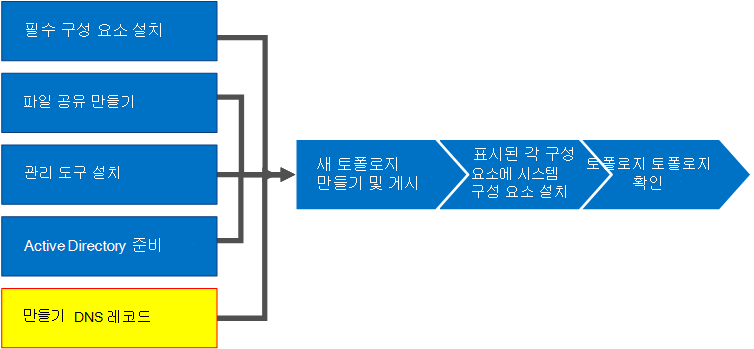
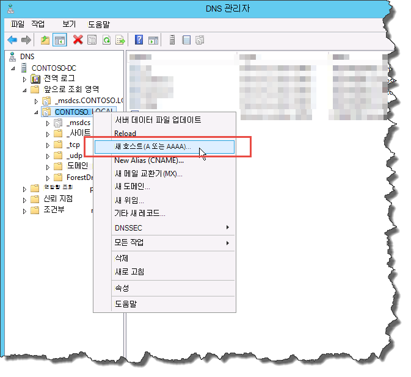
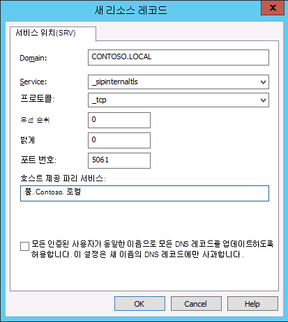
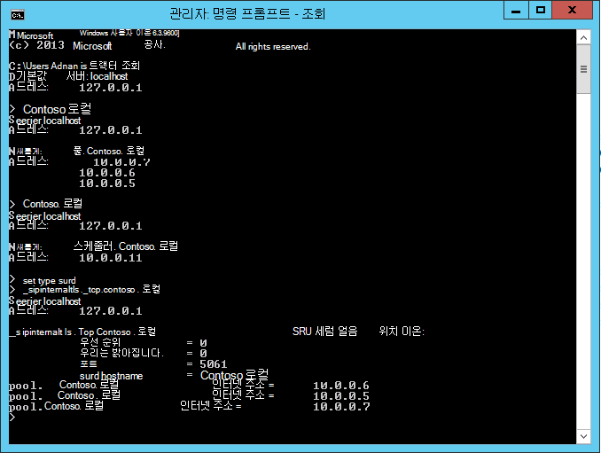

# 비즈니스용 Skype 서버에 대 한 DNS 레코드 만들기Create DNS records for Skype for Business Server
 
**요약:** 비즈니스용 Skype 서버용 설치를 위해 DNS를 구성 하 고 DNS 레코드를 만드는 방법에 대해 알아봅니다.**Summary:** Learn how to configure DNS and create DNS records for an installation of Skype for Business Server. Microsoft 평가 센터에서 비즈니스용 Skype 서버의 무료 평가판을 다운로드 [https://www.microsoft.com/evalcenter/evaluate-skype-for-business-server](https://www.microsoft.com/evalcenter/evaluate-skype-for-business-server)하세요.Download a free trial of Skype for Business Server from the Microsoft Evaluation center at: [https://www.microsoft.com/evalcenter/evaluate-skype-for-business-server](https://www.microsoft.com/evalcenter/evaluate-skype-for-business-server).
  
비즈니스용 Skype 서버가 제대로 작동 하려면 여러 DNS (Domain Name System) 설정이 적절 해야 합니다.For Skype for Business Server to work properly, a number of Domain Name System (DNS) settings must be in place. 이는 클라이언트가 서비스에 액세스 하는 방법과 서버가 서로에 대해 알고 있는지를 확인 하기 위한 것입니다.This is so that clients know how to access the services and that the servers know about each other. 이러한 설정은 DNS 항목을 할당 한 후에는 도메인 전체에서 사용할 수 있기 때문에 배포 당 한 번만 완료 해야 합니다.These settings need to be completed only once per deployment because once you assign a DNS entry, it is available throughout the domain. 1 ~ 5 단계는 순서에 관계 없이 수행할 수 있습니다.You can do steps 1 through 5 in any order. 그러나 6, 7, 8 단계를 순서 대로 수행 하 고 다이어그램에 명시 된 대로 1 ~ 5 단계를 완료 해야 합니다.However, you must do steps 6, 7, and 8 in order, and after steps 1 through 5, as outlined in the diagram. DNS 레코드 만들기는 5 단계로 구성 됩니다.Creating DNS records comprises step 5 of 8. DNS 계획에 대 한 자세한 내용은 비즈니스용 [Skype server의 환경 요구 사항](../../plan-your-deployment/requirements-for-your-environment/environmental-requirements.md) 또는 비즈니스용 [skype 서버 2019에 대 한 서버 요구](../../../SfBServer2019/plan/system-requirements.md)사항을 참조 하세요.For more information about planning DNS, see [Environmental requirements for Skype for Business Server](../../plan-your-deployment/requirements-for-your-environment/environmental-requirements.md) or [Server requirements for Skype for Business Server 2019](../../../SfBServer2019/plan/system-requirements.md).
  
> [!IMPORTANT]
> 이는 Windows Server DNS 환경에서 DNS 레코드를 만드는 방법에 대 한 예에 불과합니다.It is important to note that this is just an example of how to create DNS records in a Windows Server DNS environment. 비즈니스용 Skype Server에 필요한 다른 DNS 항목이 여러 개 있으며, DNS 레코드를 만들기 위한 절차는 조직에서 DNS를 관리 하는 데 사용 하는 시스템에 따라 달라 집니다.There are many other DNS entries that are required for Skype for Business Server, and the procedure for creating DNS records depends on the system you are using to manage DNS in your organization. DNS의 요구 사항에 대 한 전체 목록은 비즈니스용 [Skype 서버의 DNS 요구 사항](../../plan-your-deployment/network-requirements/dns.md)을 참조 하세요.For a complete list of requirements for DNS, see [DNS requirements for Skype for Business Server](../../plan-your-deployment/network-requirements/dns.md). 
  

  
## DNS 구성Configure DNS

DNS 레코드는 비즈니스용 Skype Server가 올바르게 작동 하 고 사용자가 액세스할 수 있도록 하기 위해 필요 합니다.DNS records are required for Skype for Business Server to work properly and be accessible by users.
  
이 예제에서는 이름이 pool 인 DNS 부하 분산 FQDN을 사용 합니다.This example is using a DNS load balanced FQDN named pool.contoso.local. 이 풀은 비즈니스용 Skype Server Enterprise Edition을 실행 하는 세 개의 서버로 구성 됩니다.This pool consists of three servers running Skype for Business Server Enterprise Edition. 스탠더드 버전의 프런트 엔드 서버는 단일 서버만 포함할 수 있습니다.A Standard Edition front-end server can only contain a single server. 이 예제에서와 같이 표준 버전을 사용 하면 서버의 DNS 부하 분산 조정 된 풀을 만드는 대신 프런트 엔드 역할을 참조 하는 경우 단일 Standard Edition 서버의 FQDN (정규화 된 도메인 이름)만 사용할 수 있습니다.By using Standard Edition, you would only use the fully qualified domain name (FQDN) of the single Standard Edition server when referencing the front-end role instead of creating a DNS load balanced pool of servers, as this example shows. 프런트 엔드 역할만 사용 하는이 간단한 예제에는 다음 표의 DNS 항목이 포함 되어 있습니다.This simple example that uses only the front-end role includes the DNS entries in the following table. 특정 DNS 요구 사항을 계획 하려면 [비즈니스용 Skype 서버의 DNS 요구 사항](../../plan-your-deployment/network-requirements/dns.md)을 참조 하세요.To plan your specific DNS requirements, see [DNS requirements for Skype for Business Server](../../plan-your-deployment/network-requirements/dns.md). 
  
 
|**설명****Description**|**레코드 종류****Record type**|**이름****Name**|**(으)로 확인****Resolves to**|**부하 분산 유형****Load balancing type**|
|:-----|:-----|:-----|:-----|:-----|
|내부 웹 서비스 FQDNInternal Web Services FQDN    |에서A    |webint. 지방webint.contoso.local    |내부 웹 서비스에 대 한 VIPVIP for Internal Web Services    |지원 되는 소프트웨어 및 하드웨어Supported software and hardware    |
|풀 FQDNPool FQDN    |에서A    |pool. i a 지방pool.contoso.local    |서버 SFB01의 IP 주소IP address of server SFB01    |DNSDNS    |
|SFB01 FQDNSFB01 FQDN    |에서A    |SFB01SFB01.contoso.local    |서버 SFB01의 IP 주소IP address of server SFB01    |DNSDNS    |
|풀 FQDNPool FQDN    |에서A    |pool. i a 지방pool.contoso.local    |서버 SFB02의 IP 주소IP address of server SFB02    |DNSDNS    |
|SFB02 FQDNSFB02 FQDN    |에서A    |SFB02SFB02.contoso.local    |서버 SFB02의 IP 주소IP address of server SFB02    |DNSDNS    |
|풀 FQDNPool FQDN    |에서A    |pool. i a 지방pool.contoso.local    |서버 SFB03의 IP 주소IP address of server SFB03    |DNSDNS    |
|SFB03 FQDNSFB03 FQDN    |에서A    |SFB03SFB03.contoso.local    |서버 SFB03의 IP 주소IP address of server SFB03    |DNSDNS    |
|비즈니스용 Skype 자동 검색Skype for Business Auto Discover    |에서A    |lyncdiscoverinternallyncdiscoverinternal.contoso.local    |내부 웹 서비스에 대 한 VIPVIP for Internal Web Services    |지원 되는 소프트웨어 및 하드웨어Supported software and hardware    |
|간단한 모임 URLMeeting Simple URL    |에서A    |contoso. i a 지방meet.contoso.local    |내부 웹 서비스에 대 한 VIPVIP for Internal Web Services    |지원 되는 소프트웨어 및 하드웨어Supported software and hardware    |
|전화 접속 간단한 URLDial-in Simple URL    |에서A    |전화 접속. contoso. i a 지역dialin.contoso.local    |내부 웹 서비스에 대 한 VIPVIP for Internal Web Services    |지원 되는 소프트웨어 및 하드웨어Supported software and hardware    |
|웹 스케줄러 단순 URLWeb Scheduler Simple URL    |에서A    |' 극동/지방 'scheduler.contoso.local    |내부 웹 서비스에 대 한 VIPVIP for Internal Web Services    |지원 되는 소프트웨어 및 하드웨어Supported software and hardware    |
|관리 간단한 URLAdministration Simple URL    |에서A    |관리자. i a 로컬admin.contoso.local    |내부 웹 서비스에 대 한 VIPVIP for Internal Web Services    |지원 되는 소프트웨어 및 하드웨어Supported software and hardware    |
|레거시 검색Legacy Discovery    |SRVSRV    |_sipinternaltls. _tcp_sipinternaltls._tcp.contoso.local    |풀 FQDN (port 5061)Pool FQDN (port 5061)    |해당 없음N/A    |
   
### DNS 레코드 만들기Create DNS records

1. DNS 서버에 로그온 하 고 **서버 관리자**를 엽니다.Log on to the DNS server, and open **Server Manager**.
    
2. **도구** 드롭다운 메뉴를 클릭 하 고 **DNS**를 클릭 합니다.Click the **Tools** drop-down menu, and click **DNS**.
    
3. SIP 도메인의 콘솔 트리에서 **정방향 조회 영역**을 확장 한 다음 비즈니스용 Skype 서버가 설치 될 SIP 도메인을 확장 합니다.In the console tree for your SIP domain, expand **Forward Lookup Zones**, and then expand the SIP domain in which Skype for Business Server will be installed.
    
4. SIP 도메인을 마우스 오른쪽 단추로 클릭 하 고 그림에 표시 된 대로 **새 호스트 (A 또는 AAAA)** 를 선택 합니다.Right-click the SIP domain, and select **New Host (A or AAAA)**, as shown in the figure.
    
     
  
5. **이름** 상자에 호스트 레코드의 이름을 입력 합니다 (도메인 이름이 자동으로 추가 됨).In the **Name** box, type the name of the host record (the domain name will be automatically appended).
    
6. **Ip 주소 상자**에 개별 프런트 엔드 서버의 ip 주소를 입력 한 다음 **연결 된 포인터 (PTR) 레코드 만들기** 를 선택 하거나, 해당 되 **는 경우 인증 된 모든 사용자가 동일한 소유자 이름을 사용 하 여 DNS 레코드를 업데이트 하도록 허용**합니다.In the **IP Address box**, type the IP address of the individual front-end server, and then select **Create associated pointer (PTR) record** or **Allow any authenticated user to update DNS records with the same owner name**, if applicable. 이는 DNS를 사용 하 여 웹 서비스를 제외한 모든 트래픽에 대 한 부하를 조정 하는 것으로 가정 합니다.Note that this assumes that DNS is used to load balance all traffic with the exception of web services. 이 예제에서는 표에 표시 된 세 개의 프런트 엔드 서버를 사용 합니다.In this example, we have three front-end servers as shown in the table.
    
   |**서버 이름****Server Name**|**유형****Type**|**데이터****Data**|
   |:-----|:-----|:-----|
   |SFB01SFB01    |Host (A)Host (A)    |10.0.0.510.0.0.5    |
   |SFB02SFB02    |Host (A)Host (A)    |10.0.0.610.0.0.6    |
   |SFB03SFB03    |Host (A)Host (A)    |10.0.0.710.0.0.7    |
   
7. 다음으로 풀에 대 한 DNS 부하 분산 항목을 만듭니다.Next, create the DNS load balancing entries for the pool. Dns가 동일한 DNS 풀 이름을 사용 하는 동안 dns가 풀의 개별 서버로 요청을 보낼 수 있도록 허용 합니다.DNS load balancing allows DNS to send requests to the individual servers in the pool while using the same DNS pool name. DNS 및 부하 분산에 대 한 자세한 내용은 비즈니스용 [Skype 서버의 DNS 요구 사항](../../plan-your-deployment/network-requirements/dns.md)을 참조 하세요.For more information about DNS and load balancing, see [DNS requirements for Skype for Business Server](../../plan-your-deployment/network-requirements/dns.md). 
    
    > [!NOTE]
    > 여러 서버를 함께 풀링 하는 것은 Enterprise Edition 배포 에서만 가능 합니다.Pooling multiple servers together is available only in Enterprise Edition deployments. 단일 엔터프라이즈 서버 또는 Standard Edition 서버를 배포 하는 경우 단일 서버에 대 한 A 레코드만을 만들어야 합니다.If you are deploying a single Enterprise Server or Standard Edition server, you need to create only an A record for the single server. 
  
    예를 들어 pool 및 프런트 엔드 서버 세 개가 있는 풀이 있는 경우 다음과 같은 DNS 항목을 만듭니다.For example, if you had a pool named pool.contoso.local and three front-end servers, you would create the following DNS entries:
    
   |**Q****FQDN**|**유형****Type**|**데이터****Data**|
   |:-----|:-----|:-----|
   |pool. i a 지방pool.contoso.local    |Host (A)Host (A)    |10.0.0.510.0.0.5    |
   |pool. i a 지방pool.contoso.local    |Host (A)Host (A)    |10.0.0.610.0.0.6    |
   |pool. i a 지방pool.contoso.local    |Host (A)Host (A)    |10.0.0.710.0.0.7    |
   
8. 계획 된 배포의 모든 서버에 대 한 레코드를 계속 만듭니다.Continue creating A records for all servers in the planned deployment. 
    
9. 레거시 검색에 대 한 SRV (서비스 레코드) 레코드를 만들려면 SIP 도메인을 마우스 오른쪽 단추로 클릭 하 고 **다른 새 레코드**를 선택 합니다.To create the service record (SRV) record for legacy discovery, right-click the SIP domain, and select **Other New Records**.
    
10. **리소스 레코드 종류 선택**에서 **서비스 위치 (SRV)** 를 클릭 한 다음 **레코드 만들기**를 클릭 합니다.In **Select a resource record type**, click **Service Location (SRV)**, and then click **Create Record**.
    
11. **서비스**를 클릭 한 다음 **_sipinternaltls**를 입력 합니다.Click **Service**, and then type **_sipinternaltls**.
    
12. **프로토콜**을 클릭 한 다음 **_tcp**를 입력 합니다.Click **Protocol**, and then type **_tcp**.
    
13. **포트 번호**를 클릭 한 다음 **5061**을 입력 합니다.Click **Port Number**, and then type **5061**.
    
14. **이 서비스를 제공**하는 호스트를 클릭 한 다음 풀 또는 Standard EDITION 서버의 FQDN을 입력 합니다.Click **Host offering this service**, and then type the FQDN of the pool or Standard Edition server.
    
     
  
15. **확인**을 클릭 한 다음 **완료**를 클릭 합니다.Click **OK**, and then click **Done**.
    
### DNS 레코드 확인Verify DNS records

1. 인증 된 사용자 그룹의 구성원 이거나 동등한 권한이 있는 계정을 사용 하 여 도메인의 클라이언트 컴퓨터에 로그온 합니다.Log on to a client computer in the domain with an account that is a member of the Authenticated Users group or has equivalent permissions.
    
2. **시작**을 클릭 한 다음 **cmd**를 입력 하 고 enter 키를 누릅니다.Click **Start**, and then type **cmd**, and press Enter.
    
3. **프런트 엔드 \<풀\> 의 nslookup fqdn** 또는 \*\* \<Standard edition server 또는 단일 Enterprise Edition server\>의 fqdn\*\*을 입력 하 고 enter 키를 누릅니다.Type **nslookup \<FQDN of the Front End pool\>** or **\<FQDN of the Standard Edition server or single Enterprise Edition server\>**, and press Enter.
    
4. 계속 해 서 배포에 대 한 나머지 레코드를 확인 합니다.Continue to verify the rest of the A records for your deployment.
    
5. 레거시 클라이언트를 지원 하 고 SRV 레코드를 만든 경우에는 **nslookup** 프롬프트에서 **set type = SRV** 를 입력 하 여 확인 한 다음 enter 키를 누릅니다.If you are supporting legacy clients and created the SRV record, verify it by typing **set type=srv** at the **nslookup** prompt, and then press Enter.
    
6. \*\*_Sipinternaltls를 입력 합니다. _tcp. *도메인* \*\* (예: _sipinternaltls)을 입력 한 다음 enter 키를 누릅니다.Type **_sipinternaltls._tcp. *domain*** (for example, _sipinternaltls._tcp.contoso.local), and then press Enter.
    
7. 예상 되는 출력은 그림에 표시 된 것과 유사 합니다.The expected output should be similar to that shown in the figure. 모든 DNS 레코드가 예제 출력에 표시 되지는 않지만 모든 레코드를 확인 해야 합니다.Note that not all DNS records are shown in the sample output, but all records should be verified. 
    
     
  

