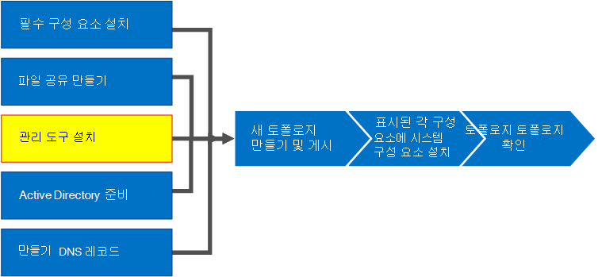
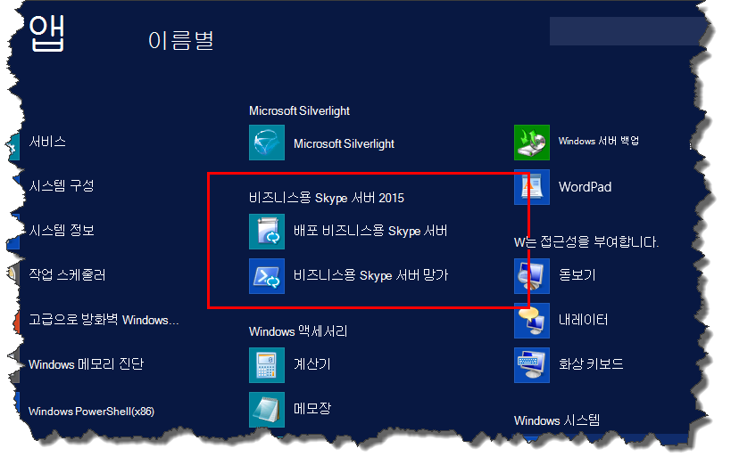
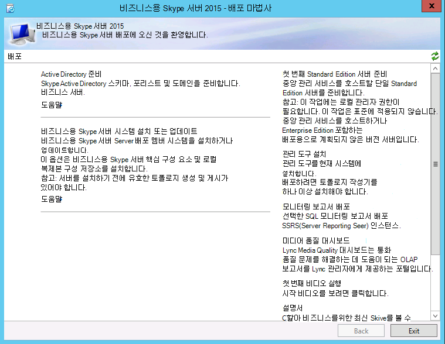
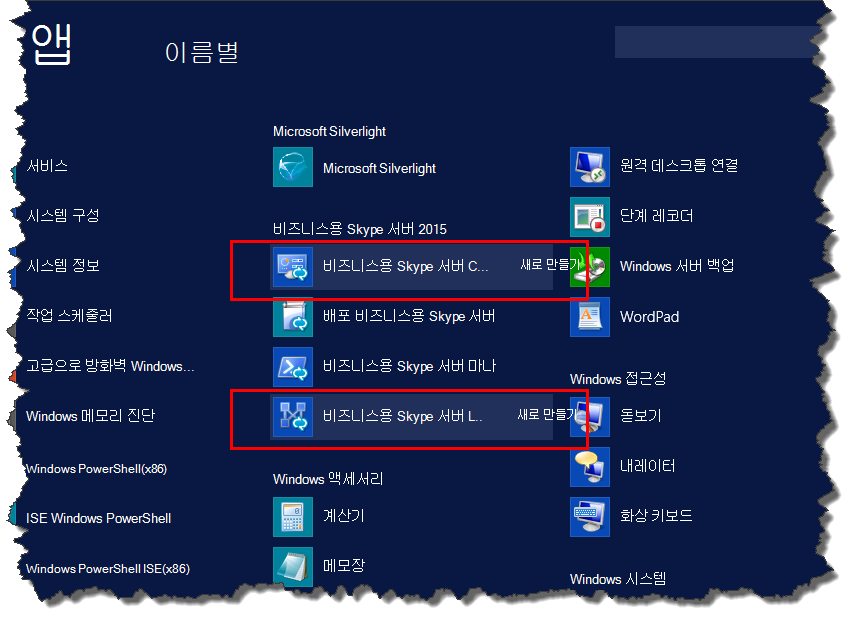

# 비즈니스용 Skype 서버 관리 도구 설치
 
**요약:** 비즈니스용 Skype 서버 설치하는 데 필요한 관리 도구를 설치하는 방법을 알아봅니다.
  
관리 도구에는 토폴로지 작성기 및 제어판 포함됩니다. 관리 도구는 토폴로지의 하나 이상의 서버 또는 비즈니스용 Skype 서버 지원되는 Windows OS 버전을 실행하는 64비트 관리 워크스테이션에 설치해야 합니다. 1~5단계는 순서대로 수행할 수 있습니다. 그러나 다이어그램에 설명된 대로 6단계, 7, 8단계를 순서대로, 1~5단계 후에 수행해야 합니다. 관리 도구 설치는 8단계 중 3단계입니다.
  

  
## 비즈니스용 Skype 서버 관리 도구 설치

비즈니스용 Skype 서버 위한 설치 미디어는 유연한 환경을 제공합니다. Setup.exe 처음 실행하면 비즈니스용 Skype 서버 배포 마법사와 비즈니스용 Skype 서버 관리 셸만 설치됩니다. 핵심 구성 요소라고 하는 이 두 도구를 사용하면 설치 프로세스를 계속할 수 있지만 전체 비즈니스용 Skype 서버 환경에 대한 기본 기능은 제공하지 않습니다. 핵심 구성 요소를 설치한 후 배포 마법사가 자동으로 시작됩니다. 관리 **도구 설치** 라는 배포 마법사 섹션은 토폴로지 작성기 및 비즈니스용 Skype 서버 제어판 비즈니스용 Skype 서버 설치합니다.
  
> [!IMPORTANT]
> 모든 비즈니스용 Skype 서버 환경에는 관리 도구가 설치된 서버가 하나 이상 있어야 합니다. 
  
**관리 도구 설치** 에 대한 비디오 단계를 시청하세요.
  
> [!video https://www.microsoft.com/videoplayer/embed/99a5c436-963b-4eed-b423-651568c87cb1?autoplay=false]
  
### 배포 마법사에서 비즈니스용 Skype 서버 관리 도구 설치

1. 비즈니스용 Skype 서버 설치 미디어를 삽입합니다. 설치가 자동으로 시작되지 않으면 **설치** 프로그램을 두 번 클릭합니다.
    
2. 설치 미디어를 실행하려면 Microsoft Visual C++ 필요합니다. 설치할지 묻는 대화 상자가 나타납니다. **예** 를 클릭합니다.
    
3. 비즈니스용 Skype 서버 새로운 기능인 스마트 설치 프로그램을 사용하여 인터넷에 연결하여 설치 프로세스 중에 업데이트를 확인할 수 있습니다. 이렇게 하면 설치 시 제품에 대한 최신 업데이트가 있는지 확인하여 더 나은 환경을 제공합니다. **설치** 를 클릭하여 설치를 시작합니다.
    
4. 사용권 계약을 주의 깊게 검토하고, 동의하는 경우 **사용권 계약의 조건에 동의** 함, **확인을** 클릭합니다.
    
5. 비즈니스용 Skype 서버 핵심 구성 요소가 서버에 설치됩니다. 
    
    핵심 구성 요소는 그림과 같이 다음으로 구성됩니다.
    
    
  
   - **비즈니스용 Skype 서버 배포 마법사** 비즈니스용 Skype 서버 다양한 구성 요소를 설치하기 위한 시작 패드를 제공하는 배포 프로그램입니다.
    
   - **비즈니스용 Skype 서버 관리 셸** 비즈니스용 Skype 서버 관리할 수 있도록 미리 구성된 PowerShell 프로그램입니다.
    
     핵심 구성 요소 설치가 완료되면 그림과 같이 비즈니스용 Skype 서버 배포 마법사가 자동으로 시작됩니다. 
    
     
  
6. 핵심 구성 요소 외에도 환경의 하나 이상의 서버에 비즈니스용 Skype 서버 토폴로지 작성기 및 비즈니스용 Skype 서버 제어판 설치해야 합니다. 배포 마법사에서 **관리 도구 설치** 를 클릭합니다.
    
7. **다음** 을 클릭하여 설치를 시작합니다.
    
8. 설치가 완료되면 **마침** 을 클릭합니다. 이제 그림과 같이 관리 도구가 서버에 추가됩니다.
    
    
  
   - **토폴로지 작성기 비즈니스용 Skype 서버** 토폴로지 빌드, 배포 및 관리하는 데 사용되는 프로그램입니다.
    
   - **비즈니스용 Skype 서버 제어판** 설치를 관리하는 데 사용되는 프로그램입니다.
    

