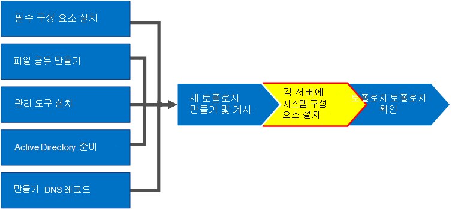
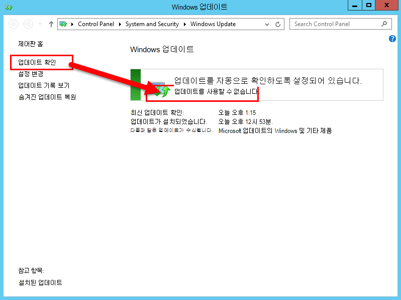
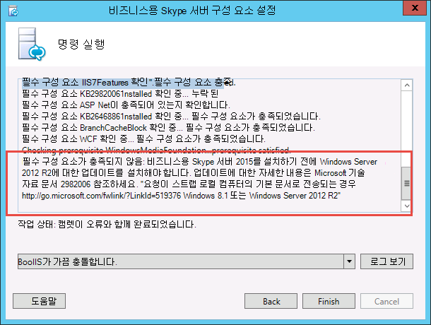
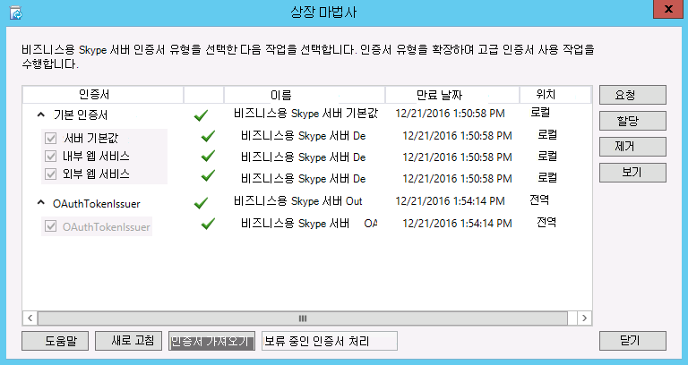
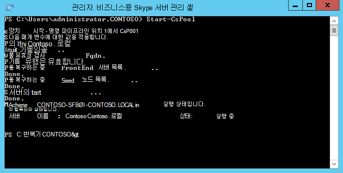
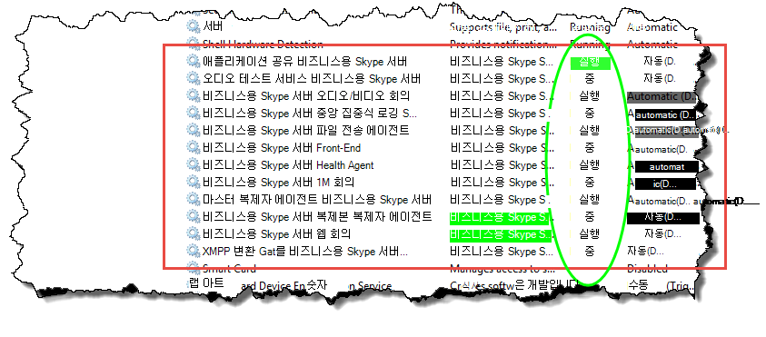

# 토폴로지의 서버에 비즈니스용 Skype 서버 설치Install Skype for Business Server on servers in the topology
 
**요약:** 토폴로지의 각 서버에 비즈니스용 Skype 서버 시스템 구성 요소를 설치 하는 방법에 대해 알아봅니다.**Summary:** Learn how to install the Skype for Business Server system components on each server in the topology. [Microsoft 평가 센터](https://www.microsoft.com/evalcenter/evaluate-skype-for-business-server)에서 비즈니스용 Skype 서버의 무료 평가판을 다운로드 하세요.Download a free trial of Skype for Business Server from the [Microsoft Evaluation center](https://www.microsoft.com/evalcenter/evaluate-skype-for-business-server).
  
토폴로지가 중앙 관리 저장소에 로드 되 고 Active Directory는 어떤 서버가 어떤 역할을 수행할 것인지 알고 있으면 토폴로지의 각 서버에 비즈니스용 Skype Server system을 설치 해야 합니다.Once the topology is loaded into the Central Management Store and Active Directory knows which servers will perform which roles, you need to install the Skype for Business Server system on each of the servers in the topology. 1 ~ 5 단계는 순서에 관계 없이 수행할 수 있습니다.You can do steps 1 through 5 in any order. 그러나 다이어그램에 나와 있는 1 ~ 5 단계를 실행 하는 순서에 따라 6, 7, 8 단계를 수행 해야 합니다.However, you must do steps 6, 7, and 8 in order, and after steps 1 through 5 as outlined in the diagram. 비즈니스용 Skype 서버 시스템 설치는 7 단계입니다.Installing the Skype for Business Server system is step 7 of 8.
  

  
## 비즈니스용 Skype 서버 시스템 설치Install Skype for Business Server system

토폴로지를 게시 하면 토폴로지의 각 서버에 비즈니스용 Skype 서버 구성 요소를 설치할 수 있습니다.Once you have published a topology, you can install the Skype for Business Server components on each server in the topology. 이 섹션에서는 비즈니스용 Skype Server 설치 및 프런트 엔드 서버를 사용 하는 collocated 서버 역할에 대 한 서버 역할 설정에 대 한 지침을 제공 합니다.This section guides you through installing Skype for Business Server and setting up the server roles for the Front End pool and any server roles that are collocated with the Front End servers. 서버 역할을 설치 하 고 설정 하려면 서버 역할을 설치 하는 각 컴퓨터에서 비즈니스용 Skype 서버 배포 마법사를 실행 합니다.To install and set up server roles, you run the Skype for Business Server Deployment Wizard on each computer on which you are installing a server role. 배포 마법사를 사용 하 여 로컬 구성 저장소 설치, 프런트 엔드 서버 설치, 인증서 구성, 서비스 시작 등 네 가지 배포 단계를 모두 완료 합니다.You use the Deployment Wizard to complete all four deployment steps, including installing the Local Configuration store, installing the Front End Servers, configuring certificates, and starting services.
  
> [!IMPORTANT]
> 서버에 비즈니스용 Skype 서버를 설치 하기 전에 토폴로지 작성기를 사용 하 여 토폴로지를 완료 하 고 게시 해야 합니다.You must use Topology Builder to complete and publish the topology before you can install Skype for Business Server on servers. 
  
> [!NOTE]
> 이 절차는 토폴로지의 모든 서버에 대해 완료 되어야 합니다.This procedure must be completed for all servers in the topology. 
  
> [!CAUTION]
> 프런트 엔드 서버에 비즈니스용 Skype 서버를 설치한 후 서비스를 처음 시작 하면 서버에서 Windows 방화벽 서비스를 실행 하 고 있는지 확인 해야 합니다.After you install Skype for Business Server on a Front End Server, the first time you start services, you must make sure that the Windows Firewall Service is running on the server. 
  
> [!CAUTION]
> 이 단계를 수행 하기 전에 로컬 관리자이 고 RTCUniversalServerAdmins 그룹의 구성원 인 도메인 사용자 계정을 사용 하 여 서버에 로그온 되어 있는지 확인 하세요.Before you follow these steps, make sure you're logged onto the server with a domain user account that's both a local administrator and a member of the RTCUniversalServerAdmins group. 
  
> [!NOTE]
> 이전에이 서버에서 비즈니스용 Skype 서버 설치를 실행 하지 않은 경우 설치를 위한 드라이브와 경로를 묻는 메시지가 표시 됩니다.If you haven't run Skype for Business Server setup on this server before, you'll be prompted for a drive and path for the installation. 이렇게 하면 조직에 필요한 경우 시스템 드라이브가 아닌 드라이브에 설치 하거나 공간에 문제가 있는 경우이 기능을 사용할 수 있습니다.This provides the capability to install to a drive other than the system drive, if your organization requires it, or if you have space concerns. **설정** 대화 상자에서 비즈니스용 Skype 서버 파일의 설치 위치 경로를 사용 가능한 새 드라이브로 변경할 수 있습니다.You can change the installation location path for the Skype for Business Server files in the **Setup** dialog box to a new, available drive. OCSCore를 포함 하 여이 경로에 설치 파일을 설치 하는 경우에는 비즈니스용 Skype 서버 파일의 나머지 부분도 함께 배포 됩니다.If you install the Setup files to this path, including OCSCore.msi, the rest of the Skype for Business Server files will deploy there as well.
  
> [!IMPORTANT]
> 설치를 시작 하기 전에 windows Update를 사용 하 여 Windows Server가 최신 상태 인지 확인 합니다.Before you begin the installation, make sure that Windows Server is up-to-date by using Windows Update. 
  

  
### 비즈니스용 Skype 서버 시스템 설치Install Skype for Business Server system

1. 비즈니스용 Skype 서버 설치 미디어를 삽입 합니다.Insert the Skype for Business Server installation media. 설치 프로그램이 자동으로 시작 되지 않으면 **설정을**두 번 클릭 합니다.If the setup does not automatically begin, double-click **Setup**.
    
2. 설치 미디어를 실행 하려면 Microsoft Visual c + +가 필요 합니다.The installation media requires Microsoft Visual C++ to run. 설치 여부를 묻는 대화 상자가 팝업 됩니다.A dialog will pop up asking if you want to install it. **예를 클릭 합니다.**Click **Yes.**
    
3. 사용권 계약을 신중 하 게 검토 하 고 동의할 경우 **사용권 계약에 동의 함을**선택 하 고 **확인**을 클릭 합니다.Carefully review the License Agreement, and if you agree, select **I accept the terms in the license agreement**, and click **OK**. 
    
4. 스마트 설정은 그림과 같이 설치 프로세스 중에 Microsoft Update (MU)의 업데이트를 확인 하도록 인터넷에 연결할 수 있는 비즈니스용 Skype 서버의 기능입니다.Smart Setup is a feature in Skype for Business Server where you can connect to the Internet to check for updates from Microsoft Update (MU) during the installation process, as shown in the figure. 이는 제품에 대 한 최신 업데이트가 있는지 확인 하 여 더 나은 환경을 제공 합니다.This provides a better experience by making sure you have the most recent updates for the product. 설치 \*\*\*\* 를 클릭 하 여 설치를 시작 합니다.Click **Install** to begin the installation.
    
    > [!NOTE]
    > 대부분의 조직에서는 회사 환경에 WSUS (Windows Server Update Services)를 배포 합니다.Many organizations have Windows Server Update Services (WSUS) deployed in their corporate environments. WSUS를 통해 관리자는 네트워크의 컴퓨터에 대해 Microsoft 업데이트를 통해 릴리스된 업데이트의 배포를 완전히 관리할 수 있습니다.WSUS lets administrators fully manage the distribution of updates that are released through Microsoft Update to computers in their network. 누적 업데이트 1 릴리스 비즈니스용 Skype Server의 일부로 WSUS에서 작동 하는 스마트 설치 지원이 도입 되었습니다.As part of the Cumulative Update 1 release Skype for Business Server introduced support for Smart Setup to work with WSUS. 현재 위치 업그레이드 기능을 사용 하 여 비즈니스용 Skype Server를 처음으로 배포 하거나 Lync Server 2013 환경에서 업그레이드 하는 경우 WSUS를 사용 하는 고객은 업데이트를 가져오는 대신 WSUS에서 Windows 용 Skype 업데이트를 가져와 스마트 설정 합니다. MU.Customers with WSUS who are deploying Skype for Business Server for the first time or upgrading from the Lync Server 2013 environment using the In-Place Upgrade feature will have Smart Setup fetching Skype for Windows updates from WSUS as opposed to fetching updates from MU. 스마트 설정을 사용 하려는 고객은 Setup.exe를 실행 하기 전에 모든 컴퓨터에서 SmartSetupWithWSUS을 실행 해야 합니다.Customers wanting to use Smart Setup need to run the SmartSetupWithWSUS.psq on all the machines before running Setup.exe. 
  
     
  
5. 배포 마법사 페이지에서 **비즈니스용 Skype 서버 시스템 설치 또는 업데이트**를 클릭 합니다.On the Deployment Wizard page, click **Install or Update Skype for Business Server System**.
    
6. 다음 절차를 완료 했을 때의 절차를 수행 하 고 **끝내기** 를 클릭 하 여 배포 마법사를 닫습니다.Perform the procedures in the following procedures, when you've completed them, click **Exit** to close the Deployment Wizard. 풀의 각 프런트 엔드 서버에 대해이 절차를 반복 합니다.Repeat the procedures for each Front End server in the pool.
    
### 1 단계: 로컬 구성 저장소 설치Step 1: Install Local Configuration Store

1. 필수 구성 요소를 검토 하 고 **1 단계: 로컬 구성 저장소 설치**옆의 **실행** 을 클릭 합니다.Review the prerequisites, and then click **Run** next to **Step 1: Install Local Configuration Store**.
    
    > [!NOTE]
    > 로컬 구성 저장소는 중앙 관리 저장소의 읽기 전용 복사본입니다.The Local Configuration Store is a read-only copy of the Central Management Store. 스탠더드 버전 배포의 경우 프런트 엔드 서버에서 SQL Server Express Edition의 로컬 복사본을 사용 하 여 중앙 관리 저장소를 만듭니다.In a Standard Edition deployment, the Central Management Store is created using a local copy of SQL Server Express Edition on the Front End server. 이는 첫 번째 Standard Edition Server 준비 절차를 실행할 때 발생 합니다.This happens when you run the Prepare First Standard Edition Server procedure. Enterprise Edition 배포에서 중앙 관리 저장소는 Enterprise Edition 프런트 엔드 풀을 포함 하는 토폴로지를 게시할 때 만들어집니다.In an Enterprise Edition deployment, the Central Management store is created when you publish the topology that includes an Enterprise Edition Front End pool. 
  
2. **로컬 구성 저장소 설치** 페이지에서 **중앙 관리 저장소에서 직접 검색** 옵션이 선택 되어 있는지 확인 하 고 **다음**을 클릭 합니다.On the **Install Local Configuration Store** page, make sure that the **Retrieve directly from the Central Management store** option is selected, and then click **Next**.
    
    SQL Server Express Edition이 로컬 서버에 설치 되어 있습니다.SQL Server Express Edition is installed on the local server. 로컬 구성 저장소에 SQL Server Express Edition이 필요 합니다.SQL Server Express Edition is required for the local configuration store.
    
3. 로컬 서버 구성 설치가 완료되면 **마침**을 클릭합니다.When the local server configuration installation is complete, click **Finish**.
    
### 2 단계: 비즈니스용 Skype 서버 구성 요소 설정 또는 제거Step 2: Setup or remove Skype for Business Server components

1. 필수 구성 요소를 검토 하 고 **2 단계: 비즈니스용 Skype 서버 구성 요소 설치 또는 제거 옆의** **실행** 을 클릭 합니다.Review the prerequisites, and then click **Run** next to **Step 2: Setup or Remove Skype for Business Server Components**.
    
2. **비즈니스용 Skype 서버 구성 요소 설정** 페이지에서 **다음** 을 클릭 하 여 게시 된 토폴로지에 정의 되어 있는 구성 요소를 설정 합니다.On the **Set Up Skype for Business Server Components** page, click **Next** to set up components as defined in your published topology.
    
3. 명령 **실행** 페이지에는 설정 된 대로 명령 및 설치 정보에 대 한 요약이 표시 됩니다.The **Executing Commands** page displays a summary of commands and installation information as the set up takes place. 완료 되 면 목록을 사용 하 여 보려는 로그를 선택한 다음 **로그 보기**를 클릭 하면 됩니다.When it's done, you can use the list to select a log to view, and then click **View Log**.
    
4. 비즈니스용 Skype 서버 구성 요소를 설치 하 고 필요에 따라 로그를 검토 한 경우 **마침을** 클릭 하 여 설치에이 단계를 완료 합니다.When Skype for Business Server components setup is done and you've reviewed the logs as needed, click **Finish** to complete this step in the installation.
    
    > [!NOTE]
    > 메시지가 표시 되 면 서버를 다시 시작 합니다 (Windows 데스크톱 환경을 설치 해야 하는 경우에 발생할 수 있음).Restart the server if prompted (which might happen if Windows Desktop Experience needed to be installed). 컴퓨터를 백업 하 고 실행 하는 경우에는 (2 단계: 비즈니스용 Skype 서버 구성 또는 제거) 절차를 다시 실행 해야 합니다.When the computer is back up and running, you need to run this (Step 2: Setup or Remove Skype for Business Server Components) procedure again. 
  
    > [!NOTE]
    > 설치 관리자가 만족 하지 않은 필수 구성 요소를 찾으면 그림에 표시 된 대로 "필수 구성 요소 충족 되지 않음" 메시지가 나타납니다.If the installer finds any prerequisites that have not been satisfied, you will be notified with a "Prerequisite not satisfied" message, as shown in the figure. 필요한 필수 구성 요소를 충족 하 고 나 서 (2 단계: 비즈니스용 Skype 서버 구성 또는 제거) 절차를 다시 시작 합니다.Satisfy the required prerequisite, and then start this (Step 2: Setup or Remove Skype for Business Server Components) procedure again. 
  
     
  
5. 처음 두 단계가 예상 대로 완료 되었는지 확인 합니다.Verify that the first two steps completed as expected. 그림과 같이 단어 **완성**이 표시 된 녹색 체크 표시를 확인 합니다.Confirm that there is a green checkmark with the word **Complete**, as shown in the figure.
    
     
  
6. **Windows 업데이트** 를 다시 실행 하 여 비즈니스용 Skype 서버 구성 요소를 설치한 후 업데이트가 있는지 확인 합니다.Run **Windows Update** again to check if there are any updates after you install the Skype for Business Server Components.
    
### 3 단계: 인증서 요청, 설치 또는 할당Step 3: Request, install, or assign certificates

1. 필수 구성 요소를 검토 하 고 **3 단계: 인증서 요청, 설치 또는 할당**옆의 **실행** 을 클릭 합니다.Review the prerequisites, and then click **Run** next to **Step 3: Request, Install or Assign Certificates**.
    
    > [!NOTE]
    > 비즈니스용 Skype Server에는 Windows 10, Windows 8, Windows 7, Windows Server 2012 R2, Windows를 실행 하는 클라이언트의 연결에 대 한 다이제스트 해시 및 서명 알고리즘의 SHA-1 제품군 (SHA-1-2에서 다이제스트 길이 224, 256, 384 또는 512 비트)에 대 한 지원이 포함 됩니다. 서버 2012 또는 Windows Server 2008 R2 운영 체제.Skype for Business Server includes support for the SHA-2 suite (SHA-2 uses digest lengths of 224, 256, 384 or 512 bits) of digest hash and signing algorithms for connections from clients running the Windows 10, Windows 8, Windows 7, Windows Server 2012 R2, Windows Server 2012, or Windows Server 2008 R2 operating systems. SHA-2 제품군을 사용 하 여 외부 액세스를 지원 하기 위해 외부 인증서는 동일한 비트 길이 다이제스트를 사용 하 여 인증서를 발급할 수 있는 공용 CA에서 발급 합니다.To support external access using the SHA-2 suite, the external certificate is issued by a public CA that also can issue a certificate with the same bit length digest. 
  
    > [!IMPORTANT]
    > 인증서를 사용 하는 클라이언트 및 서버, 그리고 클라이언트와 서버가 통신 하는 다른 컴퓨터 및 장치에 따라 달라 지는 선택 항목은 사용자가 사용 하는 알고리즘을 사용 하는 방법을 알고 있어야 하는 경우에만 해당 됩니다. 인증.The selection of which hash digest and signing algorithm is dependent on the clients and the servers that will use the certificate, and other computers and devices that clients and servers will communicate with who must also know how to use the algorithms used in the certificate. 운영 체제와 일부 클라이언트 응용 프로그램에서 지원 되는 다이제스트 길이에 대 한 자세한 내용은 [WINDOWS PKI 블로그-SHA2 및 windows](https://go.microsoft.com/fwlink/p/?LinkId=287002)를 참조 하세요.For information on which digest lengths are supported in the operating system and some client applications, see [Windows PKI blog - SHA2 and Windows](https://go.microsoft.com/fwlink/p/?LinkId=287002). 
  
    각 Standard Edition 또는 프런트 엔드 서버에는 자격 증명을 최대 4 개 (oAuthTokenIssuer 발급자 인증서, 기본 인증서, 웹 내부 인증서, 웹 외부 인증서가 필요 합니다.Each Standard Edition or Front End server requires up to four certificates: the oAuthTokenIssuer certificate, a default certificate, a web internal certificate, and a web external certificate. 그러나 적절 한 주체 대체 이름 항목과 함께 oAuthTokenIssuer 인증서를 사용 하 여 단일 기본 인증서를 요청 하 고 할당할 수 있습니다.However, you can request and assign a single default certificate with appropriate subject alternative name entries as well as the oAuthTokenIssuer certificate. 인증서 요구 사항에 대 한 자세한 내용은 비즈니스용 [Skype 서버에 대 한 환경 요구 사항](../../plan-your-deployment/requirements-for-your-environment/environmental-requirements.md) 또는 비즈니스용 [skype Server 2019의 서버 요구](../../../SfBServer2019/plan/system-requirements.md)사항을 참조 하세요.For details about the certificate requirements, see [Environmental requirements for Skype for Business Server](../../plan-your-deployment/requirements-for-your-environment/environmental-requirements.md) or [Server requirements for Skype for Business Server 2019](../../../SfBServer2019/plan/system-requirements.md).
    
    > [!IMPORTANT]
    > 다음 절차에서는 내부 Active Directory 인증서 서비스 기반 인증 기관에서 인증서를 구성 하는 방법에 대해 설명 합니다.The following procedure describes how to configure certificates from an internal Active Directory Certificate Services based certificate authority. 
  
2. **인증서 마법사** 페이지에서 **요청**을 클릭 합니다.On the **Certificate Wizard** page, click **Request**.
    
3. **인증서 요청** 페이지에서 SIP 도메인 선택 등의 관련 데이터를 입력 하 고 **다음**을 클릭 합니다.On the **Certificate Request** page fill in the relevant data including selecting the SIP domain and , click **Next**.
    
4. **지연 또는 즉시 요청** 페이지에서 **다음**을 클릭 하 여 기본적으로 **온라인 인증 기관에 게 요청을 보냅니다** 옵션으로 수락할 수 있습니다.On the **Delayed or Immediate Requests** page, you can accept the default **Send the request immediately to an online certification authority** option by clicking **Next**. 이 옵션을 선택 하는 경우 자동 온라인 등록을 사용 하는 내부 CA를 사용할 수 있어야 합니다.The internal CA with automatic online enrollment must be available if you select this option. 요청을 지연 하는 옵션을 선택 하면 인증서 요청 파일을 저장할 이름과 위치를 입력 하 라는 메시지가 표시 됩니다.If you choose the option to delay the request, you will be prompted for a name and location to save the certificate request file. 인증서 요청은 조직 내부 또는 공개 CA에서 CA에 의해 표시 되 고 처리 되어야 합니다.The certificate request must be presented and processed by a CA either inside your organization, or by a public CA. 그런 다음 인증서 응답을 가져와 적절 한 인증서 역할에 할당 해야 합니다.You will then need to import the certificate response and assign it to the proper certificate role.
    
5. **Ca (인증 기관 선택)** 페이지에서 **환경에서 검색 된 목록에서 CA 선택** 옵션을 선택한 다음 목록에서 알려진 (Active Directory 도메인 서비스에서 등록을 통해) ca를 선택 합니다.On the **Choose a Certificate Authority (CA)** page, select the **Select a CA from the list detected in your environment** option, and then select a known (through registration in Active Directory Domain Services) CA from the list. 또는 **다른 인증 기관 지정** 옵션을 선택 하 고 상자에 다른 CA의 이름을 입력 한 후 **다음**을 클릭 합니다.Or, select the **Specify another certification authority** option, enter the name of another CA in the box, and then click **Next**.
    
6. **인증 기관 계정** 페이지에 CA에서 인증서 요청을 요청 하 고 처리 하는 자격 증명을 입력 하 라는 메시지가 표시 됩니다.On the **Certificate Authority Account** page, you are prompted for credentials to request and process the certificate request at the CA. 미리 인증서를 요청 하는 데 사용자 이름 및 암호가 필요한 경우를 결정 해야 합니다.You should have determined if a user name and password is necessary to request a certificate in advance. CA 관리자에 게 필요한 정보를 포함 하 고 있으며이 단계에서 도움을 받을 수 있습니다.Your CA administrator will have the required information and might have to assist you in this step. 대체 자격 증명을 제공 해야 하는 경우 확인란을 선택 하 고 텍스트 상자에 사용자 이름 및 암호를 입력 한 후 **다음**을 클릭 합니다.If you need to supply alternate credentials, select the check box, provide a user name and password in the text boxes, and then click **Next**.
    
7. **대체 인증서 서식 파일 지정** 페이지에서 기본 웹 서버 서식 파일을 사용 하려면 **다음**을 클릭 합니다.On the **Specify Alternate Certificate Template** page, to use the default Web Server template, click **Next**.
    
    > [!NOTE]
    > 조직에서 기본 웹 서버 CA 서식 파일 대신 사용할 서식 파일을 만든 경우 확인란을 선택 하 고 대체 서식 파일의 이름을 입력 합니다.If your organization has created a template for use as an alternative for the default Web server CA template, select the check box, and then enter the name of the alternate template. CA 관리자가 정의한 서식 파일 이름이 필요 합니다.You will need the template name as defined by the CA administrator. 
  
8. **이름 및 보안 설정** 페이지에서 **대화명**을 지정 합니다.On the **Name and Security Settings** page, specify a **Friendly Name**. 대화명을 사용 하 여 인증서와 용도를 빠르게 확인할 수 있습니다.By using a friendly name, you can quickly identify the certificate and purpose. 비워 두면 이름이 자동으로 생성 됩니다.If you leave it blank, a name will be generated automatically. 키의 **비트 길이** 를 설정 하거나 기본값 2048 비트를 받아들입니다.Set the **Bit length** of the key, or accept the default of 2048 bits. 인증서와 개인 키를 다른 시스템으로 이동 하거나 복사 하도록 결정 한 경우 **인증서의 개인 키를 내보낼** 수 있도록 표시를 선택 하 고 **다음**을 클릭 합니다.Select the **Mark the certificate's private key as exportable** if you determine that the certificate and private key needs to be moved or copied to other systems, and then click **Next**.
    
    > [!NOTE]
    > 비즈니스용 Skype 서버에는 내보내기 가능한 개인 키에 대 한 최소 요구 사항이 있습니다.Skype for Business Server has minimal requirements for an exportable private key. 이러한 위치 중 하나는 풀의 각 인스턴스에 대 한 개별 인증서 대신 미디어 릴레이 인증 서비스에서 인증서 복사본을 사용 하는 Edge 서버에 있습니다.One such place is on the Edge Servers in a pool, where the Media Relay Authentication Service uses copies of the certificate, rather than individual certificates for each instance in the pool. 
  
9. **조직 정보** 페이지에서 조직 정보를 선택적으로 제공 하 고 **다음**을 클릭 합니다.On the **Organization Information** page, optionally provide organization information, and then click **Next**.
    
10. **지리적 정보** 페이지에서 필요에 따라 지리 정보를 제공 하 고 **다음**을 클릭 합니다.On the **Geographical Information** page, optionally provide geographical information, and then click **Next**.
    
11. **주체 이름/주체 대체 이름** 페이지에서 추가할 주체의 대체 이름을 검토 하 고 **다음**을 클릭 합니다.On the **Subject Name / Subject Alternate Names** page, review the subject alternative names that will be added, and then click **Next**.
    
12. **Sip 도메인 설정** 페이지에서 **sip 도메인**을 선택 하 고 **다음**을 클릭 합니다.On the **SIP Domain setting** page, select the **SIP Domain**, and then click **Next**.
    
13. **추가 제목 대체 이름 구성** 페이지에서 나중에 추가 SIP 도메인에 필요할 수 있는 모든 항목을 포함 하 여 필요한 추가 주체 대체 이름을 추가 하 고 **다음**을 클릭 합니다.On the **Configure Additional Subject Alternate Names** page, add any additional required subject alternative names, including any that might be required for additional SIP domains in the future, and then click **Next**.
    
14. **인증서 요청 요약** 페이지에서 요약의 정보를 검토 합니다.On the **Certificate Request Summary** page, review the information in the summary. 정보가 올바르면 **다음**을 클릭 합니다.If the information is correct, click **Next**. 설정을 수정 하거나 변경 해야 하는 경우 적절 한 페이지로 **뒤로** 를 클릭 하 여 수정 또는 수정을 수행 합니다.If you need to correct or modify a setting, click **Back** to the proper page to make the correction or modification.
    
15. **명령 실행** 페이지에서 **다음**을 클릭 합니다.On the **Executing Commands** page, click **Next**.
    
16. **온라인 인증서 요청 상태** 페이지에서 반환 된 정보를 검토 합니다.On the **Online Certificate Request Status** page, review the information returned. 인증서가 로컬 인증서 저장소에 발급 되 고 설치 되었는지 확인 해야 합니다.You should note that the certificate was issued and installed into the local certificate store. 발급 되 고 설치 된 것으로 보고 되었지만 유효 하지 않은 경우 CA 루트 인증서가 서버의 신뢰할 수 있는 루트 CA 저장소에 설치 되어 있는지 확인 합니다.If it is reported as having been issued and installed, but it is not valid, make sure that the CA root certificate has been installed in the server's Trusted Root CA store. 신뢰할 수 있는 루트 CA 인증서를 검색 하는 방법에 대 한 CA 설명서를 참조 하세요.Refer to your CA documentation on how to retrieve a Trusted Root CA certificate. 검색 된 인증서를 확인 해야 하는 경우 **인증서 정보 보기**를 클릭 합니다.If you need to view the retrieved certificate, click **View Certificate Details**. 기본적으로 **비즈니스용 Skype 서버 인증서 사용량에 인증서를 할당 하** 는 확인란이 선택 되어 있습니다.By default, the check box for **Assign the certificate to Skype for Business Server certificate usages** is selected. 수동으로 인증서를 할당 하려면 확인란의 선택을 취소 하 고 **마침을**클릭 합니다.If you want to manually assign the certificate, clear the check box, and then click **Finish**.
    
17. 이전 페이지에서 **비즈니스용 Skype 서버 인증서 용도에 인증서 할당** 확인란의 선택을 취소 한 경우 **인증서 할당** 페이지가 표시 됩니다.If you cleared the check box for **Assign the certificate to Skype for Business Server certificate usages** on the previous page, you will be presented with the **Certificate Assignment** page. **다음**을 클릭 합니다.Click **Next**.
    
18. **인증서 저장소** 페이지에서 요청한 인증서를 선택 합니다.On the **Certificate Store** page, select the certificate that you requested. 인증서를 보려면 **인증서 정보 보기**를 클릭 하 고 **다음** 을 클릭 하 여 계속 합니다.If you want to view the certificate, click **View Certificate Details**, and then click **Next** to continue.
    
    > [!NOTE]
    > **온라인 인증서 요청 상태** 페이지 인증서가 유효 하지 않은 경우와 같은 인증서 문제를 보고 한 경우 문제 해결에 대 한 실제 인증서를 확인 합니다.If the **Online Certificate Request Status** page reported an issue with the certificate, such as the certificate is not valid, view the actual certificate for help in resolving the issue. 인증서가 유효 하지 않게 될 수 있는 두 가지 문제가 앞에서 언급 한 신뢰할 수 있는 루트 CA 인증서와 인증서와 연결 된 개인 키가 없습니다.Two specific issues that can cause a certificate to not be valid is the previously mentioned missing Trusted Root CA certificate, and a missing private key that is associated with the certificate. 이러한 두 가지 문제를 해결 하려면 CA 설명서를 참조 하세요.Refer to your CA documentation to resolve these two issues.
  
19. **인증서 할당 요약** 페이지에서 제공 된 정보를 검토 하 여이 인증서가 할당 되어야 하는지 확인 하 고 **다음**을 클릭 합니다.On the **Certificate Assignment Summary** page, review the information presented to make sure that this is the certificate that should be assigned, and then click **Next**.
    
20. 명령 **실행** 페이지에서 명령의 출력을 검토 합니다.On the **Executing Commands** page, review the output of the command. 할당 프로세스를 검토 하거나 오류 또는 경고가 발생 한 경우 **로그 보기** 를 클릭 합니다.Click **View Log** if you want to review the assignment process or if there was an error or warning issued. 검토가 완료 되 면 **마침을**클릭 합니다.When you are finished with your review, click **Finish**.
    
21. **인증서 마법사** 페이지에서 모든 서비스에 녹색 확인이 있는지 확인 하 고 (그림에 표시 된 대로 OAuthTokenIssuer를 포함 하 여 모두 인증서가 할당 되었음을 나타냄) 다음 **닫기를**클릭 합니다.On the **Certificate Wizard** page, confirm that all services have a green check to indicate that all have been assigned a certificate, including the OAuthTokenIssuer ,as shown in the figure, and then click **Close**.
    
     
  
    > [!TIP]
    > 랩 환경에 설치 하는 경우 Active Directory 인증서 서비스를 사용 하 여 인증 기관을 설정한 경우 인증서 서비스를 실행 하는 서버와 프런트 엔드 서버를 모두 다시 부팅 해야 인증서가 표시 됩니다. 과제를 성공적으로 진행할 수 있습니다.If you are installing in a lab environment and have just set up the Certificate Authority using Active Directory Certificate Services, you will need to reboot both the server running Certificate Services and also the Front End server before the certificate assignment can go through successfully. 
  
    > [!TIP]
    >  Active Directory 인증서 서비스의 인증서에 대 한 자세한 내용은 [Active Directory 인증서 서비스](https://technet.microsoft.com/en-us/windowsserver/dd448615.aspx)를 참조 하세요.For more information about certificates in Active Directory Certificate Services, see [Active Directory Certificate Services](https://technet.microsoft.com/en-us/windowsserver/dd448615.aspx). 
  
### 4 단계: 서비스 시작Step 4: Start Services

1. **4 단계: 서비스 시작**의 필수 구성 요소를 검토 합니다.Review the prerequisites for **Step 4: Start Services**.
    
2. 세 개 이상의 서버가 있는 Enterprise Edition 프런트 엔드 풀 인 경우 Windows Fabric을 사용 하므로 **시작-CsPool** cmdlet을 사용 해야 합니다.If this is an Enterprise Edition Front End pool with at least three servers, Windows Fabric is used, and you must use the **Start-CsPool** cmdlet. 단일 서버를 사용 하는 경우 (표준 버전을 사용 하는 경우), 사용자는 ' **시작-CsWindowsService** ' cmdlet을 사용 합니다.If a single server is used, which is always the case with Standard Edition, you muse use the **Start-CsWindowsService** cmdlet. 이 예제에서는 세 개의 프런트 엔드 서버를 포함 하는 Enterprise Edition을 풀에 사용 하 고 있으며, **비즈니스용 Skype Server Management Shell** 을 열고, 그림에 표시 된 대로 **시작-cspool** cmdlet을 실행 합니다.In this example we are using Enterprise Edition with three Front End servers in the pool, open the **Skype for Business Server Management Shell** and run the **Start-CsPool** cmdlet as shown in the figure. 스탠더드 버전 서버를 비롯 한 다른 모든 역할의 경우, **시작-CsWindowsService**를 사용 해야 합니다.For all other roles, including Standard Edition server, you must use **Start-CsWindowsService**. 프런트 엔드 역할 이외의 역할을 배포 하려면 해당 특정 역할에 대 한 설명서를 참조 하세요.To deploy roles other than the Front End role, see documentation for those particular roles.
    
     
  
3. **명령 실행** 페이지에서 모든 서비스가 성공적으로 시작 되 면 **마침을**클릭 합니다.On the **Executing Commands** page, after all services have started successfully, click **Finish**.
    
    > [!IMPORTANT]
    > 서버에서 서비스를 시작 하는 명령은 서비스가 실제로 시작 되었음을 보고 하는 가장 좋은 방법입니다.The command to start the services on the server is a best effort method to report that the services have, in fact, started. 서비스의 실제 상태를 반영 하지 않을 수 있습니다.It might not reflect the actual state of the service. 그림에 표시 된 것 처럼 단계 **서비스 상태 (선택 사항)** 를 사용 하 여 MMC (Microsoft Management Console)를 열고 서비스가 성공적으로 시작 되었는지 확인 하는 것이 좋습니다.We recommend that you use the step **Service Status (Optional)** to open the Microsoft Management Console (MMC) and confirm that the services have started successfully, as shown in the figure. 비즈니스용 Skype 서버 서비스가 시작 되지 않은 경우 MMC에서 해당 서비스를 마우스 오른쪽 단추로 클릭 한 다음 **시작**을 클릭할 수 있습니다.If any Skype for Business Server service has not started, you can right-click that service in the MMC, and then click **Start**. 
  
     
  

