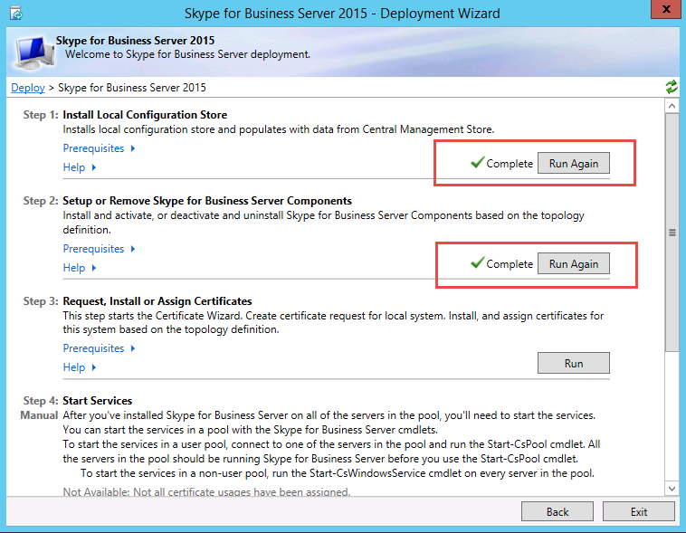

# 토폴로지의 서버에 비즈니스용 Skype 서버 설치
 
**요약:** 토폴로지의 각 서버에 비즈니스용 Skype 서버 시스템 구성 요소를 설치하는 방법을 학습합니다. Microsoft 평가 센터에서 비즈니스용 Skype 서버 무료 [평가판을 다운로드합니다.](https://www.microsoft.com/evalcenter/evaluate-skype-for-business-server)
  
중앙 관리 저장소에 토폴로지가 로드된 후 Active Directory에서 어떤 서버가 어떤 역할을 수행할지 알고 있는 경우 토폴로지의 각 서버에 비즈니스용 Skype 서버 시스템을 설치해야 합니다. 1~5단계는 순서에 따라 수행하면 됩니다. 그러나 6, 7, 8단계를 순서대로 수행하고 다이어그램에 설명된대로 1~5단계를 수행해야 합니다. 비즈니스용 Skype 서버 시스템을 설치하는 단계는 8단계 중 7단계입니다.
  

  
## 비즈니스용 Skype 서버 시스템 설치

토폴로지가 게시된 후 토폴로지의 각 서버에 비즈니스용 Skype 서버 구성 요소를 설치할 수 있습니다. 이 섹션에서는 비즈니스용 Skype 서버를 설치하고 프런트 엔드 풀 및 프런트 엔드 서버와 함께 함께 있는 모든 서버 역할에 대한 서버 역할을 설정하는 데 대해 설명합니다. 서버 역할을 설치하고 설정하려면 서버 역할을 설치하는 각 컴퓨터에서 비즈니스용 Skype 서버 배포 마법사를 실행합니다. 배포 마법사를 사용하여 로컬 구성 저장소 설치, 프런트 엔드 서버 설치, 인증서 구성 및 서비스 시작을 비롯한 네 가지 배포 단계를 모두 완료합니다.
  
> [!IMPORTANT]
> 서버에 비즈니스용 Skype 서버를 설치하려면 먼저 토폴로지 작성기에서 토폴로지 작성기에서 토폴로지 작성을 완료하고 게시해야 합니다. 
  
> [!NOTE]
> 토폴로지의 모든 서버에 대해 이 절차를 완료해야 합니다. 
  
> [!CAUTION]
> 프런트 엔드 서버에 비즈니스용 Skype 서버를 설치한 후 서비스를 처음 시작할 때 서버에서 Windows 방화벽 서비스가 실행되고 있는지 확인해야 합니다. 
  
> [!CAUTION]
> 이러한 단계를 수행하기 전에 로컬 관리자 및 RTCUniversalServerAdmins 그룹의 구성원인 도메인 사용자 계정으로 서버에 로그온해야 합니다. 
  
> [!NOTE]
> 이 서버에서 비즈니스용 Skype 서버 설정을 실행하지 않은 경우 설치에 대한 드라이브 및 경로를 묻는 메시지가 표시될 것입니다. 이렇게 하면 조직에서 필요로 하는 경우 또는 공간 문제가 있는 경우 시스템 드라이브가 없는 드라이브에 설치할 수 있는 기능이 있습니다. 설치 대화 상자에서 비즈니스용 Skype 서버 파일의  설치 위치 경로를 사용 가능한 새 드라이브로 변경할 수 있습니다. 설치 파일을 이 경로에 설치하는 경우 OCSCore.msi 비즈니스용 Skype 서버 파일도 배포됩니다.
  
> [!IMPORTANT]
> 설치를 시작하기 전에 Windows 업데이트를 사용하여 Windows Server를 최신으로 유지해야 합니다. 
  

  
### 비즈니스용 Skype 서버 시스템 설치

1. 비즈니스용 Skype 서버 설치 미디어를 삽입합니다. 설치가 자동으로 시작되지 않는 경우 설치 를 두 번 **클릭합니다.**
    
2. 설치 미디어를 사용하려면 Microsoft Visual C++ 실행해야 합니다. 설치할지 묻는 대화 상자가 열리게 합니다. 예를 **클릭합니다.**
    
3. 사용권 계약을 신중하게 검토하고, 동의하면 **동의를** 선택하고 확인을 **클릭합니다.** 
    
4. 스마트 설치는 그림과 같이 설치 프로세스 중에 인터넷에 연결하여 MICROSOFT 업데이트(MU)에서 업데이트를 확인할 수 있는 비즈니스용 Skype 서버의 기능입니다. 이렇게 하면 제품에 대한 최신 업데이트가 있는지 확인하여 더 나은 환경을 사용할 수 있습니다. **설치** 를 클릭하여 설치를 시작합니다.
    
    > [!NOTE]
    > 대부분의 조직에서는 회사 환경에 WSUS(Windows Server Update Services)를 배포하고 있습니다. WSUS를 사용하면 관리자가 네트워크의 컴퓨터에 Microsoft 업데이트를 통해 릴리스된 업데이트 배포를 완벽하게 관리할 수 있습니다. 비즈니스용 Skype 서버는 누적 업데이트 1 릴리스의 일부로 WSUS와 함께 작동하기 위한 스마트 설정 지원을 도입했습니다. 비즈니스용 Skype 서버를 처음 배포하거나 In-Place 업그레이드 기능을 사용하여 Lync Server 2013 환경에서 업그레이드하는 WSUS 고객에게는 MU에서 업데이트를 반치하는 것이 아니라 WSUS에서 Windows용 Skype 업데이트를 반출하는 스마트 설치 프로그램이 있습니다. 스마트 설치를 사용하려는 고객은 스마트 설치를 실행하기 전에 모든 컴퓨터의 SmartSetupWithWSUS.psq를 Setup.exe. 
  
     
  
5. 배포 마법사 페이지에서 비즈니스용 Skype 서버 시스템 설치 **또는 업데이트를 클릭합니다.**
    
6. 다음 절차의 절차를 수행하고 완료하면 끝내기  를 클릭하여 배포 마법사를 닫습니다. 풀의 각 프런트 엔드 서버에 대해 절차를 반복합니다.
    
### 1단계: 로컬 구성 저장소 설치

1. 선행 단계를 검토한 다음 **1단계:** 로컬 구성 저장소 설치 옆에 있는 실행을 클릭합니다. 
    
    > [!NOTE]
    > 로컬 구성 저장소는 중앙 관리 저장소의 읽기 전용 복사본입니다. Standard Edition 배포에서 중앙 관리 저장소는 프런트 엔드 서버에 있는 SQL Server Express Edition의 로컬 복사본을 사용하여 만들어집니다. 이 문제는 First Standard Edition Server 준비 절차를 실행할 때 발생합니다. Enterprise Edition 배포에서는 Enterprise Edition 프런트 엔드 풀이 포함된 토폴로지 게시 시 중앙 관리 저장소가 만들어집니다. 
  
2. 로컬 **구성 저장소 설치 페이지에서** 중앙  관리 저장소에서 직접 검색 옵션이 선택되어 있는지 확인한 후 다음 을 **클릭합니다.**
    
    SQL Server Express Edition이 로컬 서버에 설치됩니다. SQL Server Express Edition은 로컬 구성 저장소에 필요합니다.
    
3. 로컬 서버 구성 설치가 완료되면 **마침** 을 클릭합니다.
    
### 2단계: 비즈니스용 Skype 서버 구성 요소 설치 또는 제거

1. 선행 구성 요소를 검토하고 **2단계:** 비즈니스용 Skype 서버 구성 요소 설치 또는 제거 옆에 있는 실행을 클릭합니다. 
    
2. 비즈니스용 **Skype 서버** 구성 요소 설정  페이지에서 다음을 클릭하여 게시된 토폴로지에서 정의된 구성 요소를 설치합니다.
    
3. 명령 **실행** 페이지에는 설정이 진행될 때 명령 및 설치 정보가 요약되어 표시됩니다. 완료되면 목록을 사용하여 볼 로그를 선택한 다음 로그 보기 **를 클릭할 수 있습니다.**
    
4. 비즈니스용 Skype 서버 구성 요소 설치가 완료된 후 필요한 경우  로그를 검토한 경우 마친을 클릭하여 설치에서 이 단계를 완료합니다.
    
    > [!NOTE]
    > 메시지가 표시되면 서버를 다시 시작합니다(Windows 데스크톱 환경을 설치해야 하는 경우 표시될 수 있습니다). 컴퓨터가 백업 및 실행 중이면 이 절차(2단계: 비즈니스용 Skype 서버 구성 요소 설치 또는 제거) 절차를 다시 실행해야 합니다. 
  
    > [!NOTE]
    > 설치 관리자에서 충족되지 않은 선행 조문을 찾으면 그림과 같이 "선행 조처가 충족되지 않습니다." 메시지가 표시됩니다. 필요한 필수 구성 요소를 충족하고 이 절차(2단계: 비즈니스용 Skype 서버 구성 요소 설치 또는 제거) 절차를 다시 시작하십시오. 
  
     
  
5. 처음 두 단계가 예상대로 완료된지 확인 그림과 같이 **Complete라는** 단어가 있는 녹색 확인 표시가 있는지 확인할 수 있습니다.
    
     
  
6. 비즈니스용 **Skype 서버** 구성 요소를 설치한 후 업데이트가 있는지 확인하려면 Windows 업데이트를 다시 실행합니다.
    
### 3단계: 인증서 요청, 설치 또는 할당

1. 선행 단계를 검토한 다음 **3단계:** 인증서 요청, 설치 또는 할당 옆에 있는 실행을 클릭합니다. 
    
    > [!NOTE]
    > 비즈니스용 Skype 서버에는 Windows 10, Windows 8, Windows 7, Windows Server 2012 R2, Windows Server 2012 또는 Windows Server 2008 R2 운영 체제를 실행하는 클라이언트의 연결에 대한 다이제스트 해시 및 서명 알고리즘의 다이제스트 해시 및 서명 알고리즘이 SHA-2 제품군(SHA-2에서 다이제스트 길이 224, 256, 384 또는 512비트 사용)에 대한 지원이 포함되어 있습니다. SHA-2 제품군을 사용하여 외부 액세스를 지원하기 위해 외부 인증서는 동일한 비트 길이 다이제스트가 있는 인증서를 발급할 수도 있는 공용 CA에서 발급됩니다. 
  
    > [!IMPORTANT]
    > 인증서를 사용할 클라이언트 및 서버, 클라이언트 및 서버가 인증서에 사용되는 알고리즘을 사용하는 방법도 알아야 하는 사용자와 통신할 기타 컴퓨터 및 장치에 따라 해시 다이제스트 및 서명 알고리즘을 선택해야 합니다. 운영 체제 및 일부 클라이언트 응용 프로그램에서 지원되는 다이제스트 길이에 대한 자세한 내용은 [Windows PKI 블로그 - SHA2 및 Windows](/archive/blogs/pki/sha2-and-windows)를 참조하세요. 
  
    각 Standard Edition 또는 프런트 엔드 서버에는 oAuthTokenIssuer 인증서, 기본 인증서, 웹 내부 인증서 및 웹 외부 인증서 등 최대 4개의 인증서가 필요합니다. 그러나 적절한 주체 대체 이름 항목과 oAuthTokenIssuer 인증서를 사용하여 단일 기본 인증서를 요청하고 할당할 수 있습니다. 인증서 요구 사항에 대한 자세한 내용은 [비즈니스용 Skype 서버의](../../plan-your-deployment/requirements-for-your-environment/environmental-requirements.md) 환경 요구 사항 또는 비즈니스용 [Skype 서버 2019의](../../../SfBServer2019/plan/system-requirements.md)서버 요구 사항을 참조하세요.
    
    > [!IMPORTANT]
    > 다음 절차에서는 내부 Active Directory 인증서 서비스 기반 인증 기관에서 인증서를 구성하는 방법을 설명합니다. 
  
2. **인증서 마법사** 페이지에서 **요청** 을 클릭합니다.
    
3. 인증서 요청 **페이지에서** SIP 도메인 선택을 포함하여 관련 데이터를 채우고 다음 을 **클릭합니다.**
    
4. **지연 또는 즉시 요청** 페이지에서 **다음** 을 클릭하여 기본 옵션인 **요청을 온라인 인증 기관으로 즉시 보냅니다** 를 적용할 수 있습니다. 이 옵션을 선택한 경우 자동 온라인 등록을 지원하는 내부 CA를 사용할 수 있어야 합니다. 요청을 지연하는 옵션을 선택하면 인증서 요청 파일을 저장할 위치 및 파일 이름을 묻는 메시지가 나타납니다. 인증서 요청은 조직 내부의 CA 또는 공용 CA에서 제공하고 처리해야 합니다. 이 작업이 완료되면 인증서 응답을 가져와 적절한 인증서 역할에 할당해야 합니다.
    
5. **CA(인증 기관)** 선택 페이지에서 사용자 환경에서 검색된 목록에서 **CA** 선택 옵션을 선택한 다음 목록에서 알려진(Active Directory 도메인 서비스 등록을 통해) CA를 선택합니다. 또는 **다른 인증 기관 지정** 옵션을 선택하고 상자에 다른 CA 이름을 입력한 후 **다음** 을 클릭합니다.
    
6. **인증 기관 계정** 페이지에서 CA에 요청하고 인증서 요청을 처리하기 위해 자격 증명을 요구하는 메시지가 표시됩니다. 인증서를 요청하기 위해 사용자 이름 및 암호가 필요한지 사전에 확인해야 합니다. CA 관리자는 필요한 정보를 가지며 이 단계를 지원해야 할 수 있습니다. 대체 자격 증명을 제공해야 하는 경우 확인란을 선택하고 텍스트 상자에 사용자 이름 및 암호를 제공한 후 **다음** 을 클릭합니다.
    
7. **대체 인증서 템플릿 지정** 페이지에서 기본 웹 서버 템플릿을 사용하려면 **다음** 을 클릭합니다.
    
    > [!NOTE]
    > 조직에서 기본 웹 서버 CA 템플릿 대신 사용할 대체 템플릿을 만든 경우 확인란을 선택한 다음 대체 템플릿의 이름을 입력하십시오. CA 관리자가 정의한 템플릿 이름이 필요합니다. 
  
8. 이름 **및 보안 설정 페이지에서** 이름을 **지정합니다.** 식별 이름을 사용하면 인증서와 용도를 빠르게 식별할 수 있습니다. 대화명을 비워 두면 이름이 자동으로 생성됩니다. 키의 **비트 길이** 를 설정하거나 기본값 2048비트를 수락합니다. 인증서 **및** 개인 키를 다른 시스템으로 이동하거나 복사해야 하는 경우 인증서의 개인 키를 내보낼 수 있는 것으로 표시를 선택하고 다음 을 **클릭합니다.**
    
    > [!NOTE]
    > 비즈니스용 Skype 서버에는 내보낼 수 있는 개인 키에 대한 최소 요구 사항이 있습니다. 이러한 위치 중 하나로 미디어 중계 인증 서비스가 풀의 각 인스턴스에 대한 개별 인증서 대신 인증서 복사본을 사용하는 풀의 에지 서버가 있습니다. 
  
9. **조직 정보** 페이지에서 선택적으로 조직 정보를 제공하고 **다음** 을 클릭합니다.
    
10. **지역 정보** 페이지에서 선택적으로 지역 정보를 제공하고 **다음** 을 클릭합니다.
    
11. **주체 이름/주체 대체 이름** 페이지에서 추가할 주체 대체 이름을 검토한 후 **다음** 을 클릭합니다.
    
12. **SIP 도메인 설정** 페이지에서 **SIP 도메인** 을 선택하고 **다음** 을 클릭합니다.
    
13. **추가 주체 대체 이름 구성** 페이지에서 이후의 추가 SIP 도메인에 필요할 수 있는 것을 포함하여 필요한 추가 주체 대체 이름을 추가하고 **다음** 을 클릭합니다.
    
14. **인증서 요청 요약** 페이지에서 요약 정보를 검토합니다. 정보가 올바르면 **다음** 을 클릭합니다. 설정을 수정해야 하는 경우 **뒤로** 를 클릭하여 해당 페이지로 이동한 후 수정합니다.
    
15. **명령 실행** 페이지에서 **다음** 을 클릭합니다.
    
16. **온라인 인증서 요청 상태** 페이지에서 반환된 정보를 검토합니다. 인증서가 발급되고 로컬 인증서 저장소에 설치되었는지 확인해야 합니다. 발급 및 설치한 것으로 보고되지만 유효하지 않은 경우 CA 루트 인증서가 서버의 신뢰할 수 있는 루트 CA 저장소에 설치되어 있는지 확인합니다. 신뢰할 수 있는 루트 CA 인증서를 검색하는 방법은 CA 설명서를 참조하십시오. 검색된 인증서를 확인하려면 **인증서 정보 보기** 를 클릭합니다. 기본적으로 비즈니스용 Skype 서버 인증서 사용에 인증서 할당 **확인란이** 선택되어 있습니다. 인증서를 수동으로 할당하려면 확인란의 선택을 취소하고 **마침** 을 클릭합니다.
    
17. 이전 페이지에서 비즈니스용 **Skype 서버** 인증서 사용에 인증서 할당 확인란의 선택을 취소한 경우 인증서 할당 페이지가 **표시됩니다.** **다음** 을 클릭합니다.
    
18. **인증서 저장소** 페이지에서 요청한 인증서를 선택합니다. 인증서를 보려면 **인증서 정보 보기**, **다음** 을 차례로 클릭하여 계속합니다.
    
    > [!NOTE]
    > 온라인 인증서 **요청 상태 페이지에서** 인증서에 문제가 보고된 경우(예: 인증서가 유효하지 않은 경우) 실제 인증서를 확인하여 문제를 해결합니다. 인증서 유효성을 일으킬 수 있는 두 가지 특정 문제는 앞서 설명한 신뢰할 수 있는 루트 CA 인증서의 누락과 인증서와 연결된 개인 키의 누락입니다. 이 두 문제를 해결하는 방법은 CA 설명서를 참조하십시오.
  
19. 인증서 **할당 요약** 페이지에서 제공된 정보를 검토하여 할당해야 하는 인증서가 올바른지 확인한 후 다음 을 **클릭합니다.**
    
20. **명령 실행** 페이지에서 명령 출력을 검토합니다. 할당 프로세스를 검토하려는 경우 또는 오류나 경고가 발생한 경우 **로그 보기** 를 클릭합니다. 검토를 마치면 **마침** 을 클릭합니다.
    
21. 인증서 **마법사 페이지에서** 그림에 표시된 OAuthTokenIssuer를 포함하여 모든 서비스에 인증서가 할당되어 있는 것을 나타내는 녹색 확인을 확인한 다음 닫기 를 **클릭합니다.**
    
     
  
    > [!TIP]
    > 랩 환경에 설치하고 Active Directory 인증서 서비스를 사용하여 인증 기관을 설정한 경우 인증서 할당이 성공적으로 완료되기 전에 인증서 서비스를 실행하는 서버와 프런트 엔드 서버를 모두 다시 시작해야 합니다. 
  
    > [!TIP]
    >  Active Directory 인증서 서비스의 인증서에 대한 자세한 내용은 [Active Directory 인증서 서비스 를 참조하세요.](/windows/deployment/deploy-whats-new) 
  
### 4단계: 서비스 시작

1. **4단계:** 서비스 시작에 대한 선행 단계를 검토합니다.
    
2. 서버가 세 개 이상 있는 Enterprise Edition 프런트 엔드 풀인 경우 Windows Fabric이 사용되어 **Start-CsPool** cmdlet을 사용해야 합니다. 항상 Standard Edition과 같은 단일 서버를 사용하는 경우 **Start-CsWindowsService** cmdlet을 사용할 수 있습니다. 이 예제에서는 풀에 세 개의 프런트 엔드 서버가 있는 Enterprise Edition을 사용하고, 비즈니스용 **Skype 서버** 관리 셸을 열고, 그림과 같이 **Start-CsPool** cmdlet을 실행합니다. Standard Edition 서버를 비롯한 다른 모든 역할의 경우 **Start-CsWindowsService 를 사용해야 합니다.** 프런트 엔드 역할이 다른 역할을 배포하는 경우 해당 특정 역할에 대한 설명서를 참조하세요.
    
     
  
3. **명령 실행** 페이지에서 모든 서비스가 정상적으로 시작되었으면 **마침** 을 클릭합니다.
    
    > [!IMPORTANT]
    > 서버에서 서비스를 시작하는 명령은 실제로 서비스가 시작된 사실을 보고하는 최상의 방법입니다. 서비스의 실제 상태를 반영하지 않을 수 있습니다. 그림과 같이 단계  서비스 상태(선택 사항)를 사용하여 MMC(Microsoft Management Console)를 열고 서비스가 성공적으로 시작된 것이 좋습니다. 비즈니스용 Skype 서버 서비스가 시작되지 않은 경우 MMC에서 해당 서비스를 마우스 오른쪽 단추로 클릭한 다음 시작 을 클릭할 **수 있습니다.** 
  
     
