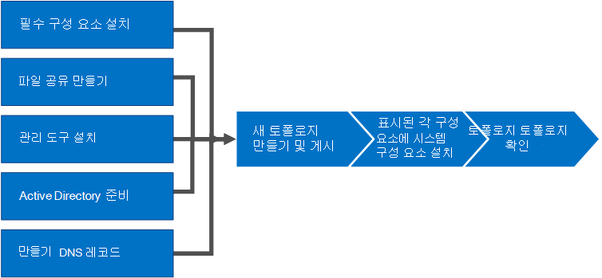

# 비즈니스용 Skype 서버 설치Install Skype for Business Server
 
**요약:** 비즈니스용 Skype 서버 설치를 위해 환경을 준비하는 방법을 자세히 알아보고,**Summary:** Learn how to prepare your environment for an installation of Skype for Business Server. Microsoft 평가판 센터에서 비즈니스용 Skype 서버 무료 평가판을 [https://www.microsoft.com/evalcenter/evaluate-skype-for-business-server](https://www.microsoft.com/evalcenter/evaluate-skype-for-business-server) 다운로드합니다.Download a free trial of Skype for Business Server from the Microsoft Evaluation center at:[https://www.microsoft.com/evalcenter/evaluate-skype-for-business-server](https://www.microsoft.com/evalcenter/evaluate-skype-for-business-server).
  
이 문서에서는 비즈니스용 Skype 서버의 예제 설치를 진행합니다.This article walks you through an example installation of Skype for Business Server. 이 문서에서는 전체 비즈니스용 Skype 서버 설치를 수행하는 데 필요한 모든 절차를 다루지 않습니다.This article does not attempt to cover all of the procedures you need to perform a full Skype for Business Server installation. 목표는 기본적인 meet-and-share 기능을 포함하는 좁게 정의된 토폴로지의 예제 절차를 제공하는 것입니다.The goal is to provide example procedures in a narrowly defined topology that includes basic meet-and-share functionality.
  
## 비즈니스용 Skype 서버의 설치 프로세스 개요Overview of the install process for Skype for Business Server

비즈니스용 Skype 서버 설치에는 다양한 절차가 포함됩니다.An installation of Skype for Business Server includes many different procedures. 사용자 환경에서 비즈니스용 Skype 서버를 실행하는 데 필요한 절차는 환경의 특정 구성에 따라 다를 수 있습니다.The procedures you need to get Skype for Business Server running in your environment depend on the specifics of your environment. 예를 들어 DNS에 Windows Server를 사용하는 경우 DNS 항목을 추가하기 위한 예제 절차를 사용할 수 있습니다.For example, if you are using Windows Server for DNS, you will benefit from the example procedure for adding a DNS entry. DNS에 다른 시스템을 사용하는 경우 특정 DNS 시스템에 대한 절차를 따라야 합니다.If you use another system for DNS, you need to follow procedures for your particular DNS system. 이 섹션의 많은 절차에 해당합니다.This is true for many of the procedures in this section.
  
비즈니스용 Skype 서버는 Standard Edition 및 Enterprise Edition에서 사용할 수 있습니다.Skype for Business Server is available in Standard Edition and Enterprise Edition. 주요 차이점은 Standard Edition은 Enterprise Edition에 포함된 고가용성 기능을 지원하지 않는다는 것입니다.The main difference is that Standard Edition does not support the high availability features that are included with Enterprise Edition. 
  
비즈니스용 Skype 서버는 고급 제품으로, 정확한 설치 프로세스는 사용자의 특정 상황에 따라 매우 잘 따라야 합니다.Skype for Business Server is an advanced product, and the exact installation process depends a great deal on your specific circumstances. 이 섹션에서는 제품을 설치하는 일반적인 단계를 설명합니다.This section walks you through the general steps to install the product. 그러나 각 절차는 환경 및 계획 결정에 따라 다를 수 있습니다.However, each procedure might be different depending on your environment and planning decisions. 예를 들어 소규모 조직의 경우 비즈니스용 Skype 서버 Standard Edition을 실행하는 것이 적절할 수 있는 반면, 대규모 다국적 조직에는 전 세계 50대의 서버가 제품을 전용으로 사용할 수 있습니다.For example, for small organizations a single server, running Skype for Business Server Standard Edition might be appropriate, whereas a large multinational organization might have 50 servers at locations around the world dedicated to the product.
  
> [!NOTE]
> 최신 누적 업데이트에 대한 자세한 내용은 비즈니스용 Skype 서버 업데이트를 [참조하세요.](https://support.microsoft.com/kb/3061064)To learn about the latest Cumulative Updates, see [Updates for Skype for Business Server](https://support.microsoft.com/kb/3061064). CU1 패치를 설치한 후 관리자는  `Update-CsAdminRole` cmdlet을 실행해야 합니다.After installing the CU1 patch an administrator needs to execute the  `Update-CsAdminRole` cmdlet. 이 cmdlet은 원격 PowerShell을 통해 새 GCP cmdlet에 액세스하는 데 필요합니다.This cmdlet is required to access the new GCP cmdlets over Remote PowerShell.
  
> [!IMPORTANT]
> 이 섹션의 절차는 좁은 요구 사항 집합을 사용하는 예제로 사용하며 특정 결정이 이미 수행된 것으로 가정합니다.The procedures in this section serve as an example using a narrowly defined set of requirements and assume specific decisions have already been made. 비즈니스용 Skype 서버를 설치하는 데 필요한 실제 절차는 매우 다를 수 있습니다.The actual procedures you need to install Skype for Business Server will likely be very different. 이 섹션의 절차는 모든 환경에 비즈니스용 Skype 서버를 설치하기 위한 단계별 가이드가 아니라 예제로만 사용할 수 있습니다.Use the procedures in this section as an example only and not as a step-by-step guide for installing Skype for Business Server in every environment. 
  
비즈니스용 Skype 서버를 처음 시작하고 실행하는 데는 8개의 기본 단계가 필요합니다.Getting Skype for Business Server up and running for the first time involves eight primary steps. 이 섹션의 예제 절차만 비즈니스용 Skype 서버를 설치하는 데 필요한 절차는 아닙니다.You should understand that the example procedures in this section are not the only procedures required for installing Skype for Business Server. 다음 8단계는 단순히 전체 프로세스를 더 잘 이해하고 기본 작업 환경을 작동 및 실행하는 데 도움이 되는 예입니다.The following eight steps are simply examples to help you better understand the overall process and get a basic working environment up and running. 1~5단계는 순서에 따라 할 수 있습니다.You can do steps 1 through 5 in any order. 그러나 다이어그램에 설명된대로 1~5단계를 순서대로, 6, 7, 8단계를 순서대로 수행해야 합니다.However, you must do steps 6, 7, and 8 in order, and after steps 1 through 5, as outlined in the diagram. 8단계는 다음을 수행합니다.The eight steps are:
  

  
- [비즈니스용 Skype](install-prerequisites.md) 서버의 선행 준비 사항 설치: 비즈니스용 Skype 서버 토폴로지가 있는 모든 서버에 설치합니다.[Install prerequisites for Skype for Business Server](install-prerequisites.md) : Install prerequisites on all servers that make up the Skype for Business Server topology. 모든 역할에 대해 전제가 동일하지는 않습니다.Note that prerequisites are not the same for all roles. 예를 들어 프런트 엔드 역할을 제공하는 서버는 선행해야 하는 집합을 가지며, 감독 역할을 제공하는 서버는 서로 다른 선행 준비를 합니다.For example, servers that provide the front-end role have a set of prerequisites, and servers that provide a director role have a different set of prerequisites. 자세한 내용은 선행 계획 설명서를 참조하십시오.See prerequisite planning documentation for more details.
    
- [비즈니스용 Skype](create-a-file-share.md) 서버에서 파일 공유 만들기: 비즈니스용 Skype 서버 토폴로지 전체에서 서버에서 사용할 파일 공유를 만드시다.[Create a file share in Skype for Business Server](create-a-file-share.md) : Create a file share that will be used by servers throughout the Skype for Business Server topology.
    
- [비즈니스용 Skype 서버에](install-administrative-tools.md) 관리 도구 설치: 관리 도구에는 토폴로지 작성기 및 제어판이 포함됩니다.[Install administrative tools in Skype for Business Server](install-administrative-tools.md) : The administrative tools include Topology Builder and Control Panel. 토폴로지의 하나 이상의 서버에 관리 도구를 설치하거나 비즈니스용 Skype 서버에 대해 지원되는 Windows OS 버전을 실행하는 64비트 관리 Workstation을 설치해야 합니다.You must install the administrative tools on at least one server in the topology or a 64-bit management workstation running a Windows OS version that is supported for Skype for Business Server.
    
- [비즈니스용 Skype](prepare-active-directory.md) 서버용 Active Directory 준비: 비즈니스용 Skype 서버는 Active Directory와 밀접하게 작동합니다.[Prepare Active Directory for Skype for Business Server](prepare-active-directory.md) : Skype for Business Server works closely with Active Directory. 비즈니스용 Skype 서버에서 작동하려면 Active Directory 도메인을 준비해야 합니다.You must prepare the Active Directory domain to work with Skype for Business Server. 배포 마법사를 통해 이 작업을 수행하면 도메인에 대해 한 번만 수행됩니다.You can do this through the Deployment Wizard, and it is only done once for the domain. 이는 프로세스에서 그룹을 만들고 도메인을 수정하기 때문에 이 작업을 한 번만 완료하면 됩니다.This is because the process creates groups and modifies the domain, and you need to do that only once.
    
- [비즈니스용 Skype](create-dns-records.md) 서버에 대한 DNS 레코드 만들기: 비즈니스용 Skype 서버가 제대로 작동하려면 여러 DNS 설정이 있어야 합니다.[Create DNS records for Skype for Business Server](create-dns-records.md) : In order for Skype for Business Server to work properly, a number of DNS settings must be in place. 따라서 클라이언트가 서비스에 액세스하는 방법을 알 수 있으며 서버가 서로에 대해 알고 있습니다.This is so that clients know how to access the services and the servers know about each other. 이러한 설정은 DNS 항목을 할당한 후 도메인 전체에서 사용할 수 있기 때문에 배포당 한 번만 완료하면 됩니다.These settings only need to be completed once per deployment because once you assign a DNS entry, it is available throughout the domain.
    
- [비즈니스용 Skype](create-and-publish-new-topology.md) 서버에서 새 토폴로지 만들기 및 게시: 토폴로지의 각 서버에 비즈니스용 Skype 서버 시스템을 설치하려면 먼저 토폴로지 만들기 및 게시해야 합니다.[Create and publish new topology in Skype for Business Server](create-and-publish-new-topology.md) : Before you can install the Skype for Business Server system on each of the servers in the topology, you must create a topology and publish it. 토폴로지 게시 시 토폴로지 정보를 중앙 관리 저장소 데이터베이스에 로드합니다.When you publish a topology, you are loading the topology information into the Central Management Store database. Enterprise Edition 풀인 경우 새 토폴로지가 처음 게시될 때 중앙 관리 저장소 데이터베이스를 만듭니다.If this is an Enterprise Edition pool, you are creating the Central Management Store database the first time you publish a new topology. Standard Edition인 경우 토폴로지 게시 전에 배포 마법사에서 첫 번째 Standard Edition 서버 준비 프로세스를 실행해야 합니다.If this is Standard Edition, you need to run the Prepare First Standard Edition Server process from the Deployment Wizard before you publish a topology. 이렇게 하는 경우 SQL Server Express Edition 인스턴스를 설치하고 중앙 관리 저장소를 만들어 Standard Edition을 준비할 수 있습니다.This prepares for Standard Edition by installing a SQL Server Express Edition instance and creating the Central Management Store.
    
- 토폴로지의 서버에 비즈니스용 [Skype](install-skype-for-business-server.md) 서버를 설치합니다. 토폴로지가 중앙 관리 저장소에 로드된 후 Active Directory에서 어떤 서버가 어떤 역할을 수행할지 알고 있는 경우 토폴로지의 각 서버에 비즈니스용 Skype 서버 시스템을 설치해야 합니다.[Install Skype for Business Server on servers in the topology](install-skype-for-business-server.md) : Once the topology is loaded into the Central Management Store and Active Directory knows which servers will perform which roles, you need to install the Skype for Business Server system on each of the servers in the topology.
    
- [비즈니스용 Skype](verify-the-topology.md) 서버에서 토폴로지 확인: 토폴로지와 비즈니스용 Skype 서버 시스템 구성 요소를 토폴로지의 각 서버에 설치한 후 토폴로지가 예상대로 작동하고 있는지 확인할 수 있습니다.[Verify the topology in Skype for Business Server](verify-the-topology.md) : After you have the topology published and the Skype for Business Server system components installed on each of the servers in the topology, you are ready to verify that the topology is working as expected. 여기에는 전체 도메인이 비즈니스용 Skype가 도메인에서 사용 가능하다는 것을 알 수 있도록 구성이 모든 Active Directory 서버로 전파되어 있는지 확인하는 것이 포함됩니다.This includes verifying that the configuration has propagated out to all of the Active Directory servers so that the entire domain knows that Skype for Business is available in the domain.
    

