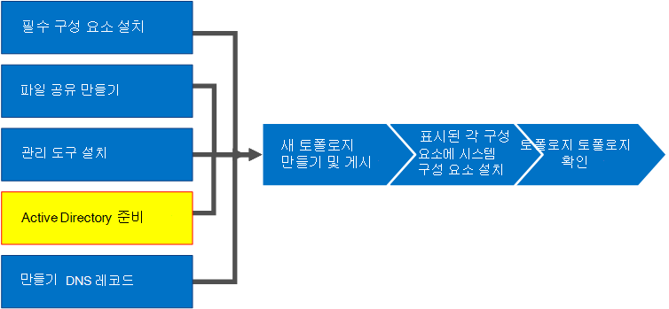
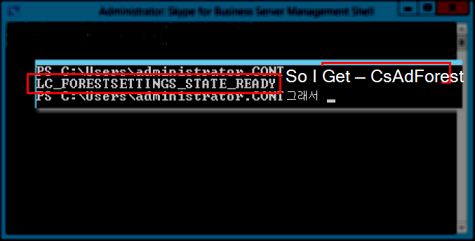

# <a name="prepare-active-directory-for-skype-for-business-server"></a>비즈니스용 Skype 서버에 대 한 Active Directory 준비
 
**요약:** 비즈니스용 Skype 서버용 설치를 위해 Active Directory 도메인을 준비 하는 방법에 대해 알아봅니다. [Microsoft 평가 센터](https://www.microsoft.com/evalcenter/evaluate-skype-for-business-server)에서 비즈니스용 Skype 서버의 무료 평가판을 다운로드 하세요.
  
비즈니스용 Skype 서버는 Active Directory와 긴밀 하 게 작동 합니다. 비즈니스용 Skype 서버에서 작업 하려면 Active Directory 도메인을 준비 해야 합니다. 이 프로세스는 배포 마법사에서 수행 되며 도메인에 대해 한 번만 수행 됩니다. 이는 프로세스가 그룹을 생성 하 고 도메인을 수정 하므로 한 번만 수행 해야 하기 때문입니다. 1 ~ 5 단계는 순서에 관계 없이 수행할 수 있습니다. 그러나 6, 7, 8 단계를 순서 대로 수행 하 고 다이어그램에 명시 된 대로 1 ~ 5 단계를 완료 해야 합니다. Active Directory는 4 단계에서 준비 합니다. Active Directory 계획에 대 한 자세한 내용은 비즈니스용 [Skype 서버에 대 한 환경 요구 사항](../../plan-your-deployment/requirements-for-your-environment/environmental-requirements.md) 또는 비즈니스용 [skype 서버 2019에 대 한 서버 요구](../../../SfBServer2019/plan/system-requirements.md)사항을 참조 하세요.
  

  
## <a name="prepare-active-directory"></a>Active Directory 준비

비즈니스용 Skype 서버는 AD DS (Active Directory 도메인 서비스)와 긴밀 하 게 통합 되어 있습니다. 비즈니스용 Skype 서버를 처음 설치 하기 전에 Active Directory를 준비 해야 합니다. **Active Directory 준비** 라는 배포 마법사의 섹션에서는 비즈니스용 Skype Server에서 사용할 active directory 환경을 준비 합니다.
  
> [!NOTE]
> 토폴로지의 모든 서버를 추적 하 고 통신 하는 데 비즈니스용 Skype 서버 사용 (AD DS). 대부분의 서버는 비즈니스용 Skype 서버가 제대로 작동할 수 있도록 도메인에 가입 되어 있어야 합니다. Edge 및 리버스 프록시와 같은 서버는 도메인에 가입 되어 있지 않아야 한다는 점에 유의 하세요.
  
> [!IMPORTANT]
> 배포의 각 도메인에 대해 Active Directory 준비 절차가 한 번만 실행 되어야 합니다. 
  
**Active Directory를 준비**하기 위한 비디오 단계를 시청 하세요.
  
> [!video https://www.microsoft.com/en-us/videoplayer/embed/RE1Ybuk]
  
### <a name="prepare-active-directory-from-the-deployment-wizard"></a>배포 마법사에서 Active Directory 준비

1. Active Directory 도메인에 대 한 스키마 관리자 자격 증명을 사용 하 여 사용자로 로그온 합니다.
    
2. 비즈니스용 Skype 서버 배포 마법사를 엽니다.
    
    > [!TIP]
    > 비즈니스용 Skype 서버 배포 마법사에서 만든 로그 파일을 검토 하려는 경우 배포 마법사가 실행 된 컴퓨터에서 해당 단계를 실행 하는 AD DS 사용자의 사용자 디렉터리에서 찾을 수 있습니다. 예를 들어 사용자가 도메인의 도메인 관리자로 로그온 한 경우 로그 파일은 C:\Users\Administrator.Contoso\AppData\Local\Temp.에 저장 됩니다. 
  
3. **Active Directory 준비** 링크를 클릭 합니다.
    
4. **1 단계: 스키마 준비**
    
    에서. 1 단계 제목 아래에 있는 드롭다운을 클릭 하 여 액세스할 수 있는 1 단계의 필수 구성 요소 정보를 검토 합니다.
    
    b. 1 단계에서 **실행** 을 클릭 하 여 스키마 준비 마법사를 실행 합니다.
    
    c. 각 배포에 대해 절차가 한 번만 실행 되어야 한다는 점에 유의 하 고 **다음**을 클릭 합니다.
    
    a. 스키마를 준비한 후에는 **로그 보기**를 클릭 하 여 로그를 볼 수 있습니다. 
    
    z.e.n.works. **마침을** 클릭 하 여 스키마 준비 마법사를 닫고 Active Directory 준비 단계로 돌아갑니다.
    
5. **2 단계: 스키마 파티션 복제 확인**
    
    에서. 도메인에 대 한 도메인 컨트롤러에 로그온 합니다.
    
    b. **서버 관리자**의 **도구** 드롭다운 메뉴에서 **ADSI 편집** 을 엽니다.
    
    c. **작업** 메뉴에서 **연결 대상**을 클릭 합니다.
    
    a. **연결 설정** 대화 상자의 **잘 알려진 명명 컨텍스트 선택**에서 **스키마**를 선택한 다음 **확인**을 클릭 합니다.
    
    z.e.n.works. 스키마 컨테이너 아래에서 **CN = ms-RTC-SIP-SchemaVersion**을 검색 합니다. 이 개체가 있고 a/a 2 **상한** 특성의 값이 1150이 고, **range lower** 특성의 값이 3 이면 스키마는 성공적으로 업데이트 되 고 복제 된 것입니다. 이 개체가 없거나 **Range upper** 및 **range lower** 특성 값이 지정 되지 않은 경우 스키마는 수정 되거나 복제 되지 않은 것입니다.
    
6. **3 단계: 현재 포리스트 준비**
    
    에서. 3 단계 제목 아래에 있는 드롭다운을 클릭 하 여 액세스할 수 있는 3 단계의 필수 구성 요소 정보를 검토 합니다.
    
    b. 3 단계에서 **실행** 을 클릭 하 여 현재 포리스트 준비 마법사를 시작 합니다.
    
    c. 배포 당 절차가 한 번만 실행 되어야 한다는 점에 유의 하 고 **다음**을 클릭 합니다.
    
    a. 유니버설 그룹이 생성 될 도메인을 지정 합니다. 서버가 도메인에 속해 있는 경우 **로컬 도메인**을 선택 하 고 **다음**을 클릭 합니다.
    
    z.e.n.works. 포리스트가 준비 되 면 **로그 보기**를 클릭 하 여 로그를 볼 수 있습니다. 
    
    f. **마침을** 클릭 하 여 현재 포리스트 준비 마법사를 닫고 Active Directory 준비 단계로 돌아갑니다.
    
    g. **앱** 페이지에서 **비즈니스용 Skype Server Management Shell** 을 클릭 하 여 PowerShell을 시작 합니다.
    
    넣기. 명령 가져오기-CsAdForest **를 입력 하 고 enter 키를**누릅니다.
    
    칼럼. 결과가 **LC_FORESTSETTINGS_STATE_READY**경우 그림과 같이 포리스트가 성공적으로 준비 된 것입니다.
    
     
  
7. **4 단계: 글로벌 카탈로그의 복제 확인**
    
    에서. 도메인 컨트롤러 (다른 도메인 컨트롤러의 원격 사이트에 있는 경우)에서 포리스트 준비가 실행 되는 포리스트의 **Active Directory 사용자 및 컴퓨터**를 엽니다.
    
    b. **Active Directory 사용자 및 컴퓨터**에서 포리스트 또는 자식 도메인의 도메인 이름을 확장 합니다.
    
    c. 왼쪽 창에서 **사용자** 컨테이너를 클릭 하 고 오른쪽 창에서 유니버설 그룹 **csadministrator** 를 찾습니다. CsAdministrator (Cs로 시작 하는 새로운 유니버설 그룹 중 하나)가 있는 경우 Active Directory 복제가 성공 했습니다.
    
    a. 그룹이 아직 표시 되지 않으면 복제를 강제로 수행 하거나, 15 분 동안 기다렸다가 오른쪽 창을 새로 고칠 수 있습니다. 그룹이 있으면 복제가 완료 된 것입니다.
    
8. **5 단계: 현재 도메인 준비**
    
    에서. 5 단계에 대 한 필수 구성 요소 정보를 검토 합니다.
    
    b. 5 단계에서 **실행** 을 클릭 하 여 현재 도메인 준비 마법사를 시작 합니다.
    
    c. 배포의 각 도메인에 대해이 절차를 한 번만 실행 해야 한다는 점에 유의 하 고 **다음**을 클릭 합니다.
    
    a. 도메인을 준비한 후에는 **로그 보기**를 클릭 하 여 로그를 볼 수 있습니다. 
    
    z.e.n.works. **마침을** 클릭 하 여 현재 도메인 준비 마법사를 닫고 Active Directory 준비 단계로 돌아갑니다.
    
    이 단계는 비즈니스용 Skype 서버 개체가 있는 모든 도메인에서 완료 되어야 하 고, 그렇지 않으면 서비스가 시작 되지 않을 수 있습니다. 여기에는 사용자, 연락처 개체, 관리 그룹 또는 기타 개체 형식 등 모든 유형의 Active Directory 개체가 포함 됩니다. 필요에 따라 Set-CsUserReplicatorConfiguration-Addomainnaminingcontextlist를 사용 하 여 비즈니스용 Skype 서버 개체가 있는 도메인만 추가할 수 있습니다.
    
9. **6 단계: 도메인에서 복제 확인**
    
    에서. **앱** 페이지에서 **비즈니스용 Skype Server Management Shell** 을 클릭 하 여 PowerShell을 시작 합니다.
    
    b. 명령 가져오기-CsAdDomain을 사용 하 여 도메인 내의 복제를 확인 합니다.
    
   ```powershell
   Get-CsAdDomain [-Domain <Fqdn>] [-DomainController <Fqdn>] [-GlobalCatalog <Fqdn>] [-GlobalSettingsDomainController <Fqdn>]
   ```

    > [!NOTE]
    > Domain 매개 변수를 지정하지 않으면 값이 로컬 도메인으로 설정됩니다. 
  
    Contoso. i a 지방 도메인에 대 한 명령을 실행 하는 예입니다.
    
   ```powershell
   Get-CsAdDomain -Domain contoso.local -GlobalSettingsDomainController dc.contoso.local
   ```

    > [!NOTE]
    > GlobalSettingsDomainController 매개 변수를 사용 하 여 전역 설정이 저장 되는 위치를 표시할 수 있습니다. 설정이 시스템 컨테이너에 저장 되는 경우 (구성 컨테이너로 마이그레이션된 전역 설정이 없는 업그레이드 배포의 경우)에는 AD DS 포리스트의 루트에서 도메인 컨트롤러를 정의 합니다. 전역 설정이 구성 컨테이너에 있는 경우(설정이 구성 컨테이너로 마이그레이션된 업그레이드 배포 또는 새 배포에서 일반적임) 포리스트에서 도메인 컨트롤러를 정의합니다. 이 매개 변수를 지정 하지 않으면 cmdlet이 구성 컨테이너에 저장 된 것으로 간주 하 고 Active Directory의 모든 도메인 컨트롤러를 참조 합니다. 
  
    c. 결과가 **LC_DOMAINSETTINGS_STATE_READY**경우 도메인이 성공적으로 복제 된 것입니다.
    
10. **7 단계: 비즈니스용 Skype Server 제어판에 대 한 관리 액세스를 제공 하는 사용자 추가**
    
    에서. Domain Admins 그룹 또는 RTCUniversalServerAdmins 그룹의 구성원으로 로그온합니다.
    
    b. **Active Directory 사용자 및 컴퓨터**를 열고, 도메인을 확장 하 고, **사용자** 컨테이너를 클릭 하 고, csadministrator를 마우스 오른쪽 단추로 클릭 하 고, **속성**을 선택 합니다.
    
    c. **CSAdministrator 속성**에서 **구성원** 탭을 클릭합니다.
    
    a. **구성원** 탭에서 **추가**를 클릭 합니다. **사용자, 연락처, 컴퓨터, 서비스 계정 또는 그룹 선택**에서 **선택할 개체 이름 입력**을 찾습니다. 그룹 CSAdministrators에 추가할 사용자 이름 또는 그룹 이름을 입력 합니다. **확인**을 클릭합니다.
    
    z.e.n.works. **구성원** 탭에서 선택한 사용자 또는 그룹이 있는지 확인 합니다. **확인**을 클릭합니다.
    
    > [!CAUTION]
    > 비즈니스용 Skype 서버 제어판은 역할 기반 액세스 제어 도구입니다. CsAdministrator 그룹의 구성원은 비즈니스용 Skype Server 제어판을 사용 하는 사용자에 게 모든 구성 기능을 사용할 수 있는 모든 권한을 제공 합니다. 특정 기능에 대해 디자인된 사용 가능한 다른 역할도 있습니다. 사용 가능한 역할에 대 한 자세한 내용은 비즈니스용 [Skype 서버에 대 한 환경 요구 사항](../../plan-your-deployment/requirements-for-your-environment/environmental-requirements.md) 또는 비즈니스용 [skype Server 2019의 서버 요구](../../../SfBServer2019/plan/system-requirements.md)사항을 참조 하세요. 관리 그룹의 구성원으로 만들려면 비즈니스용 Skype 서버용으로 사용자를 설정 하지 않아도 된다는 점에 유의 하세요. 
  
    > [!CAUTION]
    > 보안 및 역할 기반 액세스 제어 무결성을 유지 하려면 사용자가 비즈니스용 Skype Server 배포 관리에서 수행 하는 역할을 정의 하는 그룹에 사용자를 추가 합니다. 
  
11. 로그 오프 한 다음 Windows에 다시 로그온 하 여 보안 토큰이 비즈니스용 Skype 서버 보안 그룹으로 업데이트 된 다음 배포 마법사를 다시 엽니다.
    
12. 그림에 표시 된 대로 **Active Directory 준비** 옆에 있는 녹색 확인 표시가 표시 되어 있는지 확인 합니다.
    
     
  

## <a name="see-also"></a>참고 항목
 
[비즈니스용 Skype Server 2015 Active Directory 도메인 서비스](../../plan-your-deployment/security/active-directory-domain-services.md)
