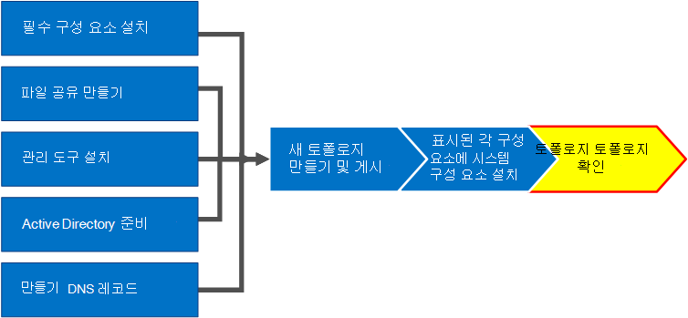

# 비즈니스용 Skype 서버에서 토폴로지 확인Verify the topology in Skype for Business Server
 
**요약:** 비즈니스용 Skype 서버 토폴로지와 Active Directory 서버가 예상 대로 작동 하는지 확인 하는 방법에 대해 알아봅니다.**Summary:** Learn how to verify the Skype for Business Server topology and Active Directory servers are working as expected. [Microsoft 평가 센터](https://www.microsoft.com/evalcenter/evaluate-skype-for-business-server)에서 비즈니스용 Skype 서버의 무료 평가판을 다운로드 하세요.Download a free trial of Skype for Business Server from the [Microsoft Evaluation center](https://www.microsoft.com/evalcenter/evaluate-skype-for-business-server).
  
토폴로지가 게시 되 고 토폴로지의 각 서버에 비즈니스용 Skype 서버 시스템 구성 요소가 설치 된 후 토폴로지가 예상 대로 작동 하는지 확인할 준비가 되었습니다.After you have the topology published and the Skype for Business Server system components installed on each of the servers in the topology, you are ready to verify that the topology is working as expected. 여기에는 전체 도메인이 도메인에서 비즈니스용 Skype를 사용할 수 있도록 모든 Active Directory 서버로 구성이 전파 되었음을 확인 하는 것이 포함 됩니다.This includes verifying that the configuration has propagated out to all of the Active Directory servers so that the entire domain knows Skype for Business is available in the domain. 1 ~ 5 단계는 순서에 관계 없이 수행할 수 있습니다.You can do steps 1 through 5 in any order. 그러나 6, 7, 8 단계를 순서 대로 수행 하 고 다이어그램에 명시 된 대로 1 ~ 5 단계를 완료 해야 합니다.However, you must do steps 6, 7, and 8 in order, and after steps 1 through 5, as outlined in the diagram. 토폴로지 확인은 8 단계입니다.Verifying the topology is step 8 of 8.
  

  
## 프런트 엔드 풀 배포 테스트Test the Front End pool deployment

마지막 단계는 프런트 엔드 풀을 테스트 하 고 비즈니스용 Skype 클라이언트가 서로 통신할 수 있는지 확인 하는 것입니다.The final step is to test the Front End pool and confirm that Skype for Business clients can communicate with each other. 
  
### 사용자 추가 및 클라이언트 연결 확인Add users and verify client connectivity

1. Active Directory 컴퓨터 및 사용자를 사용 하 여 비즈니스용 Skype 서버 배포에 대 한 관리자 역할의 Active Directory 사용자 개체 (비즈니스용 Skype Server 제어판이 설치 되어 있는 경우)를 **csadministrator** 그룹에 추가 합니다.Use Active Directory Computers and Users to add the Active Directory user object of the administrator role for the Skype for Business Server deployment (on which Skype for Business Server Control Panel is installed) to the **CSAdministrator** group.
    
    > [!IMPORTANT]
    > CsAdministors 그룹에 적절 한 사용자 및 그룹을 추가 하지 않으면 "권한이 없음: 역할 기반 액세스 제어 (RBAC) 권한 부여 오류로 인해 액세스가 거부 됨을 나타내는 비즈니스용 Skype 서버 제어판을 열 때 오류가 표시 됩니다. ."If you do not add the appropriate users and groups to the CsAdministors group, you will receive an error when you open Skype for Business Server Control Panel which reads, "Unauthorized: Access is denied due to a role-based access control (RBAC) authorization failure." 
  
2. 사용자 개체가 현재 로그온 되어 있으면 로그 오프 한 다음 다시 로그온 하 여 새 그룹 할당을 등록 합니다.If the user object is currently logged on, log off and then log on again to register the new group assignment.
    
    > [!NOTE]
    > 사용자 계정은 비즈니스용 Skype 서버를 실행 하는 서버의 로컬 관리자가 될 수 없습니다.The user account cannot be the local administrator of any server running Skype for Business Server. 
  
3. 관리 계정을 사용 하 여 비즈니스용 Skype 서버 제어판이 설치 되어 있는 컴퓨터에 로그온 합니다.Use the administrative account to log on to the computer where Skype for Business Server Control Panel is installed.
    
4. 비즈니스용 Skype Server 제어판을 시작 하 고 메시지가 표시 되 면 자격 증명을 제공 합니다.Start Skype for Business Server Control Panel, and then provide credentials, if prompted. 비즈니스용 Skype Server 제어판에 배포 정보가 표시 됩니다.Skype for Business Server Control Panel displays deployment information.
    
5. 왼쪽 탐색 모음에서 **토폴로지**를 클릭 한 다음 서비스 상태가 녹색 화살표가 있는 컴퓨터를 표시 하 고 복제 상태에 대 한 녹색 확인 표시가 배포 되어 온라인 상태가 된 각 비즈니스용 Skype 서버 역할 옆에 있는지 확인 합니다.In the left navigation bar, click **Topology**, and then confirm that the service status shows a computer with a green arrow and that a green check mark for replication status is next to each Skype for Business Server role that has been deployed and brought online. 
    
6. 왼쪽 탐색 모음에서 **사용자**를 클릭 한 다음 **사용자 사용**을 클릭 합니다.In the left navigation bar, click **Users**, and then click **Enable users**. 
    
7. **새 비즈니스용 Skype 서버 사용자** 페이지에서 **추가**를 클릭 합니다.On the **New Skype for Business Server User** page, click **Add**.
    
8. 찾으려는 개체에 대 한 검색 매개 변수를 정의 하려면 **Active Directory에서 선택** 페이지에서 **검색**을 선택한 다음 필요에 따라 **필터 추가**를 클릭할 수 있습니다.To define search parameters for the objects you want to find, on the **Select from Active Directory** page, you can select **Search**, and then optionally click **Add Filter**. **Ldap 검색** 을 선택 하 고 ldap 식을 입력 하 여 반환 되는 개체를 필터링 하거나 제한할 수도 있습니다.You can also select **LDAP search** and enter an LDAP expression to filter or limit the objects that will be returned. 검색 옵션을 결정 한 후 **찾기를**클릭 합니다.After you have decided on your Search options, click **Find**.
    
9. 검색 결과 창에서 추가 하려는 사용자를 선택한 다음 **확인**을 클릭 합니다.In the Search results pane, select the users you want to add, and then click **OK**.
    
10. **새 비즈니스용 Skype Server 사용자** 페이지에서 선택한 사용자가 **사용자에 게** 표시 됩니다.On the **New Skype for Business Server User** page, the users you selected are in the **Users** display. **풀에 사용자 할당** 목록에서 사용자가 상주해 야 하는 서버를 선택 합니다.In the **Assign users to a pool** list, select the server where the users should reside.
    
    다음은 개체를 구성 하는 데 사용할 수 있는 옵션의 목록입니다.The following is a list of options you can use to configure the objects.
    
    - **사용자의 SIP URI 생성****Generate user's SIP URI**
    
    - **통신****Telephony**
    
    - **줄 URI****Line URI**
    
    - **회의 정책****Conferencing policy**
    
    - **클라이언트 버전 정책****Client version policy**
    
    - **고정 정책****PIN policy**
    
    - **외부 액세스 정책****External access policy**
    
    - **보관 정책****Archiving policy**
    
    - **위치 정책****Location policy**
    
    - **클라이언트 정책****Client policy**
    
    기본 기능을 테스트 하려면 **사용자의 SIP URI 생성** 설정 (구성의 다른 옵션)에 대해 선호 하는 옵션을 선택한 다음 그림에 표시 된 대로 **사용**을 클릭 합니다.To test the basic functionality, select the option you prefer for the **Generate user's SIP URI** setting (the other options in the configuration use default settings), and then click **Enable**, as shown in the figure.
    
     
  
11. **사용할 수** 있는 열에 확인 표시가 표시 된 요약 페이지가 표시 되 고 사용자가 설정 되었음을 나타냅니다.A summary page is displayed that shows a check mark in the **Enabled** column to indicate that the users are setup. **SIP 주소** 열에는 사용자 로그인 구성에 필요한 주소가 표시 됩니다.The **SIP address** column displays the address you need for the user sign-in configuration.
    
     
  
12. 도메인에 가입 된 컴퓨터와 도메인의 다른 컴퓨터에 있는 다른 사용자에 게 한 명의 사용자를 로그인 합니다.Log one user on to a computer that is joined to the domain and another user on to another computer in the domain.
    
13. 두 클라이언트 컴퓨터 각각에 비즈니스용 Skype 클라이언트를 설치한 다음 두 사용자가 비즈니스용 Skype 서버에 로그인 할 수 있고 서로에 게 인스턴트 메시지를 보낼 수 있는지 확인 합니다.Install Skype for Business client on each of the two client computers, and then verify that both users can sign in to Skype for Business Server and can send instant messages to each other.
    

