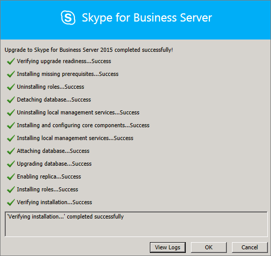
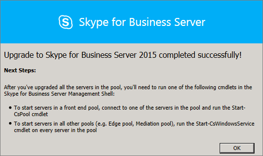

# <a name="upgrade-to-skype-for-business-server-2015"></a><span data-ttu-id="60cb0-104">비즈니스용 Skype 서버 2015로 업그레이드</span><span class="sxs-lookup"><span data-stu-id="60cb0-104">Upgrade to Skype for Business Server 2015</span></span>
 
<span data-ttu-id="60cb0-105">**요약:** Lync Server 2013에서 비즈니스용 Skype 서버 2015로 업그레이드하는 방법을 학습합니다.</span><span class="sxs-lookup"><span data-stu-id="60cb0-105">**Summary:** Learn how to upgrade from Lync Server 2013 to Skype for Business Server 2015.</span></span> <span data-ttu-id="60cb0-106">Microsoft 평가판 센터에서 비즈니스용 Skype 서버 2015 무료 [평가판을 다운로드합니다.](https://www.microsoft.com/evalcenter/evaluate-skype-for-business-server)</span><span class="sxs-lookup"><span data-stu-id="60cb0-106">Download a free trial of Skype for Business Server 2015 from the  [Microsoft Evaluation center](https://www.microsoft.com/evalcenter/evaluate-skype-for-business-server).</span></span>
  
<span data-ttu-id="60cb0-107">이 문서의 절차에 따라 비즈니스용 Skype 서버 토폴로지 작성기 및 새로운 In-Place 업그레이드 기능을 사용하여 Lync Server 2013에서 비즈니스용 Skype 서버 2015로 업그레이드합니다.</span><span class="sxs-lookup"><span data-stu-id="60cb0-107">Use the procedures in this document to upgrade from Lync Server 2013 to Skype for Business Server 2015 by using the Skype for Business Server Topology Builder and the new In-Place Upgrade feature.</span></span> <span data-ttu-id="60cb0-108">Lync Server 2010 또는 Office Communications Server 2007 R2에서 업그레이드하려면 비즈니스용 [Skype 서버 2015로의 업그레이드 계획(Plan to upgrade to Business Server)을 참조하세요.](../plan-your-deployment/upgrade.md)</span><span class="sxs-lookup"><span data-stu-id="60cb0-108">If you want to upgrade from Lync Server 2010 or Office Communications Server 2007 R2, see [Plan to upgrade to Skype for Business Server 2015](../plan-your-deployment/upgrade.md).</span></span>

> [!NOTE]
> <span data-ttu-id="60cb0-109">현재 장소 업그레이드는 비즈니스용 Skype 서버 2015에서 사용할 수 있지만 비즈니스용 Skype 서버 2019에서 더 이상 지원되지 않습니다.</span><span class="sxs-lookup"><span data-stu-id="60cb0-109">In-place upgrades were available in Skype for Business Server 2015 but are no longer supported in Skype for Business Server 2019.</span></span> <span data-ttu-id="60cb0-110">나란히 공존하는 것이 지원됩니다. 자세한 내용은 비즈니스용 [Skype 서버 2019로](../../SfBServer2019/migration/migration-to-skype-for-business-server-2019.md) 마이그레이션을 참조하세요.</span><span class="sxs-lookup"><span data-stu-id="60cb0-110">Side by side coexistance is supported, see [Migration to Skype for Business Server 2019](../../SfBServer2019/migration/migration-to-skype-for-business-server-2019.md) for more information.</span></span>
  
## <a name="upgrade-from-lync-server-2013"></a><span data-ttu-id="60cb0-111">Lync Server 2013에서 업그레이드</span><span class="sxs-lookup"><span data-stu-id="60cb0-111">Upgrade from Lync Server 2013</span></span>

<span data-ttu-id="60cb0-112">Lync Server 2013을 비즈니스용 Skype 서버 2015로 업그레이드하려면 선행 소프트웨어 설치, 비즈니스용 Skype 서버 토폴로지 작성기 사용, 풀의 데이터베이스 업그레이드, 풀과 연결된 각 서버에서 비즈니스용 Skype 서버 In-Place 업그레이드를 사용합니다.</span><span class="sxs-lookup"><span data-stu-id="60cb0-112">Upgrading Lync Server 2013 to Skype for Business Server 2015 involves installing prerequisite software, using the Skype for Business Server Topology Builder to upgrade databases in the pool, and using the Skype for Business Server In-Place Upgrade on each of the servers associated with the pool.</span></span> <span data-ttu-id="60cb0-113">업그레이드를 완료하려면 이 항목의 8단계를 진행합니다.</span><span class="sxs-lookup"><span data-stu-id="60cb0-113">To complete the upgrade, go through the eight steps in this topic.</span></span>
  
### <a name="before-you-begin"></a><span data-ttu-id="60cb0-114">시작하기 전에</span><span class="sxs-lookup"><span data-stu-id="60cb0-114">Before you begin</span></span>

- <span data-ttu-id="60cb0-115">비즈니스용 [Skype 서버 2015로](../plan-your-deployment/upgrade.md)업그레이드하기 위한 계획을 검토합니다.</span><span class="sxs-lookup"><span data-stu-id="60cb0-115">Review [Plan to upgrade to Skype for Business Server 2015](../plan-your-deployment/upgrade.md).</span></span>
    
- <span data-ttu-id="60cb0-116">비즈니스용 [Skype 서버 2015에 대한 서버 요구 사항을 검토합니다.](../plan-your-deployment/requirements-for-your-environment/server-requirements.md)</span><span class="sxs-lookup"><span data-stu-id="60cb0-116">Review [Server requirements for Skype for Business Server 2015](../plan-your-deployment/requirements-for-your-environment/server-requirements.md).</span></span>
    
- <span data-ttu-id="60cb0-117">[비즈니스용 Skype 서버 2015에](install/install-prerequisites.md) 대한 사전 준비를 설치합니다.</span><span class="sxs-lookup"><span data-stu-id="60cb0-117">[Install prerequisites for Skype for Business Server 2015](install/install-prerequisites.md) .</span></span>
    
- <span data-ttu-id="60cb0-118">[비즈니스용 Skype 서버 2015를 설치합니다.](install/install.md)</span><span class="sxs-lookup"><span data-stu-id="60cb0-118">[Install Skype for Business Server 2015](install/install.md) .</span></span>
    
### <a name="step-1-install-administrator-tools-and-download-topology"></a><span data-ttu-id="60cb0-119">1단계: 관리자 도구 설치 및 토폴로지 다운로드</span><span class="sxs-lookup"><span data-stu-id="60cb0-119">Step 1: Install Administrator tools and download topology</span></span>

1. <span data-ttu-id="60cb0-120">Lync OCSCore 또는 다른 Lync 구성 요소가 설치되지 않은 토폴로지의 컴퓨터에 연결합니다.</span><span class="sxs-lookup"><span data-stu-id="60cb0-120">Connect to computer in the topology that does not have Lync OCSCore or any other Lync components installed.</span></span>
    
2. <span data-ttu-id="60cb0-121">비즈니스용 Skype 서버 2015 설치  미디어에서 **Setup.exe\Setup\AMD64에서 OCS_Volume 실행합니다.**</span><span class="sxs-lookup"><span data-stu-id="60cb0-121">From Skype for Business Server 2015 installation media, run **Setup.exe** from **OCS_Volume\Setup\AMD64**.</span></span> 
    
3. <span data-ttu-id="60cb0-122">**설치** 를 클릭합니다.</span><span class="sxs-lookup"><span data-stu-id="60cb0-122">Click **Install**.</span></span> 
    
4. <span data-ttu-id="60cb0-123">사용권 계약에 동의합니다.</span><span class="sxs-lookup"><span data-stu-id="60cb0-123">Accept the license agreement.</span></span>
    
5. <span data-ttu-id="60cb0-124">배포 마법사에서 **관리자** 도구 설치를 클릭하고 단계에 따라 설치합니다.</span><span class="sxs-lookup"><span data-stu-id="60cb0-124">On the Deployment Wizard, click **Install Administrator tools**, and follow the steps to install.</span></span>
    
     
  
6. <span data-ttu-id="60cb0-126">Windows 시작 화면에서 비즈니스용 Skype 서버 토폴로지 작성기(Skype for Business Server Topology Builder)를 니다.</span><span class="sxs-lookup"><span data-stu-id="60cb0-126">From the Windows Start screen, open Skype for Business Server Topology Builder.</span></span>
    
7. <span data-ttu-id="60cb0-127">기존 **배포에서 토폴로지 다운로드를 클릭하고** 다음을 **클릭합니다.**</span><span class="sxs-lookup"><span data-stu-id="60cb0-127">Click **Download topology from existing deployment**, and click **Next**.</span></span>
    
8. <span data-ttu-id="60cb0-128">토폴로지의 이름을 입력하고 저장을 **클릭합니다.**</span><span class="sxs-lookup"><span data-stu-id="60cb0-128">Enter a name for the topology, and click **Save**.</span></span>
    
9. <span data-ttu-id="60cb0-129">토폴로지가 저장된 위치로 이동하여 토폴로지 복사본을 만들 수 있습니다.</span><span class="sxs-lookup"><span data-stu-id="60cb0-129">Go to location where you saved the topology, and make a copy of the topology.</span></span>
    
### <a name="step-2-upgrade-and-publish-topology-using-topology-builder"></a><span data-ttu-id="60cb0-130">2단계: 토폴로지 작성기에서 토폴로지 업그레이드 및 게시</span><span class="sxs-lookup"><span data-stu-id="60cb0-130">Step 2: Upgrade and publish topology using Topology Builder</span></span>

<span data-ttu-id="60cb0-131">업그레이드 프로세스를 시작하기 전에 업그레이드할 풀에 대해 모든 서비스가 실행되고 있어야 합니다.</span><span class="sxs-lookup"><span data-stu-id="60cb0-131">Before you start the upgrade process, all services must be running for the pools you plan to upgrade.</span></span> <span data-ttu-id="60cb0-132">따라서 토폴로지 변경 내용이 풀에 있는 서버의 로컬 데이터베이스에 복제됩니다.</span><span class="sxs-lookup"><span data-stu-id="60cb0-132">This is so the topology changes will be replicated to the local database of the servers in the pool.</span></span>
  
> [!IMPORTANT]
>  <span data-ttu-id="60cb0-133">업그레이드하기 전에 토폴로지 파일의 복사본을 저장합니다.</span><span class="sxs-lookup"><span data-stu-id="60cb0-133">Save a copy of your topology file before you upgrade.</span></span> <span data-ttu-id="60cb0-134">업그레이드한 후 토폴로지의 다운그레이드를 할 수 없습니다.> 영구 채팅 서비스가 영구 채팅 데이터베이스와 동일한 서버에 있는 경우 이 단계를 건너뛰고 4단계로 이동하십시오.</span><span class="sxs-lookup"><span data-stu-id="60cb0-134">After you upgrade, you will not be able to downgrade the topology.>  If your services are on the same servers as your databases, like the Persistent Chat service is on the same server as the Persistent Chat database, skip this step, and go to step 4.</span></span> <span data-ttu-id="60cb0-135">서비스를 중지한 후 각 서버에서 In-Place 업그레이드 설치를 실행하여 로컬 데이터베이스를 업그레이드합니다.</span><span class="sxs-lookup"><span data-stu-id="60cb0-135">After you stop the services, run the In-Place Upgrade setup on each server to upgrade the local databases.</span></span>
  
> [!NOTE]
> <span data-ttu-id="60cb0-136">토폴로지가 미러링된 백 엔드 데이터베이스가 있는 경우 토폴로지 작성기에서 토폴로지 게시 시 보안 주체 및 미러된 데이터베이스가 모두 표시될 수 있습니다. </span><span class="sxs-lookup"><span data-stu-id="60cb0-136">If the topology has a back-end database that is mirrored then you will see both the Principal and the Mirrored databases show up **when you publish the topology** using Topology Builder.</span></span> <span data-ttu-id="60cb0-137">토폴로지 게시 시 모든 데이터베이스가 보안 주체에서 실행되고 있으며 미러가 아닌 보안 주체만 선택해야 합니다. 그렇지 않으면 토폴로지 게시 후 경고가 표시됩니다.</span><span class="sxs-lookup"><span data-stu-id="60cb0-137">Make sure all of the databases are running on the Principal and only select the Principal, not the mirror, when publishing the topology otherwise you will see a warning after publishing the topology.</span></span>
  
<span data-ttu-id="60cb0-138">비즈니스용 Skype 서버 2015 토폴로지 작성기에서 새 토폴로지 업그레이드 및 게시하려면 아래 옵션 중 하나를 선택합니다.</span><span class="sxs-lookup"><span data-stu-id="60cb0-138">Pick one of the options below to upgrade and publish a new topology by using the Skype for Business Server 2015 Topology Builder.</span></span> <span data-ttu-id="60cb0-139">단계를 완료하고 업데이트된 토폴로지 게시한 후 이 항목의 3단계로 이동하십시오.</span><span class="sxs-lookup"><span data-stu-id="60cb0-139">After you complete the steps and publish the updated topology, move to Step 3 in this topic.</span></span>
  
#### <a name="option-1-upgrade-an-isolated-front-end-pool-and-associated-archiving-and-monitoring-stores"></a><span data-ttu-id="60cb0-140">옵션 1: 격리된 프런트 엔드 풀 및 연결된 보관 및 모니터링 저장소 업그레이드</span><span class="sxs-lookup"><span data-stu-id="60cb0-140">Option 1: Upgrade an isolated Front End pool and associated Archiving and Monitoring stores</span></span>

<span data-ttu-id="60cb0-141">업그레이드할 풀에 보관 및 모니터링 저장소 종속성이 있는 경우 다음 단계를 사용하면 보관 및 모니터링 저장소도 업그레이드됩니다.</span><span class="sxs-lookup"><span data-stu-id="60cb0-141">If the pool you're upgrading has an Archiving and Monitoring store dependency, when you use the following steps, the Archiving and Monitoring store will be upgraded as well.</span></span>
  
1. <span data-ttu-id="60cb0-142">토폴로지 작성기에서 Lync Server 2013 풀을 마우스 오른쪽 단추로 클릭하고 비즈니스용 **Skype 서버 2015로** 업그레이드를 선택한 다음 단계를 수행합니다.</span><span class="sxs-lookup"><span data-stu-id="60cb0-142">In Topology Builder, right-click a Lync Server 2013 pool, select **Upgrade to Skype for Business Server 2015**, and follow the steps.</span></span> 
    
     
  
2. <span data-ttu-id="60cb0-144">토폴로지 작성기에서 **작업** 게시 토폴로지 또는 작업  >   토폴로지   >  **게시를**  >  **클릭합니다.**</span><span class="sxs-lookup"><span data-stu-id="60cb0-144">In Topology Builder, click **Action** > **Publish topology** or **Action** > **Topology** > **Publish**.</span></span> 
    
     
  
3. <span data-ttu-id="60cb0-146">게시하는 동안 보관 및 모니터링 저장소에 데이터베이스를 설치하도록 선택하십시오.</span><span class="sxs-lookup"><span data-stu-id="60cb0-146">During publishing, choose to install a database on the Archiving and Monitoring store.</span></span>
    
#### <a name="option-2-upgrade-front-end-pool-without-upgrading-archiving-and-monitoring-stores"></a><span data-ttu-id="60cb0-147">옵션 2: 보관 및 모니터링 저장소를 업그레이드하지 않고 프런트 엔드 풀 업그레이드</span><span class="sxs-lookup"><span data-stu-id="60cb0-147">Option 2: Upgrade Front End pool without upgrading Archiving and Monitoring stores</span></span>

<span data-ttu-id="60cb0-148">다음 단계를 사용하면 선택한 풀에 대한 보관 및 모니터링이 사용하지 않도록 설정됩니다.</span><span class="sxs-lookup"><span data-stu-id="60cb0-148">If you use the following steps, archiving and monitoring for the selected pool are disabled.</span></span> <span data-ttu-id="60cb0-149">업그레이드 후에 풀에 보관 및 모니터링 저장소가 없습니다.</span><span class="sxs-lookup"><span data-stu-id="60cb0-149">The pool will not have Archiving and Monitoring stores after the upgrade.</span></span>
  
1. <span data-ttu-id="60cb0-150">토폴로지 작성기에서 업그레이드할 Lync Server 2013 풀을 선택합니다.</span><span class="sxs-lookup"><span data-stu-id="60cb0-150">In Topology Builder, select the Lync Server 2013 pool that you want to upgrade.</span></span>
    
2. <span data-ttu-id="60cb0-151">Lync Server 2013 보관 및 모니터링 저장소에 대한 종속성 제거</span><span class="sxs-lookup"><span data-stu-id="60cb0-151">Remove the dependency to the Lync Server 2013 Archiving and Monitoring stores.</span></span> 
    
   - <span data-ttu-id="60cb0-152">작업 **편집**  >  **속성으로 이동**</span><span class="sxs-lookup"><span data-stu-id="60cb0-152">Go to **Action** > **Edit properties**.</span></span>
    
   - <span data-ttu-id="60cb0-153">보관 **확인란의 선택을** 취소합니다.</span><span class="sxs-lookup"><span data-stu-id="60cb0-153">Clear the **Archiving** check box.</span></span>
    
     
  
   - <span data-ttu-id="60cb0-155">모니터링 **확인란의 선택을** 취소합니다.</span><span class="sxs-lookup"><span data-stu-id="60cb0-155">Clear the **Monitoring** check box.</span></span>
    
     
  
3. <span data-ttu-id="60cb0-157">Lync Server 2013 풀을 마우스 오른쪽 단추로 클릭하고 비즈니스용 **Skype 서버 2015로** 업그레이드를 선택한 다음 단계를 수행합니다.</span><span class="sxs-lookup"><span data-stu-id="60cb0-157">Right-click the Lync Server 2013 pool, select **Upgrade to Skype for Business Server 2015**, and follow the steps.</span></span> 
    
     
  
4. <span data-ttu-id="60cb0-159">토폴로지 작성기에서 **작업** 게시 토폴로지 또는 작업  >   토폴로지   >  **게시를**  >  **클릭합니다.**</span><span class="sxs-lookup"><span data-stu-id="60cb0-159">In Topology Builder, click **Action** > **Publish topology** or **Action** > **Topology** > **Publish**.</span></span> 
    
#### <a name="option-3-upgrade-front-end-pool-and-associated-it-to-new-skype-for-business-server-2015-archiving-and-monitoring-stores"></a><span data-ttu-id="60cb0-160">옵션 3: 프런트 엔드 풀을 업그레이드하고 새 비즈니스용 Skype 서버 2015 보관 및 모니터링 저장소에 연결</span><span class="sxs-lookup"><span data-stu-id="60cb0-160">Option 3: Upgrade Front End pool and associated it to new Skype for Business Server 2015 Archiving and Monitoring stores</span></span>

<span data-ttu-id="60cb0-161">다음 단계를 사용하면 보관 및 모니터링이 이전 저장소에서 중지되고 만든 새 저장소에서 시작됩니다.</span><span class="sxs-lookup"><span data-stu-id="60cb0-161">If you use the following steps, archiving and monitoring will stop in the previous store and start in the new store you've created.</span></span> 
  
1. <span data-ttu-id="60cb0-162">토폴로지 작성기에서 업그레이드할 Lync Server 2013 풀을 선택합니다.</span><span class="sxs-lookup"><span data-stu-id="60cb0-162">In Topology Builder, select the Lync Server 2013 pool that you want to upgrade.</span></span> 
    
2. <span data-ttu-id="60cb0-163">Lync Server 2013 보관 및 모니터링 저장소에 대한 종속성 제거</span><span class="sxs-lookup"><span data-stu-id="60cb0-163">Remove the dependency to the Lync Server 2013 Archiving and Monitoring stores.</span></span> 
    
   - <span data-ttu-id="60cb0-164">작업 **편집**  >  **속성으로 이동**</span><span class="sxs-lookup"><span data-stu-id="60cb0-164">Go to **Action** > **Edit properties**.</span></span>
    
   - <span data-ttu-id="60cb0-165">보관 **확인란의 선택을** 취소합니다.</span><span class="sxs-lookup"><span data-stu-id="60cb0-165">Clear the **Archiving** check box.</span></span>
    
     
  
   - <span data-ttu-id="60cb0-167">모니터링 **확인란의 선택을** 취소합니다.</span><span class="sxs-lookup"><span data-stu-id="60cb0-167">Clear the **Monitoring** check box.</span></span>
    
     
  
3. <span data-ttu-id="60cb0-169">Lync Server 2013 풀을 마우스 오른쪽 단추로 클릭하고 비즈니스용 **Skype 서버 2015로** 업그레이드를 선택한 다음 단계를 수행합니다.</span><span class="sxs-lookup"><span data-stu-id="60cb0-169">Right-click the Lync Server 2013 pool, select **Upgrade to Skype for Business Server 2015**, and follow the steps.</span></span> 
    
     
  
4. <span data-ttu-id="60cb0-171">보관용 새 SQL 저장소를 만들 수 있습니다.</span><span class="sxs-lookup"><span data-stu-id="60cb0-171">Create a new SQL store for Archiving.</span></span> 
    
   - <span data-ttu-id="60cb0-172">풀 및 **작업** 편집  >  **속성을 선택합니다.**</span><span class="sxs-lookup"><span data-stu-id="60cb0-172">Select the pool and **Action** > **Edit properties**.</span></span> 
    
   -  <span data-ttu-id="60cb0-173">**보관** 확인란을 선택합니다.</span><span class="sxs-lookup"><span data-stu-id="60cb0-173">Select the **Archiving** check box.</span></span>
    
   - <span data-ttu-id="60cb0-174">**새로 만들기** 를 클릭합니다.</span><span class="sxs-lookup"><span data-stu-id="60cb0-174">Click **New**.</span></span>
    
     
  
5. <span data-ttu-id="60cb0-176">모니터링할 새 SQL 저장소를 만들 수 있습니다.</span><span class="sxs-lookup"><span data-stu-id="60cb0-176">Create a new SQL store for Monitoring.</span></span> 
    
   - <span data-ttu-id="60cb0-177">풀 및 **작업** 편집  >  **속성을 선택합니다.**</span><span class="sxs-lookup"><span data-stu-id="60cb0-177">Select the pool and **Action** > **Edit properties**.</span></span> 
    
   -  <span data-ttu-id="60cb0-178">모니터링 **확인란을** 선택합니다.</span><span class="sxs-lookup"><span data-stu-id="60cb0-178">Select the **Monitoring** check box.</span></span>
    
   - <span data-ttu-id="60cb0-179">**새로 만들기** 를 클릭합니다.</span><span class="sxs-lookup"><span data-stu-id="60cb0-179">Click **New**.</span></span>
    
     
  
6. <span data-ttu-id="60cb0-181">토폴로지 작성기에서 **작업** 게시 토폴로지 또는 작업  >   토폴로지   >  **게시를**  >  **클릭합니다.**</span><span class="sxs-lookup"><span data-stu-id="60cb0-181">In Topology Builder, click **Action** > **Publish topology** or **Action** > **Topology** > **Publish**.</span></span> 
    
7. <span data-ttu-id="60cb0-182">게시하는 동안 새 보관 및 모니터링 저장소에 데이터베이스를 설치하도록 선택하십시오.</span><span class="sxs-lookup"><span data-stu-id="60cb0-182">During publishing, choose to install the database on the new Archiving and Monitoring store.</span></span>
    
### <a name="step-3-wait-for-replication"></a><span data-ttu-id="60cb0-183">3단계: 복제 대기</span><span class="sxs-lookup"><span data-stu-id="60cb0-183">Step 3: Wait for replication</span></span>

<span data-ttu-id="60cb0-184">업데이트된 토폴로지가 환경의 모든 서버에 게시될 수 있는 시간을 복제에 제공합니다.</span><span class="sxs-lookup"><span data-stu-id="60cb0-184">Give replication some time to publish the updated topology to all the servers in the environment.</span></span>
  
### <a name="step-4-stop-all-services-in-pool-to-be-upgraded"></a><span data-ttu-id="60cb0-185">4단계: 업그레이드할 풀의 모든 서비스 중지</span><span class="sxs-lookup"><span data-stu-id="60cb0-185">Step 4: Stop all services in pool to be upgraded</span></span>

<span data-ttu-id="60cb0-186">업그레이드할 풀을 서비스하는 각 서버에서 PowerShell에서 다음 cmdlet을 실행합니다.</span><span class="sxs-lookup"><span data-stu-id="60cb0-186">On each server that is servicing the pool that you're going to upgrade, run the following cmdlet in PowerShell:</span></span>
  
```powershell
Disable-CsComputer -Scorch
```

<span data-ttu-id="60cb0-187">업그레이드 Disable-CsComputer 중에 서버를 다시 시작해야 할 수 있기 때문에 In-Place 것이 좋습니다.</span><span class="sxs-lookup"><span data-stu-id="60cb0-187">We recommend using Disable-CsComputer because you may need to reboot the server during the In-Place Upgrade process.</span></span> <span data-ttu-id="60cb0-188">Stop-CsWindowsService를 사용하는 경우 다시 시작한 후 일부 서비스가 자동으로 다시 시작될 수 있습니다.</span><span class="sxs-lookup"><span data-stu-id="60cb0-188">If you use Stop-CsWindowsService, some services may restart automatically after a reboot.</span></span> <span data-ttu-id="60cb0-189">이로 인해 In-Place 업그레이드가 실패할 수 있습니다.</span><span class="sxs-lookup"><span data-stu-id="60cb0-189">This may cause the In-Place Upgrade to fail.</span></span>
  
### <a name="step-5-upgrade-front-end-pools-and-non-front-end-pool-servers"></a><span data-ttu-id="60cb0-190">5단계: 프런트 엔드 풀 및 비 프런트 엔드 풀 서버 업그레이드</span><span class="sxs-lookup"><span data-stu-id="60cb0-190">Step 5: Upgrade Front End pools and non-Front End pool servers</span></span>

> [!NOTE]
>  <span data-ttu-id="60cb0-191">업그레이드하기 전에 비즈니스용 Skype 서버 2015에 필요한 모든 새 필수 > 업그레이드를 시도하기 전에 최소 32GB의 사용 가능한 공간을 설치하세요.</span><span class="sxs-lookup"><span data-stu-id="60cb0-191">Before upgrading please install all new prerequisites required for Skype for Business Server 2015 which include:>  At least 32GB of free space before attempting an upgrade.</span></span> <span data-ttu-id="60cb0-192">또한 드라이브가 고정된 로컬 드라이브, USB 또는 Firewire로 연결되어 있지 않은지 확인 는 NTFS 파일 시스템으로 형식이 지정되어 있으며 압축되지 않은 페이지 파일도 포함하지 않습니다.> PowerShell 버전 6.2.9 200.0 이상.> 최신 Lync Server 2013 누적 업데이트가 설치되었습니다.> SQL Server 2012 SP1이 설치되었습니다.> 다음 KB가 설치됩니다(자동으로 설치되는 경우). using Microsoft Update):> Windows Server 2008 R2 -[KB2533623](https://support.microsoft.com/kb/2533623)> Windows Server 2012 -[KB2858668](https://support.microsoft.com/kb/2858668)> Windows Server 2012 R2 -[KB2982006](https://support.microsoft.com/kb/2982006)</span><span class="sxs-lookup"><span data-stu-id="60cb0-192">In addition, make sure that the drive is a fixed local drive, is not connected by USB or Firewire, is formatted with NTFS file system, is not compressed, and does not contain a page file.>  PowerShell version 6.2.9200.0 or later.>  The latest Lync Server 2013 Cumulative Update installed.>  SQL Server 2012 SP1 installed.>  The following KB's installed (installed automatically if using Microsoft Update):>  Windows Server 2008 R2 -[KB2533623](https://support.microsoft.com/kb/2533623)>  Windows Server 2012 -[KB2858668](https://support.microsoft.com/kb/2858668)>  Windows Server 2012 R2 -[KB2982006](https://support.microsoft.com/kb/2982006)</span></span>
  
<span data-ttu-id="60cb0-193">각 In-Place 업그레이드를 사용하여 프런트 엔드 풀, 에지 풀, 중재 서버 및 영구 채팅 풀을 업데이트합니다.</span><span class="sxs-lookup"><span data-stu-id="60cb0-193">Use the In-Place Upgrade on each server to update the Front End pool, Edge pool, Mediation server, and the Persistent Chat pool.</span></span>
  
1. <span data-ttu-id="60cb0-194">각 서버에서 **비즈니스용** SkypeSetup.exe미디어의 **OCS_Volume\Setup\amd64에서** 클라이언트를 실행합니다.</span><span class="sxs-lookup"><span data-stu-id="60cb0-194">On each server, run **Setup.exe** from **OCS_Volume\Setup\amd64** on the Skype for Business Server 2015 installation media.</span></span>
    
2. <span data-ttu-id="60cb0-195">사용권 계약에 동의하고 업그레이드 시작 프롬프트에 In-Place 합니다.</span><span class="sxs-lookup"><span data-stu-id="60cb0-195">Accept the license agreement and follow the prompts for the In-Place Upgrade.</span></span>
    
3. <span data-ttu-id="60cb0-196">프런트 엔드 풀의 각 서버와 각 비 프런트 엔드 풀 서버에 대해 이러한 단계를 반복합니다.</span><span class="sxs-lookup"><span data-stu-id="60cb0-196">Repeat these steps for each server in the Front End pool and on each non-Front End pool server.</span></span>
    
> [!NOTE]
> <span data-ttu-id="60cb0-197">업그레이드 중 서버를 다시 시작하라는 메시지가 표시될 In-Place 있습니다.</span><span class="sxs-lookup"><span data-stu-id="60cb0-197">You might be prompted to reboot the server during the In-Place Upgrade.</span></span> <span data-ttu-id="60cb0-198">괜찮아요.</span><span class="sxs-lookup"><span data-stu-id="60cb0-198">That's ok.</span></span> <span data-ttu-id="60cb0-199">다시 시작하고 나면 In-Place 업그레이드가 해제된 위치부터 계속됩니다.</span><span class="sxs-lookup"><span data-stu-id="60cb0-199">After you reboot, the In-Place Upgrade will continue from where it left off.</span></span> 
  
<span data-ttu-id="60cb0-200">업그레이드 In-Place 완료되면 다음 메시지가 표시됩니다.</span><span class="sxs-lookup"><span data-stu-id="60cb0-200">When the In-Place Upgrade completes successfully, you see the following message.</span></span>
  

  
### <a name="step-6-restart-services-on-all-upgraded-servers"></a><span data-ttu-id="60cb0-202">6단계: 업그레이드된 모든 서버에서 서비스 다시 시작</span><span class="sxs-lookup"><span data-stu-id="60cb0-202">Step 6: Restart services on all upgraded servers</span></span>

> [!NOTE]
> <span data-ttu-id="60cb0-203">서비스를 다시 시작하기 전에 %ProgramData%\WindowsFabric이 모든 프런트 엔드 서버에 없는지 확인하시기 바랍니다.</span><span class="sxs-lookup"><span data-stu-id="60cb0-203">Before restarting the services, please make sure %ProgramData%\WindowsFabric doesn't exist on all Front End Servers.</span></span> <span data-ttu-id="60cb0-204">있는 경우 서비스를 시작하기 전에 삭제합니다.</span><span class="sxs-lookup"><span data-stu-id="60cb0-204">If it exists, delete it before starting the services.</span></span> 
  
- <span data-ttu-id="60cb0-205">프런트 엔드 풀의 모든 서버를 업그레이드한 후 다음 PowerShell 명령을 사용하여 서비스를 다시 시작합니다.</span><span class="sxs-lookup"><span data-stu-id="60cb0-205">After you've upgraded all servers in the Front End pool, restart the services by using the following PowerShell command:</span></span> 
    
  ```powershell
  Start-CsPool
  ```

    > [!NOTE]
    > <span data-ttu-id="60cb0-206">In-Place Upgrade를 실행하기 전에 이미 보류 중인 시스템 재부팅이 필요한 경우 In-Place 업그레이드를 실행하면 설치가 끝날 때 다시 시작하지 않습니다.</span><span class="sxs-lookup"><span data-stu-id="60cb0-206">If there is already a pending system reboot needed before you start running In-Place Upgrade, then In-Place Upgrade won't ask you to reboot at the end of the installation.</span></span> <span data-ttu-id="60cb0-207">이렇게 하면 이 cmdlet을 사용하여 서비스를 시작하려고 할 때 첫 번째 프런트 엔드 서버에 대해 일부 어셈블리 예외가 Start-CSPool 발생합니다.</span><span class="sxs-lookup"><span data-stu-id="60cb0-207">This will cause some assembly exceptions to be thrown against the first Front End server when you try to start services using the Start-CSPool cmdlet.</span></span> <span data-ttu-id="60cb0-208">이러한 오류를 해결하기 위해 풀의 모든 서버를 다시 시작하고 cmdlet을 다시 실행합니다.</span><span class="sxs-lookup"><span data-stu-id="60cb0-208">To resolve these errors, reboot all of the servers in the pool and run the cmdlet again.</span></span> 
  
- <span data-ttu-id="60cb0-209">프런트 엔드 풀이 아닌 서버에서 다음 명령을 사용하여 서비스를 다시 시작합니다.</span><span class="sxs-lookup"><span data-stu-id="60cb0-209">On the non-Front End pool servers, restart the services by using the following command:</span></span>
    
  ```powershell
  Start-CsWindowsService
  ```

<span data-ttu-id="60cb0-210">업그레이드 **In-Place** 확인을 클릭하면 다음 미리 알림이 표시되어 이 단계를 완료할 수 있습니다.</span><span class="sxs-lookup"><span data-stu-id="60cb0-210">After you click **OK** on the In-Place Upgrade page, you'll see the following reminder to complete this step.</span></span>
  

  
### <a name="step-7-verify-skype-for-business-functionality-works"></a><span data-ttu-id="60cb0-212">7단계: 비즈니스용 Skype 기능이 작동하는지 확인</span><span class="sxs-lookup"><span data-stu-id="60cb0-212">Step 7: Verify Skype for Business functionality works</span></span>

<span data-ttu-id="60cb0-213">업그레이드가 성공적이면 업그레이드된 풀의 경우 비즈니스용 Skype를 테스트하여 기능이 예상대로 작동하고 있는지를 테스트합니다.</span><span class="sxs-lookup"><span data-stu-id="60cb0-213">To make sure the upgrade was successful, for the pool that was upgraded, test Skype for Business to make sure the functionality is working as expected.</span></span> 
  
### <a name="step-8-upgrade-secondary-pools"></a><span data-ttu-id="60cb0-214">8단계: 보조 풀 업그레이드</span><span class="sxs-lookup"><span data-stu-id="60cb0-214">Step 8: Upgrade secondary pools</span></span>

<span data-ttu-id="60cb0-215">이 항목의 단계를 반복하여 환경에 있는 추가 풀을 업그레이드합니다.</span><span class="sxs-lookup"><span data-stu-id="60cb0-215">Repeat the steps in this topic to upgrade any additional pools that you have in your environment.</span></span>
  
## <a name="troubleshoot-issues-with-the-in-place-upgrade"></a><span data-ttu-id="60cb0-216">업그레이드 후 In-Place 문제 해결</span><span class="sxs-lookup"><span data-stu-id="60cb0-216">Troubleshoot issues with the In-Place Upgrade</span></span>

<span data-ttu-id="60cb0-217">업그레이드 In-Place 실패하면 다음 이미지에 있는 메시지와 유사한 메시지가 표시될 수 있습니다.</span><span class="sxs-lookup"><span data-stu-id="60cb0-217">If the In-Place Upgrade fails, you might see a message similar to what's in the following image.</span></span> 
  

  
<span data-ttu-id="60cb0-219">페이지 아래쪽의 전체 메시지를 검토하여 문제를 해결하는 데 도움이 됩니다.</span><span class="sxs-lookup"><span data-stu-id="60cb0-219">Review the full message at the bottom of the page to help you troubleshoot the issue.</span></span> <span data-ttu-id="60cb0-220">자세한 **내용을 보려면** 로그 보기를 클릭합니다.</span><span class="sxs-lookup"><span data-stu-id="60cb0-220">Click **View logs** to get more detail.</span></span>
  
<span data-ttu-id="60cb0-221">In-Place 업그레이드가 업그레이드 준비 상태  확인 또는 누락된 필수 구성 소프트웨어 설치에 실패하는 경우 서버에 모든 최신 Windows Server, Lync Server 및 SQL Server 업데이트가 적용되어 있는지 확인하고 필요한 모든 소프트웨어 및 역할이 설치되어 있는지 확인합니다. </span><span class="sxs-lookup"><span data-stu-id="60cb0-221">If the In-Place Upgrade fails on **Verifying upgrade readiness** or **Installing missing prerequisites**, make sure the server has all the latest Windows Server, Lync Server, and SQL Server updates applied, and all the required software and roles are installed.</span></span> <span data-ttu-id="60cb0-222">필요한 항목 목록은 비즈니스용 [Skype 서버 2015](../plan-your-deployment/requirements-for-your-environment/server-requirements.md) 및 비즈니스용 Skype 서버 2015의 설치 필수 조건에 대한 서버 요구 사항을 [참조하세요.](install/install-prerequisites.md)</span><span class="sxs-lookup"><span data-stu-id="60cb0-222">For a list of what's required, see [Server requirements for Skype for Business Server 2015](../plan-your-deployment/requirements-for-your-environment/server-requirements.md) and [Install prerequisites for Skype for Business Server 2015](install/install-prerequisites.md).</span></span>
  
## <a name="see-also"></a><span data-ttu-id="60cb0-223">참고 항목</span><span class="sxs-lookup"><span data-stu-id="60cb0-223">See also</span></span>

[<span data-ttu-id="60cb0-224">비즈니스용 Skype 서버 2015로 업그레이드 계획</span><span class="sxs-lookup"><span data-stu-id="60cb0-224">Plan to upgrade to Skype for Business Server 2015</span></span>](../plan-your-deployment/upgrade.md)
  
[<span data-ttu-id="60cb0-225">비즈니스용 Skype 서버 2015에 대한 서버 요구 사항</span><span class="sxs-lookup"><span data-stu-id="60cb0-225">Server requirements for Skype for Business Server 2015</span></span>](../plan-your-deployment/requirements-for-your-environment/server-requirements.md)
  
[<span data-ttu-id="60cb0-226">비즈니스용 Skype 서버 2015의 설치 선행 준비</span><span class="sxs-lookup"><span data-stu-id="60cb0-226">Install prerequisites for Skype for Business Server 2015</span></span>](install/install-prerequisites.md)
  
[<span data-ttu-id="60cb0-227">비즈니스용 Skype 서버 2015 설치</span><span class="sxs-lookup"><span data-stu-id="60cb0-227">Install Skype for Business Server 2015</span></span>](install/install.md)
