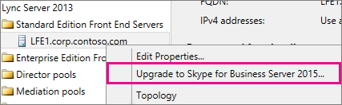
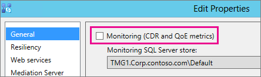

# <a name="upgrade-to-skype-for-business-server-2015"></a>비즈니스용 Skype 서버 2015로 업그레이드
 
**요약:** Lync Server 2013에서 비즈니스용 Skype 서버 2015로 업그레이드하는 방법을 알아봅니다. 
  
이 문서의 절차를 사용하여 비즈니스용 Skype 서버 토폴로지 작성기 및 새 In-Place 업그레이드 기능을 사용하여 Lync Server 2013에서 비즈니스용 Skype 서버 2015로 업그레이드합니다. Lync Server 2010 또는 Office Communications Server 2007 R2에서 [업그레이드하려면 비즈니스용 Skype 서버 2015로 업그레이드 계획을](../plan-your-deployment/upgrade.md) 참조하세요.

> [!NOTE]
> 2015년 비즈니스용 Skype 서버 현재 위치 업그레이드를 사용할 수 있었지만 2019년 비즈니스용 Skype 서버 더 이상 지원되지 않습니다. 나란히 공존이 지원됩니다. 자세한 내용은 [비즈니스용 Skype 서버 2019로 마이그레이션](../../SfBServer2019/migration/migration-to-skype-for-business-server-2019.md)을 참조하세요.
  
## <a name="upgrade-from-lync-server-2013"></a>Lync Server 2013에서 업그레이드

Lync Server 2013을 비즈니스용 Skype 서버 2015로 업그레이드하려면 필수 구성 요소 소프트웨어를 설치하고, 비즈니스용 Skype 서버 토폴로지 작성기를 사용하여 풀의 데이터베이스를 업그레이드하고, 풀과 연결된 각 서버에서 비즈니스용 Skype 서버 In-Place 업그레이드를 사용해야 합니다. 업그레이드를 완료하려면 이 항목의 8단계를 진행합니다.
  
### <a name="before-you-begin"></a>시작하기 전에

- [비즈니스용 Skype 서버 2015로 업그레이드할 계획을 검토합니다](../plan-your-deployment/upgrade.md).
    
- [비즈니스용 Skype 서버 2015에 대한 서버 요구 사항을 검토합니다](../plan-your-deployment/requirements-for-your-environment/server-requirements.md).
    
- [비즈니스용 Skype 서버 2015에 대한 필수 구성 요소를 설치합니다](install/install-prerequisites.md).
    
- [비즈니스용 Skype 서버 2015를 설치합니다](install/install.md).
    
### <a name="step-1-install-administrator-tools-and-download-topology"></a>1단계: 관리자 도구 설치 및 토폴로지 다운로드

1. Lync OCSCore 또는 다른 Lync 구성 요소가 설치되지 않은 토폴로지의 컴퓨터에 커넥트.
    
2. 비즈니스용 Skype 서버 2015 설치 미디어에서 **OCS_Volume\Setup\AMD64에서Setup.exe** 실행합니다.**** 
    
3. **설치** 를 클릭합니다. 
    
4. 사용권 계약에 동의합니다.
    
5. 배포 마법사에서 **관리자 도구 설치** 를 클릭하고 설치 단계를 수행합니다.
    
     
  
6. Windows 시작 화면 비즈니스용 Skype 서버 토폴로지 작성기를 엽니다.
    
7. **기존 배포에서 토폴로지 다운로드를** 클릭하고 **다음** 을 클릭합니다.
    
8. 토폴로지의 이름을 입력하고 **저장** 을 클릭합니다.
    
9. 토폴로지 저장 위치로 이동하여 토폴로지의 복사본을 만듭니다.
    
### <a name="step-2-upgrade-and-publish-topology-using-topology-builder"></a>2단계: 토폴로지 작성기에서 토폴로지 업그레이드 및 게시

업그레이드 프로세스를 시작하기 전에 업그레이드하려는 풀에 대해 모든 서비스가 실행되고 있어야 합니다. 따라서 토폴로지 변경 내용이 풀에 있는 서버의 로컬 데이터베이스에 복제됩니다.
  
> [!IMPORTANT]
>  업그레이드하기 전에 토폴로지 파일의 복사본을 저장합니다. 업그레이드한 후에는 토폴로지의 다운그레이드를 수행할 수 없습니다.> 영구 채팅 서비스가 영구 채팅 데이터베이스와 동일한 서버에 있는 것처럼 서비스가 데이터베이스와 동일한 서버에 있는 경우 이 단계를 건너뛰고 4단계로 이동합니다. 서비스를 중지한 후 각 서버에서 In-Place 업그레이드 설정을 실행하여 로컬 데이터베이스를 업그레이드합니다.
  
> [!NOTE]
> 토폴로지에 미러된 백 엔드 데이터베이스가 있는 경우 토폴로지 작성기를 사용하여 **토폴** 로지 게시 시 보안 주체와 미러된 데이터베이스가 모두 표시됩니다. 모든 데이터베이스가 보안 주체에서 실행되고 있는지 확인하고 토폴로지 게시 시 미러가 아닌 보안 주체만 선택합니다. 그렇지 않으면 토폴로지 게시 후 경고가 표시됩니다.
  
비즈니스용 Skype 서버 2015 토폴로지 작성기를 사용하여 새 토폴로지 업그레이드 및 게시하려면 아래 옵션 중 하나를 선택합니다. 단계를 완료하고 업데이트된 토폴로지 게시 후 이 항목의 3단계로 이동합니다.
  
#### <a name="option-1-upgrade-an-isolated-front-end-pool-and-associated-archiving-and-monitoring-stores"></a>옵션 1: 격리된 프런트 엔드 풀 및 연결된 보관 및 모니터링 저장소 업그레이드

업그레이드하는 풀에 보관 및 모니터링 저장소 종속성이 있는 경우 다음 단계를 사용하면 보관 및 모니터링 저장소도 업그레이드됩니다.
  
1. 토폴로지 작성기에서 Lync Server 2013 풀을 마우스 오른쪽 단추로 클릭하고 비즈니스용 Skype 서버 **2015로 업그레이드** 를 선택한 다음 단계를 수행합니다. 
    
     
  
2. 토폴로지 작성기에서 **작업** > **게시 토폴로지** 또는 작업 **토폴로지** > **게시****를** >  클릭합니다. 
    
     
  
3. 게시하는 동안 보관 및 모니터링 저장소에 데이터베이스를 설치하도록 선택합니다.
    
#### <a name="option-2-upgrade-front-end-pool-without-upgrading-archiving-and-monitoring-stores"></a>옵션 2: 보관 및 모니터링 저장소를 업그레이드하지 않고 프런트 엔드 풀 업그레이드

다음 단계를 사용하는 경우 선택한 풀에 대한 보관 및 모니터링을 사용할 수 없습니다. 업그레이드 후에는 풀에 보관 및 모니터링 저장소가 없습니다.
  
1. 토폴로지 작성기에서 업그레이드하려는 Lync Server 2013 풀을 선택합니다.
    
2. Lync Server 2013 보관 및 모니터링 저장소에 대한 종속성을 제거합니다. 
    
   - **작업** > **편집 속성** 으로 이동합니다.
    
   - **보관** 확인란의 선택을 취소합니다.
    
     
  
   - **모니터링** 확인란의 선택을 취소합니다.
    
     
  
3. Lync Server 2013 풀을 마우스 오른쪽 단추 **로 클릭하고 비즈니스용 Skype 서버 2015로 업그레이드** 를 선택한 다음 단계를 수행합니다. 
    
     
  
4. 토폴로지 작성기에서 **작업** > **게시 토폴로지** 또는 작업 **토폴로지** > **게시****를** >  클릭합니다. 
    
#### <a name="option-3-upgrade-front-end-pool-and-associated-it-to-new-skype-for-business-server-2015-archiving-and-monitoring-stores"></a>옵션 3: 프런트 엔드 풀을 업그레이드하고 새 비즈니스용 Skype 서버 2015 보관 및 모니터링 저장소에 연결

다음 단계를 사용하는 경우 보관 및 모니터링이 이전 저장소에서 중지되고 사용자가 만든 새 저장소에서 시작됩니다. 
  
1. 토폴로지 작성기에서 업그레이드하려는 Lync Server 2013 풀을 선택합니다. 
    
2. Lync Server 2013 보관 및 모니터링 저장소에 대한 종속성을 제거합니다. 
    
   - **작업** > **편집 속성** 으로 이동합니다.
    
   - **보관** 확인란의 선택을 취소합니다.
    
     
  
   - **모니터링** 확인란의 선택을 취소합니다.
    
     
  
3. Lync Server 2013 풀을 마우스 오른쪽 단추 **로 클릭하고 비즈니스용 Skype 서버 2015로 업그레이드** 를 선택한 다음 단계를 수행합니다. 
    
     
  
4. 보관을 위한 새 SQL 저장소를 만듭니다. 
    
   - 풀 및 **작업** > **편집 속성을** 선택합니다. 
    
   -  **보관** 확인란을 선택합니다.
    
   - **새로 만들기** 를 클릭합니다.
    
     
  
5. 모니터링을 위한 새 SQL 저장소를 만듭니다. 
    
   - 풀 및 **작업** > **편집 속성을** 선택합니다. 
    
   -  모니터링 확인란 **을** 선택합니다.
    
   - **새로 만들기** 를 클릭합니다.
    
     
  
6. 토폴로지 작성기에서 **작업** > **게시 토폴로지** 또는 작업 **토폴로지** > **게시****를** >  클릭합니다. 
    
7. 게시하는 동안 새 보관 및 모니터링 저장소에 데이터베이스를 설치하도록 선택합니다.
    
### <a name="step-3-wait-for-replication"></a>3단계: 복제 대기

복제에 업데이트된 토폴로지의 게시 시간을 환경의 모든 서버에 제공합니다.
  
### <a name="step-4-stop-all-services-in-pool-to-be-upgraded"></a>4단계: 풀에서 업그레이드할 모든 서비스 중지

업그레이드할 풀을 서비스하는 각 서버에서 PowerShell에서 다음 cmdlet을 실행합니다.
  
```powershell
Disable-CsComputer -Scorch
```

In-Place 업그레이드 프로세스 중에 서버를 다시 부팅해야 할 수 있으므로 Disable-CsComputer 사용하는 것이 좋습니다. Stop-CsWindowsService를 사용하는 경우 일부 서비스는 다시 부팅 후 자동으로 다시 시작될 수 있습니다. 이로 인해 In-Place 업그레이드가 실패할 수 있습니다.
  
### <a name="step-5-upgrade-front-end-pools-and-non-front-end-pool-servers"></a>5단계: 프런트 엔드 풀 및 비프런트 엔드 풀 서버 업그레이드

> [!NOTE]
>  업그레이드하기 전에 업그레이드를 시도하기 전에 최소 32GB의 여유 공간을 > 포함하는 비즈니스용 Skype 서버 2015에 필요한 모든 새로운 필수 조건을 설치하세요. 또한 드라이브가 고정된 로컬 드라이브인지, USB 또는 Firewire로 연결되지 않았는지, NTFS 파일 시스템으로 포맷되었는지 확인합니다. 는 압축되지 않으며 page file.> PowerShell 버전 6.2.9200.0 이상을 포함하지 않습니다.> 최신 Lync Server 2013 누적 업데이트 installed.> SQL Server 2012 SP1 installed.> 다음 KB가 설치되어 있습니다(Microsoft 업데이트를 사용하는 경우 자동으로 설치됨). > Windows Server 2008 R2 -[KB2533623](https://support.microsoft.com/kb/2533623)> Windows Server 2012 -[KB2858668](https://support.microsoft.com/kb/2858668)> Windows Server 2012 R2 -[KB2982006](https://support.microsoft.com/kb/2982006)
  
각 서버에서 In-Place 업그레이드를 사용하여 프런트 엔드 풀, 에지 풀, 중재 서버 및 영구 채팅 풀을 업데이트합니다.
  
1. 각 서버의 **비즈니스용 Skype 서버** 2015 설치 미디어의 **OCS_Volume\Setup\amd64** 에서Setup.exe실행합니다.
    
2. 사용권 계약에 동의하고 In-Place 업그레이드에 대한 프롬프트를 따릅니다.
    
3. 프런트 엔드 풀의 각 서버와 프런트 엔드가 아닌 각 풀 서버에서 이러한 단계를 반복합니다.
    
> [!NOTE]
> In-Place 업그레이드 중에 서버를 다시 부팅하라는 메시지가 표시될 수 있습니다. 괜찮아요. 다시 부팅한 후에는 In-Place 업그레이드가 중단된 위치에서 계속됩니다. 
  
In-Place 업그레이드가 성공적으로 완료되면 다음 메시지가 표시됩니다.
  

  
### <a name="step-6-restart-services-on-all-upgraded-servers"></a>6단계: 업그레이드된 모든 서버에서 서비스 다시 시작

> [!NOTE]
> 서비스를 다시 시작하기 전에 %ProgramData%\WindowsFabric이 모든 프런트 엔드 서버에 없는지 확인하세요. 있는 경우 서비스를 시작하기 전에 삭제합니다. 
  
- 프런트 엔드 풀의 모든 서버를 업그레이드한 후 다음 PowerShell 명령을 사용하여 서비스를 다시 시작합니다. 
    
  ```powershell
  Start-CsPool
  ```

    > [!NOTE]
    > In-Place 업그레이드 실행을 시작하기 전에 이미 보류 중인 시스템 다시 부팅이 필요한 경우 In-Place 업그레이드는 설치가 끝날 때 다시 부팅하라는 메시지가 표시되지 않습니다. 이로 인해 Start-CSPool cmdlet을 사용하여 서비스를 시작하려고 할 때 첫 번째 프런트 엔드 서버에 대해 일부 어셈블리 예외가 throw됩니다. 이러한 오류를 해결하려면 풀의 모든 서버를 다시 부팅하고 cmdlet을 다시 실행합니다. 
  
- 프런트 엔드가 아닌 풀 서버에서 다음 명령을 사용하여 서비스를 다시 시작합니다.
    
  ```powershell
  Start-CsWindowsService
  ```

In-Place 업그레이드 페이지에서 **확인을** 클릭하면 다음 미리 알림이 표시되며 이 단계를 완료합니다.
  

  
### <a name="step-7-verify-skype-for-business-functionality-works"></a>7단계: 비즈니스용 Skype 기능 작동 확인

업그레이드가 성공했는지 확인하려면 업그레이드된 풀에 대해 비즈니스용 Skype 테스트하여 기능이 예상대로 작동하는지 확인합니다. 
  
### <a name="step-8-upgrade-secondary-pools"></a>8단계: 보조 풀 업그레이드

이 항목의 단계를 반복하여 사용자 환경에 있는 모든 추가 풀을 업그레이드합니다.
  
## <a name="troubleshoot-issues-with-the-in-place-upgrade"></a>In-Place 업그레이드 관련 문제 해결

In-Place 업그레이드에 실패하면 다음 이미지와 유사한 메시지가 표시될 수 있습니다. 
  

  
페이지 맨 아래에 있는 전체 메시지를 검토하여 문제를 해결하는 데 도움이 됩니다. 자세한 내용을 보려면 **로그 보기를** 클릭합니다.
  
**업그레이드 준비 확인** 또는 **누락된 필수 구성 요소 설치** 시 In-Place 업그레이드가 실패하는 경우 서버에 최신 Windows Server, Lync Server 및 SQL Server 업데이트가 모두 적용되어 있고 필요한 모든 소프트웨어 및 역할이 설치되어 있는지 확인합니다. 필요한 항목 목록은 [비즈니스용 Skype 서버 2015에 대한 서버 요구 사항](../plan-your-deployment/requirements-for-your-environment/server-requirements.md) 및 [비즈니스용 Skype 서버 2015에 대한 설치 필수 구성 요소를](install/install-prerequisites.md) 참조하세요.
  
## <a name="see-also"></a>참고 항목

[비즈니스용 Skype 서버 2015로 업그레이드 계획](../plan-your-deployment/upgrade.md)
  
[비즈니스용 Skype 서버 2015의 서버 요구 사항](../plan-your-deployment/requirements-for-your-environment/server-requirements.md)
  
[비즈니스용 Skype 서버 2015에 대한 필수 구성 요소 설치](install/install-prerequisites.md)
  
[2015 비즈니스용 Skype 서버 설치](install/install.md)
