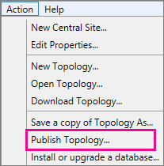

# <a name="upgrade-to-skype-for-business-server-2015"></a>2015 비즈니스용 Skype 서버 업그레이드
 
**요약:** Lync Server 2013에서 2015로 업그레이드하는 비즈니스용 Skype 서버 대해 자세히 알아보습니다. Microsoft 평가판 센터에서 비즈니스용 Skype 서버 2015 [무료 평가판을 다운로드합니다.](https://www.microsoft.com/evalcenter/evaluate-skype-for-business-server)
  
이 문서의 절차에 따라 비즈니스용 Skype 서버 토폴로지 작성기 및 새로운 In-Place 업그레이드 기능을 사용하여 Lync Server 2013에서 비즈니스용 Skype 서버 2015로 업그레이드합니다. Lync Server 2010 또는 Office Communications Server 2007 R2에서 업그레이드하려면 [Plan to upgrade to 비즈니스용 Skype 서버 2015을](../plan-your-deployment/upgrade.md)참조합니다.

> [!NOTE]
> 전체 업그레이드는 비즈니스용 Skype 서버 2015에서 사용할 수 있지만 2019년 8월에는 더 이상 비즈니스용 Skype 서버 없습니다. 동시 사용이 지원됩니다. 자세한 내용은 [Migration to 비즈니스용 Skype 서버 2019을](../../SfBServer2019/migration/migration-to-skype-for-business-server-2019.md) 참조하십시오.
  
## <a name="upgrade-from-lync-server-2013"></a>Lync Server 2013에서 업그레이드

Lync Server 2013을 비즈니스용 Skype 서버 2015로 업그레이드하려면 필요한 소프트웨어를 설치하고, 비즈니스용 Skype 서버 토폴로지 작성기에서 풀의 데이터베이스를 업그레이드하고, 풀과 연결된 각 서버에서 비즈니스용 Skype 서버 In-Place 업그레이드를 사용합니다. 업그레이드를 완료하려면 이 항목의 8단계를 진행합니다.
  
### <a name="before-you-begin"></a>시작하기 전에

- Plan [to upgrade to 비즈니스용 Skype 서버 2015을 검토합니다.](../plan-your-deployment/upgrade.md)
    
- [2015에 대한 서버 비즈니스용 Skype 서버 검토합니다.](../plan-your-deployment/requirements-for-your-environment/server-requirements.md)
    
- [2015](install/install-prerequisites.md) 에 대한 비즈니스용 Skype 서버 설치합니다.
    
- [2015 비즈니스용 Skype 서버 설치합니다.](install/install.md)
    
### <a name="step-1-install-administrator-tools-and-download-topology"></a>1단계: 관리자 도구 설치 및 토폴로지 다운로드

1. 커넥트 Lync OCSCore 또는 다른 Lync 구성 요소가 설치되지 않은 토폴로지의 컴퓨터에 연결됩니다.
    
2. 비즈니스용 Skype 서버 2015 설치 미디어에서 **Setup.exe\OCS_Volume\AMD64에서** 를 실행합니다.  
    
3. **설치** 를 클릭합니다. 
    
4. 사용권 계약에 동의합니다.
    
5. 배포 마법사에서 관리자 도구 **설치를 클릭하고** 단계에 따라 설치합니다.
    
     
  
6. 시작 Windows 시작 화면에서 토폴로지 비즈니스용 Skype 서버 를 니다.
    
7. 기존 **배포에서 토폴로지 다운로드를 클릭하고** 다음 을 **클릭합니다.**
    
8. 토폴로지의 이름을 입력하고 저장을 **클릭합니다.**
    
9. 토폴로지 저장 위치로 이동하여 토폴로지 복사본을 만들 수 있습니다.
    
### <a name="step-2-upgrade-and-publish-topology-using-topology-builder"></a>2단계: 토폴로지 작성기 사용하여 토폴로지 업그레이드 및 게시

업그레이드 프로세스를 시작하기 전에 업그레이드할 풀에 대해 모든 서비스가 실행되고 있어야 합니다. 이렇게 하면 토폴로지 변경 내용이 풀에 있는 서버의 로컬 데이터베이스에 복제됩니다.
  
> [!IMPORTANT]
>  업그레이드하기 전에 토폴로지 파일의 복사본을 저장합니다. 업그레이드한 후 토폴로지.> 영구 채팅 서비스가 영구 채팅 데이터베이스와 동일한 서버에 있는 경우와 같은 서버가 데이터베이스와 동일한 서버에 있는 경우 이 단계를 건너뛰고 4단계로 이동하십시오. 서비스를 중지한 후 각 서버에서 In-Place 설치를 실행하여 로컬 데이터베이스를 업그레이드합니다.
  
> [!NOTE]
> 토폴로지가 미러링된 백 엔드 데이터베이스가 있는 경우 토폴로지 작성기에서 토폴로지 게시 시 보안 주체 및 미러된 데이터베이스가 모두 표시 됩니다.  토폴로지 게시 시 모든 데이터베이스가 보안 주체에서 실행되고 있는지 확인한 다음 미러가 아닌 보안 주체만 선택합니다. 그렇지 않으면 토폴로지 게시 후 경고가 표시됩니다.
  
비즈니스용 Skype 서버 2015 토폴로지 작성기에서 새 토폴로지 업그레이드 및 게시하려면 아래 옵션 중 하나를 선택합니다. 단계를 완료하고 업데이트된 토폴로지 게시한 후 이 항목의 3단계로 이동하십시오.
  
#### <a name="option-1-upgrade-an-isolated-front-end-pool-and-associated-archiving-and-monitoring-stores"></a>옵션 1: 격리된 프런트 엔드 풀 및 연결된 보관 및 모니터링 저장소 업그레이드

업그레이드할 풀에 보관 및 모니터링 저장소 종속성이 있는 경우 다음 단계를 사용하면 보관 및 모니터링 저장소도 업그레이드됩니다.
  
1. 토폴로지 작성기에서 Lync Server 2013 풀을 마우스 오른쪽 단추로 클릭하고 비즈니스용 Skype 서버 **2015로** 업그레이드를 선택하고 단계를 따릅니다. 
    
     
  
2. 토폴로지 작성기에서 작업 **게시** 토폴로지 또는 작업 토폴로지 게시  >     >  **를**  >  **클릭합니다.** 
    
     
  
3. 게시하는 동안 보관 및 모니터링 저장소에 데이터베이스를 설치하도록 선택하십시오.
    
#### <a name="option-2-upgrade-front-end-pool-without-upgrading-archiving-and-monitoring-stores"></a>옵션 2: 보관 및 모니터링 저장소를 업그레이드하지 않고 프런트 엔드 풀 업그레이드

다음 단계를 사용하면 선택한 풀에 대한 보관 및 모니터링을 사용할 수 없습니다. 업그레이드 후에 풀에 보관 및 모니터링 저장소가 없습니다.
  
1. 토폴로지 작성기에서 업그레이드할 Lync Server 2013 풀을 선택합니다.
    
2. Lync Server 2013 보관 및 모니터링 저장소에 대한 종속성 제거 
    
   - 동작 **편집**  >  **속성으로 이동 합니다.**
    
   - 보관 **확인란의 선택을** 취소합니다.
    
     
  
   - 모니터링 **확인란의 선택을** 취소합니다.
    
     
  
3. Lync Server 2013 풀을 마우스 오른쪽 단추로 클릭하고 비즈니스용 Skype 서버 **2015로** 업그레이드를 선택한 다음 단계를 따릅니다. 
    
     
  
4. 토폴로지 작성기에서 작업 **게시** 토폴로지 또는 작업 토폴로지 게시  >     >  **를**  >  **클릭합니다.** 
    
#### <a name="option-3-upgrade-front-end-pool-and-associated-it-to-new-skype-for-business-server-2015-archiving-and-monitoring-stores"></a>옵션 3: 프런트 엔드 풀을 업그레이드하고 새 비즈니스용 Skype 서버 2015 보관 및 모니터링 저장소에 연결

다음 단계를 사용하면 이전 저장소에서 보관 및 모니터링이 중지되고 만든 새 저장소에서 시작됩니다. 
  
1. 토폴로지 작성기에서 업그레이드할 Lync Server 2013 풀을 선택합니다. 
    
2. Lync Server 2013 보관 및 모니터링 저장소에 대한 종속성 제거 
    
   - 동작 **편집**  >  **속성으로 이동 합니다.**
    
   - 보관 **확인란의 선택을** 취소합니다.
    
     
  
   - 모니터링 **확인란의 선택을** 취소합니다.
    
     
  
3. Lync Server 2013 풀을 마우스 오른쪽 단추로 클릭하고 비즈니스용 Skype 서버 **2015로** 업그레이드를 선택한 다음 단계를 따릅니다. 
    
     
  
4. 보관용 새 SQL 저장소를 만들 수 있습니다. 
    
   - 풀 및 **작업** 편집  >  **속성을 선택합니다.** 
    
   -  **보관** 확인란을 선택합니다.
    
   - **새로 만들기** 를 클릭합니다.
    
     
  
5. 모니터링을 위해 SQL 저장소를 새로 만들 수 있습니다. 
    
   - 풀 및 **작업** 편집  >  **속성을 선택합니다.** 
    
   -  모니터링 **확인란을** 선택합니다.
    
   - **새로 만들기** 를 클릭합니다.
    
     
  
6. 토폴로지 작성기에서 작업 **게시** 토폴로지 또는 작업 토폴로지 게시  >     >  **를**  >  **클릭합니다.** 
    
7. 게시하는 동안 새 보관 및 모니터링 저장소에 데이터베이스를 설치하도록 선택하십시오.
    
### <a name="step-3-wait-for-replication"></a>3단계: 복제 대기

업데이트된 토폴로지가 환경의 모든 서버에 게시될 수 있는 시간을 복제에 제공합니다.
  
### <a name="step-4-stop-all-services-in-pool-to-be-upgraded"></a>4단계: 업그레이드할 풀의 모든 서비스 중지

업그레이드할 풀을 서비스하는 각 서버에서 PowerShell에서 다음 cmdlet을 실행합니다.
  
```powershell
Disable-CsComputer -Scorch
```

업그레이드 프로세스 Disable-CsComputer 서버를 다시 시작해야 할 수 있기 때문에 In-Place 좋습니다. Stop-CsWindowsService를 사용하는 경우 재부팅 후 일부 서비스가 자동으로 다시 시작될 수 있습니다. 이로 인해 업그레이드가 In-Place 수 있습니다.
  
### <a name="step-5-upgrade-front-end-pools-and-non-front-end-pool-servers"></a>5단계: 프런트 엔드 풀 및 비 프런트 엔드 풀 서버 업그레이드

> [!NOTE]
>  업그레이드하기 전에 업그레이드를 시도하기 전에 비즈니스용 Skype 서버 2015에 필요한 모든 새 필수 > 32GB 이상의 사용 가능한 공간을 설치하십시오. 또한 드라이브가 고정된 로컬 드라이브, USB 또는 Firewire로 연결되어 있지 않은지 확인 는 NTFS 파일 시스템으로 형식이 지정되고, 압축되지 않을 뿐만 아니라 페이지 파일도 포함하지 않습니다.> PowerShell 버전 6.2.9200.0 이상.> 설치된 최신 Lync Server 2013 누적 업데이트.> SQL Server 2012 SP1이 설치되어 있습니다.> 다음 KB가 설치됩니다(Microsoft 업데이트를 사용하는 경우 자동으로 설치됨). > Windows Server 2008 R2 -[KB2533623](https://support.microsoft.com/kb/2533623)> Windows Server 2012 -[KB2858668](https://support.microsoft.com/kb/2858668)> Windows Server 2012 R2 -[KB2982006](https://support.microsoft.com/kb/2982006)
  
각 In-Place 업그레이드를 사용하여 프런트 엔드 풀, 에지 풀, 중재 서버 및 영구 채팅 풀을 업데이트합니다.
  
1. 각 서버에서Setup.exe2015 설치 **OCS_Volume\setup\amd64에서** 비즈니스용 Skype 서버 실행합니다. 
    
2. 사용권 계약에 동의하고 업그레이드에 대한 In-Place 따라야 합니다.
    
3. 프런트 엔드 풀의 각 서버와 각 비 프런트 엔드 풀 서버에 대해 이러한 단계를 반복합니다.
    
> [!NOTE]
> 업그레이드 중에 서버를 다시 시작하라는 메시지가 표시될 In-Place 있습니다. 괜찮아요. 다시 시작하면 In-Place 업그레이드가 계속됩니다. 
  
업그레이드 In-Place 완료되면 다음 메시지가 표시됩니다.
  

  
### <a name="step-6-restart-services-on-all-upgraded-servers"></a>6단계: 업그레이드된 모든 서버에서 서비스 다시 시작

> [!NOTE]
> 서비스를 다시 시작하기 전에 %ProgramData%\WindowsFabric이 모든 프런트 엔드 서버에 없는지 확인하시기 바랍니다. 있는 경우 서비스를 시작하기 전에 삭제합니다. 
  
- 프런트 엔드 풀의 모든 서버를 업그레이드한 후 다음 PowerShell 명령을 사용하여 서비스를 다시 시작합니다. 
    
  ```powershell
  Start-CsPool
  ```

    > [!NOTE]
    > In-Place Upgrade를 실행하기 전에 이미 보류 중인 시스템 재부팅이 필요한 경우 In-Place 업그레이드를 실행하면 설치가 끝날 때 재부팅을 요청하지 않습니다. 이렇게 하면 Start-CSPool cmdlet을 사용하여 서비스를 시작하려고 할 때 첫 번째 프런트 엔드 서버에 대해 일부 어셈블리 예외가 발생하게 됩니다. 이러한 오류를 해결하기 위해 풀의 모든 서버를 다시 시작하고 cmdlet을 다시 실행합니다. 
  
- 프런트 엔드 풀이 아닌 서버에서 다음 명령을 사용하여 서비스를 다시 시작합니다.
    
  ```powershell
  Start-CsWindowsService
  ```

업그레이드 **In-Place** 페이지에서 확인을 클릭하면 다음 미리 알림이 표시되어 이 단계를 완료할 수 있습니다.
  

  
### <a name="step-7-verify-skype-for-business-functionality-works"></a>7단계: 비즈니스용 Skype 작동하는지 확인

업그레이드가 성공적이면 업그레이드된 풀에 대해 비즈니스용 Skype 기능이 예상대로 작동하고 있는지 테스트합니다. 
  
### <a name="step-8-upgrade-secondary-pools"></a>8단계: 보조 풀 업그레이드

이 항목의 단계를 반복하여 환경에 있는 추가 풀을 업그레이드합니다.
  
## <a name="troubleshoot-issues-with-the-in-place-upgrade"></a>업그레이드 업그레이드 관련 In-Place 해결

업그레이드 In-Place 실패하면 다음 이미지에 있는 메시지와 유사한 메시지가 표시될 수 있습니다. 
  

  
페이지 아래쪽의 전체 메시지를 검토하여 문제를 해결하는 데 도움이 됩니다. 자세한 **내용을 보려면** 로그 보기를 클릭합니다.
  
업그레이드 준비 상태 확인 또는  누락된 필수 구성 In-Place 설치 시 In-Place 업그레이드가 실패하면 서버에 모든 최신 Windows Server, Lync Server 및 SQL Server 업데이트가 적용되어 있으며 필요한 모든 소프트웨어 및 역할이 설치되어 있는지 확인합니다. 필요한 항목 목록은 server [requirements for 비즈니스용 Skype 서버 and](../plan-your-deployment/requirements-for-your-environment/server-requirements.md) Install [prerequisites for 비즈니스용 Skype 서버 2015를 참조하세요.](install/install-prerequisites.md)
  
## <a name="see-also"></a>참고 항목

[2015년 비즈니스용 Skype 서버 계획](../plan-your-deployment/upgrade.md)
  
[비즈니스용 Skype 서버 서버 요구 사항](../plan-your-deployment/requirements-for-your-environment/server-requirements.md)
  
[비즈니스용 Skype 서버 2015의 설치 선행 비즈니스용 Skype 서버](install/install-prerequisites.md)
  
[2015 비즈니스용 Skype 서버 설치](install/install.md)
