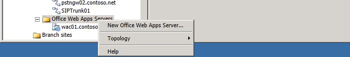

# Office Web Apps Server 범위 노드Office Web Apps Servers Scope Node

Office Web Apps 서버를 마우스 **오른쪽 단추로** 클릭하고 새 **Office Web Apps 서버를** 선택하여 마법사를 열 수 있습니다.You right click **Office Web Apps Servers** and select **New Office Web Apps Server** to open the wizard.

- **토폴로지.****Topology**. 이 옵션을 사용하여 새 토폴로지 정의, 기존 토폴로지 열기, 현재 토폴로지 다운로드, 토폴로지 복사본 저장, 토폴로지 게시, 데이터베이스 설치, 이전 버전의 구성 요소 병합 또는 배포 제거에 사용할 수 있습니다.You can use this option to define a new topology, open an existing topology, download the current topology, save a copy of the topology, publish the topology, install a database, merge components from previous versions, or remove the deployment.

- **도움말.****Help**. 이 옵션을 사용하여 활성 노드에 대한 도움말에 액세스할 수 있습니다.You can use this option to access Help for the active node.

## 참고 항목See also

[Office Web Apps 서버와의 통합 구성Configuring Integration with Office Web Apps Server](https://technet.microsoft.com/library/3370ab55-9949-4f32-b88b-5cffed6aaad8.aspx)
