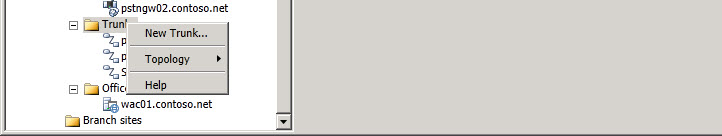

# 트렁크 범위 노드Trunks Scope Node
 
토폴로지 **작성기에서** 트렁크를 마우스 오른쪽 단추로 클릭하여 다음을 수행할 수 있습니다.Right-click **Trunks** in Topology Builder to perform the following:
  
- **새 트렁크**: 새 SIP 트렁크를 정의하는 데 사용되는 **새 트렁크 정의** 마법사를 시작합니다.**New Trunk**: Starts the **Define New Trunk** wizard used to define a new SIP trunk.
    
새 트렁크 옵션 외에 다음과 같은 일반적인 작업을 수행할 수 있습니다.In addition to the New Trunk option, you can perform the following general tasks:
  

  
- **토폴로지.****Topology**. 이 옵션을 사용하여 새 토폴로지 정의, 기존 토폴로지 열기, 현재 토폴로지 다운로드, 토폴로지 복사본 저장, 토폴로지 게시, 데이터베이스 설치, 이전 버전의 구성 요소 병합 또는 배포 제거에 사용할 수 있습니다.You can use this option to define a new topology, open an existing topology, download the current topology, save a copy of the topology, publish the topology, install a database, merge components from previous versions, or remove the deployment.
    
- **도움말**. 이 옵션을 사용하여 활성 노드에 대한 도움말에 액세스할 수 있습니다.**Help**. You can use this option to access Help for the active node.
    

