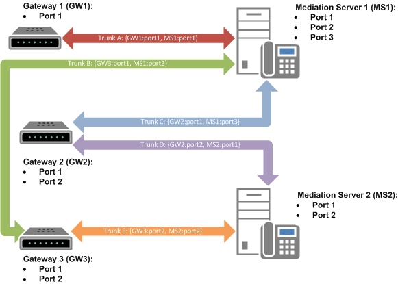

# 여러 트렁크 지원 비즈니스용 Skype 서버

비즈니스용 Skype 서버 기능은 게이트웨이와 중재 서버 간의 여러 연결 지원을 제공합니다. 이러한 연결은 중재 서버 풀과 PSTN(Public Switched Telephone Network) 게이트웨이, SBC(Session Border Controller) 또는 IP-PBX 간의 논리적 연결인 트렁크를 정의하여 만들 수 있습니다. 토폴로지 작성기에서 게이트웨이를 중재 서버(즉, 트렁크)와 연결합니다.

- 토폴로지 작성기에서 트렁크를 비즈니스용 Skype 서버 먼저 토폴로지 작성기에서 트렁크를 정의해야 합니다. 트렁크는 중재 서버 FQDN(정식 도메인 이름), 중재 서버 수신 포트, 게이트웨이 FQDN 및 게이트웨이 수신 포트와의 연결로 구성됩니다.
- 여러 트렁크를 구성하기 위해 동일한 게이트웨이와 중재 서버 간에 여러 개의 연관을 만들 수 있습니다. 이렇게 하면 Enterprise Voice 인프라에 대한 추가 탄력성도 제공될 수 있습니다. 이는 PBX(Private Branch Exchange) 상호 운영 시나리오에서 특히 유용합니다. 

트렁크가 정의된 경우 트렁크를 경로에 연결해야 합니다. 트렁크를 경로에 연결하기 위해 토폴로지 작성기에서 트렁크의 간단한 이름을 정의합니다. 이 간단한 이름은 트렁크를 경로와 연결될 수 있는 비즈니스용 Skype 서버 제어판에서 트렁크 이름으로 사용됩니다. 간단한 트렁크 이름은 관리 셸에서 게이트웨이 비즈니스용 Skype 서버 사용됩니다.

`New-CsVoiceRoute -Identity <RouteId> -NumberPattern <String> -PstnUsages @{add="<UsageString>"} -PstnGatewayList @{add="<TrunkSimpleName>"}`

관리자는 중재 서버와 연결된 기본 트렁크를 선택해야 합니다. 토폴로지 작성기에서 연결된 중재 서버를 마우스 오른쪽 단추로 클릭한 다음 속성을 **클릭합니다**. 중재 서버의 기본 게이트웨이를 지정합니다. 

다음 다이어그램은 각 중재 서버 및 게이트웨이에 대해 정의된 여러 트렁크를 보여 제공합니다. 

