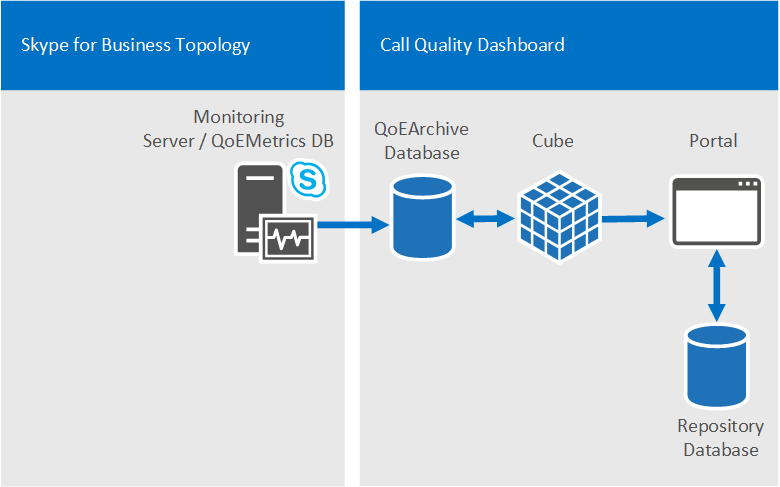

# <a name="plan-for-call-quality-dashboard-for-skype-for-business-server"></a><span data-ttu-id="1b0fc-103">비즈니스용 Skype 서버용 통화 품질 대시보드 계획</span><span class="sxs-lookup"><span data-stu-id="1b0fc-103">Plan for Call Quality Dashboard for Skype for Business Server</span></span> 
 
<span data-ttu-id="1b0fc-104">**요약:** 통화 품질 대시보드 계획을 수립할 때 고려해 야 할 사항에 대해 알아봅니다.</span><span class="sxs-lookup"><span data-stu-id="1b0fc-104">**Summary:** Learn about what to consider when you plan for the Call Quality Dashboard.</span></span>
  
## <a name="overview-of-the-skype-for-business-server-call-quality-dashboard"></a><span data-ttu-id="1b0fc-105">비즈니스용 Skype 서버 통화 품질 대시보드 개요</span><span class="sxs-lookup"><span data-stu-id="1b0fc-105">Overview of the Skype for Business Server Call Quality Dashboard</span></span>

<span data-ttu-id="1b0fc-106">비즈니스용 Skype Server 통화 품질 대시보드 (CQD)는 비즈니스용 Skype 서버의 모니터링 서버에 있는 환경 데이터베이스의 품질에 대 한 보고 계층입니다.</span><span class="sxs-lookup"><span data-stu-id="1b0fc-106">The Skype for Business Server Call Quality Dashboard (CQD) is a reporting layer on top of the Quality of Experience Database in the Monitoring Server in Skype for Business Server.</span></span> <span data-ttu-id="1b0fc-107">CQD는 Microsoft SQL Server Analysis Services를 사용 하 여 데이터 집합에서 필터링 및 피벗을 비롯 한 집계 사용 및 통화 품질 정보를 제공 합니다.</span><span class="sxs-lookup"><span data-stu-id="1b0fc-107">CQD uses Microsoft SQL Server Analysis Services to provide aggregate usage and call quality information as well as for filtering and pivoting on the dataset.</span></span> <span data-ttu-id="1b0fc-108">CQD 기능에는 다음이 포함 됩니다.</span><span class="sxs-lookup"><span data-stu-id="1b0fc-108">CQD features include:</span></span>
  
- <span data-ttu-id="1b0fc-109">**CQD의 체감 품질 Archive 구성 요소를 통해 체감 품질 데이터의 보관 저장소.**</span><span class="sxs-lookup"><span data-stu-id="1b0fc-109">**Archival storage of QoE data via the QoE Archive component of CQD.**</span></span> <span data-ttu-id="1b0fc-110">체감 품질 보관 구성 요소는 모니터링 서버에서 사용할 수 있는 것 보다 훨씬 긴 기간에 대 한 체감 품질 데이터를 저장할 수 있습니다.</span><span class="sxs-lookup"><span data-stu-id="1b0fc-110">The QoE Archive component can store QoE data for a much longer duration than the Monitoring Server can.</span></span> <span data-ttu-id="1b0fc-111">이 기능을 사용 하면 데이터를 포함 하 여 보고 창을 한 번에 최대 7 개월 동안 추세와 보고할 수 있습니다.</span><span class="sxs-lookup"><span data-stu-id="1b0fc-111">This allows for trending and reporting for up to seven months of data at a time, with the ability to slide the reporting window as far back as there is data.</span></span>
- <span data-ttu-id="1b0fc-112">**Microsoft SQL Server Analysis Services의 전원과 속도를 사용 하 여 보고 및 분석**</span><span class="sxs-lookup"><span data-stu-id="1b0fc-112">**Reporting and analysis using the power and speed of Microsoft SQL Server Analysis Services.**</span></span> <span data-ttu-id="1b0fc-113">CQD는 Microsoft SQL Analysis Services를 이용 하 여 빠른 요약, 필터 및 피벗 기능을 제공 하 여 분석 큐브를 통해 대시보드의 전원을 켭니다.</span><span class="sxs-lookup"><span data-stu-id="1b0fc-113">CQD utilizes Microsoft SQL Analysis Services to provide fast summary, filter, and pivoting capabilities to power the dashboard via an Analysis Cube.</span></span> <span data-ttu-id="1b0fc-114">실행 속도를 보고 하 고 데이터를 드릴 다운 하는 기능을 통해 분석 시간을 대폭 줄일 수 있습니다.</span><span class="sxs-lookup"><span data-stu-id="1b0fc-114">Reporting execution speed and the ability to drill down into the data can reduce analysis times dramatically.</span></span>
- <span data-ttu-id="1b0fc-115">**통화 품질 보고를 위해 최적화 된 새 데이터 스키마입니다.**</span><span class="sxs-lookup"><span data-stu-id="1b0fc-115">**New data schema optimized for call quality reporting.**</span></span> <span data-ttu-id="1b0fc-116">큐브에는 음성 품질 보고 및 조사를 위해 디자인 된 스키마가 있습니다.</span><span class="sxs-lookup"><span data-stu-id="1b0fc-116">The Cube has a schema designed for voice quality reporting and investigations.</span></span> <span data-ttu-id="1b0fc-117">포털 사용자는 체감 품질 메트릭 데이터베이스 스키마가 필요한 뷰에 매핑되는 방법을 파악 하는 대신 보고 작업에 집중할 수 있습니다.</span><span class="sxs-lookup"><span data-stu-id="1b0fc-117">Portal users can focus on the reporting tasks instead of figuring out how the QoE Metrics database schema maps to the views they need.</span></span> <span data-ttu-id="1b0fc-118">체감 품질 보관 및 큐브의 조합은 CQD를 통해 보고 및 분석의 복잡성을 줄이는 추상화를 제공 합니다.</span><span class="sxs-lookup"><span data-stu-id="1b0fc-118">The combination of the QoE Archive and the Cube provides an abstraction that reduces the complexity of reporting and analysis via CQD.</span></span> <span data-ttu-id="1b0fc-119">체감 품질 보관 데이터베이스 스키마에는 데이터의 전체 값을 향상 시키기 위해 배포 관련 데이터로 채울 수 있는 테이블도 포함 되어 있습니다.</span><span class="sxs-lookup"><span data-stu-id="1b0fc-119">The QoE Archive database schema also contains tables that can be populated with deployment-specific data to enhance the overall value of the data.</span></span>
- <span data-ttu-id="1b0fc-120">**기본 제공 보고서 디자이너 및 현재 위치 보고서 편집**</span><span class="sxs-lookup"><span data-stu-id="1b0fc-120">**Built-in report designer and in-place report editing.**</span></span> <span data-ttu-id="1b0fc-121">포털 구성 요소에는 통화 품질 방법론 다음에 모델링 된 여러 개의 기본 제공 보고서가 제공 됩니다.</span><span class="sxs-lookup"><span data-stu-id="1b0fc-121">The Portal component comes with several built-in reports modeled after the Call Quality Methodology.</span></span> <span data-ttu-id="1b0fc-122">포털 사용자는 포털의 편집 기능을 통해 보고서를 수정 하 고 새 보고서를 만들 수 있습니다.</span><span class="sxs-lookup"><span data-stu-id="1b0fc-122">Portal users can modify the reports and create new reports via the Portal's editing functionality.</span></span>
- <span data-ttu-id="1b0fc-123">**보고서 구조 및 분석 큐브 데이터에 대 한 Web API 액세스**</span><span class="sxs-lookup"><span data-stu-id="1b0fc-123">**Web API access to the Report Structure and Analysis Cube Data.**</span></span> <span data-ttu-id="1b0fc-124">대시보드 보고 프레임 워크는 큐브의 데이터를 표시 하는 유일한 방법은 아닙니다.</span><span class="sxs-lookup"><span data-stu-id="1b0fc-124">The Dashboard reporting framework is not the only way to display the data from the Cube.</span></span> <span data-ttu-id="1b0fc-125">CQD는 HTML 및 JavaScript를 사용 하 여 CQD 웹 Api에서 데이터를 검색 하 고 사용자 지정 형식으로 데이터를 렌더링 하는 몇 가지 예제를 제공 합니다.</span><span class="sxs-lookup"><span data-stu-id="1b0fc-125">CQD provides several examples of using HTML and JavaScript to retrieve data from the CQD Web APIs and render the data in a custom format.</span></span> <span data-ttu-id="1b0fc-126">보고서 편집기와 CQD 웹 Api를 함께 사용 하면 보고서 및 사용자 지정 보고서 레이아웃을 빠르게 프로토타입화 할 수 있습니다.</span><span class="sxs-lookup"><span data-stu-id="1b0fc-126">The combination of the Report Editor and the CQD Web APIs allows rapid prototyping of reports and custom report layout.</span></span>

> [!NOTE]
> <span data-ttu-id="1b0fc-127">이제 관리자가 [Cqd 버전 3](https://cqd.teams.microsoft.com) (관리자 자격 증명으로 로그인)을 사용 하 여 비즈니스용 Skype 서버 2019를 관리할 수 있습니다.</span><span class="sxs-lookup"><span data-stu-id="1b0fc-127">An admin can now manage Skype for Business Server 2019 using [CQD version 3](https://cqd.teams.microsoft.com) (log in with Admin credentials).</span></span> <span data-ttu-id="1b0fc-128">이를 위해서는 하이브리드 구현과 CDC (Call Data Connector)를 사용 해야 합니다.</span><span class="sxs-lookup"><span data-stu-id="1b0fc-128">This requires a hybrid implementation and the use of Call Data Connector (CDC).</span></span> <span data-ttu-id="1b0fc-129">CDC를 사용 하는 방법에 대 한 자세한 내용은 [통화 데이터 커넥터 계획](/SkypeForBusiness/hybrid/plan-call-data-connector) 을 참조 하세요.</span><span class="sxs-lookup"><span data-stu-id="1b0fc-129">See [Plan Call Data Connector](/SkypeForBusiness/hybrid/plan-call-data-connector) for more information on enabling CDC.</span></span> <span data-ttu-id="1b0fc-130">CQD 버전 3 설명서의 경우 CQD 버전 3에 대 한 자세한 내용은 [Microsoft 팀 및 비즈니스용 Skype Online에 대 한 통화 품질 대시보드 켜기 및 사용](/MicrosoftTeams/turning-on-and-using-call-quality-dashboard) 을 참조 하세요.</span><span class="sxs-lookup"><span data-stu-id="1b0fc-130">For CQD version 3 documentation, see [Turn on and use Call Quality Dashboard for Microsoft Teams and Skype for Business Online](/MicrosoftTeams/turning-on-and-using-call-quality-dashboard) for more information about CQD version 3.</span></span>

## <a name="cqd-design-goals"></a><span data-ttu-id="1b0fc-131">CQD 디자인 목표</span><span class="sxs-lookup"><span data-stu-id="1b0fc-131">CQD Design Goals</span></span>

<span data-ttu-id="1b0fc-132">CQD IT 전문가는 집계 데이터를 사용 하 여 미디어 품질 문제를 발생 하는 환경에서 포커스 영역을 식별할 수 있습니다.</span><span class="sxs-lookup"><span data-stu-id="1b0fc-132">CQD allows IT Pros to use aggregate data to identify focus areas in their environment experiencing media quality issues.</span></span> <span data-ttu-id="1b0fc-133">It 전문가는 여러 사용자 그룹의 통계를 비교 하 고 경향과 패턴을 확인할 수 있습니다.</span><span class="sxs-lookup"><span data-stu-id="1b0fc-133">It allows an IT Pro to compare statistics for different groups of users and identify trends and patterns.</span></span> <span data-ttu-id="1b0fc-134">개별 전화 문제를 해결 하는 데 중점을 두고 있지는 않지만 지정 된 환경의 여러 사용자에 게 적용 되는 문제 및 솔루션을 식별 합니다.</span><span class="sxs-lookup"><span data-stu-id="1b0fc-134">It is not focused on solving individual call issues, but on identifying problems and solutions that will apply to many users in a given environment.</span></span> 
  
## <a name="call-quality-dashboard-components"></a><span data-ttu-id="1b0fc-135">통화 품질 대시보드 구성 요소</span><span class="sxs-lookup"><span data-stu-id="1b0fc-135">Call Quality Dashboard components</span></span>

<span data-ttu-id="1b0fc-136">통화 품질 대시보드는 여러 데이터베이스, Microsoft SQL 에이전트 작업, 프로세스, 웹 응용 프로그램으로 구성 됩니다.</span><span class="sxs-lookup"><span data-stu-id="1b0fc-136">The Call Quality Dashboard consists of several databases, Microsoft SQL Agent jobs, processes, and web applications.</span></span> <span data-ttu-id="1b0fc-137">Microsoft SQL 에이전트 작업은 체감 품질 메트릭 데이터베이스의 데이터를 체감 품질 보관 데이터베이스에 주기적으로 복사 하 고 체감 품질 보관 데이터베이스의 데이터를 사용 하 여 큐브를 처리 합니다.</span><span class="sxs-lookup"><span data-stu-id="1b0fc-137">The Microsoft SQL Agent jobs periodically copy data from the QoE Metrics database into the QoE Archive database and processes the Cube with the data in the QoE Archive database.</span></span> <span data-ttu-id="1b0fc-138">리포지토리 데이터베이스에는 포털을 통해 공급 되는 보고서 정의가 저장 됩니다.</span><span class="sxs-lookup"><span data-stu-id="1b0fc-138">The Repository database stores the report definitions that power the Portal.</span></span> <span data-ttu-id="1b0fc-139">포털은 큐브 데이터에 대 한 브라우저 액세스를 제공 합니다.</span><span class="sxs-lookup"><span data-stu-id="1b0fc-139">The Portal provides browser access to the Cube data.</span></span> 
  
<span data-ttu-id="1b0fc-140">체감 품질 보관, 큐브, 리포지토리 데이터베이스를 포함 하 여 CQD 구성 요소를 모니터링 서버에 설치 하거나, 자체 서버에 설치 하거나, 여러 서버에 설치할 수 있습니다.</span><span class="sxs-lookup"><span data-stu-id="1b0fc-140">The CQD components, including the QoE Archive, Cube, and Repository databases, can be installed on the Monitoring Server, installed on its own server, or installed across multiple servers.</span></span> <span data-ttu-id="1b0fc-141">특정 설치 방법은 CQD의 성능 요구 및 같은 서버의 다른 프로세스에 미치는 영향에 따라 달라 집니다.</span><span class="sxs-lookup"><span data-stu-id="1b0fc-141">The particular installation method depends on the performance demands of CQD as well as impact to other processes on the same servers.</span></span> <span data-ttu-id="1b0fc-142">자세한 내용은이 문서의 뒷부분에 나오는 "CQD에 대 한 구성 요소 및 토폴로지" 섹션을 참조 하세요.</span><span class="sxs-lookup"><span data-stu-id="1b0fc-142">For more information, refer to the "Components and topologies for CQD" section later in this article.</span></span>
  
### <a name="architectural-overview"></a><span data-ttu-id="1b0fc-143">아키텍처 개요</span><span class="sxs-lookup"><span data-stu-id="1b0fc-143">Architectural Overview</span></span>

<span data-ttu-id="1b0fc-144">요약 하자면, CQD에는 다음과 같은 요소가 필요 합니다.</span><span class="sxs-lookup"><span data-stu-id="1b0fc-144">To summarize, CQD requires the following elements:</span></span>
  
- <span data-ttu-id="1b0fc-145">두 개의 데이터베이스: 보관 데이터베이스와 리포지토리 데이터베이스</span><span class="sxs-lookup"><span data-stu-id="1b0fc-145">Two databases: an Archive Database and a Repository Database.</span></span>
    
- <span data-ttu-id="1b0fc-146">집계 된 데이터를 시각화 하는 SSAS 큐브 하나</span><span class="sxs-lookup"><span data-stu-id="1b0fc-146">One SSAS Cube visualizing aggregated data</span></span> 
    
- <span data-ttu-id="1b0fc-147">IIS 호스트 CQD 웹 포털</span><span class="sxs-lookup"><span data-stu-id="1b0fc-147">IIS hosts CQD Web Portal</span></span>
    

  
<span data-ttu-id="1b0fc-149">동일한 CQD 아키텍처는 Lync Server 2013 및 비즈니스용 Skype를 지원 합니다.</span><span class="sxs-lookup"><span data-stu-id="1b0fc-149">The same CQD architecture supports Lync Server 2013 and Skype for Business.</span></span> 
  
### <a name="cqd-and-skype-for-business-vs-lync-2013"></a><span data-ttu-id="1b0fc-150">CQD 및 비즈니스용 Skype 및 Lync 2013</span><span class="sxs-lookup"><span data-stu-id="1b0fc-150">CQD and Skype for Business vs. Lync 2013</span></span>

 <span data-ttu-id="1b0fc-151">비즈니스용 Skype 환경 에서만 다음과 같은 접근 권한 값을 사용할 수 있습니다.</span><span class="sxs-lookup"><span data-stu-id="1b0fc-151">In a Skype for Business environment only, the following capabilities are available:</span></span>
  
- <span data-ttu-id="1b0fc-152">신호 강도에 대 한 wi-fi 보고</span><span class="sxs-lookup"><span data-stu-id="1b0fc-152">Wi-Fi reporting of Signal Strength</span></span>
    
- <span data-ttu-id="1b0fc-153">칩셋 드라이버의 wi-fi 보고</span><span class="sxs-lookup"><span data-stu-id="1b0fc-153">Wi-Fi reporting of Chipset drivers</span></span>
    
- <span data-ttu-id="1b0fc-154">내 통화 데이터 평가</span><span class="sxs-lookup"><span data-stu-id="1b0fc-154">Rate my Call data</span></span> 
    
## <a name="information-available-through-cqd"></a><span data-ttu-id="1b0fc-155">CQD를 통해 제공 되는 정보</span><span class="sxs-lookup"><span data-stu-id="1b0fc-155">Information available through CQD</span></span>

<span data-ttu-id="1b0fc-156">CQD는 비즈니스용 Skype 서버 오디오, 비디오, 응용 프로그램 공유 스트림 개수 및 불량 통화 수, 그리고 잘못 된 통화 비율을 표시할 수 있습니다.</span><span class="sxs-lookup"><span data-stu-id="1b0fc-156">CQD can show Skype for Business Server audio, video, and application sharing stream counts and count of good versus bad calls as well as ratios of bad to good calls.</span></span> <span data-ttu-id="1b0fc-157">보기를 분리 하 고 다양 한 치수로 필터링 할 수 있습니다.</span><span class="sxs-lookup"><span data-stu-id="1b0fc-157">The views can be sliced and filtered by many different dimensions.</span></span> <span data-ttu-id="1b0fc-158">CQD는 모니터링 서버의 체감 품질 메트릭 데이터베이스에서 데이터를 그립니다.</span><span class="sxs-lookup"><span data-stu-id="1b0fc-158">CQD draws data from the QoE Metrics database in the Monitoring Server.</span></span> <span data-ttu-id="1b0fc-159">그런 다음 "빌드 당 통화 품질"과 같은 보고서를 만들기 위해 네트워크 서브넷에서 건물 간 매핑과 같은 고객 제공 데이터와 병합 됩니다.</span><span class="sxs-lookup"><span data-stu-id="1b0fc-159">The data is then merged with any customer-supplied data, such as network subnet-to-building mapping to make reports such as "Call Quality per Building" possible.</span></span> 
  
<span data-ttu-id="1b0fc-160">또한 CQD는 "발신자" 및 "피호출자"와 같은 많은 내부 체감 품질 데이터 idiosyncrasies를 추상화 하 여 사용자가 "서버" 및 "클라이언트"에 대 한 보고서 보기를 작성 하는 데 집중할 수 있습니다.</span><span class="sxs-lookup"><span data-stu-id="1b0fc-160">CQD also abstracts many of the internal QoE data idiosyncrasies such as "caller" and "callee" such that the user can focus on building report views around "server" and "client".</span></span> <span data-ttu-id="1b0fc-161">통화 품질 방법론에 따라 CQD는 낮은 통화의 포켓이 있는 문제를 식별 하는 데 도움이 되도록 간소화 되었습니다 (통화 품질 향상을 위한 사항을 중 하나).</span><span class="sxs-lookup"><span data-stu-id="1b0fc-161">Following the Call Quality Methodology, CQD is streamlined to help identify the conditions that pockets of poor calls have in common—one of the tenets for improving call quality.</span></span>
  
## <a name="viewing-data-in-cqd"></a><span data-ttu-id="1b0fc-162">CQD의 데이터 보기</span><span class="sxs-lookup"><span data-stu-id="1b0fc-162">Viewing data in CQD</span></span>

<span data-ttu-id="1b0fc-163">CQD 데이터는 CQD 포털을 통해 보고 REST API 호출을 통해 액세스할 수 있습니다.</span><span class="sxs-lookup"><span data-stu-id="1b0fc-163">The CQD data can be viewed via the CQD Portal and accessed via REST API calls.</span></span>
  
### <a name="cqd-portal"></a><span data-ttu-id="1b0fc-164">CQD 포털</span><span class="sxs-lookup"><span data-stu-id="1b0fc-164">CQD Portal</span></span>

<span data-ttu-id="1b0fc-165">포털은 큐브의 데이터를 가장 빠르게 볼 수 있는 방법입니다.</span><span class="sxs-lookup"><span data-stu-id="1b0fc-165">The Portal is the fastest way to view the data in the Cube.</span></span> <span data-ttu-id="1b0fc-166">포털에는 바로 사용할 수 있는 여러 개의 기본 제공 보고서가 제공 됩니다.</span><span class="sxs-lookup"><span data-stu-id="1b0fc-166">The Portal comes with several built-in reports that are usable right away.</span></span> <span data-ttu-id="1b0fc-167">기본 제공 보고서는 사용자가 보다 작고 작은 통화 데이터 조각을 연속적으로 안내 하기 위해 구조화 된 방식으로 연결 되어 있습니다.</span><span class="sxs-lookup"><span data-stu-id="1b0fc-167">The built-in reports are linked in a structured manner to guide the user to successively smaller and smaller slices of the call data.</span></span> <span data-ttu-id="1b0fc-168">기본 제공 보고서에는 여러 피벗, 필터, 측정값을 사용 하 여 차트와 표를 조합 하 여 데이터를 표시할 수 있는 다양 한 방법이 강조 표시 됩니다.</span><span class="sxs-lookup"><span data-stu-id="1b0fc-168">The built-in reports also highlight the various different ways the data can be shown by demonstrating a combination of charts and tables with different pivots, filters, and measures.</span></span> <span data-ttu-id="1b0fc-169">포털에 액세스 하는 각 사용자에 게 자신이 수정 하 고 공유할 수 있는 고유한 보고서 집합을 포함할 수 있습니다.</span><span class="sxs-lookup"><span data-stu-id="1b0fc-169">Each user that accesses the Portal can have his or her own set of reports that he/she can modify and share.</span></span> <span data-ttu-id="1b0fc-170">CQD 웹 포털 사용 방법에 대 한 자세한 내용은 [비즈니스용 Skype 서버용 통화 품질 대시보드 사용](use.md)을 참조 하세요.</span><span class="sxs-lookup"><span data-stu-id="1b0fc-170">For more information on the usage of the CQD Web Portal, see [Use Call Quality Dashboard for Skype for Business Server](use.md).</span></span>
  
<span data-ttu-id="1b0fc-171">CQD 포털에 대해 지원 되는 운영 체제: Windows 8.1, Windows 8, Windows Server 2012 R2, Windows Server 2012 및 Windows Server 2016 (비즈니스용 Skype Server 2019 CQD에만 해당)</span><span class="sxs-lookup"><span data-stu-id="1b0fc-171">Supported Operating Systems for CQD Portal: Windows 8.1, Windows 8, Windows Server 2012 R2, Windows Server 2012 , and Windows Server 2016 (Skype for Business Server 2019 CQD only).</span></span>
  
<span data-ttu-id="1b0fc-172">CQD 포털의 지원 되는 브라우저: Internet Explorer 11, Internet Explorer 10 및 Internet Explorer 9.</span><span class="sxs-lookup"><span data-stu-id="1b0fc-172">Supported Browsers for CQD Portal: Internet Explorer 11, Internet Explorer 10, and Internet Explorer 9.</span></span>
  
### <a name="rest-apis"></a><span data-ttu-id="1b0fc-173">REST Api</span><span class="sxs-lookup"><span data-stu-id="1b0fc-173">REST APIs</span></span>

<span data-ttu-id="1b0fc-174">또한 REST API 호출을 통해서도 큐브 데이터에 액세스할 수 있습니다.</span><span class="sxs-lookup"><span data-stu-id="1b0fc-174">The Cube data can also be accessed via REST API calls.</span></span> <span data-ttu-id="1b0fc-175">REST API 호출을 통해 검색 된 데이터는 HTML 페이지를 통해 렌더링할 수 있습니다.</span><span class="sxs-lookup"><span data-stu-id="1b0fc-175">The data retrieved via the REST API calls can be rendered via HTML pages.</span></span> <span data-ttu-id="1b0fc-176">사용자는 비즈니스 요구에 적합 한 사용자 지정 보고서를 만드는 동시에 CQD의 쿼리 속도와 상위 수준 스키마를 활용할 수 있습니다.</span><span class="sxs-lookup"><span data-stu-id="1b0fc-176">Users can take advantage of the query speed and the high level schema of CQD while still creating custom reports suited for their business needs.</span></span> <span data-ttu-id="1b0fc-177">API 및 샘플에 대 한 자세한 내용은 [비즈니스용 Skype 서버에 대 한 통화 품질 대시보드 개발](develop.md)을 참조 하세요.</span><span class="sxs-lookup"><span data-stu-id="1b0fc-177">For more information on the API and samples, see [Develop Call Quality Dashboard for Skype for Business Server](develop.md).</span></span> 
  
## <a name="defining-your-organizations-requirements-for-cqd"></a><span data-ttu-id="1b0fc-178">CQD에 대 한 조직의 요구 사항 정의</span><span class="sxs-lookup"><span data-stu-id="1b0fc-178">Defining Your organization's requirements for CQD</span></span>

<span data-ttu-id="1b0fc-179">CQD는 체감 품질 데이터 보관 및 통화 품질 데이터에 대 한 빠른 및 심층 분석을 제공 합니다.</span><span class="sxs-lookup"><span data-stu-id="1b0fc-179">CQD provides QoE data archiving and fast and deep analysis of call quality data.</span></span> <span data-ttu-id="1b0fc-180">다음 가이드는 CQD를 배포 하는 시기 및 이유를 결정 하는 데 도움이 됩니다.</span><span class="sxs-lookup"><span data-stu-id="1b0fc-180">The following guide helps you to decide when and why you would deploy CQD.</span></span>
  
### <a name="when-to-deploy-cqd"></a><span data-ttu-id="1b0fc-181">CQD 배포 시기</span><span class="sxs-lookup"><span data-stu-id="1b0fc-181">When to deploy CQD</span></span>

 <span data-ttu-id="1b0fc-182">**조직에서 통화 품질 문제가 발생 하지 않는 경우에도 CQD를 배포 하 여 기본 통화 품질 측정을 설정할 수 있습니다.**</span><span class="sxs-lookup"><span data-stu-id="1b0fc-182">**CQD can be deployed to establish a baseline call quality measurement, even if an organization doesn't experience call quality issues.**</span></span> <span data-ttu-id="1b0fc-183">모든 조직이 Wi-fi와 유선 및 원격 및 office 작업자를 서로 다르게 혼합 했기 때문에 초기 계획 통화 품질 측정을 설정 하는 것이 중요 합니다.</span><span class="sxs-lookup"><span data-stu-id="1b0fc-183">Establishing a baseline call quality measurement is important because every organization has a different mix of Wi-Fi versus wired and remote versus office workers.</span></span> <span data-ttu-id="1b0fc-184">통화 품질 문제가 발생 하는 경우 가장 최근의 통화 품질 측정법을 이전 시간 간격과 비교할 수 있습니다.</span><span class="sxs-lookup"><span data-stu-id="1b0fc-184">When call quality issues arise, the most recent call quality measurements can be compared to previous time intervals.</span></span> <span data-ttu-id="1b0fc-185">CQD의 추세 기능을 통해 시간이 지남에 따라 통화 품질의 변화를 쉽게 감지할 수 있습니다.</span><span class="sxs-lookup"><span data-stu-id="1b0fc-185">CQD's trending features allow easy detection of changes in call quality over time.</span></span>
  
 <span data-ttu-id="1b0fc-186">**CQD는 통화 품질에 영향을 줄 수 있는 문제 영역을 사전에 찾을 수 있습니다.**</span><span class="sxs-lookup"><span data-stu-id="1b0fc-186">**CQD can be deployed to proactively find problem areas that may impact call quality.**</span></span> <span data-ttu-id="1b0fc-187">조직의 평균 통화 품질이 조직에서 설정한 목표에 부합 하는 경우에도 평균 메트릭 뒤에 숨겨져 있는 통화 품질 문제가 발생할 수 있습니다.</span><span class="sxs-lookup"><span data-stu-id="1b0fc-187">Even if the average call quality for an organization might meet the targets set by the organization, there could be pockets of call quality issues that are hidden behind average metrics.</span></span> <span data-ttu-id="1b0fc-188">CQD는 QoEMetrics 데이터베이스의 여러 차원에의 한 통화 품질 메트릭의 분석을 가능 하 게 합니다.</span><span class="sxs-lookup"><span data-stu-id="1b0fc-188">CQD allows pivot table-like breakdown of call quality metrics by many dimensions in the QoEMetrics database.</span></span> <span data-ttu-id="1b0fc-189">피어 그룹의 Spotting 이상, 통화 품질 문제를 사전에 찾는 빠른 방법입니다.</span><span class="sxs-lookup"><span data-stu-id="1b0fc-189">Spotting outliers in peer groups is a quick way to proactively locate call quality issues.</span></span>
  
 <span data-ttu-id="1b0fc-190">**문제를 해결 하는 데 필요한 시간을 줄이기 위해 조직에 통화 품질 문제가 있는 경우 CQD를 배포 해야 합니다.**</span><span class="sxs-lookup"><span data-stu-id="1b0fc-190">**CQD should be deployed if there are call quality issues in the organization to reduce the time needed to troubleshoot problems.**</span></span> <span data-ttu-id="1b0fc-191">CQD는 빠른 보고 성능 및 동적 드릴 다운 기능을 제공 하 여 기존 통화 품질 조사를 단순화할 수 있습니다.</span><span class="sxs-lookup"><span data-stu-id="1b0fc-191">CQD can simplify existing call quality investigations by offering fast reporting performance and dynamic drill down capabilities.</span></span> <span data-ttu-id="1b0fc-192">CQD는 환경에 대 한 수리에 대 한 통화 품질 조사 유효성 검사에서 다양 한 유형의 워크플로를 위해 디자인 되었습니다.</span><span class="sxs-lookup"><span data-stu-id="1b0fc-192">CQD is designed for many kinds of workflows in call quality investigations validation of repairs to the environment.</span></span>
  
### <a name="why-deploy-cqd"></a><span data-ttu-id="1b0fc-193">CQD를 배포 하는 이유</span><span class="sxs-lookup"><span data-stu-id="1b0fc-193">Why deploy CQD</span></span>

 <span data-ttu-id="1b0fc-194">**3 개월 이상의 데이터를 체감 품질 보고 해야 하는 경우 CQD를 배포 해야 합니다.**</span><span class="sxs-lookup"><span data-stu-id="1b0fc-194">**CQD should be deployed if QoE reporting needs to happen for more than 3 months of data.**</span></span> <span data-ttu-id="1b0fc-195">QoEMetrics 데이터베이스 및 모니터링 서버 보고서는 작은 데이터 집합을 유지 하 고 보고 하도록 디자인 되었습니다.</span><span class="sxs-lookup"><span data-stu-id="1b0fc-195">The QoEMetrics database and monitoring server reports are designed to retain and report a small set of data.</span></span> <span data-ttu-id="1b0fc-196">체감 품질 메트릭 데이터베이스는 빠른 삽입에 최적화 되어 있으므로, 많은 통화 또는 데이터베이스에 대 한 보고 성능에 대 한 보고서 액세스를 impeded 수 있습니다.</span><span class="sxs-lookup"><span data-stu-id="1b0fc-196">The QoE Metrics database is optimized for fast insertions, and therefore reporting performance can be impeded by large volume of calls or competing reporting access to the database.</span></span> <span data-ttu-id="1b0fc-197">CQD의 체감 품질 보관 데이터베이스는 보존 기능이 훨씬 더 긴 체감 품질 메트릭 데이터의 두 번째 복사본을 제공 합니다.</span><span class="sxs-lookup"><span data-stu-id="1b0fc-197">CQD's QoE Archive database provides a second copy of the QoE Metrics data with much longer retention capabilities.</span></span> <span data-ttu-id="1b0fc-198">포털은 한 번에 최대 7 개월의 데이터를 표시 하도록 최적화 되어 있으며 필요에 따라 체감 품질 아카이브의 모든 데이터를 보고할 수 있습니다.</span><span class="sxs-lookup"><span data-stu-id="1b0fc-198">The Portal is also optimized to show up to 7 months of data at a time and can report on all the data in the QoE Archive as needed.</span></span>
  
 <span data-ttu-id="1b0fc-199">**사용자 지정 체감 품질 보고서가 필요한 경우 CQD를 배포 해야 합니다.**</span><span class="sxs-lookup"><span data-stu-id="1b0fc-199">**CQD should be deployed if custom QoE reports are needed.**</span></span> <span data-ttu-id="1b0fc-200">포털에는 보고서를 빠르고 쉽게 만들고 프로토타입화 하는 보고서 편집기 기능이 있습니다.</span><span class="sxs-lookup"><span data-stu-id="1b0fc-200">The Portal has a Report Editor feature for creating and prototyping reports quickly and easily.</span></span> <span data-ttu-id="1b0fc-201">또한, 큐브 데이터에 대 한 프로그래밍 방식의 액세스를 위해 사용할 수 있는 REST Api를 사용 하 여 HTML/JavaScript 또는 다른 여러 프레임 워크를 사용 하는 사용자 지정 표현을 허용</span><span class="sxs-lookup"><span data-stu-id="1b0fc-201">It also makes available REST APIs for programmatic access to the Cube data, allowing custom presentation using HTML/JavaScript or many other frameworks.</span></span> <span data-ttu-id="1b0fc-202">더 이상 보고용 사용자 지정 데이터 뷰를 만들 목적으로 새 SQL 쿼리를 작성할 필요가 없습니다.</span><span class="sxs-lookup"><span data-stu-id="1b0fc-202">It is no longer necessary to author new SQL queries for the purpose of creating custom data views for reporting.</span></span>
  
 <span data-ttu-id="1b0fc-203">**기존 체감 품질 보고 기능이 조직에 필요한 속도나 깊이를 충족 하지 않는 경우 CQD를 배포 해야 합니다.**</span><span class="sxs-lookup"><span data-stu-id="1b0fc-203">**CQD should be deployed if existing QoE reporting functionality does not meet the speed or depth required by the organization.**</span></span> <span data-ttu-id="1b0fc-204">CQD에는 다양 한 기본 제공 보고서가 포함 되어 있습니다.</span><span class="sxs-lookup"><span data-stu-id="1b0fc-204">CQD comes with many built-in reports.</span></span> <span data-ttu-id="1b0fc-205">보고서는 즉시 유용 하며 데이터에 점진적으로 드릴 하 여 각 수준에서 추가 정보를 제공할 수 있는 방법을 보여 줍니다.</span><span class="sxs-lookup"><span data-stu-id="1b0fc-205">The reports are immediately useful and demonstrate how progressively drilling into the data can offer additional insights at each level.</span></span> <span data-ttu-id="1b0fc-206">보고서 계층 구조는 다양 한 보고서를 논리적인 방식으로 관리 하는 데 도움이 되며 쉽게 액세스 하 고 이해 하기 촉진 수 있는 많은 보고서를 만들 수도 있습니다.</span><span class="sxs-lookup"><span data-stu-id="1b0fc-206">The reports hierarchy also helps with managing the numerous reports in a logical manner and fosters creation of many more reports that are easily accessible and understandable.</span></span> <span data-ttu-id="1b0fc-207">CQD는 속도와 유연성을 제공 하는 것이 아니라 통화 품질 방법론으로 개발한 워크플로에 최적화 되어 있습니다.</span><span class="sxs-lookup"><span data-stu-id="1b0fc-207">CQD doesn't just offer speed and flexibility but also is optimized for the workflows developed by the Call Quality Methodology.</span></span>
  
## <a name="components-and-topologies-for-cqd"></a><span data-ttu-id="1b0fc-208">CQD에 대 한 구성 요소 및 토폴로지</span><span class="sxs-lookup"><span data-stu-id="1b0fc-208">Components and topologies for CQD</span></span>

<span data-ttu-id="1b0fc-209">CQD에는 여러 구성 요소가 포함 되어 있으며, 도구를 사용 하는 가장 간단 하 고 최적의 성능을 얻으려면 각 구성 요소의 요구 사항과 상호 간의 관계를 이해 하는 것이 좋습니다.</span><span class="sxs-lookup"><span data-stu-id="1b0fc-209">CQD comes with several components, and it helps to understand the requirements of each component and their relationship with each other to obtain the simplest and best performing deployment of the tool.</span></span> <span data-ttu-id="1b0fc-210">다음 표에서는 각 CQD 구성 요소에 대 한 종속 구성 요소에 대해 설명 합니다.</span><span class="sxs-lookup"><span data-stu-id="1b0fc-210">The following table describes the dependent component for each CQD component.</span></span>
  

|<span data-ttu-id="1b0fc-211">**구성 요소 이름**</span><span class="sxs-lookup"><span data-stu-id="1b0fc-211">**Component name**</span></span>|<span data-ttu-id="1b0fc-212">**종속 구성 요소**</span><span class="sxs-lookup"><span data-stu-id="1b0fc-212">**Dependent component**</span></span>|
|:-----|:-----|
|<span data-ttu-id="1b0fc-213">체감 품질 보관</span><span class="sxs-lookup"><span data-stu-id="1b0fc-213">QoE Archive</span></span>  <br/> |<span data-ttu-id="1b0fc-214">Microsoft SQL Server</span><span class="sxs-lookup"><span data-stu-id="1b0fc-214">Microsoft SQL Server</span></span>  <br/> |
|<span data-ttu-id="1b0fc-215">입방체</span><span class="sxs-lookup"><span data-stu-id="1b0fc-215">Cube</span></span>  <br/> |<span data-ttu-id="1b0fc-216">Microsoft SQL Server Analysis Services</span><span class="sxs-lookup"><span data-stu-id="1b0fc-216">Microsoft SQL Server Analysis Services</span></span>  <br/> |
|<span data-ttu-id="1b0fc-217">포탈</span><span class="sxs-lookup"><span data-stu-id="1b0fc-217">Portal</span></span>  <br/> |<span data-ttu-id="1b0fc-218">Microsoft 정보 서비스</span><span class="sxs-lookup"><span data-stu-id="1b0fc-218">Microsoft Information Services</span></span>  <br/> |
|<span data-ttu-id="1b0fc-219">리포지토리 서비스 (포털 설치의 일부)</span><span class="sxs-lookup"><span data-stu-id="1b0fc-219">Repository Service (part of Portal installation)</span></span>  <br/> |<span data-ttu-id="1b0fc-220">Microsoft SQL Server</span><span class="sxs-lookup"><span data-stu-id="1b0fc-220">Microsoft SQL Server</span></span>  <br/> |
   
> [!NOTE]
> <span data-ttu-id="1b0fc-221">체감 품질 보관 및 큐브에 대해 특정 배포 옵션에는 Microsoft SQL Server 비즈니스 인텔리전스 또는 Enterprise edition이 필요 합니다.</span><span class="sxs-lookup"><span data-stu-id="1b0fc-221">For QoE Archive and Cube, certain deployment options require Business Intelligence or Enterprise editions of Microsoft SQL Server.</span></span> <span data-ttu-id="1b0fc-222">자세한 내용은 아래 [CQD에 대 한 인프라 요구 사항](plan.md#Infrastructure_Req) 섹션을 참조 하세요.</span><span class="sxs-lookup"><span data-stu-id="1b0fc-222">Refer to the [Infrastructure requirements for CQD](plan.md#Infrastructure_Req) section below for more details.</span></span>
  

  
### <a name="single-server-configuration"></a><span data-ttu-id="1b0fc-224">단일 서버 구성</span><span class="sxs-lookup"><span data-stu-id="1b0fc-224">Single server configuration</span></span>

<span data-ttu-id="1b0fc-225">모든 CQD 구성 요소와 종속 구성 요소를 하나의 컴퓨터에 설치할 수 있습니다.</span><span class="sxs-lookup"><span data-stu-id="1b0fc-225">All CQD components and dependent components can be installed onto one machine.</span></span> <span data-ttu-id="1b0fc-226">단일 상자 구성은 가장 간단한 구성 이며 CQD를 자체 포함할 수 있습니다.</span><span class="sxs-lookup"><span data-stu-id="1b0fc-226">The single box configuration is the simplest configuration and allows CQD to be self-contained.</span></span> <span data-ttu-id="1b0fc-227">CQD는 모니터링 서버의 체감 품질 메트릭 데이터베이스에 대 한 액세스만 필요 합니다.</span><span class="sxs-lookup"><span data-stu-id="1b0fc-227">CQD would just need access to the QoE Metrics database on the Monitoring Server.</span></span> <span data-ttu-id="1b0fc-228">CQD 서버는 독립 실행형 컴퓨터, 가상 컴퓨터 또는 호스트 컴퓨터의 사용 가능한 리소스와 성능 요구 사항에 따라 모니터링 서버 일 수도 있습니다.</span><span class="sxs-lookup"><span data-stu-id="1b0fc-228">The CQD Server can be a standalone machine, a virtual machine, or it can even be the Monitoring Server, depending on the available resources of the host machine and the performance requirements.</span></span> 
  
<span data-ttu-id="1b0fc-229">설치 중에 설치를 수행 하는 사용자는 단순히 CQD를 설치할 컴퓨터에서 이전에 설정 된 Microsoft SQL Server 및 Microsoft SQL Server Analysis Services 인스턴스를 제공 해야 합니다.</span><span class="sxs-lookup"><span data-stu-id="1b0fc-229">During installation, the user performing the installation simply needs to provide the Microsoft SQL Server and Microsoft SQL Server Analysis Services instances that have been previously set up on the machine where the CQD is to be installed.</span></span> <span data-ttu-id="1b0fc-230">자세한 내용은 비즈니스용 [Skype 서버용 통화 품질 대시보드 배포](deploy-0.md) 를 참조 하세요.</span><span class="sxs-lookup"><span data-stu-id="1b0fc-230">Please refer to [Deploy Call Quality Dashboard for Skype for Business Server](deploy-0.md) for more information.</span></span>
  
### <a name="multiserver-configuration"></a><span data-ttu-id="1b0fc-231">다중 서버 구성</span><span class="sxs-lookup"><span data-stu-id="1b0fc-231">Multiserver configuration</span></span>

<span data-ttu-id="1b0fc-232">다중 서버 구성에서는 체감 품질 보관, 큐브 및 포털이 모두 다른 컴퓨터에 있을 수 있습니다.</span><span class="sxs-lookup"><span data-stu-id="1b0fc-232">In a multiserver configuration, The QoE Archive, Cube, and Portal can all be on different machines.</span></span> <span data-ttu-id="1b0fc-233">다중 서버 구성을 위한 두 가지 주요 용도는 다음과 같습니다.</span><span class="sxs-lookup"><span data-stu-id="1b0fc-233">There are two main uses for the multiserver configuration:</span></span>
  
- <span data-ttu-id="1b0fc-234">여러 서버에서 CQD 웹 포털 및 CQD 큐브 호스팅</span><span class="sxs-lookup"><span data-stu-id="1b0fc-234">Hosting CQD Web Portal and CQD Cube on different servers.</span></span>
    
- <span data-ttu-id="1b0fc-235">"생산" 포털에서 분리 된 "개발" 포털 호스팅</span><span class="sxs-lookup"><span data-stu-id="1b0fc-235">Hosting a "development" Portal separate from the "production" Portal.</span></span> 
    
  <span data-ttu-id="1b0fc-236">**여러 컴퓨터에서 CQD 웹 포털 및 CQD 큐브 호스팅**</span><span class="sxs-lookup"><span data-stu-id="1b0fc-236">**Hosting CQD Web Portal and CQD Cube on different machines.**</span></span> <span data-ttu-id="1b0fc-237">Sql server 설치에서 CQD 포털을 분리 하는 데 필요한 요구 사항에 해당 하는 조직, 그리고 sql server 인스턴스의 SQL Server 버전을 혼합 및 일치 하 고 SQL server Analysis Services 인스턴스는 CQD 포털을 설치 하도록 선택할 수 있습니다. 여러 컴퓨터의 CQD 큐브.</span><span class="sxs-lookup"><span data-stu-id="1b0fc-237">Organizations that might have requirements to separate the CQD Portal from the SQL Server installation or that might want to mix and match SQL Server editions for the SQL Server instance and SQL Server Analysis Services instance can choose to install the CQD Portal and CQD Cube on different machines.</span></span> <span data-ttu-id="1b0fc-238">체감 품질 보관 구성 요소는 조직에서 모니터링 서버의 성능 제한에 도달 하지 않고 체감 품질 데이터를 보관 하는 데 사용할 수 있는 방법만을 원하는 경우 설치 되는 유일한 CQD 구성 요소 이기도 합니다.</span><span class="sxs-lookup"><span data-stu-id="1b0fc-238">The QoE Archive component can also be the sole CQD component that is installed if the organization simply wants to have a sustainable method to archive the QoE data without reaching performance limits on the Monitoring Server.</span></span>
  

  
 <span data-ttu-id="1b0fc-240">**"생산" 포털에서 분리 된 "개발" 포털 호스팅**</span><span class="sxs-lookup"><span data-stu-id="1b0fc-240">**Hosting a "development" Portal separate from the "production" Portal.**</span></span> <span data-ttu-id="1b0fc-241">자체 사용자 지정 보고서 (REST Api를 통해)를 개발 하는 조직은 일반 사용자가 통화 품질 모니터링 또는 조사에 액세스 하는 프로덕션 포털 옆에 추가 (CQD) 포털 인스턴스를 배포 하는 것이 좋습니다.</span><span class="sxs-lookup"><span data-stu-id="1b0fc-241">Organizations that develop their own custom reports (via the REST APIs) might prefer to deploy additional (CQD) Portal instances alongside the production Portal that regular users access for call quality monitoring or investigations.</span></span> <span data-ttu-id="1b0fc-242">개발 포털은 프로덕션 환경에서 포털에 대 한 수정 사항을 격리할 수 있습니다.</span><span class="sxs-lookup"><span data-stu-id="1b0fc-242">The development Portal can isolate any modifications to the Portal from the production environment.</span></span> <span data-ttu-id="1b0fc-243">추가 웹 포털은 다음과 같이 서로 다른 컴퓨터에 배포 하거나 같은 컴퓨터에서 다른 웹 디렉터리로 배포할 수 있습니다 (표시 되지 않음).</span><span class="sxs-lookup"><span data-stu-id="1b0fc-243">The additional web portals can be deployed on different machines (shown below) or deployed onto different web directories on the same machine (not shown).</span></span> <span data-ttu-id="1b0fc-244">CQD 설정 프로세스는 항상 CQD 웹 포털을 미리 정의 된 웹 응용 프로그램 이름을 사용 하는 기본 웹 사이트에 배포 하므로 후자를 수행 하려면 추가 CQD 웹 포털을 수동으로 프로덕션 컴퓨터에 복사 해야 합니다.</span><span class="sxs-lookup"><span data-stu-id="1b0fc-244">To accomplish the latter, the additional CQD web portal must be copied to the production machine manually because the CQD setup process always deploys the CQD Web Portal to the default web site with predefined web application names.</span></span>
  

  
### <a name="supported-topologies"></a><span data-ttu-id="1b0fc-246">지원되는 토폴로지</span><span class="sxs-lookup"><span data-stu-id="1b0fc-246">Supported topologies</span></span>

<span data-ttu-id="1b0fc-247">CQD는 여러 개의 비즈니스용 Skype 서버 토폴로지가 있는 경우, 즉 각각의 모니터링 서버를 사용 하는 경우에는 다양 한 QoEMetrics 데이터베이스의 데이터를 병합 하지 않습니다.</span><span class="sxs-lookup"><span data-stu-id="1b0fc-247">CQD does not merge data from multiple QoEMetrics databases, as is the case where there are multiple Skype for Business Server topologies, each with its own Monitoring Server.</span></span> <span data-ttu-id="1b0fc-248">각 CQD 인스턴스는 하나의 QoEMetrics 데이터베이스를 가리켜야 합니다.</span><span class="sxs-lookup"><span data-stu-id="1b0fc-248">Each CQD instance must point to one QoEMetrics database.</span></span> <span data-ttu-id="1b0fc-249">그러나 CQD는 모니터링 서버의 많은 보고 작업 부하를 이동 하기 때문에 비즈니스용 Skype 서버 토폴로지에 대해 하나의 모니터링 서버를 배포 해야 하는 대규모 조직에서는 모든 토폴로지에 대해 모니터링 서버를 하나만 사용 하는 것이 좋습니다.</span><span class="sxs-lookup"><span data-stu-id="1b0fc-249">However, because CQD will move much of the reporting workload off of the Monitoring Server, large organizations that needed to deploy one Monitoring Server per Skype for Business Server topology should consider using one Monitoring Server for all topologies.</span></span>
  
## <a name="infrastructure-requirements-for-cqd"></a><span data-ttu-id="1b0fc-250">CQD에 대 한 인프라 요구 사항</span><span class="sxs-lookup"><span data-stu-id="1b0fc-250">Infrastructure requirements for CQD</span></span>
<span data-ttu-id="1b0fc-251"><a name="Infrastructure_Req"> </a></span><span class="sxs-lookup"><span data-stu-id="1b0fc-251"><a name="Infrastructure_Req"> </a></span></span>

<span data-ttu-id="1b0fc-252">모든 구성 요소와 종속 구성 요소를 포함 하는 CQD는 가상 머신, 단일 컴퓨터 또는 여러 컴퓨터에 배포할 수 있습니다.</span><span class="sxs-lookup"><span data-stu-id="1b0fc-252">CQD, including all its components and dependent components, can be deployed on a virtual machine, a single machine, or across multiple machines.</span></span> <span data-ttu-id="1b0fc-253">최소 소프트웨어 및 하드웨어 요구 사항이 아래에 나열 되어 있습니다.</span><span class="sxs-lookup"><span data-stu-id="1b0fc-253">The minimum software and hardware requirements are listed below.</span></span> <span data-ttu-id="1b0fc-254">데이터 가용성 및 쿼리 성능은 비즈니스용 Skype Server 사용자 및 하드웨어 및 구성 수에 따라 몇 분에서 몇 시간까지 달라질 수 있으므로 일부 성과 측정이 아래에 제공 됩니다.</span><span class="sxs-lookup"><span data-stu-id="1b0fc-254">Data availability and query performance can vary from minutes to hours, depending on the number of active Skype for Business Server users and hardware and configuration, so some performance measurements are given below.</span></span>
  
|||
|:-----|:-----|
|<span data-ttu-id="1b0fc-255">CQD 2015</span><span class="sxs-lookup"><span data-stu-id="1b0fc-255">For CQD 2015</span></span> <br/> |  <br/> |
|<span data-ttu-id="1b0fc-256">지원 되는 운영 체제</span><span class="sxs-lookup"><span data-stu-id="1b0fc-256">Supported Operating Systems</span></span>  <br/> |<span data-ttu-id="1b0fc-257">Windows Server 2008 R2, Windows Server 2012, Windows Server 2012 R2</span><span class="sxs-lookup"><span data-stu-id="1b0fc-257">Windows Server 2008 R2, Windows Server 2012, Windows Server 2012 R2</span></span>  <br/> |
|<span data-ttu-id="1b0fc-258">지원 되는 SQL Server</span><span class="sxs-lookup"><span data-stu-id="1b0fc-258">Supported SQL Server</span></span>  <br/> |<span data-ttu-id="1b0fc-259">Sql Server 2012, SQL Server 2014, SQL Server 2016</span><span class="sxs-lookup"><span data-stu-id="1b0fc-259">SQL Server 2012, SQL Server 2014, SQL Server 2016</span></span>  <br/> |

|||
|:-----|:-----|
|<span data-ttu-id="1b0fc-260">CQD 2019</span><span class="sxs-lookup"><span data-stu-id="1b0fc-260">For CQD 2019</span></span> <br/> |  <br/> |
|<span data-ttu-id="1b0fc-261">지원 되는 운영 체제</span><span class="sxs-lookup"><span data-stu-id="1b0fc-261">Supported Operating Systems</span></span>  <br/> |<span data-ttu-id="1b0fc-262">Windows Server 2016, Windows Server 2019</span><span class="sxs-lookup"><span data-stu-id="1b0fc-262">Windows Server 2016, Windows Server 2019</span></span>  <br/> |
|<span data-ttu-id="1b0fc-263">지원 되는 SQL Server</span><span class="sxs-lookup"><span data-stu-id="1b0fc-263">Supported SQL Server</span></span>  <br/> |<span data-ttu-id="1b0fc-264">SQL Server 2017, SQL Server 2019</span><span class="sxs-lookup"><span data-stu-id="1b0fc-264">SQL Server 2017, SQL Server 2019</span></span>  <br/> |
   
<span data-ttu-id="1b0fc-265">CQD는 Microsoft SQL Server, Microsoft SQL Server Analysis Services, Microsoft 인터넷 정보 서비스를 이용 하므로, CQD의 최소 하드웨어 및 소프트웨어 요구 사항은 기본적으로 해당 종속 구성 요소와 동일 합니다.</span><span class="sxs-lookup"><span data-stu-id="1b0fc-265">CQD utilizes Microsoft SQL Server, Microsoft SQL Server Analysis Services, and Microsoft Internet Information Services so CQD's minimum hardware and software requirements are basically the same as those dependent components.</span></span> <span data-ttu-id="1b0fc-266">그러나 데이터 유효성에 대 한 조직의 요구 사항 (조직이 생성 하는 체감 품질 데이터의 볼륨에 따라 달라질 수 있음)과 배포 비용을 기준으로 추가 배포 고려 사항이 적용 되어야 합니다.</span><span class="sxs-lookup"><span data-stu-id="1b0fc-266">However, based on the organization's requirements around data freshness (which will depend in part on the volume of QoE data the organization generates) and deployment cost, additional deployment considerations should be made.</span></span>
  
<span data-ttu-id="1b0fc-267">CQD의 데이터 처리는 두 가지 주요 단계로 구분 됩니다.</span><span class="sxs-lookup"><span data-stu-id="1b0fc-267">Data processing in CQD is separated into two main stages:</span></span> 
  
- <span data-ttu-id="1b0fc-268">체감 품질 보관 프로세스</span><span class="sxs-lookup"><span data-stu-id="1b0fc-268">QoE Archive process</span></span>
    
- <span data-ttu-id="1b0fc-269">CQD 큐브 처리</span><span class="sxs-lookup"><span data-stu-id="1b0fc-269">CQD Cube processing</span></span>
    
  <span data-ttu-id="1b0fc-270">**보관 처리를 체감 품질.**</span><span class="sxs-lookup"><span data-stu-id="1b0fc-270">**QoE Archive processing.**</span></span> <span data-ttu-id="1b0fc-271">체감 품질 보관 처리 작업은 모니터링 서버의 체감 품질 메트릭스 데이터베이스에서 체감 품질 보관 데이터베이스로 데이터를 복사 합니다.</span><span class="sxs-lookup"><span data-stu-id="1b0fc-271">The QoE Archive processing task copies data from the QoE Metrics database on the Monitoring Server to the QoE Archive database.</span></span> <span data-ttu-id="1b0fc-272">작업의 처리 시간에 기본적으로 서로 다른 성능 특성이 있는 두 가지 상황이 있습니다.</span><span class="sxs-lookup"><span data-stu-id="1b0fc-272">There are two situations where the processing time of the task would have fundamentally different performance characteristics.</span></span> <span data-ttu-id="1b0fc-273">첫 번째는 CQD의 최초 설치 후입니다.</span><span class="sxs-lookup"><span data-stu-id="1b0fc-273">The first is after the initial installation of CQD.</span></span> <span data-ttu-id="1b0fc-274">새 설치 후 작업이 처음으로 실행 되 면 체감 품질 보관 처리 작업은 체감 품질 메트릭 데이터베이스에 있는 모든 데이터를 체감 품질 보관 데이터베이스에 복사 합니다.</span><span class="sxs-lookup"><span data-stu-id="1b0fc-274">When the task is run for the first time after a fresh installation, the QoE Archive processing task will copy all the data that is in the QoE Metrics database into QoE Archive database.</span></span> <span data-ttu-id="1b0fc-275">두 번째는이 초기 라운드 이후의 주기적인 처리입니다.</span><span class="sxs-lookup"><span data-stu-id="1b0fc-275">The second is the periodic processing after this initial round.</span></span> <span data-ttu-id="1b0fc-276">체감 품질 보관 처리 작업은 15 분 마다 실행 되며 체감 품질 메트릭스 데이터베이스에 있는 새 체감 품질 레코드를 처리 합니다.</span><span class="sxs-lookup"><span data-stu-id="1b0fc-276">The QoE Archive processing task will run every 15 minutes and process any new QoE records that are in the QoE Metrics database.</span></span> <span data-ttu-id="1b0fc-277">일반적으로 초기 처리 시간은 CQD가 설치 된 경우 처음에만 실행 되므로 문제가 되지 않습니다.</span><span class="sxs-lookup"><span data-stu-id="1b0fc-277">Generally, the initial processing time is not a concern because it is run only the first time, when CQD is installed.</span></span> <span data-ttu-id="1b0fc-278">그러나 CQD 서버가 심각 하 게 프로비저닝된 경우이 작업은 몇 시간 정도 걸릴 수 있습니다.</span><span class="sxs-lookup"><span data-stu-id="1b0fc-278">However, if the CQD server is severely under-provisioned, this task can take several hours.</span></span> <span data-ttu-id="1b0fc-279">아래 표를 참조 하 여 초기 체감 품질 보관 처리 시간 예:</span><span class="sxs-lookup"><span data-stu-id="1b0fc-279">Refer to the table below for example initial QoE Archive processing times.</span></span>
  
  <span data-ttu-id="1b0fc-280">**CQD 큐브 처리.**</span><span class="sxs-lookup"><span data-stu-id="1b0fc-280">**CQD Cube processing.**</span></span> <span data-ttu-id="1b0fc-281">큐브 처리 작업은 체감 품질 보관 데이터베이스의 데이터를 큐브로 집계 합니다.</span><span class="sxs-lookup"><span data-stu-id="1b0fc-281">The Cube processing task aggregates the data from the QoE Archive database into the Cube.</span></span> <span data-ttu-id="1b0fc-282">초기 큐브 처리 시간과 후속 큐브 처리 시간은 CQD 큐브에 사용 되는 SQL Server Analysis Services edition에 의해 결정 됩니다.</span><span class="sxs-lookup"><span data-stu-id="1b0fc-282">The initial cube processing time and subsequent cube processing time are determined by the SQL Server Analysis Services edition used for the CQD Cube.</span></span> <span data-ttu-id="1b0fc-283">스탠더드 버전을 사용 하는 경우, 큐브 데이터를 새로 고칠 때마다 사용 가능한 모든 데이터를 완전히 처리 하 게 되므로 초기 큐브 처리 시간과 후속 큐브 처리 시간 사이에 차이가 없습니다.</span><span class="sxs-lookup"><span data-stu-id="1b0fc-283">If the Standard edition is used, there is no difference between the initial cube processing time and the subsequent cube processing time because each time the Cube data is refreshed, it will always be a full processing of all available data.</span></span> <span data-ttu-id="1b0fc-284">즉, 체감 품질 보관 데이터베이스의 데이터 양이 증가할수록 큐브 처리 시간이 길어집니다. Business Intelligence Edition 및 Enterprise Edition의 SQL Server에는 파티션 지원이 있으므로, 에디션을 사용 하는 경우에는 초기 실행만 체감 품질 보관 데이터베이스의 모든 데이터를 처리 하 게 됩니다.</span><span class="sxs-lookup"><span data-stu-id="1b0fc-284">(This means that the Cube processing time increases as the amount of data in the QoE Archive database increases.) Because the Business Intelligence Edition and Enterprise Edition of SQL Server have partition support, if either edition is used, only the initial run will process all data in the QoE Archive database.</span></span> <span data-ttu-id="1b0fc-285">후속 실행에서 작업이 15 분 마다 트리거될 경우 작업은 마지막으로 작업이 실행 된 이후 체감 품질 보관 데이터베이스에 추가 된 새 레코드만 처리 합니다.</span><span class="sxs-lookup"><span data-stu-id="1b0fc-285">In subsequent runs, when the task is triggered every 15 minutes, the task will only process the new records added to the QoE Archive database since the last time the task was run.</span></span> <span data-ttu-id="1b0fc-286">하루에 한 번은 현재 달의 데이터를 포함 하는 파티션에 대 한 전체 처리도 됩니다.</span><span class="sxs-lookup"><span data-stu-id="1b0fc-286">Once a day, there will also be a full processing on the partition that contains the current month's data.</span></span>
  
<span data-ttu-id="1b0fc-287">물리적 컴퓨터 특성은 SQL Server 구성 요소에서 사용할 수 있는 소프트웨어 기능 뿐만 아니라 CQD 성능에 영향을 줄 수 있습니다.</span><span class="sxs-lookup"><span data-stu-id="1b0fc-287">The physical machine characteristics can affect CQD performance as well as the software features that are available from the SQL Server components.</span></span> <span data-ttu-id="1b0fc-288">체감 품질 보관 구성 요소는 다른 구성 요소와 비교 하 여 디스크를 많이 소모 하는 반면, 큐브 구성 요소는 CPU와 메모리 집약적입니다.</span><span class="sxs-lookup"><span data-stu-id="1b0fc-288">The QoE Archive component will be more disk-intensive compared to other components, whereas the Cube component will be more CPU and memory intensive.</span></span> <span data-ttu-id="1b0fc-289">이러한 모든 요인은 데이터 유효성 및 가용성에 직접적인 영향을 주는 CQD의 총 데이터 처리 시간에 영향을 줍니다.</span><span class="sxs-lookup"><span data-stu-id="1b0fc-289">All of these factors contribute to CQD's total data processing time, which directly affects data freshness and availability.</span></span> <span data-ttu-id="1b0fc-290">조직은 조직의 개별 요구 사항에 따라 하드웨어 및 소프트웨어를 결정 해야 합니다.</span><span class="sxs-lookup"><span data-stu-id="1b0fc-290">Organizations should make decisions on the hardware and software based on the individual needs of the organization.</span></span> 
  
### <a name="tested-hardware-configurations"></a><span data-ttu-id="1b0fc-291">테스트를 거친 하드웨어 구성</span><span class="sxs-lookup"><span data-stu-id="1b0fc-291">Tested Hardware Configurations</span></span>

<span data-ttu-id="1b0fc-292">이 섹션에서는 환경에 단일 QoEMetrics DB가 있다고 가정 합니다.</span><span class="sxs-lookup"><span data-stu-id="1b0fc-292">This section makes the assumption that there is a single QoEMetrics DB in the environment.</span></span> 
  
<span data-ttu-id="1b0fc-293">**컴퓨터 프로필**</span><span class="sxs-lookup"><span data-stu-id="1b0fc-293">**Machine profiles**</span></span>

|<span data-ttu-id="1b0fc-294">**컴퓨터**</span><span class="sxs-lookup"><span data-stu-id="1b0fc-294">**Machine**</span></span>|<span data-ttu-id="1b0fc-295">**CPU 코어**</span><span class="sxs-lookup"><span data-stu-id="1b0fc-295">**CPU Cores**</span></span>|<span data-ttu-id="1b0fc-296">**할당할**</span><span class="sxs-lookup"><span data-stu-id="1b0fc-296">**RAM**</span></span>|<span data-ttu-id="1b0fc-297">**동일한 디스크에 보관 체감 품질 큐브**</span><span class="sxs-lookup"><span data-stu-id="1b0fc-297">**QoE Archive and Cube on same disk**</span></span>|<span data-ttu-id="1b0fc-298">**체감 품질 보관 및 SQL Temp DB를 같은 디스크에**</span><span class="sxs-lookup"><span data-stu-id="1b0fc-298">**QoE Archive and SQL Temp DB on same disk**</span></span>|
|:-----|:-----|:-----|:-----|:-----|
|<span data-ttu-id="1b0fc-299">가상 컴퓨터</span><span class="sxs-lookup"><span data-stu-id="1b0fc-299">Virtual machine</span></span>  <br/> |<span data-ttu-id="1b0fc-300">4(tcp/ipv4)</span><span class="sxs-lookup"><span data-stu-id="1b0fc-300">4</span></span>  <br/> |<span data-ttu-id="1b0fc-301">7GB</span><span class="sxs-lookup"><span data-stu-id="1b0fc-301">7 GB</span></span>  <br/> |<span data-ttu-id="1b0fc-302">예</span><span class="sxs-lookup"><span data-stu-id="1b0fc-302">Yes</span></span>  <br/> |<span data-ttu-id="1b0fc-303">예</span><span class="sxs-lookup"><span data-stu-id="1b0fc-303">Yes</span></span>  <br/> |
|<span data-ttu-id="1b0fc-304">4 코어</span><span class="sxs-lookup"><span data-stu-id="1b0fc-304">4 core</span></span>  <br/> |<span data-ttu-id="1b0fc-305">4(tcp/ipv4)</span><span class="sxs-lookup"><span data-stu-id="1b0fc-305">4</span></span>  <br/> |<span data-ttu-id="1b0fc-306">20gb</span><span class="sxs-lookup"><span data-stu-id="1b0fc-306">20 GB</span></span>  <br/> |<span data-ttu-id="1b0fc-307">예</span><span class="sxs-lookup"><span data-stu-id="1b0fc-307">Yes</span></span>  <br/> |<span data-ttu-id="1b0fc-308">아니요</span><span class="sxs-lookup"><span data-stu-id="1b0fc-308">No</span></span>  <br/> |
|<span data-ttu-id="1b0fc-309">8 코어</span><span class="sxs-lookup"><span data-stu-id="1b0fc-309">8 core</span></span>  <br/> |<span data-ttu-id="1b0fc-310">20cm(8</span><span class="sxs-lookup"><span data-stu-id="1b0fc-310">8</span></span>  <br/> |<span data-ttu-id="1b0fc-311">32 GB</span><span class="sxs-lookup"><span data-stu-id="1b0fc-311">32 GB</span></span>  <br/> |<span data-ttu-id="1b0fc-312">예</span><span class="sxs-lookup"><span data-stu-id="1b0fc-312">Yes</span></span>  <br/> |<span data-ttu-id="1b0fc-313">아니요</span><span class="sxs-lookup"><span data-stu-id="1b0fc-313">No</span></span>  <br/> |
|<span data-ttu-id="1b0fc-314">16 코어</span><span class="sxs-lookup"><span data-stu-id="1b0fc-314">16 core</span></span>  <br/> |<span data-ttu-id="1b0fc-315">16</span><span class="sxs-lookup"><span data-stu-id="1b0fc-315">16</span></span>  <br/> |<span data-ttu-id="1b0fc-316">128 GB</span><span class="sxs-lookup"><span data-stu-id="1b0fc-316">128 GB</span></span>  <br/> |<span data-ttu-id="1b0fc-317">아니요</span><span class="sxs-lookup"><span data-stu-id="1b0fc-317">No</span></span>  <br/> |<span data-ttu-id="1b0fc-318">아니요</span><span class="sxs-lookup"><span data-stu-id="1b0fc-318">No</span></span>  <br/> |
   
<span data-ttu-id="1b0fc-319">**성능 결과**</span><span class="sxs-lookup"><span data-stu-id="1b0fc-319">**Performance results**</span></span>

|<span data-ttu-id="1b0fc-320">**컴퓨터**</span><span class="sxs-lookup"><span data-stu-id="1b0fc-320">**Machine**</span></span>|<span data-ttu-id="1b0fc-321">**체감 품질 메트릭 DB 크기**</span><span class="sxs-lookup"><span data-stu-id="1b0fc-321">**QoE metrics DB size**</span></span>|<span data-ttu-id="1b0fc-322">**SQL 파티션**</span><span class="sxs-lookup"><span data-stu-id="1b0fc-322">**SQL partitions**</span></span>|<span data-ttu-id="1b0fc-323">**디스크 종류**</span><span class="sxs-lookup"><span data-stu-id="1b0fc-323">**Disk type**</span></span>|<span data-ttu-id="1b0fc-324">**스트림 수**</span><span class="sxs-lookup"><span data-stu-id="1b0fc-324">**Number of streams**</span></span>|<span data-ttu-id="1b0fc-325">**초기 보관 프로세스**</span><span class="sxs-lookup"><span data-stu-id="1b0fc-325">**Initial Archive process**</span></span>|<span data-ttu-id="1b0fc-326">**초기 큐브 프로세스**</span><span class="sxs-lookup"><span data-stu-id="1b0fc-326">**Initial Cube process**</span></span>|<span data-ttu-id="1b0fc-327">**이후 보관 프로세스**</span><span class="sxs-lookup"><span data-stu-id="1b0fc-327">**Subsequent Archive process**</span></span>|<span data-ttu-id="1b0fc-328">**후속 큐브 프로세스**</span><span class="sxs-lookup"><span data-stu-id="1b0fc-328">**Subsequent Cube process**</span></span>|
|:-----|:-----|:-----|:-----|:-----|:-----|:-----|:-----|:-----|
|<span data-ttu-id="1b0fc-329">가상 컴퓨터</span><span class="sxs-lookup"><span data-stu-id="1b0fc-329">Virtual machine</span></span>  <br/> |<span data-ttu-id="1b0fc-330">900 MB</span><span class="sxs-lookup"><span data-stu-id="1b0fc-330">900 MB</span></span>  <br/> |<span data-ttu-id="1b0fc-331">단일</span><span class="sxs-lookup"><span data-stu-id="1b0fc-331">Single</span></span>  <br/> |<span data-ttu-id="1b0fc-332">VHD (가변 크기)</span><span class="sxs-lookup"><span data-stu-id="1b0fc-332">VHD (variable-size)</span></span>  <br/> |<span data-ttu-id="1b0fc-333">.5 M</span><span class="sxs-lookup"><span data-stu-id="1b0fc-333">.5 M</span></span>  <br/> |<span data-ttu-id="1b0fc-334">30 m</span><span class="sxs-lookup"><span data-stu-id="1b0fc-334">30 m</span></span>  <br/> |<span data-ttu-id="1b0fc-335">2 m</span><span class="sxs-lookup"><span data-stu-id="1b0fc-335">2 m</span></span>  <br/> |<span data-ttu-id="1b0fc-336">30 s</span><span class="sxs-lookup"><span data-stu-id="1b0fc-336">30 s</span></span>  <br/> |<span data-ttu-id="1b0fc-337">1 m</span><span class="sxs-lookup"><span data-stu-id="1b0fc-337">1 m</span></span>  <br/> |
|<span data-ttu-id="1b0fc-338">가상 컴퓨터</span><span class="sxs-lookup"><span data-stu-id="1b0fc-338">Virtual machine</span></span>  <br/> |<span data-ttu-id="1b0fc-339">9GB</span><span class="sxs-lookup"><span data-stu-id="1b0fc-339">9 GB</span></span>  <br/> |<span data-ttu-id="1b0fc-340">단일</span><span class="sxs-lookup"><span data-stu-id="1b0fc-340">Single</span></span>  <br/> |<span data-ttu-id="1b0fc-341">VHD (가변 크기)</span><span class="sxs-lookup"><span data-stu-id="1b0fc-341">VHD (variable-size)</span></span>  <br/> |<span data-ttu-id="1b0fc-342">5 M</span><span class="sxs-lookup"><span data-stu-id="1b0fc-342">5 M</span></span>  <br/> |<span data-ttu-id="1b0fc-343">4 h</span><span class="sxs-lookup"><span data-stu-id="1b0fc-343">4 h</span></span>  <br/> |<span data-ttu-id="1b0fc-344">15 m</span><span class="sxs-lookup"><span data-stu-id="1b0fc-344">15 m</span></span>  <br/> |<span data-ttu-id="1b0fc-345">1 m</span><span class="sxs-lookup"><span data-stu-id="1b0fc-345">1 m</span></span>  <br/> |<span data-ttu-id="1b0fc-346">5 m</span><span class="sxs-lookup"><span data-stu-id="1b0fc-346">5 m</span></span>  <br/> |
|<span data-ttu-id="1b0fc-347">가상 컴퓨터</span><span class="sxs-lookup"><span data-stu-id="1b0fc-347">Virtual machine</span></span>  <br/> |<span data-ttu-id="1b0fc-348">9GB</span><span class="sxs-lookup"><span data-stu-id="1b0fc-348">9 GB</span></span>  <br/> |<span data-ttu-id="1b0fc-349">단일</span><span class="sxs-lookup"><span data-stu-id="1b0fc-349">Single</span></span>  <br/> |<span data-ttu-id="1b0fc-350">VHD (고정 크기)</span><span class="sxs-lookup"><span data-stu-id="1b0fc-350">VHD (fixed-size)</span></span>  <br/> |<span data-ttu-id="1b0fc-351">5 M</span><span class="sxs-lookup"><span data-stu-id="1b0fc-351">5 M</span></span>  <br/> |<span data-ttu-id="1b0fc-352">2 h</span><span class="sxs-lookup"><span data-stu-id="1b0fc-352">2 h</span></span>  <br/> |<span data-ttu-id="1b0fc-353">5 m</span><span class="sxs-lookup"><span data-stu-id="1b0fc-353">5 m</span></span>  <br/> |<span data-ttu-id="1b0fc-354">1 m</span><span class="sxs-lookup"><span data-stu-id="1b0fc-354">1 m</span></span>  <br/> |<span data-ttu-id="1b0fc-355">5 m</span><span class="sxs-lookup"><span data-stu-id="1b0fc-355">5 m</span></span>  <br/> |
|<span data-ttu-id="1b0fc-356">가상 컴퓨터</span><span class="sxs-lookup"><span data-stu-id="1b0fc-356">Virtual machine</span></span>  <br/> |<span data-ttu-id="1b0fc-357">30 + GB</span><span class="sxs-lookup"><span data-stu-id="1b0fc-357">30+ GB</span></span>  <br/> |<span data-ttu-id="1b0fc-358">단일</span><span class="sxs-lookup"><span data-stu-id="1b0fc-358">Single</span></span>  <br/> |<span data-ttu-id="1b0fc-359">VHD (고정 크기)</span><span class="sxs-lookup"><span data-stu-id="1b0fc-359">VHD (fixed-size)</span></span>  <br/> |<span data-ttu-id="1b0fc-360">10 M</span><span class="sxs-lookup"><span data-stu-id="1b0fc-360">10 M</span></span>  <br/> |<span data-ttu-id="1b0fc-361">15 h</span><span class="sxs-lookup"><span data-stu-id="1b0fc-361">15 h</span></span>  <br/> |<span data-ttu-id="1b0fc-362">20 m</span><span class="sxs-lookup"><span data-stu-id="1b0fc-362">20 m</span></span>  <br/> |<span data-ttu-id="1b0fc-363">2 m</span><span class="sxs-lookup"><span data-stu-id="1b0fc-363">2 m</span></span>  <br/> |<span data-ttu-id="1b0fc-364">45 m</span><span class="sxs-lookup"><span data-stu-id="1b0fc-364">45 m</span></span>  <br/> |
|<span data-ttu-id="1b0fc-365">8 코어</span><span class="sxs-lookup"><span data-stu-id="1b0fc-365">8 core</span></span>  <br/> |<span data-ttu-id="1b0fc-366">9GB</span><span class="sxs-lookup"><span data-stu-id="1b0fc-366">9 GB</span></span>  <br/> |<span data-ttu-id="1b0fc-367">단일</span><span class="sxs-lookup"><span data-stu-id="1b0fc-367">Single</span></span>  <br/> |<span data-ttu-id="1b0fc-368">여러 디스크</span><span class="sxs-lookup"><span data-stu-id="1b0fc-368">Multiple Disks</span></span>  <br/> |<span data-ttu-id="1b0fc-369">5 M</span><span class="sxs-lookup"><span data-stu-id="1b0fc-369">5 M</span></span>  <br/> |<span data-ttu-id="1b0fc-370">2 h</span><span class="sxs-lookup"><span data-stu-id="1b0fc-370">2 h</span></span>  <br/> |<span data-ttu-id="1b0fc-371">5 m</span><span class="sxs-lookup"><span data-stu-id="1b0fc-371">5 m</span></span>  <br/> |<span data-ttu-id="1b0fc-372">25 s</span><span class="sxs-lookup"><span data-stu-id="1b0fc-372">25 s</span></span>  <br/> |<span data-ttu-id="1b0fc-373">5 m</span><span class="sxs-lookup"><span data-stu-id="1b0fc-373">5 m</span></span>  <br/> |
|<span data-ttu-id="1b0fc-374">8 코어</span><span class="sxs-lookup"><span data-stu-id="1b0fc-374">8 core</span></span>  <br/> |<span data-ttu-id="1b0fc-375">9GB</span><span class="sxs-lookup"><span data-stu-id="1b0fc-375">9 GB</span></span>  <br/> |<span data-ttu-id="1b0fc-376">개인</span><span class="sxs-lookup"><span data-stu-id="1b0fc-376">Multiple</span></span>  <br/> |<span data-ttu-id="1b0fc-377">여러 디스크</span><span class="sxs-lookup"><span data-stu-id="1b0fc-377">Multiple Disks</span></span>  <br/> |<span data-ttu-id="1b0fc-378">5 M</span><span class="sxs-lookup"><span data-stu-id="1b0fc-378">5 M</span></span>  <br/> |<span data-ttu-id="1b0fc-379">2 h</span><span class="sxs-lookup"><span data-stu-id="1b0fc-379">2 h</span></span>  <br/> |<span data-ttu-id="1b0fc-380">15 m</span><span class="sxs-lookup"><span data-stu-id="1b0fc-380">15 m</span></span>  <br/> |<span data-ttu-id="1b0fc-381">35 s</span><span class="sxs-lookup"><span data-stu-id="1b0fc-381">35 s</span></span>  <br/> |<span data-ttu-id="1b0fc-382">2 m</span><span class="sxs-lookup"><span data-stu-id="1b0fc-382">2 m</span></span>  <br/> |
|<span data-ttu-id="1b0fc-383">8 코어</span><span class="sxs-lookup"><span data-stu-id="1b0fc-383">8 core</span></span>  <br/> |<span data-ttu-id="1b0fc-384">30 + GB</span><span class="sxs-lookup"><span data-stu-id="1b0fc-384">30+ GB</span></span>  <br/> |<span data-ttu-id="1b0fc-385">단일</span><span class="sxs-lookup"><span data-stu-id="1b0fc-385">Single</span></span>  <br/> |<span data-ttu-id="1b0fc-386">여러 디스크</span><span class="sxs-lookup"><span data-stu-id="1b0fc-386">Multiple Disks</span></span>  <br/> |<span data-ttu-id="1b0fc-387">20 M</span><span class="sxs-lookup"><span data-stu-id="1b0fc-387">20 M</span></span>  <br/> |<span data-ttu-id="1b0fc-388">9 h</span><span class="sxs-lookup"><span data-stu-id="1b0fc-388">9 h</span></span>  <br/> |<span data-ttu-id="1b0fc-389">20 m</span><span class="sxs-lookup"><span data-stu-id="1b0fc-389">20 m</span></span>  <br/> |<span data-ttu-id="1b0fc-390">1 m</span><span class="sxs-lookup"><span data-stu-id="1b0fc-390">1 m</span></span>  <br/> |<span data-ttu-id="1b0fc-391">20 m</span><span class="sxs-lookup"><span data-stu-id="1b0fc-391">20 m</span></span>  <br/> |
|<span data-ttu-id="1b0fc-392">8 코어</span><span class="sxs-lookup"><span data-stu-id="1b0fc-392">8 core</span></span>  <br/> |<span data-ttu-id="1b0fc-393">30 + GB</span><span class="sxs-lookup"><span data-stu-id="1b0fc-393">30+ GB</span></span>  <br/> |<span data-ttu-id="1b0fc-394">개인</span><span class="sxs-lookup"><span data-stu-id="1b0fc-394">Multiple</span></span>  <br/> |<span data-ttu-id="1b0fc-395">여러 디스크</span><span class="sxs-lookup"><span data-stu-id="1b0fc-395">Multiple Disks</span></span>  <br/> |<span data-ttu-id="1b0fc-396">20 M</span><span class="sxs-lookup"><span data-stu-id="1b0fc-396">20 M</span></span>  <br/> |<span data-ttu-id="1b0fc-397">9 h</span><span class="sxs-lookup"><span data-stu-id="1b0fc-397">9 h</span></span>  <br/> |<span data-ttu-id="1b0fc-398">30 m</span><span class="sxs-lookup"><span data-stu-id="1b0fc-398">30 m</span></span>  <br/> |<span data-ttu-id="1b0fc-399">2 m</span><span class="sxs-lookup"><span data-stu-id="1b0fc-399">2 m</span></span>  <br/> |<span data-ttu-id="1b0fc-400">2 m</span><span class="sxs-lookup"><span data-stu-id="1b0fc-400">2 m</span></span>  <br/> |
|<span data-ttu-id="1b0fc-401">4 코어</span><span class="sxs-lookup"><span data-stu-id="1b0fc-401">4 core</span></span>  <br/> |<span data-ttu-id="1b0fc-402">200 GB</span><span class="sxs-lookup"><span data-stu-id="1b0fc-402">200 GB</span></span>  <br/> |<span data-ttu-id="1b0fc-403">단일</span><span class="sxs-lookup"><span data-stu-id="1b0fc-403">Single</span></span>  <br/> |<span data-ttu-id="1b0fc-404">여러 디스크</span><span class="sxs-lookup"><span data-stu-id="1b0fc-404">Multiple Disks</span></span>  <br/> |<span data-ttu-id="1b0fc-405">125 M</span><span class="sxs-lookup"><span data-stu-id="1b0fc-405">125 M</span></span>  <br/> |<span data-ttu-id="1b0fc-406">6 + 일</span><span class="sxs-lookup"><span data-stu-id="1b0fc-406">6+ days</span></span>  <br/> |<span data-ttu-id="1b0fc-407">7 h</span><span class="sxs-lookup"><span data-stu-id="1b0fc-407">7 h</span></span>  <br/> |<span data-ttu-id="1b0fc-408">2 m</span><span class="sxs-lookup"><span data-stu-id="1b0fc-408">2 m</span></span>  <br/> |<span data-ttu-id="1b0fc-409">6 h</span><span class="sxs-lookup"><span data-stu-id="1b0fc-409">6 h</span></span>  <br/> |
|<span data-ttu-id="1b0fc-410">16 코어</span><span class="sxs-lookup"><span data-stu-id="1b0fc-410">16 core</span></span>  <br/> |<span data-ttu-id="1b0fc-411">500 GB</span><span class="sxs-lookup"><span data-stu-id="1b0fc-411">500 GB</span></span>  <br/> |<span data-ttu-id="1b0fc-412">개인</span><span class="sxs-lookup"><span data-stu-id="1b0fc-412">Multiple</span></span>  <br/> |<span data-ttu-id="1b0fc-413">여러 스핀 들</span><span class="sxs-lookup"><span data-stu-id="1b0fc-413">Multiple Spindles</span></span>  <br/> |<span data-ttu-id="1b0fc-414">250 M</span><span class="sxs-lookup"><span data-stu-id="1b0fc-414">250 M</span></span>  <br/> |<span data-ttu-id="1b0fc-415">8 일</span><span class="sxs-lookup"><span data-stu-id="1b0fc-415">8 days</span></span>  <br/> |<span data-ttu-id="1b0fc-416">2 h</span><span class="sxs-lookup"><span data-stu-id="1b0fc-416">2 h</span></span>  <br/> |<span data-ttu-id="1b0fc-417">2 m</span><span class="sxs-lookup"><span data-stu-id="1b0fc-417">2 m</span></span>  <br/> |<span data-ttu-id="1b0fc-418">10 m</span><span class="sxs-lookup"><span data-stu-id="1b0fc-418">10 m</span></span>  <br/> |
   
<span data-ttu-id="1b0fc-419">\*체감 품질 메트릭 데이터베이스에는 각각 9 ~ 18 개월의 데이터가 포함 되어 있지만 완전성을 위해 여기에 제공 되는 것이 아니므로 실제 배포에서는 이러한 문제가 발생 하지 않습니다.</span><span class="sxs-lookup"><span data-stu-id="1b0fc-419">\*These are not expected to be encountered in real deployments because the QoE Metrics database would have to have 9 and 18 months of data, respectively, but they're provided here for completeness.</span></span>
  
### <a name="service-account-requirements"></a><span data-ttu-id="1b0fc-420">서비스 계정 요구 사항</span><span class="sxs-lookup"><span data-stu-id="1b0fc-420">Service Account Requirements</span></span>

<span data-ttu-id="1b0fc-421">CQD 서버의 SQL Agent가 QoEArchiveDB에 데이터를 가져오는 데 사용할 수 있는 계정 (QoEMetrics에 대 한 읽기 액세스 권한 포함)이 필요 합니다.</span><span class="sxs-lookup"><span data-stu-id="1b0fc-421">You will need an account (with read access to QoEMetrics) that the SQL Agent on the CQD Server can use for importing data to the QoEArchiveDB.</span></span>
  
<span data-ttu-id="1b0fc-422">QoEArchiveDB에서 데이터를 가져오기 위해 SSAS 작업에 대 한 별도의 계정을 구성 해야 할 수도 있습니다 (선택 사항).</span><span class="sxs-lookup"><span data-stu-id="1b0fc-422">You may also need to configure a separate account for an SSAS Job to pull data from QoEArchiveDB (this is an optional process).</span></span>
  
<span data-ttu-id="1b0fc-423">IIS는 주로 네트워크 서비스를 앱 풀 Id로 사용 하지만 서비스 계정으로 구성할 수 있습니다.</span><span class="sxs-lookup"><span data-stu-id="1b0fc-423">IIS most commonly uses Network Service as App Pool Identity, but can be configured to a Service Account.</span></span>
  
### <a name="portal-access-control"></a><span data-ttu-id="1b0fc-424">포털 액세스 제어</span><span class="sxs-lookup"><span data-stu-id="1b0fc-424">Portal Access Control</span></span>

<span data-ttu-id="1b0fc-425">기본적으로 인증 된 모든 사용자에 게 액세스 권한이 있습니다.</span><span class="sxs-lookup"><span data-stu-id="1b0fc-425">By default, any authenticated user has access.</span></span> <span data-ttu-id="1b0fc-426">IIS 권한 부여 규칙을 사용 하 여 특정 그룹으로 제한 하 여 변경할 수 있습니다.</span><span class="sxs-lookup"><span data-stu-id="1b0fc-426">This can be changed by using IIS Authorization rules to restrict to a specific group.</span></span>
  
### <a name="pre-install-requirements"></a><span data-ttu-id="1b0fc-427">사전 설치 요구 사항</span><span class="sxs-lookup"><span data-stu-id="1b0fc-427">Pre-Install Requirements</span></span>

<span data-ttu-id="1b0fc-428">이 지침에서는 체감 품질 메트릭스 데이터베이스가 이미 설치 되었고 비즈니스용 Skype 서버 토폴로지에 있는 위치에서 실행 된다고 가정 합니다.</span><span class="sxs-lookup"><span data-stu-id="1b0fc-428">These instructions assume that a QoE Metrics database has already been installed and is running somewhere in the Skype for Business Server topology.</span></span>
  
#### <a name="hardware-requirements"></a><span data-ttu-id="1b0fc-429">하드웨어 요구 사항</span><span class="sxs-lookup"><span data-stu-id="1b0fc-429">Hardware Requirements</span></span>

<span data-ttu-id="1b0fc-430">CQD는 Microsoft SQL Server, Microsoft SQL 분석 서버, Microsoft 인터넷 정보 서버를 이용 하므로 CQD의 최소 하드웨어 및 소프트웨어 요구 사항은 기본적으로 해당 종속 구성 요소와 동일 합니다.</span><span class="sxs-lookup"><span data-stu-id="1b0fc-430">CQD utilizes Microsoft SQL Server, Microsoft SQL Analysis Server, and Microsoft Internet Information Server so CQD's minimum hardware and software requirements are basically the same as those dependent components.</span></span> <span data-ttu-id="1b0fc-431">그러나 데이터 유효성에 대 한 조직의 요구 사항 (조직이 생성 하는 체감 품질 데이터의 볼륨에 따라 달라질 수 있음)과 배포 비용을 기준으로 추가 배포 고려 사항이 적용 되어야 합니다.</span><span class="sxs-lookup"><span data-stu-id="1b0fc-431">However, based on the organization's requirements around data freshness (which will depend in part on the volume of QoE data the organization generates) and deployment cost, additional deployment considerations should be made.</span></span>
  
#### <a name="software-requirements"></a><span data-ttu-id="1b0fc-432">소프트웨어 요구 사항</span><span class="sxs-lookup"><span data-stu-id="1b0fc-432">Software Requirements</span></span>

<span data-ttu-id="1b0fc-433">CQD에는 다음과 같은 운영 체제가 필요 합니다.</span><span class="sxs-lookup"><span data-stu-id="1b0fc-433">The following operating systems are required for CQD:</span></span>
  
- <span data-ttu-id="1b0fc-434">Windows Server 2008 R2 (IIS 7.5 포함)</span><span class="sxs-lookup"><span data-stu-id="1b0fc-434">Windows Server 2008 R2 with IIS 7.5</span></span>
    
- <span data-ttu-id="1b0fc-435">Windows Server 2012 (IIS 8.0 포함)</span><span class="sxs-lookup"><span data-stu-id="1b0fc-435">Windows Server 2012 with IIS 8.0</span></span>
    
- <span data-ttu-id="1b0fc-436">Windows Server 2012 R2 (IIS 8.5 포함)</span><span class="sxs-lookup"><span data-stu-id="1b0fc-436">Windows Server 2012 R2 with IIS 8.5</span></span>

- <span data-ttu-id="1b0fc-437">Windows Server 2016 (IIS 10.0 포함) (비즈니스용 Skype Server 2019 CQD에만 해당)</span><span class="sxs-lookup"><span data-stu-id="1b0fc-437">Windows Server 2016 with IIS 10.0 (Skype for Business Server 2019 CQD only)</span></span>

- <span data-ttu-id="1b0fc-438">Windows Server 2019 (비즈니스용 Skype Server 2019 CQD에만 해당)</span><span class="sxs-lookup"><span data-stu-id="1b0fc-438">Windows Server 2019 (Skype for Business Server 2019 CQD only)</span></span>
    
<span data-ttu-id="1b0fc-439">다음은 필수 IIS 역할 서비스 (계층적 순서)입니다.</span><span class="sxs-lookup"><span data-stu-id="1b0fc-439">The following are the required IIS role services (in hierarchical order):</span></span>
  
- <span data-ttu-id="1b0fc-440">웹 서버</span><span class="sxs-lookup"><span data-stu-id="1b0fc-440">Web Server</span></span>
    
  - <span data-ttu-id="1b0fc-441">일반적인 HTTP 기능</span><span class="sxs-lookup"><span data-stu-id="1b0fc-441">Common HTTP Features</span></span>
    
  - <span data-ttu-id="1b0fc-442">정적 콘텐츠</span><span class="sxs-lookup"><span data-stu-id="1b0fc-442">Static Content</span></span>
    
  - <span data-ttu-id="1b0fc-443">기본 문서</span><span class="sxs-lookup"><span data-stu-id="1b0fc-443">Default Document</span></span>
    
  - <span data-ttu-id="1b0fc-444">응용 프로그램 개발</span><span class="sxs-lookup"><span data-stu-id="1b0fc-444">Application Development</span></span>
    
  - <span data-ttu-id="1b0fc-445">ASP.NET</span><span class="sxs-lookup"><span data-stu-id="1b0fc-445">ASP.NET</span></span>
    
  - <span data-ttu-id="1b0fc-446">ISAPI 필터</span><span class="sxs-lookup"><span data-stu-id="1b0fc-446">ISAPI Filters</span></span>
    
  - <span data-ttu-id="1b0fc-447">상태 &amp; 진단</span><span class="sxs-lookup"><span data-stu-id="1b0fc-447">Health &amp; Diagnostics</span></span>
    
  - <span data-ttu-id="1b0fc-448">HTTP 로깅</span><span class="sxs-lookup"><span data-stu-id="1b0fc-448">HTTP Logging</span></span>
    
  - <span data-ttu-id="1b0fc-449">보안</span><span class="sxs-lookup"><span data-stu-id="1b0fc-449">Security</span></span>
    
  - <span data-ttu-id="1b0fc-450">URL 권한 부여</span><span class="sxs-lookup"><span data-stu-id="1b0fc-450">URL Authorization</span></span>
    
  - <span data-ttu-id="1b0fc-451">Windows 인증</span><span class="sxs-lookup"><span data-stu-id="1b0fc-451">Windows Authentication</span></span>
    
  - <span data-ttu-id="1b0fc-452">관리 도구</span><span class="sxs-lookup"><span data-stu-id="1b0fc-452">Management Tools</span></span>
    
  - <span data-ttu-id="1b0fc-453">IIS 관리 콘솔</span><span class="sxs-lookup"><span data-stu-id="1b0fc-453">IIS Management Console</span></span>
    
> [!NOTE]
>  <span data-ttu-id="1b0fc-454">위의 요구 사항에 대해 다음을 참조 하세요. > 3.5 및 4.5 버전의 .Net framework를 사용할 수 있습니다.</span><span class="sxs-lookup"><span data-stu-id="1b0fc-454">Note the following for the above requirements:>  3.5 and 4.5 versions of the .Net framework are available.</span></span> <span data-ttu-id="1b0fc-455">둘 다 필요 합니다 (더 구체적으로 3.5 SP1이 필요 함). 일부 시스템의 > IIS를 설치 하기 전에 설치 하는 경우에는 ASP.NET를 IIS에 등록할 수 없습니다.</span><span class="sxs-lookup"><span data-stu-id="1b0fc-455">Both are required (more specifically, 3.5 SP1 is required).>  In some systems, if ASP.NET is setup before IIS install, then ASP.NET may not be registered in IIS.</span></span> <span data-ttu-id="1b0fc-456">이 문제는 해당 .Net 버전에 대 한 응용 프로그램 풀이 없고 앱 풀 구성에서 .NET CLR 버전이 누락 된 경우에도 발생 합니다.</span><span class="sxs-lookup"><span data-stu-id="1b0fc-456">The problem manifests through the absence of application pools for the corresponding .Net version and also missing the .NET CLR version in app pool configuration.</span></span> <span data-ttu-id="1b0fc-457">Windows Server 2008 R2에서 이러한 문제를 해결 하려면를 실행 `%systemroot%\Microsoft.NET\Framework64\4.0.30319\aspnet_regiis.exe -iru`합니다.</span><span class="sxs-lookup"><span data-stu-id="1b0fc-457">To correct such an issue on Windows Server 2008 R2, execute `%systemroot%\Microsoft.NET\Framework64\4.0.30319\aspnet_regiis.exe -iru`.</span></span> <span data-ttu-id="1b0fc-458">Windows Server 2012 및 Windows Server 2012 R2에서 `dism /online /enable-Feature /all /FeatureName:WCF-HTTP-Activation45` 다음에 IIS 관리자의 기본 웹 사이트에서 "ServiceModel" 모듈을 제거 합니다. > 관리 도구는 선택 사항 이지만 권장 되는 방법입니다.</span><span class="sxs-lookup"><span data-stu-id="1b0fc-458">On Windows Server 2012 and Windows Server 2012 R2, execute  `dism /online /enable-Feature /all /FeatureName:WCF-HTTP-Activation45` followed by removing the "ServiceModel" module from the Default Web Site in IIS Manager.>  Management tools is optional, but recommended.</span></span>
  
<span data-ttu-id="1b0fc-459">PowerShell을 사용 하 여 이러한 요구 사항을 설치 하려면 다음을 실행 합니다.</span><span class="sxs-lookup"><span data-stu-id="1b0fc-459">To install these requirements using PowerShell, run the following:</span></span>
  
```PowerShell
import-module servermanager
```

```PowerShell
add-windowsfeature Web-Server, Web-Static-Content, Web-Default-Doc, Web-Asp-Net, Web-Asp-Net45, Web-Net-Ext, Web-Net-Ext45, Web-ISAPI-Ext, Web-ISAPI-Filter, Web-Http-Logging, Web-Url-Auth, Web-Windows-Auth, Web-Mgmt-Console
```

<span data-ttu-id="1b0fc-460">지원 되는 SQL Server 버전은 다음과 같습니다.</span><span class="sxs-lookup"><span data-stu-id="1b0fc-460">The following versions of SQL Server are supported:</span></span>
  
- <span data-ttu-id="1b0fc-461">SQL Server 2012</span><span class="sxs-lookup"><span data-stu-id="1b0fc-461">SQL Server 2012</span></span>
    
- <span data-ttu-id="1b0fc-462">SQL Server 2014</span><span class="sxs-lookup"><span data-stu-id="1b0fc-462">SQL Server 2014</span></span>

- <span data-ttu-id="1b0fc-463">SQL Server 2016</span><span class="sxs-lookup"><span data-stu-id="1b0fc-463">SQL Server 2016</span></span>

- <span data-ttu-id="1b0fc-464">SQL Server 2017</span><span class="sxs-lookup"><span data-stu-id="1b0fc-464">SQL Server 2017</span></span>

- <span data-ttu-id="1b0fc-465">SQL Server 2019 (비즈니스용 Skype Server 2019 CQD에만 해당)</span><span class="sxs-lookup"><span data-stu-id="1b0fc-465">SQL Server 2019 (Skype for Business Server 2019 CQD only)</span></span>
    
<span data-ttu-id="1b0fc-466">비즈니스 인텔리전스 또는 엔터프라이즈 버전이 성능상의 이유로 적합 합니다.</span><span class="sxs-lookup"><span data-stu-id="1b0fc-466">Business Intelligence or Enterprise edition is recommended for performance reasons.</span></span> <span data-ttu-id="1b0fc-467">이러한 버전은 여러 달 이상에 걸쳐 데이터를 처리 하는 데 도움이 되는 여러 파티션 파일을 병렬로 처리할 수 있도록 허용 합니다.</span><span class="sxs-lookup"><span data-stu-id="1b0fc-467">These editions allow use of multiple partition files that can be processed in parallel, which is beneficial for processing data spanning multiple months or longer.</span></span> 
  
<span data-ttu-id="1b0fc-468">권장 하지는 않지만 스탠더드 버전도 지원 됩니다.</span><span class="sxs-lookup"><span data-stu-id="1b0fc-468">While not recommended, Standard edition is supported as well.</span></span> <span data-ttu-id="1b0fc-469">처리는 단일 파티션으로 제한 됩니다 (설치 중에 구성 되어야 함).</span><span class="sxs-lookup"><span data-stu-id="1b0fc-469">Processing will be constrained to a single partition (which needs to be configured during setup).</span></span> 
  
<span data-ttu-id="1b0fc-470">모든 경우에 "데이터베이스 엔진 서비스" 및 "Analysis Services"가 설치 되어 있어야 합니다.</span><span class="sxs-lookup"><span data-stu-id="1b0fc-470">In all cases, "Database Engine Services" and "Analysis Services" must be installed.</span></span> <span data-ttu-id="1b0fc-471">Analysis Services에 대 한 SQL Server Management Studio 지원을 추가 하는 "관리 도구-완료" 기능을 설치 하는 데도 필요 하지는 않습니다.</span><span class="sxs-lookup"><span data-stu-id="1b0fc-471">It is recommended but not required to also install the "Management Tools - Complete" feature, which adds SQL Server Management Studio support for Analysis Services.</span></span> <span data-ttu-id="1b0fc-472">기능 선택 화면이 그림과 같이 표시 되어야 합니다.</span><span class="sxs-lookup"><span data-stu-id="1b0fc-472">Feature selection screen should look like the figure.</span></span>
  

  
<span data-ttu-id="1b0fc-474">SSAS 설치를 구성할 때 Analysis Services 구성에서 "서버 모드"를 "다차원 및 데이터 마이닝 모드"로 설정 합니다.</span><span class="sxs-lookup"><span data-stu-id="1b0fc-474">When configuring the SSAS setup, in the Analysis Services Configuration, set "Server Mode" to "Multidimensional and Data Mining Mode".</span></span> 
  
<span data-ttu-id="1b0fc-475">SQL Server 비즈니스 인텔리전스 기능을 설치 하 고 구성 하는 방법에 대 한 추가 도움말은 [다차원 및 데이터 마이닝 모드로 Analysis Services 설치](https://msdn.microsoft.com/en-us/library/ms143708%28v=sql.110%29.aspx)를 참조 하세요.</span><span class="sxs-lookup"><span data-stu-id="1b0fc-475">For additional help in installing and configuring SQL Server Business Intelligence Features, see [Install Analysis Services in Multidimensional and Data Mining Mode](https://msdn.microsoft.com/en-us/library/ms143708%28v=sql.110%29.aspx).</span></span>
  
#### <a name="account-requirements"></a><span data-ttu-id="1b0fc-476">계정 요구 사항</span><span class="sxs-lookup"><span data-stu-id="1b0fc-476">Account Requirements</span></span>

<span data-ttu-id="1b0fc-477">최소 권한 원칙에는 세 가지 도메인 서비스 계정이 권장 됩니다.</span><span class="sxs-lookup"><span data-stu-id="1b0fc-477">Three domain service accounts are recommended on the principle of least privilege:</span></span> 
  
- <span data-ttu-id="1b0fc-478">체감 품질 메트릭 데이터베이스에 대 한 로그인 보안 사용자 (db_datareader 권한) 및 체감 품질 보관 SQL Server 인스턴스 (설치 중 연결 된 서버 개체를 만드는 데 필요 함)의 로그인 보안 사용자가 이미 포함 되어 있는 것입니다.</span><span class="sxs-lookup"><span data-stu-id="1b0fc-478">One that already has both a login security principal for QoE Metrics database (with db_datareader privilege) and a login security principal in QoE Archive SQL Server Instance (needed to create a Linked Server object during setup).</span></span> <span data-ttu-id="1b0fc-479">이 계정은 SQL Server 에이전트 작업의 "체감 품질 보관 데이터" 단계를 실행 하는 데 사용 됩니다.</span><span class="sxs-lookup"><span data-stu-id="1b0fc-479">This account will be used to run "QoE Archive Data" step of the SQL Server Agent job.</span></span>
    
- <span data-ttu-id="1b0fc-480">하나는 SQL Server 에이전트 작업의 "큐브 처리" 단계를 실행 하는 데 사용 됩니다.</span><span class="sxs-lookup"><span data-stu-id="1b0fc-480">One that will be used to run "Process Cube" step of the SQL Server Agent job.</span></span> <span data-ttu-id="1b0fc-481">설치 프로그램이 읽기 및 쓰기 권한을 사용 하 여 체감 품질 데이터베이스에 대 한 로그인 보안 사용자를 만들고, 큐브에 대 한 체감 품질 역할에 구성원을 만듭니다 (모든 권한 사용 권한이 있어야 함).</span><span class="sxs-lookup"><span data-stu-id="1b0fc-481">Setup will create a login security principal to QoE Archive database (with read and write privilege) and also create a member in the QoE Role (with full control privilege) for the Cube.</span></span>
    
- <span data-ttu-id="1b0fc-482">웹 포털 및 웹 Api에 대해 IIS 작업자 프로세스를 실행 하는 데 사용 되는 하나입니다.</span><span class="sxs-lookup"><span data-stu-id="1b0fc-482">One that will be used to run IIS Worker Process for the web portals and web APIs.</span></span> <span data-ttu-id="1b0fc-483">설치 프로그램이 체감 품질 보관 데이터베이스 (읽기 권한 사용), 리포지토리 데이터베이스 (읽기 및 쓰기 권한 포함)에 대 한 로그인 보안 사용자, 큐브에 대 한 QoERole (모든 권한이 있는)의 구성원에 대 한 로그인 보안 사용자를 만듭니다.</span><span class="sxs-lookup"><span data-stu-id="1b0fc-483">Setup will create a login security principal to QoE Archive database (with read privilege), a login security principal to Repository database (with read and write privilege) , and a member in QoERole (with full control privilege) for the Cube.</span></span> 
    
    > [!NOTE]
    > <span data-ttu-id="1b0fc-484">체감 품질 보관 데이터베이스와 리포지토리 데이터베이스가 모두 동일한 SQL Server에서 호스팅되는 경우 두 개의 사용자 매핑이 있는 로그인 보안 사용자가 하나만 만들어집니다.</span><span class="sxs-lookup"><span data-stu-id="1b0fc-484">When both QoE Archive database and Repository database are hosted in the same SQL Server, only one login security principal with two user mappings is created.</span></span> 
  
<span data-ttu-id="1b0fc-485">처음 두 계정은 논리적으로 "백 엔드 서비스 계정"으로 간주 될 수 있으며 마지막 계정은 "프런트 엔드 서비스 계정"입니다.</span><span class="sxs-lookup"><span data-stu-id="1b0fc-485">The first two accounts can be logically considered as "back end service accounts" and the last account is a "front end service account".</span></span> <span data-ttu-id="1b0fc-486">권장 하지는 않지만, 모든 경우에 단일 계정을 사용할 수 있습니다.</span><span class="sxs-lookup"><span data-stu-id="1b0fc-486">While not recommended, it is possible to use a single account in all cases.</span></span>
  
> [!NOTE]
> <span data-ttu-id="1b0fc-487">설치를 시작 하는 사용자 계정에는 체감 품질 메트릭 DB에도 읽기 권한이 있어야 합니다 (체감 품질 보관 DB 서버에 대 한 컴퓨터 관리 권한은 설치 해야 하는 경우) 합니다.</span><span class="sxs-lookup"><span data-stu-id="1b0fc-487">The user account initiating the installation must have read access to QoE Metrics DB as well (in addition to having machine admin rights on the QoE Archive DB server where the installation must take place).</span></span> 
  
## <a name="capacity-planning"></a><span data-ttu-id="1b0fc-488">용량 계획</span><span class="sxs-lookup"><span data-stu-id="1b0fc-488">Capacity Planning</span></span>
<span data-ttu-id="1b0fc-489"><a name="Infrastructure_Req"> </a></span><span class="sxs-lookup"><span data-stu-id="1b0fc-489"><a name="Infrastructure_Req"> </a></span></span>

<span data-ttu-id="1b0fc-490">CQD는 QoEMetrics에 미치는 영향을 최소화 하도록 디자인 되었습니다. 코드는 데이터를 잠그지 않도록 최적화 되어 있으며 가져오기 작업은 조정할 수 있습니다.</span><span class="sxs-lookup"><span data-stu-id="1b0fc-490">CQD is designed for minimal Impact on QoEMetrics: the code has been optimized to not lock data, and import jobs are tunable.</span></span>
  
<span data-ttu-id="1b0fc-491">사용할 하드웨어 유형은 동기화가 실행 될 속도에 대 한 요구 사항에 따라 달라 집니다.</span><span class="sxs-lookup"><span data-stu-id="1b0fc-491">The type of hardware to use depends on your requirements for how quickly syncs should run.</span></span> <span data-ttu-id="1b0fc-492">디스크 크기는 다음과 같습니다.</span><span class="sxs-lookup"><span data-stu-id="1b0fc-492">Disk Sizing is as follows:</span></span>
  
- <span data-ttu-id="1b0fc-493">QoEArchive는 처음에 QoEMetrics DB 보다 더 큼 ~ 1.5 x입니다.</span><span class="sxs-lookup"><span data-stu-id="1b0fc-493">QoEArchive is ~1.5x larger than QoEMetrics DB initially</span></span>
    
- <span data-ttu-id="1b0fc-494">SSIS 큐브는 DB와 거의 10x 비교 하 여 데이터를 압축 합니다.</span><span class="sxs-lookup"><span data-stu-id="1b0fc-494">SSIS Cube compresses the data almost 10x compared to DB</span></span>
    
- <span data-ttu-id="1b0fc-495">데이터는 매달 분할 됩니다. 파티션을 삭제할 수 있습니다.</span><span class="sxs-lookup"><span data-stu-id="1b0fc-495">Data is partitioned monthly; partitions can be deleted</span></span>
    

