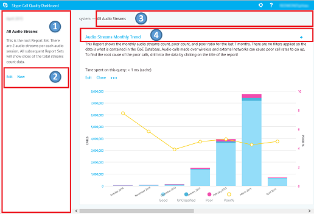

# 통화 품질 대시보드를 사용하여 비즈니스용 Skype 서버

**요약:** 통화 품질 대시보드를 사용하는 방법에 대해 자세히 알아보습니다. 통화 품질 대시보드는 통화 품질 대시보드를 위한 비즈니스용 Skype 서버.

CQD(통화 품질 대시보드)를 사용하면 IT Pro가 집계 데이터를 사용하여 사용자 그룹의 통계를 비교하여 추세 및 패턴을 식별하여 미디어 품질 문제를 만드는 문제를 식별할 수 있습니다. CQD는 개별 통화 문제를 해결하는 데 초점을 맞추는 것이 아니라 많은 사용자에게 적용되는 문제 및 솔루션을 식별하는 데 초점을 맞추고 있습니다.

## 통화 품질 대시보드 사용자 가이드

CQD는 QoE(QoE) 데이터를 기반으로 보고서를 신속하게 만들고 구성하기 위한 웹 포털입니다. CQD는 SSAS 큐브를 배포하여 QoE 메트릭 데이터베이스의 데이터를 집계하고 관리자가 보고서를 만들고 수정하거나 실시간으로 조사를 할 수 있습니다. 포털을 사용하여 Excel 직접 연결할 수 있는 반면 포털은 QoE 데이터와 관련된 여러 워크플로에 최적화되어 있습니다. 데이터에는 다음이 포함됩니다.

- 빠른 액세스를 위한 캐시된 보고서 데이터
- 정보 공유 및 게시를 위한 보고서 페이지에 대한 딥 링크
- 보고서 편집 및 만들기 및 보고서 설명에 대한 편집 가능한 메타데이터를 간소화합니다.

또한 CQD는 사용자가 사용자 지정 대시보드에서 사용할 큐브 데이터에 프로그래밍된 액세스 권한을 부여하는 웹 API를 노출합니다.

### 기능 개요

통화 품질 대시보드를 방문하면 다음 화면이 표시됩니다.

1. "요약 창"에서는 "보고서 집합"(오른쪽)에 대한 컨텍스트를 찾을 수 있습니다.
2. 요약 창 보고서에서 "편집"을 클릭하여 수준 속성(Y 축 높이 포함)을 설정할 수 있습니다.
3. 이동 경로는 보고서 집합 계층 구조 내에서 현재 위치를 식별하는 데 도움이 됩니다.
4. 하위 보고서가 있는 보고서는 파란색 링크와 함께 표시됩니다. 하위 보고서로 드릴다운하려면 링크를 클릭합니다.

세밀한 값을 표시하기 위해 마우스를 막대 차트 및 추세선 위에 놓습니다. 포커스가 있는 보고서에는 작업 메뉴 "편집", "복제", "삭제" 및 "다운로드"가 표시됩니다.

### 기본 보고서

통화 품질 대시보드 포털에 처음 액세스하면 기본 보고서 집합이 자동으로 만들어집니다. 이러한 보고서를 시스템 보고서라고도 합니다. 이러한 보고서를 자유롭게 수정하거나 삭제하거나 새 형제 및 하위 보고서를 만들어 확장할 수 있습니다.

최상위 수준에서 "Audio 스트림 monthly 추세" 보고서는 모든 오디오 스트림의 월별 추세를 보여 주며, 막대형 차트에서 막대 위에 마우스를 놓아 막대형 차트가 나타내는 데이터에 대한 보다 자세한 보기를 보여줄 수 있습니다. Audio 스트림 Monthly 추세 보고서의 제목을 클릭하여 보고서가 관리되는 통화와 관리되지 않는 통화로 분할되는 "관리되는 오디오 및 스트림" 보고서로 이동합니다. 관리되는 통화는 유선 연결을 통해 회사 방화벽 내부에서 걸은 호출입니다. 관리되지 않는 통화에는 회사 방화벽 외부에서 걸은 통화와 Wi-Fi를 통해 걸은 모든 통화가 포함됩니다.

다른 최상위 보고서를 "사용자가 보고한 통화 품질 등급 기록표"라고 합니다. 통화 품질 등급은 통화 비즈니스용 Skype 사용자가 통화 품질을 나타내기 위해 부여한 번호입니다. 평점 번호 범위는 1부터 5까지, 1은 최하위, 5는 최상입니다. 이 기록은 1개월 동안 등급이 나타났던 오디오 통화 수를 보여 주며,

보고서의 제목을 클릭하여 데이터에 대해 더 많은 필터가 있는 보고서로 이동합니다. 시스템 보고서에서 각 하위 보고서에는 상위 보고서에서 사용할 수 있는 데이터의 하위 집합이 표시됩니다. 문제 해결 모델은 간단합니다. 문제로 국한되는 데이터 또는 추세를 조사하여 문제 공간을 점차적으로 좁힐 수 있습니다. 하위 정보를 만드는 기능을 사용하면 특정 데이터 추세의 원인에 대한 추측을 조사할 수 있습니다.

### 보고서 만들기 및 편집

보고서의 작업 메뉴에서 "편집"을 클릭하여 보고서 편집기를 봐야 합니다. 각 보고서는 쿼리를 통해 큐브로 백업됩니다. 보고서는 쿼리에서 반환되는 데이터의 시각화입니다. 보고서 편집기를 사용하면 이러한 쿼리와 보고서의 표시 옵션을 편집할 수 있습니다. 보고서 편집기를 열면 다음이 표시됩니다.

1. 왼쪽 창에서 차원, 측정값 및 필터가 선택됩니다. 값을 제거할 수 있는 "x" 단추를 표시하기 위해 기존 값 중 하나 위에 마우스를 다. 제목 옆에 있는 "더하기" 단추를 클릭하여 새 차원, 측정값 또는 필터를 추가할 수 있는 대화 상자를  열 수 있습니다.
2. 차트 사용자 지정 옵션이 맨 위에 표시됩니다.
3. 보고서 미리 보기는 보고서 편집기에서 사용할 수 있습니다.
4. 아래쪽의 편집 상자를 사용하여 자세한 보고서 설명을 만들 수 있습니다.

### 테이블의 스파크라인

StartDate.Month를 차원으로 추가하고 데이터가 표 폼에서 추세로 렌더링될 때 표 셀 안에 막대형 차트와 스파크라인이 표시될 수 있습니다. 마우스 포인터를 막대형 차트와 스파크라인 위에 놓아 개별 개월의 값을 나타냅니다.

막대형 차트와 스파크라인을 표시하려면 보고서 편집기 맨 위에 있는 "스파크라인 표시" 확인란을 선택해야 합니다. 그러면 추세 옵션을 선택하고 월 아래로 이동하여 마지막 차원으로 이동하며, 월을 클릭하고 위쪽 및 아래쪽 화살표를 사용하여 StartDate.Month를 위쪽 또는 아래쪽으로 전환할 수도 있습니다.

### 설정

설정 메뉴에는 시스템 상태 및 정보 페이지와 같은 유용한 페이지에 대한 링크가 포함되어 있으며 대시보드의 오른쪽 위 모서리에 있습니다.

설명과 타임스탬프를 표시하는지 여부는 개별 사용자에 따라 결정하며, 이러한 설정은 개별 대시보드 버전에만 영향을 미치며 보고서 집합이나 다른 사용자에게 표시하는 내용은 수정하지 않습니다. 캐시를 지우면 모든 쿼리가 큐브에서 데이터를 다시 로드하는 동시에 기본값을 복원하면 사용자가 만들거나 수정한 모든 보고서가 삭제되고 시스템 보고서 집합이 다시 만들어지며 사용자가 처음 로그인할 때 사용자에게 표시됩니다.

사용자 대시보드 링크에는 사용자가 CQD의 다른 사용자를 보고 보고서를 검색할 수 있는 페이지가 표시됩니다. 보고서 집합을 공유하려면 URL 표시줄의 링크를 복사하여 다른 CQD 사용자와 공유합니다. 이 링크는 사용자 사용자 이름 아래에 있는 사용자 대시보드 링크 페이지에 다른 사용자가 볼 수 있는 링크와 동일합니다.

### 서브넷 정보 제공

서브넷과 건물 매핑 정보(예: 건물별 유선/무선 통화 품질)를 제공하기 위해 보관 데이터베이스에 사이트별 정보를 입력하면 추가 정보가 표시될 수 있습니다.

최소한 다음 표를 작성하여 이러한 보고서를 만들어야 합니다.

- CqdBuilding
- CqdNetwork

추가 필터링 및 드릴다운을 위해 CqdBuildingType 및 CqdBuildingOwnershipType 테이블에서 추가 정보를 제공하면 됩니다.

이러한 테이블에 사용되는 데이터는 다음과 같이 정의됩니다.

**CqdBuilding**

|열|데이터 형식|Allow Nulls?(Nulls 허용)|세부 정보|
|:-----|:-----|:-----|:-----|
|BuildingKey |int |아니요 |CqdBuilding 테이블의 기본 키입니다. |
|BuildingName |varchar(80) |아니요 |건물 이름입니다. |
|BuildingShortName |varchar(10) |아니요 |더 짧은 버전의 건물 이름입니다. |
|OwnershipTypeId |int |아니요 |외래 키는 CqdBuildingOwners 테이블의 항목 중 하나와 일치합니다. |
|BuildingTypeId |int |아니요 |외 다른 키는 CqdBuildingType 테이블의 항목 중 하나와 일치합니다. |
|위도 |float |예 |건물의 위도입니다. |
|Longitude |float |예 |건물의 지형입니다. |
|CityName |varchar(30) |예 |건물이 있는 도시 이름입니다. |
|ZipCode |varchar(25) |예 |건물이 있는 우편 번호입니다. |
|CountryShortCode |varchar(2) |예 |건물이 있는 국가에 대한 ISO 3166-1 alpha-2 코드입니다. |
|StateProvinceCode |varchar(3) |예 |건물이 있는 시/도의 세 글자 약어입니다. |
|InsideCorp |bit |예 |Bit는 건물이 회사 네트워크의 일부인지 여부를 나타냅니다. |
|BuildingOfficeType |nvarchar(150) |예 |사무실 유형에 대한 설명입니다. |
|지역 |varchar(25) |예 |건물이 있는 지역입니다. |

**CqdNetwork**

|열|데이터 형식|Allow Nulls?(Nulls 허용)|세부 정보|
|:-----|:-----|:-----|:-----|
|네트워크 |varchar(25) |아니요 |서브넷 주소입니다. |
|NetworkRange |tinyint |예 |서브넷 마스크입니다. |
|NetworkNameID |int |예 |선택적으로 CqdNetworkName 테이블의 행에 매핑됩니다. |
|BuildingKey |int |예 |외 다른 키는 CqdBuilding 테이블의 항목 중 하나와 일치합니다. |
|UpdatedDate |datetime |아니요 |항목이 마지막으로 업데이트된 날짜의 Datetime입니다. |

기본적으로 이 다음 표에는 하나의 항목(0, '알 수 없음')이 있습니다.

**CqdBuildingType**

|열|데이터 형식|Allow Nulls?(Nulls 허용)|세부 정보|
|:-----|:-----|:-----|:-----|
|BuildingTypeId |int |아니요 |CqdBuildingType 테이블의 기본 키입니다. |
|BuildingTypeDesc |char(18) |아니요 |유형 설명을 입력합니다. |

기본적으로 이 표에는 하나의 항목(0, '알 수 없음', 0, null)이 있습니다.

**CqdBuildingOwnershipType**

|열|데이터 형식|Allow Nulls?(Nulls 허용)|세부 정보|
|:-----|:-----|:-----|:-----|
|OwnershipTypeId |int |아니요 |CqdBuildingOwnershipType 테이블의 기본 키입니다. |
|OwnershipTypeDesc |varchar(25) |아니요 |소유권 유형 설명입니다. |
|LeaseInd |tinyint |예 |임대 건물을 식별하는 데 사용되는 CqdBuildingOwnershipType 테이블에서 다른 행을 참조하는 인덱스입니다. |
|소유자 |varchar(50) |예 |건물 소유자. |

기본적으로 이 표에는 하나의 항목(0, '알 수 없음', 0, null)이 있습니다.

**CqdBssid**

|열|데이터 형식|Allow Nulls?(Nulls 허용)|세부 정보|
|:-----|:-----|:-----|:-----|
|bss |nvarchar(50) |아니요 |CqdBssid 테이블의 기본 키입니다. WiFi 액세스 지점의 BSSID입니다. |
|ess |nvarchar(50) |예 |Wifi 액세스 지점 컨트롤러 정보입니다. |
|phy |nvarchar(50) |예 |Phy 정보. |
|ap |nvarchar(50) |예 |Wifi 액세스 지점 이름입니다. |
|건물 |nvarchar(500) |예 |WiFi 액세스 지점이 있는 건물 이름입니다. |

## CQD 스트림

CQD 스트림은 양호, 불량 또는 미분류로 간주됩니다. CQM 1.5에서는 이제 다음 CQD 정의를 사용합니다.

- 불량 스트림은 임계값을 초과하는 불량 통화 메트릭의 조합입니다.
- 통화의 한 스트림이 불량하면 두 통화 스트림 모두 불량 플래그가 지정됩니다. 회의에서 각 참가자는 고유한 통화로 계산됩니다. 다른 모든 참가자와 독립적으로 보고됩니다.
- 미분류 스트림은 품질 메트릭(즉, 가상 트랜잭션 또는 짧은 호출)이 없는 스트림입니다.
- 유효한 스트림 = 모바일 클라이언트가 아닌 클라이언트
- 분류자를 수정할 수 없습니다.

**불량 통화 정의/분류자**

|메트릭|임계값|
|:-----|:-----|
|DegradationAvg |1.0 이상(-1 네트워크 MOS) |
|RoundTrip |500보다  크다 |
|PacketLossRate |0.1 이상(10%) |
|JitterInterArrival |30보다  크다 |
|RatioConcealedSamplesAvg |0.07보다  크다 |

JPDR 정의 = 불량 통화 정의에서 RatioConcealedSamplesAvg를 푼 값

## 발신자/발신자 위치

CQD는 발신자/발신자 필드를 사용하지 않고 대신 "첫 번째" 및 "두 번째"를 사용합니다. 발신자 및 발신자 사이에 중간 단계가 있기 때문에 이 필드는 "첫 번째" 및 "두 번째"를 사용합니다.

 **첫 번째** 서버가 스트림에 관련된 경우 항상 서버 끝점(예: AV MCU 또는 중재 서버)이 됩니다.

 **초** 클라이언트 끝점이 항상 클라이언트 끝점이 될 Server-Server 있습니다.

**첫 번째 및 두 번째 분류의 예**

|끝점 1 UAType|끝점 2 UUAType|첫 번째|초|
|:-----|:-----|:-----|:-----|
|2(AVMCU) |4(비즈니스용 Skype) |끝점 1 |끝점 2 |
|2(AVMCU) |1(mMediationServer) |끝점 2 |끝점 1 |
|4(비즈니스용 Skype) |4(비즈니스용 Skype) |MediaLine의 발신자 |MMediaLine의 발신자 |

두 끝점이 같은 유형인 경우 CQD는 발신자 항목을 첫 번째와 두 번째로 합니다. 끝점 이름에 대한 자세한 내용은 이 블로그 [를 참조하세요](/archive/blogs/jenstr/call-quality-dashboard-tips-and-tricks).

## VPN에 대한 계정

VPN 솔루션에서 VPN 플래그를 정확하게 설정하는 것으로 알려진 경우 모두 설정됩니다. 그렇지 않으면 다음 방법 중 하나를 사용하십시오.

- VPN(기본 설정)이라는 네트워크 유형을 만든 다음 VPN 서브넷을 이 새 VPN NetworkType과 연결합니다.
- VPN이라는 건물을 만든 다음 이 건물에 VPN 서브넷을 연결합니다.

## 쿼리 기본

잘 구성되는 쿼리에는 다음 세 가지 매개 변수가 모두 포함됩니다.

- 측정
- 차원
- 필터

잘 작성된 쿼리의 예로는 "Building 6 [Filter]의 경우 서브넷 [측정]스트림 [측정]으로 나만 표시"가 있습니다.

## UNION은 무엇을 하나요?

Union을 사용하면 AND 연산자를 사용하여 조건을 필터링할 수 있습니다. 여러 필터 조건을 결합하여 OR 작업과 유사한 결과를 얻을 수 있는 시나리오가 있습니다.

예제: 건물에서 모든 스트림을 얻기 위해 UNION은 병합된 데이터 집합에 대한 고유한 보기를 제공합니다. UNION을 사용하려는 두 필터 조건의 UNION 필드에 공통 텍스트를 삽입합니다.

## 기본 보고서 분석

무선이 내부적으로 관리되는 경우 관리되는 버킷에서 무선 보고서를 다시 사용할 수 있습니다.

## 운영 프로세스

먼저 관리되는 관리되는 스트림 재구성합니다. 이 영역의 품질은 컨트롤 내에서 100% 하므로 가장 쉽게 수정해야 합니다.

### 관리되는 스트림

다음 순서로 관리되는 스트림을 검토하고 수정합니다.

1. Server-Server
2. Server-Wired-Inside
3. 유선 유선 내부

### 관리되지 않는 스트림

다음 순서로 관리되지 않는 스트림을 검토하고 수정합니다.

1. Server-Wifi-Inside
2. Server-Wired-Outside
3. Server-Wifi-Outside
4. 유선 외부-다이렉트
5. 유선 외부 릴레이
6. 기타 관리되지 않는