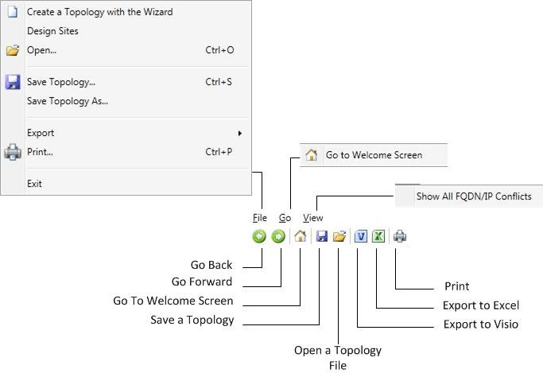

# 2015년 비즈니스용 Skype 서버 도구 탐색

도구 모음비즈니스용 Skype 서버 페이지별 단추 및 링크, 컨텍스트별 창을 조합하여 2015 계획 도구를 탐색합니다. 컨텍스트별 창에서는 특정 페이지의 선택 옵션과 관련된 계획 및 용량에 대한 디자인 정보를 제공합니다.

계획 도구를 시작할 때 디자이너는 먼저 **2015년 2015용** 계획 도구 비즈니스용 Skype 서버 표시됩니다.

시작 페이지에서 디자이너는 시작 **사이트** 또는 표시를 **선택합니다.**  자세한 내용은 [Create the initial topology design for 비즈니스용 Skype 서버 2015를 참조합니다.](create-the-initial-design.md)

계획 도구의 맨 위에는 자주 사용되는 기능에 쉽게 액세스할 수 있는 도구 모음이 있습니다. 이 도구 모음은 참조를 위해 여기에 표시되고 관련 항목에서 각 함수에 대해 설명할 것입니다.

계획 도구의 왼쪽에는 외부 링크 섹션이 있습니다. 디자이너는 이 섹션에서 계획 및 배포 정보와 기타 기술 리소스(예: 교육, 기술 블로그, 포럼 및 기타 다운로드 가능한 리소스)에 쉽게 액세스할 수 있습니다. 또한 외부 링크 섹션에는 비즈니스용 Skype 서버 2015 계획 도구 팀에 대한 피드백 링크가 있습니다.

상황에 맞는 작업 창은 계획 도구의 여러 페이지에 표시됩니다. 동작 창을 사용하면 디자이너가 토폴로지의 기본 섹션에 쉽게 액세스할 수 있습니다. 작업 창에서 사용할 수 있는 링크는 토폴로지의 세부 정보 수준에 따라 변경됩니다. 작업 창은 인터뷰 질문을 완료하고 토폴로지가 표시된 후에 사용할 수 있습니다. 작업 창에는 인터뷰 프로세스의 일부로 디자이너가 입력한 번호를 표시하는 개요 섹션이 있습니다. 이 개요의 문맥은 표시된 정보와 관련되어 있습니다.

또한, 동작 창 아래의 개요에는 하드웨어 정보도 표시됩니다. 하드웨어 구성에는 현재 토폴로지에서 권장되는 하드웨어 요구 사항 목록이 표시됩니다.

## 기타 참고 항목

[2015년 2015의 초기 토폴로지 디자인 비즈니스용 Skype 서버 만들기](create-the-initial-design.md)

[디자인 편집](/previous-versions/office/lync-server-2013/lync-server-2013-editing-the-design)

[관리자 보고서 검토](/previous-versions/office/lync-server-2013/lync-server-2013-reviewing-the-administrator-reports)