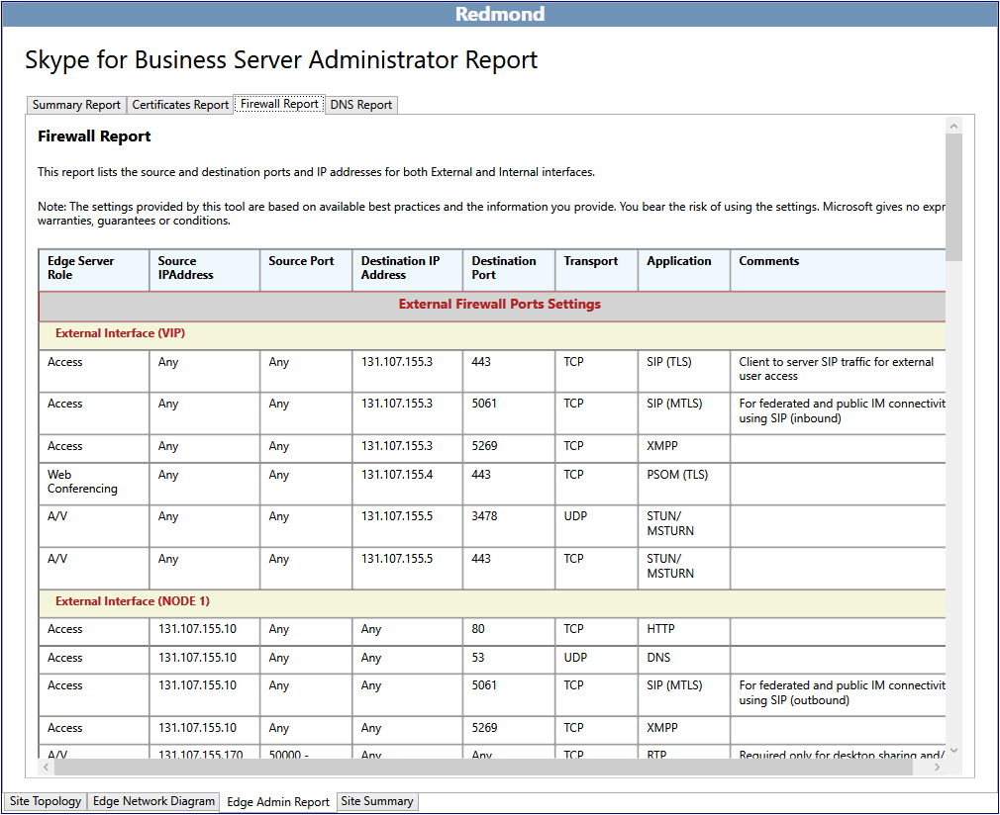

# 2015년 비즈니스용 Skype 서버 관리자 보고서 검토

관리자 보고서에는 배포 및 작업에 대한 자세한 정보가 포함됩니다. 보고서는 디자인 사이트 에 표시된 선택을 **기반으로 생성됩니다.** 디자이너는 네트워크 다이어그램을 편집하고 서버, 풀 및 부하 분산 장치에 대해 전체 IP 주소 및 FQDN(정규화된 도메인 이름)을 정의하여 관리자 보고서에 값을 더 추가할 수 있습니다.

관리자 보고서 기능을 사용하면 다음을 할 수 있습니다.

- [요약 보고서 검토](review-the-administrator-reports.md#Summary_report)

- [인증서 보고서 검토](review-the-administrator-reports.md#Certificates_Report)

- [방화벽 보고서 검토](review-the-administrator-reports.md#Firewall_report)

- [DNS 보고서 검토](review-the-administrator-reports.md#DNS_Report)

## 요약 보고서 검토

비즈니스용 Skype 관리자 보고서는 디자인을 자세히 문서화하는 네 가지 중요한 보고서 중 첫 번째 보고서입니다. 이 보고서의 정보와 다른 세 개의 관련 보고서는 정보 기술 보고서에 Teams.

요약 보고서에는 에지 네트워크와 관련된 일반 구성 정보가 나열됩니다. 위치, FQDN(FQDN) 및 IP 주소, 네트워크 유형 및 특정 역할과 관련한 설명이 문서화되어 있습니다.

인프라를 배포, 관리 및 유지 관리할 디자이너와 각 팀은 요약 보고서에서 정확성을 검토하고 오류가 최소한 있는지를 검토해야 합니다.

자세한 보고서도 볼 수 있습니다.

- 인증서 보고서

- 방화벽 보고서

- DNS 보고서

## 인증서 보고서 검토

인증서 보고서에는 권장되는 2015 배포에 필요한 모든 인증서가 비즈니스용 Skype 서버 포함되어 있습니다. 계획 도구는 입력된 주체 이름 및 주체 대체 이름을 계정으로 사용합니다. 편집되지 않은 남아 있는 기본 텍스트는 인증서 요청 및 발급을 담당하는 팀에 잠재적인 과제를 나타내는 것일 수 있습니다. 인증서 정보는 일반적으로 인증서를 발급할 수 있는 위치에 대한 정보도 포함합니다. 인프라에 내부 PKI(공개 키 인프라)가 없는 경우에는 공용 인증서 공급자를 통해 모든 인증서를 요청할 수 있습니다. 보고서의 EKU(확장된 키 사용) 및 할당 대상 필드는 각 인증서의 용도와 위치를 이해하는 데 매우 유용합니다.

배포에서 각 인증서의 사용 및 용도를 신중하게 검토하고 이해해야 합니다. 인증서의 작동에 대해 궁금한 의문이 있는 경우 어떤 서버나 서비스가 어떤 서버나 서비스를 사용하게 될지 결정하십시오. 비즈니스용 Skype 서버 2015의 인증서는 두 가지 주요 목적으로 사용됩니다.

- MTLS(상호 전송 계층 보안) - 통신에 관련된 컴퓨터가 각각 다른 컴퓨터에 자신의 ID를 증명하는 인증서를 제공합니다. 이를 서버 인증(server authentication)라고 합니다. 각 컴퓨터가 다른 컴퓨터의 ID를 신뢰할 때까지 통신을 시작할 수 없습니다.

- 암호화 - 암호화(Secure Sockets Layer 또는 SSL, 전송 계층 보안 또는 TLS)는 통신을 보호하고, 개인 정보를 보호하고, 신뢰할 수 있는 통신 및 공동 작업 시스템을 만드는 데 중요한 수단입니다.

## 방화벽 보고서 검토

비즈니스용 Skype 서버 2015에는 복잡한 방화벽 규칙 집합이 있습니다. 계획 도구는 디자이너의 입력 기준에 따라 모든 방화벽 요구 사항을 자세히 정의하는 보고서를 생성하여 이러한 복잡성을 줄입니다. IT 방화벽 관리자는 이 보고서를 사용하여 필요한 규칙을 구성 및 정의할 수 있습니다.

방화벽 관리의 관점에서 볼 때 보고서를 주의 깊게 검토하여 방화벽 규칙 종료와 충돌하지 않는지, 위반될 수 있는 정책이나 절차가 없는지 검토해야 합니다.

## DNS 보고서 검토

관리자 보고서의 일부인 DNS 보고서에서는 내부, 경계 및 외부 네트워크에서 DNS(Domain Name System)에 대한 권장 항목 및 알려진 모든 항목을 자세히 제공합니다. 디자이너가 네트워크 다이어그램 편집을 완료하고 모든 IP 주소와 FQDNS(정품 도메인 이름)가 프로덕션 값에 정의되어 있는 경우 DNS 보고서는 훌륭한 구성 리소스를 제공합니다. 이 보고서는 작업 문제 해결 문서로도 사용할 수 있습니다.

배포 중에 문제가 발생하거나 문제 해결 세션이 복잡해질 수 있는 오류가 없는지 DNS 관리 팀에서 DNS 보고서를 철저하게 검토해야 합니다.

## 참고 항목

[관리자 보고서 검토](/previous-versions/office/lync-server-2013/lync-server-2013-reviewing-the-administrator-reports)