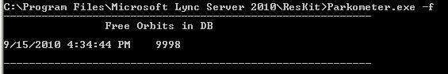
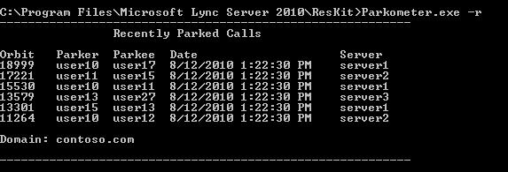
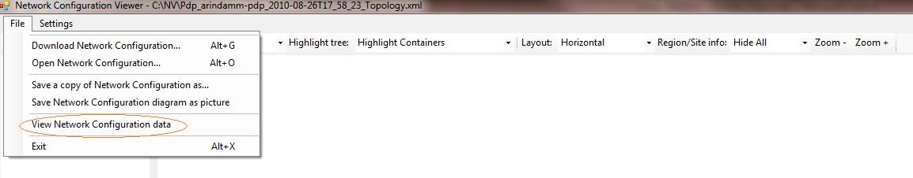
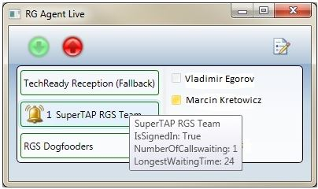

# <a name="skype-for-business-server-2015-resource-kit-tools-documentation"></a>비즈니스용 Skype 서버 2015 리소스 키트 도구 설명서

이 항목에서는 각 도구의 목적과 사용 예를 포함하여 비즈니스용 Skype 서버 2015 리소스 키트의 도구에 대해 설명합니다. 비즈니스용 Skype 서버 2015 리소스 키트를 사용하면 비즈니스용 Skype Server 2015를 배포하고 관리하는 IT 관리자가 일상적인 작업을 보다 쉽게 수행할 수 있습니다. 예를 들어 **웹 Conf 데이터** 도구를 사용하면 온라인 모임 중에 사용자가 업로드한 데이터를 쉽게 제어할 수 있습니다. **SEFAUtil** 도구를 사용하여 사용자에 대해 위임 전화 전달 및 응답을 설정할 수 있습니다. IT 관리자가 이러한 도구를 사용하여 비즈니스용 Skype 서버 2015를 보다 효과적으로 관리하는 것이 좋습니다.

## <a name="installation-of-the-resource-kit-tools"></a>리소스 키트 도구 설치

비즈니스용 Skype 서버 2015 리소스 키트를 설치하려면 다운로드 [OCSReskit.msi](https://www.microsoft.com/download/details.aspx?id=52631) 다운로드하세요.

간단한 **OCSResKit.msi** 실행합니다. .msi는 **%Program Files%\Skype for Business Server 2015\ResKit** 경로에 모든 도구를 설치합니다. 자체 포함 실행 파일인 도구는 이 폴더에 있습니다. 또한 지원 파일이 있는 도구는 자체 하위 폴더에 있습니다.

## <a name="supported-environments"></a>지원되는 환경

비즈니스용 Skype 서버 2015 리소스 키트는 비즈니스용 Skype 서버 2015를 실행하기 위해 사용되는 비즈니스용 Skype 서버 2015에 필요한 사양을 충족하는 서버에 설치해야 합니다.

## <a name="resource-kit-tools-overview"></a>리소스 키트 도구 개요

다음은 비즈니스용 Skype 서버 2015 리소스 키트에 제공되는 도구 목록입니다. 다음 섹션에서는 요구 사항 및 예제 사용법을 포함하여 각 도구에 대한 설명을 제공합니다.

- [ABSConfig](resource-kit-tools.md#ABSConfig)

- [대역폭 정책 서비스 모니터](resource-kit-tools.md#bpsm)

- [대역폭 사용률 분석기](resource-kit-tools.md#bua)

- [Call Parkometer](resource-kit-tools.md#callpark)

- [DBAnalyze](resource-kit-tools.md#dba)

- [저장소 서비스 데이터 가져오기](resource-kit-tools.md#Issd)

- [LCSSync](resource-kit-tools.md#LCSSync)

- [Lookup User Console](resource-kit-tools.md#LUC)

- [MsTurnPing](resource-kit-tools.md#MsTurnPing)

- [네트워크 구성 뷰어](resource-kit-tools.md#NCV)

- [응답 그룹 에이전트 Live](resource-kit-tools.md#RGAL)

- [SEFAUtil](resource-kit-tools.md#SEFAUtil)

- [SYSPrep.ps1](resource-kit-tools.md#SYSPrep)

- [미지정 번호 공지 마이그레이션](resource-kit-tools.md#UNAM)

- [웹 Conf 데이터](resource-kit-tools.md#WebConfData)

## <a name="absconfig"></a>ABSConfig
<a name="ABSConfig"> </a>

ABSConfig(주소 기록 서비스 구성 도구)는 관리자가 비즈니스용 Skype 서버 2015에서 주소부 서비스 구성을 사용자 지정하는 데 도움이 되는 관리 도구입니다. 또한 이 도구를 사용하면 비즈니스용 Skype 서버 2015 관리자가 기본 주소 기록 서비스 설정을 복원할 수 있습니다.

### <a name="description"></a>설명

ABSConfig는 관리자가 주소부 서비스와 관련된 Active Directory 도메인 서비스 특성을 구성할 수 있도록 하는 그래픽 사용자 인터페이스 응용 프로그램입니다.

도구의 주요 시나리오는 다음과 같습니다.

- 관리자가 Active Directory 도메인 서비스의 특성을 비즈니스용 Skype 서버 2015의 특성에 매핑할 수 있도록 합니다.

- 관리자가 주소부 서비스 파일에 포함되거나 제외될 Active Directory 도메인 서비스 특성을 지정할 수 있도록 합니다.

- 관리자가 기본 주소장 서비스 설정을 복원할 수 있도록 합니다.

ABSConfig 도구는 이 파일을 사용하여 시작할 ABSConfig.exe 있습니다. 도구가 특성 구성 **탭으로 열립니다.** 이 표에는 Active Directory 도메인 서비스 특성을 비즈니스용 Skype 서버 2015의 특성 필드에 매핑하고 특정 특성 필터에 따라 주소부 서비스 파일에 포함하거나 제외할 사용자를 지정하는 옵션이 있습니다. 또한 주소부 파일에 포함될 전화 번호 값을 사용자 지정하는 옵션도 있습니다. 기본값 **복원 옵션을** 사용하면 관리자가 주소 책 서비스 설정을 기본값으로 복원할 수 있습니다.

> [!NOTE]
> AD 특성을 다른 OC 필드 이름에 다시 매핑하면 주소 책 파일 다운로드에만 작동하며 주소부 웹 쿼리에서 지원되지 않습니다.

### <a name="output"></a>출력

ABSConfig는 주소부 서비스 구성을 데이터베이스에 저장합니다.

```console
Path: %ProgramFiles%\Skype for Business Server 2015\Reskit
```

### <a name="purpose"></a>용도

ABSConfig는 비즈니스용 Skype 서버 2015 주소 기록 서비스를 빠르고 쉽게 사용자 지정할 수 있는 방법을 제공합니다.

### <a name="requirements"></a>요구 사항

#### <a name="computer"></a>컴퓨터

ABSConfig는 비즈니스용 Skype 서버 2015가 설치된 도메인에 가입된 컴퓨터에서만 실행할 수 있습니다. 비즈니스용 Skype 서버 2015 Enterprise Edition의 경우 설치 중에 주소부 서비스를 사용하도록 설정된 모든 프런트 엔드 서버에서 이 도구를 실행할 수 있습니다.

#### <a name="network"></a>네트워크

컴퓨터가 프런트 엔드 풀 및 백 엔드 데이터베이스에 연결할 수 있습니다.

#### <a name="software"></a>소프트웨어

ABSConfig 도구를 실행하기 전에 다음 소프트웨어 구성 요소를 설치해야 합니다.

- Business Server 2015용 Skype

#### <a name="users"></a>사용자

비즈니스용 Skype 서버 2015 배포를 업데이트하는 데 필요한 권한이 있는 관리자

### <a name="examples"></a>예

ABSConfig는 명령 프롬프트에ABSConfig.exe **입력하여** 시작할 수 있습니다. 아래는 ABSConfig 도구 사용자 인터페이스입니다.


### <a name="summary"></a>요약

ABSConfig 도구는 관리자에게 비즈니스용 Skype 서버 2015 주소 예약 서비스를 사용자 지정하는 빠르고 쉬운 도구를 제공합니다.

## <a name="bandwidth-policy-service-monitor"></a>대역폭 정책 서비스 모니터
<a name="bpsm"> </a>

대역폭 정책 서비스 모니터 도구는 관리자가 다음 목록을 볼 수 있도록 합니다.

1. 토폴로지에서 구성된 모든 비즈니스용 Skype 서버 2015 대역폭 정책 서비스(인증 및 핵심)

2. 각 서비스가 다른 대역폭 정책 서비스 및 에지 서버에 대해 설정하는 연결

3. 네트워크 구성 문서에 구성된 모든 링크 및 각 대역폭 정책 서비스에서 보고한 실시간 대역폭 사용량

### <a name="description"></a>설명

대역폭 정책 서비스 모니터 도구는 GUI 기반 응용 프로그램으로 구현됩니다. 관리자는 이 도구를 실행하여 도구를 PDPMonUI.exe.

도구가 시작되면 토폴로지에서 대역폭 정책 서비스 목록을 검색하려고 시도합니다. 초기 업데이트가 완료되면 창 왼쪽 창에 속한 클러스터로 그룹화되는 서비스 목록이 채워지게 됩니다.

관리자가 특정 대역폭 정책 서비스를 선택하면 오른쪽 창에 해당 특정 서비스에 대한 정보가 표시됩니다. 이 창에는 정보를 표시하는 두 개의 기본 탭도 있습니다.

#### <a name="machine-info-tab"></a>컴퓨터 정보 탭

컴퓨터 **정보** 탭에는 선택한 대역폭 정책 서비스의 세부 정보와 선택한 대역폭 정책 서비스에서 다른 서비스에 대해 설정한 모든 연결의 목록과 상태가 표시됩니다.

#### <a name="topology-info-tab"></a>토폴로지 정보 탭

**토폴로지 정보** 탭에는 네트워크 구성 설정에 구성된 모든 링크 목록이 표시됩니다. 각 링크에 대해 오디오 및 비디오 대역폭 용량이 표시됩니다. 또한 현재 사용 중인 대역폭이 Kbps 및 용량의 백분율로 표시됩니다. 이 도구는 색 코딩을 사용하여 사용률이 용량에 가까운 링크를 강조합니다. 이를 통해 관리자는 이러한 링크를 빠르게 격리할 수 있습니다.

> [!NOTE]
>  대역폭 정책 서비스 모니터 도구가 구성된 대역폭 정책 서비스에 연결할 때 오류가 발생하면  컴퓨터 정보  및 토폴로지 정보 탭의 정보가 채워지지 않습니다. 그러나 도구가 처음에는 연결되지만 나중에 서비스에 대한 연결이 끊어지는 것일 수 있습니다. 이러한 경우 관리자에게는 기한이 지난 정보가 표시될 수 있습니다. 각 탭에는 특정 대역폭 정책 서비스에 대해 데이터가 마지막으로 업데이트된 시간을 관리자가 볼 수 있는 마지막 업데이트 타임스탬프가 있습니다. 

### <a name="output"></a>출력

명령줄 출력이 없습니다. 프로그램 출력은 기본 GUI(그래픽 사용자 인터페이스)에 포함되어 있습니다.

### <a name="purpose"></a>용도

대역폭 정책 서비스 모니터 도구의 목적은 관리자가 토폴로지에서 정의된 각 대역폭 정책 서비스의 상태를 표시하도록 허용하는 것입니다. 또한 관리자는 네트워크 구성 문서에 정의된 모든 링크에 대한 실시간 대역폭 사용량을 볼 수 있습니다.

### <a name="requirements"></a>요구 사항

대역폭 정책 서비스 모니터 도구는 비즈니스용 Skype 서버 토폴로지의 일부인 컴퓨터에서 실행해야 합니다.

### <a name="summary"></a>요약

대역폭 정책 서비스 모니터 도구는 관리자가 토폴로지의 모든 대역폭 정책 서비스의 상태를 검사할 수 있도록 하는 중요한 리소스가 될 수 있으며, 보다 중요한 점은 네트워크 구성 설정에 정의된 링크에 대한 실시간 대역폭 사용률을 얻을 수 있습니다.

## <a name="bandwidth-utilization-analyzer"></a>대역폭 사용률 분석기
<a name="bua"> </a>

대역폭 사용률 분석기는 엔터프라이즈 네트워크의 WAN 링크를 통해 UC 끝점에서 대역폭 소비의 다양한 보기에 대한 보고서를 만드는 도구입니다. 이러한 보고서를 사용하여 현재 대역폭 소비 패턴을 이해하고 대역폭 용량 계획을 지원할 수 있습니다.

### <a name="description"></a>설명

대역폭 사용률 분석기는 GUI 기반 응용 프로그램으로 구현됩니다. 이 도구는 네트워크 전체에서 오디오 사용률에 대한 보고서를 생성하며 용량 계획에 도움이 됩니다. 또한 다양한 링크에 할당된 대역폭 용량도 이 작업을 진행합니다.

### <a name="output"></a>출력

대역폭 사용률 분석기는 시스템에 구성된 모든 WAN 링크의 오디오에 대한 대역폭 용량 및 사용률의 그래픽 al 그림을 제공합니다.

### <a name="purpose"></a>용도

음성 및 비디오 배포에서는 엔터프라이즈 네트워크를 통해 미디어 트래픽의 대역폭 사용률 추세를 모니터링하고 이해하는 것이 중요합니다. 대역폭 사용률 분석기 도구를 사용하면 관리자가 이를 달성할 수 있습니다. 이 도구는 다음을 실행합니다.

- 네트워크에서 오디오 사용률에 대한 특정 보고서를 생성합니다.

- 다양한 링크에 할당된 대역폭 용량에 대한 보다 효과적인 용량 계획 및 이행에 도움이 됩니다.

대역폭 사용률 분석기는 대역폭 용량 및 사용률 보고서의 그래픽 그림을 생성할 수 있습니다. 이러한 두 가지는 다음과 같습니다.

- 엔터프라이즈 네트워크의 모든 WAN 링크

- 선택한 WAN 링크로 필터링

- 링크 용량을 초과하는 WAN 링크로 필터링

- 프로비전된 대역폭을 활용하지 않은 WAN 링크로 필터링

- 중요한 수준에 도달한 WAN 링크(WAN 링크 대역폭 용량의 90%보다 큰 대역폭 사용률)를 통해 필터링합니다.

- WAN 링크 유형(네트워크 사이트 링크, 사이트 간 링크 및 사이트 내의 링크)을 통해 필터링됩니다.

- 네트워크 지역별로 필터링

#### <a name="applications"></a>응용 프로그램

대역폭 사용률 분석기에는 다음과 같은 두 가지 응용 프로그램(도구)이 있습니다.

- **WanLinkLogCollector.exe** 이 도구를 사용하면 사용자가 필요한 정보를 입력할 수 있습니다.

- **BandwidthUtilizationAnalyzer.xlsm** Microsoft Excel 스프레드시트 소프트웨어 보고서는 보고서에서 자동으로 WanLinkLogCollector.exe. 이 응용 프로그램을 사용하면 이 문서의 부분에 나와 있는 것 같이 보고서에 필터를 적용할 수 있습니다.

#### <a name="phases-of-using-bandwidth-utilization-analyzer"></a>대역폭 사용률 분석기 사용 단계

대역폭 사용률 분석기를 사용하는 경우 다음 두 단계가 있습니다.

- 로그를 수집합니다. 이 로그는 로그를 사용하여 WanLinkLogCollector.exe

- m을 사용하여 수행되는 보고서 사용자 BandwidthUtilizationAnalyzer.xls사용자 지정

    > [!IMPORTANT]
    > 최종 사용자가 BandwidthUtilizationAnalyzer.xls수동으로 시작하지 않는 것이 좋습니다.

#### <a name="starting-bandwidth-utilization-analyzer"></a>대역폭 사용률 분석기 시작

명령 WanLinkLogCollector.exe 또는 Windows 탐색기를 사용하여 시작

 **사용 WanLinkLogCollector.exe**

다음 세 단계에 따라 다음을 WanLinkLogCollector.exe.

1. **타임라인 기록** 보고서 생성에 필요한 시간 표시 막대 제공

2. **파일렉터리 지정** 파일 위치 정보 제공

3. **로그 수집 및 보고서 뷰어 시작** 명령을 실행하여 보고서 생성

#### <a name="step-1---log-the-timeline"></a>1단계 - 타임라인 기록

시간 표시 막대를 로깅하면 도구 사용자가 아래 그림과 같이 다음을 지정할 수 있습니다.

1. **시작 날짜** 보고서가 생성될 시간 표시 막대의 시작 날짜입니다. 예를 들어 2010년 8월 1일입니다.

2. **종료 날짜** 보고서가 생성될 시간 표시 막대의 종료 날짜입니다. 예: 2010년 9월 30일

     

#### <a name="step-2---specify-the-file-directories"></a>2단계 - 파일렉터리 지정

다음과 같은 파일렉터리가 표시된 경우 사용자가 지정할 수 있습니다.

- **서버 로그 파일 위치** 대역폭 정책 서버 로그가 저장되는 폴더 위치입니다. 일반적으로 FE \<fileserver\> \\ \> \<\PDP를 선택할 수 있습니다.

- **임시 파일 저장소 위치** 보고서를 생성하는 동안 중간 파일이 저장되는 임시 파일 위치입니다.

    

    > [!NOTE]
    > 서버 로그 및 임시 파일 저장소 폴더에 대한 충분한 파일 액세스 권한이 도구 사용자에게 제공되는지 확인합니다.

#### <a name="step-3---collect-the-logs-and-start-the-report-viewer"></a>3단계 - 로그 수집 및 보고서 뷰어 시작

로그를 수집하고 보고서 뷰어를 시작하려면 아래와 같이 **실행을** 클릭합니다. 이 단계에서는 필요한 데이터를 수집합니다.


입력 유효성 검사가 성공하면 아래에 표시된 메시지가 표시됩니다.


**확인** 을 클릭합니다. BandwidthUtilizationAnalyzer.xlsm이 자동으로 시작됩니다. 메시지 상자의 지침을 따릅니다. 자세한 내용은 다음 섹션에서 BandwidthUtilizationAnalyzer.xls **m** 사용을 참조하십시오.


### <a name="using-bandwidthutilizationanalyzerxlsm"></a>M BandwidthUtilizationAnalyzer.xls사용

1. m이 BandwidthUtilizationAnalyzer.xls시작하면 아래와 같이 **새로** 고침을 클릭합니다.

     

2. 파일 폴더가 열리면 consolidated.csv 상자에 지정된 위치에서 다음을 선택합니다. 또한 **C:\Temp 위치도 표시됩니다.**

     

3. **가져오기** 를 클릭합니다.

4. 그래픽 그림이 자동으로 생성됩니다. 백그라운드에서 작업 포인터가 사라질 때 사용할 수 있습니다.

     

#### <a name="applying-filters-to-the-report-view"></a>보고서 보기에 필터 적용

아래와 같이 보고서 보기에 적용할 수 있는 필터는 다음과 같습니다.


1. **이름** WAN 링크로 필터링합니다(필터가 그래프의 오른쪽에 있습니다). 이 연결 형식은 다음과 같습니다. 세로(파랑) 상자를 참조합니다.

   - **S 사이트** 네트워크 사이트에서 네트워크 지역으로의 WAN 링크

   - **IS Inter-Site** 두 네트워크 사이트 간의 WAN 링크

   - **R 지역 간** 두 네트워크 지역 간의 WAN 링크

2. **제한 초과** 대역폭 사용률이 대역폭 용량보다 큰 WAN 링크로 필터링

3. **위험 수준** 대역폭 사용률이 대역폭 용량보다 90% 이상인 WAN 링크로 필터링

4. **사용률이 희미해진 경우** 대역폭 사용률이 대역폭 용량의 25% 미만인 WAN 링크로 필터링합니다.

5. **링크 유형** 다음 WAN 링크 유형을 사용하여 필터링합니다.

   - **네트워크 사이트** 유형

   - **사이트 간** 유형

   - **지역 간 링크** 유형

6. **지역** 네트워크 지역별로 필터링

다음 그림에서는 앞에서 설명한 필터를 보여 주었다.

이름으로 **필터링합니다.** 그래프에 표시해야 하는 링크 목록을 선택합니다.


제한 **초과로 필터링합니다.** **True를** 선택하여 필터를 적용합니다.


위험 **수준으로 필터링합니다.** **True를** 선택하여 필터를 적용합니다.


**사용률이 언더(Under)로 필터링합니다.** **True를** 선택하여 필터를 적용합니다.


링크 **유형별로 필터링합니다.** 표시해야 하는 형식을 선택합니다.


지역별로 **필터링합니다.** 링크를 표시해야 하는 지역 목록을 선택합니다.


### <a name="requirements"></a>요구 사항

- .NET Framework 3.5

- Microsoft Excel 2010 또는 Excel 2007

### <a name="summary"></a>요약

대역폭 사용률 분석기는 네트워크를 통해 UC 트래픽에 대한 오디오 대역폭 사용률을 그리기 위해 사용됩니다. 이 도구를 사용하여 네트워크의 비디오 대역폭 사용률도 보고할 수 있습니다.

## <a name="call-parkometer"></a>Call Parkometer
<a name="callpark"> </a>

Call Parkometer는 통화 파크 궤도 데이터베이스에 쉽게 액세스할 수 있도록 하는 명령줄 응용 프로그램입니다.

### <a name="description"></a>설명

통화 파기계는 현재 사용 중인 통화를 추적하는 도구입니다. 또한 궤도 및 CPS(통화 파크 서버) 사용에 대한 통계도 수집합니다. 이 명령줄 도구는 로컬 또는 원격으로 연결된 컴퓨터에서 CPS SQL Server 액세스 권한을 모두 제공합니다.

모든 옵션은 함께 사용할 수 없습니다. 명령줄 구문은 다음과 같습니다.

- **-o** 매개 변수 - 이 풀에 대해 구성된 모든 궤도 범위를 나열합니다.

- **-n** 매개 변수 - 이 풀에서 현재 사용되는 모든 궤도 목록을 제공합니다. 표시되는 정보는 다음과 같습니다.

  - 파기 및 파커의 SIP URI(Uniform Resource Identifier)입니다.

  - 통화가 진행된 CPS의 호스트 이름입니다.

  - 통화가 파기된 시간의 타임스탬프입니다.

- **-f** 매개 변수 - 풀의 현재 사용 가능한 궤도 수를 나열합니다.

- **-r \<n\>** 매개 변수-마지막에 통화를 \<n\> 보냈을 수 있습니다. 표시되는 정보는 다음과 같습니다.

  - Parkee SIP URI.

  - 파커 SIP URI입니다.

  - 통화가 진행된 CPS의 호스트 이름입니다.

  - 통화를 검색하거나 삭제한 시간 스탬프입니다.

- **-t \<n\>** 매개 변수 - 할당된 궤도 번호의 임의성을 표시하기 위해 데이터베이스에서 궤도의 보존을 테스트합니다.

### <a name="output"></a>출력

명령 프롬프트에 지정된 입력 매개 변수에 따라 Call Parkometer는 다음 출력을 나타냅니다.

- 이 풀에 대해 구성된 모든 궤도 범위

- 현재 통화가 보류 중입니다.

- 무료(사용 가능한) 궤도 수

- 최근에 통화가 보게 된 경우

- 유니폼 및 임의 궤도 값 테스트용 예약된 궤도

### <a name="purpose"></a>용도

CPS 도구의 목적은 CPS 데이터베이스에 대한 명령줄 액세스를 제공하는 것입니다. 관리자는 CPS 사용을 보고 풀에 할당된 궤도 수를 확인할 수 있습니다.

### <a name="requirements"></a>요구 사항

이 도구를 CPS를 실행하는 동일한 컴퓨터에서 실행되는 경우 요구 사항이 없습니다. 이 도구를 원격 컴퓨터에서 실행하면 원격 액세스를 허용하도록 SQL Server 비즈니스용 Skype 서버 2015에서 사용하는 데이터베이스를 구성해야 합니다. 풀의 연결에 연결하려면 통화 SQL Server 연결 문자열을 사용하여 통화 파크로를 구성해야 SQL Server. 이 SQL Server 연결 문자열은 다음의 구성 파일에 **정의되어parkometer.exe.config.** 이 디렉터리는 서버가 있는 동일한 디렉터리에 parkometer.exe 있어야 합니다. 다음 XML 파일은 다음 예제와 parkometer.exe.config. 구성해야 하는 매개 변수는 사용자 이름(예: mydomain\Administrator), 암호(예: mypassword) 및 호스트 이름(예: myserver)입니다.

```xml
<?xml version="1.0" encoding="utf-8" ?>
<configuration>
  <appSettings>
   <add key="SQL" value="server=myserver\RTC;
database=cpsdyn;
User Id=mydomain\Administrator;
Password=mypassword.;
Integrated Security=false;"/>
  </appSettings>
</configuration>
```

### <a name="examples"></a>예

배포된 궤도 범위: -o 매개 변수는 표시된 것 같이 이 풀에 대해 구성된 모든 궤도 범위를 나열합니다.


현재 사용 중인 통화: -n 매개 변수는 표시된 것 같이 이 풀에서 현재 사용된 모든 파행을 나열합니다.


무료 궤도 수: -f 매개 변수는 다음과 같이 풀에서 현재 사용 가능한 궤도의 수를 나열합니다.



최근에 통화를 보냈을 때: -r 매개 변수에 표시된 마지막 \<n\> \<n\> 통화가 나열됩니다.



테스트 궤도 예약: -t 매개 변수 테스트에서 표시된 것 같이 데이터베이스에 궤도 예약 \<n\>


### <a name="summary"></a>요약

통화 파크로는 통화 파크 서버에 대한 자세한 정보를 제공하는 명령줄 도구입니다.

## <a name="dbanalyze"></a>DBAnalyze
<a name="dba"> </a>

### <a name="description"></a>설명

DBAnalyze는 관리자가 비즈니스용 Skype 서버 2015 데이터베이스에 대한 분석 보고서를 수집하는 데 도움이 되는 명령줄 도구입니다. DBAnalyze에는 진단, 사용자 데이터, 회의, MUS 및 디스크 조각화 모드가 있습니다.

- **진단 모드** 테이블에 대한 정보(레코드 수, 조각화, 데이터 크기 및 인덱스 크기), 데이터 및 로그 파일 크기, 마지막 백업 시간, Microsoft Office Communications Server를 실행하는 서버 간 연락처 배포, 평균 사용 권한 수, 연락처, 컨테이너, 구독, 게시, 사용자당 끝점, 부적절한 홈 사용자, 라우팅할 수 없는 사용자, 사용자당 구성되는 평균 회의 수, 예약된 회의, 활성 회의 및 데이터베이스 버전.

    > [!NOTE]
    > 진단 모드를 실행하면 서버 성능에 영향을 줄 수 있습니다.

- **사용자 데이터 모드** 지정된 사용자 또는 해당 사용자가 연락처 및 사용 권한 목록에 있는 사용자에 대한 연락처, 컨테이너, 구독, 게시, 사용 권한 및 연락처 그룹 데이터를 보고합니다. 또한 이 모드는 사용자가 구성하거나 초대하는 회의에 대한 요약 데이터를 보고합니다.

- **회의 모드** 회의의 모든 일정 시간 세부 정보, 초대자 목록, 회의에 허용되는 미디어 유형 목록, 활성 MUS(다중점 제어 장치), 활성 참가자 목록 및 각 참가자의 신호 상태를 포함하여 특정 회의에 대한 자세한 데이터를 보고합니다.

- **모임 ID 디코드** **/pstnid** 스위치에 지정되어 있지만 자세한 정보를 위해 백 엔드에 연결하지 않는 PSTN(Public Switched Telephone Network) 모임 ID를 디코딩합니다.

- **회의 해결** **/pstnid** 스위치로 지정된 PSTN 모임 ID를 디코딩하고 ID로 표시된 회의에 대한 정보를 나타냅니다.

- **MCUS 모드** 풀의 각 MCU에 대한 ID, 미디어 유형, URL, 하트비트 상태, 회의 부하 및 참가자 부하를 보고합니다.

- **디스크 조각화 모드** 모든 디스크의 조각화 상태를 표시됩니다.

이 도구를 사용하여 다양한 문제를 진단하거나 관리자의 용량 계획을 지원할 수 있습니다. 예를 들어 서버 A에 있는 대부분의 사용자가 서버 B에 있는 사용자를 연락처로 선택하면 관리자는 서버 A의 사용자를 서버 B로 이동하여 서버 간 트래픽을 줄일 수 있습니다.

### <a name="output"></a>출력

이 도구는 비즈니스용 Skype 서버 2015 데이터베이스에 대한 미리 정의한 보고서를 출력합니다. **경로**: %ProgramFiles%\Skype for Business Server 2015\Reskit

### <a name="purpose"></a>용도

설치 Dbanalyze.exe 로컬 폴더에 복사한 다음 도구를 실행합니다. 이 도구를 사용하려면 명령줄에서 다음 명령을 실행합니다. `dbanalyze.exe [/v] [/report:value] [/sqlserver:value] [/user:user@domain.com] [/conf:value][/pstnid:Value] [/maxcontacts:value]` 명령줄 옵션에 대한 설명은 다음과 같습니다.


### <a name="requirements"></a>요구 사항

 **컴퓨터** DBAnalyze는 비즈니스용 Skype 서버 2015가 설치된 도메인에 가입된 컴퓨터에서만 실행할 수 있습니다.

 **네트워크** 컴퓨터가 백 엔드 데이터베이스에 연결할 수 있습니다.

 **소프트웨어** DBAnalyze를 실행하기 전에 비즈니스용 Skype 서버 2015 소프트웨어 구성 요소를 설치해야 합니다.

 **사용자** 아래 표에는 비즈니스용 Skype 서버 2015 데이터베이스에 액세스하는 데 필요한 권한이 있는 관리자가 표시됩니다.


> [!NOTE]
> **/report:disk** 모드에는 로컬 관리자 계정이 필요합니다.

### <a name="examples"></a>예

다음은 유효한 명령의 Dbanalyze.exe 예입니다.

```console
dbanalyze.exe /report:diag
dbanalyze.exe /report:user /user:usera@domainb.com
dbanalyze.exe /report:conf /user:bob@example.com /conf:1W9J71SKSX2X
dbanalyze.exe /report:resolve /pstnid:12345
dbanalyze.exe /report:mcus
dbanalyze.exe /report:disk
```

### <a name="summary"></a>요약

DBAnalyzer는 관리자에게 비즈니스용 Skype 서버 2015 데이터베이스를 빠르고 쉽게 분석할 수 있도록 합니다.

## <a name="import-storage-service-data"></a>저장소 서비스 데이터 가져오기
<a name="Issd"> </a>

ImportStorageServiceData 리소스 키트 도구를 사용하면 LYSS(저장소 서비스)에서 플러시된 큐 및 끝점 데이터를 저장소 서비스로 다시 가져올 수 있습니다.

### <a name="description"></a>설명

저장소 서비스에서 플러시된 데이터는 큐 항목 상태 또는 데이터베이스 크기에 따라 자동(주기적)일 수 있습니다. 풀 장애 조치(failover) cmdlet 또는 StorageServiceFullFlush cmdlet(풀 장애 조치(failover) cmdlet이 호출)을 수동으로 호출하여 이 오류가 발생했습니다. 프런트 엔드의 LYSS(저장소 서비스) 데이터베이스 크기가 보통 수준보다 큰 경우 데이터를 다시 가져오면 데이터가 더 많이 내보내질 수 있기 때문에 데이터를 다시 가져오지 않는 것이 이상적입니다. 또한 저장소 서비스 큐를 확장하는 오류에 영향을 줄 수 있는 모든 문제는 먼저 해결해야 합니다(예: Exchange 끝점 오류, 네트워크 문제 또는 기타 문제).

 **시나리오 1:** 풀 장애 조치(failover) 중에 각 프런트 엔드에 대해 저장소 서비스에서 파일이 플러시될 수 있습니다. 장애 조치(failover)가 완료되면 도구를 실행하여 데이터를 다시 가져와야 합니다.

 **시나리오 2:** 데이터가 매일 자동으로 플러시되거나 저장소 서비스 데이터베이스가 특정 크기 임계값을 초과하는 경우(예: 60%, 80%, 90%의 전체). 이렇게 자동으로 플러시된 데이터는 관리자가 정기적으로 다시 가져와야 합니다. 위의 상황에서는 모니터링 SCOM 팩이 배포되지 않은 경우 저장소 서비스에서 플러시되는 데이터와 관련된 비즈니스용 Skype 서버 저장소 서비스에 대한 이벤트가 있습니다. 32075(전체 플러시 작업이 시작), 32076(전체 플러시가 완료), 32082(유지 관리 수준 플러시 시작), 32083(유지 관리 수준 플러시 완료), 32089(데이터베이스 채우기 때문에 플러시가 발생했습니다).. 이러한 이벤트 ID는 RTM 릴리스에 해당합니다. 관리자가 이러한 이벤트를 볼 때 플러시된 파일이 있는 것입니다. 이 데이터는 이 도구를 사용하여 정기적으로 다시 가져와야 합니다(예: 주 1회).

온라인 서비스 릴리스의 경우 비즈니스용 Skype 서버용 상태 모니터링 SCOM 팩이 배포된 경우 관리자에게 플러시된 데이터를 저장소 서비스로 다시 가져오는 경고가 새로 생성될 수 있습니다. 경고를 트리거한 프런트 엔드 서버의 이벤트 로그에 해당 이벤트가 있습니다. 이 이벤트는 플러시된 데이터 파일이 있는 상위 경로와 경고 조건을 충족하는 파일의 수에 대한 설명을 제공합니다. 경고 조건은 특정 부모 경로 아래에 최소 Y일이 지난 X 이상의 파일이 있습니다. 여기서 X와 Y는 StorageService 내에 미리 설정되지만 APPCONFIG 파일을 변경하여 다시 정의할 수 있습니다. 상태 경고를 트리거할 수 있는 이벤트의 두 가지 예가 아래에 나와 있습니다. 차이점은 부모 경로입니다. 한 가지 가능성은 웹 서비스 파일 공유에 있는 것이고 다른 하나는 각 프런트 엔드의 로컬 응용 프로그램 데이터 디렉터리입니다. (예: c:\ProgramData\Microsoft\비즈니스용 Skype 서버 2015\StorageService). 그런 다음 관리자가 이 Reskit 도구를 실행합니다.

이 도구는 이 도구가 실행되는 프런트 엔드가 데이터를 소유하지 않는 경우 실행 중인 프런트 엔드 및 다른 프런트 엔드에서 CPU 및 IO 부하를 증가합니다. 프런트 엔드가 CPU 및 IO 부하가 과도하지 않을 때(예: 사용량이 많은 시간 외의 경우) 이 도구를 실행하는 것이 좋습니다. 둘째, 이 도구는 데이터 파일 하나를 가져오는 데 2~3분 정도 소요될 수 있습니다. 도구가 실행되는 기간을 예측할 때 이 사실에 유의하세요. 도구에서 생성된 Verbose 로그 파일은 기본적으로 파일 저장소에 표시됩니다. 로그 파일은 10MB 이상일 수 있기 때문에 오류가 보고되지 않는 경우 삭제합니다.


### <a name="requirements"></a>요구 사항

비즈니스용 Skype 서버 2015 리소스 키트 도구를 설치합니다. 이 도구는 비즈니스용 Skype 서버 및 비즈니스용 Skype 서버 관리 셸이 설치된 도메인에 가입된 컴퓨터에 실행됩니다. 이 도구는 관리 셸의 cmdlet을 사용하여 풀의 모든 프런트 엔드 서버를 식별합니다. 둘째, **RtcLocal** 데이터베이스가 설치된 풀의 컴퓨터로부터 도구를 실행해야 합니다. 이 데이터베이스는 도구에서 풀에 대한 WEBSERVICE 파일 공유의 위치를 검색하는 데 사용됩니다. 또한 각 프런트 엔드 서버는 도구를 사용하려면 먼저 각 프런트 엔드 서버와 도구가 실행되는 컴퓨터뿐만 아니라 각 프런트 엔드 서버에서 **Enable-PSRemoting을** 사용하여 Windows PowerShell Remoting을 사용하도록 설정해야 합니다. 그렇지 않으면 이 Windows PowerShell 원격 명령이 실패합니다. Windows PowerShell 완료되면 풀의 모든 프런트 엔드 서버에서 리모콘을 해제할 수 있습니다. 마지막으로 도구를 호출하는 계정 또는 자격 증명에는 이 도구를 실행하고 있는 풀의 웹 서비스 파일 공유에 대한 읽기/쓰기 권한이 있어야 합니다. 그렇지 않으면 IO 사용 권한 오류로 도구가 실패합니다.

> [!NOTE]
> 이 Windows Server 2012 경우 Windows PowerShell Windows Server 2008 운영 체제에서는 기본적으로 리모팅이 사용되지만 Windows Server 2008 운영 체제에서는 사용할 수 없습니다.

### <a name="examples"></a>예

```console
>  C:\StorageService>ImportStorageServiceData.exe
Description:
This tool will re-import Storage Service (LYSS) flushed queue data back in.  For a pool: you are required to run this tool on a machine inside the pool which has the Lync Server Management Shell installed.  Additionally, all front end machines need to have Windows Powershell Remoting enabled before executing this tool by executing Enable-PSRemoting.  Also, please ensure that all Storage Service instance DB Size are at the 'Normal' level (verify this by viewing Eventlog events). Otherwise re-importing may cause data to be flushed out again if any Storage Service instance DB size level goes above 'Normal'.
Usage: Default behavior is to Import data from web service file share as well as any files on all Front End machines in pool.
Additional Options:
-Verbose                    : Turn verbose output on.

-StorageServiceHostName     : Host Name of Storage Service WCF endpoint.  ( Default=localhost netnamedpipe binding. )

-FileSharePath              : Import only all data from just under the UNC path specified.

ActivityID: cc3b62ff-bb66-4e61-a6e2-96cb3626315c. <-- Use this to correlate with StorageService trace logs if troubleshooting.
Type Server name (TCP binding) or press <enter> for localhost (NamePipe binding):
Using NetNamedPipeBinding...
OnTopologyChanged Event received
Web Service File Share: \\dc.vdomain.com\OcsFileStore\co1-WebServices-1\StorageService

Front Ends:
server.vdomain.com
server2.vdomain.com
server1.vdomain.com
server3.vdomain.com
Looking under directory: \\dc.vdomain.com\OcsFileStore\co1-WebServices-1\StorageService for exported data.
# Files found: 8
Starting Import for file:\\dc.vdomain.com\OcsFileStore\co1-WebServices-1\StorageService\DataExport\2
0120910\SERVER.vdomain.com\944f5724c65c5f93900dc1c8c898b102__0.xml
Items deserialized: 20

All items in file were enqueued successfully, will try to delete file: \\dc.vdomain.com\OcsFileStore\co1-WebServices-1\StorageService\DataExport\20120910\SERVER.vdomain.com\944f5724c65c5f93900dc1c8c898b102__0.xml

All items in file failed to enqueue so file will not be deleted.  File path: \\dc.vdomain.com\OcsFileStore\co1-WebServices-1\StorageService\DataExport\20120910\SERVER.vdomain.com\944f5724c65c5f93900dc1c8c898b102__0.xml

Summary for file \\dc.vdomain.com\OcsFileStore\co1-WebServices-1\StorageService\DataExport\20120910\SERVER.vdomain.com\944f5724c65c5f93900dc1c8c898b102__0.xml: succeeded: 20, failed: 0

Starting Import for file:\\dc.vdomain.com\OcsFileStore\co1-WebServices-1\StorageService\DataExport\20120910\SERVER1.vdomain.com\17d5435ae40259f7bbdf1866776386e4__0.xml
Items deserialized: 20

[cc3b62ff-bb66-4e61-a6e2-96cb3626315c] Send EnqueueMessages to redirected, targetServer=server1.vdomain.com, queueItems=20

All items in file were enqueued successfully, will try to delete file: \\dc.vdomain.com\OcsFileStore\co1-WebServices-1\StorageService\DataExport\20120910\SERVER1.vdomain.com\17d5435ae40259f7bbdf1866776386e4__0.xml

All items in file failed to enqueue so file will not be deleted.  File path: \\dc.vdomain.com\OcsFileStore\co1-WebServices-1\StorageService\DataExport\20120910\SERVER1.vdomain.com\17d5435ae40259f7bbdf1866776386e4__0.xml

Summary for file \\dc.vdomain.com\OcsFileStore\co1-WebServices-1\StorageService\DataExport\20120910\
SERVER1.vdomain.com\17d5435ae40259f7bbdf1866776386e4__0.xml: succeeded: 20, failed: 0

Starting Import for file:\\dc.vdomain.com\OcsFileStore\co1-WebServices-1\StorageService\DataExport\20120910\SERVER1.vdomain.com\904f6c9b8ac951ae8b3c86684d3832e4__0.xml

Items deserialized: 20
[cc3b62ff-bb66-4e61-a6e2-96cb3626315c] Send EnqueueMessages to redirected, targetServer=server1.vdomain.com, queueItems=20

All items in file were enqueued successfully, will try to delete file: \\dc.vdomain.com\OcsFileStore
\co1-WebServices-1\StorageService\DataExport\20120910\SERVER1.vdomain.com\904f6c9b8ac951ae8b3c86684d
3832e4__0.xml

All items in file failed to enqueue so file will not be deleted.  File path: \\dc.vdomain.com\OcsFil
eStore\co1-WebServices-1\StorageService\DataExport\20120910\SERVER1.vdomain.com\904f6c9b8ac951ae8b3c
86684d3832e4__0.xml

Summary for file \\dc.vdomain.com\OcsFileStore\co1-WebServices-1\StorageService\DataExport\20120910\
SERVER1.vdomain.com\904f6c9b8ac951ae8b3c86684d3832e4__0.xml: succeeded: 20, failed: 0

Starting Import for file:\\dc.vdomain.com\OcsFileStore\co1-WebServices-1\StorageService\DataExport\2
0120910\SERVER2.vdomain.com\69844a271e6c5633a1f2b46a42287dd6__0.xml

Items deserialized: 20

[cc3b62ff-bb66-4e61-a6e2-96cb3626315c] Send EnqueueMessages to redirected, targetServer=server2.vdom
ain.com, queueItems=20

All items in file were enqueued successfully, will try to delete file: \\dc.vdomain.com\OcsFileStore
\co1-WebServices-1\StorageService\DataExport\20120910\SERVER2.vdomain.com\69844a271e6c5633a1f2b46a42
287dd6__0.xml

All items in file failed to enqueue so file will not be deleted.  File path: \\dc.vdomain.com\OcsFil
eStore\co1-WebServices-1\StorageService\DataExport\20120910\SERVER2.vdomain.com\69844a271e6c5633a1f2
b46a42287dd6__0.xml

Summary for file \\dc.vdomain.com\OcsFileStore\co1-WebServices-1\StorageService\DataExport\20120910\
SERVER2.vdomain.com\69844a271e6c5633a1f2b46a42287dd6__0.xml: succeeded: 20, failed: 0

Starting Import for file:\\dc.vdomain.com\OcsFileStore\co1-WebServices-1\StorageService\DataExport\2
0120910\SERVER3.vdomain.com\3313935458e35b9b9759e08a15d251e6__0.xml

Items deserialized: 20

[cc3b62ff-bb66-4e61-a6e2-96cb3626315c] Send EnqueueMessages to redirected, targetServer=server3.vdom
ain.com, queueItems=1

All items in file were enqueued successfully, will try to delete file: \\dc.vdomain.com\OcsFileStore
\co1-WebServices-1\StorageService\DataExport\20120910\SERVER3.vdomain.com\3313935458e35b9b9759e08a15
d251e6__0.xml

All items in file failed to enqueue so file will not be deleted.  File path: \\dc.vdomain.com\OcsFil
eStore\co1-WebServices-1\StorageService\DataExport\20120910\SERVER3.vdomain.com\3313935458e35b9b9759
e08a15d251e6__0.xml

Summary for file \\dc.vdomain.com\OcsFileStore\co1-WebServices-1\StorageService\DataExport\20120910\
SERVER3.vdomain.com\3313935458e35b9b9759e08a15d251e6__0.xml: succeeded: 20, failed: 0

Starting Import for file:\\dc.vdomain.com\OcsFileStore\co1-WebServices-1\StorageService\DataExport\2
0120910\SERVER3.vdomain.com\4501e04eae4856059346949ff817c220__0.xml
Items deserialized: 20
[cc3b62ff-bb66-4e61-a6e2-96cb3626315c] Send EnqueueMessages to redirected, targetServer=server3.vdom
ain.com, queueItems=1
All items in file were enqueued successfully, will try to delete file: \\dc.vdomain.com\OcsFileStore
\co1-WebServices-1\StorageService\DataExport\20120910\SERVER3.vdomain.com\4501e04eae4856059346949ff8
17c220__0.xml
All items in file failed to enqueue so file will not be deleted.  File path: \\dc.vdomain.com\OcsFil
eStore\co1-WebServices-1\StorageService\DataExport\20120910\SERVER3.vdomain.com\4501e04eae4856059346
949ff817c220__0.xml

Summary for file \\dc.vdomain.com\OcsFileStore\co1-WebServices-1\StorageService\DataExport\20120910\
SERVER3.vdomain.com\4501e04eae4856059346949ff817c220__0.xml: succeeded: 20, failed: 0
Starting Import for file:\\dc.vdomain.com\OcsFileStore\co1-WebServices-1\StorageService\DataExport\2
0120910\SERVER3.vdomain.com\5ad77443ad955a22a876749be66d5317__0.xml

Items deserialized: 20
[cc3b62ff-bb66-4e61-a6e2-96cb3626315c] Send EnqueueMessages to redirected, targetServer=server3.vdom
ain.com, queueItems=20
All items in file were enqueued successfully, will try to delete file: \\dc.vdomain.com\OcsFileStore
\co1-WebServices-1\StorageService\DataExport\20120910\SERVER3.vdomain.com\5ad77443ad955a22a876749be6
6d5317__0.xml
All items in file failed to enqueue so file will not be deleted.  File path: \\dc.vdomain.com\OcsFil
eStore\co1-WebServices-1\StorageService\DataExport\20120910\SERVER3.vdomain.com\5ad77443ad955a22a876
749be66d5317__0.xml
Summary for file \\dc.vdomain.com\OcsFileStore\co1-WebServices-1\StorageService\DataExport\20120910\
SERVER3.vdomain.com\5ad77443ad955a22a876749be66d5317__0.xml: succeeded: 20, failed: 0
Starting Import for file:\\dc.vdomain.com\OcsFileStore\co1-WebServices-1\StorageService\DataExport\2
0120910\SERVER3.vdomain.com\a11e27ae439a582288d4657eda86b565__0.xml
Items deserialized: 20
[cc3b62ff-bb66-4e61-a6e2-96cb3626315c] Send EnqueueMessages to redirected, targetServer=server3.vdom
ain.com, queueItems=20
All items in file were enqueued successfully, will try to delete file: \\dc.vdomain.com\OcsFileStore
\co1-WebServices-1\StorageService\DataExport\20120910\SERVER3.vdomain.com\a11e27ae439a582288d4657eda
86b565__0.xml
All items in file failed to enqueue so file will not be deleted.  File path: \\dc.vdomain.com\OcsFil
eStore\co1-WebServices-1\StorageService\DataExport\20120910\SERVER3.vdomain.com\a11e27ae439a582288d4
657eda86b565__0.xml
Summary for file \\dc.vdomain.com\OcsFileStore\co1-WebServices-1\StorageService\DataExport\20120910\
SERVER3.vdomain.com\a11e27ae439a582288d4657eda86b565__0.xml: succeeded: 20, failed: 0
All files have been imported into Storage Service for path: \\dc.vdomain.com\OcsFileStore\co1-WebSer
vices-1\StorageService
Importing files for: server.vdomain.com
No files founds.
Importing files for: server2.vdomain.com
No files founds.
Importing files for: server1.vdomain.com
No files founds.
Importing files for: server3.vdomain.com
No files founds.
Writing log: \\dc.vdomain.com\OcsFileStore\co1-WebServices-1\StorageService\ImportStorageServiceData
Log20120910_1609SS
Tool has finished execution.
>  C:\StorageService>
```

## <a name="lcssync"></a>LCSSync
<a name="LCSSync"> </a>

LCSSync 도구를 사용하면 다중 포리스트 환경에 비즈니스용 Skype 서버 2015 통신 소프트웨어를 배포할 수 있습니다. 이 도구는 Active Directory 도메인 서비스 연락처 개체로 다른 사용자 포리스트의 사용자 및 그룹을 비즈니스용 Skype 서버 2015가 설치된 중앙 포리스트와 동기화하는 데 사용됩니다.

### <a name="description"></a>설명

 LCSSync는 중앙 포리스트의 동기화된 Active Directory 도메인 서비스 연락처 개체를 사용하여 사용자가 비즈니스용 Skype 서버를 사용할 수 있도록 합니다. 단일 로그인을 제공하려면 기본 사용자 계정이 비즈니스용 Skype 서버 2015의 중앙 포리스트에 있는 Active Directory 도메인 서비스 연락처 개체에 매핑되어야 합니다. 이 도구는 해당 매핑을 수행하는 데 도움이 됩니다. 이 도구는 Microsoft Identity Integration Server에서 관리 에이전트를 만들기 위한 템플릿을 제공합니다.

### <a name="summary"></a>요약

LCSSync 도구를 사용하면 다중 포리스트 환경에 비즈니스용 Skype 서버 2015를 배포할 수 있습니다.

## <a name="lookup-user-console"></a>Lookup User Console
<a name="LUC"> </a>

LookupUserConsole 도구는 특정 사용자에 대한 내부 비즈니스용 Skype 서버 라우팅 정보를 표시합니다. 이 정보는 배포 및 라우팅 문제를 해결할 수 있는 개인 지원에 유용할 수 있습니다.

### <a name="description"></a>설명

 이 LookupUserConsole.exe 실행하면 SIP 주소를 수락하고 이와 관련된 내부 비즈니스용 Skype 서버 라우팅 정보를 표시하는 명령 프롬프트가 열립니다. LookupUserConsole 도구를 종료하려면 종료를 입력합니다. 

### <a name="requirements"></a>요구 사항

비즈니스용 Skype 서버 2015 리소스 키트를 설치합니다. 이 도구는 비즈니스용 Skype 서버가 설치된 도메인에 가입된 컴퓨터에 실행됩니다.

### <a name="examples"></a>예

C:\Program Files\Skype for Business Server 2015\ResKit \>LookupUserConsole.exe

```console
> sip:john.doe@vdomain.com

  Execution time (ms):                            171.094
  Exeuction result:                               Success
  SIP URI:                                        sip:john.doe@vdomain.com
  User info:
    SID:                                          S-1-5-21-2831376166-29632525...    Display name:                                     John Doe
    Grouping ID:                                  00000000-0000-0000-0000-...
    Line URI:                                     <null>
    Policy assignment:                            TenantId={00000000--0000-000....
    SIP enabled:                                  True
    UC enabled:                                   False
    Tenant ID:                                    00000000-0000-0000-0000-...  Cluster info:
    Active cluster:                               pool0.vdomain.com
    Backup registrar cluster:                     <null>
    Deployment location:                          <null>
    Home Front-End FQDN:                          SERVER.vdomain.com
    Primary Registrar cluster:                    pool0.vdomain.com
    Remote Director external SIP FQDN:            <null>
    Remote Director internal SIP FQDN:            <null>
    Remote Director Web FQDN:                     <null>
    Routing group ID:                             4501e04e-ae48-5605-9346...
    Service tag ID:                               1266953005
    User Front-End resolved:                      True
    User in local forest:                         True
    User in remote forest:                        False
    User in split domain:                         False
    User-Services cluster:                        pool0.vdomain.com

> sip:nouser@vdomain.com

  Execution time (ms):                            948.7574
  Exeuction result:                               UserDoesNotExist

> exit
```

## <a name="msturnping"></a>MsTurnPing
<a name="MsTurnPing"> </a>

MSTurnPing 도구를 사용하면 비즈니스용 Skype 서버 2015 통신 소프트웨어의 관리자가 토폴로지에서 대역폭 정책 서비스를 실행하는 서버뿐만 아니라 오디오/비디오 에지 및 오디오/비디오 인증 서비스를 실행하는 서버의 상태를 확인할 수 있습니다.

### <a name="description"></a>설명

MSTurnPing 도구를 사용하면 비즈니스용 Skype 서버 2015 통신 소프트웨어의 관리자가 토폴로지에서 대역폭 정책 서비스를 실행하는 서버뿐만 아니라 오디오/비디오 에지 및 오디오/비디오 인증 서비스를 실행하는 서버의 상태를 확인할 수 있습니다.

이 도구를 사용하면 관리자가 다음 테스트를 수행할 수 있습니다.

1. A/V 에지 서버 테스트: 이 도구는 다음을 수행하여 토폴로지의 모든 A/V 에지 서버에 대해 테스트를 수행합니다.

   - 비즈니스용 Skype 서버 오디오/비디오 인증 서비스가 시작된 후 적절한 자격 증명을 발급할 수 있는지 확인

   - 비즈니스용 Skype 서버 오디오/비디오 에지 서비스가 시작된 후 외부 에지의 리소스를 성공적으로 할당할 수 있는지 확인

2. 대역폭 정책 서비스 테스트: 이 도구는 다음을 수행하여 토폴로지에서 대역폭 정책 서비스를 실행하는 모든 서버에 대해 테스트를 수행합니다.

   - 비즈니스용 Skype 서버 대역폭 정책 서비스(인증)가 시작된 후 적절한 자격 증명을 발급할 수 있는지 확인

   - 비즈니스용 Skype 서버 대역폭 정책 서비스(핵심)가 시작된 것이고 대역폭 검사를 성공적으로 수행할 수 있는지 확인

이 도구는 토폴로지의 일부이자 로컬 저장소가 설치된 컴퓨터에서 실행해야 합니다.

### <a name="output"></a>출력

이 도구는 각 작업의 결과를 출력합니다.

- **AudioVideoEdgeServer** 테스트를 수행하면 도구 출력은 다음과 같습니다.

  - 토폴로지에서 비즈니스용 Skype 서버 2015 오디오/비디오 인증 서비스를 제공하는 컴퓨터의 테스트 결과

  - 토폴로지에서 비즈니스용 Skype 서버 2015 오디오/비디오 에지 서비스를 제공하는 컴퓨터의 테스트 결과

- **BandwidthPolicyServer** 테스트를 수행하면 도구 출력은 다음과 같습니다.

  - 토폴로지에서 비즈니스용 Skype 서버 2015 대역폭 정책 서비스(인증)를 제공하는 컴퓨터의 테스트 결과

  - 토폴로지에서 비즈니스용 Skype 서버 2015 대역폭 정책 서비스(핵심)를 제공하는 컴퓨터의 테스트 결과

### <a name="requirements"></a>요구 사항

- 이 도구는 토폴로지에 있으며 로컬 저장소가 있는 컴퓨터에서 실행해야 합니다.

- 이 도구는 로컬 저장소에 액세스할 수 있는 관리자 권한으로 실행해야 합니다.

### <a name="examples"></a>예

다음은 도구 입력의 예입니다.

```console
MsTurnPing -ServerRole AudioVideoEdgeServer

MsTurnPing -ServerRole BandwidthPolicyServer
```

### <a name="summary"></a>요약

이 도구는 오디오/비디오 및 대역폭 정책 서비스를 실행하는 서버의 상태를 확인하려는 비즈니스용 Skype 서버 2015 관리자에게 유용한 리소스가 될 수 있습니다.

## <a name="network-configuration-viewer"></a>네트워크 구성 뷰어
<a name="NCV"> </a>

네트워크 구성 뷰어는 비즈니스용 Skype 서버 2015 통신 소프트웨어 관리자가 지정된 대역폭 용량에 따라 음성 또는 화상 통화와 같은 실시간 통신 세션을 허용하도록 프로비전된 엔터프라이즈의 CAC(통화 허용 제어) 네트워크 토폴로지에서 볼 수 있습니다. 비즈니스용 Skype 서버 2015 관리자는 비즈니스용 Skype 서버 2015와 함께 설치된 대역폭 정책 서비스에서 적용하는 CAC 정책을 정의합니다.

### <a name="description"></a>설명

네트워크 구성 뷰어(NetworkConfigurationViewer.exe)를 사용하면 관리자가 다음 작업을 수행할 수 있습니다.

- 비즈니스용 Skype 서버 2015 배포에서 그래픽 형식으로 CAC 네트워크 토폴로지 로드 및 보기

- 대역폭 정책 서버 로그 파일에서 그래픽 형식으로 CAC 네트워크 토폴로지 로드 및 보기

- CAC 네트워크 토폴로지 저장 및 디스크에 XML 형식으로 저장

- CAC 네트워크 토폴로지 다이어그램을 JPG 또는 BMP 형식으로 저장하고 저장합니다.

- CAC 네트워크 토폴로지 구성 데이터를 확인합니다.

- 트리 보기 스타일로 CAC 네트워크 토폴로지 보기

- CAC 네트워크 토폴로지 링크에 대한 사용자 지정 커넥터(예: 사이트-지역, 지역-지역 및 사이트-사이트 링크)를 정의합니다.

- CAC 네트워크 토폴로지 사이트 정보, 지역 정보 및 프로비전된 대역폭 정책 및 네트워크 링크를 확인합니다.

### <a name="purpose"></a>용도

그래픽 인터페이스에서 엔터프라이즈 CAC 네트워크 토폴로지 링크를 확인합니다.

### <a name="examples"></a>예

 비즈니스용 **Skype 서버 2015** 배포에서 CAC 네트워크 토폴로지 로드 및 보기: 비즈니스용 Skype 서버 2015 관리자는 아래 그림과 같이 네트워크 구성 다운로드 옵션을  사용하여 비즈니스용 Skype 서버 2015 컴퓨터에서 CAC 네트워크 토폴로지 구성을 로드하고 볼 수 있습니다. 이 도구는 비즈니스용 Skype 서버 2015 구성 저장소에 연결되지 않은 컴퓨터에 배포된 경우 이러한 구성을 다운로드하거나 볼 수 없습니다.


 대역폭 정책 서버 로그 파일에서 그래픽 형식으로 CAC 네트워크 토폴로지 로드 및 **보기:** 비즈니스용 Skype 서버 2015 대역폭 정책 서버는 CAC 네트워크 토폴로지가 비즈니스용 Skype 서버 2015 파일 공유 위치의 로깅 메커니즘의 일부로 저장됩니다. 비즈니스용 Skype 서버 2015 관리자는 아래와 같이 네트워크 구성  열기 옵션을 사용하여 이러한 파일을 그래픽 형식으로 볼 수 있습니다.


CAC 네트워크 토폴로지 저장 및 저장: 비즈니스용 Skype 서버 2015 관리자는 아래와 같이 네트워크 구성 복사본 저장 옵션을  사용하여 CAC 네트워크 토폴로지 구성 파일을 XML 형식으로 저장할 수 있습니다. 저장된 구성 파일은 그래픽 보기를 위해 오프라인으로 사용할 수 있습니다.


CAC 네트워크 토폴로지 다이어그램을 JPG 또는 BMP 형식으로 저장합니다. 비즈니스용 Skype 서버 2015 관리자는 네트워크 구성 저장 옵션을 그림 옵션으로 사용하여  CAC 네트워크 토폴로지 구성을 그래픽 형식(JPG 및 BMP 파일 형식)으로 저장할 수 있습니다.


 <strong>CAC 네트워크 토폴로지 구성 데이터를 확인합니다.</strong> 비즈니스용 Skype 서버 2015 관리자는 아래와 같이 네트워크 구성 데이터 보기 옵션을 사용하여 네트워크 지역, 네트워크 사이트, 대역폭 프로필 및 사이트 서브넷 IP 주소와 같은 관련 네트워크 구성 데이터를 텍스트 형식으로 볼 수 있습니다.



 **트리 보기 스타일로 CAC 네트워크 토폴로지 보기:** 비즈니스용 Skype 서버 2015 관리자는 아래와 같이 도구 창의 왼쪽에 있는 제어판을 사용하여 그래픽 트리 보기 스타일로 관련 네트워크 구성 데이터를 볼 수 있습니다.


 CAC 네트워크 토폴로지 링크에 대한 사용자 지정 커넥터(예: 사이트-지역, 지역 대 지역 및 사이트-사이트 **링크)를 정의합니다.** 비즈니스용 Skype 서버 2015 관리자는 아래 표시된 설정 옵션을 사용하여 CAC 네트워크 구성 WAN 링크에 대한 사용자 지정 그래픽 커넥터를 정의할 수 있습니다. 이렇게 하면 네트워크 구성에 프로비전되는 다양한 유형의 네트워크 링크를 차별화할 수 있습니다.


 **CAC 네트워크 토폴로지 사이트 정보,** 지역 정보 및 프로비전된 대역폭 정책을 확인합니다. 비즈니스용 Skype 서버 2015 관리자는 아래 표시된 옵션을 사용하여 관련 CAC 네트워크 지역 정보, 사이트 정보 및 CAC 대역폭 프로비전 정보를 볼 수 있습니다. 예를 들어 네트워크  지역 또는 네트워크 사이트 개체에서 정보를 클릭합니다.


### <a name="summary"></a>요약

이 도구는 배포에 대한 CAC 네트워크 토폴로지의 그래픽 형식을 보고자 하는 비즈니스용 Skype 서버 2015 관리자에게 유용한 리소스가 될 수 있습니다.

## <a name="response-group-agent-live"></a>응답 그룹 에이전트 Live
<a name="RGAL"> </a>

응답 그룹 응용 프로그램을 사용하면 에이전트가 기본 제공 웹 서비스를 사용하여 유용한 실시간 정보에 액세스할 수 있습니다. 안타깝게도 이 데이터의 그래픽 보기는 응용 프로그램 외부에서 사용할 수 없습니다. 응답 그룹 에이전트 Live Resource Kit 도구는 다른 에이전트의 존재와 같은 실시간 비즈니스용 Skype 통신 소프트웨어 정보로 향상된 간단한 그래픽 방식으로 이 정보에 액세스할 수 있는 방법을 제공하여 이 문제를 해결합니다.

### <a name="description"></a>설명

응답 그룹 에이전트 Live는 응답 그룹 에이전트에 로그인 및 로그인 기능과 일부 실시간 정보(예: 그룹 구성원 및 현재 통화 수)를 제공하는 Windows 응용 프로그램입니다. 비즈니스용 Skype에서 액세스할 수 있는 에이전트 그룹 페이지의 고급 버전입니다.

### <a name="purpose"></a>용도

응답 그룹 응용 프로그램은 수신 전화를 큐에 대기한 다음 에이전트 그룹으로 라우팅합니다. 서비스 호출에 대한 정보를 결정하기 위해 에이전트는 사용 가능한 다른 에이전트와 각 큐에서 대기 중인 통화 수 등 에이전트 그룹에 대한 실시간 정보에 액세스할 수 있습니다. 처음에는 응답 그룹 서비스를 통해서만 액세스할 수 있는 이 정보는 응답 그룹 에이전트 Live를 통해 직관적인 방식으로 사용할 수 있습니다.

#### <a name="features"></a>기능

응답 그룹 에이전트 Live 도구는 응답 그룹 서비스 및 비즈니스용 Skype 서버 2015 SDK를 사용하여 구축됩니다. 응답 그룹 에이전트는 응답 그룹 서비스에서 사용할 수 있는 정보 및 기능(예: 그룹 구성원, 다른 에이전트의 현재 상태 및 대기 전화 수)을 제공합니다.

아래 그림은 응답 그룹 에이전트 Live의 기본 인터페이스를 보여 주는 것입니다.


응답 그룹 에이전트 Live의 에이전트는 다음과 같은 세 가지 주요 기능을 사용할 수 있습니다.

- **로그인/아웃:** 비즈니스용 Skype 서버 2015에서 액세스할 수 있는 에이전트 그룹 페이지와는 다른 응답 그룹 에이전트 Live를 사용하면 에이전트만 한에 모든 에이전트 그룹에 로그인 또는 아웃할 수 있습니다. 이 응용 프로그램은 에이전트가 로그인 또는 아웃하는 세 가지 빠른 방법을 제공합니다.

  - 응용 프로그램 내에서 로그인/아웃(녹색 및 빨간색) 단추를 클릭합니다.

  - 시스템 트레이 아이콘을 마우스 오른쪽 단추로 클릭하고 로그인 또는 로그인을 선택합니다.

  - 구성 가능한 바로 가기 키 사용

- **그룹 구성원:** 에이전트 그룹을 선택하면 응답 그룹 에이전트 Live의 오른쪽 창에 이 그룹의 에이전트 목록이 표시됩니다. 비즈니스용 Skype 서버 2015가 이 응용 프로그램과 동일한 컴퓨터에서 실행되는 경우 현재 상태 정보와 연락처 카드가 응답 그룹 에이전트 Live에 표시됩니다. 에이전트는 IM을 보내거나 해당 에이전트에서 직접 다른 에이전트를 호출할 수 있습니다.

- **실시간 통계:** 응답 그룹 에이전트 Live는 모든 에이전트 그룹에 대한 실시간 통계를 제공합니다. 업데이트 빈도는 1분입니다. 응답 그룹이 전화를 걸면 현재 대기 중인 통화 수를 사용하여 그룹 이름 옆에 시각적 표시기가 추가됩니다. 그룹 위에 포인터를 비우면 대기 시간이 가장 긴 시간도 표시됩니다.

### <a name="requirements"></a>요구 사항

응답 그룹 에이전트 Live에는 .NET Framework 4.0이 필요합니다. 또한 현재 상태 및 연락처 카드 기능을 활용하려면 비즈니스용 Skype를 로컬로 설치해야 합니다(실행 중).

#### <a name="configuration"></a>구성

응답 그룹 에이전트 Live는 응용 프로그램의 옵션 대화 상자를 사용하여 개별 기본 설정에 맞게 사용자 지정될 수 있습니다. 또한 관리자가 기본 호스트 주소를 직접 편집하여 기본 호스트 주소를 정의할 RGAgentLive.exe.config 있습니다.

아래 그림에서는 에이전트가 호스트 주소 및 바로 가기 키를 구성하는 데 사용할 수 있는 옵션 대화 상자를 보여 제공합니다. 이 대화 상자는 주 인터페이스의 오른쪽 위에 있는 옵션 단추를 클릭하여 액세스할 수 있습니다.


응답 그룹 에이전트 Live 구성에서 다음과 같은 세 가지 설정을 사용자 지정할 수 있습니다.

- 호스트 주소: 일반적으로 에이전트의 홈 풀에 속하는 웹 풀 FQDN입니다. 정확한 응답 그룹 서비스 주소는 호스트 다음에 올바른 경로를 추가하여 이 정보에서 백그라운드에서 자동으로 파생됩니다.

- 바로 가기: 로그인/아웃에 대한 정확한 바로 가기를 사용자 지정할 수 있습니다. 유일한 제한은 두 바로 가기 모두 "Windows 로고" 키(적어도 다른 키와 함께)를 포함해야 하다는 것입니다.

- Windows로 시작: 응용 프로그램을 Windows에서 자동으로 시작하도록 구성할 수 있습니다.

### <a name="examples"></a>예

아래 그림에서는 오른쪽 창에서 연락처를 마우스 오른쪽 단추로 클릭하여 다른 에이전트에 IM을 호출하거나 보내는 방법을 보여 제공합니다.


아래 그림에서는 응답 그룹 에이전트 Live가 큐의 현재 통화 수와 이러한 모든 수신 전화 중에서 대기 시간이 가장 긴 시간을 표시하는 방법을 보여 제공합니다.



### <a name="summary"></a>요약

빠른 로그인 및 로그인, 그룹 구성원 자격 및 기본 실시간 통계는 응답 그룹 서비스에서 응용 프로그램 외부에서만 사용할 수 있는 흥미로운 응답 그룹 에이전트 기능입니다. 비즈니스용 Skype 서버 2015 관리자는 응답 그룹 에이전트 Live Resource Kit 도구를 사용하여 에이전트에게 보다 빠르고 그래픽적인 방식으로 작업을 수행할 수 있는 Windows 응용 프로그램을 제공할 수 있습니다.

## <a name="sefautil"></a>SEFAUtil
<a name="SEFAUtil"> </a>

SEFAUtil(보조 확장 기능 활성화)은 비즈니스용 Skype 서버 2015 통신 소프트웨어 관리자 및 지원팀 에이전트가 비즈니스용 Skype 서버 2015 사용자를 대신하여 위임 벨 울림, 전화 전달, 동시 전화 울림, 팀 통화 설정 및 그룹 통화 Pickup을 구성할 수 있도록 하는 명령줄 도구입니다. 또한 관리자는 이 도구를 사용하여 특정 사용자에 대해 게시된 통화 라우팅 설정을 쿼리할 수 있습니다. SEFAUtil 도구를 사용하면 관리자가 사용자 대신 전화 전달 또는 동시에 벨 울림을 사용하거나 사용하지 않도록 설정/수정할 수 있습니다. 관리자는 대상(SIP URI 형식)을 지정하거나 사용자가 이미 게시한 대상을 사용할 수 있습니다. 또한 관리자는 이 도구를 사용하여 사용자를 대신하여 대리인 또는 팀 호출 그룹 구성원을 추가하거나 제거할 수 있습니다. 이 도구는 Microsoft UCMA(Unified Communications Managed API) 3.0을 사용하며, 관리자가 SEFAUtil용 중앙 관리 저장소에 신뢰할 수 있는 응용 프로그램을 만들어야 합니다.

SEFAUtil(보조 확장 기능 활성화)을 사용하면 비즈니스용 Skype 서버 2015 관리자 및 지원팀 에이전트가 비즈니스용 Skype 서버 2015 사용자를 대신하여 위임 벨 울림, 전화 전달, 동시 전화 울림, 팀 통화 설정 및 그룹 통화 선택을 구성할 수 있습니다. 또한 관리자는 이 도구를 사용하여 특정 사용자에 대해 게시된 통화 라우팅 설정을 쿼리할 수 있습니다.

### <a name="description"></a>설명

SEFAUtil의 현재 버전은 명령줄 도구일 뿐입니다. 그래픽 사용자 인터페이스는 지원하지 않습니다. 이 도구는 Microsoft UCMA(Unified Communications Managed API) 3.0을 기반으로 합니다. 이 도구의 기능을 사용하면 관리자와 지원 데스크 에이전트가 다음을 할 수 있습니다.

- 사용자에 대한 모든 통화 라우팅 설정 보기(전화 전달, 위임, 동시 전화 울림, 팀 통화 및 그룹 통화 Pickup 포함)

- 전화 전달 설정 사용/사용 안 하도록 설정/수정(대상 및 응답 없음 Timer 포함)

- 통화 전달 즉시 구성 사용/사용 안 하도록 설정/수정

- 위임 설정 사용/사용 안 하도록 설정/수정

- 팀 통화 그룹 설정 사용/사용 안 하도록 설정/사용 안 하도록 설정/수정

    > [!NOTE]
    > 비즈니스용 Skype 서버 2015 SEFAUtil 도구의 새로운

- 동시 벨 울림 설정 사용/사용 안 하도록 설정/수정(대상 포함)

    > [!NOTE]
    > 비즈니스용 Skype 서버 2015 SEFAUtil 도구의 새로운

- 그룹 통화 Pickup 설정 사용/사용 안 하도록 설정/수정

    > [!CAUTION]
    > 비즈니스용 Skype 서버 2015 SEFAUtil 도구의 새로운

이 도구에는 다음과 같은 제한 사항이 있습니다.

- 비즈니스용 Skype 서버 풀에 있는 사용자에 한해 지원

- 여러 사용자의 통화 라우팅 설정 일괄 편집이 지원되지 않습니다.

### <a name="output"></a>출력

이 도구의 현재 버전은 명령 프롬프트 창에만 출력을 제공합니다. 자세한 내용은 이 문서의 부분에 있는 예제 섹션을 참조하십시오.

### <a name="purpose"></a>용도

다음은 이 도구를 사용할 수 있는 몇 가지 주요 시나리오입니다.

- Bob은 임원으로, 비즈니스용 Skype 서버 전화 통신으로 이동했습니다. 기존 PBX 시스템에 대한 위임이 있습니다. 관리자는 비즈니스용 Skype 서버 2015로 이동하는 동안 기존 위임 구성을 반영하도록 Bob의 라우팅을 구성할 수 있습니다.

- Alice는 이동 중이라 고객 중 한 로부터 중요한 전화를 걸고자 하다는 것을 실현합니다. 그러나 이민호는 호텔에 있으며 컴퓨터에 액세스할 수 없습니다. 헬프데스크에 전화를 걸고 휴대폰 번호로 전달하여 자신의 직장 번호로 걸려 올 전화를 모두 전달해 줄 수 있도록 요청합니다. 지원 담당자가 대신 구성을 할 수 있습니다.

- 조지민 의 직장 번호로 전화를 걸면 직장에 갈 때마다 모바일 음성메일로 이동됩니다. 그러나 대부분의 다른 위치에서는 제대로 작동하고 있는 것으로 나타납니다. 지원 데스크 기술자는 Joe의 라우팅 구성을 볼 수 있으며 Joe가 휴대폰에 동시 벨 울림을 구성한 경우를 발견합니다. 이 기술자는 Joe에게 사무실의 모바일 범위에 대해 물어보며, 동시 전화 울림 규칙이 통화 범위가 불량한 경우 통화가 Joe의 모바일 음성메일로 이동하는 것을 확인할 수 있습니다.

- Mike는 Contoso의 새로운 직원으로, 모든 구성원이 팀 통화를 위해 구성된 새 팀에 참가하고 있습니다. 비즈니스용 Skype Server 2015를 사용하도록 설정하면 관리자는 자신의 모든 새 팀 구성원을 포함하도록 팀 통화 그룹 설정을 설정할 수 있으며, 또한 관리자는 Mike를 팀의 각 구성원에 대한 팀 통화 그룹 구성원으로 추가할 수 있습니다.

- Contoso의 인적 자원 부서의 고객 서비스 관행은 첫 번째 통화 이후 모든 발신자에 대해 개인 서비스를 제공하는 것입니다. 부서의 모든 구성원이 서로 가까이 있는 경우 모든 전화가 팀 통화와 동시에 울리게 하는 것은 팀에 매우 지장입니다. 팀 구성원을 방해하지 않고 최상의 서비스를 제공하기 위해 비즈니스용 Skype 서버 2015 관리자는 그룹 통화 선택 기능을 활용합니다. 관리자는 Pickup 그룹에 모든 부서 구성원을 추가하고 해당 부서에 Pickup 그룹 번호를 전달합니다. Samantha가 책상에 서지 못하면 Joe는 전화를 울리며 책상에서 전화를 계속합니다.

### <a name="requirements"></a>요구 사항

SEFAUtil 도구는 신뢰할 수 있는 응용 프로그램 풀의 일부인 컴퓨터에서만 실행할 수 있습니다. UCMA 3.0을 해당 컴퓨터에 설치해야 합니다. 도구를 실행하려면 SEFAUtil 응용 프로그램 ID가 있는 새 신뢰할 수 있는 응용 프로그램을 해당 풀에 만들어야 합니다.

### <a name="creating-a-new-trusted-application-for-the-sefautil-tool"></a>SEFAUtil 도구에 대한 신뢰할 수 있는 새 응용 프로그램 만들기

1. SEFAUTil 도구는 신뢰할 수 있는 응용 프로그램 풀의 일부인 컴퓨터에서만 실행할 수 있습니다. 필요한 경우 다음 cmdlet을 사용하여 비즈니스용 Skype 서버 관리 셸을 통해 풀을 새 신뢰할 수 있는 응용 프로그램 풀로 추가할 수 있습니다.

   ```powershell
   New-CsTrustedApplicationPool -id <Pool FQDN> -Registrar <Pool Registrar FQDN> -site Site:<Pool Site>
   ```

    > [!NOTE]
    > SEFAUtil 도구를 실행할 컴퓨터에 UCMA 3.0을 설치해야 합니다.

2. SEFAUtil 도구에 대한 토폴로지에서 신뢰할 수 있는 응용 프로그램을 정의해야 합니다. SEFAUtil을 새 신뢰할 수 있는 응용 프로그램으로 정의하기 위해 비즈니스용 Skype 서버 관리 셸을 사용하고 다음 cmdlet을 실행합니다.

   ```powershell
   New-CsTrustedApplication -ApplicationId sefautil -TrustedApplicationPoolFqdn <Pool FQDN> -Port 7489
   ```

    > [!NOTE]
    > 필요한 경우 다른 포트를 사용할 수 있습니다.
    
    > [!NOTE]
    > 풀 FQDN: SEFAUtil 응용 프로그램(일반적으로 비즈니스용 Skype 프런트 엔드 서버 또는 풀)을 호스팅할 서버 또는 > FQDN입니다.
    > 풀 등록자 FQDN: 이 응용 프로그램 풀과 연결된 비즈니스용 Skype 프런트 엔드 서버 또는 풀의 FQDN입니다.
    > 풀 사이트: 이 풀이 있는 사이트의 사이트 ID입니다.

3. 토폴로지 변경 내용을 사용하도록 설정해야 합니다. 다음 cmdlet을 실행하여 비즈니스용 Skype 서버 관리 셸을 통해 토폴로지 변경을 사용하도록 할 수 있습니다.

   ```powershell
   Enable-CsToplogy
   ```

4. 필요한 경우 SEFAUtil 도구를 실행하기 위해 사용할 서버에 비즈니스용 Skype 서버 2015 리소스 키트 도구를 설치합니다(서버가 신뢰할 수 있는 응용 프로그램 풀의 일부임).

5. SEFAUtil이 제대로 실행되고 있는지 확인합니다. 이렇게하려면 관리자 권한이 있는 Windows 명령 프롬프트에서 도구를 실행하여 배포에 있는 사용자의 통화 전달 설정을 표시합니다. 기본적으로 이 도구는 "...\Program Files\Skype for Business Server 2015\Reskit"에 있습니다. 사용자의 통화 전달 설정을 표시하려면 다음 명령을 사용합니다.

   ```console
   SEFAUtil.exe <user SIP address> /server:<Skype for Business Server/Pool FQDN>
   ```

    사용자의 통화 전달 설정을 표시해야 합니다.

#### <a name="group-call-pickup"></a>그룹 통화 받기

그룹 통화 Pickup 기능을 완전히 사용하도록 설정하려면 비즈니스용 Skype 서버 2015에서 추가 구성이 필요합니다. 사용자에게 Pickup 그룹을 할당하기 전에 이 기능의 계획 및 배포 단계에 대한 그룹 통화 선택 제품 설명서를 참조하세요.

### <a name="examples"></a>예

#### <a name="display-current-call-handling-settings"></a>현재 통화 처리 설정 표시

다음 명령은 사용자에 대한 호출 처리를 표시합니다.  `SEFAUtil.exe /server:SfBS2015server.contoso.com katarina@contoso.com`

> [!NOTE]
> 이 예에서는 **/server 스위치를** 사용하여 연결할 비즈니스용 Skype 서버를 지정합니다.

 **출력**

```console
User Aor: sip:katarina@contoso.com
Display Name: Katarina Larsson
UM Enabled: True
Simulring enabled: False
User Ring time: 00:00:20
Call Forward No Answer to: voicemail
```

#### <a name="set-the-call-forwardno-answer-destination"></a>전화 전달/응답 없음 대상 설정

이 예에서는 전화 전달/응답 없음 대상 및 링 지연을 설정합니다. 여기서 /server 스위치는 제공되지 않습니다. SEFAUtil은 비즈니스용 Skype 서버 2015 자동 검색을 시도합니다.

```console
SEFAUtil.exe /server:SfBserver.contoso.com sip:katarina@contoso.com /enablefwdnoanswer /callanswerwaittime:30 /setfwddestination:+14255550126@contoso.com;user=phone
```

 **출력**

```console
User Aor: sip:katarina@contoso.com
Display Name: Katarina Larsson
UM Enabled: True
Simulring enabled: False
User Ring time: 00:00:30
Call Forward No Answer to: sip:+14255550126@contoso.com;user=phone
```

#### <a name="enable-call-forwarding-immediately"></a>즉시 통화 전달 사용

이 예에서는 다른 사용자에게 즉시 전화 전달을 사용할 수 있도록 합니다.

```console
SEFAUtil.exe sip:katarina@contoso.com /enablefwdimmediate /setfwddestination:anders@contoso.com
```

 **출력**

```console
User Aor: sip:katarina@contoso.com
Display Name: Katarina Larsson
UM Enabled: True
Simulring enabled: False
Forward immediate to: sip:anders@contoso.com
```

#### <a name="disable-call-forwarding-immediately"></a>즉시 통화 전달 사용 안

이 예에서는 통화 전달을 즉시 사용하지 않도록 설정합니다.

```console
SEFAUtil.exe /server:SfBserver.contoso.com katarina@contoso.com /disablefwdimmediate
```

 **출력**

```console
User Aor: sip:katarina@contoso.com
Display Name: Katarina Larsson
UM Enabled: True
Simulring enabled: False
User Ring time: 00:00:30
Call Forward No Answer to: voicemail
```

#### <a name="add-a-user-as-a-delegate-and-set-up-simultaneous-ringing-of-delegates"></a>사용자를 대리인으로 추가하고 대리자 동시 전화 울림 설정

이 예제에서는 사용자를 대리자로 추가하고 대리자 동시 전화 울림을 설정합니다.

```console
SEFAUtil.exe /server:SfBserver.contoso.com sip:katarina@contoso.com /adddelegate:joe@contoso.com /simulringdelegates
```

 **출력**

```console
User Aor: sip:katarina@contoso.com
Display Name: Katarina Larsson
UM Enabled: True
Simultaneously Ringing Delegates: sip:joe@contoso.com
```

#### <a name="change-simultaneous-ringing-rule-of-delegates"></a>대리자 동시 전화 울림 규칙 변경

이 예제에서는 이전 예제에서 설정한 동시 벨 울림 규칙을 지연된 벨 울림 규칙으로 변경합니다.

```console
SEFAUtil.exe /server:SfBserver.contoso.com sip:katarina@contoso.com /delayringdelegates:10
```

 **출력**

```console
User Aor: sip:katarina@contoso.com
Display Name: Katarina Larsson
UM Enabled: True
Simulring enabled: False
Delay Ringing Delegates (delay:10 seconds): sip:joe@contoso.com
```

#### <a name="remove-the-delegate"></a>대리인 제거

이 예제에서는 대리자를 제거합니다.

> [!NOTE]
> 마지막 대리자가 제거되면 대리자 벨 울림이 자동으로 비활성화됩니다.

```console
SEFAUtil.exe /server:SfBserver.contoso.com sip:katarina@contoso.com /removedelegate:joe@contoso.com
```

 **출력**

```console
User Aor: sip:katarina@contoso.com
Display Name: Katarina Larsson
UM Enabled: True
Simulring enabled: False
User Ring time: 00:00:30
Call Forward No Answer to: voicemail
```

#### <a name="add-a-delegate-and-set-up-the-call-forward-to-delegates-rule"></a>대리인을 추가하고 위임 Call-Forward 설정

이 예제에서는 대리자를 추가하고 대리자 규칙에 대한 전달을 설정합니다.

```console
SEFAUtil.exe /server:SfBserver.contoso.com sip:katarina@contoso.com /adddelegate:anders@contoso.com /fwdtodelegates
```

 **출력**

```console
User Aor: sip:katarina@contoso.com
Display Name: Katarina Larsson
UM Enabled: True
Forwarding calls to Delegates: sip:anders@contoso.com
```

#### <a name="enable-simultaneous-ringing-and-set-a-destination-number"></a>동시 벨 울림을 사용하도록 설정하고 대상 번호 설정

이 예제에서는 동시 벨 울림을 설정하고 동시 벨 울림 대상 번호를 설정합니다.

```console
SEFAUtil.exe /server:SfBserver.contoso.com sip:katarina@contoso.com /setsimulringdestination:+14255550126 /enablesimulring
```

> [!NOTE]
> 이미 동시 벨 울림을 사용하도록 설정된 사용자의 동시 벨 울림 대상 번호를 변경하기 위해 /enablesimulring 스위치를 사용하여 명령을 유지해야 합니다. 그렇지 않으면 대상 번호가 변경되지 않습니다.

 **출력**

```console
User Aor: sip:katarina@contoso.com
Display Name: Katarina Larsson
UM Enabled: True
Simulring enabled: True
Simul_Ringing to: sip:+14255550126@contoso.com;user=phone
```

#### <a name="disable-simultaneous-ringing"></a>동시 벨 울림 사용 안

이 예제에서는 동시 벨 울림을 사용하지 않도록 설정합니다.

```console
SEFAUtil.exe /server:SfBserver.contoso.com sip:katarina@contoso.com /disablesimulring
```

 **출력**

```console
User Aor: sip:katarina@contoso.com
Display Name: Katarina Larsson
UM Enabled: True
Simulring enabled: False
User Ring time: 00:00:30
Call Forward No Answer to: voicemail
```

#### <a name="add-a-team-member-for-team-call-and-set-up-simultaneous-ringing-to-the-team-call-members-group"></a>사용자 그룹에 대한 팀 Team-Call 추가하고 Team-Call 그룹에 동시 벨 울림 설정

이 예에서는 사용자 팀 통화 그룹에 팀 구성원을 추가하고 팀 통화 그룹에 동시 벨 울림을 사용할 수 있도록 합니다.

```console
SEFAUtil.exe /server:SfBserver.contoso.com sip:katarina@contoso.com /addteammember:anders@contoso.com /simulringteam
```

> [!NOTE]
> 사용자의 팀 통화 그룹에 구성원을 추가하면 사용자의 동시 벨 울림 집합이 자동으로 팀 통화 그룹을 시뮬레이션하도록 전환됩니다.

 **출력**

```console
User Aor: sip:katarina@contoso.com
Display Name: Katarina Larsson
UM Enabled: True
Team ringing enabled. Team: sip:anders@contoso.com
```

#### <a name="remove-a-member-from-the-team-call-group"></a>그룹에서 Team-Call 제거

이 예에서는 사용자 팀 통화 그룹의 팀 구성원을 제거합니다.

```console
SEFAUtil.exe /server:SfBserver.contoso.com sip:katarina@contoso.com /removeteammember:anders@contoso.com
```

> [!NOTE]
> 제거되는 구성원이 팀 통화 그룹의 유일한 구성원인 경우 팀 통화 그룹에 동시에 벨 울림이 자동으로 비활성화됩니다.

 **출력**

```console
User Aor: sip:katarina@contoso.com
Display Name: Katarina Larsson
UM Enabled: True
User Ring time: 00:00:30
Call Forward No Answer to: voicemail
```

#### <a name="set-the-delayed-ring-to-the-team-call-group"></a>지연된 링을 Team-Call 그룹으로 설정

이 예에서는 지연된 링을 팀 통화 그룹 시간 설정으로 변경합니다.

```console
SEFAUtil.exe /server:SfBserver.contoso.com sip:katarina@contoso.com /delayringteam:5
```

 **출력**

```console
User Aor: sip:katarina@contoso.com
Display Name: Katarina Larsson
UM Enabled: True
Delay Ringing Team (delay:5 seconds). Team: sip:anders@contoso.com
```

#### <a name="enable-team-call"></a>사용자 Team-Call

이 예에서는 주어진 사용자에 대해 팀 호출을 사용할 수 있도록 합니다.

```console
SEFAUtil.exe /server:SfBserver.contoso.com sip:katarina@contoso.com /simulringteam
```

> [!NOTE]
> 사용자의 팀 통화 그룹에 구성원이 없는 경우 팀 통화를 사용할 수 없습니다.

 **출력**

#### <a name="disable-team-call"></a>사용 안 Team-Call

이 예에서는 주어진 사용자에 대해 팀 통화를 사용하지 않도록 설정합니다.

```console
SEFAUtil.exe /server:SfBserver.contoso.com sip:katarina@contoso.com /disableteamcall
```

 **출력**

```console
User Aor: sip:katarina@contoso.com
Display Name: Katarina Larsson
UM Enabled: True
User Ring time: 00:00:30
Call Forward No Answer to: voicemail
```

#### <a name="enable-group-call-pickup-and-assign-a-pickup-group-to-a-user"></a>그룹 통화 Pickup을 사용하도록 설정하고 사용자에게 Pickup 그룹 할당

이 예에서는 사용자에게 Pickup 그룹을 할당하고 그룹 통화 Pickup을 사용할 수 있도록 합니다.

```console
SEFAUtil.exe /server:SfBserver.contoso.com sip:katarina@contoso.com /enablegrouppickup:199
```

 **출력**

```console
User Aor: sip:katarina@contoso.com
Display Name: Katarina Larsson
UM Enabled: True
Group Pickup Orbit: sip:199;phone-context=user-default@contoso.com;user=phone
```

#### <a name="disable-group-call-pickup"></a>그룹 통화 Pickup 사용 안

이 예에서는 주어진 사용자에 대해 그룹 통화 선택을 사용하지 않도록 설정합니다.

```console
SEFAUtil.exe /server:SfBserver.contoso.com sip:katarina@contoso.com /disablegrouppickup
```

> [!NOTE]
> 사용자에 대해 그룹 통화 선택을 사용하지 않도록 설정하면 사용자에게 할당된 그룹 번호가 유지되지 않습니다. 이후에 해당 사용자에 대해 그룹 통화 Pickup을 다시 사용하도록 설정하려면 /enablegrouppickup 스위치를 사용하여 그룹 번호를 다시 할당해야 합니다.

```console
User Aor: sip:katarina@contoso.com
Display Name: Katarina Larsson
UM Enabled: True
```

## <a name="sysprepps1"></a>SYSPrep.ps1
<a name="SYSPrep"> </a>

### <a name="description"></a>설명

SYSPrep.ps1 Windows Server 2008 운영 체제 컴퓨터에 다음 비즈니스용 Skype 서버 2015 선행 요구를 설치하는 Windows PowerShell 스크립트입니다.

- Microsoft .Net Framework 4.5

- Microsoft SQL Server Express

- Windows Powershell 버전 3.0

- Visual C++ 2010 재배포 금지

- 인터넷 정보 서버 업데이트

- Windows Identity Foundation

- 비즈니스용 Skype 서버 2015 핵심 파일

  스크립트 이름은 Microsoft Windows 운영 체제용 시스템 준비 도구와 비슷하기는 하지만 서로 다릅니다. 이 스크립트는 비즈니스용 Skype 서버 2015에 대한 필수 설정만 설치합니다. 이러한 선행 방법을 설치한 후 Windows SYSPrep 도구를 사용하여 서버 이미지를 만들 수 있습니다.

### <a name="requirements"></a>요구 사항

SYSPrep.ps1 스크립트를 실행하기 전에 Windows Server 2008 운영 체제 컴퓨터의 로컬 폴더에 필요한 파일을 복사해야 합니다(예: **D:\Setup).** 이 폴더에는 특히 비즈니스용 Skype 서버 2015 파일의 복사본이 포함되어야 **Setup.exe.** 다음과 같은 위치에서 사전 파일을 다운로드할 수 있습니다.


| **선행 준비**                                | **위치**                                                            |
|:------------------------------------------------|:------------------------------------------------------------------------|
| Microsoft .Net Framework 4.5  <br/>             | <https://go.microsoft.com/?linkid=9816306>  <br/>                       |
| Microsoft SQL Server Express 2008 R2  <br/>     | <https://www.microsoft.com/download/details.aspx?id=23650>  <br/> |
| Windows Powershell 버전 3.0  <br/>           | <https://www.microsoft.com/download/details.aspx?id=34595>  <br/> |
| Visual C++ 2010 재배포 금지  <br/>          | <https://www.microsoft.com/download/details.aspx?id=5555>  <br/>  |
| 인터넷 정보 서버 업데이트  <br/>      | <https://www.microsoft.com/download/details.aspx?id=34869>  <br/> |
| Windows Identity Foundation  <br/>              | <https://www.microsoft.com/download/details.aspx?id=17331>  <br/> |
| 비즈니스용 Skype 서버 2015 Setup.exe  <br/> | 비즈니스용 Skype 서버 2015 미디어에서 복사  <br/>                   |

### <a name="parameter"></a>매개 변수

**-SetupFolder** 매개 변수는 사전 필요 파일의 디렉터리 위치를 인수로 사용합니다.

### <a name="examples"></a>예

SYSPrep.ps1 스크립트를 실행하고 비즈니스용 Skype 서버 2015의 선행 작업을 설치하려면 관리자 권한 명령 프롬프트에서 다음 명령을 실행합니다.

```console
./SysPrep.PS1 -SetupFolder D:\Setup
```

## <a name="unassigned-number-announcements-migration"></a>미지정 번호 공지 마이그레이션
<a name="UNAM"> </a>

비즈니스용 Skype 서버 2015 관리자는 미지정 번호 마이그레이션 도구를 사용하여 공지사항 응용 프로그램에서 제공하는 미지정 번호 구성을 원본 비즈니스용 Skype 서버 또는 풀에서 대상 비즈니스용 Skype 서버 또는 풀로 이동할 수 있습니다.

### <a name="description"></a>설명

미지정 번호 공지 Windows PowerShell 스크립트는 원본 서버 또는 풀의 공지 사항을 통해 서비스되는 미지정 번호 구성을 다른 서버 또는 풀로 이동하는 Windows PowerShell 스크립트입니다.

이 작업을 실행하면 미지정 번호 공지 사항 마이그레이션 스크립트가 다음 작업을 수행하게 됩니다.

1. 원본 서버 또는 풀에 호스트된 공지사항 응용 프로그램의 미지정 번호 공지에 사용되는 모든 오디오 파일을 대상 서버 또는 풀의 파일 저장소로 이동합니다.

    > [!NOTE]
    > 오디오 파일이 대상 풀로 복사되면 원본 풀에서 제거됩니다.

2. 원본 서버 또는 풀에서 호스팅되는 공지사항 응용 프로그램에 대해 구성된 모든 미지정 번호 공지 사항을 대상 서버 또는 풀로 이동합니다.

3. 원본 서버 또는 풀에서 호스팅되는 공지사항 응용 프로그램에서 서비스하는 모든 미지정 번호 범위를 대상 서버 또는 풀에 다시 재할당합니다.

스크립트를 성공적으로 실행하고 나면 원본 서버 또는 풀에서 호스팅되는 공지 프로그램 응용 프로그램에서 서비스한 모든 미지정 번호 범위가 대상 서버 또는 풀에서 동일한 구성으로 서비스됩니다.

### <a name="output"></a>출력

**Move-CsAnnouncementConfiguration** 스크립트는 마이그레이션 작업의 성공 또는 실패가 실행된 비즈니스용 Skype 서버 관리 셸 창에 표시됩니다.

오류로 인해 작업 실행이 중단된 경우 대상로 성공적으로 이동된 미지정 번호 범위는 작업 양식의 대상에 남아 있으며 마이그레이션할 나머지 미지정 번호 범위는 작업 양식과 함께 원본에 유지됩니다. 구성의 나머지를 완전히 마이그레이션하려면 오류를 해결한 후 스크립트를 다시 실행합니다.

### <a name="purpose"></a>용도

다음 세 가지 시나리오에서는 미지정 번호 공지 사항 마이그레이션 스크립트를 사용할 수 있습니다.

- 구성 설정을 새 버전의 **비즈니스용 Skype** 서버로 마이그레이션: Contoso는 비즈니스용 Skype 서버 2015로 마이그레이션하는 중이고 마이그레이션 프로세스의 일부로, 비즈니스용 Skype 서버 관리자가 공지 응용 프로그램에서 제공하는 지정되지 않은 번호 구성을 Lync Server 2013 배포에서 새 비즈니스용 Skype 서버 2015 배포로 이동하려는 경우 구성 설정을 이동하기 위해 비즈니스용 Skype 서버 관리자는 미지정 번호 공지 마이그레이션 도구를 사용합니다.

- **비즈니스용 Skype 서버에서 Lync Server 2013으로 배포 롤백:** Contoso는 예기치 않은 요인으로 인해 새 비즈니스용 Skype 서버 2015 배포로 마이그레이션을 롤백해야 합니다. 서비스 중단을 최소화하기 위해 비즈니스용 Skype 서버 관리자는 지정되지 않은 번호 공지 마이그레이션 도구를 사용하여 비즈니스용 Skype 서버 2015 배포에서 Lync Server 2013 배포로 구성을 롤백합니다.

- **배포 간에 데이터 이동:** Contoso는 한 풀의 모든 서버를 새 서버로 바꾸고 있습니다. 이러한 전략은 새 비즈니스용 Skype 서버 2015 풀을 배포하고 모든 데이터를 이전 풀에서 새 풀로 이동한 다음 이전 풀을 더 이상 사용되지 않습니다. 새 풀이 배포되면 미지정 번호 공지지 마이그레이션 도구가 구성을 이전 풀에서 새 풀로 이동하는 데 사용됩니다.

#### <a name="requirements"></a>요구 사항

다음은 도구를 성공적으로 실행하기 위해 필요한 주요 요구 사항입니다.

1. 이 스크립트는 비즈니스용 Skype 서버 관리 셸이 설치된 컴퓨터에서 실행해야 합니다.

2. 공지 응용 프로그램은 원본 및 대상 비즈니스용 Skype 서버 또는 풀에 성공적으로 배포해야 합니다.

#### <a name="move-csannouncementconfiguration-script"></a>Move-CsAnnouncementConfiguration 스크립트

Move-CsAnnouncementConfiguration 스크립트에는 아래 표에 설명된 두 매개 변수가 필요합니다.


### <a name="examples"></a>예

#### <a name="moving-the-unassigned-number-announcements-configuration-from-a-lync-server-2013-pool-to-a-skype-for-business-server-2015-pool"></a>Lync Server 2013 풀에서 비즈니스용 Skype 서버 2015 풀로 미지정 번호 공지 구성 이동

이 예에서는 원본 풀(Lync Server 2013)에서 대상 풀(비즈니스용 Skype 서버 2015)로 미지정 번호 공지 사항을 이동합니다.

```powershell
Move-CsAnnouncementConfiguration.ps1 -Source LS2013Pool.contoso.com -Destination SfBS2015Pool.contoso.com
```

#### <a name="moving-the-unassigned-number-announcements-configuration-from-a-skype-for-business-server-2015-pool-to-a-lync-server-2013-pool"></a>비즈니스용 Skype 서버 2015 풀에서 Lync Server 2013 풀로 미지정 번호 공지 구성 이동

이 예에서는 원본 풀(비즈니스용 Skype 서버 2015)에서 대상 풀(Lync Server 2013)로 미지정 번호 공지 사항을 이동합니다.

```powershell
Move-CsAnnouncementConfiguration.ps1 -Source SfBS2015Pool.contoso.com -Destination LS2013Pool.contoso.com
```

## <a name="web-conf-data"></a>웹 Conf 데이터
<a name="WebConfData"> </a>

웹 Conf 데이터 도구를 사용하면 비즈니스용 Skype 서버 2015 통신 소프트웨어의 관리자가 이끌이의 웹 회의와 연결된 데이터를 보다 잘 제어할 수 있습니다. 시나리오에는 타임스탬프 조건에 따라 특정 사용자의 모임 데이터를 삭제하는 능력이 포함됩니다.

### <a name="description"></a>설명

이 도구를 사용하면 관리자가 다음 작업을 수행할 수 있습니다.

1. 단일 사용자와 연결된 모든 웹 회의 데이터를 찾을 수 있습니다.

2. 단일 사용자와 연결된 모든 웹 회의 데이터를 삭제합니다.

3. 특정 날짜보다 오래된 단일 사용자와 연결된 모든 웹 회의 데이터를 삭제합니다.

4. 한 풀에서 다른 풀로 이동할 때 단일 사용자와 연결된 모든 웹 회의 데이터를 옮기기

    > [!NOTE]
    > Lync Server 2010용 리소스 키트 도구는 해당 사용자를 한 풀에서 다른 풀로 이동할 때 단일 사용자와 연결된 모든 웹 회의 데이터를 이동할 수 있도록 지원했습니다. 이 기능은 이제 **MoveConferenceData** 매개 변수 대신 이 도구에서 더 이상 사용되지 않습니다. 이 매개 변수에 대한 자세한 내용은 [Move-CsUser](https://docs.microsoft.com/powershell/module/skype/move-csuser.md?view=skype-ps) cmdlet을 참조합니다.

이 도구는 비활성 상태인 모임에 대한 모임 데이터만 삭제합니다. 활성 모임(또는 세션의 모임)은 삭제할 수 없습니다.

이 도구는 대상 사용자와 동일한 풀에 있는 컴퓨터에서 실행해야 합니다. 이 도구로 모임 콘텐츠 데이터를 관리하는 사용자는 동일한 사용자 풀에 있어야 합니다.

### <a name="output"></a>출력

이 도구는 각 작업의 결과를 출력합니다.

- 쿼리를 수행하면 이 도구는 해당 사용자가 이끌이로 있는 모든 비활성 모임 데이터 폴더 목록을 출력합니다.

- 삭제를 수행하면 해당 데이터가 삭제될 모든 모임 데이터 폴더의 목록이 출력됩니다.

### <a name="requirements"></a>요구 사항

이 도구는 이끌이가 현재 있는 풀에서 실행해야 합니다.

이 도구는 콘텐츠 파일 저장소에 대한 액세스 권한이 있는 관리자 권한을 사용하여 실행해야 합니다.

### <a name="examples"></a>예

다음 표에서는 매개 변수에 대해 설명하고 그 중 일부는 예제에 사용됩니다.


```console
WebConfDataTool.exe /User:user0@contoso.com /Action:query ""/ExpirationDate:08/09/2010 12:00:00""
```

위의 예제에서는 쿼리 명령이 어떻게 작동할지 보여줍니다. 이러한 명령의 출력은 이 도구의 영향을 받는 모든 모임 콘텐츠 폴더의 목록이 됩니다.

```console
WebConfDataTool.exe /User:user0@contoso.com /Action:delete
```

위의 명령은 삭제 명령의 예입니다. 삭제 명령은 이 사용자에서 모든 비활성 모임 폴더를 제거합니다.

### <a name="summary"></a>요약

이 도구는 회의 모임 데이터에 대한 보다 정확한 제어가 필요한 관리자에게 유용한 리소스가 될 수 있습니다.


