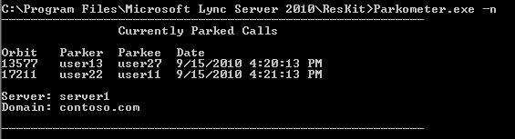

# <a name="skype-for-business-server-2015-resource-kit-tools-documentation"></a>비즈니스용 Skype 서버 2015 리소스 키트 도구 설명서

이 문서에서는 각 도구의 목적과 사용 예제를 포함하여 비즈니스용 Skype 서버 2015 Resource Kit의 도구에 대해 설명합니다. 비즈니스용 Skype 서버 2015 Resource Kit를 사용하면 2015년 비즈니스용 Skype 서버 배포하고 관리하는 IT 관리자가 일상적인 작업을 더 쉽게 수행할 수 있습니다. 예를 들어 **Web Conf Data** 도구를 사용하여 온라인 모임 중에 사용자가 업로드하는 데이터를 쉽게 제어할 수 있습니다. **SEFAUtil** 도구를 사용하여 사용자에 대한 대리자 착신 전환 및 응답 기능을 설정할 수 있습니다. IT 관리자는 이러한 도구를 사용하여 2015년 비즈니스용 Skype 서버 보다 효과적으로 관리하는 것이 좋습니다.

## <a name="installation-of-the-resource-kit-tools"></a>리소스 키트 도구 설치

비즈니스용 Skype 서버 2015 리소스 키트를 설치하려면 다운로드 센터에서 [OCSReskit.msi](https://www.microsoft.com/download/details.aspx?id=52631) 다운로드합니다.

**OCSResKit.msi** 실행하여 간단한 설치를 수행합니다. .msi %**Program Files%\비즈니스용 Skype 서버 2015\ResKit** 경로의 모든 도구를 설치합니다. 자체 포함 실행 파일인 도구는 이 폴더에 있습니다. 또한 지원 파일이 있는 도구는 자체 하위 폴더에 있습니다.

## <a name="supported-environments"></a>지원되는 환경

비즈니스용 Skype 서버 2015 리소스 키트는 비즈니스용 Skype 서버 2015에 필요한 사양을 충족하는 서버에 설치해야 하며, 일반적으로 비즈니스용 Skype 서버 2015를 실행하는 데 사용됩니다.

## <a name="resource-kit-tools-overview"></a>리소스 키트 도구 개요

다음은 비즈니스용 Skype 서버 2015 Resource Kit에 제공된 도구 목록입니다. 요구 사항 및 사용 예제를 포함하여 각 도구에 대한 설명은 다음 섹션에서 다룹니다.

- [ABSConfig](resource-kit-tools.md#ABSConfig)

- [대역폭 정책 서비스 모니터](resource-kit-tools.md#bpsm)

- [대역폭 사용률 분석기](resource-kit-tools.md#bua)

- [호출 Parkometer](resource-kit-tools.md#callpark)

- [DBAnalyze](resource-kit-tools.md#dba)

- [Storage 서비스 데이터 가져오기](resource-kit-tools.md#Issd)

- [LCSSync](resource-kit-tools.md#LCSSync)

- [사용자 콘솔 조회](resource-kit-tools.md#LUC)

- [MsTurnPing](resource-kit-tools.md#MsTurnPing)

- [네트워크 구성 뷰어](resource-kit-tools.md#NCV)

- [응답 그룹 에이전트 라이브](resource-kit-tools.md#RGAL)

- [Sefautil](resource-kit-tools.md#SEFAUtil)

- [SYSPrep.ps1](resource-kit-tools.md#SYSPrep)

- [할당되지 않은 번호 알림 마이그레이션](resource-kit-tools.md#UNAM)

- [Web Conf 데이터](resource-kit-tools.md#WebConfData)

## <a name="absconfig"></a>ABSConfig
<a name="ABSConfig"> </a>

ABSConfig(주소록 서비스 구성 도구)는 관리자가 비즈니스용 Skype 서버 2015에서 주소록 서비스 구성을 사용자 지정하는 데 도움이 되는 관리 도구입니다. 또한 이 도구를 사용하면 비즈니스용 Skype 서버 2015 관리자가 기본 주소록 서비스 설정을 복원할 수 있습니다.

### <a name="description"></a>설명

ABSConfig는 관리자가 주소록 서비스와 관련된 Active Directory Domain Services 특성을 구성할 수 있도록 하는 그래픽 사용자 인터페이스 애플리케이션입니다.

이 도구의 기본 시나리오는 다음과 같습니다.

- 관리자가 Active Directory Domain Services 특성을 비즈니스용 Skype 서버 2015의 특성에 매핑할 수 있도록 합니다.

- 관리자가 주소록 서비스 파일에 포함하거나 제외할 Active Directory Domain Services 특성을 지정할 수 있도록 합니다.

- 관리자가 복원할 수 있도록 하려면 기본 주소록 서비스 설정입니다.

ABSConfig 도구는 ABSConfig.exe 파일을 사용하여 시작할 수 있습니다. 도구가 **특성 구성** 탭으로 열립니다. 이 표에는 Active Directory Domain Services 특성을 비즈니스용 Skype 서버 2015의 특성 필드에 매핑하고 특정 특성 필터에 따라 Address Book Service 파일에 포함하거나 제외할 사용자를 지정하는 옵션이 있습니다. 주소록 파일에 포함할 전화 번호 값을 사용자 지정하는 옵션도 있습니다. **기본값 복원** 옵션을 사용하면 관리자가 주소록 서비스 설정을 기본값으로 복원할 수 있습니다.

> [!NOTE]
> AD 특성을 다른 OC 필드 이름으로 다시 매핑하는 것은 주소록 파일 다운로드에 대해서만 작동하며 주소록 웹 쿼리에서 지원되지 않습니다.

### <a name="output"></a>출력

ABSConfig는 주소록 서비스 구성을 데이터베이스에 저장합니다.

```console
Path: %ProgramFiles%\Skype for Business Server 2015\Reskit
```

### <a name="purpose"></a>용도

ABSConfig는 비즈니스용 Skype 서버 2015 주소록 서비스를 사용자 지정하는 빠르고 쉬운 방법을 제공합니다.

### <a name="requirements"></a>요구 사항

#### <a name="computer"></a>컴퓨터

ABSConfig는 비즈니스용 Skype 서버 2015가 설치된 도메인 가입 컴퓨터에서만 실행할 수 있습니다. Enterprise Edition 비즈니스용 Skype 서버 경우 이 도구는 설치하는 동안 주소록 서비스를 사용하도록 설정된 모든 Front-End 서버에서 실행할 수 있습니다.

#### <a name="network"></a>네트워크

컴퓨터는 Front-End 풀 및 백 엔드 데이터베이스에 연결할 수 있어야 합니다.

#### <a name="software"></a>소프트웨어

ABSConfig 도구를 실행하기 전에 다음 소프트웨어 구성 요소를 설치해야 합니다.

- 비즈니스용 Skype Server 2015

#### <a name="users"></a>사용자

비즈니스용 Skype 서버 2015 배포를 업데이트하는 데 필요한 권한이 있는 관리자입니다.

### <a name="examples"></a>예제

명령 프롬프트에서 **ABSConfig.exe** 입력하여 ABSConfig를 시작할 수 있습니다. 아래는 ABSConfig 도구 사용자 인터페이스입니다.


### <a name="summary"></a>요약

ABSConfig 도구는 관리자에게 비즈니스용 Skype 서버 2015 주소록 서비스를 사용자 지정하는 빠르고 간편한 도구를 제공합니다.

## <a name="bandwidth-policy-service-monitor"></a>대역폭 정책 서비스 모니터
<a name="bpsm"> </a>

대역폭 정책 서비스 모니터 도구는 관리자가 다음 목록을 볼 수 있도록 하기 위한 것입니다.

1. 토폴로지에서 구성된 모든 비즈니스용 Skype 서버 2015 대역폭 정책 서비스(인증 및 코어)

2. 각 서비스가 다른 대역폭 정책 서비스 및 Edge 서버에 대해 만드는 연결

3. 네트워크 구성 문서에 구성된 모든 링크 및 각 대역폭 정책 서비스에서 보고한 실시간 대역폭 사용량

### <a name="description"></a>설명

대역폭 정책 서비스 모니터 도구는 GUI 기반 애플리케이션으로 구현됩니다. 관리자는 PDPMonUI.exe 실행하여 도구를 시작합니다.

도구가 시작되면 토폴로지에서 대역폭 정책 서비스 목록을 검색하려고 시도합니다. 초기 업데이트가 완료되면 창 왼쪽의 창이 속한 클러스터별로 그룹화된 서비스 목록으로 채워집니다.

관리자가 특정 대역폭 정책 서비스를 선택하면 오른쪽 창에 특정 서비스에 대한 정보가 표시됩니다. 해당 창에는 정보를 표시하는 두 개의 기본 탭도 있습니다.

#### <a name="machine-info-tab"></a>컴퓨터 정보 탭

**컴퓨터 정보** 탭에는 선택한 대역폭 정책 서비스의 세부 정보와 선택한 대역폭 정책 서비스에서 다른 서비스에 대해 수행한 모든 연결의 목록 및 상태가 표시됩니다.

#### <a name="topology-info-tab"></a>토폴로지 정보 탭

**토폴로지 정보** 탭에는 네트워크 구성 설정에 구성된 모든 링크 목록이 표시됩니다. 각 링크에 대해 오디오 및 비디오 대역폭 용량이 표시됩니다. 또한 현재 사용 중인 대역폭은 Kbps 및 용량의 백분율로 모두 표시됩니다. 이 도구는 색 코딩을 사용하여 용량에 가까운 사용률이 있는 링크를 강조 표시합니다. 이렇게 하면 관리자가 이러한 링크를 신속하게 격리할 수 있습니다.

> [!NOTE]
>  구성된 대역폭 정책 서비스에 연결할 때 대역폭 정책 서비스 모니터 도구에 오류가 발생하면 **컴퓨터 정보** 및 **토폴로지 정보** 탭의 정보가 채워지지 않습니다. 그러나 도구가 처음에 연결할 수 있지만 이후에는 서비스에 대한 연결이 끊어질 수 있습니다. 이러한 경우 관리자는 오래된 정보를 볼 수 있습니다. 관리자가 특정 대역폭 정책 서비스에 대한 데이터가 마지막으로 업데이트된 시점을 확인할 수 있도록 각 탭에 **마지막으로 업데이트** 된 타임스탬프를 표시합니다.

### <a name="output"></a>출력

명령줄 출력이 없습니다. 프로그램 출력은 기본 GUI(그래픽 사용자 인터페이스) 내에 포함됩니다.

### <a name="purpose"></a>용도

대역폭 정책 서비스 모니터 도구의 목적은 관리자가 토폴로지에서 정의된 각 대역폭 정책 서비스의 상태를 표시할 수 있도록 하는 것입니다. 또한 관리자는 네트워크 구성 문서에 정의된 모든 링크에 대한 실시간 대역폭 사용량을 볼 수 있습니다.

### <a name="requirements"></a>요구 사항

대역폭 정책 서비스 모니터 도구는 비즈니스용 Skype 서버 토폴로지의 일부인 컴퓨터에서 실행해야 합니다.

### <a name="summary"></a>요약

대역폭 정책 서비스 모니터 도구는 관리자가 토폴로지의 모든 대역폭 정책 서비스의 상태를 검사할 수 있도록 하는 중요한 리소스가 될 수 있으며, 더 중요한 것은 네트워크 구성 설정에 정의된 링크에 대한 실시간 대역폭 사용률을 얻을 수 있다는 것입니다.

## <a name="bandwidth-utilization-analyzer"></a>대역폭 사용률 분석기
<a name="bua"> </a>

대역폭 사용률 분석기는 엔터프라이즈 네트워크의 WAN 링크에서 UC 엔드포인트의 다양한 대역폭 사용량 보기에 대한 보고서를 만드는 도구입니다. 이러한 보고서는 현재 대역폭 사용 패턴을 이해하고 대역폭 용량 계획을 지원하는 데 사용할 수 있습니다.

### <a name="description"></a>설명

대역폭 사용률 분석기는 GUI 기반 애플리케이션으로 구현됩니다. 이 도구는 특히 네트워크 전체에서 오디오 사용률을 위한 보고서를 생성하고 용량 계획에 도움이 됩니다. 또한 다양한 링크에 할당된 대역폭 용량을 반복합니다.

### <a name="output"></a>출력

대역폭 사용률 분석기는 시스템에 구성된 모든 WAN 링크의 오디오에 대한 대역폭 용량 및 사용률에 대한 그래픽 플롯을 제공합니다.

### <a name="purpose"></a>용도

모든 음성 및 비디오 배포에서 엔터프라이즈 네트워크를 통해 미디어 트래픽의 대역폭 사용 추세를 모니터링하고 이해하는 것이 중요합니다. 대역폭 사용률 분석기 도구를 사용하면 관리자가 이를 달성할 수 있습니다. 이 도구는 다음을 수행합니다.

- 네트워크를 통해 오디오 사용률에 대한 특정 보고서를 생성합니다.

- 다양한 링크에 할당된 대역폭 용량에 대한 보다 효과적인 용량 계획 및 반복에 도움이 됩니다.

대역폭 사용률 분석기는 대역폭 용량 및 사용률 보고서의 그래픽 플롯을 생성할 수 있습니다. 다음과 같습니다.

- 엔터프라이즈 네트워크의 모든 WAN 링크

- 선택한 WAN 링크로 필터링됨

- 링크 용량을 초과한 WAN 링크로 필터링됨

- 프로비전된 대역폭을 활용하지 않는 WAN 링크로 필터링됨

- 중요한 수준에 도달한 WAN 링크로 필터링(WAN 링크의 대역폭 용량의 90% 이상인 대역폭 사용률)

- WAN 링크 유형(네트워크 사이트 링크, 상호 연결 및 사이트 내 링크)으로 필터링됨

- 네트워크 지역별로 필터링됨

#### <a name="applications"></a>응용 프로그램

대역폭 사용률 분석기는 다음과 같은 두 가지 애플리케이션(도구)을 제공합니다.

- **WanLinkLogCollector.exe** 이 도구를 사용하면 사용자가 필요한 정보를 입력할 수 있습니다.

- **BandwidthUtilizationAnalyzer.xlsm** Microsoft Excel 스프레드시트 소프트웨어 보고서는 WanLinkLogCollector.exe 의해 자동으로 시작됩니다. 이 애플리케이션을 사용하면 사용자가 이 문서의 뒷부분에 표시된 대로 보고서에 필터를 적용할 수 있습니다.

#### <a name="phases-of-using-bandwidth-utilization-analyzer"></a>대역폭 사용률 분석기 사용 단계

대역폭 사용률 분석기를 사용하는 경우 두 단계가 있습니다.

- WanLinkLogCollector.exe 사용하여 수행되는 로그 수집

- BandwidthUtilizationAnalyzer.xlsm을 사용하여 수행되는 보고서 사용자 지정

  > [!IMPORTANT]
  > 최종 사용자가 BandwidthUtilizationAnalyzer.xlsm을 수동으로 시작하지 않는 것이 좋습니다.

#### <a name="starting-bandwidth-utilization-analyzer"></a>시작 대역폭 사용률 분석기

명령 프롬프트에서 또는 Windows 탐색기를 사용하여 WanLinkLogCollector.exe 시작합니다.

 **WanLinkLogCollector.exe사용**

WanLinkLogCollector.exe 사용하는 세 가지 단계가 있습니다.

1. **타임라인 기록** 보고서를 생성해야 하는 시간 표시 막대를 제공합니다.

2. **파일 디렉터리 지정** 파일 위치 정보 제공

3. **로그 수집 및 보고서 뷰어 시작** 명령을 실행하여 보고서 생성

#### <a name="step-1---log-the-timeline"></a>1단계 - 타임라인 기록

타임라인을 로깅하면 도구 사용자가 아래 그림과 같이 다음을 지정할 수 있습니다.

1. **시작 날짜** 보고서가 생성될 타임라인의 시작 날짜입니다. 예를 들어 2010년 8월 1일입니다.

2. **종료 날짜** 보고서가 생성될 타임라인의 종료 날짜입니다. 예를 들어 2010년 9월 30일입니다.

     

#### <a name="step-2---specify-the-file-directories"></a>2단계 - 파일 디렉터리 지정

다음과 같이 사용자가 다음 파일 디렉터리를 지정할 수 있습니다.

- **서버 로그 파일 위치** 대역폭 정책 서버 로그가 저장되는 폴더 위치입니다. 이는 일반적으로 \<fileserver\>\\ FE\>\AppServerFiles\PDP의<선택입니다.

- **임시 파일 스토리지 위치** 보고서가 생성되는 동안 중간 파일이 저장되는 임시 파일 위치입니다.

  

  > [!NOTE]
  > 서버 로그 및 임시 파일 저장소 폴더에 대한 충분한 파일 액세스가 도구 사용자에게 제공되는지 확인합니다.

#### <a name="step-3---collect-the-logs-and-start-the-report-viewer"></a>3단계 - 로그 수집 및 보고서 뷰어 시작

로그를 수집하고 보고서 뷰어를 시작하려면 아래와 같이 **[실행]** 을 클릭합니다. 이 단계에서는 필요한 데이터를 수집합니다.


입력 유효성 검사가 성공하면 아래에 표시된 메시지가 표시됩니다.


**확인** 을 클릭합니다. BandwidthUtilizationAnalyzer.xlsm이 자동으로 시작됩니다. 메시지 상자의 지침을 따릅니다. 자세한 내용은 다음 섹션에서 **BandwidthUtilizationAnalyzer.xlsm 사용을** 참조하세요.


### <a name="using-bandwidthutilizationanalyzerxlsm"></a>BandwidthUtilizationAnalyzer.xlsm 사용

1. BandwidthUtilizationAnalyzer.xlsm이 자동으로 시작되면 아래와 같이 **새로 고침** 을 클릭합니다.

     

2. 파일 폴더가 열리면 아래와 같이 메시지 상자에 지정된 위치에서 consolidated.csv 선택합니다. 또한 **C:\Temp** 로 위치를 표시합니다.

     

3. **가져오기** 를 클릭합니다.

4. 그래픽 플롯이 자동으로 생성됩니다. 백그라운드에서 작업 포인터가 사라지면 사용할 수 있습니다.

     

#### <a name="applying-filters-to-the-report-view"></a>보고서 뷰에 필터 적용

아래와 같이 보고서 보기에 적용할 수 있는 필터는 다음과 같습니다.


1. **이름** WAN 링크를 기준으로 필터링합니다(필터는 그래프의 오른쪽에 있습니다). 접두사는 다음 링크 형식을 나꿉니다. 세로(파란색) 상자를 참조하세요.

   - **S 사이트** 네트워크 사이트에서 네트워크 지역으로의 WAN 링크

   - **IS 사이트 간** 두 네트워크 사이트 간의 WAN 링크

   - **R 지역 간** 두 네트워크 지역 간의 WAN 링크

2. **제한을 초과했습니다.** 대역폭 사용률이 대역폭 용량보다 큰 WAN 링크별로 필터링

3. **중요 수준** 대역폭 사용률이 대역폭 용량보다 90% 이상인 WAN 링크별로 필터링

4. **사용률이 밑도는 경우** 대역폭 사용률이 대역폭 용량의 25% 미만인 WAN 링크별로 필터링

5. **링크 유형** 다음 WAN 링크 형식으로 필터링합니다.

   - **네트워크 사이트** 유형

   - **사이트 간** 유형

   - **지역 간 링크** 유형

6. **지역** 네트워크 지역별로 필터링

다음 그림에서는 이전에 설명한 필터를 보여 줍니다.

이름으로 필터링 **합니다**. 그래프에 표시해야 하는 링크 목록을 선택합니다.


**제한을 초과하여 필터링합니다**. **True** 를 선택하여 필터를 적용합니다.


**위험 수준** 별로 필터링합니다. **True** 를 선택하여 필터를 적용합니다.


**사용 중인 필터링** 기준입니다. **True** 를 선택하여 필터를 적용합니다.


**링크 유형** 별로 필터링합니다. 표시해야 하는 형식 또는 형식을 선택합니다.


지역별로 필터링 **합니다**. 링크를 표시해야 하는 지역 목록을 선택합니다.


### <a name="requirements"></a>요구 사항

- .NET Framework 3.5

- 2007년 Microsoft Excel 2010 또는 Excel

### <a name="summary"></a>요약

대역폭 사용률 분석기는 네트워크를 통해 UC 트래픽에 대한 오디오 대역폭 사용률을 그리는 데 사용됩니다. 이 도구를 사용하여 네트워크에서 비디오 대역폭의 사용률을 보고할 수도 있습니다.

## <a name="call-parkometer"></a>호출 Parkometer
<a name="callpark"> </a>

호출 Parkometer는 호출 대기 궤도 데이터베이스에 쉽게 액세스할 수 있는 명령줄 애플리케이션입니다.

### <a name="description"></a>설명

호출 Parkometer는 현재 주차된 호출을 추적하는 도구입니다. 또한 궤도 및 CPS(호출 공원 서버) 사용량에 대한 통계도 수집합니다. 이 명령줄 도구는 로컬 또는 원격으로 연결된 컴퓨터에서 CPS 궤도 SQL Server 데이터베이스에 대한 읽기 및 쓰기 액세스를 모두 제공합니다.

모든 옵션은 상호 배타적입니다. 명령줄 구문은 다음과 같습니다.

- **-o** 매개 변수 - 이 풀에 대해 구성된 모든 궤도 범위를 나열합니다.

- **-n** 매개 변수 - 이 풀에서 현재 사용되는 모든 궤도를 나열합니다. 표시되는 정보는 다음과 같습니다.

  - parkee 및 parker의 SIP URI(Uniform Resource Identifier)입니다.

  - 호출이 주차된 CPS의 호스트 이름입니다.

  - 통화가 주차된 시점의 타임스탬프를 표시합니다.

- **-f** 매개 변수 - 풀에서 현재 사용 가능한 궤도 수를 나열합니다.

- **-r \<n\>** 매개 변수 - 마지막으로 주차된 호출을 \<n\> 나열합니다. 표시되는 정보는 다음과 같습니다.

  - Parkee SIP URI.

  - Parker SIP URI.

  - 통화가 주차된 CPS의 호스트 이름입니다.

  - 호출을 검색하거나 삭제한 시점의 타임스탬프를 지정합니다.

- **-t\<n\>** 매개 변수 - 데이터베이스의 궤도 예약을 테스트하여 할당된 궤도 번호의 임의성을 표시합니다.

### <a name="output"></a>출력

명령 프롬프트에 지정된 입력 매개 변수에 따라 Call Parkometer는 다음 출력을 표시합니다.

- 이 풀에 대해 구성된 모든 궤도 범위

- 현재 대기 중인 통화

- 사용 가능한(사용 가능한) 궤도 수

- 최근에 대기한 통화

- 균일 및 임의 궤도 값을 테스트하기 위한 예약된 궤도

### <a name="purpose"></a>용도

CPS 도구의 목적은 CPS 데이터베이스에 대한 명령줄 액세스를 제공하는 것입니다. 관리자는 CPS 사용량을 보고 풀에 할당된 궤도 수를 확인할 수 있습니다.

### <a name="requirements"></a>요구 사항

이 도구가 CPS를 실행하는 동일한 컴퓨터에서 실행되는 경우 요구 사항은 없습니다. 이 도구가 원격 컴퓨터에서 실행되는 경우 비즈니스용 Skype 서버 2015에서 사용하는 SQL Server 데이터베이스를 구성하여 원격 액세스를 허용해야 합니다. 풀의 SQL Server 연결하려면 호출 Parkometer를 SQL Server 데이터베이스 연결 문자열로 구성해야 합니다. 이 SQL Server 데이터베이스 연결 문자열은 구성 **파일parkometer.exe.config정의** 됩니다. parkometer.exe 있는 동일한 디렉터리에 배치해야 합니다. 다음 XML 파일은 parkometer.exe.config 예입니다. 구성해야 하는 매개 변수는 사용자 이름(예: mydomain\Administrator), 암호(예: mypassword) 및 호스트 이름(예: myserver)입니다.

```xml
<?xml version="1.0" encoding="utf-8" ?>
<configuration>
  <appSettings>
   <add key="SQL" value="server=myserver\RTC;
database=cpsdyn;
User Id=mydomain\Administrator;
Password=mypassword.;
Integrated Security=false;"/>
  </appSettings>
</configuration>
```

### <a name="examples"></a>예제

배포된 궤도 범위: -o 매개 변수는 표시된 대로 이 풀에 대해 구성된 모든 궤도 범위를 나열합니다.


현재 대기 중인 호출: -n 매개 변수는 표시된 대로 이 풀에서 현재 사용되는 모든 궤도를 나열합니다.



사용 가능한 궤도 수: -f 매개 변수는 표시된 대로 풀에서 현재 사용 가능한 궤도 수를 나열합니다.


최근에 주차된 호출: -r \<n\> 매개 변수는 \<n\> 표시된 대로 마지막으로 주차된 호출을 나열합니다.


테스트 궤도 예약: -t \<n\> 매개 변수는 표시된 대로 데이터베이스의 궤도 예약을 테스트합니다.


### <a name="summary"></a>요약

호출 Parkometer는 통화 대기 서버에 대한 자세한 정보를 제공하는 명령줄 도구입니다.

## <a name="dbanalyze"></a>DBAnalyze
<a name="dba"> </a>

### <a name="description"></a>설명

DBAnalyze는 관리자가 비즈니스용 Skype 서버 2015 데이터베이스에 대한 분석 보고서를 수집하는 데 도움이 되는 명령줄 도구입니다. DBAnalyze에는 진단, 사용자 데이터, 회의, MCU 및 디스크 조각화 모드가 있습니다.

- **진단 모드** 테이블(레코드 수, 조각화, 데이터 크기 및 인덱스 크기), 데이터 및 로그 파일 크기, 마지막 백업 시간, Microsoft Office Communications Server를 실행하는 서버 간의 연락처 배포, 평균 사용 권한 수, 연락처, 컨테이너, 구독, 게시, 사용자별 엔드포인트, 부적절한 홈 사용자, 라우팅할 수 없는 사용자, 라우팅할 수 없는 사용자에 대한 정보가 포함된 보고서를 만듭니다.  사용자별로 구성된 평균 회의 수, 예약된 회의, 활성 회의 및 데이터베이스 버전입니다.

    > [!NOTE]
    > 진단 모드를 실행하면 서버 성능에 영향을 줄 수 있습니다.

- **사용자 데이터 모드** 지정된 사용자 또는 연락처 및 사용 권한 목록에 해당 사용자가 있는 사용자의 연락처, 컨테이너, 구독, 게시, 사용 권한 및 연락처 그룹 데이터를 보고합니다. 이 모드는 사용자가 구성하거나 초대하는 회의에 대한 요약 데이터도 보고합니다.

- **회의 모드** 회의에 대한 모든 일정 시간 세부 정보, 초대자 목록, 회의에 허용되는 미디어 유형 목록, 활성 MCU(다중 포인트 제어 단위), 활성 참가자 목록 및 각 참가자의 신호 상태를 포함하여 특정 회의에 대한 자세한 데이터를 보고합니다.

- **모임 ID 디코딩** **/pstnid** 스위치로 지정되었지만 자세한 내용은 백 엔드에 연결하지 않는 PSTN(공중 전화망) 모임 ID를 디코딩합니다.

- **회의 해결** **/pstnid** 스위치로 지정된 PSTN 모임 ID를 디코딩하고 ID로 표시된 회의에 대한 정보를 표시합니다.

- **MCU 모드** 풀의 각 MCU에 대한 ID, 미디어 유형, URL, 하트비트 상태, 회의 부하 및 참가자 부하를 보고합니다.

- **디스크 조각화 모드** 모든 디스크의 조각화 상태를 표시합니다.

이 도구를 사용하여 다양한 문제를 진단하거나 관리자가 용량 계획을 세울 수 있습니다. 예를 들어 서버 A에 있는 대부분의 사용자가 서버 B에 있는 사용자를 연락처로 선택하는 경우 관리자는 서버 A의 사용자를 서버 B로 이동하여 서버 간 트래픽을 줄일 수 있습니다.

### <a name="output"></a>출력

이 도구는 비즈니스용 Skype 서버 2015 데이터베이스에 대한 미리 정의된 보고서를 출력합니다. **경로**: %ProgramFiles%\비즈니스용 Skype 서버 2015\Reskit

### <a name="purpose"></a>용도

Dbanalyze.exe 설치하려면 로컬 폴더에 복사한 다음 도구를 실행합니다. 도구를 사용하려면 명령줄에서 다음 명령을 실행합니다. `dbanalyze.exe [/v] [/report:value] [/sqlserver:value] [/user:user@domain.com] [/conf:value][/pstnid:Value] [/maxcontacts:value]` 명령줄 옵션에 대한 설명은 다음과 같습니다.


### <a name="requirements"></a>요구 사항

 **컴퓨터** DBAnalyze는 비즈니스용 Skype 서버 2015가 설치된 도메인 가입 컴퓨터에서만 실행할 수 있습니다.

 **네트워크** 컴퓨터는 백 엔드 데이터베이스에 연결할 수 있어야 합니다.

 DBAnalyze를 실행하기 전에 **소프트웨어** 비즈니스용 Skype 서버 2015 소프트웨어 구성 요소를 설치해야 합니다.

 **사용자** 아래 표에서는 비즈니스용 Skype 서버 2015 데이터베이스에 액세스하는 데 필요한 권한이 있는 관리자를 보여 줍니다.


> [!NOTE]
> **/report:disk** 모드에는 로컬 관리자 계정이 필요합니다.

### <a name="examples"></a>예제

다음은 유효한 Dbanalyze.exe 명령의 예입니다.

```console
dbanalyze.exe /report:diag
dbanalyze.exe /report:user /user:usera@domainb.com
dbanalyze.exe /report:conf /user:bob@example.com /conf:1W9J71SKSX2X
dbanalyze.exe /report:resolve /pstnid:12345
dbanalyze.exe /report:mcus
dbanalyze.exe /report:disk
```

### <a name="summary"></a>요약

DBAnalyzer는 관리자에게 비즈니스용 Skype 서버 2015 데이터베이스를 빠르고 쉽게 분석할 수 있도록 합니다.

## <a name="import-storage-service-data"></a>Storage 서비스 데이터 가져오기
<a name="Issd"> </a>

ImportStorageServiceData 리소스 키트 도구를 사용하면 Storage Service(LYSS)에서 다시 Storage 서비스로 플러시된 큐 및 엔드포인트 데이터를 다시 가져올 수 있습니다.

### <a name="description"></a>설명

Storage 서비스에서 플러시된 데이터는 큐 항목 상태 또는 데이터베이스 크기에 따라 자동(주기적)일 수 있습니다. 풀 장애 조치(failover) cmdlet 또는 StorageServiceFullFlush cmdlet(풀 장애 조치(failover) cmdlet이 호출하는)의 수동 호출로 인해 발생할 수 있습니다. 프런트 엔드의 Storage Service(LYSS) 데이터베이스 크기가 정상 수준보다 크면 데이터를 다시 가져오지 않는 것이 좋습니다. 이렇게 하면 더 많은 데이터가 다시 내보내질 가능성이 높기 때문입니다. 또한 Storage 서비스 큐를 증가시키는 오류에 영향을 줄 수 있는 모든 문제를 먼저 해결해야 합니다(예: 엔드포인트 오류, 네트워크 문제 또는 기타 문제 Exchange).

 **시나리오 1:** 풀 장애 조치 중에 각 프런트 엔드에 대한 스토리지 서비스에서 파일이 플러시될 수 있습니다. 장애 조치(failover)가 완료되면 데이터를 다시 가져오기 위해 도구를 실행해야 합니다.

 **시나리오 2:** 데이터가 매일 또는 특정 크기 임계값을 초과하는 Storage Service 데이터베이스에 대한 응답으로 자동으로 플러시됩니다(예: 60%, 80%, 90%전체). 자동으로 플러시된 데이터는 관리자가 정기적으로 다시 배치해야 합니다. 위의 상황에서 모니터링 SCOM 팩이 배포되지 않은 경우 Storage 서비스에서 플러시되는 데이터와 관련된 비즈니스용 Skype 서버 Storage 서비스에 대한 이벤트가 있습니다. 이벤트 ID 32075(전체 플러시 작업이 시작됨), 32076(전체 플러시 완료), 32082(유지 관리 수준 플러시 시작), 32083(유지 관리 수준 플러시 완료), 32089(데이터베이스 채우기로 인해 플러시 발생). 이러한 이벤트 ID는 RTM 릴리스에 해당합니다. 관리자가 이러한 이벤트를 볼 때 플러시된 파일이 있음을 의미합니다. 이 데이터는 이 도구를 사용하여 정기적으로 다시 가져와야 합니다(예: 일주일에 한 번).

온라인 서비스 릴리스의 경우 비즈니스용 Skype 서버 대한 상태 모니터링 SCOM 팩이 배포된 경우 관리자에게 플러시된 데이터를 다시 Storage 서비스에 다시 적용하도록 요청하는 새로운 경고가 발생할 수 있습니다. 경고를 트리거한 Front-End 서버의 이벤트 로그에 해당 이벤트가 있습니다. 이 이벤트는 플러시된 데이터 파일이 있는 부모 경로 및 경고 조건을 충족하는 파일 수에 대한 설명을 제공합니다. 경고 조건은 Y일 이상 된 특정 부모 경로 아래에 X 이상의 파일이 있다는 것입니다(여기서 X 및 Y는 StorageService 내에서 미리 설정되지만 APPCONFIG 파일을 변경하여 재정의할 수 있음). 상태 경고를 트리거할 수 있는 이벤트의 두 가지 예가 아래에 나와 있으며, 그 차이는 부모 경로입니다. 한 가지 가능성은 웹 서비스 파일 공유에 있는 반면 다른 가능성은 각 프런트 엔드의 로컬 애플리케이션 데이터 디렉터리입니다. (예: c:\ProgramData\Microsoft\비즈니스용 Skype 서버 2015\StorageService). 그러면 관리자가 이 다시 스키트 도구를 실행합니다.

이 도구는 도구가 실행되는 프런트 엔드에서 데이터가 소유되지 않는 경우 실행 중인 프런트 엔드 및 기타 프런트 엔드에서 CPU 및 IO 부하를 증가합니다. 프런트 엔드가 CPU 및 IO 부하가 많이 사용되지 않는 경우(예: 사용량이 많은 시간 외) 이 도구를 실행하는 것이 좋습니다. 둘째, 이 도구는 2~3분 동안 하나의 데이터 파일을 가져올 수 있습니다. 도구가 실행되는 기간을 예측할 때는 이 점을 염두에 두어야 합니다. 도구에서 생성된 자세한 로그 파일은 기본적으로 파일 Microsoft Store 표시됩니다. 로그 파일이 수십MB 이상일 수 있으므로 보고된 오류가 없는 경우 삭제합니다.


### <a name="requirements"></a>요구 사항

비즈니스용 Skype 서버 2015 Resource Kit 도구를 설치합니다. 이 도구는 비즈니스용 Skype 서버 및 비즈니스용 Skype 서버 관리 셸이 설치된 도메인에 가입된 컴퓨터에서 실행됩니다. 이 도구는 관리 셸의 cmdlet을 사용하여 풀의 모든 Front-End 서버를 식별합니다. 둘째, **RtcLocal** 데이터베이스가 설치된 풀의 컴퓨터에서 도구를 실행해야 합니다. 이 데이터베이스는 도구에서 풀에 대한 WEBSERVICE 파일 공유의 위치를 검색하는 데 사용됩니다. 또한 도구를 사용하기 전에 각 Front-End 서버는 먼저 각 Front-End 서버 및 도구가 실행되는 컴퓨터에서 **Enable-PSRemoting을** 사용하여 Windows PowerShell 원격을 사용하도록 설정해야 합니다. 그렇지 않으면 이 도구의 원격 Windows PowerShell 명령이 실패합니다. Windows PowerShell 원격은 풀이 완료된 후 풀의 모든 Front-End 서버에서 해제할 수 있습니다. 마지막으로 도구를 호출하는 계정 또는 자격 증명에는 이 도구를 실행하는 풀에 대한 웹 서비스 파일 공유에 대한 읽기/쓰기 권한이 있어야 합니다. 그렇지 않으면 IO 권한 오류로 도구가 실패합니다.

> [!NOTE]
> Windows Server 2012 Windows PowerShell 원격은 기본적으로 사용하도록 설정되지만 Windows Server 2008 운영 체제에서는 사용하도록 설정되지 않습니다.

### <a name="examples"></a>예제

```console
>  C:\StorageService>ImportStorageServiceData.exe
Description:
This tool will re-import Storage Service (LYSS) flushed queue data back in.  For a pool: you are required to run this tool on a machine inside the pool which has the Lync Server Management Shell installed.  Additionally, all front end machines need to have Windows Powershell Remoting enabled before executing this tool by executing Enable-PSRemoting.  Also, please ensure that all Storage Service instance DB Size are at the 'Normal' level (verify this by viewing Eventlog events). Otherwise re-importing may cause data to be flushed out again if any Storage Service instance DB size level goes above 'Normal'.
Usage: Default behavior is to Import data from web service file share as well as any files on all Front End machines in pool.
Additional Options:
-Verbose                    : Turn verbose output on.

-StorageServiceHostName     : Host Name of Storage Service WCF endpoint.  ( Default=localhost netnamedpipe binding. )

-FileSharePath              : Import only all data from just under the UNC path specified.

ActivityID: cc3b62ff-bb66-4e61-a6e2-96cb3626315c. <-- Use this to correlate with StorageService trace logs if troubleshooting.
Type Server name (TCP binding) or press <enter> for localhost (NamePipe binding):
Using NetNamedPipeBinding...
OnTopologyChanged Event received
Web Service File Share: \\dc.vdomain.com\OcsFileStore\co1-WebServices-1\StorageService

Front Ends:
server.vdomain.com
server2.vdomain.com
server1.vdomain.com
server3.vdomain.com
Looking under directory: \\dc.vdomain.com\OcsFileStore\co1-WebServices-1\StorageService for exported data.
# Files found: 8
Starting Import for file:\\dc.vdomain.com\OcsFileStore\co1-WebServices-1\StorageService\DataExport\2
0120910\SERVER.vdomain.com\944f5724c65c5f93900dc1c8c898b102__0.xml
Items deserialized: 20

All items in file were enqueued successfully, will try to delete file: \\dc.vdomain.com\OcsFileStore\co1-WebServices-1\StorageService\DataExport\20120910\SERVER.vdomain.com\944f5724c65c5f93900dc1c8c898b102__0.xml

All items in file failed to enqueue so file will not be deleted.  File path: \\dc.vdomain.com\OcsFileStore\co1-WebServices-1\StorageService\DataExport\20120910\SERVER.vdomain.com\944f5724c65c5f93900dc1c8c898b102__0.xml

Summary for file \\dc.vdomain.com\OcsFileStore\co1-WebServices-1\StorageService\DataExport\20120910\SERVER.vdomain.com\944f5724c65c5f93900dc1c8c898b102__0.xml: succeeded: 20, failed: 0

Starting Import for file:\\dc.vdomain.com\OcsFileStore\co1-WebServices-1\StorageService\DataExport\20120910\SERVER1.vdomain.com\17d5435ae40259f7bbdf1866776386e4__0.xml
Items deserialized: 20

[cc3b62ff-bb66-4e61-a6e2-96cb3626315c] Send EnqueueMessages to redirected, targetServer=server1.vdomain.com, queueItems=20

All items in file were enqueued successfully, will try to delete file: \\dc.vdomain.com\OcsFileStore\co1-WebServices-1\StorageService\DataExport\20120910\SERVER1.vdomain.com\17d5435ae40259f7bbdf1866776386e4__0.xml

All items in file failed to enqueue so file will not be deleted.  File path: \\dc.vdomain.com\OcsFileStore\co1-WebServices-1\StorageService\DataExport\20120910\SERVER1.vdomain.com\17d5435ae40259f7bbdf1866776386e4__0.xml

Summary for file \\dc.vdomain.com\OcsFileStore\co1-WebServices-1\StorageService\DataExport\20120910\
SERVER1.vdomain.com\17d5435ae40259f7bbdf1866776386e4__0.xml: succeeded: 20, failed: 0

Starting Import for file:\\dc.vdomain.com\OcsFileStore\co1-WebServices-1\StorageService\DataExport\20120910\SERVER1.vdomain.com\904f6c9b8ac951ae8b3c86684d3832e4__0.xml

Items deserialized: 20
[cc3b62ff-bb66-4e61-a6e2-96cb3626315c] Send EnqueueMessages to redirected, targetServer=server1.vdomain.com, queueItems=20

All items in file were enqueued successfully, will try to delete file: \\dc.vdomain.com\OcsFileStore
\co1-WebServices-1\StorageService\DataExport\20120910\SERVER1.vdomain.com\904f6c9b8ac951ae8b3c86684d
3832e4__0.xml

All items in file failed to enqueue so file will not be deleted.  File path: \\dc.vdomain.com\OcsFil
eStore\co1-WebServices-1\StorageService\DataExport\20120910\SERVER1.vdomain.com\904f6c9b8ac951ae8b3c
86684d3832e4__0.xml

Summary for file \\dc.vdomain.com\OcsFileStore\co1-WebServices-1\StorageService\DataExport\20120910\
SERVER1.vdomain.com\904f6c9b8ac951ae8b3c86684d3832e4__0.xml: succeeded: 20, failed: 0

Starting Import for file:\\dc.vdomain.com\OcsFileStore\co1-WebServices-1\StorageService\DataExport\2
0120910\SERVER2.vdomain.com\69844a271e6c5633a1f2b46a42287dd6__0.xml

Items deserialized: 20

[cc3b62ff-bb66-4e61-a6e2-96cb3626315c] Send EnqueueMessages to redirected, targetServer=server2.vdom
ain.com, queueItems=20

All items in file were enqueued successfully, will try to delete file: \\dc.vdomain.com\OcsFileStore
\co1-WebServices-1\StorageService\DataExport\20120910\SERVER2.vdomain.com\69844a271e6c5633a1f2b46a42
287dd6__0.xml

All items in file failed to enqueue so file will not be deleted.  File path: \\dc.vdomain.com\OcsFil
eStore\co1-WebServices-1\StorageService\DataExport\20120910\SERVER2.vdomain.com\69844a271e6c5633a1f2
b46a42287dd6__0.xml

Summary for file \\dc.vdomain.com\OcsFileStore\co1-WebServices-1\StorageService\DataExport\20120910\
SERVER2.vdomain.com\69844a271e6c5633a1f2b46a42287dd6__0.xml: succeeded: 20, failed: 0

Starting Import for file:\\dc.vdomain.com\OcsFileStore\co1-WebServices-1\StorageService\DataExport\2
0120910\SERVER3.vdomain.com\3313935458e35b9b9759e08a15d251e6__0.xml

Items deserialized: 20

[cc3b62ff-bb66-4e61-a6e2-96cb3626315c] Send EnqueueMessages to redirected, targetServer=server3.vdom
ain.com, queueItems=1

All items in file were enqueued successfully, will try to delete file: \\dc.vdomain.com\OcsFileStore
\co1-WebServices-1\StorageService\DataExport\20120910\SERVER3.vdomain.com\3313935458e35b9b9759e08a15
d251e6__0.xml

All items in file failed to enqueue so file will not be deleted.  File path: \\dc.vdomain.com\OcsFil
eStore\co1-WebServices-1\StorageService\DataExport\20120910\SERVER3.vdomain.com\3313935458e35b9b9759
e08a15d251e6__0.xml

Summary for file \\dc.vdomain.com\OcsFileStore\co1-WebServices-1\StorageService\DataExport\20120910\
SERVER3.vdomain.com\3313935458e35b9b9759e08a15d251e6__0.xml: succeeded: 20, failed: 0

Starting Import for file:\\dc.vdomain.com\OcsFileStore\co1-WebServices-1\StorageService\DataExport\2
0120910\SERVER3.vdomain.com\4501e04eae4856059346949ff817c220__0.xml
Items deserialized: 20
[cc3b62ff-bb66-4e61-a6e2-96cb3626315c] Send EnqueueMessages to redirected, targetServer=server3.vdom
ain.com, queueItems=1
All items in file were enqueued successfully, will try to delete file: \\dc.vdomain.com\OcsFileStore
\co1-WebServices-1\StorageService\DataExport\20120910\SERVER3.vdomain.com\4501e04eae4856059346949ff8
17c220__0.xml
All items in file failed to enqueue so file will not be deleted.  File path: \\dc.vdomain.com\OcsFil
eStore\co1-WebServices-1\StorageService\DataExport\20120910\SERVER3.vdomain.com\4501e04eae4856059346
949ff817c220__0.xml

Summary for file \\dc.vdomain.com\OcsFileStore\co1-WebServices-1\StorageService\DataExport\20120910\
SERVER3.vdomain.com\4501e04eae4856059346949ff817c220__0.xml: succeeded: 20, failed: 0
Starting Import for file:\\dc.vdomain.com\OcsFileStore\co1-WebServices-1\StorageService\DataExport\2
0120910\SERVER3.vdomain.com\5ad77443ad955a22a876749be66d5317__0.xml

Items deserialized: 20
[cc3b62ff-bb66-4e61-a6e2-96cb3626315c] Send EnqueueMessages to redirected, targetServer=server3.vdom
ain.com, queueItems=20
All items in file were enqueued successfully, will try to delete file: \\dc.vdomain.com\OcsFileStore
\co1-WebServices-1\StorageService\DataExport\20120910\SERVER3.vdomain.com\5ad77443ad955a22a876749be6
6d5317__0.xml
All items in file failed to enqueue so file will not be deleted.  File path: \\dc.vdomain.com\OcsFil
eStore\co1-WebServices-1\StorageService\DataExport\20120910\SERVER3.vdomain.com\5ad77443ad955a22a876
749be66d5317__0.xml
Summary for file \\dc.vdomain.com\OcsFileStore\co1-WebServices-1\StorageService\DataExport\20120910\
SERVER3.vdomain.com\5ad77443ad955a22a876749be66d5317__0.xml: succeeded: 20, failed: 0
Starting Import for file:\\dc.vdomain.com\OcsFileStore\co1-WebServices-1\StorageService\DataExport\2
0120910\SERVER3.vdomain.com\a11e27ae439a582288d4657eda86b565__0.xml
Items deserialized: 20
[cc3b62ff-bb66-4e61-a6e2-96cb3626315c] Send EnqueueMessages to redirected, targetServer=server3.vdom
ain.com, queueItems=20
All items in file were enqueued successfully, will try to delete file: \\dc.vdomain.com\OcsFileStore
\co1-WebServices-1\StorageService\DataExport\20120910\SERVER3.vdomain.com\a11e27ae439a582288d4657eda
86b565__0.xml
All items in file failed to enqueue so file will not be deleted.  File path: \\dc.vdomain.com\OcsFil
eStore\co1-WebServices-1\StorageService\DataExport\20120910\SERVER3.vdomain.com\a11e27ae439a582288d4
657eda86b565__0.xml
Summary for file \\dc.vdomain.com\OcsFileStore\co1-WebServices-1\StorageService\DataExport\20120910\
SERVER3.vdomain.com\a11e27ae439a582288d4657eda86b565__0.xml: succeeded: 20, failed: 0
All files have been imported into Storage Service for path: \\dc.vdomain.com\OcsFileStore\co1-WebSer
vices-1\StorageService
Importing files for: server.vdomain.com
No files founds.
Importing files for: server2.vdomain.com
No files founds.
Importing files for: server1.vdomain.com
No files founds.
Importing files for: server3.vdomain.com
No files founds.
Writing log: \\dc.vdomain.com\OcsFileStore\co1-WebServices-1\StorageService\ImportStorageServiceData
Log20120910_1609SS
Tool has finished execution.
>  C:\StorageService>
```

## <a name="lcssync"></a>LCSSync
<a name="LCSSync"> </a>

LCSSync 도구는 다중 포리스트 환경에서 비즈니스용 Skype 서버 2015 통신 소프트웨어를 배포하는 데 도움이 됩니다. 이 도구는 다른 사용자 포리스트의 사용자 및 그룹을 Active Directory Domain Services 연락처 개체로 비즈니스용 Skype 서버 2015가 설치된 중앙 포리스트로 동기화하는 데 사용됩니다.

### <a name="description"></a>설명

 LCSSync는 중앙 포리스트의 동기화된 Active Directory Domain Services 연락처 개체를 사용하여 사용자가 비즈니스용 Skype 서버 수 있도록 합니다. Single Sign-In을 제공하려면 기본 사용자 계정을 비즈니스용 Skype 서버 2015의 중앙 포리스트에 있는 Active Directory Domain Services 연락처 개체에 매핑해야 합니다. 이 도구는 해당 매핑을 수행하는 데 도움이 됩니다. 이 도구는 Microsoft ID 통합 서버에서 관리 에이전트를 만들기 위한 템플릿을 제공합니다.

### <a name="summary"></a>요약

LCSSync 도구를 사용하면 다중 포리스트 환경에서 비즈니스용 Skype 서버 2015를 배포할 수 있습니다.

## <a name="lookup-user-console"></a>사용자 콘솔 조회
<a name="LUC"> </a>

LookupUserConsole 도구는 특정 사용자에 대한 내부 비즈니스용 Skype 서버 라우팅 정보를 표시합니다. 이 정보는 배포 및 라우팅 문제를 진단할 때 Microsoft에서 개인을 지원하는 데 유용할 수 있습니다.

### <a name="description"></a>설명

 LookupUserConsole.exe 실행하면 SIP 주소를 수락하고 이와 관련된 내부 비즈니스용 Skype 서버 라우팅 정보를 표시하려는 명령 프롬프트가 열립니다. **Exit** 를 입력하여 LookupUserConsole 도구를 종료합니다.

### <a name="requirements"></a>요구 사항

비즈니스용 Skype 서버 2015 Resource Kit를 설치합니다. 이 도구는 비즈니스용 Skype 서버 설치된 도메인에 가입된 컴퓨터에서 실행됩니다.

### <a name="examples"></a>예제

C:\Program Files\비즈니스용 Skype 서버 2015\ResKit\>LookupUserConsole.exe

```console
> sip:john.doe@vdomain.com

  Execution time (ms):                            171.094
  Exeuction result:                               Success
  SIP URI:                                        sip:john.doe@vdomain.com
  User info:
    SID:                                          S-1-5-21-2831376166-29632525...    Display name:                                     John Doe
    Grouping ID:                                  00000000-0000-0000-0000-...
    Line URI:                                     <null>
    Policy assignment:                            TenantId={00000000--0000-000....
    SIP enabled:                                  True
    UC enabled:                                   False
    Tenant ID:                                    00000000-0000-0000-0000-...  Cluster info:
    Active cluster:                               pool0.vdomain.com
    Backup registrar cluster:                     <null>
    Deployment location:                          <null>
    Home Front-End FQDN:                          SERVER.vdomain.com
    Primary Registrar cluster:                    pool0.vdomain.com
    Remote Director external SIP FQDN:            <null>
    Remote Director internal SIP FQDN:            <null>
    Remote Director Web FQDN:                     <null>
    Routing group ID:                             4501e04e-ae48-5605-9346...
    Service tag ID:                               1266953005
    User Front-End resolved:                      True
    User in local forest:                         True
    User in remote forest:                        False
    User in split domain:                         False
    User-Services cluster:                        pool0.vdomain.com

> sip:nouser@vdomain.com

  Execution time (ms):                            948.7574
  Exeuction result:                               UserDoesNotExist

> exit
```

## <a name="msturnping"></a>MsTurnPing
<a name="MsTurnPing"> </a>

MSTurnPing 도구를 사용하면 비즈니스용 Skype 서버 2015 통신 소프트웨어 관리자가 오디오/비디오 에지, 오디오/비디오 인증 서비스를 실행하는 서버 및 토폴로지에서 대역폭 정책 서비스를 실행하는 서버의 상태를 확인할 수 있습니다.

### <a name="description"></a>설명

MSTurnPing 도구를 사용하면 비즈니스용 Skype 서버 2015 통신 소프트웨어 관리자가 오디오/비디오 에지, 오디오/비디오 인증 서비스를 실행하는 서버 및 토폴로지에서 대역폭 정책 서비스를 실행하는 서버의 상태를 확인할 수 있습니다.

이 도구를 사용하면 관리자가 다음 테스트를 수행할 수 있습니다.

1. A/V Edge Server 테스트: 이 도구는 다음을 수행하여 토폴로지의 모든 A/V 에지 서버에 대해 테스트를 수행합니다.

   - 비즈니스용 Skype 서버 오디오/비디오 인증 서비스가 시작되고 적절한 자격 증명을 발급할 수 있는지 확인합니다.

   - 비즈니스용 Skype 서버 Audio/Video Edge 서비스가 시작되고 외부 에지에 리소스를 성공적으로 할당할 수 있는지 확인합니다.

2. 대역폭 정책 서비스 테스트: 이 도구는 다음을 수행하여 토폴로지에서 대역폭 정책 서비스를 실행하는 모든 서버에 대해 테스트를 수행합니다.

   - 비즈니스용 Skype 서버 대역폭 정책 서비스(인증)가 시작되고 적절한 자격 증명을 발급할 수 있는지 확인합니다.

   - 비즈니스용 Skype 서버 대역폭 정책 서비스(Core)가 시작되고 대역폭 검사를 성공적으로 수행할 수 있는지 확인합니다.

이 도구는 토폴로지의 일부이며 로컬 저장소가 설치된 컴퓨터에서 실행해야 합니다.

### <a name="output"></a>출력

이 도구는 각 작업의 결과를 출력합니다.

- **AudioVideoEdgeServer** 테스트가 수행되면 도구 출력은 다음과 같습니다.

  - 토폴로지에서 비즈니스용 Skype 서버 2015 오디오/비디오 인증 서비스를 제공하는 컴퓨터의 테스트 결과

  - 토폴로지에서 비즈니스용 Skype 서버 2015 Audio/Video Edge 서비스를 제공하는 컴퓨터의 테스트 결과

- **BandwidthPolicyServer** 테스트가 수행되면 도구 출력은 다음과 같습니다.

  - 토폴로지에서 비즈니스용 Skype 서버 2015 대역폭 정책 서비스(인증)를 제공하는 컴퓨터의 테스트 결과

  - 토폴로지에서 비즈니스용 Skype 서버 2015 대역폭 정책 서비스(Core)를 제공하는 컴퓨터의 테스트 결과

### <a name="requirements"></a>요구 사항

- 이 도구는 토폴로지에 있고 로컬 저장소가 있는 컴퓨터에서 실행해야 합니다.

- 이 도구는 로컬 저장소에 대한 액세스 권한이 있는 관리자 권한으로 실행되어야 합니다.

### <a name="examples"></a>예제

다음은 도구 입력의 예입니다.

```console
MsTurnPing -ServerRole AudioVideoEdgeServer

MsTurnPing -ServerRole BandwidthPolicyServer
```

### <a name="summary"></a>요약

이 도구는 오디오/비디오 및 대역폭 정책 서비스를 실행하는 서버의 상태를 확인하려는 비즈니스용 Skype 서버 2015 관리자에게 중요한 리소스가 될 수 있습니다.

## <a name="network-configuration-viewer"></a>네트워크 구성 뷰어
<a name="NCV"> </a>

네트워크 구성 뷰어는 비즈니스용 Skype 서버 2015 통신 소프트웨어 관리자가 지정된 대역폭 용량을 기반으로 음성 또는 비디오 통화와 같은 실시간 통신 세션을 허용하도록 프로비전된 엔터프라이즈의 CAC(통화 허용 제어) 네트워크 토폴로지 보기를 위해 사용할 수 있습니다. 비즈니스용 Skype 서버 2015 관리자는 비즈니스용 SKYPE 서버 2015와 함께 설치된 대역폭 정책 서비스에 의해 적용되는 CAC 정책을 정의합니다.

### <a name="description"></a>설명

NetworkConfigurationViewer.exe(네트워크 구성 뷰어)를 사용하면 관리자가 다음 작업을 수행할 수 있습니다.

- 비즈니스용 Skype 서버 2015 배포에서 그래픽 형식으로 CAC 네트워크 토폴로지 로드 및 보기

- 대역폭 정책 서버 로그 파일에서 그래픽 형식으로 CAC 네트워크 토폴로지를 로드하고 봅니다.

- 디스크에 XML 형식으로 CAC 네트워크 토폴로지 저장 및 저장

- CAC 네트워크 토폴로지 다이어그램을 JPG 또는 BMP 형식으로 저장하고 저장합니다.

- CAC 네트워크 토폴로지 구성 데이터를 봅니다.

- 트리 뷰 스타일로 CAC 네트워크 토폴로지 보기

- CAC 네트워크 토폴로지 링크(예: 사이트 간, 지역 간 및 사이트 간 링크)에 대한 사용자 지정 커넥터를 정의합니다.

- CAC 네트워크 토폴로지 사이트 정보, 지역 정보 및 프로비전된 대역폭 정책 및 네트워크 링크를 봅니다.

### <a name="purpose"></a>용도

그래픽 인터페이스에서 엔터프라이즈 CAC 네트워크 토폴로지 링크를 봅니다.

### <a name="examples"></a>예제

 **그래픽 형식으로 비즈니스용 Skype 서버 2015 배포에서 CAC 네트워크 토폴로지 로드 및 보기**: 비즈니스용 Skype 서버 2015 관리자는 아래 그림과 같이 **네트워크 구성 다운로드** 옵션을 사용하여 모든 비즈니스용 Skype 서버 2015 컴퓨터에서 CAC 네트워크 토폴로지 구성을 로드하고 볼 수 있습니다. 이 도구는 비즈니스용 Skype 서버 2015 구성 저장소에 연결되지 않은 컴퓨터에 배포될 때 이러한 구성을 다운로드하거나 볼 수 없습니다.


 **대역폭 정책 서버 로그 파일에서 CAC 네트워크 토폴로지를 그래픽 형식으로 로드하고 봅니다.** 비즈니스용 Skype 서버 2015 대역폭 정책 서버는 비즈니스용 SKYPE 서버 2015 파일 공유 위치에 있는 로깅 메커니즘의 일부로 CAC 네트워크 토폴로지를 저장합니다. 비즈니스용 Skype 서버 2015 관리자는 아래와 같이 **네트워크 구성 열기** 옵션을 사용하여 이러한 파일을 그래픽 형식으로 볼 수 있습니다.


디스크에 XML 형식으로 CAC 네트워크 토폴로지 저장 및 저장: 비즈니스용 Skype 서버 2015 관리자는 아래와 같이 **네트워크 구성의 복사본 저장** 옵션을 사용하여 CAC 네트워크 토폴로지 구성 파일을 XML 형식으로 저장할 수 있습니다. 저장된 구성 파일을 그래픽 보기 목적으로 오프라인으로 사용할 수 있습니다.


CAC 네트워크 토폴로지 다이어그램을 JPG 또는 BMP 형식으로 저장 및 Microsoft Store: 비즈니스용 Skype 서버 2015 관리자는 아래와 같이 **네트워크 구성 저장 다이어그램을 그림 옵션으로** 사용하여 CAC 네트워크 토폴로지 구성을 그래픽 형식(JPG 및 BMP 파일 형식)으로 저장할 수 있습니다.


 <strong>CAC 네트워크 토폴로지 구성 데이터 보기:</strong>비즈니스용 Skype 서버 2015 관리자는 아래와 같이 네트워크 구성 데이터 보기 옵션을 사용하여 네트워크 지역, 네트워크 사이트, 대역폭 프로필 및 사이트 서브넷 IP 주소와 같은 관련 네트워크 구성 데이터를 텍스트 형식으로 볼 수 있습니다.


 **트리 뷰 스타일로 CAC 네트워크 토폴로지 보기:** 비즈니스용 Skype 서버 2015 관리자는 아래와 같이 도구 창의 왼쪽에 있는 제어판을 사용하여 관련 네트워크 구성 데이터를 그래픽 트리 뷰 스타일로 볼 수 있습니다.


 **CAC 네트워크 토폴로지 링크(예: 사이트 간, 지역 간 및 사이트 간 링크)에 대한 사용자 지정 커넥터 정의:** 비즈니스용 Skype 서버 2015 관리자는 아래와 같이 설정 옵션을 사용하여 CAC 네트워크 구성 WAN 링크에 대한 사용자 지정 그래픽 커넥터를 정의할 수 있습니다. 이렇게 하면 네트워크 구성에서 프로비전되는 다양한 유형의 네트워크 링크를 구분할 수 있습니다.


 **CAC 네트워크 토폴로지 사이트 정보, 지역 정보 및 프로비전된 대역폭 정책 보기:** 비즈니스용 Skype 서버 2015 관리자는 아래 표시된 옵션을 사용하여 관련 CAC 네트워크 지역 정보, 사이트 정보 및 CAC 대역폭 프로비저닝 정보를 볼 수 있습니다. (예를 들어 네트워크 지역 또는 네트워크 사이트 개체의 **정보를** 클릭합니다.)


### <a name="summary"></a>요약

이 도구는 배포에 대한 CAC 네트워크 토폴로지 그래픽 형식을 보려는 2015 관리자를 비즈니스용 Skype 서버 데 유용한 리소스가 될 수 있습니다.

## <a name="response-group-agent-live"></a>응답 그룹 에이전트 라이브
<a name="RGAL"> </a>

응답 그룹 애플리케이션은 에이전트가 기본 제공 웹 서비스를 사용하여 유용한 실시간 정보에 액세스할 수 있는 기능을 제공합니다. 아쉽게도 이 데이터의 그래픽 보기는 애플리케이션 외부에서 사용할 수 없습니다. 응답 그룹 에이전트 라이브 리소스 키트 도구는 다른 에이전트의 존재와 같은 실시간 비즈니스용 Skype 통신 소프트웨어 정보로 향상된 이 정보에 액세스하는 간단하고 그래픽적인 방법을 제공하여 이 문제를 해결합니다.

### <a name="description"></a>설명

응답 그룹 에이전트 Live는 응답 그룹 에이전트에 대한 로그인 및 로그아웃 기능과 일부 실시간 정보(예: 그룹 멤버 자격 및 현재 통화 수)를 제공하는 Windows 애플리케이션입니다. 에이전트 그룹 페이지의 향상된 버전(비즈니스용 Skype 액세스할 수 있음)을 의미합니다.

### <a name="purpose"></a>용도

응답 그룹 애플리케이션은 들어오는 호출을 큐에 넣은 다음 에이전트 그룹으로 라우팅합니다. 서비스에 대한 호출에 대한 정보에 입각한 결정을 내리기 위해 에이전트는 사용 가능한 다른 에이전트 및 각 큐에서 대기 중인 호출 수와 같은 에이전트 그룹에 대한 실시간 정보에 액세스할 수 있습니다. 처음에는 응답 그룹 서비스를 통해서만 액세스할 수 있는 이 정보는 응답 그룹 에이전트 Live에서 직관적인 방식으로 사용할 수 있습니다.

#### <a name="features"></a>기능

응답 그룹 에이전트 라이브 도구는 응답 그룹 서비스와 비즈니스용 Skype 서버 2015 SDK를 기반으로 합니다. 응답 그룹 에이전트는 응답 그룹 서비스에서 사용할 수 있는 정보 및 기능(예: 그룹 멤버 자격, 다른 에이전트의 존재 및 대기 호출 수)을 제공합니다.

아래 그림에서는 응답 그룹 에이전트 라이브의 기본 인터페이스를 보여 줍니다.


다음 세 가지 주요 기능은 응답 그룹 에이전트 라이브의 에이전트에 사용할 수 있습니다.

- **로그인/로그아웃:** 에이전트 그룹 페이지(비즈니스용 Skype 서버 2015에서 액세스할 수 있음)를 제외하고 응답 그룹 에이전트 라이브에서는 에이전트만 한 번에 모든 에이전트 그룹에 로그인하거나 로그아웃할 수 있습니다. 이 애플리케이션은 에이전트가 로그인하거나 로그아웃하는 세 가지 빠른 방법을 제공합니다.

  - 애플리케이션 내에서 로그인/출력(녹색 및 빨간색) 단추를 클릭합니다.

  - 시스템 트레이 아이콘을 마우스 오른쪽 단추로 클릭하고 로그인 또는 로그아웃을 선택합니다.

  - 구성 가능한 바로 가기 키 사용

- **그룹 멤버 자격:** 에이전트 그룹을 선택하면 응답 그룹 에이전트 라이브가 오른쪽 창에 이 그룹의 에이전트 목록을 표시합니다. 비즈니스용 Skype 서버 2015가 이 애플리케이션과 동일한 컴퓨터에서 실행되는 경우 현재 상태 정보 및 연락처 카드가 응답 그룹 에이전트 라이브에 표시됩니다. 에이전트는 메신저 대화를 보내거나 해당 위치에서 직접 다른 에이전트를 호출할 수 있습니다.

- **실시간 통계:** 응답 그룹 에이전트 라이브는 모든 에이전트 그룹에 대한 실시간 통계를 제공합니다. 업데이트 빈도는 1분입니다. 응답 그룹에서 통화에 응답하면 현재 대기 중인 호출 수가 포함된 그룹 이름 옆에 시각적 표시기가 추가됩니다. 그룹에 포인터를 일시 중지하면 대기 시간이 가장 길어도 표시됩니다.

### <a name="requirements"></a>요구 사항

응답 그룹 에이전트 라이브에는 .NET Framework 4.0이 필요합니다. 또한 현재 상태 및 연락처 카드 기능을 활용하려면 비즈니스용 Skype 로컬로 설치하고 실행 중이어야 합니다.

#### <a name="configuration"></a>구성

응답 그룹 에이전트 라이브는 애플리케이션의 옵션 대화 상자를 사용하여 개별 기본 설정으로 사용자 지정할 수 있습니다. 또한 관리자는 RGAgentLive.exe.config 파일의 defaultHostAddress 속성을 직접 편집하여 기본 호스트 주소를 정의할 수 있습니다.

아래 그림에서는 에이전트가 호스트 주소 및 바로 가기 키를 구성하는 데 사용할 수 있는 옵션 대화 상자를 보여 줍니다. 이 대화 상자는 주 인터페이스의 오른쪽 위에 있는 옵션 단추를 클릭하여 액세스할 수 있습니다.


응답 그룹 에이전트 라이브 구성에서 다음 세 가지 설정을 사용자 지정할 수 있습니다.

- 호스트 주소: 일반적으로 에이전트의 홈 풀에 속하는 웹 풀 FQDN입니다. 정확한 응답 그룹 서비스 주소는 호스트 뒤에 올바른 경로를 추가하여 이 정보에서 백그라운드에서 자동으로 파생됩니다.

- 바로 가기: 로그인/로그아웃에 대한 정확한 바로 가기를 사용자 지정할 수 있습니다. 유일한 제한 사항은 두 바로 가기 모두 "Windows 로고" 키를 포함해야 한다는 것입니다(적어도 다른 키 외에).

- Windows 시작: Windows 사용하여 자동으로 시작하도록 애플리케이션을 구성할 수 있습니다.

### <a name="examples"></a>예제

아래 그림에서는 오른쪽 창에서 연락처를 마우스 오른쪽 단추로 클릭하여 다른 에이전트에 메신저 대화를 호출하거나 보내는 방법을 보여 줍니다.


아래 그림에서는 응답 그룹 에이전트 라이브가 큐의 현재 호출 수와 들어오는 모든 호출 중 가장 긴 대기 시간을 표시하는 방법을 보여 줍니다.


### <a name="summary"></a>요약

빠른 로그인 및 로그아웃, 그룹 멤버 자격 및 기본 실시간 통계는 응답 그룹 서비스에서 애플리케이션 외부에서만 사용할 수 있는 흥미로운 응답 그룹 에이전트 기능입니다. 응답 그룹 에이전트 라이브 리소스 키트 도구를 사용하면 비즈니스용 Skype 서버 2015 관리자가 더 빠르고 그래픽 방식으로 작업을 수행할 수 있는 Windows 애플리케이션을 에이전트에 제공할 수 있습니다.

## <a name="sefautil"></a>Sefautil
<a name="SEFAUtil"> </a>

SEFAUtil(보조 확장 기능 활성화)은 비즈니스용 Skype 서버 2015 통신 소프트웨어 관리자 및 기술 지원팀 에이전트가 비즈니스용 Skype 서버 2015 사용자를 대신하여 대리자 벨소리, 착신 전환, 동시 벨소리, 팀 통화 설정 및 그룹 통화 픽업을 구성할 수 있도록 하는 명령줄 도구입니다. 또한 관리자는 이 도구를 사용하여 특정 사용자에 대해 게시된 호출 라우팅 설정을 쿼리할 수 있습니다. SEFAUtil 도구를 사용하면 관리자가 사용자를 대신하여 착신 전환 또는 동시 벨소리를 활성화/비활성화/수정할 수 있습니다. 관리자는 대상(SIP URI 형식)을 지정하거나 사용자가 이미 게시한 대상을 사용할 수 있습니다. 또한 이 도구를 사용하면 관리자가 사용자를 대신하여 대리자 또는 팀 호출 그룹 구성원을 추가하거나 제거할 수 있습니다. 이 도구는 UCMA(Microsoft Unified Communications Managed API) 3.0을 기반으로 하며 관리자가 SEFAUtil용 중앙 관리 저장소에 신뢰할 수 있는 애플리케이션을 만들어야 합니다.

SEFAUtil(보조 확장 기능 활성화)을 사용하면 비즈니스용 Skype 서버 2015 관리자 및 기술 지원팀 에이전트가 비즈니스용 Skype 서버 2015 사용자를 대신하여 대리자 벨소리, 착신 전환, 동시 벨소리, 팀 통화 설정 및 그룹 통화 픽업을 구성할 수 있습니다. 또한 이 도구를 사용하면 관리자가 특정 사용자에 대해 게시된 호출 라우팅 설정을 쿼리할 수 있습니다.

### <a name="description"></a>설명

SEFAUtil의 현재 버전은 명령줄 도구일 뿐입니다. 지원되는 그래픽 사용자 인터페이스가 없습니다. 이 도구는 UCMA(Microsoft Unified Communications Managed API) 3.0을 기반으로 합니다. 이 도구의 기능을 사용하면 관리자 및 기술 지원팀 에이전트가 다음을 수행할 수 있습니다.

- 사용자에 대한 모든 통화 라우팅 설정 보기(착신 전환, 위임, 동시 벨소리, 팀 통화 및 그룹 통화 픽업 포함)

- 착신 전환 설정 사용/사용 안 함/수정(대상 및 응답 없음 타이머 포함)

- 즉시 호출 전달 구성 사용/사용 안 함/수정

- 위임 설정 사용/사용 안 함/수정

- 팀 호출 그룹 설정 사용/사용 안 함/수정

    > [!NOTE]
    > 비즈니스용 Skype 서버 2015 SEFAUtil 도구의 새로운 기능

- 동시 벨소리 설정 사용/사용 안 함/수정(대상 포함)

    > [!NOTE]
    > 비즈니스용 Skype 서버 2015 SEFAUtil 도구의 새로운 기능

- 그룹 호출 픽업 설정 사용/사용 안 함/수정

    > [!CAUTION]
    > 비즈니스용 Skype 서버 2015 SEFAUtil 도구의 새로운 기능

이 도구에는 다음과 같은 제한 사항이 있습니다.

- 비즈니스용 Skype 서버 풀에 있는 사용자에 대해서만 지원됨

- 여러 사용자에 대한 통화 라우팅 설정을 대량 편집할 수 없습니다.

### <a name="output"></a>출력

이 도구의 현재 버전은 명령 프롬프트 창에서만 출력을 제공합니다. 자세한 내용은 이 문서의 뒷부분에 있는 예제 섹션을 참조하세요.

### <a name="purpose"></a>용도

다음은 이 도구를 사용할 수 있는 몇 가지 주요 시나리오입니다.

- Bob은 임원이며 비즈니스용 Skype 서버 전화 통신으로 옮겨졌습니다. 그는 기존 PBX 시스템에 대한 위임을 가지고 있습니다. 2015년 비즈니스용 Skype 서버 이동의 일환으로 관리자는 기존 위임 구성을 반영하도록 Bob의 라우팅을 구성할 수 있습니다.

- 앨리스는 여행 중이며 고객 중 한 명이 중요한 전화를 받고 있다는 것을 깨닫습니다. 그러나 그녀는 호텔에 있으며 컴퓨터에 액세스할 수 없습니다. 그녀는 기술 지원팀에 전화를 걸어 회사 번호로 걸려 온 모든 전화를 휴대폰 번호로 전달해 달라는 요청을 합니다. 기술 지원팀 직원은 그녀를 대신하여 구성을 수행할 수 있습니다.

- 회사 번호에 대한 Joe의 전화는 직장에 있을 때마다 모바일 음성 메일로 이동됩니다. 그러나 대부분의 다른 위치에서는 상황이 올바르게 작동하는 것처럼 보입니다. 기술 지원팀 기술자는 Joe의 라우팅 구성을 볼 수 있으며 Joe가 휴대폰에 동시 울림을 구성했음을 발견합니다. 기술자는 Joe에게 자신의 사무실에서 모바일 커버리지에 대해 묻고 동시 울림 규칙이 네트워크 범위가 좋지 않을 때 Joe의 모바일 음성 메일로 전화가 이동하는 원인이 되는 것을 확인할 수 있습니다.

- Mike는 Contoso의 신입 직원이며 모든 구성원이 팀 통화를 위해 구성된 새 팀에 합류하고 있으며, 2015년 비즈니스용 Skype 서버 사용하도록 설정된 경우 관리자는 모든 새 팀 구성원을 포함하도록 팀 통화 그룹 설정을 설정할 수 있으며, 또한 관리자는 Mike를 팀의 각 구성원에 대한 팀 호출 그룹 구성원으로 추가합니다.

- Contoso의 인사 부서에서 고객 서비스 관행은 첫 번째 호출 이후 모든 발신자에게 개인 서비스를 제공하는 것입니다. 부서의 모든 구성원이 서로 매우 가까이 앉아 있다는 점을 감안할 때, 팀 통화와 동시에 모든 전화가 울리는 것은 팀에 지장을 주었습니다. 팀 구성원을 방해하지 않고 최상의 서비스를 제공하기 위해 비즈니스용 Skype 서버 2015 관리자는 그룹 통화 픽업 기능을 활용합니다. 관리자는 모든 부서 구성원을 픽업 그룹에 추가하고 부서에 픽업 그룹 번호와 통신합니다. 사만다가 책상에 없을 때, 조는 전화가 울리는 것을 알아차리고 책상에서 전화를 받기 위해 계속 나아갔다.

### <a name="requirements"></a>요구 사항

SEFAUtil 도구는 신뢰할 수 있는 애플리케이션 풀의 일부인 컴퓨터에서만 실행할 수 있습니다. UCMA 3.0은 해당 컴퓨터에 설치해야 합니다. 이 도구를 실행하려면 해당 풀에 SEFAUtil 애플리케이션 ID가 있는 새 신뢰할 수 있는 애플리케이션을 만들어야 합니다.

### <a name="creating-a-new-trusted-application-for-the-sefautil-tool"></a>SEFAUtil 도구에 대한 새 신뢰할 수 있는 애플리케이션 만들기

1. SEFAUTil 도구는 신뢰할 수 있는 애플리케이션 풀의 일부인 컴퓨터에서만 실행할 수 있습니다. 필요한 경우 다음 cmdlet을 사용하여 비즈니스용 Skype 서버 관리 셸을 통해 새 신뢰할 수 있는 애플리케이션 풀로 풀을 추가할 수 있습니다.

   ```powershell
   New-CsTrustedApplicationPool -id <Pool FQDN> -Registrar <Pool Registrar FQDN> -site Site:<Pool Site>
   ```

    > [!NOTE]
    > UCMA 3.0은 SEFAUtil 도구를 실행하는 데 사용할 컴퓨터에 설치해야 합니다.

2. 신뢰할 수 있는 애플리케이션은 SEFAUtil 도구의 토폴로지에서 정의해야 합니다. SEFAUtil을 신뢰할 수 있는 새 애플리케이션으로 정의하려면 비즈니스용 Skype 서버 관리 셸을 사용하고 다음 cmdlet을 실행합니다.

   ```powershell
   New-CsTrustedApplication -ApplicationId sefautil -TrustedApplicationPoolFqdn <Pool FQDN> -Port 7489
   ```

    > [!NOTE]
    > 필요한 경우 다른 포트를 사용할 수 있습니다.
    
    > [!NOTE]
    > 풀 FQDN: SEFAUtil 애플리케이션(일반적으로 비즈니스용 Skype 프런트 엔드 서버 > 또는 풀)을 호스트할 서버 또는 풀의 FQDN입니다.
    > 풀 등록자 FQDN: 이 애플리케이션 풀과 연결된 비즈니스용 Skype 프런트 엔드 서버 또는 풀의 FQDN입니다.
    > 풀 사이트: 이 풀이 있는 사이트의 사이트 ID입니다.

3. 토폴로지 변경 내용을 사용하도록 설정해야 합니다. 다음 cmdlet을 실행하여 비즈니스용 Skype 서버 관리 셸을 통해 토폴로지 변경을 사용하도록 설정할 수 있습니다.

   ```powershell
   Enable-CsToplogy
   ```

4. 필요한 경우 SEFAUtil 도구를 실행하는 데 사용할 서버에 비즈니스용 Skype 서버 2015 Resource Kit Tools를 설치합니다(서버는 신뢰할 수 있는 애플리케이션 풀의 일부여야 합니다).

5. SEFAUtil이 올바르게 실행되고 있는지 확인합니다. 이렇게 하려면 관리자 권한으로 Windows 명령 프롬프트에서 도구를 실행하여 배포에서 사용자의 착신 전환 설정을 표시합니다. 기본적으로 도구는 "...\Program Files\비즈니스용 Skype 서버 2015\Reskit"에 있습니다. 사용자의 착신 전환 설정을 표시하려면 다음 명령을 사용합니다.

   ```console
   SEFAUtil.exe <user SIP address> /server:<Skype for Business Server/Pool FQDN>
   ```

    사용자의 착신 전환 설정이 표시되어야 합니다.

#### <a name="group-call-pickup"></a>그룹 통화 받기

그룹 통화 픽업을 사용하려면 기능을 완전히 사용하도록 설정하려면 비즈니스용 Skype 서버 2015에서 추가 구성이 필요합니다. 사용자에게 픽업 그룹을 할당하기 전에 이 기능의 계획 및 배포 단계에 대한 그룹 통화 픽업 제품 설명서를 참조하세요.

### <a name="examples"></a>예제

#### <a name="display-current-call-handling-settings"></a>현재 통화 처리 설정 표시

다음 명령은 사용자에 대한 호출 처리를 표시합니다.  `SEFAUtil.exe /server:SfBS2015server.contoso.com katarina@contoso.com`

> [!NOTE]
> 이 예제에서는 **/server** 스위치를 사용하여 연결할 비즈니스용 Skype 서버 지정합니다.

 **출력**

```console
User Aor: sip:katarina@contoso.com
Display Name: Katarina Larsson
UM Enabled: True
Simulring enabled: False
User Ring time: 00:00:20
Call Forward No Answer to: voicemail
```

#### <a name="set-the-call-forwardno-answer-destination"></a>통화 전달/응답 없음 대상 설정

다음은 통화 전달/응답 없음 대상 및 링 지연을 설정하는 예제입니다. 여기서는 /server 스위치가 제공되지 않습니다. SEFAUtil은 2015년 비즈니스용 Skype 서버 자동 검색을 시도합니다.

```console
SEFAUtil.exe /server:SfBserver.contoso.com sip:katarina@contoso.com /enablefwdnoanswer /callanswerwaittime:30 /setfwddestination:+14255550126@contoso.com;user=phone
```

 **출력**

```console
User Aor: sip:katarina@contoso.com
Display Name: Katarina Larsson
UM Enabled: True
Simulring enabled: False
User Ring time: 00:00:30
Call Forward No Answer to: sip:+14255550126@contoso.com;user=phone
```

#### <a name="enable-call-forwarding-immediately"></a>즉시 착신 전환 사용

이 예제에서는 다른 사용자에게 즉시 착신 전환할 수 있습니다.

```console
SEFAUtil.exe sip:katarina@contoso.com /enablefwdimmediate /setfwddestination:anders@contoso.com
```

 **출력**

```console
User Aor: sip:katarina@contoso.com
Display Name: Katarina Larsson
UM Enabled: True
Simulring enabled: False
Forward immediate to: sip:anders@contoso.com
```

#### <a name="disable-call-forwarding-immediately"></a>즉시 착신 전환 사용 안 함

이 예제에서는 즉시 착신 전환 기능을 사용하지 않도록 설정합니다.

```console
SEFAUtil.exe /server:SfBserver.contoso.com katarina@contoso.com /disablefwdimmediate
```

 **출력**

```console
User Aor: sip:katarina@contoso.com
Display Name: Katarina Larsson
UM Enabled: True
Simulring enabled: False
User Ring time: 00:00:30
Call Forward No Answer to: voicemail
```

#### <a name="add-a-user-as-a-delegate-and-set-up-simultaneous-ringing-of-delegates"></a>사용자를 대리자로 추가하고 대리자의 동시 울림 설정

다음은 사용자를 대리자로 추가하고 대리자의 동시 울림을 설정하는 예제입니다.

```console
SEFAUtil.exe /server:SfBserver.contoso.com sip:katarina@contoso.com /adddelegate:joe@contoso.com /simulringdelegates
```

 **출력**

```console
User Aor: sip:katarina@contoso.com
Display Name: Katarina Larsson
UM Enabled: True
Simultaneously Ringing Delegates: sip:joe@contoso.com
```

#### <a name="change-simultaneous-ringing-rule-of-delegates"></a>대리자의 동시 벨소리 규칙 변경

다음은 이전 예제에서 설정한 동시 벨소리 규칙을 지연된 벨소리 규칙으로 변경하는 예제입니다.

```console
SEFAUtil.exe /server:SfBserver.contoso.com sip:katarina@contoso.com /delayringdelegates:10
```

 **출력**

```console
User Aor: sip:katarina@contoso.com
Display Name: Katarina Larsson
UM Enabled: True
Simulring enabled: False
Delay Ringing Delegates (delay:10 seconds): sip:joe@contoso.com
```

#### <a name="remove-the-delegate"></a>대리자 제거

이 예제에서는 대리자를 제거합니다.

> [!NOTE]
> 마지막 대리자를 제거하면 대리자 벨소리가 자동으로 비활성화됩니다.

```console
SEFAUtil.exe /server:SfBserver.contoso.com sip:katarina@contoso.com /removedelegate:joe@contoso.com
```

 **출력**

```console
User Aor: sip:katarina@contoso.com
Display Name: Katarina Larsson
UM Enabled: True
Simulring enabled: False
User Ring time: 00:00:30
Call Forward No Answer to: voicemail
```

#### <a name="add-a-delegate-and-set-up-the-call-forward-to-delegates-rule"></a>대리자 추가 및 대리자 규칙에 Call-Forward 설정

다음은 대리자를 추가하고 대리자 규칙에 대한 호출을 설정하는 예제입니다.

```console
SEFAUtil.exe /server:SfBserver.contoso.com sip:katarina@contoso.com /adddelegate:anders@contoso.com /fwdtodelegates
```

 **출력**

```console
User Aor: sip:katarina@contoso.com
Display Name: Katarina Larsson
UM Enabled: True
Forwarding calls to Delegates: sip:anders@contoso.com
```

#### <a name="enable-simultaneous-ringing-and-set-a-destination-number"></a>동시 벨소리 사용 및 대상 번호 설정

이 예제에서는 동시 벨소리를 사용하도록 설정하고 동시 벨소리 대상 번호를 설정합니다.

```console
SEFAUtil.exe /server:SfBserver.contoso.com sip:katarina@contoso.com /setsimulringdestination:+14255550126 /enablesimulring
```

> [!NOTE]
> 이미 동시 벨소리를 사용하도록 설정한 사용자의 동시 벨소리 대상 번호를 변경하려면 /enablesimulring 스위치를 사용하여 명령을 유지합니다. 그렇지 않으면 대상 번호가 변경되지 않습니다.

 **출력**

```console
User Aor: sip:katarina@contoso.com
Display Name: Katarina Larsson
UM Enabled: True
Simulring enabled: True
Simul_Ringing to: sip:+14255550126@contoso.com;user=phone
```

#### <a name="disable-simultaneous-ringing"></a>동시 벨소리 사용 안 함

이 예제에서는 동시 울림을 사용하지 않도록 설정합니다.

```console
SEFAUtil.exe /server:SfBserver.contoso.com sip:katarina@contoso.com /disablesimulring
```

 **출력**

```console
User Aor: sip:katarina@contoso.com
Display Name: Katarina Larsson
UM Enabled: True
Simulring enabled: False
User Ring time: 00:00:30
Call Forward No Answer to: voicemail
```

#### <a name="add-a-team-member-for-team-call-and-set-up-simultaneous-ringing-to-the-team-call-members-group"></a>Team-Call 대한 팀 구성원 추가 및 Team-Call 멤버 그룹에 동시 울림 설정

다음은 팀 구성원을 사용자의 팀 호출 그룹에 추가하고 팀 호출 그룹에 동시 울림을 사용하도록 설정하는 예제입니다.

```console
SEFAUtil.exe /server:SfBserver.contoso.com sip:katarina@contoso.com /addteammember:anders@contoso.com /simulringteam
```

> [!NOTE]
> 사용자의 팀 호출 그룹에 구성원을 추가하면 사용자의 동시 울림 세티그를 자동으로 전환하여 팀 통화 그룹을 동시에 울릴 수 있습니다.

 **출력**

```console
User Aor: sip:katarina@contoso.com
Display Name: Katarina Larsson
UM Enabled: True
Team ringing enabled. Team: sip:anders@contoso.com
```

#### <a name="remove-a-member-from-the-team-call-group"></a>Team-Call 그룹에서 구성원 제거

이 예제에서는 사용자 팀 호출 그룹의 팀 구성원을 제거합니다.

```console
SEFAUtil.exe /server:SfBserver.contoso.com sip:katarina@contoso.com /removeteammember:anders@contoso.com
```

> [!NOTE]
> 제거되는 멤버가 팀 호출 그룹의 유일한 구성원인 경우 팀 호출 그룹에 동시에 울리는 것은 자동으로 비활성화됩니다.

 **출력**

```console
User Aor: sip:katarina@contoso.com
Display Name: Katarina Larsson
UM Enabled: True
User Ring time: 00:00:30
Call Forward No Answer to: voicemail
```

#### <a name="set-the-delayed-ring-to-the-team-call-group"></a>지연된 링을 Team-Call 그룹으로 설정

다음은 지연된 링을 팀 호출 그룹 시간 설정으로 변경하는 예제입니다.

```console
SEFAUtil.exe /server:SfBserver.contoso.com sip:katarina@contoso.com /delayringteam:5
```

 **출력**

```console
User Aor: sip:katarina@contoso.com
Display Name: Katarina Larsson
UM Enabled: True
Delay Ringing Team (delay:5 seconds). Team: sip:anders@contoso.com
```

#### <a name="enable-team-call"></a>Team-Call 사용

이 예제에서는 지정된 사용자에 대해 팀 호출을 사용하도록 설정합니다.

```console
SEFAUtil.exe /server:SfBserver.contoso.com sip:katarina@contoso.com /simulringteam
```

> [!NOTE]
> 사용자의 팀 호출 그룹에 구성원이 없으면 팀 호출이 활성화되지 않습니다.

 **출력**

#### <a name="disable-team-call"></a>Team-Call 사용 안 함

이 예제에서는 지정된 사용자에 대한 팀 호출을 사용하지 않도록 설정합니다.

```console
SEFAUtil.exe /server:SfBserver.contoso.com sip:katarina@contoso.com /disableteamcall
```

 **출력**

```console
User Aor: sip:katarina@contoso.com
Display Name: Katarina Larsson
UM Enabled: True
User Ring time: 00:00:30
Call Forward No Answer to: voicemail
```

#### <a name="enable-group-call-pickup-and-assign-a-pickup-group-to-a-user"></a>그룹 통화 픽업 사용 및 사용자에게 픽업 그룹 할당

이 예제에서는 사용자에게 픽업 그룹을 할당하고 그룹 통화 픽업을 사용하도록 설정합니다.

```console
SEFAUtil.exe /server:SfBserver.contoso.com sip:katarina@contoso.com /enablegrouppickup:199
```

 **출력**

```console
User Aor: sip:katarina@contoso.com
Display Name: Katarina Larsson
UM Enabled: True
Group Pickup Orbit: sip:199;phone-context=user-default@contoso.com;user=phone
```

#### <a name="disable-group-call-pickup"></a>그룹 통화 픽업 사용 안 함

이 예제에서는 지정된 사용자에 대해 그룹 통화 픽업을 사용하지 않도록 설정합니다.

```console
SEFAUtil.exe /server:SfBserver.contoso.com sip:katarina@contoso.com /disablegrouppickup
```

> [!NOTE]
> 사용자에 대해 그룹 통화 픽업을 사용하지 않도록 설정하면 사용자에게 할당된 그룹 번호가 유지되지 않습니다. 이후에 해당 사용자에 대해 그룹 통화 픽업을 다시 사용하도록 설정하려면 /enablegrouppickup 스위치를 사용하여 그룹 번호를 다시 할당해야 합니다.

```console
User Aor: sip:katarina@contoso.com
Display Name: Katarina Larsson
UM Enabled: True
```

## <a name="sysprepps1"></a>SYSPrep.ps1
<a name="SYSPrep"> </a>

### <a name="description"></a>설명

SYSPrep.ps1 Windows Server 2008 운영 체제 컴퓨터에 다음 비즈니스용 Skype 서버 2015 필수 구성 요소를 설치하는 Windows PowerShell 스크립트입니다.

- Microsoft .NET Framework 4.5

- Microsoft SQL Server Express

- Windows PowerShell 버전 3.0

- Visual C++ 2010 재배포 가능 패키지

- 인터넷 정보 서버 업데이트

- Windows Identity Foundation

- 비즈니스용 Skype 서버 2015 Core 파일

  스크립트 이름은 Microsoft Windows 운영 체제용 시스템 준비 도구와 비슷하지만 서로 다릅니다. 이 스크립트는 비즈니스용 Skype 서버 2015에 필요한 필수 구성 요소만 설치합니다. 이러한 필수 구성 요소가 설치되면 Windows SYSPrep 도구를 사용하여 서버 이미지를 만들 수 있습니다.

### <a name="requirements"></a>요구 사항

SYSPrep.ps1 스크립트를 실행하기 전에 필수 구성 요소 파일을 Windows Server 2008 운영 체제 컴퓨터의 로컬 폴더(예 **: D:\Setup)** 에 복사해야 합니다. 이 폴더에는 특히Setup.exe 비즈니스용 Skype 서버 2015 파일의 복사본도 포함되어야 합니다 **.** 필수 구성 요소 파일은 다음 위치에서 다운로드할 수 있습니다.


| **필수 구성 요소**                                | **위치**                                                            |
|:------------------------------------------------|:------------------------------------------------------------------------|
| Microsoft .NET Framework 4.5  <br/>             | <https://go.microsoft.com/?linkid=9816306>  <br/>                       |
| Microsoft SQL Server Express 2008 R2  <br/>     | <https://www.microsoft.com/download/details.aspx?id=23650>  <br/> |
| Windows PowerShell 버전 3.0  <br/>           | <https://www.microsoft.com/download/details.aspx?id=34595>  <br/> |
| Visual C++ 2010 재배포 가능 패키지  <br/>          | <https://support.microsoft.com/en-us/topic/the-latest-supported-visual-c-downloads-2647da03-1eea-4433-9aff-95f26a218cc0>  <br/>  |
| 인터넷 정보 서버 업데이트  <br/>      | <https://www.microsoft.com/download/details.aspx?id=34869>  <br/> |
| Windows Identity Foundation  <br/>              | <https://www.microsoft.com/download/details.aspx?id=17331>  <br/> |
| 2015년 비즈니스용 Skype 서버 Setup.exe  <br/> | 비즈니스용 Skype 서버 2015 미디어에서 복사  <br/>                   |

### <a name="parameter"></a>매개 변수

**-SetupFolder** 매개 변수는 필수 구성 요소 파일의 디렉터리 위치를 인수로 사용합니다.

### <a name="examples"></a>예제

SYSPrep.ps1 스크립트를 실행하고 비즈니스용 Skype 서버 2015 필수 구성 요소를 설치하려면 관리자 권한 명령 프롬프트에서 다음 명령을 실행합니다.

```console
./SysPrep.PS1 -SetupFolder D:\Setup
```

## <a name="unassigned-number-announcements-migration"></a>할당되지 않은 번호 알림 마이그레이션
<a name="UNAM"> </a>

할당되지 않은 번호 알림 마이그레이션 도구를 사용하면 비즈니스용 Skype 서버 2015 관리자가 알림 애플리케이션에서 제공하는 할당되지 않은 숫자 구성을 원본 비즈니스용 Skype 서버 또는 풀에서 대상 비즈니스용 Skype 서버 또는 풀로 이동할 수 있습니다.

### <a name="description"></a>설명

할당되지 않은 번호 알림 마이그레이션 도구는 원본 서버 또는 풀의 알림 애플리케이션에서 서비스하는 할당되지 않은 숫자 구성을 다른 서버 또는 풀로 이동하는 Windows PowerShell 스크립트입니다.

실행될 때 할당되지 않은 번호 알림 마이그레이션 스크립트는 다음 작업을 수행합니다.

1. 원본 서버 또는 풀에서 호스트되는 알림 애플리케이션의 할당되지 않은 번호 공지에서 사용하는 모든 오디오 파일을 대상 서버 또는 풀의 파일 저장소로 이동합니다.

    > [!NOTE]
    > 오디오 파일은 대상 풀에 복사되면 원본 풀에서 제거됩니다.

2. 원본 서버 또는 풀에서 호스트되는 알림 애플리케이션에 대해 구성된 할당되지 않은 모든 공지 사항을 대상 서버 또는 풀로 이동합니다.

3. 원본 서버 또는 풀에서 호스트되는 알림 애플리케이션에서 서비스하는 할당되지 않은 모든 숫자 범위를 대상 서버 또는 풀에 다시 할당합니다.

스크립트를 성공적으로 실행한 후 원본 서버 또는 풀에 호스트된 공지 애플리케이션에서 서비스한 할당되지 않은 모든 숫자 범위는 이제 대상 서버 또는 풀에서 동일한 구성으로 서비스됩니다.

### <a name="output"></a>출력

**Move-CsAnnouncementConfiguration** 스크립트는 마이그레이션 작업의 성공 또는 실패가 실행된 비즈니스용 Skype 서버 관리 셸 창에 표시됩니다.

오류로 인해 작업 실행이 중단되는 경우 대상에 성공적으로 이동한 할당되지 않은 수 범위는 작업 형식으로 대상에 유지되고 마이그레이션할 할당되지 않은 나머지 숫자 범위는 원본과 운영 형식으로 유지됩니다. 구성의 나머지 부분을 완전히 마이그레이션하려면 오류를 해결한 후 스크립트를 다시 실행합니다.

### <a name="purpose"></a>용도

할당되지 않은 번호 알림 마이그레이션 스크립트는 다음 세 가지 시나리오에서 사용할 수 있습니다.

- **구성 설정을 새 버전의 비즈니스용 Skype 서버 마이그레이션:** Contoso는 비즈니스용 Skype 서버 2015로 마이그레이션하는 중이며 마이그레이션 프로세스의 일부로 비즈니스용 Skype 서버  관리자는 알림 애플리케이션에서 제공하는 할당되지 않은 숫자 구성을 Lync Server 2013 배포에서 새 비즈니스용 Skype 서버 2015 배포로 이동하려고 합니다. 구성 설정을 이동하기 위해 비즈니스용 Skype 서버 관리자는 할당되지 않은 번호 알림 마이그레이션 도구를 사용합니다.

- **비즈니스용 Skype 서버 2015에서 Lync Server 2013으로 배포** 롤백: 예기치 않은 요인으로 인해 Contoso는 새 비즈니스용 Skype 서버 2015 배포로 마이그레이션을 롤백해야 합니다. 서비스 중단을 최소화하기 위해 비즈니스용 Skype 서버 관리자는 할당되지 않은 번호 알림 마이그레이션 도구를 사용하여 비즈니스용 Skype 서버 2015 배포에서 Lync Server 2013 배포로 구성을 롤백합니다.

- **배포 간에 데이터 이동:** Contoso는 한 풀의 모든 서버를 최신 서버로 교체하는 중입니다. 이러한 전략은 새 비즈니스용 Skype 서버 2015 풀을 배포하고, 모든 데이터를 이전 풀에서 새 풀로 이동한 다음, 이전 풀을 더 이상 사용하지 않는 것입니다. 새 풀이 배포되면 할당되지 않은 번호 알림 마이그레이션 도구를 사용하여 구성을 이전 풀에서 새 풀로 이동합니다.

#### <a name="requirements"></a>요구 사항

도구를 성공적으로 실행하는 데 필요한 주요 요구 사항은 다음과 같습니다.

1. 비즈니스용 Skype 서버 관리 셸이 설치된 컴퓨터에서 스크립트를 실행해야 합니다.

2. 알림 애플리케이션을 원본 및 대상 비즈니스용 Skype 서버 또는 풀에 성공적으로 배포해야 합니다.

#### <a name="move-csannouncementconfiguration-script"></a>Move-CsAnnouncementConfiguration 스크립트

Move-CsAnnouncementConfiguration 스크립트에는 아래 표에 설명된 두 개의 매개 변수가 필요합니다.


### <a name="examples"></a>예제

#### <a name="moving-the-unassigned-number-announcements-configuration-from-a-lync-server-2013-pool-to-a-skype-for-business-server-2015-pool"></a>Lync Server 2013 풀에서 비즈니스용 Skype 서버 2015 풀로 할당되지 않은 번호 알림 구성 이동

다음은 할당되지 않은 번호 공지 사항을 원본 풀(Lync Server 2013)에서 대상 풀(비즈니스용 Skype 서버 2015)로 이동하는 예제입니다.

```powershell
Move-CsAnnouncementConfiguration.ps1 -Source LS2013Pool.contoso.com -Destination SfBS2015Pool.contoso.com
```

#### <a name="moving-the-unassigned-number-announcements-configuration-from-a-skype-for-business-server-2015-pool-to-a-lync-server-2013-pool"></a>할당되지 않은 번호 알림 구성을 비즈니스용 Skype 서버 2015 풀에서 Lync Server 2013 풀로 이동

다음은 할당되지 않은 번호 공지를 원본 풀(비즈니스용 Skype 서버 2015)에서 대상 풀(Lync Server 2013)로 이동하는 예제입니다.

```powershell
Move-CsAnnouncementConfiguration.ps1 -Source SfBS2015Pool.contoso.com -Destination LS2013Pool.contoso.com
```

## <a name="web-conf-data"></a>Web Conf 데이터
<a name="WebConfData"> </a>

Web Conf 데이터 도구를 사용하면 비즈니스용 Skype 서버 2015 통신 소프트웨어의 관리자가 이끌이의 웹 회의와 연결된 데이터를 더 많이 제어할 수 있습니다. 시나리오에는 타임스탬프를 기준으로 특정 사용자의 모임 데이터를 삭제하는 기능이 포함됩니다.

### <a name="description"></a>설명

이 도구를 사용하면 관리자가 다음 작업을 수행할 수 있습니다.

1. 단일 사용자와 연결된 모든 웹 회의 데이터를 찾습니다.

2. 단일 사용자와 연결된 모든 웹 회의 데이터를 삭제합니다.

3. 특정 날짜보다 오래된 단일 사용자와 연결된 모든 웹 회의 데이터를 삭제합니다.

4. 해당 사용자가 한 풀에서 다른 풀로 이동될 때 단일 사용자와 연결된 모든 웹 회의 데이터를 이동합니다.

  > [!NOTE]
  > Lync Server 2010용 Resource Kit Tools는 해당 사용자가 한 풀에서 다른 풀로 이동될 때 단일 사용자와 연결된 모든 웹 회의 데이터를 이동할 수 있도록 지원했습니다. 이 기능은 이제 **MoveConferenceData** 매개 변수를 위해 이 도구에서 더 이상 사용되지 않습니다. 이 매개 변수에 대한 자세한 내용은 [Move-CsUser](/powershell/module/skype/move-csuser?) cmdlet을 참조하세요.

이 도구는 비활성 모임에 대해서만 모임 데이터를 삭제합니다. 활성 모임(또는 세션의 모임)은 삭제할 수 없습니다.

이 도구는 대상 사용자와 동일한 풀에 있는 컴퓨터에서 실행해야 합니다. 이 도구에서 모임 콘텐츠 데이터를 관리하는 사용자는 동일한 사용자 풀에 있어야 합니다.

### <a name="output"></a>출력

이 도구는 각 작업의 결과를 출력합니다.

- 쿼리가 수행되면 도구는 해당 사용자가 이끌이로 있는 모든 비활성 모임 데이터 폴더 목록을 출력합니다.

- 삭제가 수행되면 도구는 데이터가 삭제될 모든 모임 데이터 폴더 목록을 출력합니다.

### <a name="requirements"></a>요구 사항

도구는 이끌이가 현재 홈인 동일한 풀에서 실행해야 합니다.

이 도구는 콘텐츠 파일 Microsoft Store 대한 액세스 권한이 있는 관리자 권한을 사용하여 실행해야 합니다.

### <a name="examples"></a>예제

다음 표에서는 예제에서 사용되는 매개 변수에 대해 설명합니다.


```console
WebConfDataTool.exe /User:user0@contoso.com /Action:query ""/ExpirationDate:08/09/2010 12:00:00""
```

앞의 예제에서는 쿼리 명령이 작동하는 방법을 보여  있습니다. 이러한 명령의 출력은 이 도구의 영향을 받는 모든 모임 콘텐츠 폴더의 목록입니다.

```console
WebConfDataTool.exe /User:user0@contoso.com /Action:delete
```

앞의 예는 delete 명령의 예입니다. 삭제 명령은 이 사용자로부터 모든 비활성 모임 폴더를 제거합니다.

### <a name="summary"></a>요약

이 도구는 회의 모임 데이터를 보다 정확하게 제어해야 하는 관리자에게 중요한 리소스가 될 수 있습니다.
