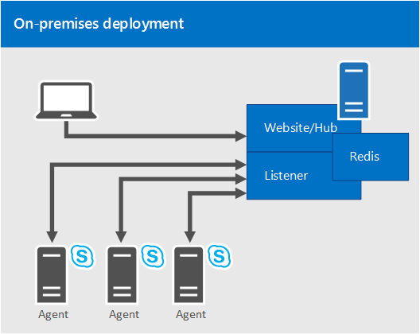

# 비즈니스용 Skype 서버 통계 관리자에 대한 계획Plan for Statistics Manager for Skype for Business Server

**요약:** 비즈니스용 Skype 서버용 통계 관리자에 대 한 자세한 내용은이 항목을 참조 하세요.**Summary:** Read this topic to learn about Statistics Manager for Skype for Business Server.

 비즈니스용 Skype Server의 통계 관리자는 비즈니스용 Skype 서버 상태 및 성능 데이터를 실시간으로 볼 수 있는 강력한 도구입니다.Statistics Manager for Skype for Business Server is a powerful tool that allows you to view Skype for Business Server health and performance data in real time. 여러 서버에서 성능 데이터를 몇 초 마다 폴링하거나 통계 관리자 웹 사이트에서 즉시 결과를 볼 수 있습니다.You can poll performance data across hundreds of servers every few seconds, and view the results instantly on the Statistics Manager Website.

통계 관리자를 사용 하 여 진행 중인 성능 문제를 식별 하 고, 환경에 대 한 계획 된 변경 결과를 확인 하 고, 중단 된 문제 해결을 추적할 수 있습니다.You can use Statistics Manager to identify ongoing performance issues, view the results of a planned change to your environment, track resolution of outages, and much more. 이 상자 밖의 통계 관리자는 KHI (키 상태 표시기) 임계값으로 구성 되며, 배포의 고유한 요구에 맞게 사용자 지정할 수 있습니다.Out of the box, Statistics Manager is configured with Key Health Indicator (KHI) thresholds, and can be customized to suit your deployment's unique needs.

단일 서버가 모든 서버 쪽 통계 관리자 구성 요소를 호스트 하는 온-프레미스 배포에서 통계 관리자를 배포할 수 있습니다.You can deploy Statistics Manager in an on-premises deployment in which a single server hosts all of the server-side Statistics Manager components. 통계 관리자 배포에 대 한 자세한 내용은 비즈니스용 [Skype 서버에 대 한 통계 관리자 배포](deploy.md)를 참조 하세요.For more information about deploying Statistics Manager, see [Deploy Statistics Manager for Skype for Business Server](deploy.md). 이미 통계 관리자 배포를 보유 하 고 있지만 릴리스 2.0으로 업그레이드 하지 않은 경우 비즈니스용 Skype 서버용 릴리스 2.0 및 [업그레이드 통계 관리자](upgrade.md) [의 새로운 기능](plan.md#BKMK_WhatsNew) 을 참조 하세요.If you already have an existing deployment of Statistics Manager, but you have not yet upgraded to Release 2.0, see [What's new in Release 2.0](plan.md#BKMK_WhatsNew) and [Upgrade Statistics Manager for Skype for Business Server](upgrade.md).

이 항목에서는 다음 섹션을 다룹니다.This topic contains the following sections:

- [기능 및 기능Features and capabilities](plan.md#BKMK_Features)

- [릴리스 2.0의 새로운 기능What's new in Release 2.0](plan.md#BKMK_WhatsNew)

- [구성Components](plan.md#BKMK_Components)

- [온-프레미스 배포On-premises deployment](plan.md#BKMK_DeploymentOptions)

- [요구 사항Requirements](plan.md#BKMK_Requirements)

- [보안 고려 사항Security considerations](plan.md#BKMK_Security)

## 기능 및 기능Features and capabilities

통계 관리자는 다음 작업을 수행할 수 있습니다.Statistics Manager allows you to:

- 실시간으로 모든 서버의 원시 데이터를 볼 때View raw data for all servers in real time. (데이터는 매우 높은 속도로 샘플링 되며 웹 사이트에는 1 초 이내에 전송 됩니다.)(Data is sampled at a very high rate and sent to the website in less than one second.)

- 특정 역할에 대해 집계 된 데이터를 봅니다. 예를 들어 프런트 엔드 서버, 중재 서버, Edge 서버 등입니다.View data that is aggregated for a specific role; for example, Front End Server, Mediation Server, Edge Server, and so on.

- 드릴 다운을 클릭 하 여 특정 사이트, 사이트 내의 특정 풀, 그리고 풀 내의 특정 서버에 대 한 데이터를 봅니다.Drill down to view data for specific sites, specific pools within the site, and then specific servers within the pool.

- 선택 된 카운터가 기본적으로 표시 되도록 사용자 지정 차트를 만듭니다.Create custom charts so that chosen counters are shown by default.

- X 축과 y 축 모두 또는 x 축을 기준으로 확대/축소 및 팬Zoom and pan on both the x- and y- axes or on the x-axis only.

- 날짜 범위 또는 시점을 사용 하 여 데이터를 필터링 합니다.Use date ranges or points in time to filter data.

- 설정 된 키 상태 표시기 (KHIs)를 기준으로 서버 성능을 확인 합니다.View server performance based on established key health indicators (KHIs). KHIs는 정상 범위가 정의 된 성능 카운터의 컬렉션을 나타냅니다.KHIs represent a collection of performance counters with a defined healthy range.

- 각 카운터에 대 한 자세한 메트릭을 봅니다.View detailed metrics for each counter.

- 여러 모집단 또는 서버에 걸친 데이터를 비교 합니다.Compare data across multiple populations or servers.

- 현재 데이터를 대시보드 서비스에 보고 하지 않는 에이전트를 식별 하는 알 수 없는 카운터 보고서를 확인 합니다.View latent counter reports to identify agents that are not reporting current data to the dashboard service.

- 차트 데이터의 특정 인스턴스를 파일에 저장 합니다.Save a particular instance of chart data to a file.

- 업데이트를 포함 하 여 실시간으로 KHIs.View KHIs in real time, including updates. 기록 보기를 사용 하도록 설정 하면 새 오류만 표시 됩니다.If the history view is enabled, only new failures are shown.

  - 한 번에 모든 KHIsView all KHIs at one time

  - 서버 별로 KHIs (가로 보기)View KHIs by server (Landscape view)

  - KHI 정의 보기View KHI definitions

## 릴리스 2.0의 새로운 기능What's new in Release 2.0

다음은 릴리스 2.0의 새로운 기능에 대 한 설명입니다.The following describes what's new in Release 2.0. 기존 통계 관리자 배포가 있지만 아직 업그레이드 하지 않은 경우 비즈니스용 [Skype 서버용 업데이트 통계 관리자](upgrade.md)를 참조 하세요.If you have an existing deployment of Statistics Manager and you've not yet upgraded, see [Upgrade Statistics Manager for Skype for Business Server](upgrade.md).

- Edge 미디어, 패브릭 상태, 풀 장애 조치 및 등록 시나리오에 대 한 시나리오 보기가 추가 되었습니다.Scenario views have been added for Edge Media, Fabric Health, Pool Failover and Registration scenarios.

- SQL server, 더 많은 비즈니스용 Skype 사용 카운터 등의 여러 가지 새로운 카운터가 추가 되었습니다.Many new counters have been added for SQL servers, more Skype for Business usage counters, and so on.

- 통계 관리자 에이전트에 대 한 감시자 노드 통합-에이전트가 감시자 노드에 설치 되어 있는 경우에는 통계가 통계 관리자에 대 한 카운터로 서의 가상 트랜잭션 통계를 보고 합니다.Watcher node integration for the Statistics Manager Agent - if the Agent is installed on a watcher node, it will report synthetic transaction statistics as counters back to Statistics Manager.

- 다양 한 안정성 및 성능 향상.Numerous reliability and performance improvements.

실행 중인 통계 관리자 웹 사이트의 버전을 확인 하려면 다음을 수행 합니다.To verify the version of the Statistics Manager Website you are running:

- 파일 탐색기에서 (기본 디렉터리) Files\Skype Business Server StatsMan에 대 한 C:\Program WebSite\binIn File Explorer, open (default directory) C:\Program Files\Skype for Business Server StatsMan WebSite\bin

- StatsManHubWebSite를 마우스 오른쪽 단추로 클릭 하 고 속성 보기Right click on StatsManHubWebSite.dll and view its properties

- 제품 버전이 설명 세부 정보에 표시 됩니다.The product version will be shown in the Description details.

## 구성Components

통계 관리자는 다음 구성 요소로 구성 되어 있습니다.Statistics Manager consists of the following components:

- **에이전트.****Agent.** 모니터링 되는 각 서버에서 실행 되는 경량 에이전트A lightweight agent that runs on each monitored server. 에이전트는 로컬 집계를 사용 하 여 성능 카운터에 대해 구성 가능한 높은 속도 폴링을 허용 합니다.The Agent allows configurable high rate polling of performance counters with local aggregation.

- **수신기.****Listener.** 모든 에이전트에서 데이터를 수신 하는 서버 쪽 API를 통해 모집단 간에 데이터를 집계 합니다.The server side API that receives data from all Agents, and aggregates data across populations.

- **허브.****Hub.** 시스템에 대 한 클라이언트 API 역할을 하며 웹 서버에서 실행 되며 웹 사이트를 통해 연결 된 클라이언트에 실시간 데이터 업데이트를 제공 합니다.Serves as the client API for the system, runs on the web server(s), and provides real-time data updates to clients connected via the website. (허브는 웹 사이트 msi의 일부로 자동으로 설치 됩니다.)(The Hub is automatically installed as part of the Website msi.)

- **웹 사이트.****Website.** 시스템에서 사용할 수 있는 모든 기능을 함께 가져오는 사용자 인터페이스입니다.A user interface that pulls together all the features available in the system.

또한, 통계 관리자에는 메모리 내 캐싱에 개방형 원본 데이터 구조 서버인 **Redis**이 필요 합니다.In addition, Statistics Manager requires **Redis**, an open-sourced data structure server for in-memory caching. Redis를 다운로드 하는 방법에 대 한 자세한 내용은 [통계 관리자 배포](deploy.md#BKMK_Deploy) 를 참조 하세요.For more information about downloading Redis, see [Deploy Statistics Manager](deploy.md#BKMK_Deploy) .

## 온-프레미스 배포On-premises deployment

온-프레미스 배포의 경우 단일 서버가 모든 서버 쪽 통계 관리자 구성 요소를 호스팅합니다.In an on-premises deployment, a single server hosts all of the server-side Statistics Manager components.

다음 다이어그램에서는 통계 관리자 웹 사이트, 허브, 수신기 및 Redis 캐싱 시스템이 단일 컴퓨터에서 호스팅되는 온-프레미스 배포를 보여 줍니다.The following diagram shows an on-premises deployment, in which the Statistics Manager Website, Hub, Listener, and Redis caching system are hosted on a single machine. 통계 관리자는 세 개의 비즈니스용 Skype 서버를 모니터링 하 고 있으며, 각각은 단일 에이전트가 데이터를 수신기로 전송 합니다.Statistics Manager is monitoring three Skype for Business servers, each of which have a single Agent transmitting data to the Listener. 사용자가 단일 웹 사이트에 연결 하 여 통계 관리자가 집계 한 모든 데이터를 볼 수 있습니다.Users connect to a single Website to view all data aggregated by Statistics Manager:

## 요구 사항Requirements

통계 관리자를 배포 하기 전에 다음 소프트웨어, 네트워킹 및 하드웨어 요구 사항을 고려해 야 합니다.You will need to consider the following software, networking, and hardware requirements before you deploy Statistics Manager.

### 소프트웨어 요구 사항Software requirements

- Windows Server 2016 및 2019Windows Server 2016 and 2019

- IIS (자동으로 설치 됨)IIS (automatically installed)

- RedisRedis

- 통계 관리자 서비스 (자동 설치 됨)Statistics Manager services (automatically installed)

- PSExec-원격 에이전트 배포에 필요PSExec - Required to do remote agent deployment

- .NET 4.5 (2012 R2에 포함)-에이전트 및 서버 쪽 구성 요소에 필요.NET 4.5 (included with 2012 R2) - Required for agents and server-side components
- [비즈니스용 Skype Server, 실시간 통계 관리자 다운로드 (64 비트)](https://www.microsoft.com/en-in/download/details.aspx?id=57518)Download the [Skype for Business Server, Real-Time Statistics Manager (64-bit)](https://www.microsoft.com/en-in/download/details.aspx?id=57518)

### 네트워킹 요구 사항Networking requirements

|**호스팅 서버****Hosting server**|**기록해****Agents**|**수신기****Listener**|
|:-----|:-----|:-----|
|최소 기가 비트 전이중 네트워킹.Minimum gigabit full duplex networking.    |수신기와 통신 하는 아웃 바운드 TCP 포트 8443 (사용자 지정 가능 포트 번호).Outbound TCP port 8443 (customizable port number) to communicate with the Listener.    |수신기 포트는 모든 서버에서 동일 해야 합니다.The Listener port must be the same on all servers.    |
|웹 사이트를 호스팅하기 위해 인바운드 TCP 포트 80 또는 443이 열려 있습니다.Inbound TCP port 80 or 443 open to host the website.    |||
|에이전트와 통신 하는 데 사용할 인바운드 TCP 포트 8443 (사용자 지정 가능 포트 번호).Inbound TCP port 8443 (customizable port number) for the agents to communicate with it.    |||

설치 하는 동안 수신기 및 웹 사이트에 대 한 방화벽 포트가 자동으로 만들어집니다.During installation, firewall ports for the Listener and the Website are automatically created. 에이전트의 경우 설치는 기본적으로 아웃 바운드 TCP 연결을 허용 한다고 간주 합니다.For the Agents, the installation assumes that outbound TCP connections are allowed by default.

### 하드웨어 요구 사항Hardware requirements

단일 서버가 모든 서버 쪽 통계 관리자 구성 요소를 호스트 하는 온-프레미스 배포의 경우, RAM이 16gb이 고 CPU가 4 개 있는 서버는 평균적으로 초당 150 샘플에 대해 지원할 수 있어야 합니다.In an on-premises deployment, in which a single server hosts all of the server-side Statistics Manager components, a server with 16 GB of RAM and 4 CPU's should be able to support about 150 samples per second on average. 지원할 수 있는 카운터/에이전트 수를 확인 하려면 다음 계산을 사용 합니다.To determine how many counters/agents you can support, use the following calculation:

100 서버 \*80 카운터 \* 1 초 당 각 상담원/60 초 = ~ 133 샘플의 분당 샘플 수.100 servers \*80 counters \* 1 sample per minute from each agent / 60 seconds = ~ 133 samples per second.

## 보안 고려 사항Security considerations

서버 간의 모든 트래픽이 암호화 됩니다.All traffic between servers is encrypted.

- 암호화 된 HTTPS 트래픽은 포트 8443 (기본적으로)를 통해 에이전트에서 수신기 서버로 전송 됩니다.Encrypted HTTPS traffic will be sent over port 8443 (by default) from the Agent to the Listener server.

- 에이전트는 수신기 서버가 예상 받는 사람 인지 확인 하기 위해 서버의 SSL 지문을 확인 합니다.The Agent will verify the SSL thumbprint on the server to ensure the Listener server is the expected recipient. 에이전트는 체인 확인 대신 인증서 지문 확인을 사용 합니다.Note that the Agent uses certificate thumbprint verification (instead of chain verification). 자체 서명 된 인증서를 사용할 수 있기 때문에 전체 인증서 유효성 검사를 수행 하지 않습니다.It will not do full certificate validation because it is possible to use self-signed certificates.

- 에이전트를 만족 하는 경우 수신기가 인증 되 고 나면 에이전트는 수신기에 의해 확인 되는 암호를 제시 합니다.After the Agent is satisfied the Listener is authentic, a password will be presented by the Agent which is then verified by the Listener.

- 에이전트는 수신기에 대 한 연결을 통해 성능 데이터를 전송 하기 시작 합니다.The Agent begins transmitting performance data over the connection to the Listener.

## 자세한 내용은For more information

자세한 내용은 다음을 참조 하세요.For more information, see the following:

- [비즈니스용 Skype 서버 통계 관리자 배포Deploy Statistics Manager for Skype for Business Server](deploy.md)

- [비즈니스용 Skype 서버 통계 관리자 업그레이드Upgrade Statistics Manager for Skype for Business Server](upgrade.md)

- [비즈니스용 Skype 서버 통계 관리자 문제 해결Troubleshoot Statistics Manager for Skype for Business Server](troubleshoot.md)
