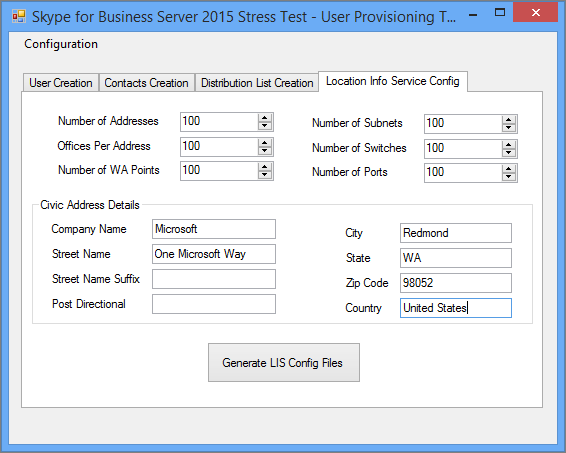

# 비즈니스용 Skype Server 2015 스트레스 및 성능 도구에 맞게 정책 구성Configuring policies for the Skype for Business Server 2015 Stress and Performance Tool
 
비즈니스용 Skype 서버 2015 스트레스 및 성능 도구에 대 한 정책 구성입니다.Policy configuration for Skype for Business Server 2015 Stress and Performance Tool.
  
스트레스 및 성능 도구를 실행 하기 전에 비즈니스용 Skype Server 2015에서 구성할 수 있는 몇 가지 정책과 기타 영역이 있습니다.There are several policies and other areas that you can configure in Skype for Business Server 2015, prior to running the Stress and Performance Tool:
  
- [보관 정책Archiving policy](configuring-policies.md#ArchivingPolicy)
    
- [회의 정책Conferencing policy](configuring-policies.md#ConferencingPolicy)
    
- [연락처 정책Contacts policy](configuring-policies.md#ContactsPolicy)
    
- [페더레이션 정책Federation policy](configuring-policies.md#FederationPolicy)
    
- [통화 허용 제어 정책Call Admission Control policy](configuring-policies.md#CACPolicy)
    
- [음성 라우팅 규칙Voice Routing rules](configuring-policies.md#VoiceRoutingRules)
    
- [컨퍼런스 전화 교환 응용 프로그램Conference Attendant application](configuring-policies.md#ConfAttendantApp)
    
- [서버 통화 공원 서비스Server Call Park service](configuring-policies.md#ServerCallParkServ)
    
- [비상 전화Emergency calls](configuring-policies.md#EmergencyCalls)
    
- [응답 그룹 응용 프로그램 구성Configuring Response Group application](configuring-policies.md#ConfigResponseGroupApp)
    
## 보관 정책Archiving policy

비즈니스용 Skype 서버 토폴로지에 배포 된 보관 서버가 있는 경우 ArchivingPolicy 스크립트를 볼 수 있습니다.If you have an Archiving server deployed in your Skype for Business Server topology, you can look at the ArchivingPolicy.ps1 script. 추가 지원이 필요한 경우 보관 및 웹 회의 cmdlet을 확인 하세요.If you need further assistance, check out the Archiving and Web Conferencing cmdlets.
  
## 회의 정책Conferencing policy

회의의 경우 MeetingPolicy 스크립트가 있습니다.For conferencing, we have the MeetingPolicy.ps1 script. 추가 지원이 필요한 경우 웹 회의 cmdlet을 확인 하세요.If you need further assistance, check out the Web Conferencing cmdlets.
  
## 연락처 정책Contacts policy

연락처 Spolicy 스크립트는 검토 해야 하는 샘플입니다.ContactsPolicy.ps1 script will be the sample you'll need to review. 추가 참조가 필요한 경우 메신저 대화 및 현재 상태 cmdlet이 도움이 됩니다.The IM and Presence cmdlets will help if you need further references.
  
## 페더레이션 정책Federation policy

페더레이션에 대 한 샘플 스크립트는 FederationPolicy입니다.The sample script for federation is FederationPolicy.ps1. 검토가 필요한 경우에는 Edge 서버, 페더레이션 및 외부 액세스를 확인할 cmdlet입니다.The cmdlets to review, if you need further insight, will be Edge Server, federation, and external access.
  
## 통화 허용 제어 정책Call Admission Control policy

이 정책에 대해 BandwidthPolicy를 참조할 수 있습니다.You can reference BandwidthPolicy.ps1 for this policy. 또한 통화 허용 제어 cmdlet에는 추가 정보가 포함 됩니다.The Call Admission Control cmdlets will have further information as well.
  
## 음성 라우팅 규칙Voice Routing rules

음성 라우팅에 대 한 RoutingRules 샘플 스크립트가 필요 합니다.You'll need the RoutingRules.ps1 sample script for Voice Routing. 이러한 규칙을 구성 하는 경우 사용자를 만들 때 지정할 수 있도록 전화 컨텍스트 (/위치 프로필 또는/SimpleName) 및 내부/외부 지역 코드를 기록해 둡니다.When you're configuring these rules, take note of the phone context (that is, /Location Profile or /SimpleName) and Internal/External Area Codes, so that you can specify them when creating users. 또한 L Cperf도구 구성 중에도 필요 합니다 (특히 PSTN-UC 및 UC-PSTN 용).You'll also need them during LyncPerfTool configuration (specifically for PSTN-UC and UC-PSTN).
  
예를 들어 RoutingRules의 **새-CsDialPlan 플랜** cmdlet에 대 한 호출의 simplename 매개 변수는 다음 UserProfileGenerator 그림의 locationprofile 값에 사용 해야 합니다.For example, the SimpleName parameter in the call to the **New-CsDialPlan** cmdlet in the RoutingRules.ps1 example should be used for the LocationProfile value in the following figure of UserProfileGenerator.exe:
  

  
자세한 내용은 엔터프라이즈 음성 cmdlet을 검토 하면 됩니다.For details, you can review the Enterprise Voice cmdlets.
  
## 컨퍼런스 전화 교환 응용 프로그램Conference Attendant application

먼저 ConferenceAutoAttendantConfiguration 스크립트를 검토 합니다.First review the ConferenceAutoAttendantConfiguration.ps1 script. 다음과 같이 구성 생성을 위한 LConferencingAutoAttendant Cperf도구 구성 도구에 입력할 수 있도록 기본적으로 1121111111 전화 번호를 기록해 야 합니다.You'll want to take note of the ConferencingAutoAttendant phone number (1121111111 by default), so that you can enter it into the LyncPerfTool configuration tool for configuration generation, as below:
  

  
회의 및 전화 접속 회의 cmdlet에서 자세한 내용을 확인할 수 있습니다.You'll find more details in the Conferencing and Dial-in Conferencing cmdlets.
  
## 서버 통화 공원 서비스Server Call Park service

기본적으로이 기능은 비활성화 되어 있습니다.This is actually disabled by default. 이를 테스트 해야 하는 경우 CallParkConfiguration 샘플 스크립트를 검토할 수 있습니다.You can review the CallParkConfiguration.ps1 sample script if you need to test this. 또한 필요에 따라 통화 공원 응용 프로그램 cmdlet을 확인 하세요.Additionally, check out the Call Park Application cmdlets as needed.
  
## 비상 전화Emergency calls

비상 전화에 대 한 스트레스 및 성능 테스트를 구성 하려면 다음 단계를 수행 해야 합니다.You'll need to perform the following steps to configure stress and performance testing for emergency calls:
  
1. 비상 전화에 대 한 음성 경로를 설정 합니다.Set up a voice route for emergency calls. RoutingRules 스크립트를 사용 하 고 " **PSTN으로 E911 라우팅** " 설명 아래에서이 음성 경로를 설정 하는 방법에 대 한 예를 확인 합니다.You can use the RoutingRules.ps1 script, and check under the comment " **Route E911 to PSTN** " for an example of how to set up this voice route.
    
    > [!CAUTION]
    > RoutingRules의 예제 명령에 911이 아닌 숫자 119를 포함 하는 숫자 패턴이 있습니다.The example command in RoutingRules.ps1 has a number pattern that includes the number 119 rather than 911. 911 (또는 실제 지역 비상 전화 번호)을 사용 하 여 부하 테스트 중에 지역 긴급 운영자에 게 실수로 전화를 하지 않도록 해야 합니다.You should avoid using 911 (or your actual local emergency number) to prevent accidental calls to your local emergency operators during your load testing. 이 구성은 시뮬레이션 용도로만 사용 된다는 점에 유의 하세요.Remember, this configuration is for simulation purposes only! 
  
2. 다음 그림과 같이 UserProvisioningTool의 **위치 정보 서비스 구성** 탭에 있는 값을 입력 하 여 주소를 구성 합니다.Configure addresses by filling in the values on the **Location Info Service Config** tab in the UserProvisioningTool, as shown in the following figure:
    
     
  
3. 모든 내용을 UserProvisioningTool에 입력 한 후에는 **LIS Config 파일 생성** 단추를 클릭 합니다.When you've entered everything into the UserProvisioningTool, click the **Generate LIS Config Files** button.
    
4. 이제 스트레스 및 성능 도구에 대 한 XML 파일은 물론 포트, 서브넷, 스위치 및 WAPs (무선 액세스 지점)에 대 한 CSV 파일도 생성 됩니다.Now CSV files for ports, subnets, switches, and wireless access points (WAPs), as well as an XML file for the Stress and Performance tool will be generated. LisConfiguration. ps1 스크립트를 사용 하 여 LIS (위치 정보 서비스)를 구성할 때 입력에 CSV 파일을 사용할 수 있습니다.You can use the CSV files for inputs when configuring the Location Information service (LIS) with the LisConfiguration.ps1 script. 이 작업을 수행 하려면 스트레스 및 성능 도구 실행 파일 (L<c13> Cperftool. exe)과 동일한 폴더를 Locations0로 이동 해야 합니다.To do this, you'll need to move the Locations0.xml file to the same folder as the Stress and Performance Tool executable (LyncPerfTool.exe). 이렇게 하면 위치 프로필 (다이얼 플랜) 시나리오를 실행할 수 있습니다.This will let you run location profile (dial plan) scenarios.
    
## 응답 그룹 응용 프로그램 구성Configuring Response Group application

샘플 스크립트는 ResponseGroupConfiguration. ps1입니다.The sample script is ResponseGroupConfiguration.ps1. 추가 구성 세부 정보를 검토 하는 응답 그룹 응용 프로그램 cmdlet도 있습니다.There are also Response Group application cmdlets to review for further configuration details. 다음 다이어그램은 몇 가지 구성 세부 정보를 보여 줍니다.The following diagram will show some of the configuration details:
  

  

