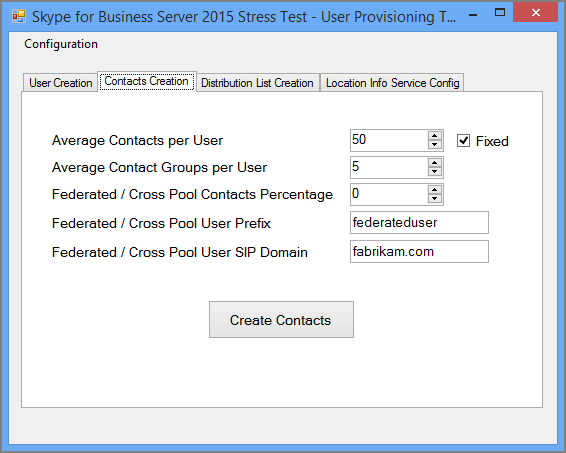
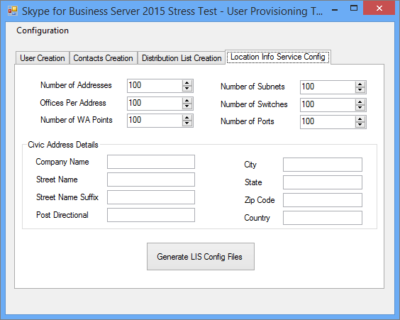
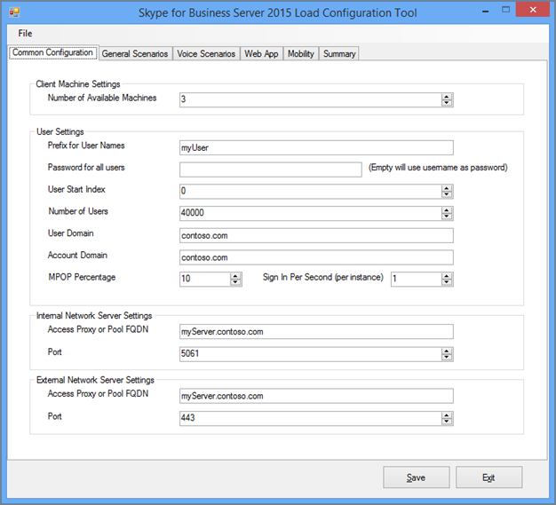
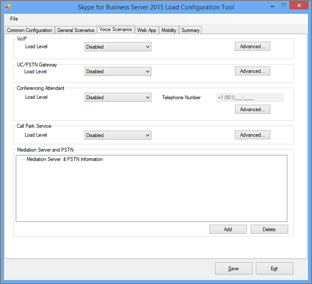
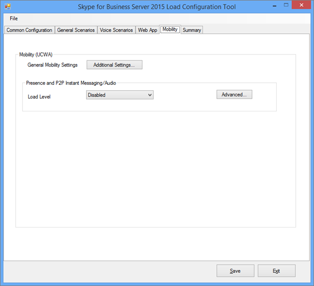

# <a name="using-the-skype-for-business-server-2015-stress-and-performance-tool"></a>비즈니스용 Skype 서버 2015 스트레스 및 성능 도구 사용
 
비즈니스용 Skype 서버 2015 스트레스 및 성능 도구를 실행 하려면 사용자, 연락처 및 사용자 프로필을 모두 관리 하 고, 실행할 도구를 구성한 다음 도구에 의해 생성 되는 출력 또는 결과를 검토 해야 합니다.
  
비즈니스용 Skype 서버 2015 스트레스 및 성능 도구를 실행 하는 데는 네 가지 영역이 있습니다 (실행 파일은 L Cperftool. exe).
  
- [사용자 및 연락처 만들기](using-the-tool.md#BKMK_CreateUsersAndContacts)
    
- [사용자 프로필 구성](using-the-tool.md#BKMK_UserProfile)
    
- [L Cperf도구 실행](using-the-tool.md#BKMK_RunTool)
    
- [결과 해석](using-the-tool.md#BKMK_Interpret)
    
## <a name="create-users-and-contacts"></a>사용자 및 연락처 만들기
<a name="BKMK_CreateUsersAndContacts"> </a>

스트레스 및 성능 테스트를 위해 사용자 및 연락처를 만들려면 비즈니스용 Skype 서버 2015 (SB 2015) 사용자 프로비저닝 도구 (UserProvisioningTool)를 사용 해야 합니다.
  
이는 항목을 읽을 때 유용할 수 있는 유용한 용어 목록입니다.
  
- **조직 구성 단위** -AD DS (Active Directory 도메인 서비스) OU (조직 구성 단위)입니다.
    
- **페더레이션/교차 풀** -다른 IM (인스턴트 메시징) 서비스에서 사용자와 통신할 수 있는 사용자입니다.
    
- **메일** 그룹 또는 dl. Ad DS 사용자 목록을 포함 하는 AD DS의 개체입니다. 사용자 그룹 간의 통신을 촉진 하는 데 사용 됩니다.
    
- **위치 정보 서비스** -휴대폰에서 사용 하도록 설정 하 고 구성 하는 비즈니스용 Skype 서버 2015 서비스는 향상 된 911 (E911) 서비스에 대 한 실제 위치 검색을 허용 합니다.
    
- **미국 전화 번호** -역방향 번호 조회 (RNL)에서 인바운드 및 아웃 바운드 호출을 라우팅하는 데 사용 되는 SIP URI 외에 사용자에 게 할당 된 전화 번호입니다.
    
### <a name="create-users-and-contacts-by-using-userprovisioningtoolexe"></a>UserProvisioningTool를 사용 하 여 사용자 및 연락처 만들기

> [!NOTE]
> 시작 하기 전에 도메인 관리자 보안 그룹의 구성원으로 로그인 하 여이 도구를 실행 해야 합니다. Active Directory 사용자를 만들기 때문에이 작업을 수행 해야 합니다. 
  
부하 시뮬레이션을 위해 사용자 및 연락처를 만들려면 비즈니스용 Skype 서버 사용자 프로 비전 도구를 사용 해야 합니다.
  
비즈니스용 **Skype 서버 사용자 프로비저닝 도구** 는 비즈니스용 **skype 서버 스트레스 및 성능 도구** 패키지와 함께 설치 됩니다. 패키지 설치 관리자 (CapacityPlanningTool)가 프런트 엔드 서버 또는 테스트할 Standard Edition 서버에서 실행 되었는지 확인 합니다.
  
프런트 엔드 서버 또는 Standard Edition Server에서 UserProvisioningTool (% InstalledDirectory% LyncStressAndPerfTool \ L C스트레스가에 위치)를 실행 하 여 비즈니스용 Skype 서버 사용자 제공 도구를 시작할 수 있습니다.
  
> [!IMPORTANT]
> 많은 수의 사용자를 만들 때 (예: 1만 이상) UserProvisioningTool를 실행 합니다. 도구가 *새* 광고 사용자를 만들고 구성 하기 때문에이 작업을 수행 해야 합니다.
  
사용자 프로비저닝 도구가 열리면 구성을 클릭 하 고 로드 구성을 선택 합니다. 
  
사용자 및 연락처 구성을 시작 하려면 패키지에 포함 된 기본 파일 ("SampleData")을 로드 합니다. 이렇게 하면 배포에 맞게 변경 해야 하는 예제 데이터를 사용 하 여 필드의 미리 채우기가 수행 됩니다.
  
사용자 지정 설정이 이미 포함 되어 있는 미리 구성 된 XML 파일이 있는 경우 해당 파일을 로드할 수 있습니다. 아래 섹션에서 설명 하는 대로 사용자 프로비저닝 도구에 필드를 입력 합니다.
  
### <a name="to-configure-server-options"></a>서버 옵션을 구성 하려면 다음을 수행 합니다.

1. **프런트 엔드 풀 fqdn** 필드에 Standard Edition SERVER의 fqdn (정규화 된 도메인 이름) 또는 사용자를 호스트할 프런트 엔드 풀을 입력 합니다.
    
2. **사용자 이름 접두사** 필드에 테스트 목적으로 사용자 이름을 bust 하는 데 사용할 접두사를 입력 합니다 (예: "TestUser").
    
3. **암호** 필드에 모든 테스트 사용자 계정에서 사용 될 암호를 입력 합니다.
    
4. **계정 도메인** 필드에 현재 AD 도메인의 도메인 이름 (테스트 사용자를 만들려는 대상)을 입력 합니다.
    
5. **조직 구성 단위** 필드에 이러한 테스트 사용자를 만들 광고 도메인의 이름을 입력 합니다. OU가 아직 없는 경우 생성 됩니다.
    
6. **전화 번호 지역 번호** 필드에 모든 테스트 사용자 계정에서 사용할 세 자리 지역 번호를 입력 합니다. 선택한 지역 번호가 광고의 다른 사용자 지역 코드와 충돌 하지 않도록 합니다.
    
7. 엔터프라이즈 음성에 대 한 테스트 사용자를 사용 하도록 설정 하려면 **음성 사용** 확인란을 클릭 하 여 선택 합니다.
    
8. **사용자 수** 필드에 만들려는 총 테스트 사용자 수를 지정 합니다.
    
9. **시작 인덱스** 필드에서 사용자 이름 접두사에 대 한 접미사로 사용할 시작 번호를 지정 합니다 (예: 접두사는 "TestUser"이 고, 첫 번째 이름은 아래 예제에서 "0"으로 종료 됨).
    
     
  
#### <a name="create-users-button"></a>사용자 만들기 단추

**사용자 만들기** 단추를 클릭 하면 입력 한 입력 매개 변수의 유효성이 검사 됩니다. 유효성 검사 오류가 있는 경우 오류를 수정 하 라는 메시지가 표시 됩니다. 또는 모든 값이 올바르면 사용자가 지정한 OU에 관계 없이 AD에 표시 됩니다. 도구를 실행할 때 진행률 표시줄이 표시 됩니다. 진행률 표시줄이 활성 상태인 동안에는 응용 프로그램을 닫지 마세요.
  
사용자 만들기에는 시간이 소요 되므로 적절 하 게 계획을 세워야 합니다. 이 프로세스는 소수의 사용자를 위해 몇 분에서 많은 사용자를 위해 몇 시간까지 소요 될 수 있습니다.
  
테스트 환경에서 AD 도메인 컨트롤러에 대 한 액세스 권한이 없는 경우에는 사용자가 만드는 사용자 범위에 있는 사용자 중 한 명으로 로그인 하 여 사용자 만들기의 유효성을 검사할 수 있습니다. 접두사와 접미사는 사용자 이름으로 @sipDomain 함께 사용 해야 합니다. 예: <em>TestUser20@contoso.net</em> .
  
> [!NOTE]
> 사용자가 이미 있는 경우 사용자 만들기 단추를 클릭 하면 구성 변경 내용으로 업데이트 됩니다. 
  
#### <a name="delete-users-button"></a>사용자 삭제 단추

**사용자 삭제** 단추를 클릭 하면 탭의 입력 매개 변수 유효성이 검사 됩니다. 유효성 검사 오류가 있는 경우 해당 오류를 해결 하 라는 메시지가 표시 되 고 입력 값이 올바르면 지정 된 테스트 사용자가 Active Directory에서 비활성화 되 고 삭제 됩니다. 이 탭의 아래쪽에 진행률 표시줄이 표시 되 고 진행률 표시줄이 활성 상태인 동안에는 응용 프로그램을 닫을 수 없습니다.
  
> [!NOTE]
> 미국 형식의 전화 번호만 지원 됩니다. 전화 번호는 항상 사용자에 게 할당 되며 UserProvisioningTool에서 만든 모든 사용자는 기본적으로 Enterprise Voice에 대해 설정 됩니다. 전화 번호를 사용 하는 모든 시나리오 (예: 회의 자동 전화 교환 또는 UC-PSTN 통화)는이 전화 번호를 사용 하 여 통화를 올바르게 라우팅합니다. 이러한 이유로 *모든 사용자* 는 *고유한 전화 번호* 를가지고 있어야 합니다.
  
> [!NOTE]
> **사용자를 두 번 만들어야 하는 경우 다른 지역 번호를 사용 하지 않거나 이전 사용자가 CsUser cmdlet을 사용 하 여 비활성화 된 경우를 제외 하 고 명령이 실패 합니다.**
  
> [!IMPORTANT]
> 연락처를 만들기 전에 먼저 사용자 복제를 완료 해야 합니다 (사용자 탭에서 수행 됨). 
  
> [!IMPORTANT]
> 방금 사용자를 만든 경우 비즈니스용 Skype 서버 복제가 완료 될 때까지 기다린 후 데이터베이스의 사용자 계정을 채울 필요가 있습니다. **사용자가 복제를 완료 하지 않은 경우 오류가 표시 됩니다.** 비즈니스용 Skype 서버 2015 프론트 엔드 서비스가 시작 된 경우 또는 사용자가 지정한 총 번호의 마지막 사용자에 대 한 가져오기-CsUser cmdlet을 성공적으로 실행 하는 경우이를 확인할 수 있습니다.
  
#### <a name="contacts-creation-tab"></a>연락처 만들기 탭

이 탭에서는 테스트에 대 한 사용자의 연락처 세부 정보를 제공할 수 있습니다.
  

  
### <a name="to-configure-users-contacts-do-the-following"></a>사용자의 연락처를 구성 하려면 다음을 수행 합니다.

1. **사용자 당 평균 연락처** 필드에 각 사용자의 대화 상대 목록에 입력할 평균 연락처 수를 입력 합니다.
    
2. 모든 사용자에 대해 동일한 수의 연락처를 만들려면 **수정** 됨 확인란을 선택 합니다. 사용자에 게 생성 되는 연락처 수를 변경 하려면 해당 확인란의 선택을 취소 합니다.
    
3. **사용자 당 평균 대화 상대 그룹** 필드에 사용자 당 대화 상대 그룹 수를 입력 합니다. 이 번호는 **사용자 당 평균 연락처**보다 작아야 합니다.
    
4. **페더레이션된/교차 풀 연락처 백분율** 필드에 0과 100 사이의 숫자를 입력 합니다. 이 연락처의 백분율은 페더레이션 사용자와 함께 만들어집니다.
    
5. **페더레이션/교차 풀 사용자 접두사** 필드에서 로컬 사용자의 연락처 목록에 추가 될 페더레이션 사용자의 사용자 이름을 지정 합니다.
    
6. **페더레이션된/교차 풀 사용자 Sip 도메인** 필드에 페더레이션 사용자의 Sip 도메인 이름을 지정 합니다.
    
7. **사용자 만들기** 탭에서 정보가 정확한 지 확인 합니다. 사용자 만들기 탭의 값을 통해 연락처가 만들어집니다.
    
8. **연락처** 만들기를 클릭 하 여 연락처 만들기를 시작 합니다. 이 프로세스는 몇 분 정도 걸릴 수 있습니다. 완료 되 면 "작업이 완료 되었습니다." 라는 메시지가 표시 되는 대화 상자가 나타납니다. 사용자 만들기 탭에서 만든 사용자로 로그온 하 여 만든 연락처의 유효성을 검사할 수 있습니다.
    
> [!NOTE]
> 연락처를 만든 후이 도구는 대상 풀의 모든 프런트 엔드 서버를 다시 시작 합니다. 이 작업으로 만든 연락처 수에 따라 프런트 엔드 서버를 시작 하는 데 걸리는 시간이 최대 2 시간까지 길어질 수 있습니다. 
  
#### <a name="distribution-list"></a>메일 그룹

비즈니스용 Skype 서버 2015 스트레스 및 성능 도구는 비즈니스용 Skype 2015 클라이언트에서 DL (메일 그룹) 확장 기능을 시뮬레이션할 수 있습니다. 사용자 프로비저닝 도구에서 DL 확장을 사용 하지 않으려는 경우이 단계를 건너뛸 수 있습니다.
  

  
메일 그룹 탭에서 스트레스 및 성능 도구가 메일 그룹 확장 기능에 사용할 Dl을 만들 수 있습니다. Dl을 만들기 전에 ForestPrep를 실행 하는 것을 포함 하 여 비즈니스용 Skype 서버 2015를 배포 해야 합니다. 이 작업을 수행 하지 않으면 DL 특성이 광고 스키마에 존재 하지 않으므로 도구가 Dl을 만들 수 없게 됩니다.
  
### <a name="to-configure-distribution-lists"></a>메일 그룹을 구성 하려면 다음을 실행 합니다.

1. 메일 그룹 **수** 필드에 만들려는 dl의 총 수를 지정 합니다 (여기서는 사용자 수를 두 배로 하는 값으로 시작 하는 것이 권장 됨).
    
2. 메일 그룹 **접두사** 필드에 사용자가 만든 모든 dl에 사용할 접두사를 입력 합니다 (예: *testdl* ). 즉, 100 Dl에서 DL 이름에는 testDL0, testDL1, testDL99까지 등의 이름이 표시 됩니다.
    
3. 목록 필드 **의 최소 구성원** 에서 각 DL에 입력할 최소 사용자 수를 입력 합니다.
    
4. 목록 필드 **의 최대 구성원** 에서 각 DL에 추가할 최대 사용자 수를 입력 합니다.
    
#### <a name="create-distribution-lists-button"></a>메일 그룹 만들기 단추

메일 그룹 만들기 단추를 클릭 하면 도구는 Active Directory를 쿼리하여 접두사 및 번호와 일치 하는 메일 그룹이 이미 존재 하는지 확인 합니다. 이 도구는 아직 존재 하지 않는 Dl을 만듭니다. 새로 만든이 메일 그룹에 구성원을 추가 하는 경우 사용자 만들기 탭에 지정 된 범위에서 사용자를 선택 합니다.
  
#### <a name="location-info-service-config-tab"></a>위치 정보 서비스 구성 탭

비즈니스용 Skype 서버 2015 스트레스 및 성능 도구는 위치 정보 서비스에 대 한 더미 구성 파일을 생성할 수도 있습니다. 일반적으로 위치 정보 서비스는 서버에 중대 한 성능에 영향을 주지 않습니다. 
  

  
이 기능을 테스트 하도록 선택 하는 경우 양식에 값을 입력 하 고, 만들 LIS Config 파일 생성 단추를 클릭 합니다. CSV 파일 호출:
  
- LIS_Subnet
    
- LIS_Switches
    
- LIS_Ports
    
- LIS_WAP
    
이러한 파일을 LIS 데이터베이스로 가져오려면 다음 PowerShell cmdlet을 사용 합니다.
  
- Set-CsLisSubnet
    
- Set-CsLisSwitch
    
- Set-CsLisPort
    
- Set-CsWirelessAccessPoint
    
## <a name="configure-user-profile"></a>사용자 프로필 구성
<a name="BKMK_UserProfile"> </a>

사용자 만들기 도구를 통해 사용자를 만든 후 비즈니스용 Skype Server 2015 부하 구성 도구 (UserProfileGenerator)를 사용 하 여 사용자 프로필을 구성할 수 있습니다.
  
### <a name="running-the-skype-for-business-server-2015-load-configuration-tool"></a>비즈니스용 Skype 서버 2015 로드 구성 도구 실행

로드 구성 도구 (UserProfileGenerator)를 시작 하 고 탭을 입력 합니다. 이 도구는 시뮬레이션을 실행 하는 데 필요한 각 클라이언트 컴퓨터에 대 한 디렉터리를 만듭니다. 각 클라이언트 디렉터리에는 비즈니스용 Skype 서버 2015 스트레스 및 성능 도구를 시작 하는 스크립트와 함께 제공 됩니다 (L<c13> Cperftool. exe). 아래 섹션에서는 비즈니스용 Skype Server 2015 부하 구성 도구의 각 탭에 있는 필드를 채우는 방법을 보여 주는 예제를 제공 합니다.
  
> [!IMPORTANT]
> 로드 구성 도구 (UserProfileGenerator)에서 사용 되는 사용자 관련 값은 풀에 대 한 비즈니스용 Skype 서버 2015 사용자 만들기 도구 (UserProvisioningTool)에 지정 된 값과 일치 해야 합니다. 
  
#### <a name="common-configuration-tab"></a>일반 구성 탭

로드 구성 도구의 **공통 구성** 탭이 아래에 표시 됩니다. 일반 구성 탭의 필드를 다음 단계에 설명 된 대로 입력 합니다.
  

  
1. **사용할 수 있는 컴퓨터 수** 필드에 스트레스 및 성능 도구 (L cperftool. exe)를 실행 하는 데 사용할 컴퓨터 수를 입력 합니다. 모든 4500 사용자에 대해 컴퓨터 1 대를 사용 하는 것이 좋지만, 로드 수준을 줄이거나 도구의 사용 가능한 기능 중 일부만 사용할 경우 (로드 수준은 일반 시나리오 탭에서 설정 된 경우)에 따라 다를 수 있습니다.
    
2. **사용자 이름 접두사** 필드에 모든 사용자의 사용자 이름 필드에 대 한 접두사를 입력 합니다. URI (Uniform Resource Identifier)를 사용 하 여 로그인 하려면: *Userprefix [사용자 시작 색인 ...]을 사용 합니다. (사용자 수-1)] @User 도메인* (예: myUser009@Contoso.com).
    
3. **모든 사용자의 암호** 필드에 사용자를 만드는 동안 사용 되는 암호를 입력 합니다. 이 필드를 비워 두면 사용자 이름이 암호로 설정 됩니다.
    
4. **사용자 시작 인덱스** 필드에 구성할 첫 번째 사용자의 인덱스를 입력 합니다. 다양 한 형식 또는 부하 수준에 대해 서로 다른 범위를 구성할 수 있지만 구성 하려는 범위에 따라 로드 구성 도구 (UserProfileGenerator)를 실행 해야 합니다.
    
5. **사용자 수** 필드에 구성할 총 사용자 수를 입력 합니다.
    
6. **사용자 도메인** 필드에 SIP URI에 사용 되는 도메인을 입력 합니다. 이는 각 사용자의 SIP URI를 생성 하 여 비즈니스용 Skype 서버 2015 프런트 엔드 서버 또는 Standard Edition 서버에 로그온 하는 데 사용 되며 계정 도메인과 다를 수 있습니다.
    
7. **계정 도메인** 필드에 AD DS 도메인 로그온을 입력 합니다.
    
8. **MPOP 백분율** (현재 시점 표시 백분율) 필드에 여러 컴퓨터 또는 장치에서 로그온 한 사용자의 백분율 (예: 10%)에 대 한 값을 제공 합니다.
    
9. 초 **당 로그인 (인스턴스당)** 필드에 최대 동시 끝점 수를 입력 합니다. 이는 사용자에 대 한 최대 로그 기능 수 이며 권장 사항은 초당 2 (<= 2) 보다 작거나 같은 속도입니다.
    
10. **액세스 프록시 또는 풀 FQDN** 필드에 클라이언트가 연결할 서버의 정규화 된 도메인 이름 (FQDN)을 입력 합니다. 사용자가 외부에서 로그인 하는 경우에는 액세스 프록시를 입력 해야 합니다. 사용자가 internal 인 경우 해당 엔터프라이즈 풀 또는 Standard Edition 서버의 FQDN을 제공 합니다.
    
11. **포트** 필드에 사용자가 SIP에 대해 사용할 포트를 입력 합니다 (기본값은 5061입니다.
    
12. **외부 네트워크 서버 설정** 필드에 대해 액세스 프록시 또는 풀 FQDN과 다시 **포트**를 지정 합니다. 이러한 설정은 외부 끝점 부하 시뮬레이션에만 사용 됩니다.
    
#### <a name="general-scenarios-tab"></a>일반 시나리오 탭


  
실행할 항목을 결정 하거나 사용 하지 않도록 설정 하 여 제공 되는 각 일반 시나리오에 대해 부하 수준 및 매개 변수를 구성할 수 있습니다. 일반 옵션은 다음과 같습니다.
  
> [!NOTE]
> 모든 필드에 대 한 로드 수준 값 (지역 정보 서비스는 **사용할 수 없음**, **낮음**, **보통**, **높음**또는 **사용자 지정**)입니다. 설정을 선택 하 고 사용 하지 않도록 설정한 경우 각 클라이언트에 대 한 구성이 생성 됩니다. 높은 결과는 서버에서 지원 되는 최대 로드입니다. medium은 높은 부하의 60%입니다. low는 30%입니다. 
  
- **인스턴트 메시지-** 여기에는 피어 투 피어 및 회의가 포함 됩니다. 로드 수준에 적합 한 값을 선택 합니다.
    
- **오디오 회의-** 오디오 회의에 대 한 부하 수준만 ** 선택 합니다. 피어 투 피어 통화는 **음성 시나리오** 섹션에서 나중에 tackled 됩니다. **고급** 탭을 열고 MultiView을 사용 하도록 설정 합니다.
    
- **응용 프로그램 공유-** 응용 프로그램 공유에 대 한 부하 수준을 선택 합니다.
    
- **데이터 공동 작업-** 데이터 회의를 포함 하는 데이터 공동 작업에 대 한 부하 수준을 선택 합니다.
    
- **메일 그룹 확장** **고급** 단추를 클릭 하 고 사용자 만들기 도구 (UserProvisioningTool)의 DL 탭에 구성 된 동일한 값이 있는 필드를 입력 합니다. 부하 수준을 선택 합니다.
    
- **주소록 웹 쿼리-** 주소록 파일 다운로드가 아닌 주소록 조회 서비스입니다. 주소록 파일 다운로드에 대해이 기능을 사용 하도록 설정 하려면 **고급** 단추를 클릭 하 고 **EnableABSDownload** 를 True로 설정 합니다. 부하 수준에 대 한 값을 제공 합니다.
    
- **응답 그룹 서비스-** **고급** 단추를 클릭 하 고 응답 그룹 서비스 에이전트를 프로 비전 할 때 이미 만든 응답 그룹의 uri를 지정 합니다. 하나 이상의 응답 그룹을 선택 해야 합니다. 더 많은 기능을 사용 하려면 응답 그룹을 세미콜론으로 구분 합니다. 실제 값으로 **RGSUriSuffixStartIndex** 및 **RGSUriSuffixEndIndex** 를 업데이트 합니다. 부하 수준을 선택 합니다.
    
- **위치 정보 서비스-** 사용 또는 사용 안 함 중으로 로드 수준을 선택 합니다.
    
> [!NOTE]
> 각 시나리오에는 그 옆에 고급 단추가 있고, 기본 설정을 변형 하는 데 사용할 수 있는 확인란 집합을가지고 있습니다. 
  
- *Ad-hoc* 을 선택 하면 시간 동안 생성 되는 회의 시뮬레이션이 도구에 생성 될 수 있습니다.
    
- *대형* 컨퍼런스를 선택 하면 대규모 회의 시나리오가 시뮬레이트된 것을 의미 합니다.
    
-  *외부* 는 도구에 게 외부 사용자를 시뮬레이트하기도 록 합니다.
    
이러한 단추와 확인란은 각 시나리오와 관련 된 추가 값으로, 스트레스 및 성능 도구의 동작을 변경 하 고 사용자 지정할 수 있도록 하는 것입니다.
  
일반 시나리오 탭의 각 시나리오 (위치 정보 서비스 제외)의 경우 로드 수준 값이 **사용자 지정**이면 고급 대화 상자의 해당 필드를 사용 하 여 대화 속도를 계산 합니다. 필드 이름은 시나리오에 따라 다를 수 있지만, 필드 설명은 다음과 같습니다. *참고이 번호는 드롭다운 메뉴에서 사용자 지정이 선택 된 경우에만 사용 됩니다* .
  
값이 **높음**, **중간**, **낮음**인 경우 모든 시나리오의 잔고에 해당 하는 사용자 모델을 사용 하 여 적용 된 모달 대화의 요금을 변경할 수 있습니다. 예상 사용량의 차이로 인해 각 모달의 로드 수준을 변경 해야 하는 경우 사용자 지정 대화 속도를 사용 합니다.
  
#### <a name="voice-scenarios-tab"></a>음성 시나리오 탭

이 탭을 통해 모든 음성 관련 시나리오를 구성할 수 있습니다.
  

  
옵션은 다음과 같습니다.
  
- **VoIP-** **고급** 단추를 클릭 하 고 PhoneAreaCode 및 locationprofile (다이얼 플랜) 필드에 대 한 값을 추가 합니다. 또한 로드 수준에 대 한 값을 제공 합니다. VoIP 또는 UC/PSTN 게이트웨이를 사용할 수 있도록 설정 된 경우, 외부 통화를 시뮬레이트하기 위해 PSTN (통합 통신 네트워크) 구성 파일이 생성 됩니다.
    
- **UC/PSTN 게이트웨이-** 부하 수준 값을 선택 해야 하며, 사용 안 함을 제외한 다른 항목을 선택 하면, **고급** 단추를 클릭 하 여 PSTN 지역 코드에 대 한 값을 제공 하 게 됩니다. 중재 서버 및 PSTN 아래에서 **추가** 를 클릭 합니다. 지역 번호에 대해 경로가 구성 되어 있는지 확인 합니다.
    
    > [!TIP]
    > Skype for Business 제어판 또는 비즈니스용 Skype 관리 셸을 사용 하 여 음성 경로 구성을 확인할 수 있습니다. 
  
- **회의 수행자-** 로드 수준에 대 한 값을 제공 합니다. 사용 안 함을 제외한 모든 값은 **전화 번호** 필드를 사용 합니다. 사용할 자동 전화 교환의 전화 번호를 입력 합니다. **고급** 을 클릭 하 고 **locationprofile** 필드에 대 한 값을 지정 합니다.
    
- **통화 파킹 서비스-** 여기서는 부하 수준을 제공 합니다.
    
- **중재 서버 및 PSTN-** 사용 하려는 각 중재 서버에는 고유한 PSTN 시뮬레이터가 필요 합니다. 시뮬레이터에 사용할 클라이언트를 결정 한 후에는 사용자가 구성한 PSTN Simulator에서 해당 컴퓨터로 호출을 라우팅하도록 중재 서버를 구성 합니다. **추가** 단추를 클릭 하 여 중재 서버의 값을 구성 합니다.
    
    > [!NOTE]
    > 각 시나리오에는 옆에 고급 단추가 있습니다. 고급 대화 상자에는 스트레스 및 성능 도구의 동작을 변경 하 고 사용자 지정을 활성화 하는 각 시나리오에 대 한 설정이 포함 되어 있습니다. 음성 시나리오 탭의 각 시나리오에 대 한 > 로드 수준의 값이 **사용자 지정**인 경우에는 대화 비율이 고급 대화 상자의 해당 필드를 사용 하 여 계산 됩니다. 필드 이름은 시나리오에 따라 다를 수 있지만, 필드 설명은 다음과 같습니다. *참고이 번호는 드롭다운 메뉴에서 사용자 지정이 선택 된 경우에만 사용 됩니다* .
  
#### <a name="web-app-tab"></a>웹 앱 탭


  
웹 앱은 프런트 엔드 서버에 설치 된 통합 커뮤니케이션 웹 API (와) 서버를 통해 회의 시나리오를 지원 합니다. 웹 앱 탭을 사용 하 여 모든 웹 앱 관련 시나리오를 구성 합니다. 옵션은 다음과 같습니다.
  
- **일반 웹 앱 설정-** **추가 설정** 단추를 클릭 하 고 **ReachTargetServerUrl** 를 프런트 엔드 풀 vip의 디렉터리 풀 vip (가상 IP)로 설정 합니다.
    
- **응용 프로그램 공유-** 로드 수준에 대 한 값을 선택 합니다.
    
- **데이터 공동 작업-** 로드 수준에 대 한 값을 선택 합니다.
    
- **인스턴트 메시지-** 로드 수준에 대 한 값을 선택 합니다.
    
- **음성 회의-** 로드 수준에 대 한 값을 선택 합니다.
    
> [!NOTE]
> 각 시나리오에는 옆에 **고급** 단추가 있습니다. 고급 대화 상자에는 스트레스 및 성능 도구의 동작을 변경 하 고 사용자 지정을 가능 하 게 하는 각 시나리오에 대 한 값이 포함 되어 있습니다. 부하 수준이 **사용자 지정**인 경우 각 웹 앱 시나리오에 대 한 >에 지정 **된 값 ConversationsPerHour** 필드는 기본값 대신 사용 됩니다.
  
#### <a name="mobility-tab"></a>모바일 기능 탭

이 탭을 사용 하 여 모든 이동성 관련 시나리오를 구성 합니다.
  

  
여기에는 다음과 같은 옵션이 있습니다.
  
- **일반 이동성 설정-** **추가 설정을** 클릭 하 고 필드 UcwaTargetServerUrl를 디렉터 풀 vip (가상 IP) 또는 프런트 엔드 풀 vip로 설정 합니다.
    
- **현재 상태 및 P2P 인스턴트 메시지/오디오-** 부하 수준에 대 한 값을 선택 하 여 이동성 시뮬레이션을 사용 하도록 설정 합니다.
    
> [!NOTE]
> 각 시나리오에는 옆에 **고급** 단추가 있습니다. 고급 대화 상자에는 스트레스 및 성능 도구의 동작을 변경 하 고 사용자 지정을 가능 하 게 하는 각 시나리오에 대 한 값이 포함 됩니다. 부하 수준이 **사용자 지정**인 경우 각 모바일 시나리오에 대 한 >에 지정 **된 값 ConversationsPerHour** 필드는 기본값 대신 사용 됩니다.
  
#### <a name="summary-tab"></a>요약 탭

요약 탭에는 각 시나리오에 사용할 사용자가 표시 됩니다.
  

  
요약 탭에는 각 시나리오에 사용할 사용자가 표시 됩니다. 
  
사용자 **지정 사용자 범위 생성 사용** 확인란을 선택 하 고 사용자 지정 하려는 사용자 범위를 포함 하는 표에서 시나리오를 두 번 클릭 하 여 사용자 번호 범위를 수동으로 구성할 수 있습니다.
  
선택 (Runclient) 로그인 속도에 맞게 생성 된 일괄 처리 파일에 지연 시간을 포함 하기 위해 **시작할 때 로그인 지연을 추가** 합니다. 이는 많은 사용자에 게 로그인 할 때 서버 오버 로드가 발생 하지 않도록 하는 데 유용 합니다.
  
**파일 생성** 을 클릭 하 고 구성을 생성 하려는 폴더를 선택 합니다. 파일이 성공적으로 만들어졌으면 대화 상자가 표시 됩니다.
  

  
## <a name="run-lyncperftool"></a>L Cperf도구 실행
<a name="BKMK_RunTool"> </a>

비즈니스용 Skype Server 2015 스트레스 및 성능 도구 (L보완 Cperftool)를 실행 하기 전에 사용자, 연락처 및 시나리오를 만들어야 합니다. 도구를 사용 하 여 이러한 작업을 수행 하는 방법에 대 한 자세한 내용은이 문서의 앞부분에 나오는 사용자 [및 연락처 만들기](using-the-tool.md#BKMK_CreateUsersAndContacts) 및 [사용자 프로필 구성을](using-the-tool.md#BKMK_UserProfile) 참조 하세요. 이러한 도구를 실행 하면 필요한 매개 변수를 포함 하는 배치 파일의 일부로 스트레스 및 성능 도구를 사용 하 여 실행 되는 파일도 생성 될 수 있습니다.
  
### <a name="running-the-skype-for-business-server-2015-stress-and-performance-tool"></a>비즈니스용 Skype 서버 2015 스트레스 및 성능 도구 실행

로드 구성 도구 (UserProfileGenerator)는 성능 카운터를 등록 하 고 XML 구성 파일을 로드 하 여 스트레스 및 성능 도구 (L Cperftool)를 실행할 수 있는 배치 파일을 만듭니다. 일괄 처리 파일은 각 구성 파일에 대해 L Cperftool의 인스턴스 하나를 실행 합니다. 배치 파일을 실행 하려면 다음 단계를 따르세요.
  
### <a name="run-the-stress-and-performance-test"></a>스트레스 및 성능 테스트 실행

1. 각 클라이언트 컴퓨터에서 L Cperftool .exe를 사용 하는 디렉터리에 구성 폴더 및 파일이 있는 폴더를 복사 합니다. 예를 들어 1.28 _ 13.16.16 폴더의 구성 파일을 생성 한 경우 해당 폴더를 l Cperftool이 포함 된 폴더에 복사 합니다. 각 클라이언트에서이 작업을 수행 합니다.
    
2. 클라이언트 폴더로 이동 하 고 **Runclient** batch 스크립트를 실행 합니다. Windows 탐색기에서 배치 파일을 두 번 클릭 하 여 해당 클라이언트에 대 한 모든 구성 파일을 실행할 수 있습니다. 다음 구문을 사용 하 여 클라이언트 폴더에서 스크립트를 실행할 수도 있습니다.
    
   ```
   RunClient0.bat "C:\Program Files\Skype for Business Server 2015\LyncStressAndPerfTool\LyncStress" 
   ```

스트레스 및 성능 도구를 직접 실행 하려면 명령 프롬프트를 열고 명령줄에 다음 명령을 입력 합니다 (이 항목의 뒷부분에 나오는 참고와 같이 성능 카운터 `regsvr32 /i /n /s LyncPerfToolPerf.dll`를 등록 해야 합니다.).
  
```
LyncPerfTool.exe /file:IM_client0.xml
```

도구에 구성 파일의 값이 표시 되도록 하려면 앞의 명령에 `/displayfile` 매개 변수를 포함 하면 다음과 같은 모양이 됩니다.
  
```
LyncPerfTool.exe /file:IM_client0.xml /displayfile
```

프로세스를 *종료* 하려면 Ctrl + C를 누릅니다.
  
> [!NOTE]
> 스트레스 및 성능 도구를 직접 실행 하기 전에 다음 명령을 통해 성능 카운터를 등록 해야 합니다.`regsvr32 /i /n /s LyncPerfToolPerf.dll`
  
> [!NOTE]
> 시작 하는 스트레스 및 성능 도구의 모든 인스턴스는 사용자의 로그인을 즉시 시작 하 고, 일반적으로 초 당 1 명의 사용자에 대 한 작업을 수행 합니다. 
  
풀의 최고 사용자 로그인 속도는 초당 약 12입니다. 즉, 사용자가 계속 해 서 로그인 하는 동안 12 개 이상의 L Cperftool .exe 인스턴스를 시작 하지 않아야 합니다. 1000 사용자는 초당 1 초에 완전히 로그인 하는 데 약 20 분이 걸립니다.
  
## <a name="interpreting-the-results"></a>결과 해석
<a name="BKMK_Interpret"> </a>

비즈니스용 Skype 서버 2015 스트레스 및 성능 도구에는 클라이언트가 수행 하는 작업을 이해 하는 데 도움이 되는 다양 한 카운터와 문제가 발생할 수 있습니다.
  
### <a name="client-counters"></a>클라이언트 카운터

실행 중인 L Cperftool의 각 인스턴스에는 별도의 카운터 인스턴스가 있습니다. 각 인스턴스는 해당 프로세스 ID로 이름을 지정 합니다. 클라이언트가 오버 로드 되 면 다른 문제가 발생할 수 있습니다. 이러한 문제가 발생 하지 않도록 하려면 다음을 수행 합니다.
  
- 클라이언트 컴퓨터의 CPU 및 메모리 사용량을 모니터링 합니다. CPU가 90 퍼센트 이상으로 일관 되는 경우 사용자 수를 줄입니다.
    
- 메모리 사용량이 높으면 페이지 파일의 공간이 부족 하 게 되 면 문제가 발생할 수 있습니다. 커밋 충전량이 컴퓨터의 한도에 도달 하 고 있지 않은지 확인 합니다. 메모리 제한을 실행 하는 경우 페이지 파일 크기를 늘리거나 사용자 수를 줄이는 것이 좋습니다.
    
주요 성능 카운터 목록은 다음과 같습니다.
  
**일반 정보**

|**성능 카운터**|**설명**|
|:-----|:-----|
|분 내에 소요 된 시간  <br/> |프로세스가 시작 된 이후 경과한 시간입니다.  <br/> |
|활성 끝점  <br/> |현재 서버에 연결 된 끝점 수입니다.  <br/> |
|실패 한 로그온  <br/> |끝점 로그인 실패의 총 수입니다.  <br/> |
|로그온 시도  <br/> |끝점 로그인 시도의 총 수입니다.  <br/> |
|끝점 연결 끊김  <br/> |연결이 끊어진 끝점의 총 수입니다.  <br/> |
   
**현재 상태 정보**

|**성능 카운터**|**설명**|
|:-----|:-----|
|SetPresence 상태 통화  <br/> |현재 상태 변경 시도의 총 수입니다. 다른 유형의 현재 변경 내용에 대해서는 SetPresence 상태 (현재 상태 유형) 통화 성능 카운터를 참조 하세요.  <br/> |
|NNN의 SetPresence 상태에 대 한 응답  <br/> |서버에서 받은 총 nnn response 코드 수입니다.  <br/> |
|GetPresence 상태 통화  <br/> |현재 상태 요청 시도의 총 수입니다.  <br/> |
|A GetPresence 상태에 대 한 NNN 응답  <br/> |서버에서 받은 총 nnn response 코드 수입니다.  <br/> |
   
**주소록 서비스 정보**

|**성능 카운터**|**설명**|
|:-----|:-----|
|ABS 전체/델타 파일 다운로드를 시도 했습니다.  <br/> |시도한 전체 또는 델타 파일 다운로드 요청의 총 수입니다.  <br/> |
|ABS 전체/델타 파일 다운로드 성공  <br/> |시도한 전체 또는 델타 파일 다운로드 요청의 총 수입니다.  <br/> |
|주소록 웹 쿼리 서비스 관련 카운터  <br/> |주소록 파일 다운로드 관련 카운터입니다.  <br/> |
|ABS WS 호출 시도  <br/> |시도한 총 주소록 웹 쿼리 서비스 요청 수입니다.  <br/> |
|ABS WS 호출 성공  <br/> |성공적인 응답 코드를 반환한 총 주소록 웹 쿼리 서비스 요청 수입니다.  <br/> |
|ABS WS 호출 실패  <br/> |오류 응답 코드를 반환한 총 주소록 웹 쿼리 서비스 요청 수입니다.  <br/> |
   
> [!NOTE]
> 이 범주에는 ABS (주소록 서비스) 파일 다운로드 및 주소록 웹 쿼리 서비스 요청을 모니터링 하는 데 사용 되는 카운터가 포함 됩니다. 
  
**DL (메일 그룹) 정보**

|**성능 카운터**|**설명**|
|:-----|:-----|
|시도한 통화  <br/> |시도 된 DLX (메일 그룹 확장) 웹 서비스 요청의 총 수입니다.  <br/> |
|통화 성공  <br/> |성공적인 응답 코드를 반환한 총 DLX 웹 서비스 요청 수입니다.  <br/> |
|통화 실패  <br/> |오류 응답 코드를 반환 하는 DLX 웹 서비스 요청의 총 수입니다.  <br/> |
   

  
> [!NOTE]
> 다음 시나리오를 사용 하는 경우 중재 서버, A/V 회의 서버, Edge 서버, 응답 그룹 응용 프로그램, 회의 자동 전화 교환 등의 호출을 포함 하 여 모든 VoIP (Voice over IP) 통화에 대 한 번호를 아래에 나열 된 성능 카운터를 보고 합니다. 
  
**VoIP 기본 정보**

|**성능 카운터**|**설명**|
|:-----|:-----|
|통화 활성  <br/> |현재 진행 중인 총 수신/발신 음성 통화 수입니다.  <br/> |
|통화가 종료 됨  <br/> |이미 종료 된 수신/발신 음성 통화의 총 수입니다.  <br/> |
|통화가 거절 됨  <br/> |거절 된 총 음성 통화 수입니다.  <br/> |
|수신/발신 전화 시도  <br/> |시도한 총 수신/발신 음성 통화 수입니다.  <br/> |
|수신/발신 통화가 설정 됨  <br/> |설정 된 수신/발신 음성 통화의 총 수입니다.  <br/> |
|받은 통화 NNN  <br/> |서버에서 받은 총 nnn response 코드 수입니다.  <br/> |
|VoIP 통과 율 (%)  <br/> |총 통화/총 통화를 시도 했습니다.  <br/> |
   
**응답 그룹 서비스 통화 정보**

|**성능 카운터**|**설명**|
|:-----|:-----|
|통화 활성  <br/> |응답 그룹 응용 프로그램에 대 한 총 활성 통화 수입니다.  <br/> |
|시도한 통화  <br/> |시도한 총 통화 수입니다.  <br/> |
   
**인스턴트 메시지 (IM) 통화 정보**

|**성능 카운터**|**설명**|
|:-----|:-----|
|통화 활성  <br/> |진행 중인 수신/발신 인스턴트 메시징 통화의 총 수입니다.  <br/> |
|통화가 종료 됨  <br/> |이미 종료 된 수신/발신 인스턴트 메시징 전화의 총 수입니다.  <br/> |
|받은 통화 NNN  <br/> |서버에서 받은 총 nnn response 코드 수입니다.  <br/> |
|수신/전송 된 IM 메시지  <br/> |모든 세션에 대해 수신 또는 전송 된 총 메시지 수입니다.  <br/> |
|수신/발신 전화 시도  <br/> |시도한 총 수신/발신 인스턴트 메시징 통화 수입니다.  <br/> |
|수신/발신 통화가 설정 됨  <br/> |설정 된 수신/발신 인스턴트 메시지 총 통화 수입니다.  <br/> |
   
**앱 공유 통화 정보**

|**성능 카운터**|**설명**|
|:-----|:-----|
|통화 활성  <br/> |진행 중인 수신/발신 응용 프로그램 공유 통화의 총 수입니다.  <br/> |
|통화가 종료 됨  <br/> |이미 종료 된 수신/발신 응용 프로그램 공유 전화의 총 수입니다.  <br/> |
|받은 통화 NNN  <br/> |서버에서 받은 총 nnn response 코드 수입니다.  <br/> |
|수신/발신 전화 시도  <br/> |시도한 총 수신/발신 응용 프로그램 공유 통화 수입니다.  <br/> |
|수신/발신 통화가 설정 됨  <br/> |설정 된 수신/발신 응용 프로그램 공유 통화의 총 수입니다.  <br/> |
   
**통화 정보를 ca**

|**성능 카운터**|**설명**|
|:-----|:-----|
|통화 활성  <br/> |현재 진행 중인 수신/송신 공공 전화망 (PSTN) 통화의 총 수입니다.  <br/> |
|통화가 종료 됨  <br/> |이미 종료 된 수신/송신 PSTN 호출의 총 수입니다.  <br/> |
|수신/발신 전화 시도  <br/> |시도한 총 수신/송신 PSTN 통화 수입니다.  <br/> |
|수신/발신 통화가 설정 됨  <br/> |설정 된 수신/발신 PSTN 통화의 총 수입니다.  <br/> |
   
**컨퍼런스 정보**

|**성능 카운터**|**설명**|
|:-----|:-----|
|활성 인스턴트 메시지 회의  <br/> |진행 중인 인스턴트 메시지 회의 총 수입니다.  <br/> |
|활성 오디오/비디오 회의  <br/> |진행 중인 총 오디오/비디오 (A/V) 회의 수입니다.  <br/> |
|활성 응용 프로그램 공유 회의  <br/> |진행 중인 응용 프로그램 공유 컨퍼런스의 총 수입니다.  <br/> |
|참가자 수  <br/> |현재 컨퍼런스에 연결 된 총 참가자 수입니다.  <br/> |
|컨퍼런스 일정 실패  <br/> |회의를 예약 하려고 시도 하는 동안 발생 한 총 실패 횟수입니다.  <br/> |
|컨퍼런스 참가 실패  <br/> |회의에 연결 하려고 시도 하는 동안 발생 한 총 오류 수입니다.  <br/> |
   
**A/WA 클라이언트 카운터**

|**성능 카운터**|**설명**|
|:-----|:-----|
|성공한 IMMCU 조인의 총 수입니다.  <br/> |참가 한 총 인스턴트 메시징 컨퍼런스 수입니다.  <br/> |
|성공한 DMCU 조인의 총 수입니다.  <br/> |참가 한 총 A/V 회의 수입니다.  <br/> |
   

