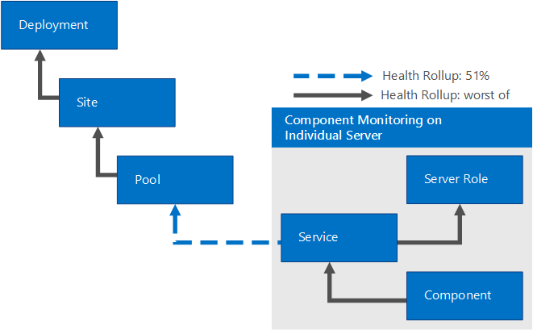

# SCOM 관리 팩을 사용하여 비즈니스용 Skype 서버 2015 관리
 
**요약:** System Center Operations Manager에서 작동하도록 비즈니스용 Skype 서버 2015 인프라를 구성하는 방법을 자세히 알아보습니다.
  
이상적인 세계에서는 비즈니스용 Skype 서버 2015에 문제가 없습니다. 그러나 비즈니스용 Skype 서버는 네트워크 크래시 및 하드웨어 오류와 같은 외부 요인의 영향을 받을 수 있습니다. 비즈니스용 Skype 서버 2015 관리 팩을 사용하여 잠재적인 문제를 사전 예방적으로 식별하고 해결할 수 있습니다. 이러한 방식으로 비즈니스용 Skype 서버 2015 관리 팩은 System Center Operations Manager의 기능을 확장합니다.
  
이 정보는 비즈니스용 Skype 서버 2015 통신 소프트웨어용 모니터링 팩 버전 9319.0을 기반으로 작성되었습니다.
  
## 구성 개요

 System Center Operations Manager에서 작동하도록 비즈니스용 Skype 서버 2015 인프라를 구성하려면 다음 세 가지 작업을 수행해야 합니다.
  
주 관리 [서버를 식별하고 구성합니다.](configure-the-primary.md) 이렇게하려면 System Center Operations Manager 2012 SP1 또는 R2를 설치해야 합니다. 
  
 모니터링할 [비즈니스용 Skype 서버 컴퓨터를 식별하고 구성합니다.](configure-computers-to-monitor.md) System Center Operations Manager를 사용하여 비즈니스용 Skype 서버 컴퓨터를 모니터링하려면 System Center Operations Manager 에이전트 파일을 설치하고 프록시 역할을 하도록 각 서버를 구성해야 합니다. 
  
 감시자 노드를 식별하고 [설치 및 구성합니다.](watcher-nodes.md) 감시자 노드는 비즈니스용 Skype 서버 가상 트랜잭션을 주기적으로 실행하는 컴퓨터입니다Windows PowerShell cmdlet은 시스템에 로그온하는 능력이나 인스턴트 메시지를 교환하는 능력과 같은 주요 비즈니스용 Skype 서버 구성 요소가 예상대로 작동하고 있는지를 확인하는 cmdlet입니다. 
  
## System Center Operations Manager 루트 관리 서버 및 에이전트 지원

관리 팩은 System Center Operations Manager 2007 R2(64비트)(마이그레이션에만 지원) 또는 System Center Operations Manager 2012 SP1 &amp; R2(64비트) 또는 System Center Operations Manager 2016(64비트)과 함께 사용할 수 있습니다. 다음 표에서는 비즈니스용 Skype 서버 2015 관리 팩에 대해 지원되는 구성을 보여줍니다. 
  
|구성|지원 여부|
|:-----|:-----|
|Windows Server 2008 R2 운영 체제    Windows Server 2012 R2 운영 체제   |예. 비즈니스용 Skype 서버 2015 서버와 가상 트랜잭션 감시자 노드 둘 다.   |
|클러스터된 서버   |지원되지 않습니다.   |
|에이전트 없는 모니터링   |지원되지 않습니다.   |
|가상 환경   |예.   |
|도메인에 가입된 서버 역할   |모든 내부 비즈니스용 Skype 서버 2015 서버 역할은 도메인에 가입되어야 합니다.   |
|독립 실행형 서버 역할   |비즈니스용 Skype 서버 2015 에지 서버는 도메인에 가입할 필요는 없습니다.   |
|토폴로지 제한 사항   |배포의 모든 서버 역할은 동일한 Operations Manager 관리 그룹에서 모니터링해야 합니다.   |
|가상 트랜잭션 감시자 노드   |가상 트랜잭션 감시자 노드를 통해 시나리오 가용성 모니터링이 지원됩니다(추가 구성 필요). 감시자 노드는 도메인에 가입할 필요는 없습니다.   |
   
다음 표에서는 가상 트랜잭션 감시자 노드에 대한 용량 및 운영 체제 요구 사항을 보여줍니다.
  
|하드웨어 구성 요소|최소 요구 사항|
|:-----|:-----|
|CPU   |다음 중 하나여야 합니다.    64비트 프로세서, 쿼드 코어, 2.33GHz 이상    64비트 2웨이 프로세서, 듀얼 코어, 2.33GHz 이상   |
|메모리   |8GB   |
|운영 체제   |Windows Server 2008 R2    Windows Server 2012 R2   |
|네트워크   |1Gbps의 네트워크 어댑터 1개   |
   
## 필수 구성 요소

가상 트랜잭션 감시자 노드를 실행하려면 먼저 다음을 설치해야 합니다.
  
- System Center Operations Manager 에이전트 
    
-  Microsoft .NET Framework 4.5
    
- 비즈니스용 Skype 서버 핵심 설치 파일(OcsCore.msi) 및 UCMA(Unified Communications Managed API)(버전은 비즈니스용 Skype 서버 WatcherNode.msi 버전과 일치해야 합니다.
    
## 이 모니터링 팩의 파일

비즈니스용 Skype 서버 2015용 모니터링 팩에는 다음 파일이 포함되어 있습니다.
  
- Microsoft.LS.2015.Monitoring.ActiveMonitoring.mp
    
- Microsoft.LS.2015.Monitoring.ComponentAndUser.mp
    
- WatcherNode.msi
    
## 새로운 기능

다음 기능은 비즈니스용 Skype 서버 2015 관리 팩의 새로운 기능입니다.

- **[2019년 9월 업데이트 변경 사항](https://www.microsoft.com/en-in/download/details.aspx?id=47364)** 일부 경고에는 특수 문자가 제거되었습니다. 경우에 따라 특수 문자가 SCOM 명령 채널 알림 기능을 방해합니다.

- **클라이언트 로그인에 대한 자동 검색** 비즈니스용 Skype 서버 2015에 로그인하는 클라이언트 응용 프로그램은 종종 로그인할 서버를 자동으로 검색합니다. 가상 트랜잭션은 이제 자동 검색이 올바르게 구성되어 있는지 확인하도록 지원됩니다.
    
- **사용자 지정된 가상 트랜잭션 실행 간격** 감시자 노드의 설정 프로세스를 간소화하기 위해 가상 트랜잭션은 사용자 계정을 공유할 수 있습니다. 따라서 충돌을 방지하기 위해 테스트를 직렬화할 때 테스트가 실행되는 빈도가 느려질 수 있습니다. 기본적으로 가상 트랜잭션은 모든 테스트를 실행할 시간을 확보하기 위해 15분마다 실행됩니다. 사용자당 더 많은 사용자 또는 더 적은 수의 테스트를 사용하기로 선택한 관리자는 이제 실행 간격도 줄일 수 있습니다.
    
- **Video Interop Services 가상 트랜잭션** 다른 공급업체 솔루션에서 비즈니스용 Skype Server 2015로 마이그레이션하는 고객은 종종 이러한 다른 공급업체의 VTC(비디오 전화 회의 장치)를 계속 사용하기를 원합니다. Video Interop Server는 고객이 비디오 SIP 트렁크를 통해 Cisco CUCM에 연결하여 회의실에서 Cisco VTC를 계속 사용할 수 있도록 하는 새로운 비즈니스용 Skype 서버 2015 서버 역할입니다. 또한 이 기능은 비디오 Interop 서버가 실행 중이고 비디오 SIP 트렁크를 통해 들어오는 연결을 처리할 수 있는지 확인하는 데 도움이 되는 가상 트랜잭션을 추가합니다.
    
- **응용 프로그램 공유 회의 가상 트랜잭션** 이제 응용 프로그램 공유 회의에 대한 종단 간 시나리오 유효성 검사가 지원됩니다.
    
## 모니터링 시나리오

비즈니스용 Skype 서버 2015 관리 팩은 다양한 기능을 활용하여 문제를 감지하고 진단하는 데 도움이 됩니다. 이러한 기능은 비즈니스용 Skype 서버 2015 환경의 상태 정보를 실시간으로 제공합니다.
  
|모니터링 시나리오|설명|
|:-----|:-----|
|가상 트랜잭션   | Windows PowerShell, 현재 상태, IM 및 사용자 회의와 같은 시나리오의 고가용성을 테스트하고 보장하는 데 도움이 되는 cmdlet을 제공합니다.   가상 트랜잭션은 기업 내부를 비롯한 지리적 위치, 엔터프라이즈 외부 및 지점에서 실행할 수 있습니다.    가상 트랜잭션이 실패하면 오류의 정확한 특성을 확인할 수 있도록 HTML 로그 s가 만들어집니다. 여기에는 실패한 작업, 각 작업의 대기 시간, 테스트를 실행하기 위해 사용된 명령줄 및 발생한 특정 오류에 대한 이해가 포함됩니다.   |
|통화 안정성 경고   |비즈니스용 Skype 서버 2015 서버에서 작성한 CDRS(통화 정보 기록)에는 사용자가 통화에 연결할 수 있는지 또는 통화가 종료되는 이유가 반영됩니다. 통화 안정성 경고는 CDR 데이터베이스를 쿼리하여 많은 사용자가 피어 투 피어 통화 또는 기본 회의 기능에 대한 연결 문제를 경험하는 경우를 나타내는 경고를 생성합니다.    시나리오 범위에는 오디오 통화, 피어 투 피어 IM(인스턴트 메시징) 및 기타 회의 기능이 포함됩니다.   |
|미디어 품질 경고   |각 통화가 끝날 때 비즈니스용 Skype 서버 2015 클라이언트가 게시한 QoE(QoE) 보고서를 조회하는 데이터베이스 쿼리입니다. 이러한 쿼리는 사용자가 통화 및 회의 중에 미디어 품질이 손상될 가능성이 가장 높은 시나리오를 고정하는 경고를 생성합니다. 데이터는 패킷 대기 시간 및 손실과 같은 주요 메트릭을 토대하여 구축되어 사용자 환경의 품질에 직접적인 영향을 미치게 됩니다.   |
|구성 요소 상태 경고   |개별 서버 구성 요소는 이벤트 로그 및 성능 카운터를 통해 경고를 발생하여 사용자 시나리오에 큰 영향을 줄 수 있는 오류 조건을 나타냅니다. 이러한 경고는 서비스가 실행되지 않는 서비스, 높은 오류율, 높은 메시지 대기 시간 또는 연결 문제와 같은 다양한 조건을 나타냅니다.   |
|종속성 상태 모니터링   |비즈니스용 Skype 서버는 다양한 외부 이유로 실패할 수 있습니다. 관리 팩은 심각한 문제를 나타낼 수 있는 중요한 외부 종속성에 대한 데이터를 모니터링하고 수집합니다. 이러한 종속성에는 IIS(인터넷 정보 서비스) 가용성 및 비즈니스용 Skype 서버에 사용되는 서버의 CPU가 포함됩니다.   |

   
### 경고 우선 순위

경고는 다음 범주로 분류됩니다. 
  
 **높은 우선 순위 알림:** 이러한 경고는 대규모 사용자 그룹에 대한 서비스 정전을 유발하고 즉각적인 조치가 필요한 조건을 나타냅니다. 가상 트랜잭션에서 감지된 정전 및 오프라인 서비스(예: 비즈니스용 Skype 서버 오디오/비디오 회의)는 높은 우선 순위 경고로 자격이 있습니다. 반면 단일 컴퓨터의 구성 요소 오류는 높은 우선 순위 경고가 아니라는 것입니다. 비즈니스용 Skype 서버 2015에는 이러한 상황에 대한 고가용성 기능이 기본 제공되어 있습니다(예: 부하 균형 조정기 뒤에 있는 여러 프런트 엔드 서버).
  
 **보통 우선 순위 경고:** 이러한 알림은 일부 사용자에게 영향을 미치거나 통화 품질 문제를 나타내는 조건(예: 구성 요소 오류, 통화 설정 대기 시간 또는 통화의 오디오 품질 낮음)을 나타냅니다. 이 범주의 경고는 상태 상태입니다(즉, 네트워크 연결의 상태를 기반으로 경고의 특성이 변경됩니다.) 예를 들어 통화 설정 시간이 대기 시간을 나타내지만 정상 임계값으로 돌아오면 System Center Operations Manager에서 이 보통 우선 순위 경고가 자동으로 확인되면 관리자가 조치를 취할 필요가 없습니다. 자동 해결될 수 없는 알림은 일반적으로 같은 영업일에 관리자가 해결합니다.
  
 **기타 경고:** 이러한 경고는 특정 사용자 또는 일부 사용자에게 영향을 줄 수 있는 구성 요소에서 생성됩니다. 예를 들어 일반적인 경고는 주소 예약 서비스가 사용자의 AD DS(Active Directory® 도메인 서비스) 항목을 구문 분석할 수 testuser@contoso.com. 관리자는 사용 가능한 시간이 될 때마다 이러한 경고를 해결할 수 있습니다.
  
### 가상 트랜잭션

비즈니스용 Skype 서버 2015 관리 팩은 가상 트랜잭션을 통해 경고에 대해 더 많은 범위를 제공합니다. 가상 트랜잭션은 Windows PowerShell 관리 팩에 통합되어 종단 내 사용자 시나리오를 테스트하는 데 사용됩니다. 가상 트랜잭션을 실행하도록 서버를 지정하면 관리 팩에 의해 이러한 cmdlet이 주기적으로 트리거됩니다. 가상 트랜잭션으로 인해 발생하는 오류는 상태 관리 경고를 생성합니다. 비즈니스용 Skype 서버 2015에 대해 지원되는 가상 트랜잭션은 다음과 같습니다.
  

|등록, 현재 상태 및 연락처에 대해 지원되는 가상 트랜잭션|&nbsp;|&nbsp;|
|:-----|:-----|:-----|
|1   |등록(사용자 로그인)   |사용 가능한 Lync Server 2010 이상   |
|2   |주소장 서비스(파일 다운로드)   |사용 가능한 Lync Server 2010 이상   |
|3    |주소록 웹 쿼리   |사용 가능한 Lync Server 2010 이상   |
|4    |현재 상태   |사용 가능한 Lync Server 2010 이상   |
|5   |통합 연락처 저장소   |사용 가능한 Lync Server 2013 이상   |

  

|피어 투 피어 서비스에 대해 지원되는 가상 트랜잭션|&nbsp;|&nbsp;|
|:-----|:-----|:-----|
|6    |피어 투 피어 인스턴트 메시징   |Lync Server 2010 이상에서 사용 가능   |
|7    |피어 투 피어 오디오 비디오   |Lync Server 2010 이상에서 사용 가능   |
|8    |MCX 피어 투 피어 인스턴트 메시지(모바일)   |Lync Server 2010 - 비즈니스용 Skype 2015의 2011년 9월 릴리스에서 사용 가능   |
 
> [!NOTE]
> 레거시 모바일 클라이언트에 대한 MCX(Mobility Service) 지원은 비즈니스용 Skype 서버 2019에서 더 이상 사용할 수 없습니다. 모든 현재 비즈니스용 Skype 모바일 클라이언트는 이미 UCWA(Unified Communications Web API)를 사용하여 IM(인스턴트 메시징), 현재 상태 및 연락처를 지원하고 있습니다. MCX를 사용하는 레거시 클라이언트를 사용하는 사용자는 현재 클라이언트로 업그레이드해야 합니다.

|회의 및 영구 채팅에 대해 지원되는 가상 트랜잭션|&nbsp;|&nbsp;|
|:-----|:-----|:-----|
|9    |음성 영상 회의   |Lync Server 2010 이상에서 사용 가능   |
|10    |데이터 회의   |Lync Server 2013 이상에서 사용 가능   |
|11    |Instant Message Conferencing   |Lync Server 2010 이상에서 사용 가능   |
|12    | 영구 채팅  |Lync Server 2013 이상에서 사용 가능   |
|13   |참가 시작자(예약된 모임)   |Lync Server 2013 이상에서 사용 가능   |
|14    |전화 접속 회의   |비즈니스용 Skype 서버 2015의 새로운   |
|15    |응용 프로그램 공유 회의   |비즈니스용 Skype 서버 2015의 새로운   |
|16    |UCWA 회의(웹 모임 참가)   |비즈니스용 Skype 서버 2015의 새로운   |

|네트워크 및 파트너 종속성에 대해 지원되는 가상 트랜잭션|&nbsp;|&nbsp;|
|:-----|:-----|:-----|
|17    |AV 에지 연결   |Lync Server 2013 이상에서 사용 가능   |
|18    |AV Edge 연결 Exchange 통합 메시지 연결(음성 메일)   |Lync Server 2013 이상에서 사용 가능   |
|19   |PSTN 피어 투 피어 통화   |Lync Server 2010 이상에서 사용 가능   |
|20   |XMPP 인스턴트 메시징(페더ation)   |Lync Server 2013 및 비즈니스용 Skype 2015에서 사용 가능   |
| 21   |비디오 Interop 서버   |비즈니스용 Skype 서버 2015의 새로운   |

   
## 상태 롤업 방법

다음 표에는 비즈니스용 Skype 서버 모니터링 팩 개체의 상태가 표시됩니다.
  
|Management Pack 개체|설명|
|:-----|:-----|
|비즈니스용 Skype 서버 배포   |조직에서 비즈니스용 Skype 서버 2015의 배포를 표현합니다.   |
|비즈니스용 Skype 서버 사이트   |서비스가 배포되는 다양한 지리적 위치를 표현합니다.   |
|비즈니스용 Skype 서버 풀   |인스턴트 메시징 및 회의와 같은 통신 서비스를 사용자에게 제공하는 풀(사이트 내)입니다. 특정 풀에 하나의 컴퓨터만 있는 경우에도 프런트 엔드 풀, 에지 풀 및 Director 풀에 적용할 수 있습니다.   |
|비즈니스용 Skype 서버 역할   |서비스를 호스팅하는 비즈니스용 Skype 서버 역할입니다.   |
|비즈니스용 Skype 서버 서비스   |특정 머신에 배포된 기능(예: 특정 컴퓨터의 사용자 서비스)을 fp01.contoso.com.   |
|비즈니스용 Skype 서버 구성 요소   |서비스의 구성 요소(예: 주소장 다운로드 구성 요소는 웹 서비스의 일부임).   |
|비즈니스용 Skype 서버 풀 감시자   |하나의 풀에 대해 실행되는 가상 트랜잭션의 인스턴스입니다.   |
|비즈니스용 Skype 서버 등록자 감시자   |하나의 등록자 풀에 대해 실행되는 가상 트랜잭션의 인스턴스입니다.   |
|비즈니스용 Skype 서버 User Services 풀 감시자   |한 User Services 풀에 대해 실행되는 가상 트랜잭션의 인스턴스입니다.   |
|비즈니스용 Skype 서버 음성 풀 감시자   |하나의 음성 풀에 대해 실행되는 가상 트랜잭션의 인스턴스입니다.   |
|비즈니스용 Skype 서버 감시자 포트   |포트 인스턴스는 한 풀에 대해 실행 중인지 검사합니다.   |
|단순 URL 감시자   |배포에서 구성된 단순 URL의 HTTPS 프로비전을 실행합니다.   |
   

  
비즈니스용 Skype 서버 풀에는 여러 개별 비즈니스용 Skype 서버 시스템(두 개 이상의 비즈니스용 Skype 서버 역할, 비즈니스용 Skype 서버 서비스 및 비즈니스용 Skype 서버 구성 요소를 포함할 수 있습니다. 따라서 동일한 풀의 다른 서버가 클라이언트에 응용 프로그램 서비스를 제공할 수 있으므로 개별 서버 또는 구성 요소의 오류는 비즈니스용 Skype 서버 풀의 전반적인 상태와 관련이 덜 중요합니다. 상태는 백분율 수준에 따라 비즈니스용 Skype 서버 롤업됩니다. 
  
비즈니스용 Skype 서버 풀 감시자에서 비즈니스용 Skype 서버 가상 트랜잭션을 수행합니다. 다음 다이어그램과 같이 하나 이상의 가상 트랜잭션(연속 폴링 간격으로 알려진 프로세스)이 연속적으로 실패하면 위험 상태가 풀 수준(가상 트랜잭션의 최악)으로 롤업됩니다. 
  

  
## 모범 사례: 사용자 지정을 위한 관리 팩 만들기

기본적으로 Operations Manager는 기본 관리 팩에 대한 오버라이드와 같은 모든 사용자 지정을 저장합니다. 최상의 방법은 사용자 지정할 봉인된 각 관리 팩에 대해 별도의 관리 팩을 만들어야 합니다. 
  
봉인된 관리 팩에 대한 사용자 지정 설정을 저장하기 위한 관리 팩을 만들 때 새 관리 팩의 이름을 적절하게 지정하는 것이 좋습니다(예: "비즈니스용 Skype 서버 2015 사용자 지정" 
  
봉인된 각 관리 팩의 사용자 지정을 저장하기 위한 새 관리 팩을 만들면 테스트 환경에서 프로덕션 환경으로 사용자 지정을 보다 쉽게 내보낼 수 있습니다. 이렇게 하면 관리 팩을 삭제하기 전에 종속성도 삭제해야 하기 때문에 관리 팩을 보다 쉽게 삭제할 수 있습니다. 모든 관리 팩에 대한 사용자 지정을 기본 관리 팩에 저장하고 단일 관리 팩을 삭제해야 하는 경우 먼저 기본 관리 팩을 삭제해야 합니다. 이 경우 다른 관리 팩에 대한 사용자 지정도 삭제됩니다. 
  
## 링크

다음 링크는 System Center 2012 모니터링 팩과 연결된 일반적인 작업에 대한 정보로 연결됩니다.
  
- [관리 팩 수명 주기](/previous-versions/system-center/system-center-2012-R2/hh212732(v=sc.12))
    
- [Operations Manager 2012에서 관리 팩을 가져오는 방법](/previous-versions/system-center/system-center-2012-R2/hh212691(v=sc.12))
    
- [규칙 또는 모니터를 오버라이드하는 방법](/previous-versions/system-center/system-center-2012-R2/hh212869(v=sc.12))
    
- [Operations Manager 2012에서 계정으로 실행을 만드는 방법](/previous-versions/system-center/system-center-2012-R2/hh321655(v=sc.12))
    
- [계정 및 프로필로 실행 관리](/previous-versions/system-center/system-center-2012-R2/hh212714(v=sc.12))
    
- [Operations Manager 관리 팩을 내보내는 방법](/previous-versions/system-center/system-center-2012-R2/hh320149(v=sc.12))
    
- [Operations Manager 관리 팩을 제거하는 방법](/previous-versions/system-center/system-center-2012-R2/hh230746(v=sc.12))
    
다음 링크는 System Center 2007 모니터링 팩과 연결된 일반적인 작업에 대한 정보로 연결됩니다.
  
- [관리 팩 수명 주기 관리](/previous-versions/system-center/operations-manager-2007-r2/cc974486(v=technet.10))
    
- [Operations Manager 2007에서 관리 팩을 가져오는 방법](/previous-versions/system-center/operations-manager-2007-r2/cc974494(v=technet.10))
    
- [Overrides를 사용하여 모니터링하는 방법](/previous-versions/system-center/operations-manager-2007-r2/bb309719(v=technet.10))
    
- [Operations Manager 2007에서 계정으로 실행을 만드는 방법](/previous-versions/system-center/operations-manager-2007-r2/bb309445(v=technet.10))
    
- [기존 프로필로 실행을 수정하는 방법](/previous-versions/system-center/operations-manager-2007-r2/dd891202(v=technet.10))
    
- [관리 팩 사용자 지정을 내보내는 방법](/previous-versions/system-center/operations-manager-2007-r2/cc974487(v=technet.10))
    
- [관리 팩을 제거하는 방법](/previous-versions/system-center/operations-manager-2007-r2/cc974489(v=technet.10))
    
Operations Manager 및 모니터링 팩에 대한 질문은 System Center Operations Manager 커뮤니티 포럼을 [참조하세요.](https://go.microsoft.com/fwlink/p/?LinkID=179635)
  
유용한 리소스는 특정 모니터링 팩에 System Center "예제" 게시물이 포함된 작업 관리자의 [Unleashed](https://opsmgrunleashed.wordpress.com/) 블로그입니다.
  
Operations Manager에 대한 자세한 내용은 다음 블로그를 참조하세요. 
  
- [Operations Manager 팀 블로그](https://blogs.technet.com/momteam/default.aspx)
    
- [OpsMgr에 대한 생각](https://thoughtsonopsmgr.blogspot.com/)
    
   
> [!IMPORTANT]
> Microsoft가 아닌 사이트의 모든 정보 및 콘텐츠는 웹 사이트의 소유자 또는 사용자가 제공합니다. Microsoft는 이 웹 사이트의 정보에 대해 표현적, 암시적 또는 법정을 보증하지 않습니다. 
  
## 참고 항목

[비즈니스용 Skype 서버 2015 관리 도구](../../management-tools/management-tools.md)