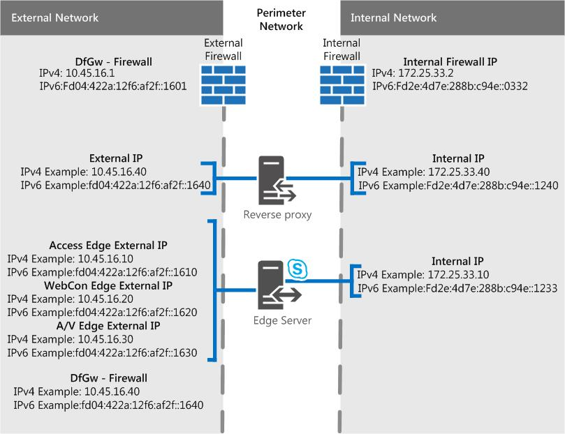

# 에지 서버 시나리오의 비즈니스용 Skype 서버
 
**요약:** 이러한 시나리오를 검토하여 에지 서버 토폴로지 계획에 비즈니스용 Skype 서버.
  
구현할 에지 서버 토폴로지의 시각화 및 결정에 도움이 비즈니스용 Skype 서버 시나리오 다이어그램이 있습니다. 좋은 후보를 선택하고 나면 해결해야 하는 환경 요구 사항을 읽어 볼 수 있습니다. 다음은 모든 시나리오에 적용될 수 있으므로 먼저 언급하고 있습니다.
  
예를 들어 예제 IPv4 및 IPv6 데이터가 포함된 등의 용도로만 표시되는 이러한 수치는 실제 통신 흐름을 나타내지 않고 가능한 트래픽에 대한 개성 높은 보기를 나타내지 않습니다. 포트 세부 정보는 아래 각 시나리오에 대한 포트 다이어그램에서도 볼 수 있습니다.
  
다이어그램에는 외부 인터페이스용 .com과 내부의 .net(샘플 재질)이 표시됩니다. 물론 최종 에지 계획을 세우면 항목 자체가 상당히 다를 수 있습니다.
  
선택적 구성 요소인 Director는 다이어그램에 포함하지 않지만 별도로 읽을 수 있습니다(다른 계획 항목에서 설명).
  
위에서 설명한 대로 다이어그램에는 샘플 IPv6 데이터가 있습니다. 비즈니스용 Skype 서버 에지  서버 배포 계획의 설명서 중 대부분은 IPv4를 참조하지만 IPv6을 사용하려는 경우 확실하게 지원됩니다. 할당된 주소 공간에 IPv6 주소가 필요하며 IPv4 IP와 같은 내부 및 외부 주소로 작업해야 합니다. IPv4 및 Windows 별도의 네트워크 스택인 이중 스택 기능을 사용할 수 있습니다. 이렇게 하면 필요한 경우 IPv4 및 IPv6 주소를 동시 할당할 수 있습니다.
  
NAT64(IPv6 - IPv4) 및 NAT66(IPv6 - IPv6)을 허용하는 NAT 장치가 있으며 이 장치는 비즈니스용 SKYPE 서버.
  
> [!IMPORTANT]
> CAC(통화 입장 제어)를 사용하는 경우 내부 인터페이스에서 IPv4를 사용하여 작동해야 합니다. 
  
## 개인 IP 비즈니스용 Skype 서버 NAT가 있는 단일 통합 에지 서버

이 시나리오에서는 고가용성을 위한 옵션이 없습니다. 이는 하드웨어에 대한 지출이 적고 배포가 더 간단하다는 의미입니다. 고가용성이 필요한 경우 아래 조정된 통합 시나리오를 확인하세요.
  

  
### 포트 다이어그램

단일 통합 에지 서버에 대한 포트에 대한 다이어그램도 있습니다.
  

  
## 공용 IP 비즈니스용 Skype 서버 단일 통합 에지 서버

이 시나리오에서는 고가용성을 위한 옵션이 없습니다. 이는 하드웨어에 대한 지출이 적고 배포가 더 간단하다는 의미입니다. 고가용성이 필요한 경우 아래 조정된 통합 시나리오를 확인하세요.
  

  
### 포트 다이어그램

단일 통합 에지 서버에 대한 포트에 대한 다이어그램도 있습니다.
  

  
## 확장된 통합 비즈니스용 Skype 서버 에지 풀, DNS 부하 분산, 개인 IP 주소 및 NAT

이 시나리오에서는 에지 배포에서 고가용성을 사용할 수 있으며, 이렇게 하면 확장성 및 장애 조치(failover) 지원의 이점을 활용할 수 있습니다.
  

  
### 포트 다이어그램

또한 DNS 부하 분산을 사용하는 조정된 통합 에지 풀에 대한 다이어그램도 있습니다.
  

  
## 확장된 통합 비즈니스용 Skype 서버 DNS 부하 분산 및 공용 IP 주소를 사용하는 에지 풀

이 시나리오에서는 에지 배포에서 고가용성을 사용할 수 있으며, 이렇게 하면 확장성 및 장애 조치(failover) 지원의 이점을 활용할 수 있습니다.
  

  
### 포트 다이어그램

또한 DNS 부하 분산을 사용하는 조정된 통합 에지 풀에 대한 다이어그램도 있습니다.
  

  
## 하드웨어 부하 비즈니스용 Skype 서버 조정된 통합 통합 에지 풀

이 시나리오에서는 에지 배포에서 고가용성을 사용할 수 있으며, 이렇게 하면 확장성 및 장애 조치(failover) 지원의 이점을 활용할 수 있습니다.
  

 
