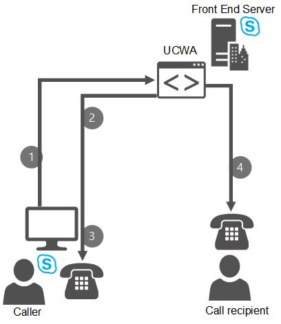

# 비즈니스용 Skype 서버에서 직장을 통한 통화 계획Plan for Call Via Work in Skype for Business Server
 
비즈니스용 Skype와 PBX 전화 시스템 간의 통합을 가능하게 하여 사용자가 비즈니스용 Skype를 사용하여 PBX 전화를 제어할 수 있도록 하는 비즈니스용 Skype 서버에서 직장을 통한 통화 계획Planning for Call Via Work in Skype for Business Server, which enables integration between Skype for Business and your PBX phone system, so that users can use Skype for Business to control their PBX phones.
  
 **비즈니스용** Skype 서버의 새로운 기능으로, 비즈니스용 Skype 솔루션을 기존 PBX 전화 시스템과 통합할 수 있습니다.**Call Via Work** is a new feature in Skype for Business Server which enables you to integrate your Skype for Business solution with your existing PBX phone systems. 직장에서 전화 기능을 사용하도록 설정된 사용자는 비즈니스용 Skype를 클릭하여 배포 내에서 또는 외부 사용자 내에서 다른 사용자에게 전화를 걸 수 있습니다.A user enabled for Call Via Work can click in Skype for Business to call another user, either within your deployment or an external user. 사용자의 PBX 전화를 사용하여 통화가 완료됩니다.The call is completed using the user's PBX phone. 이렇게 하면 PBX 전화를 사용 하는 사용자가 풍부한 비즈니스용 Skype 대화에 오디오를 포함할 수 있습니다.This enables a user with a PBX phone to include audio in their rich Skype for Business conversations. 이전 버전의 Lync Server 원격 통화 제어는 사용자가 Lync Server를 사용하여 PBX 전화를 제어할 수 있는 기능입니다.In previous versions of Lync Server remote call control was a feature which enabled users to control their PBX phones with Lync Server. 비즈니스용 Skype 서버에서는 이 기능이 직장 전화로 대체됩니다.In Skype for Business Server, this feature has been replaced with Call Via Work.
  
PBX 전화 사용자에 대해 Work로 전화 기능을 사용할 수 있도록 합니다.Call Via Work enables the following for PBX phone users
  
- PBX 전화를 통해 제공되는 오디오가 있는 Click-to-call 환경Click-to-call experience, with the audio provided through the PBX phone.
    
- 현재 상태, 사용자 검색 및 IM 통합입니다. 예를 들어 IM 세션의 두 사용자가 PBX 전화를 통해 제공되는 오디오를 사용하여 세션에 오디오를 추가할 수 있습니다.Presence, user search, and IM integration-- for example, two Call Via Work users in an IM session can add audio to their session, with the audio provided through the PBX phones.
    
- IM, 응용 프로그램 공유 및 파일 전송을 업무를 통한 통화에 추가하는 기능입니다.The ability to add IM, application sharing, and file transfer to a Call Via Work call.
    
- 한 번 클릭 모임 참가 기능One-click meeting join capability
    
## 작업 방법How it works

UCWA(Unified Communications Web API)를 PBX 시스템과 비즈니스용 Skype 서버 배포 간의 B2BUA(Back-to-Back User Agent)로 사용하여 비즈니스용 Skype 서버를 PBX 시스템에 연결하는 데 CSTA(컴퓨터 지원 통신 응용 프로그램) 게이트웨이가 필요하지 않습니다.Call Via Work uses Unified Communications Web API (UCWA) as the back-to-back user agent (B2BUA) between the PBX system and your Skype for Business Server deployment, so that no computer-supported telecommunications application (CSTA) gateway is needed to connect Skype for Business Server with your PBX system. UCWA는 모바일 및 웹 클라이언트와의 연결을 설정하기 위해 이전 버전의 Lync Server에 도입된 서비스로, 모든 프런트 엔드 서버에 자동으로 설치됩니다.UCWA is a service introduced in previous versions of Lync Server to enable connectivity with mobile and web clients, and is automatically installed on every Front End Server.
  
### 업무용 통화 워크플로 호출Call workflow for a Call Via Work call

다음은 사용자가 직장 전화 기능을 사용하도록 설정한 사용자가 비즈니스용 Skype 서버를 사용하여 전화를 걸 수 있는 방법을 보여 주는 예제입니다.The following illustrates how a user enabled for Call Via Work can use the Skype for Business Server to make a call:
  

  
1. 사용자는 비즈니스용 Skype 클라이언트에서 사용자를 선택하고 전화 아이콘을 클릭하여 전화를 걸 수 있습니다.The user selects a user in their Skype for Business client, and clicks the phone icon to call them. 또는 IM 대화 중에 사용자가 클릭하여 세션을 진행하고 있는 사용자에게 전화를 걸 수 있습니다.Or, during an IM conversation, the user clicks to call the user they are having the session with.
    
2. 통화를 시작한 사용자의 PBX 전화가 울리기 시작합니다.The PBX phone of the user who placed the call starts to ring. 이 전화의 발신자 번호에는 업무번호로 전화 걸기 전화를 거는 모든 사용자의 발신자 번호에 표시하기 위해 설정한 전역 전화 번호가 표시되어 있습니다.The caller ID for this phone shows a global phone number which you have set up to show in the caller ID of all users placing Call Via Work calls. 이 전역 전화 번호는 한 사람의 전화에 해당하는 실제 전화 번호가 아니며,This global phone number is not an actual phone number that corresponds to any one person's phone. 대신, 수신 전화가 동시에 진행되지 않고 자신의 발신 전화라고 사용자에게 알려주는 시각적 신호입니다.Instead, it is a visual signal to let a user know that this is their own outgoing call, and not an incoming call happening at the same time. 직장번호로 전화 서비스를 배포할 때 해당 사용자에게 이 전역 전화 번호와 그 의미를 교육해야 합니다.When you deploy Call Via Work, you should educate those users about this global phone number and what it means.
    
3. 통화를 걸고 나선 사용자가 PBX 전화를 습니다.The user who placed the call picks up their PBX phone. 그런 다음 비즈니스용 Skype에서 발신자에 대한 음성 통화를 시작합니다.Skype for Business then initiates the voice call to the callee. 
    
4. 발신자 응답 시 음성 통화가 시작됩니다.When the callee answers, the voice call begins. 두 사용자가 이미 IM 세션을 진행한 경우 계속할 수 있습니다.If the two users already had an IM session going, it can continue.
    
### 직장에서 전화 회의 참가Joining a Conference With Call Via Work

업무 시간 전화 사용자는 모임 URL을 클릭하여 예약된 모임에 참가할 수 있습니다.A Call Via Work user can join a scheduled meeting by clicking the meeting URL. 그러면 비즈니스용 Skype에서 모임 서비스가 사용자의 PBX 전화로 전화를 걸 때까지 메시지에 대한 전화 걸기 기능을 보여줍니다. Skype for Business then shows a **Dialing out to** message until the meeting service dials the user's PBX phone. 그런 다음 직장에서 전화 걸기 사용자가 PBX 전화를 선택하고 모임에 참가합니다.The Call Via Work user then picks up the PBX phone and joins the meeting.
  
또한 비즈니스용 Skype에서 모임  시작 옵션을 사용하여 모임 시작 모임을 만들 수 있습니다.A Call Via Work user can also use the **Meet Now** option in Skype for Business to create Meet Now meetings. 그러면 사용자에게 전화  걸기 메시지와 PBX 전화가 울리는 메시지가 표시됩니다.The user then sees the **Dialing out to** message, and the PBX phone rings.
  
비즈니스용 Skype 내에서 전화 회의 브리지 번호로 전화를 걸면 업무 시간으로 전화를 걸 수 있습니다.A Call Via Work user can also dial in to a meeting by calling the Conference Bridge number from within Skype for Business. 전화 회의 PIN이 필요한 경우 사용자는 PBX 전화를 사용하여 PIN을 입력해야 합니다.If a conference PIN is required, the user must use their PBX phone to input the PIN.
  
### 수신 전화Incoming Calls

회사 전화 기능을 사용하도록 설정된 사용자가 비즈니스용 Skype 통화를 받으면 PBX 전화와 사용자의 비즈니스용 Skype 클라이언트가 모두 동시에 울리게 됩니다(사용자가 동시 벨 울림을 설정한 경우).When a user enabled for Call Via Work receives a Skype for Business call, the PBX phone and the user's Skype for Business clients all ring simultaneously (if the user has set up simultaneous ring). 사용자는 PBX 전화를 선택하거나 비즈니스용 Skype 알림에서 수락을 클릭하여 통화를 수락할 수 있습니다. The user can accept the call either by picking up the PBX phone or clicking **Accept** on the Skype for Business notification. 사용자가 비즈니스용 Skype를 사용하여 전화를 수락하면 통화에 대한 비즈니스용 Skype 창이 계속 열립니다.If the user accepts the call using Skype for Business, the Skype for Business window for the call stays open. 그러나 사용자가 PBX 전화를 받아 통화를 수락하면 비즈니스용 Skype 알림 창이 닫히고 비즈니스용 Skype 세션이 없는 경우 PBX 전화를 통해 음성 통화만 가능합니다.But if the user accepts the call by picking up the PBX phone, then the Skype for Business notification window closes and there is no Skype for Business session, only the voice call over the PBX phone.
  
직장에서 전화 기능을 사용하도록 설정된 사용자가 PBX 통화를 받으면 PBX 전화 벨 소리만 울리게 됩니다.When a user enabled for Call Via Work receives a PBX call, only the PBX phone rings.
  
## 업무를 통한 전화 제한 사항Limitations of Call Via Work

Work를 통한 통화는 하드웨어 설치가 거의 필요 없지만 전체 통화 제어 또는 원격 통화 제어에서 사용할 수 있는 기능에 비해 제한이 Enterprise Voice 솔루션입니다.Call Via Work is a voice solution that requires little hardware setup, but has limitations compared to the features available in full Enterprise Voice or remote call control. 업무를 통해 전화하기에는 다음과 같은 제한이 있습니다.Call Via Work has the following limitations:
  
- 직장번호로 전화 사용자가 직장번호로 전화 콜백 번호로의 통화 전달을 설정한 경우 누군가 사용자의 전화 번호로 이 사용자를 모임에 초대하면 초대가 사용자에게 연결되지 않습니다.If a Call Via Work user has set up call forwarding to the Call Via Work callback number, and someone tries to invite this user to a meeting by the user's phone number, the invitation will not reach the user. 사용자에게 전화 번호가 아닌 이름을 클릭하여 참가자를 모임에 초대할 수 있도록 교육해야 합니다.You should educate your users to invite participants to meetings by clicking the name, not the phone number. 
    
- 향상된 911 기능 및 악의적인 통화 추적은 업무를 통해 통화하는 동안 사용할 수 없습니다.Enhanced 911 capability and malicious call tracing are not available during Call Via Work calls.
    
- 업무로 전화 기능을 사용하도록 설정된 사용자는 위임, 팀 통화 또는 응답 그룹 기능을 사용할 수 없습니다.Users enabled for Call Via Work cannot use the delegation, team call, or response group features.
    
- 비즈니스용 Skype를 사용하여 모임을 녹음하거나, 통화를 음소거 또는 음소거 또는 음소거하거나, 통화를 보류 또는 전송하거나, 통화 파크를 사용할 수 없습니다.Users of Call Via Work cannot use Skype for Business to record a meeting, mute or unmute the call, hold or transfer the call, or use call park.
    
- 사용자는 전화를 통해 PBX 음성 메일 메시지에 액세스할 수 없습니다.Users cannot use Call Via Work to access their PBX voicemail messages.
    
- 사용자는 음성 통화로 시작된 세션을 비디오, Powerpoint, 화이트보드 또는 One Note와 같은 통신이 포함된 공동 작업 모임으로 에스컬레이터할 수 없습니다.Users of Call Via Work cannot escalate a session that started as a voice call to a collaborative meeting that includes communications such as video, Powerpoint, whiteboard, or One Note.
    
- 회사 내 전화 사용자는 2인용 통화에 더 많은 사용자를 추가할 수 없습니다.Users of Call Via Work cannot add more users to a 2-person call.
    
- 책상 전화기 페어링 또는 VDI 플러그 인 페어링이 지원되지는 없습니다.No support for deskphone pairing or VDI plugin pairing.
    
- 사용자가 PBX 전화를 사용하여 전화를 걸거나 응답하는 경우(비즈니스용 Skype 창을 사용하지 않는 경우) 통화 로그가 없습니다.If a user makes or answers a call using the PBX phone (and not using the Skype for Business window), there will be no log of the call.
    
- PBX 시스템에서 **REFER with Replaces를** 지원하지 않는 경우 다음과 같은 동작이 발생하게 됩니다.If your PBX system does not support **REFER with Replaces**, the following behavior will happen. 업무용 전화 통화 중 사용자가 PBX 전화에서 진행 전화를 전송하는 경우 통화 창이 비즈니스용 Skype 창에서 사라지지 않습니다.While on a Call Via Work call, if the user transfers the ongoing call from the PBX Phone, the call window will not disappear from their Skype for Business window. 그러면 사용자가 통화 창을 닫을 경우 전송 대상과 전송 대상 간의 통화가 종료됩니다.If the user then closes the call window, the call between the transfer target and the transferee will end. 
    
## 업무를 통한 전화에 대한 선행 작업Prerequisites for Call Via Work

사용자가 업무를 통해 전화를 걸 수 있도록 설정하려면 몇 가지 선행 조처가 있어야 합니다.To enable any users for Call Via Work, you must have some pre-requisites in place. 이러한 선행 구성에 대한 자세한 내용은 비즈니스용 Skype 서버 [2015에서](../../deploy/deploy-call-via-work.md)직장에서 전화를 통해 전화를 걸 수 있도록 설정하는 방법에 대한 단계를 참조하세요.For more information on these prerequisites, and for steps on how to enable users for Call Via Work, see [Deploy Call Via Work in Skype for Business Server 2015](../../deploy/deploy-call-via-work.md). 
  
## 참고 항목See also

[비즈니스용 Skype의 원격 통화 제어 계획Plan for remote call control in Skype for Business](remote-call-control.md)
  
[비즈니스용 Skype 서버 2015에서 직장을 통한 통화 배포Deploy Call Via Work in Skype for Business Server 2015](../../deploy/deploy-call-via-work.md)

