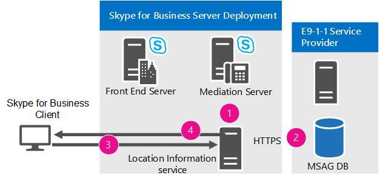

# 비즈니스용 Skype 서버의 응급 서비스 계획Plan for emergency services in Skype for Business Server

위치 검색 및 통화 라우팅을 포함하여 비즈니스용 Skype 서버 Enterprise Voice E9-1-1(Enhanced 9-1-1) 서비스에 대해 자세히 알아보습니다.Learn about Enhanced 9-1-1 (E9-1-1) services in Skype for Business Server Enterprise Voice, including location acquiring and call routing.

비즈니스용 Skype 서버는 미국 내 E9-1-1(고급 9-1-1) 서비스를 Enterprise Voice 배포합니다.Skype for Business Server supports Enhanced 9-1-1 (E9-1-1) services within the United States as part of an Enterprise Voice deployment. E9-1-1은 구/군/시 주소와 더 구체적인 기타 위치 정보(예: 사무실 건물 및 다가구 시설에서 거는 전화의 경우 층 번호)로 구성되는 ERL(Emergency Response Location)과 9-1-1 전화를 연결하는 응급 발송 기능입니다.E9-1-1 is an emergency dispatch feature that associates a 9-1-1 call with an Emergency Response Location (ERL) that consists of civic (that is, street) addresses and other more specific location information, such as floor numbers, for calls from office buildings and other multitenant facilities. PSAP(Public Safety Answering Point)는 제공된 ERL을 사용하여 응급 상황에 처한 발신자에게 최초 대응 인원을 즉시 파견할 수 있으며, 모호하거나 잘못된 위치로 대응 인원을 실수로 파견할 위험을 줄일 수 있습니다.By using the provided ERL, a Public Safety Answering Point (PSAP) can immediately dispatch first responders to the caller in distress with reduced risk of inadvertently directing the responder to an incorrect or ambiguous location.

> [!NOTE]
> 비즈니스용 Skype 서버는 이제 클라이언트에 대해 여러 긴급 번호 구성을 지원합니다.Skype for Business Server now supports the configuration of multiple emergency numbers for a client. 자세한 내용은 비즈니스용 Skype 서버에서 여러 긴급 번호에 [대한 계획을 참조하세요.](multiple-emergency-numbers.md)For more information see [Plan for multiple emergency numbers in Skype for Business Server](multiple-emergency-numbers.md).

> [!NOTE]
> 비즈니스용 Skype 서버에는 통화 Enterprise Voice 제어, 응급 서비스(E9-1-1) 및 미디어 우회의 세 가지 고급 서비스 기능이 있습니다.Skype for Business Server has three advanced Enterprise Voice features: call admission control, emergency services (E9-1-1), and media bypass. 이러한 세 기능에 공통적인 계획 정보의 개요는 비즈니스용 Skype 서버의 고급 Enterprise Voice 기능에 대한 네트워크 설정을 [참조하세요.](network-settings-for-advanced-features.md)For an overview of planning information that is common to all three of these features, see [Network settings for the advanced Enterprise Voice features in Skype for Business Server](network-settings-for-advanced-features.md).

비즈니스용 Skype 서버는 비즈니스용 Skype 클라이언트 및 Lync Phone Edition 장치에서 E9-1-1(고급 9-1-1) 통화를 지원합니다.Skype for Business Server supports Enhanced 9-1-1 (E9-1-1) calling from Skype for Business clients and Lync Phone Edition devices. E9-1-1에 대해 비즈니스용 Skype 서버를 구성할 때 비즈니스용 Skype 또는 Lync Phone Edition에서 걸려 온 긴급 통화에는 위치 정보 서비스 데이터베이스의 ERL(응급 응답 위치) 정보가 포함됩니다.When you configure Skype for Business Server for E9-1-1, emergency calls placed from Skype for Business or Lync Phone Edition include Emergency Response Location (ERL) information from the Location Information service database. ERL은 주소와 사무실 건물 또는 복합 시설 내의 위치를 더 정확히 식별하는 데 도움이 되는 기타 정보로 구성됩니다.ERLs consist of civic (that is, street) addresses and other information that helps to identify a more precise location in office buildings and other multitenant facilities. 사용자가 긴급 통화를 하는 경우 비즈니스용 Skype 서버는 위치 및 콜백 정보와 함께 통화 오디오를 중재 서버를 통해 E9-1-1 서비스 공급자로 라우팅합니다.When a user makes an emergency call, Skype for Business Server routes the call audio, along with the location and callback information, through a Mediation Server to an E9-1-1 service provider. E9-1-1 서비스 공급자는 발신자의 주소를 사용하여 발신자의 위치에 서비스를 제공하는 PASP(Public Safety Answering Point)로 통화를 라우팅하고 PSAP가 발신자 ERL을 조회하는 데 사용하는 ESQK(Emergency Service Query Key)를 함께 전송합니다.The E9-1-1 service provider uses the civic address of the caller to route the call to the Public Safety Answering Point (PSAP) that serves the caller's location, and sends along an Emergency Service Query Key (ESQK) that the PSAP uses to look up the caller's ERL.

비즈니스용 Skype 서버는 긴급 통화를 E9-1-1 서비스 공급자로 라우팅하는 두 가지 방법을 제공합니다.Skype for Business Server supports two methods for routing emergency calls to an E9-1-1 service provider:

- 적격 E9-1-1 서비스 공급자에 대한 SIP(Session Initiation Protocol) 트렁크 연결A Session Initiation Protocol (SIP) trunk connection to a qualified E9-1-1 service provider

- PSTN(공중 전화망) 기반 E9-1-1 서비스 공급자에 대한 ELIN(Emergency Location Identification Number) 게이트웨이An Emergency Location Identification Number (ELIN) gateway to a public switched telephone (PSTN)-based E9-1-1 service provider

SIP 트렁크 E9-1-1 서비스 공급자를 사용하는 경우 위치 정보 서비스 데이터베이스에 ERL을 추가한 다음 E9-1-1 서비스 공급자가 유지 관리하는 MSAG(마스터 주소 가이드)에 대해 위치의 유효성을 검사합니다.When you use a SIP trunk E9-1-1 service provider, you add ERLs to the Location Information service database, and then validate the locations against a Master Street Address Guide (MSAG) that is maintained by the E9-1-1 service provider. E9-1-1 서비스 공급자가 위치 정보가 없는 통화를 수신하거나 MSAG에 대해 유효성이 검사되지 않은 위치가 있는 경우 E9-1-1 서비스 공급자는 통화를 ECRC(국가/지역 응급 통화 응답 센터)로 라우팅합니다. 이 센터는 전문 교육을 받은 담당자가 가능한 경우 발신자 위치를 구두로 받아 적절한 PSAP로 통화를 수동으로 라우팅합니다.If an E9-1-1 service provider receives a call that doesn't have location information or has a location that has not been validated against the MSAG, the E9-1-1 service provider routes the call to a national/regional Emergency Call Response Center (ECRC), which is staffed with specially trained personnel who verbally obtain the caller's location, if possible, and manually route the call to the appropriate PSAP. 일부 SIP 트렁크 E9-1-1 서비스 공급자는 어떤 이유로든 SIP 트렁크가 실패할 경우 9-1-1 통화를 라우팅하는 대체 방법을 제공하는 ECRC에 PSTN DID(Direct Inward Dialing) 번호를 고객에게 제공합니다.(Some SIP trunk E9-1-1 service providers also provide customers with a PSTN direct inward dialing (DID) number to the ECRC, which provides an alternate means of routing 9-1-1 calls, if the SIP trunk fails for any reason.)

고정된 위치가 있는 TDM(시간 디비전 멀티플렉스) 및 IP 기반 PBX(Private Branch Exchange) 전화와 달리 비즈니스용 Skype 끝점은 모바일이 될 수 있습니다.Unlike time division multiplexing (TDM) and IP-based private branch exchange (PBX) phones, which have fixed locations, a Skype for Business endpoint can be very mobile. E9-1-1 기능을 배포할 때 비즈니스용 Skype 서버는 발신자 위치에 상관없이 긴급 통화를 발신자 위치를 제공하는 PSAP로 라우팅할 수 있도록 합니다.When you deploy the E9-1-1 feature, Skype for Business Server helps to ensure that no matter where a caller is located, the emergency call can be routed to the PSAP that serves the caller's location. 예를 들어 사용자의 주 사무실이 워싱턴주 레드몬드에 있지만 사용자가 칸사스 주 위치타에 있는 지사에서 긴급 통화를 하는 경우 SIP 트렁크 또는 PSTN 기반 E9-1-1 서비스 공급자는 통화를 레드몬드의 PSAP가 아닌 위치타의 PSAP로 라우팅합니다.For example, if a user's main office is located in Redmond, Washington, but the user places an emergency call from a computer in a branch office in Wichita, Kansas, the SIP trunk or PSTN-based E9-1-1 service provider will route the call to the PSAP in Wichita, not to the PSAP in Redmond.

ELIN 게이트웨이를 사용하는 경우 위치 정보 서비스 데이터베이스에도 ERL을 추가하지만 각 위치에 대한 ELIN 번호도 포함됩니다.When you use an ELIN gateway, you also add ERLs to the Location Information service database, but you include also an ELIN number for each location. 긴급 통화 중에는 ELIN 번호가 긴급 발신 번호가 됩니다.The ELIN number becomes the emergency calling number during the emergency call. 그러면 PSTN 통신 회사에서 ELIN을 ALI(Automatic Location Identification) 데이터베이스에 업로드했는지 확인해야 합니다.You must then make sure that your PSTN carrier uploads the ELINs to the Automatic Location Identification (ALI) database.

> [!NOTE]
> 비즈니스용 Skype 연결 아날로그 장치는 위치 정보 서비스에서 위치 정보를 수신하거나 위치를 E9-1-1 서비스 공급자로 전송할 수 없습니다.Skype for Business-connected analog devices cannot receive location information from the Location Information service or transmit location to the E9-1-1 service provider.

 SIP 트렁크 E9-1-1 서비스 공급자 옵션을 사용하며 아날로그 전화에서 E9-1-1을 지원해야 하는 경우에는 두 가지 옵션이 있습니다.If you use the SIP trunk E9-1-1 service provider option and need to support E9-1-1 from analog phones, you have two options:

- **기존 PS-ALI 옵션** 아날로그 전화가 배포되는 각 사이트에 로컬 PSTN 게이트웨이가 있는 경우 각 아날로그 전화에 DID가 있는 경우 PS-ALI(Private Switch/Automatic Location Identification) 서비스 공급자를 사용하여 아날로그 장치의 위치를 직접 프로비전할 수 있습니다.**Traditional PS-ALI option** If you have local PSTN gateways at each site where analog phones are deployed and each analog phone has a DID, you can provision the analog device's location directly with a Private Switch/Automatic Location Identification (PS-ALI) service provider. 이 경우 특별히 만든 비즈니스용 Skype 음성 정책을 구성하고 아날로그 장치 연락처 개체에 할당하여 해당 전화의 E9-1-1 통화가 E9-1-1 서비스 공급자 SIP 트렁크로 통화를 라우팅하는 대신 로컬 게이트웨이를 통해 사이트를 서비스를 제공하는 PSTN 공급자로 직접 라우팅하도록 합니다.In this case, you configure specially-crafted Skype for Business voice policies and assign them to the analog device contact objects so that E9-1-1 calls from those phones route directly through the local gateway to the PSTN provider that services the site (instead of routing the call to an E9-1-1 service provider SIP trunk). 긴급 통화가 걸려오면 PSTN 트렁크와 연결된 PS-ALI 공급자의 데이터베이스가 각 아날로그 전화의 DID를 실제 위치에 매핑하고 이 위치를 PSAP에 제공합니다.When an emergency call is placed, a database at a PS-ALI provider that is associated with the PSTN trunk maps the DID of each analog phone to a physical location and provides this location to the PSAP. 전화가 다른 ERL로 이동될 때마다 PS-ALI 서비스 공급자에서 이러한 레코드가 업데이트되어야 합니다.These records must be updated with the PS-ALI service provider every time phones are moved to different ERLs.

- **E9-1-1 서비스 공급자 옵션** E9-1-1 서비스 공급자가 지원하는 경우 아날로그 전화 DID 및 해당 ERL을 E9-1-1 서비스 공급자에 등록할 수 있습니다.**E9-1-1 service provider option** You can register the analog phone DIDs and their corresponding ERLs with the E9-1-1 service provider, if this is supported by the E9-1-1 service provider. 공급자가 PIDF-LO 데이터를 포함하지 않는 비즈니스용 Skype 서버에서 전화를 받는 경우 공급자는 발신자 DID 번호에 데이터베이스 일치가 있는지 볼 수 있습니다.If the provider receives a call from Skype for Business Server that doesn't include PIDF-LO data, the provider can see if there is a database match on the calling party's DID number. 공급자는 데이터베이스에서 검색된 ERL을 사용하여 긴급 통화를 올바른 PSAP로 자동으로 라우팅할 수 있으며 PSAP는 아날로그 장치의 DID 및 디스패처가 발신자 위치를 검색할 수 있는 ESQK 레코드를 받게 됩니다.By using the ERL retrieved from its database, the provider can automatically route the emergency call to the correct PSAP, and the PSAP will receive the DID of the analog device and an ESQK record that allows the dispatcher to lookup the caller's location.

ELIN 게이트웨이 옵션을 사용하며 아날로그 장치에서 E9-1-1을 지원해야 하는 경우에는 위의 첫 번째 옵션에 설명되어 있는 것처럼 PS-ALI 서비스 공급자를 통해 직접 아날로그 장치의 위치를 프로비전할 수 있습니다.If you use the ELIN gateway option and need to support E9-1-1 from analog phones, you can provision the analog device's location directly with the PS-ALI service provider, as described in the first option above.

비즈니스용 Skype 서버 관점에서 E9-1-1 프로세스는 다음 두 단계로 구분될 수 있습니다.From a Skype for Business Server perspective, the E9-1-1 process can be separated into two stages:

- 1단계: 위치 얻기Stage 1: Acquiring a location

- 2단계: 긴급 통화를 E9-1-1 서비스 공급자로 라우팅Stage 2: Routing the emergency call to an E9-1-1 service provider

이 섹션에서는 이 두 단계의 작동 방식에 대해 설명합니다.This section describes how these stages work.

클라이언트 위치를 자동으로 감지하도록 인프라를 구성하려는 경우 먼저 발신자를 위치에 매핑하는 데 사용할 네트워크 요소를 결정해야 합니다.If you plan to configure your infrastructure to automatically detect client location, first you need to decide which network elements you will use to map callers to locations. 가능한 옵션에 대한 자세한 내용은 비즈니스용 Skype 서버의 위치를 결정하는 데 사용되는 네트워크 요소 [정의를 참조하세요.](network-location.md)For details about the possible options, see [Define the network elements used to determine location in Skype for Business Server](network-location.md).

## 위치하기Acquiring a location

비즈니스용 Skype 서버 E9-1-1 배포에서 내부적으로 연결된 각 비즈니스용 Skype 또는 Lync Phone Edition 클라이언트는 자체 위치를 적극적으로 취득합니다.In a Skype for Business Server E9-1-1 deployment, each internally-connected Skype for Business or Lync Phone Edition client actively acquires its own location. SIP 등록 후 클라이언트는 위치 정보 서비스에 대한 위치 요청에서 자체적으로 알고 있는 모든 네트워크 연결 정보를 위치 정보 서비스(복제된 SQL Server 데이터베이스에서 지원되는 웹 서비스)에 제공합니다.After SIP registration, the client furnishes all the network connectivity information that it knows about itself it in a location request to the Location Information service, which is a web service backed by a replicated SQL Server database. 각 중앙 사이트 풀에는 네트워크 정보를 사용하여 해당 레코드에 일치하는 위치를 쿼리하는 위치 정보 서비스가 있습니다.Each central site pool has a Location Information service, which uses the network information to query its records for a matching location. 일치하는 위치가 있는 경우 위치 정보 서비스는 클라이언트에 위치를 반환합니다.If there is a match, the Location Information service returns a location to the client. 일치하는 위치가 없는 경우 위치를 수동으로 입력하라는 메시지가 표시될 수 있습니다(위치 정책 설정에 따라 다를 수 있습니다).If there is not a match, the user may be prompted to enter a location manually (depending on location policy settings). 위치 데이터는 PIDF-LO(Presence Information Data Format Location Object)라는 IETF(Internet Engineering Task Force) 표준화된 XML 형식으로 클라이언트로 다시 전송됩니다.The location data are transmitted back to the client in an Internet Engineering Task Force (IETF) standardized XML format called Presence Information Data Format Location Object (PIDF-LO).

비즈니스용 Skype 클라이언트는 긴급 통화의 일부로 PIDF-LO 데이터를 포함하며, 이 데이터는 E9-1-1 서비스 공급자가 적절한 PSAP를 결정하고 올바른 ESQK와 함께 해당 PSAP로 통화를 라우팅하는 데 사용됩니다. 이 데이터는 PSAP 디스패처가 발신자 위치를 얻을 수 있도록 합니다.The Skype for Business client includes the PIDF-LO data as part of an emergency call, and this data is used by the E9-1-1 service provider to determine the appropriate PSAP and route the call to that PSAP along with the correct ESQK, which allows the PSAP dispatcher to obtain the caller's location.

다음 다이어그램은 비즈니스용 Skype 클라이언트가 위치를 획득하는 방법을 보여줍니다(타사 클라이언트 MAC 주소 기반 위치 방법 제외).The following diagram shows how a Skype for Business client acquires a location (except for the third-party client MAC address-based location method):

클라이언트가 위치를 확보하기 위해서는 다음 단계가 수행되어야 합니다.For a client to acquire a location, the following steps must take place:

1. 관리자는 네트워크 와이어맵(다양한 유형의 네트워크 주소를 해당하는 ERL(긴급 응답 위치)에 매핑하는 테이블)으로 위치 정보 서비스 데이터베이스를 채우고 있습니다.The administrator populates the Location Information service database with the network wiremap (tables that map various types of network addresses to corresponding Emergency Response Locations (ERLs)).

2. SIP 트렁크 E9-1-1 서비스 공급자를 사용하는 경우 관리자는 E9-1-1 서비스 공급자가 유지 관리하는 MSAG(마스터 주소 가이드) 데이터베이스에 대해 ERL의 주소 부분이 올바른지 확인합니다. ELIN 게이트웨이를 사용하는 경우에는 관리자가 PSTN 통신 회사에서 ELIN을 ALI(Automatic Location Identification) 데이터베이스에 업로드했는지 확인합니다.If you use a SIP trunk E9-1-1 service provider, the administrator validates the civic address portions of the ERLs against a Master Street Address Guide (MSAG) database maintained by the E9-1-1 service provider. If you use an ELIN gateway, the administrator ensures that the PSTN carrier uploads the ELINs to the Automatic Location Identification (ALI) database.

3. 등록하는 동안 또는 네트워크 변경이 발생할 때마다 내부에 연결된 클라이언트는 클라이언트가 검색한 네트워크 주소가 포함된 위치 요청을 위치 정보 서비스로 전송합니다.During registration or whenever a network change occurs, an internally-connected client sends a location request that contains the client's discovered network addresses to the Location Information service.

4. 위치 정보 서비스는 게시된 레코드에서 위치를 쿼리하고 일치하는 레코드가 발견된 경우 PIDF-LO 형식으로 클라이언트에 ERL을 반환합니다.The Location Information service queries its published records for a location, and, if a match is found, returns the ERL to the client in PIDF-LO format.

## SIP 트렁크를 사용하여 E9-1-1 통화 라우팅Routing E9-1-1 calls using a SIP trunk

SIP 트렁크를 사용하여 적격 E9-1-1 서비스 공급자에 연결하는 것은 E9-1-1을 배포하는 데 사용할 수 있는 한 가지 방법입니다.Using a SIP trunk to connect to a qualified E9-1-1 service provider is one way that you can deploy E9-1-1. ELIN 게이트웨이를 사용하여 공중 전화망(PSTN) 기반 E9-1-1 서비스 공급자에 연결하는 방법에 대한 자세한 내용은 [Routing E9-1-1 Calls by Using an ELIN Gateway](https://technet.microsoft.com/library/5a3997e3-898d-49cb-922a-4184c3373350.aspx)을 참조하십시오.For details about using an ELIN gateway to connect to a public switched telephone network (PSTN)-based E9-1-1 service provider, see [Routing E9-1-1 Calls by Using an ELIN Gateway](https://technet.microsoft.com/library/5a3997e3-898d-49cb-922a-4184c3373350.aspx).

다음 다이어그램은 SIP 트렁크 및 적격 E9-1-1 서비스 공급자를 사용할 때 비즈니스용 Skype 서버에서 PSAP(Public Safety Answering Point)로 긴급 통화가 라우팅되는 방법을 보여 주며,The following diagram shows how an emergency call is routed from Skype for Business Server to the Public Safety Answering Point (PSAP) when you use a SIP trunk and qualified E9-1-1 service provider.

**SIP 트렁크를 통한 E9-1-1 통화 라우팅****Routing E9-1-1 calls through a SIP trunk**

호환되는 비즈니스용 Skype 서버 클라이언트에서 긴급 통화가 걸려 오면 다음을 실행합니다.When an emergency call is placed from a compatible Skype for Business Server client:

1. 위치, 발신자 콜백 번호 및 (선택 사항) 알림 URL 및 전화 회의 콜백 번호가 포함된 SIP INVITE는 비즈니스용 Skype 서버로 라우팅됩니다.A SIP INVITE that contains the location, the caller's callback number, and the (optional) Notification URL and conference callback number is routed to Skype for Business Server.

2. 비즈니스용 Skype 서버는 긴급 번호와 일치하고 통화를 해당 위치 정책에 정의된 **PSTN** 사용 값에 따라 중재 서버로 라우팅하고 SIP 트렁크를 통해 E9-1-1 서비스 공급자로 라우팅합니다.Skype for Business Server matches the emergency number and routes the call (based on the **PSTN Usage** value that is defined in the applicable location policy) to a Mediation Server, and from there, over a SIP trunk to the E9-1-1 service provider.

3. E9-1-1 서비스 공급자는 통화와 함께 제공된 위치에 따라 긴급 통화를 올바른 PSAP로 라우팅합니다. 클라이언트가 긴급 통화와 함께 확인된 ERL(Emergency Response Location)을 포함하는 경우 공급자는 통화를 적절한 PSAP로 자동으로 라우팅합니다. 사용자가 수동으로 위치를 입력한 경우에는 먼저 ECRC(Emergency Call Response Center)에서 발신자와 구두로 위치가 정확한지 확인한 후 긴급 통화를 PSAP로 라우팅합니다.The E9-1-1 service provider routes the emergency call to the correct PSAP based on the location that is provided with the call. When the client includes a validated Emergency Response Location (ERL) with the emergency call, the provider automatically routes the call to the appropriate PSAP. If the location was manually entered by the user, the Emergency Call Response Center (ECRC) first verbally verifies the accuracy of the location with the caller before routing the emergency call to the PSAP.

4. 알림에 대한 위치 정책을 구성한 경우 조직의 보안 담당자 한 명 이상에게 특별 비즈니스용 Skype 긴급 알림 인스턴트 메시지가 전송됩니다.If you configured the location policy for notifications, one or more of your organization's security officers are sent a special Skype for Business emergency notification instant message. 이 메시지는 항상 보안 담당자의 화면에 표시되어 발신자 이름, 전화 번호, 시간 및 위치를 포함하며, 보안 담당자가 인스턴트 메시지 또는 음성을 사용하여 긴급 발신자에 신속하게 응답할 수 있도록 합니다.This message always pops up on the security officers' screen(s) and contains the caller's name, phone number, time, and location, enabling security personnel to quickly respond to the emergency caller by using an instant message or voice.

5. 회의용 위치 정책을 구성했으며 E9-1-1 서비스 공급자가 이 정책을 지원하는 경우에는 단방향 또는 양방향 오디오를 사용하여 내부 보안 데스크와의 전화 회의가 이루어집니다.If you configured the location policy for conferencing and it is supported by the E9-1-1 service provider, an internal Security Desk is conferenced into the call with either one-way audio or two-way audio.

6. 통화가 중간에 끊기면 PSAP가 콜백 번호를 사용하여 발신자와 직접 연결합니다.If the call is broken prematurely, the PSAP uses the callback number to contact the caller directly.

## ELIN 게이트웨이를 사용하여 E9-1-1 통화 라우팅Routing E9-1-1 calls by using an ELIN gateway

Unified Communications Open Interoperability Program의 일부 파트너는 자격이 있는 E9-1-1 서비스 공급자에 대한 SIP 트렁크 연결의 대안으로 사용할 수 있는 자격이 있는 ELIN(Emergency Location Identification Number) 지원 게이트웨이를 제공합니다.Some partners in the Unified Communications Open Interoperability Program provide qualified Emergency Location Identification Number (ELIN)-capable gateways, which can serve as an alternative to a SIP trunk connection to a qualified E9-1-1 service provider. ELIN 게이트웨이는 PSTN(공중 전화망) 기반의 E9-1-1 서비스에 대한 ISDN 또는 CAMA(Centralized Automatic Message Accounting) 연결을 지원합니다.ELIN gateways support ISDN or Centralized Automatic Message Accounting (CAMA) connectivity to public switched telephone network (PSTN)-based E9-1-1 services. ELIN 게이트웨이 및 설명서 링크를 제공하는 파트너에 대한 자세한 내용은 [Microsoft Lync](https://go.microsoft.com/fwlink/p/?LinkId=248425) 및 비즈니스용 Skype 전화 통신 인프라에 대해 자격을 갖춘 인프라를 [참조하세요.](https://docs.microsoft.com/SkypeForBusiness/certification/infra-gateways)For details about partners who provide ELIN gateways and links to their documentation, see [Infrastructure qualified for Microsoft Lync](https://go.microsoft.com/fwlink/p/?LinkId=248425) and [Telephony Infrastructure for Skype for Business](https://docs.microsoft.com/SkypeForBusiness/certification/infra-gateways).

E9-1-1 서비스 공급자에 대한 SIP 트렁크 연결과 마찬가지로 ELIN 게이트웨이는 긴급 통화를 발신자가 가장 적합한 PSAP(Public Safety Answering Point)로 라우팅하는 방법을 제공하지만 이러한 게이트웨이는 위치 식별자로 ELIN을 사용하게 됩니다.Like SIP trunk connections to E9-1-1 service providers, ELIN gateways also provide the means of routing an emergency call to the caller's most appropriate Public Safety Answering Point (PSAP), but these gateways use an ELIN as the location identifier. 조직의 각 ERL(긴급 응답 위치)에 대한 [ELIIN을](elin-gateways.md)정의합니다(자세한 내용은 비즈니스용 Skype 서버의 ELIN 게이트웨이 위치 관리 참조).You define ELINs for each Emergency Response Location (ERL) in your organization (for details, see [Manage locations for ELIN gateways in Skype for Business Server](elin-gateways.md)).

긴급 통화에 ELIN 게이트웨이를 사용하는 경우 SIP 트렁크 연결에 사용하는 동일한 비즈니스용 Skype 서버 E9-1-1 인프라를 사용할 수 있습니다.When you use an ELIN gateway for emergency calls, you use the same Skype for Business Server E9-1-1 infrastructure that you would use for a SIP trunk connection. 즉, 위치 정보 서비스 데이터베이스는 비즈니스용 Skype 클라이언트에 위치를 제공하며, 위치 정책은 기능을 사용하고 라우팅을 정의합니다.That is, the Location Information service database provides the location to the Skype for Business client, and the location policy enables the feature and defines the routing. 그러나 ELIN 게이트웨이를 사용할 경우 위치 정보 서비스 데이터베이스에 ELIN을 추가하고 PSTN 통신 사업자에서 ALI(자동 위치 식별) 데이터베이스에 업로드하게 해야 합니다.With an ELIN gateway, however, you need to add the ELINs to the Location Information service database and have your PSTN carrier upload them to the Automatic Location Identification (ALI) database.

비즈니스용 Skype 클라이언트가 위치 정보 서비스에서 위치를 얻는 경우 위치에 ELIN이 포함됩니다.When a Skype for Business client obtains its location from the Location Information service, the location includes the ELIN. 긴급 통화 중 ELIN에는 ELIN 게이트웨이에 전송된 위치가 포함됩니다.During an emergency call, the ELIN is included with the location sent to the ELIN gateway. ELIN 게이트웨이는 통화를 긴급 통화로 식별하고 통화 당사자의 번호를 ELIN으로 전환합니다.The ELIN gateway identifies the call as an emergency call and swaps the calling party's number with the ELIN. 그런 후 ELIN 게이트웨이는 호출 번호로 ELIN을 사용해서 통화를 PSTN으로 라우팅합니다.The ELIN gateway then routes the call to the PSTN with the ELIN as the calling number. PSTN E9-1-1 공급자는 MSAG(Master Street Address Guide) 데이터베이스의 부속 데이터베이스인 ALI 데이터베이스에서 ELIN을 조회합니다.The PSTN E9-1-1 provider looks up the ELIN in the ALI database, which is a companion database to the Master Street Address Guide (MSAG) database. 그런 후 PSTN은 ALI 조회를 기반으로 가장 적합한 PSAP로 통화를 전송하고, PSAP는 ALI 조회를 기반으로 첫 번째 응답자를 발신자의 위치로 보냅니다.The PSTN then sends the call to the most appropriate PSAP based on the ALI lookup, and the PSAP sends first responders to the caller's location based on the ALI lookup. 호출 중인 번호는 콜백을 위해 미리 정의된 일정 기간 동안 ELIN 게이트웨이에 캐시로 저장됩니다.The calling number is cached on the ELIN gateway for a predefined amount of time for callbacks. 콜백 중에는 PSAP가 ELIN 게이트웨이에 연결하여 발신자의 DID(direct inward dialing) 번호를 얻기 위해 ELIN으로 전환합니다.During a callback, the PSAP reaches the ELIN gateway, which swaps the ELIN for the caller's direct inward dialing (DID) number.

ELIN 게이트웨이는 조직 내 네트워크 내부에서만 긴급 통화를 지원합니다.ELIN gateways support emergency calls only from within your organization's network. 네트워크 외부로부터의 긴급 통화는 지원하지 않습니다.They do not support emergency calls made from outside your network.

> [!NOTE]
> 긴급 통화를 위해 SIP 트렁크 연결을 사용하는 방법에 대한 자세한 내용은 [Routing E9-1-1 Calls by Using a SIP Trunk](https://technet.microsoft.com/library/157753c3-fe74-4e2c-81da-ee06911d4cc2.aspx)을 참조하십시오.For details about using a SIP trunk connection for emergency calls, see [Routing E9-1-1 Calls by Using a SIP Trunk](https://technet.microsoft.com/library/157753c3-fe74-4e2c-81da-ee06911d4cc2.aspx).

다음 다이어그램은 ELIN 게이트웨이를 사용할 때 비즈니스용 Skype 서버에서 PSAP로 긴급 통화가 라우팅되는 방법을 보여 주며,The following diagram shows how an emergency call is routed from Skype for Business Server to the PSAP when you use an ELIN gateway.

**ELIN 게이트웨이로 E9-1-1 통화 라우팅****Routing E9-1-1 calls with an ELIN gateway**

1. 위치, 발신자 콜백 번호 및 선택적 알림 URL 및 전화 회의 콜백 번호가 포함된 SIP INVITE는 비즈니스용 Skype 서버로 라우팅됩니다.A SIP INVITE containing the location, the caller's callback number, and the (optional) Notification URL and conference callback number is routed to Skype for Business Server.

2. 비즈니스용 Skype 서버가 긴급 번호와 일치한 다음 통화를 해당 위치 정책에 정의된 **PSTN** 사용 값에 따라 중재 서버로 라우팅하고 통화를 해당 위치에서 ELIN 게이트웨이로 라우팅합니다.Skype for Business Server matches the emergency number and then routes the call (based on the **PSTN Usage** value defined in the applicable location policy) to a Mediation Server, and from there to an ELIN gateway.

3. ELIN 게이트웨이는 ISDN 또는 CAMA 트렁크를 통해 통화를 PSTN으로 라우팅합니다.The ELIN gateway routes the call over an ISDN or CAMA trunk to the PSTN.

4. PSTN은 통화를 긴급 통화로 식별하고 이를 네트워크에서 E9-1-1 선택적 라우터로 라우팅합니다. E9-1-1 선택적 라우터는 지리적 위치 정보를 가져오기 위해 ALI 데이터베이스에서 발신자의 번호를 조회합니다. E9-1-1 선택적 라우터는 ALI 데이터베이스에서 검색된 위치 정보를 기반으로 가장 적합한 PSAP에 통화를 전송합니다.The PSTN identifies the call as an emergency call and routes it to an E9-1-1 selective router in the network. The E9-1-1 selective router looks up the caller's number in the ALI database to obtain the geographical location. The E9-1-1 selective router sends the call to the most appropriate PSAP based on the location information that was retrieved from the ALI database.

5. 알림에 대한 위치 정책을 구성한 경우 조직의 보안 담당자 한 명 이상에게 특별 비즈니스용 Skype 긴급 알림 인스턴트 메시지가 전송됩니다.If you configured the location policy for notifications, one or more of your organization's security officers are sent a special Skype for Business emergency notification instant message. 이 메시지는 항상 보안 담당자의 화면에 표시되어 발신자 이름, 전화 번호, 시간 및 위치를 포함하며, 보안 담당자가 인스턴트 메시지 또는 음성을 사용하여 긴급 발신자에 신속하게 응답할 수 있도록 합니다.This message always pops up on the security officers' screen(s) and contains the caller's name, phone number, time, and location, enabling security personnel to quickly respond to the emergency caller by using an instant message or voice.

6. 통화가 중간에 끊어지면 PSAP는 ELIN을 사용해서 발신자에게 직접 연락합니다. ELIN 게이트웨이는 발신자의 DID를 위해 ELIN을 전환합니다.If the call is broken prematurely, the PSAP uses the ELIN to contact the caller directly. The ELIN gateway swaps the ELIN for the caller's DID.

