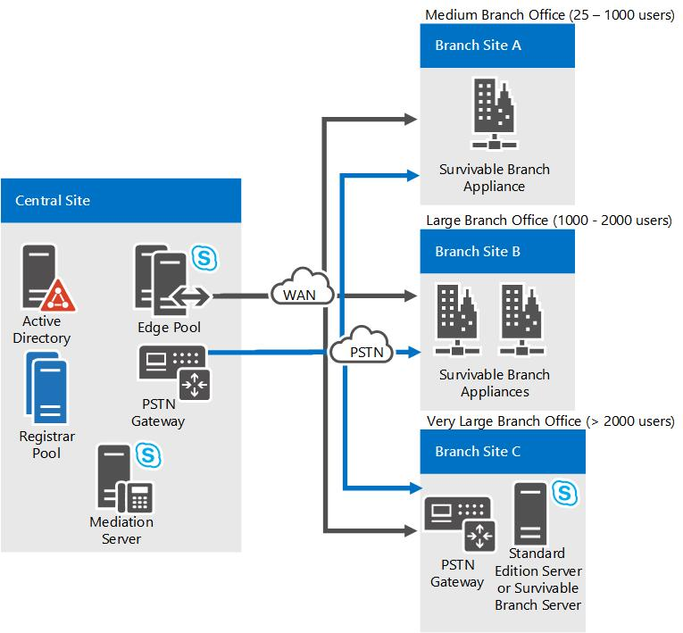

# 비즈니스용 Skype Enterprise Voice 탄력성 계획

중앙 사이트와 분기 사이트 모두에서 비즈니스용 Skype 서버 2016에서 Enterprise Voice 지원하는 방법을 배워야 합니다. 분기 사이트 옵션에는 Survivable Branch Appliance 또는 Survivable Branch Server 배포가 포함됩니다.

음성 복구는 WAN(광역 네트워크) 오류 또는 다른 원인을 통해 비즈니스용 Skype 서버를 호스팅하는 중앙 사이트를 사용할 수 없게 될 경우 사용자가 계속 전화를 걸고 받을 수 있는 기능을 지어보는 기능을 지니는 것입니다. 중앙 사이트가 실패할 경우에는 Enterprise Voice 서비스에서 백업 사이트에 대해 원활한 장애 조치를 수행하여 중단 없이 작업을 계속 수행하도록 해야 합니다. WAN 실패의 경우 분기 사이트 통화가 로컬 PSTN 게이트웨이로 리디렉션되어야 합니다. 이 섹션에서는 중앙 사이트 또는 WAN 실패 시 음성 복구 기능 계획에 대해 설명합니다.

## 중앙 사이트 탄력성

점점 많은 기업에서 전 세계에 여러 사이트를 확산시키고 있습니다. 응급 서비스, 지원 센터에 대한 액세스 및 중앙 사이트가 부재 중일 때 중요한 비즈니스 작업을 수행하는 기능을 유지 관리하는 것은 모든 Enterprise Voice 솔루션에 필수적입니다. 중앙 사이트가 사용할 수 없게 된 경우 다음 조건을 충족해야 합니다.

- 음성 장애 조치가 제공되어야 합니다.

- 중앙 사이트의 프런트 엔드 풀에 등록하는 사용자는 대체 프런트 엔드 풀에 등록할 수 있어야 합니다. 이 경우 여러 DNS SRV 레코드를 만들 수 있으며, 각 레코드는 각 중앙 사이트의 Director 풀 또는 프런트 엔드 풀로 확인됩니다. SRV 레코드의 우선 순위와 가중치를 조정하여 해당 중앙 사이트에서 서비스를 제공한 사용자가 다른 SRV 레코드의 사용자보다 먼저 해당 Director 및 프런트 엔드 풀을 사용할 수 있도록 할 수 있습니다.

- 다른 사이트에 있는 사용자와의 통화가 PSTN으로 다시 라우팅되어야 합니다.

이 항목에서는 중앙 사이트 음성 복구의 보안을 유지하는 권장 솔루션에 대해 설명합니다.

### 아키텍처 및 토폴로지

중앙 사이트에서 음성 복원을 계획하려면 음성 장애 조치(failover)를 사용하도록 설정하는 데 비즈니스용 Skype 서버 등록자가 재생하는 중앙 역할을 기본적으로 이해해야 합니다. 비즈니스용 Skype 서버 등록자는 클라이언트 등록 및 인증을 사용할 수 있으며 라우팅 서비스를 제공하는 서비스입니다. 모든 Standard Edition 서버, 프런트 엔드 서버, Director 또는 Survivable Branch Appliance에서 실행됩니다. 등록자 풀은 프런트 엔드 풀에서 실행되고 동일한 사이트에 있는 등록자 서비스로 구성됩니다. 비즈니스용 Skype 클라이언트는 다음 검색 메커니즘을 통해 프런트 엔드 풀을 검색합니다.

1. DNS SRV 레코드

2. 자동 검색 웹 서비스

3. DHCP 옵션 120

비즈니스용 Skype 클라이언트가 프런트 엔드 풀에 연결하면 부하 부하가 풀의 프런트 엔드 서버 중 하나에 연결됩니다. 이 프런트 엔드 서버는 클라이언트를 풀의 기본 설정 등록자로 리디렉션합니다.

이 등록자에 대해 Enterprise Voice 각 사용자는 특정 등록자 풀에 할당됩니다. 이 풀은 사용자의 기본 등록자 풀이 됩니다. 지정된 사이트에서 일반적으로 수백 또는 수천 명의 사용자가 하나의 기본 등록자 풀을 공유합니다. 현재 상태, 회의 또는 장애 조치를 중앙 사이트에 의존하는 분기 사이트 사용자의 중앙 사이트 리소스 사용을 계산하려면 각 분기 사이트 사용자를 중앙 사이트에 등록된 사용자로 간주하는 것이 좋습니다. 현재는 Survivable Branch Appliance에 등록된 사용자를 포함하여 분기 사이트 사용자 수에 제한이 없습니다.

중앙 사이트 실패 시 음성 복구를 지원하려면 기본 등록자 풀의 지정된 단일 백업 등록자 풀이 다른 사이트에 있어야 합니다. 토폴로지 작성기 복구 설정을 사용하여 백업을 구성할 수 있습니다. 두 사이트 간에 복구 가능한 WAN 링크가 있는 경우 기본 등록자 풀을 더 이상 사용할 수 없는 사용자는 자동으로 백업 등록자 풀에 연결됩니다.

다음 단계에서는 클라이언트 검색 및 등록 프로세스에 대해 설명합니다.

1. 클라이언트는 DNS SRV 레코드를 통해 비즈니스용 Skype 서버를 검색합니다. 비즈니스용 Skype 서버에서는 DNS SRV 쿼리에 두 개 이상의 FQDN을 반환하도록 DNS SRV 레코드를 구성할 수 있습니다. 예를 들어 Contoso라는 회사에 세 개의 중앙 사이트(북미, 유럽 및 아시아 태평양)가 있고 각 중앙 사이트에 디렉터 풀이 있는 경우 DNS SRV 레코드는 각 위치의 디렉터 풀 FQDN을 가리킬 수 있습니다. 위치 중 하나의 Director 풀을 사용할 수 있는 경우 클라이언트는 첫 번째 홉 비즈니스용 Skype 서버에 연결할 수 있습니다.

    > [!NOTE]
    > 선택 사항으로는 Director 풀을 사용하는 것이 좋습니다. 대신 프런트 엔드 풀을 사용할 수 있습니다.

2. 이사 풀은 사용자의 기본 등록자 풀 및 백업 등록자 풀에 대해 비즈니스용 Skype 클라이언트에 알릴 수 있습니다.

3. 비즈니스용 Skype 클라이언트가 먼저 사용자의 기본 등록자 풀에 연결하려고 시도합니다. 기본 등록자 풀을 사용할 수 있는 경우 등록자가 등록을 수락합니다. 기본 등록자 풀을 사용할 수 없는 경우 비즈니스용 Skype 클라이언트가 백업 등록자 풀에 연결을 시도합니다. 백업 등록자 풀을 사용할 수 있으며 지정된 장애 조치(failover) 간격에 대한 하트비트 부족을 감지하여 사용자의 기본 등록자 풀을 사용할 수 없음을 확인한 경우 백업 등록자 풀은 사용자의 등록을 수락합니다. 백업 등록자가 기본 등록자가 다시 사용 가능한 것으로 감지되면 백업 등록자 풀은 장애 조치(failover) 클라이언트를 기본 풀로 리디렉션합니다.

### 요구 사항 및 권장 사항

다음은 대부분의 조직에 적절한 중앙 사이트 음성 복구 구현에 대한 요구 사항 및 권장 사항입니다.

- 사이트의 기본 및 백업 등록자 풀이 복구 가능한 WAN 링크로 연결되어야 합니다.

- 각 중앙 사이트에 하나 이상의 등록자로 구성된 등록자 풀이 있어야 합니다.

- 각 등록자 풀은 DNS 부하 분산, 하드웨어 부하 분산 또는 둘 다를 사용하여 부하 분산되어야 합니다. 부하 분산 구성 계획에 대한 자세한 내용은 비즈니스용 Skype에 대한 부하 분산 요구 [사항을 참조하세요.](../../plan-your-deployment/network-requirements/load-balancing.md)

- 각 사용자는 비즈니스용 Skype 서버 관리 셸 **set-CsUser** cmdlet 또는 비즈니스용 Skype 서버 제어판을 사용하여 기본 등록자 풀에 할당해야 합니다.

- 기본 등록자 풀의 단일 백업 등록자 풀이 다른 중앙 사이트에 있어야 합니다.

- 기본 등록자 풀이 백업 등록자 풀로 장애 조치되도록 구성되어야 합니다. 기본적으로 기본 등록자는 300초 간격 후 백업 등록자 풀로 장애 조치되도록 설정됩니다. 비즈니스용 Skype 서버 토폴로지 작성기에서 이 간격을 변경할 수 있습니다.

- 장애 조치(failover) 경로를 구성합니다. 경로를 구성할 때 기본 경로에 지정된 게이트웨이에서 다른 사이트에 있는 게이트웨이를 지정합니다.

- 중앙 사이트에 기본 관리 서버가 포함되어 있으며 사이트가 장기적으로 다운될 가능성이 있는 경우 백업 사이트에서 관리 도구를 다시 설치해야 합니다. 그렇지 않으면 관리 설정을 변경할 수 없습니다.

### 종속성

비즈니스용 Skype 서버는 음성 탄력성 보장을 위해 다음과 같은 인프라 및 소프트웨어 구성 요소에 의존합니다.

|**구성 요소**   |**기능**   |
|:-----|:-----|
|DNS    |SRV 레코드 및 A 레코드에서 서버 간 연결 및 서버와 클라이언트 간 연결 확인    |
|Exchange와 EWV(Exchange 웹 서비스)    |대화 상대 저장, 일정 데이터    |
|Exchange 통합 메시징과 Exchange 웹 서비스    |통화 기록, 음성 메일 목록, 음성 메일    |
|DHCP 옵션 120    |DNS SRV를 사용할 수 없는 경우 클라이언트에서는 DHCP 옵션 120을 사용하여 등록자를 검색합니다. 이 기능이 작동하려면 DHCP 서버를 구성하거나 비즈니스용 Skype 서버 DHCP를 사용하도록 설정해야 합니다.    |

### 지속 가능한 음성 기능

위의 요구 사항 및 권장 사항이 구현된 경우 백업 등록자 풀에서 다음 음성 기능을 제공합니다.

- 아웃바운드 PSTN 통화

- 인바운드 PSTN 통화(전화 통신 서비스 공급자가 백업 사이트로의 장애 조치 기능을 지원하는 경우)

- 같은 사이트에 있는 사용자 및 서로 다른 두 사이트 간의 엔터프라이즈 통화

- 통화 보류, 검색 및 전송을 포함한 기본적인 통화 처리

- 같은 사이트에 있는 사용자 간의 오디오/비디오 공유 및 양자 간 인스턴트 메시징

- 착신 전환, 동시 끝점 신호 울림, 통화 위임 및 팀 통화 서비스(통화 위임의 두 당사자 또는 모든 팀 구성원이 같은 사이트에 구성된 경우에만)

- 기존 전화 및 클라이언트는 계속 작동합니다.

- CDR(통화 정보 기록)

- 인증 및 권한 부여

다음 음성 기능은 기본 중앙 사이트의 서비스가 중단된 경우 구성 방법에 따라 작동하거나 작동하지 않을 수 있습니다.

- 음성 메일 보관 및 검색

    기본 중앙 사이트의 서비스가 중단된 경우 Exchange UM을 사용하려면 다음 중 하나를 수행해야 합니다.

  - 중앙 사이트의 Exchange UM 서버가 다른 사이트에 있는 백업 Exchange UM 서버를 가리키도록 DNS SRV 레코드를 변경합니다.

  - 각 사용자의 Exchange UM 다이얼 플랜이 중앙 사이트와 백업 사이트에 모두 Exchange UM 서버를 포함하도록 구성하지만 백업 Exchange UM 서버를 사용하지 않도록 지정합니다. 기본 사이트를 사용할 수 없게 된 경우 Exchange 관리자는 백업 사이트의 Exchange UM 서버를 사용하도록 표시해야 합니다.

    위의 솔루션 중 어느 것도 가능하지 않은 경우 중앙 사이트를 사용할 수 없는 경우 Exchange UM을 사용할 수 없습니다.

- 모든 유형의 회의

    백업 사이트로 장애 조치된 사용자는 풀을 사용할 수 있는 이끌이가 만들거나 호스팅하는 전화 회의에 참가할 수 있지만 더 이상 사용할 수 없는 자신의 기본 풀에서 전화 회의를 만들거나 호스팅할 수는 없습니다. 마찬가지로 다른 사용자는 영향을 받는 사용자의 기본 풀에서 호스팅된 회의에 참가할 수 없습니다.

다음 음성 기능은 기본 중앙 사이트의 서비스가 중단된 경우 작동하지 않습니다.

- 회의 자동 길잡이

- 현재 상태 및 DND 기반 라우팅

- 착신 전환 설정 업데이트

- 응답 그룹 서비스 및 통화 대기

- 새 전화 및 클라이언트 프로비전

- 주소록 웹 검색

## 분기 사이트 탄력성

분기 사이트 탄력성, 즉 고가용성 Enterprise Voice 서비스를 제공하려는 경우 다음 세 가지 옵션을 사용할 수 있습니다.

- Survivable Branch Appliance

- Survivable Branch Server

- 분기 사이트에서 전체 비즈니스용 Skype 서버 배포

이 가이드를 참조하여 조직에 가장 적합한 복구 솔루션을 평가하고, 해당 복구 솔루션을 기반으로 하여 사용할 PSTN 연결 솔루션을 평가할 수 있습니다. 또한 이 가이드에 나와 있는 필수 구성 요소 및 기타 계획 고려 사항에 대한 설명을 참조하여 선택한 솔루션의 배포를 준비할 수 있습니다.

### 분기 사이트 탄력성 기능

분기 사이트 탄성 기능을 제공하는 경우 분기 사이트의 중앙 사이트에 대한 WAN 연결이 실패하거나 중앙 사이트에 연결되지 않은 경우 다음 음성 기능을 계속 사용할 수 있습니다.

- 인바운드 및 아웃바운드 PSTN(공중 전화망) 통화

- 같은 사이트에 있는 사용자 및 서로 다른 두 사이트 간의 엔터프라이즈 통화

- 통화 보류, 검색 및 전송을 포함한 기본적인 통화 처리

- 두 사용자 간 인스턴트 메시징

- 통화 전달, 끝점 동시 연결, 통화 위임 및 팀 통화 서비스(위임자 및 대리인(예: 관리자 및 관리자의 관리자) 또는 모든 팀 구성원이 동일한 사이트에 구성된 경우만 해당

- CDR(통화 정보 기록)

- 회의 자동 전화 교환을 사용한 PSTN 전화 접속 회의

- 음성 메일 기능: 음성 메일 다시 라우팅 설정을 구성한 경우.

- 사용자 인증 및 권한 부여

다음 기능은 해당 탄력성 솔루션이 분기 사이트에서 비즈니스용 Skype 서버의 전체 규모 배포인 경우만 사용할 수 있습니다.

- IM, 웹 및 A/V 회의

- 현재 상태 및 DND(방해 금지) 기반 라우팅(DND가 활성화된 내선의 경우 통화의 벨울림이 방지됨)

- 착신 전환 설정 업데이트

- 응답 그룹 응용 프로그램 및 통화 파크 응용 프로그램

- 새 전화 및 클라이언트를 프로비전하지만 분기 사이트에 Active Directory 도메인 서비스가 있는 경우만 가능합니다.

- E9-1-1(고급 9-1-1)

    E9-1-1이 배포되어 있으며 WAN 링크가 다운되어 중앙 사이트의 SIP 트렁크를 사용할 수 없는 경우 SIP Appliance는 E9-1-1 통화를 로컬 분기 게이트웨이로 라우팅합니다. 이 기능을 사용하도록 설정하려면 분기 사이트 사용자의 음성 정책에서 WAN 오류가 발생하면 통화를 로컬 게이트웨이로 라우팅해야 합니다.

> [!NOTE]
> SBA(SBA(Survivable Branch Office)는 XMPP에 지원되지 않습니다. SBA 구성에 있는 사용자는 IM을 보내거나 XMPP 연락처가 있는 현재 상태를 볼 수 없습니다.

### 분기 사이트 탄력성 솔루션

조직에 분기 사이트 탄력을 제공하면 분명한 이점이 있습니다. 특히 중앙 사이트에 대한 연결이 끊어진 경우 분기 사이트 사용자는 서비스 및 음성 Enterprise Voice 계속 사용할 수 있습니다(음성 메일 다시우기 설정을 구성하는 경우). 그러나 사용자가 25명 미만인 사이트의 경우 탄력성 솔루션으로는 충분한 투자 수익을 제공하지 않을 수 있습니다.

분기 사이트 탄성을 제공하려는 경우 세 가지 방법 중 하나를 사용할 수 있습니다. 다음 표를 사용하면 조직에 가장 적합한 옵션을 선택하는 데 도움이 될 수 있습니다.

|**상황**|**권장 방법**|
|:-----|:-----|
|분기 사이트에서 25~1000명의 사용자를 호스팅하려는 경우(ROI(투자 수익률)가 전체 배포를 지원하지 않거나 로컬 관리 지원을 사용할 수 없음)    |Survivable Branch Appliance    Survivable Branch Appliance는 비즈니스용 Skype 서버 등록자 및 중재 서버가 Windows Server 2008 R2에서 실행되는 업계 표준 블레이드 서버입니다. SSN(Survivable Branch Appliance)에는 PSTN(Public Switched Telephone Network) 게이트웨이도 포함되어 있습니다. SBA(Survivable Branch Appliance) 자격 검증/인증 프로그램에서 Microsoft 파트너가 개발한 적격 타사 장치는 WAN 오류 시에도 지속적인 PSTN 연결을 제공하지만, 이러한 기능은 중앙 사이트의 프런트 엔드 서버를 기반으로 하기 때문에 이 접근 방식이 탄력적인 현재 상태 및 회의 기능을 제공하지는 못합니다.    Survivable Branch Appliance에 대한 자세한 내용은 이 항목 부분의 "Survivable Branch Appliance 세부 정보"를 참조하십시오.    **참고:** SIP 트렁크와 SIP 트렁크를 SIP 어플라이언스와 함께 사용하기로 결정한 경우 SIP 어플라이언스 SIP 공급업체에 문의하여 조직에 가장 적합한 서비스 공급자에 대해 알아보십시오.   |
|분기 사이트에서 1,000~2,000명 사이의 사용자를 호스팅하고, 탄력적인 WAN 연결이 부족하며, 교육된 비즈니스용 Skype 서버 관리자를 사용할 수 있습니다.    |Survivable Branch Server 또는 2개의 Survivable Branch Appliance    SSS(Survivable Branch Server)는 비즈니스용 Skype 서버 등록자 및 중재 서버 소프트웨어가 설치되어 있는 지정된 하드웨어 요구 사항을 충족하는 Windows Server입니다. 이 서버는 전화 서비스 공급자에 대한 SIP 트렁크 또는 PSTN 게이트웨이에 연결되어야 합니다.    Survivable Branch Server에 대한 자세한 내용은 이 항목의 부분에 있는 "Survivable Branch Server Details"를 참조하십시오.    |
|최대 5,000명을 위한 음성 기능 외에 현재 상태 및 회의 기능이 필요하고 교육된 비즈니스용 Skype 서버 관리자를 사용할 수 있는 경우    |Standard Edition 서버를 분기 사이트가 아니라 중앙 사이트로 배포합니다.    전체 규모의 비즈니스용 Skype 서버 배포는 WAN 오류 발생 시 지속적인 PSTN 연결 및 복구된 현재 상태 및 회의를 제공합니다.    |

#### 복구 토폴로지

다음 그림에서는 분기 사이트 복구를 지원하는 권장 토폴로지를 보여 줍니다.

**분기 사이트 복구 옵션**

#### SBA(Survivable Branch Appliance) 세부 정보

비즈니스용 Skype 서버 Survivable Branch Appliance에는 다음 구성 요소가 포함됩니다.

- 사용자 인증, 등록 및 통화 라우팅을 수행하는 등록자

- 등록자와 PSTN 게이트웨이 간의 신호를 처리하는 중재 서버

- WAN 중단 시 PSTN 통화를 대체 전송으로 라우팅하는 PSTN 게이트웨이

- 로컬 사용자 데이터를 저장하는 SQL Server Express

Survivable Branch Appliance에는 PSTN 트렁크, 아날로그 포트 및 이더넷 어댑터도 포함됩니다.

분기 사이트의 중앙 사이트에 대한 WAN 연결을 사용할 수 없는 경우 내부 분기 사용자는 SSN(Survivable Branch Appliance) 등록자에 계속 등록되고 PSTN에 대한 Survivable Branch Appliance 연결을 사용하여 중단되지 않는 음성 서비스를 얻습니다. 홈 또는 다른 원격 위치에서 연결하는 분기 사이트 사용자는 분기 사이트의 WAN 링크를 사용할 수 없어도 중앙 사이트의 등록자 서버에 등록할 수 있습니다. 이러한 사용자는 분기 사이트로의 인바운드 통화가 음성 메일로 이동하는 것을 제외하고는 전체 통합 통신 기능을 사용할 수 있습니다. WAN 연결이 복구되면 분기 사이트 사용자를 위한 전체 기능이 복원됩니다. Survivable Branch Appliance에 대한 장애 조치(failover) 및 서비스 복원을 위해 IT 관리자가 존재할 필요는 없습니다.

비즈니스용 Skype 서버는 분기 사이트에서 최대 두 개의 Survivable Branch Appliance를 지원합니다.

#### SBA(Survivable Branch Appliance) 배포 개요

Survivable Branch Appliance는 Microsoft와 파트너십을 체결하여 원래 장비 제조업체가 제작한 제품으로, 부가 가치 있는 소매점에서 대신 배포합니다. 이 배포는 비즈니스용 Skype 서버가 중앙 사이트에 배포되고 분기 사이트에 대한 WAN 연결이 설정되고 분기 사이트 사용자가 분기 사이트에 대해 사용하도록 설정된 후에만 Enterprise Voice.

이러한 단계에 대한 자세한 내용은 배포 설명서의 [Deploying a Survivable Branch Appliance or Server](https://technet.microsoft.com/library/cb780c14-dc5f-41ba-8092-f20ae905bd16.aspx)를 참조하십시오.

|**작업 단계**|**단계**|**사용자 권한**|
|:-----|:-----|:-----|
|Survivable Branch Appliance에 대해 Active Directory 도메인 서비스 설정    |**중앙 사이트에서 다음을 수행합니다.**    분기 사이트에서 Survivable Branch Appliance를 설치 및 활성화할 관리자의 도메인 사용자 계정(또는 엔터프라이즈 ID)을 만드십시오.    Active Directory 도메인 서비스에서 Survivable Branch Appliance에 대한 컴퓨터 계정(FQDN(적용 가능한 FQDN))을 만드십시오.    토폴로지 작성기에서 Survivable Branch Appliance를 만들고 게시합니다.   |기술자 사용자 계정은 RTCUniversalSBATechnicians의 구성원이어야 합니다. Survivable Branch Appliance는 RTCSBAUniversalServices 그룹에 속해야 합니다. RTCSBAUniversalServices 그룹은 토폴로지 작성기 사용 시 자동으로 수행됩니다.    |
|Survivable Branch Appliance를 설치하고 활성화합니다.    |**분기 사이트에서 다음을 수행합니다.**    Survivable Branch Appliance를 이더넷 포트 및 PSTN 포트에 연결합니다.    Survivable Branch Appliance를 시작하십시오.    중앙 사이트에서 Survivable Branch Appliance에 대해 만든 도메인 사용자 계정을 사용하여 Survivable Branch Appliance를 도메인에 가입합니다. FQDN 및 IP 주소를 컴퓨터 계정에 만든 FQDN과 일치하도록 설정합니다.    OEM 사용자 인터페이스를 사용하여 Survivable Branch Appliance를 구성합니다.    PSTN 연결을 테스트합니다.   |기술자 사용자 계정은 RTCUniversalSBATechnicians의 구성원이어야 합니다.    |

#### 지속 가능 분기 서버 세부 정보

토폴로지 작성기에서 분기 사이트를 만들고 해당 사이트에 Survivable Branch Server를 추가한 다음 역할을 설치할 컴퓨터에서 비즈니스용 Skype 서버 배포 마법사를 실행합니다.

### 분기 사이트 탄력성 요구 사항

이 항목에서는 사용자의 분기 사이트 복구 준비, 음성 메일 지속성 준비 및 관련 하드웨어/소프트웨어 요구 사항에 대한 정보를 제공합니다.

#### 사용자의 분기 사이트 복구 준비

등록자 풀을 SBA(Survivable Branch Appliance) 또는 SBA(Survivable Branch Server)로 설정하여 사용자에게 분기 사이트 복원을 준비합니다.

#### 분기 사용자에 대한 등록자 할당

선택하는 분기 사이트 복원 솔루션에 관계없이 각 사용자에게 기본 등록자를 할당해야 합니다. 분기 사이트 사용자는 등록자가 Survivable Branch Appliance, Survivable Branch Server 또는 독립 실행형 비즈니스용 Skype 서버 Standard 또는 Enterprise Edition 서버에 있는지에 관계없이 항상 분기 사이트의 등록자에 등록해야 합니다. 클라이언트에서 해당 등록자 풀을 검색하려면 DNS(Domain Name System) SRV(서비스 리소스 레코드)가 필요합니다. Survivable Branch Appliance를 사용할 수 없게 되는 경우 분기 사이트 클라이언트가 백업 등록자를 자동으로 검색하는 방식입니다.

분기 사이트에 DNS 서버가 없는 경우 다음 두 가지 방법으로 Survivable Branch Appliance 또는 Survivable Branch Server의 검색을 구성할 수 있습니다.

- SSP(Survivable Branch Appliance) 또는 SSP(Survivable Branch Server)의 FQDN(정식 도메인 이름)을 지점 사이트의 DHCP(Dynamic Host Configuration Protocol) 서버에서 DHCP 옵션 120을 구성합니다.

- DHCP 120 쿼리에 응답하도록 Survivable Branch Appliance 또는 Survivable Branch Server를 구성합니다.

#### 분기 사용자를 위한 음성 라우팅

분기 사이트의 사용자를 위한 별도의 사용자 수준 VoIP(Voice over Internet Protocol) 정책을 만드는 것이 좋습니다. 이 정책에는 SSN(Survivable Branch Appliance) 또는 분기 서버 게이트웨이를 사용하는 기본 경로와 중앙 사이트의 PSTN(전화망) 게이트웨이가 있는 트렁크를 사용하는 하나 이상의 백업 경로가 포함되어야 합니다. 기본 경로를 사용할 수 없는 경우 하나 이상의 중앙 사이트 게이트웨이를 사용하는 백업 경로가 대신 사용됩니다. 이렇게 하면 분기 사이트 등록자 또는 중앙 사이트의 백업 등록자 풀에서 사용자가 등록된 위치와 관계없이 사용자의 VoIP 정책이 항상 적용됩니다. 이 방식은 장애 조치(failover) 시나리오에서 중요한 고려 사항입니다. 예를 들어 Survivable Branch Appliance의 이름을 변경하거나 Survivable Branch Appliance를 다시 구성하여 중앙 사이트의 백업 등록자 풀에 연결하려면 분기 사이트 사용자를 중앙 사이트로 이동해야 합니다. Survivable Branch Appliance의 이름을 변경하거나 다시 구성하는 데 대한 자세한 내용은 부록 B: 배포 설명서에서 [Survivable Branch Appliance](https://technet.microsoft.com/library/2ec9d505-6d39-491c-9524-8cf36866b855.aspx) 관리를 참조하십시오. 이러한 사용자에게 사용자 수준 VoIP 정책 또는 사용자 수준 다이얼 플랜이 없는 경우 사용자가 다른 사이트로 이동될 때 중앙 사이트의 사이트 수준 VoIP 정책 및 사이트 수준 다이얼 플랜은 기본적으로 분기 사이트 사이트 수준 VoIP 정책 및 다이얼 플랜 대신 사용자에게 적용됩니다. 이 시나리오에서는 백업 등록자 풀에서 사용되는 사이트 수준 VoIP 정책 및 사이트 수준 다이얼 플랜이 분기 사이트 사용자에게도 적용될 수 있지 않는 한 해당 통화가 실패합니다. 예를 들어 일본에 있는 분기 사이트의 사용자가 레드몬드의 중앙 사이트로 이동될 경우 모든 7자리 숫자 통화에 +1425를 추가하는 정규화 규칙의 다이얼 플랜은 해당 사용자에 대한 통화를 올바르게 변환하지 않을 수 있습니다.

> [!IMPORTANT]
> 지점 백업 경로를 만드는 경우 두 개의 PSTN 전화 사용 레코드를 지점 사용자 정책에 추가하고 각 레코드에 별도의 경로를 할당하는 것이 좋습니다. 첫 번째 또는 기본 경로는 SBA(Survivable Branch Appliance) 또는 분기 서버와 연결된 게이트웨이로 통화를 연결합니다. 두 번째 또는 백업 경로는 통화를 중앙 사이트의 게이트웨이로 연결합니다. 통화를 전달할 때 SBA(fea-boa) 또는 분기 서버는 두 번째 사용 레코드를 시도하기 전에 첫 번째 PSTN 사용 레코드에 할당된 모든 경로를 시도합니다.

분기 사이트 사용자에 대한 인바운드 호출이 Survivable Branch Appliance 사이트의 Windows 구성 요소를 사용할 수 없는 경우(예: 유지 관리에 대해 Survivable Branch Appliance 또는 분기 게이트웨이가 다운된 경우) 게이트웨이에 장애 조치(failover) 경로를 만들거나 DID(Direct Inward Dialing) 공급자와 함께 중앙 사이트의 백업 등록자 풀로 들어오는 호출을 리디렉션합니다. 여기에서 통화는 WAN 링크를 통해 분기 사용자에게 라우팅됩니다. 경로는 PSTN 게이트웨이 또는 다른 트렁크 피어의 허용 전화 번호 형식을 준수하기 위해 번호를 변환해야 합니다. 장애 조치(failover) 경로를 만드는 방법에 대한 자세한 내용은 [Configuring a Failover Route](https://technet.microsoft.com/library/76e48df4-3b78-4fb7-b1f7-c1e604b81bad.aspx)을 참조하십시오. 또한 수신 통화를 정규화하도록 분기 사이트의 게이트웨이와 연결된 트렁크에 대한 서비스 수준의 다이얼 플랜을 만듭니다. 분기 사이트에 2개의 Survivable Branch Appliance가 있는 경우 각각에 대해 별도의 서비스 수준 계획이 필요하지 않은 경우 둘 다에 대한 사이트 수준 다이얼 플랜을 만들 수 있습니다.

> [!NOTE]
> 현재 상태, 회의 또는 장애 조치를 중앙 사이트에 의존하는 분기 사이트 사용자의 중앙 사이트 리소스 사용을 계산하려면 각 분기 사이트 사용자를 중앙 사이트에 등록된 사용자로 간주하는 것이 좋습니다. 현재는 Survivable Branch Appliance에 등록된 사용자를 포함하여 분기 사이트 사용자 수에 제한이 없습니다.

사용자 수준 다이얼 플랜 및 음성 정책을 만들어 분기 사이트 사용자에게 할당하는 것도 좋습니다. 자세한 내용은 배포 설명서에서 비즈니스용 [Skype](../../deploy/deploy-enterprise-voice/dial-plans.md) 서버에서 다이얼 플랜 만들기 또는 수정 및 분기 사용자에 대한 [VoIP](https://technet.microsoft.com/library/10deca9f-f870-4a42-b25d-e4fc53108658.aspx) 라우팅 정책 만들기를 참조하십시오.

#### 내선 번호 라우팅

분기 사이트 사용자에 대해 다이얼 플랜 및 음성 정책을 준비할 때 msRTCSIP-line(또는 Line URI) 특성에 사용되는 문자열 및 번호 형식과 일치하는 정규화 규칙 및 변환 규칙을 포함해야 분기 사이트 사용자와 중앙 사이트 사용자 간에 사용하도록 설정된 비즈니스용 Skype 통화가 올바르게 라우팅됩니다( 특히 WAN 링크를 사용할 수 없는 경우 PSTN을 통해 통화를 다시 라우팅해야 하는 경우). 전화 번호만 있는 것이 아니라 내선이 포함된 전화 접속 번호의 경우에는 특별한 추가 고려 사항이 있습니다.

내선 번호를 포함하는 줄 URI와 일치하는 정규화 규칙 및 변환 규칙은 배타적으로 사용되든 전체 E.164 전화 번호에 추가로 사용되든 간에 추가적인 요구 사항이 있습니다. 이 섹션에서는 내선 번호가 포함된 줄 URI에 대한 통화를 라우팅하는 몇 가지 예제 시나리오에 대해 설명합니다.

조직에 개별 사용자에 대한 DID(Direct Inward Dial) 전화 번호가 구성되어 있지 않고 각 사용자의 줄 URI에 내선 번호만 구성된 경우 내부 사용자는 내선 번호만 사용하여 서로 통화할 수 있습니다. 하지만 분기 사이트 사용자와 중앙 사이트 사용자 간의 통화에 적용되는 내선 번호와 일치하는 정규화 규칙을 구성해야 합니다.

분기 사이트와 중앙 사이트 간의 WAN 링크를 사용할 수 있는 시나리오에서는 분기 사이트 사용자로부터 중앙 사이트 사용자로의 통화에는 통화가 PSTN을 통해 라우팅되지 않으므로 번호를 변환할 일치하는 정규화 규칙이 필요하지 않습니다. 예를 들면 다음과 같습니다.

|**규칙 이름**|**설명**|**번호 패턴**|**Translation**|**예**|
|:-----|:-----|:-----|:-----|:-----|
|5digitExtensions    |5자리 숫자를 변환하지 않음    |^(\d {5} )$    |$1    |10001이 변환되지 않음    |

또한 분기 사이트와 중앙 사이트 간의 WAN 링크를 사용할 수 없고 분기 사이트로부터의 통화를 PSTN을 통해 라우팅해야 하는 경우와 같은 특정 시나리오를 위한 내선 번호를 수용할 수 있어야 합니다. WAN이 정전되는 동안 분기 사이트 사용자가 중앙 사이트 사용자의 내선 번호로만 중앙 사이트 사용자에게 전화를 걸 경우 중앙 사이트 사용자의 전체 전화 번호를 추가하는 아웃바운드 변환 규칙이 있어야 합니다. 사용자의 줄 URI에 조직의 전체 전화 번호와 사용자 고유의 전체 전화 번호 대신 사용자의 고유한 내선 번호가 포함되어 있는 경우 조직의 전체 전화 번호를 추가하는 아웃바운드 변환 규칙이 있어야 합니다. 예시:

|**설명**|**일치 패턴**|**Translation**|**예**|
|:-----|:-----|:-----|:-----|
|5자리 번호를 사용자의 전화 번호 및 내선 번호로 변환    |^(\d {5} )$    |+14255550123;ext=$1    |10001이 +14255550123;ext=10001로 변환됨    |
|5자리 번호를 조직의 전화 번호 및 사용자의 내선 번호로 변환    |^(\d {5} )$    |+14255550100;ext=$1    |10001이 +14255550100;ext=10001로 변환됨    |

이 시나리오에서 PSTN에 대한 재라우팅을 처리하는 트렁크 피어가 내선 번호를 지원하지 않을 경우에는 아웃바운드 변환 규칙에서도 내선 번호를 제거해야 합니다. 예를 들면 다음과 같습니다.

|**설명**|**일치 패턴**|**Translation**|**예**|
|:-----|:-----|:-----|:-----|
|내선이 포함된 전화 번호에서 내선 제거    |^\+(\d \* ); ext=(\d \* )$    |+$1    |+14255550123;ext=10001이 +14255550123으로 변환됨    |

WAN 링크를 사용할 수 있는지 여부에 따라 조직에 개별 사용자에 대해 DID 번호가 구성되어 있지 않은 경우 사용자의 줄 URI에 조직의 전화 번호와 사용자의 고유한 내선 번호가 포함되어 있는 경우 분기 사이트의 트렁크 피어 또는 PSTN 게이트웨이에서 도달할 수 있는 번호로 조직의 전화 번호 줄 URI를 구성해야 합니다. 또한 통화가 해당 번호로 라우팅될 수 있도록 고유한 내선 번호를 포함하도록 조직의 전화 번호 줄 URI를 구성해야 합니다.

#### 음성 메일 지속성 준비

Exchange UM(통합 메시징)은 일반적으로 분기 사이트가 아닌 중앙 사이트에만 설치됩니다. 발신자는 분기 사이트와 중앙 사이트 간의 WAN 링크를 사용할 수 없는 경우에도 음성 메일 메시지를 남길 수 있어야 합니다. 따라서 분기 사이트 사용자에게 음성 메일을 제공하는 Exchange UM 자동 전화 교환 전화 번호에 대한 줄 URI를 구성하려면 해당 음성 메일 번호에 적용할 수 있는 음성 정책, 다이얼 플랜 및 정규화 규칙 외에 특별한 사항을 고려해야 합니다.

SB(Survivable Branch Appliance) 및 지속 가능 분기 서버는 WAN을 사용할 수 없는 동안 분기 사용자에게 음성 메일 지속성을 제공합니다. 특히 SBA(Survivable Branch Appliance) 또는 SBA(Survivable Branch Server)를 사용 중일 때 WAN을 사용할 수 없는 경우 SBA 또는 SBA 또는 Survivable Branch Server는 PSTN을 통해 대응되지 않은 통화를 중앙 사이트의 Exchange UM으로 다시 전송합니다. SBA 또는 SBA(Survivable Branch Server)를 사용하여 사용자는 WAN이 꺼지는 동안 PSTN을 통해 음성 메일 메시지를 검색할 수도 있습니다. 마지막으로, WAN이 정전되는 동안 Survivable Branch Appliance 또는 Survivable Branch Server는 부재 중 전화 알림을 큐에 대기한 다음 WAN이 복원되면 Exchange UM 서버에 업로드합니다. 음성 메일 다시라우트가 탄력적으로 실행되도록 보장하기 위해 중앙 사이트 풀의 FQDN에 대한 항목과 에지 서버 FQDN의 항목을 SSR(Survivable Branch Server)의 호스트 파일에 추가해야 합니다. 그렇지 않으면 분기 사이트에 DNS 서버가 없는 경우 DNS 확인 시간이 초과될 수 있습니다.

분기 사이트 사용자에 대해 음성 메일 지속성을 제공하려면 다음과 같이 구성하는 것이 좋습니다.

- Microsoft Exchange 관리자는 메시지만 수락하도록 자동 전화 교환 AA(Exchange UM 서버)를 구성해야 합니다. 이 구성은 사용자에게 전송 또는 교환원에게 전송과 같은 다른 모든 일반 기능을 비활성화하고 메시지만 허용하도록 AA를 제한합니다. 또는 Exchange 관리자는 일반 AA를 사용하거나 통화를 교환원에게 라우팅하도록 사용자 지정된 AA를 사용할 수 있습니다.

- 비즈니스용 Skype 서버 관리자는 AA 전화 번호를 사용하여 해당 전화 번호를 Survivable Branch Appliance 또는 분기 서버에 대한 음성 메일 다시 연결 설정의 **Exchange um** 자동 전화 교환 번호로 사용해야 합니다.

- 비즈니스용 Skype 서버 관리자는 Exchange UM 구독자 액세스 전화 번호를  얻었다가 해당 번호를 Survivable Branch Appliance 또는 Survivable Branch Server의 음성 메일 재라우팅 설정에서 구독자 액세스 번호로 사용해야 합니다.

- 비즈니스용 Skype 서버 관리자는 WAN을 사용할 수 있는 동안 음성 메일에 액세스해야 하는 모든 분기 사용자와 하나의 다이얼 플랜만 연결하도록 Exchange UM을 구성해야 합니다.

- WAN 링크를 사용할 수 없는 경우 분기 사이트 사용자에 대한 통화를 사용자의 Exchange UM(통합 메시징) 음성 사서함으로 라우팅할 수 있지만, 통화에 적용된 음성 정책이 고유하고 내선 번호를 포함하지 않는 음성 메일 전화 번호를 지정하는 경우만 가능합니다.

#### 분기 사이트 복구를 위한 하드웨어 및 소프트웨어 요구 사항

하드웨어 및 소프트웨어 요구 사항은 복구 솔루션에 따라 다릅니다.

#### SBA(Survivable Branch Appliance)에 대한 요구 사항

필수 하드웨어 및 소프트웨어는 Survivable Branch Appliance에 기본 제공되어 있습니다. 그러나 각 분기 사이트에서 클라이언트 IP 주소를 얻기 위해 DHCP 서버를 배포하는 것이 좋습니다. 그렇지 않으면 DHCP 임대가 만료되면 클라이언트에 IP 연결이 없습니다.

엔터프라이즈 DNS 서버가 중앙 사이트에만 있는 경우 분기 사이트 사용자는 WAN을 사용할 수 없게 하므로 DNS SRV(서비스) 리소스 레코드를 사용하는 비즈니스용 Skype 서버 검색이 실패합니다. WAN 중단 중에 프롬프트 재라우팅을 보장하려면 DNS 레코드가 분기 사이트에서 캐시되어야 합니다. 분기 라우터에서 지원할 경우에는 DNS 캐싱을 사용하도록 설정하십시오. 또는 분기 사이트에 DNS 서버를 배포할 수 있습니다. 독립 실행형 서버 또는 DNS 기능을 지원하는 Survivable Branch Appliance 버전일 수 있습니다. 자세한 내용은 Survivable Branch Appliance 공급자에게 문의하십시오.

> [!NOTE]
> 분기 사이트에 도메인 컨트롤러를 사용할 필요는 없습니다. SSS(Survivable Branch Appliance)는 로그인할 때 클라이언트의 인증서 요청에 대한 응답으로 클라이언트를 보내는 특수 인증서를 사용하여 클라이언트를 인증합니다.

비즈니스용 Skype 클라이언트는 DHCP 옵션 120(SIP 등록자 옵션)을 사용하여 비즈니스용 Skype 서버를 검색할 수 있습니다. 이 구성은 다음 두 가지 방법 중 하나를 사용하여 구성할 수 있습니다.

- DHCP 120 쿼리에 회신하도록 분기 사이트의 DHCP 서버를 구성하여 Survivable Branch Appliance 또는 Survivable Branch Server에서 등록자 FQDN을 반환합니다.

- 비즈니스용 Skype 서버 DHCP를 켜습니다. 이 설정이 설정되어 있는 경우 비즈니스용 Skype 서버 등록자는 DHCP 옵션 120 쿼리에 응답합니다. 등록자는 DHCP 옵션 120이 아닌 DHCP 쿼리에 응답하지 않습니다.

또한 서브넷이 여러 개 있는 대규모 분기 사이트의 경우 DHCP 옵션 120 쿼리를 DHCP 서버(구성 1) 또는 등록자(구성 2)로 전달하려면 DHCP 릴레이 에이전트를 사용하도록 설정해야 합니다.

마지막으로 분기 사이트 사용자를 적절한 통합 통신 끝점으로 Enterprise Voice 구성하고 프로비전해야 합니다.

#### Survivable Branch Server에 대한 요구 사항

Survivable Branch Server의 요구 사항은 프런트 엔드 서버의 요구 사항과 동일합니다. 자세한 내용은 비즈니스용 [Skype 서버 2015에](../../plan-your-deployment/requirements-for-your-environment/server-requirements.md)대한 서버 요구 사항을 참조하세요.

#### 비즈니스용 Skype Full-Scale 서버 배포에 대한 Branch-Site 요구 사항

자세한 내용은 계획 설명서에서 [비즈니스용 Skype 서버 2015에](../../plan-your-deployment/requirements-for-your-environment/server-requirements.md) 대한 서버 요구 사항을 참조하십시오.

### 예: 장애 조치(failover) 경로 구성

 다음 예제에서는 관리자가 Dallas-GW1이 유지 관리를 위해 다운되거나 다른 이유로 인해 사용할 수 없는 경우 사용할 장애 조치(failover) 경로를 정의할 수 있는 방법을 보여 줍니다. 다음 표에서는 필요한 구성 변경을 보여 줍니다.

**표 1. 사용자 정책**

|**사용자 정책**|**전화 사용**|
|:-----|:-----|
|기본 통화 정책    |로컬    GlobalPSTNHopoff    |
|레드몬드 시내 정책    |RedmondLocal    |
|달라스 통화 정책    |DallasUsers    GlobalPSTNHopoff    |

**표 2. 경로**

| **경로 이름**             | **번호 패턴** | **전화 사용**         | **트렁크**                                 | **게이트웨이**                                     |
|:---------------------------|:-------------------|:------------------------|:------------------------------------------|:------------------------------------------------|
| 레드몬드 시내 경로    | ^\+1(425           | 206                     | 253)(\d {7} )$                          | 로컬    RedmondLocal                   |
| 달라스 시내 경로     | ^\+1(972           | 214                     | 469)(\d {7} )$                          | 로컬                                       |
| 범용 경로        | ^\+? \*(\d) $    | GlobalPSTNHopoff    | Trunk1    Trunk2    Trunk3    | Red-GW1    Red-GW2    Dallas-GW1    |
| 달라스 사용자 경로     | ^\+? \*(\d) $    | DallasUsers         | Trunk3                                | Dallas-GW1                                  |

표 1에서 GlobalPSTNHopoff의 전화 사용은 달라스 통화 정책의 DallasUsers 전화 사용 뒤에 추가됩니다. 이렇게 하면 DallasUsers 전화 사용의 경로를 사용할 수 없는 경우 달라스 통화 정책의 통화가 GlobalPSTNHopoff 전화에 대해 구성된 경로를 사용할 수 있습니다.

