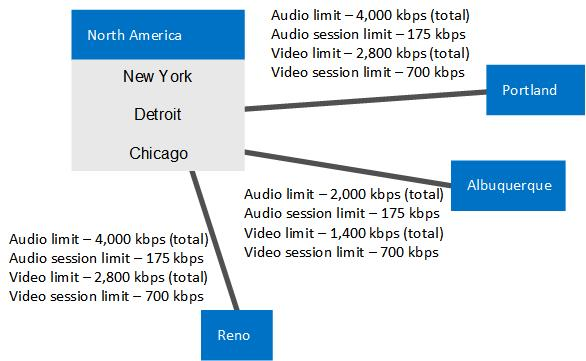

# 예: 비즈니스용 Skype 서버에서 통화 제어에 대한 요구 사항 수집Example: Gathering requirements for call admission control in Skype for Business Server

네트워크의 사이트, 지역 및 대역폭에 대한 정보 수집을 포함하여 비즈니스용 Skype 서버 Enterprise Voice 통화 제어에 대한 자세한 계획 예제를 제공합니다.Provides a detailed example of planning for call admission control in Skype for Business Server Enterprise Voice, including gathering information about your network's sites, regions, and bandwidth.

이 예에서는 CAC(통화 허용 제어)를 계획하고 구현하는 방법을 보여 줍니다. 이 과정은 크게 다음 작업으로 구성됩니다.This example shows you how to plan for and implement call admission control (CAC). At a high level, this consists of the following activities:

1. 모든 네트워크 허브 및 백본(네트워크 지역이라고 함) 확인Identify all of your network hubs and backbones (known as network regions).

2. 각 네트워크 지역에 대해 CAC를 관리할 비즈니스용 Skype 서버 중앙 사이트를 식별합니다.Identify the Skype for Business Server central site that will manage CAC for each network region.

3. 각 네트워크 지역에 연결된 네트워크 사이트 확인 및 정의Identify and define the network sites that are connected to each network region.

4. WAN에 대한 연결이 대역폭이 제한되는 각 네트워크 사이트에 대해 WAN 연결의 대역폭 용량과 네트워크 관리자가 비즈니스용 Skype 서버 미디어 트래픽에 대해 설정한 대역폭 제한(해당되는 경우)에 대해 설명하세요.For each network site whose connection to the WAN is bandwidth-constrained, describe the bandwidth capacity of the WAN connection and the bandwidth limits that to the network administrator has set for Skype for Business Server media traffic, if applicable. WAN 연결에 대한 대역폭 제한이 없는 사이트는 포함하지 않아도 됩니다.You do not need to include sites whose connection to the WAN is not bandwidth-constrained.

5. 네트워크의 각 서브넷을 네트워크 사이트와 연결Associate each subnet in your network with a network site.

6. 네트워크 지역 간의 링크 매핑.Map the links between the network regions. 각 링크에 대해 대역폭 용량 및 네트워크 관리자가 비즈니스용 Skype 서버 미디어 트래픽에 대해 설정한 제한을 설명합니다.For each link, describe its bandwidth capacity and any limits that the network administrator has placed on Skype for Business Server media traffic.

7. 모든 네트워크 지역 쌍 간의 경로 정의Define a route between every pair of network regions.

## 필요한 정보 수집Gather the Required Information

통화 허용 제어를 준비하려면 다음 단계에 설명된 정보를 수집합니다.To prepare for call admission control, gather the information described in the following steps:

1. 네트워크 지역을 확인합니다. 네트워크 지역은 네트워크 백본 또는 네트워크 허브를 나타냅니다.Identify your network regions. A network region represents a network backbone or a network hub. 

    네트워크 백본 또는 네트워크 허브는 네트워크의 여러 부분을 상호 연결하는 컴퓨터 네트워크 인프라의 일부로서, 서로 다른 LAN 또는 서브넷 간의 정보 교환 경로를 제공합니다. 백본은 소규모 위치에서 지리적으로 넓은 지역에 이르기까지 다양한 네트워크를 함께 묶을 수 있습니다. 따라서 백본의 용량은 일반적으로 백본에 연결된 네트워크의 용량보다 큽니다.A network backbone or a network hub is a part of computer network infrastructure that interconnects various pieces of network, providing a path for the exchange of information between different LANs or subnets. A backbone can tie together diverse networks, from a small location to a wide geographic area. The backbone's capacity is typically greater than that of the networks connected to it.

    여기에 설명된 토폴로지에는 북미, EMEA, APAC, 이렇게 세 개의 네트워크 지역이 있습니다. 네트워크 지역은 네트워크 사이트 모음을 포함합니다. 네트워크 관리자와 함께 회사의 네트워크 지역을 정의하십시오.Our example topology has three network regions: North America, EMEA, and APAC. A network region contains a collection of network sites. Work with your network administrator to define the network regions for your enterprise.

2. 각 네트워크 지역의 연결된 중앙 사이트를 식별합니다.Identify each network region's associated central site. 중앙 사이트에는 하나 이상의 프런트 엔드 서버가 포함되어 있으며 네트워크 지역의 WAN 연결을 통과하는 모든 미디어 트래픽에 대해 CAC를 관리할 비즈니스용 Skype 서버 배포입니다.A central site contains at least one Front End Server and is the Skype for Business Server deployment that will manage CAC for all media traffic that passes through the network region's WAN connection.

   **세 개의 네트워크 지역으로 분할된 엔터프라이즈 네트워크의 예****An example enterprise network divided into three network regions**

     

    > [!NOTE]
    > MPLS(Multiprotocol Label Switching) 네트워크는 각 지리적 위치에 해당하는 네트워크 사이트가 있는 네트워크 지역으로 표시됩니다.A Multiprotocol Label Switching (MPLS) network should be represented as a network region in which each geographic location has a corresponding network site. 자세한 내용은 비즈니스용 Skype의 통화 입장 제어에 대한 구성 요소 및 [토폴로지 를 참조하세요.](components-and-topologies.md)For details, see [Components and topologies for call admission control in Skype for Business](components-and-topologies.md). 

    위의 네트워크 토폴로지 예에는 각각 CAC를 관리하는 비즈니스용 Skype 서버 중앙 사이트가 있는 세 개의 네트워크 지역이 있습니다.In the preceding example network topology, there are three network regions, each with a Skype for Business Server central site that manages CAC. 네트워크 지역에 적합한 중앙 사이트는 지리적 근접성에 따라 선택됩니다.The appropriate central site for a network region is chosen by the geographic vicinity. 미디어 트래픽은 네트워크 지역 내에서 부하가 가장 크기 때문에 지리적 근접성에 따라 소유권을 할당하면 네트워크 지역이 자동으로 포함되고 다른 중앙 사이트를 사용할 수 없는 경우에도 네트워크 지역이 계속 작동합니다.Because media traffic will be heaviest within network regions, the ownership by geographic vicinity makes it self-contained and will continue to be functional even if other central sites become unavailable. 

    이 예에서 시카고라는 비즈니스용 Skype 배포는 북미 지역의 중앙 사이트입니다.In this example, a Skype for Business deployment named Chicago is the central site for the North America region.

    북미의 모든 비즈니스용 Skype 사용자는 시카고 배포의 서버에 있습니다.All Skype for Business users in North America are homed on servers in the Chicago deployment. 다음 표에서는 세 개의 네트워크 지역에 대한 중앙 사이트를 보여 줍니다.The following table shows central sites for all three network regions.

    **네트워크 지역 및 관련 중앙 사이트****Network Regions and their Associated Central Sites**

    |**네트워크 지역****Network Region**|**중앙 사이트****Central Site**|
    |:-----|:-----|
    |북미North America    |시카고Chicago    |
    |EMEAEMEA    |런던London    |
    |APACAPAC    |베이징Beijing    |

    > [!NOTE]
    > 비즈니스용 Skype 서버 토폴로지에 따라 동일한 중앙 사이트를 여러 네트워크 지역에 할당할 수 있습니다.Depending on your Skype for Business Server topology, the same central site can be assigned to multiple network regions. 

3. 각 네트워크 지역에 대해 WAN 연결에 대역폭 제한이 없는 모든 네트워크 사이트(사무실 또는 위치)를 확인합니다. 이러한 사이트는 대역폭 제한이 없으므로 CAC 대역폭 정책을 적용할 필요가 없습니다.For each network region, identify all of the network sites (offices or locations) whose WAN connections are not bandwidth-constrained. Because these sites are not bandwidth constrained, you do not need to apply CAC bandwidth policies to them.

    아래 표의 예에서는 WAN 링크에 대한 대역폭 제한이 없는 세 개의 네트워크 사이트(뉴욕, 시카고 및 디트로이트)를 보여 줍니다.In the example shown in the following table, three network sites do not have bandwidth-constrained WAN links: New York, Chicago, and Detroit.

   **WAN 대역폭 제한이 없는 네트워크 사이트****Network Sites not Constrained by WAN Bandwidth**

   | **네트워크 사이트****Network Site** | **네트워크 지역****Network Region**   |
   |:-----------------|:---------------------|
   | 뉴욕New York     | 북미North America    |
   | 시카고Chicago      | 북미North America    |
   | 디트로이트Detroit      | 북미North America    |

4. 각 네트워크 지역에 대해 대역폭이 제한된 WAN 링크를 통해 네트워크 지역에 연결되는 모든 네트워크 사이트를 확인합니다.For each network region, identify all of the network sites that connect to the network region through bandwidth-constrained WAN links.

    오디오 및 비디오 품질을 보장하기 위해 대역폭이 제한된 이러한 네트워크 사이트에서는 WAN을 모니터링하고 네트워크 지역에서 들어오고 나가는 미디어(음성 또는 비디오) 트래픽 흐름을 제한하는 CAC 대역폭 정책을 적용하는 것이 좋습니다.To help ensure audio and video quality, we recommend that these bandwidth-constrained network sites have their WANs monitored and CAC bandwidth policies that limit media (voice or video) traffic flow to and from the network region.

    아래 표의 예에서는 WAN 대역폭이 제한된 세 개의 네트워크 사이트(포틀랜드, 리노 및 앨버커키)를 보여 줍니다.In the example shown in the following table, there are three network sites that are constrained by WAN bandwidth: Portland, Reno and Albuquerque.

   **WAN 대역폭이 제한된 네트워크 사이트****Network Sites Constrained by WAN Bandwidth**

   |**네트워크 사이트****Network Site**|**네트워크 지역****Network Region**|
   |:-----|:-----|
   |앨버커키Albuquerque    |북미North America    |
   |RenoReno    |북미North America    |
   |포틀랜드Portland    |북미North America    |

   **대역폭 제한이 없는 세 개의 네트워크 사이트(시카고, 뉴욕 및 디트로이트)와 WAN 대역폭이 제한된 세 개의 네트워크 사이트(포틀랜드, 리노 및 앨버커키)가 포함된 북미 CAC 네트워크 지역****CAC network region North America with three network sites that are unconstrained by bandwidth (Chicago, New York, and Detroit) and three network sites that are constrained by WAN bandwidth (Portland, Reno, and Albuquerque)**

     

5. 대역폭이 제한된 각 WAN 링크에 대해 다음 사항을 확인합니다.For each bandwidth-constrained WAN link, determine the following:

   - 모든 동시 오디오 세션에 대해 설정할 전체 대역폭 제한.Overall bandwidth limit that you want to set for all concurrent audio sessions. 새 오디오 세션으로 인해 이 제한이 초과되는 경우 비즈니스용 Skype 서버는 세션 시작을 허용하지 않습니다.If a new audio session will cause this limit to be exceeded, Skype for Business Server does not allow the session to start.

   - 각각의 개별 오디오 세션에 대해 설정할 대역폭 제한. 기본 CAC 대역폭 제한은 175kbps이지만 관리자가 수정할 수 있습니다.Bandwidth limit that you want to set for each individual audio session. The default CAC bandwidth limit is 175 kbps, but it can be modified by the administrator.

   - 모든 동시 비디오 세션에 대해 설정할 전체 대역폭 제한.Overall bandwidth limit that you want to set for all concurrent video sessions. 새 비디오 세션으로 인해 이 제한이 초과되는 경우 비즈니스용 Skype 서버는 세션 시작을 허용하지 않습니다.If a new video session will cause this limit to be exceeded, Skype for Business Server does not allow the session to start.

   - 각각의 개별 비디오 세션에 대해 설정할 대역폭 제한. 기본 CAC 대역폭 제한은 700kbps이지만 관리자가 수정할 수 있습니다.Bandwidth limit that you want to set for each individual video session. The default CAC bandwidth limit is 700 kbps, but it can be modified by the administrator.

     **WAN 대역폭 제한 정보가 있는 네트워크 사이트(대역폭 단위: kbps)****Network Sites with WAN Bandwidth Constraint Information (Bandwidth in kbps)**

     | **네트워크 사이트****Network Site**   | **네트워크 지역****Network Region**   | **대역폭 제한****BW Limit**      | **오디오 제한****Audio Limit**   | **오디오 세션 제한****Audio Session Limit** | **비디오 제한****Video Limit**   | **비디오 세션 제한****Video Session Limit** |
     |:-------------------|:---------------------|:------------------|:------------------|:------------------------|:------------------|:------------------------|
     | 앨버커키Albuquerque    | 북미North America    | 5,0005,000         | 2,0002,000         | 175175                 | 1,4001,400         | 700700                 |
     | RenoReno           | 북미North America    | 10,00010,000        | 4,0004,000         | 175175                 | 2,8002,800         | 700700                 |
     | 포틀랜드Portland       | 북미North America    | 5,0005,000         | 4,0004,000         | 175175                 | 2,8002,800         | 700700                 |
     | 뉴욕New York       | 북미North America    | (제한 없음)(no limit)    | (제한 없음)(no limit)    | (제한 없음)(no limit)          | (제한 없음)(no limit)    | (제한 없음)(no limit)          |
     | 시카고Chicago        | 북미North America    | (제한 없음)(no limit)    | (제한 없음)(no limit)    | (제한 없음)(no limit)          | (제한 없음)(no limit)    | (제한 없음)(no limit)          |
     | 디트로이트Detroit        | 북미North America    | (제한 없음)(no limit)    | (제한 없음)(no limit)    | (제한 없음)(no limit)          | (제한 없음)(no limit)    | (제한 없음)(no limit)          |

6. 네트워크의 모든 서브넷에 대해 연결된 네트워크 사이트를 지정합니다.For every subnet in your network, specify its associated network site.

    > [!IMPORTANT]
    > 네트워크의 모든 서브넷은 네트워크 사이트와 연결되어야 하며, 네트워크 사이트에 대한 대역폭 제한이 없는 경우에도 마찬가지입니다. 이는 통화 허용 제어에서 서브넷 정보를 사용하여 끝점이 있는 네트워크 사이트를 확인하기 때문입니다. 세션에 참가한 두 대상의 위치가 확인되면 통화 허용 제어에서 통화를 연결하기에 충분한 대역폭이 있는지 확인할 수 있습니다. 대역폭 제한이 없는 링크를 통해 세션이 설정된 경우 알림이 생성됩니다.Every subnet in your network must be associated with a network site, even if the network site is not bandwidth constrained. This is because call admission control uses subnet information to determine at which network site an endpoint is located. When the locations of both parties in the session are determined, call admission control can determine if there is sufficient bandwidth to establish a call. When a session is established over a link that has no bandwidth limits, an alert is generated. 

    > [!IMPORTANT]
    > 오디오/비디오 에지 서버를 배포하는 경우 각 에지 서버의 공용 IP 주소를 해당 에지 서버가 배포된 네트워크 사이트와 연결해야 합니다.If you deploy Audio/Video Edge Servers, the public IP addresses of each Edge Server must be associated with the network site where the Edge Server is deployed. A/V 에지 서버의 각 공용 IP 주소는 서브넷 마스크가 32인 서브넷으로 네트워크 구성 설정에 추가해야 합니다.Each public IP address of the A/V Edge Server must be added to your network configuration settings as a subnet with a subnet mask of 32. 예를 들어 시카고에 A/V 에지 서버를 배포하는 경우 이러한 서버의 각 외부 IP 주소에 대해 서브넷 마스크가 32인 서브넷을 만들고 시카고 네트워크 사이트를 해당 서브넷과 연결합니다.For example, if you deploy A/V Edge Servers in Chicago, then for each external IP address of those servers create a subnet with a subnet mask of 32 and associate network site Chicago with those subnets. 공용 IP 주소에 대한 자세한 내용은 비즈니스용 Skype에 대한 네트워크 요구 [사항 계획을 참조하세요.](../../plan-your-deployment/network-requirements/network-requirements.md)For details about public IP addresses, see [Plan network requirements for Skype for Business](../../plan-your-deployment/network-requirements/network-requirements.md). 

    네트워크에 있지만 서브넷과 연결되지 않은 IP 주소 목록 또는 IP 주소가 포함되어 있지만 네트워크 사이트에 연결되지 않은 서브넷 목록을 지정하는 KHI(Key Health Indicator) 알림이 표시됩니다. 이 알림은 8시간 간격으로 한 번만 발생합니다(해당되는 경우). 관련 알림 정보 및 예는 다음과 같습니다.A Key Health Indicator (KHI) alert is raised, specifying a list of IP addresses that are present in your network but are either not associated with a subnet, or the subnet that includes the IP addresses is not associated with a network site. This alert will not be raised more than once within an 8 hour period. The relevant alert information and an example are as follows:

    **원본**: CS 대역폭 정책 서비스(핵심)**Source**: CS Bandwidth Policy Service (Core) 

    **이벤트 번호**: 36034**Event number**: 36034

    **수준**: 2**Level**: 2

    **설명:** 다음 IP 주소에 대한 서브넷이 구성되지 않은 경우 또는 서브넷이 네트워크 사이트에 \<List of IP Addresses\> 연결되지 않았습니다.**Description**: The subnets for the following IP Addresses: \<List of IP Addresses\> are either not configured or the subnets are not associated to a network site. 

    **원인**: 해당 IP 주소에 대한 서브넷이 네트워크 구성 설정에서 누락되었거나 서브넷이 네트워크 사이트에 연결되어 있지 않습니다.**Cause**: The subnets for the corresponding IP addresses are missing from the network configuration settings or the subnets are not associated to a network site. 

    **해결 방법**: 위의 IP 주소 목록에 해당하는 서브넷을 네트워크 구성 설정에 추가하고 모든 서브넷을 네트워크 사이트에 연결하십시오.**Resolution**: Add subnets corresponding to the preceding list of IP addresses into the network configuration settings and associate every subnet to a network site.

    예를 들어 알림에 표시된 IP 주소 목록이 10.121.248.226 및 10.121.249.20을 나타내는 경우 이러한 IP 주소가 서브넷에 연결되지 않았거나, 이러한 IP 주소가 연결된 서브넷이 네트워크 사이트 속해 있지 않습니다. 10.121.248.0/24 및 10.121.249.0/24가 이러한 주소에 해당하는 서브넷인 경우 다음과 같이 이 문제를 해결할 수 있습니다.For example, if the IP address list in the alert specifies 10.121.248.226 and 10.121.249.20, either these IP addresses are not associated with a subnet, or the subnet that they are associated with does not belong to a network site. If 10.121.248.0/24 and 10.121.249.0/24 are the corresponding subnets for these addresses, you can resolve this issue as follows:

    a.a. IP 주소 10.121.248.226이 10.121.248.0/24 서브넷과 연결되고, IP 주소 10.121.249.20이 10.121.249.0/24 서브넷과 연결되어 있는지 확인합니다.Be sure that IP address 10.121.248.226 is associated with the 10.121.248.0/24 subnet and IP address 10.121.249.20 is associated with the 10.121.249.0/24 subnet.

    b.b. 10.121.248.0/24 및 10.121.249.0/24 서브넷이 각각 네트워크 사이트와 연결되어 있는지 확인합니다.Be sure that the 10.121.248.0/24 and 10.121.249.0/24 subnets are each associated with a network site.

   **네트워크 사이트 및 연결된 서브넷(대역폭 단위: kbps)****Network Sites and Associated Subnets (Bandwidth in kbps)**

   | **네트워크 사이트****Network Site**   | **네트워크 지역****Network Region**   | **대역폭 제한****BW Limit**      | **오디오 제한****Audio Limit**   | **오디오 세션 제한****Audio Session Limit** | **비디오 제한****Video Limit**   | **비디오 세션 제한****Video Session Limit** | **서브넷****Subnets**                                                            |
   |:-------------------|:---------------------|:------------------|:------------------|:------------------------|:------------------|:------------------------|:-----------------------------------------------------------------------|
   | 앨버커키Albuquerque    | 북미North America    | 5,0005,000         | 2,0002,000         | 175175                 | 1,4001,400         | 700700                 | 172.29.79.0/23, 157.57.215.0/25, 172.29.90.0/23, 172.29.80.0/24172.29.79.0/23, 157.57.215.0/25, 172.29.90.0/23, 172.29.80.0/24    |
   | RenoReno           | 북미North America    | 10,00010,000        | 4,0004,000         | 175175                 | 2,8002,800         | 700700                 | 157.57.210.0/23, 172.28.151.128/25157.57.210.0/23, 172.28.151.128/25                                 |
   | 포틀랜드Portland       | 북미North America    | 5,0005,000         | 4,0004,000         | 175175                 | 2,8002,800         | 700700                 | 172.29.77.0/24 10.71.108.0/24, 157.57.208.0/23172.29.77.0/24 10.71.108.0/24, 157.57.208.0/23                     |
   | 뉴욕New York       | 북미North America    | (제한 없음)(no limit)    | (제한 없음)(no limit)    | (제한 없음)(no limit)          | (제한 없음)(no limit)    | (제한 없음)(no limit)          | 172.29.80.0/23, 157.57.216.0/25, 172.29.91.0/23, 172.29.81.0/24172.29.80.0/23, 157.57.216.0/25, 172.29.91.0/23, 172.29.81.0/24    |
   | 시카고Chicago        | 북미North America    | (제한 없음)(no limit)    | (제한 없음)(no limit)    | (제한 없음)(no limit)          | (제한 없음)(no limit)    | (제한 없음)(no limit)          | 157.57.211.0/23, 172.28.152.128/25157.57.211.0/23, 172.28.152.128/25                                 |
   | 디트로이트Detroit        | 북미North America    | (제한 없음)(no limit)    | (제한 없음)(no limit)    | (제한 없음)(no limit)          | (제한 없음)(no limit)    | (제한 없음)(no limit)          | 172.29.78.0/24 10.71.109.0/24, 157.57.209.0/23172.29.78.0/24 10.71.109.0/24, 157.57.209.0/23                     |

7. 비즈니스용 Skype 서버 통화 액세스 제어에서는 네트워크 지역 간의 연결을 지역 링크라고 합니다.In Skype for Business Server call admission control, the connections between network regions are called region links. 각 지역 링크에 대해 네트워크 사이트와 마찬가지로 다음 사항을 확인합니다.For each region link, determine the following, just as you did for the network sites:

   - 모든 동시 오디오 세션에 대해 설정할 전체 대역폭 제한.Overall bandwidth limit that you want to set for all concurrent audio sessions. 새 오디오 세션으로 인해 이 제한이 초과되는 경우 비즈니스용 Skype 서버는 세션 시작을 허용하지 않습니다.If a new audio session will cause this limit to be exceeded, Skype for Business Server does not allow the session to start.

   - 각각의 개별 오디오 세션에 대해 설정할 대역폭 제한. 기본 CAC 대역폭 제한은 175kbps이지만 관리자가 수정할 수 있습니다.Bandwidth limit that you want to set for each individual audio session. The default CAC bandwidth limit is 175 kbps, but it can be modified by the administrator.

   - 모든 동시 비디오 세션에 대해 설정할 전체 대역폭 제한.Overall bandwidth limit that you want to set for all concurrent video sessions. 새 비디오 세션으로 인해 이 제한이 초과되는 경우 비즈니스용 Skype 서버는 세션 시작을 허용하지 않습니다.If a new video session will cause this limit to be exceeded, Skype for Business Server does not allow the session to start.

   - 각각의 개별 비디오 세션에 대해 설정할 대역폭 제한. 기본 CAC 대역폭 제한은 700kbps이지만 관리자가 수정할 수 있습니다.Bandwidth limit that you want to set for each individual video session. The default CAC bandwidth limit is 700 kbps, but it can be modified by the administrator.

   **연관된 대역폭 제한이 있는 네트워크 지역 링크****Network Region links with associated bandwidth limits**

     

   **지역 링크 대역폭 정보(대역폭 단위: kbps)****Region Link Bandwidth Information (Bandwidth in kbps)**

   | **지역 링크 이름****Region Link Name**  | **첫 번째 지역****First Region**     | **두 번째 지역****Second Region** | **대역폭 제한****BW Limit**  | **오디오 제한****Audio Limit** | **오디오 세션 제한****Audio Session Limit** | **비디오 제한****Video Limit** | **비디오 세션 제한****Video Session Limit** |
   |:----------------------|:---------------------|:------------------|:--------------|:----------------|:------------------------|:----------------|:------------------------|
   | NA-EMEA-LINKNA-EMEA-LINK      | 북미North America    | EMEAEMEA          | 50,00050,000    | 20,00020,000      | 175175                 | 14,00014,000      | 700700                 |
   | EMEA-APAC-LINKEMEA-APAC-LINK    | EMEAEMEA             | APACAPAC          | 25,00025,000    | 10,00010,000      | 175175                 | 7,0007,000       | 700700                 |

8. 모든 네트워크 지역 쌍 간의 경로 정의Define a route between every pair of network regions.

    > [!NOTE]
    > 북미 지역과 APAC 지역 간의 경로에는 두 지역을 직접 연결하는 지역 링크가 없으므로 두 개의 링크가 필요합니다.Two links are required for the route between the North America and APAC regions because there is no region link that directly connects them. 

   **지역 경로****Region Routes**

   | **지역 경로 이름****Region Route Name**  | **첫 번째 지역****First Region**     | **두 번째 지역****Second Region** | **지역 링크****Region Links**                    |
   |:-----------------------|:---------------------|:------------------|:------------------------------------|
   | NA-EMEA-ROUTENA-EMEA-ROUTE      | 북미North America    | EMEAEMEA          | NA-EMEA-LINKNA-EMEA-LINK                    |
   | EMEA-APAC-ROUTEEMEA-APAC-ROUTE    | EMEAEMEA             | APACAPAC          | EMEA-APAC-LINKEMEA-APAC-LINK                  |
   | NA-APAC-ROUTENA-APAC-ROUTE      | 북미North America    | APACAPAC          | NA-EMEA-LINK, EMEA-APAC-LINKNA-EMEA-LINK, EMEA-APAC-LINK    |

9. 단일 링크(사이트 간 링크라고 함)로 직접 연결되는 모든 네트워크 사이트 쌍에 대해 다음 사항을 확인합니다.For every pair of network sites that are directly connected by a single link (called an inter-site link), determine the following:

     - 모든 동시 오디오 세션에 대해 설정할 전체 대역폭 제한.Overall bandwidth limit that you want to set for all concurrent audio sessions. 새 오디오 세션으로 인해 이 제한이 초과되는 경우 비즈니스용 Skype 서버는 세션 시작을 허용하지 않습니다.If a new audio session will cause this limit to be exceeded, Skype for Business Server does not allow the session to start.

     - 각각의 개별 오디오 세션에 대해 설정할 대역폭 제한. 기본 CAC 대역폭 제한은 175kbps이지만 관리자가 수정할 수 있습니다.Bandwidth limit that you want to set for each individual audio session. The default CAC bandwidth limit is 175 kbps, but it can be modified by the administrator.

     - 모든 동시 비디오 세션에 대해 설정할 전체 대역폭 제한.Overall bandwidth limit that you want to set for all concurrent video sessions. 새 비디오 세션으로 인해 이 제한이 초과되는 경우 비즈니스용 Skype 서버는 세션 시작을 허용하지 않습니다.If a new video session will cause this limit to be exceeded, Skype for Business Server does not allow the session to start.

     - 각각의 개별 비디오 세션에 대해 설정할 대역폭 제한. 기본 CAC 대역폭 제한은 700kbps이지만 관리자가 수정할 수 있습니다.Bandwidth limit that you want to set for each individual video session. The default CAC bandwidth limit is 700 kbps, but it can be modified by the administrator.

   **북미 CAC 네트워크 지역의 리노와 앨버커키 간의 사이트 간 링크에 대한 대역폭 용량 및 대역폭 제한****CAC network region North America showing the bandwidth capacities and bandwidth limits for the inter-site link between Reno and Albuquerque**

     

   **두 네트워크 사이트 간의 사이트 간 링크에 대한 대역폭 정보(대역폭 단위: kbps)****Bandwidth Information for an Inter-Site Link between Two Network Sites (Bandwidth in kbps)**

   |**사이트 간 링크 이름****Inter-Site Link Name**|**첫 번째 사이트****First Site**|**두 번째 사이트****Second Site**|**대역폭 제한****BW Limit**|**오디오 제한****Audio Limit**|**오디오 세션 제한****Audio Session Limit**|**비디오 제한****Video Limit**|**비디오 세션 제한****Video Session Limit**|
   |:-----|:-----|:-----|:-----|:-----|:-----|:-----|:-----|
   |Reno-Albu-Intersite-LinkReno-Albu-Intersite-Link    |RenoReno    |앨버커키Albuquerque    |20,00020,000    |12,00012,000    |175175    |5,0005,000    |700700    |

### 다음 단계Next Steps

필요한 정보를 수집한 후 비즈니스용 Skype 서버 관리 셸 또는 비즈니스용 Skype 서버 제어판을 사용하여 CAC 배포를 수행할 수 있습니다.After you have gathered the required information, you can perform CAC deployment either by using the Skype for Business Server Management Shell or Skype for Business Server Control Panel.

> [!NOTE]
> 비즈니스용 Skype 서버 제어판을 사용하여 대부분의 네트워크 구성 작업을 수행할 수 있으며 서브넷 및 사이트 간 링크를 만들 수 있는 경우 비즈니스용 Skype 서버 관리 셸을 사용해야 합니다.Although you can perform most network configuration tasks by using Skype for Business Server Control Panel, to create subnets and intersite links, you must use Skype for Business Server Management Shell. 자세한 내용은 [New-CsNetworkSubnet](https://docs.microsoft.com/powershell/module/skype/new-csnetworksubnet?view=skype-ps) 및 [New-CsNetworkInterSitePolicy를 참조합니다.](https://docs.microsoft.com/powershell/module/skype/new-csnetworkintersitepolicy?view=skype-ps)For details, see [New-CsNetworkSubnet](https://docs.microsoft.com/powershell/module/skype/new-csnetworksubnet?view=skype-ps) and [New-CsNetworkInterSitePolicy](https://docs.microsoft.com/powershell/module/skype/new-csnetworkintersitepolicy?view=skype-ps). 

