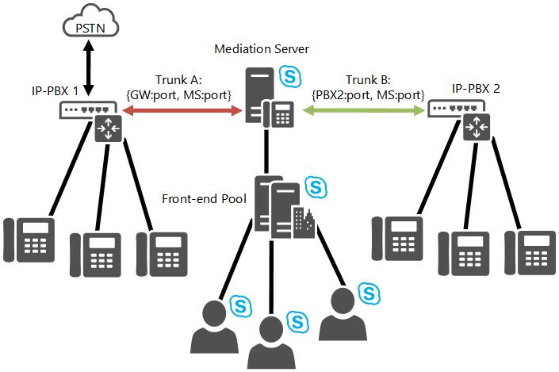

# 비즈니스용 Skype 서버의 트렁크 간 라우팅Inter-trunk routing in Skype for Business Server
 
비즈니스용 Skype 서버 Enterprise Voice 트렁크 간 라우팅을 지원하는 방법을 자세히 알아보습니다.Learn how Skype for Business Server Enterprise Voice supports inter-trunk routing.
  
비즈니스용 Skype 서버는 트렁크 간 라우팅을 통해 기본 세션 관리를 제공합니다.Skype for Business Server provides basic session management through the support of intertrunk routing. 이를 통해 비즈니스용 Skype 서버는 다운스트림 전화 통신 시스템에 통화 제어 기능을 제공할 수 있습니다.This enables Skype for Business Server to provide call control functionalities to downstream telephony systems. 트렁크 간 라우팅은 IP-PBX를 PSTN(공중 전화망) 게이트웨이에 상호 연결할 수 있으므로 PBX(Private Branch eXchange) 전화의 통화를 PSTN으로 라우팅하고 들어오는 PSTN 통화를 PBX 전화로 라우팅할 수 있습니다.Intertrunk routing can interconnect an IP-PBX to a public switched telephone network (PSTN) gateway so that calls from a private branch exchange (PBX) phone can be routed to the PSTN, and incoming PSTN calls can be routed to a PBX phone. 마찬가지로 비즈니스용 Skype 서버는 서로 다른 IP-PBX 시스템에서 PBX 전화 간에 통화를 걸고 수신할 수 있도록 둘 이상의 IP-PBX 시스템을 상호 연결할 수 있습니다.Similarly, Skype for Business Server can interconnect two or more IP-PBX systems so that calls can be placed and received between PBX phones from the different IP-PBX systems. 
  
다음 그림에서는 PSTN 게이트웨이와 IP-PBX 간의 상호 연결 정보를 제공하는 비즈니스용 Skype 서버를 보여 줍니다.The following figure illustrates Skype for Business Server providing interconnectivity between a PSTN gateway and an IP-PBX.
  

  
다음 그림에서는 두 IP-PBX 시스템을 연결하는 비즈니스용 Skype 서버를 보여 제공합니다.The next figure illustrates Skype for Business Server connecting two IP-PBX systems.
  

  

