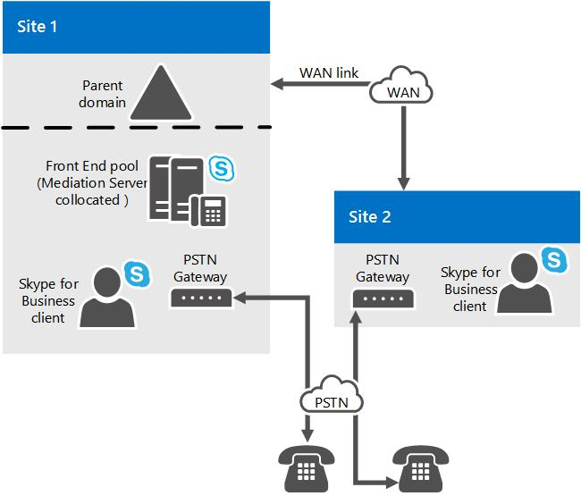

# 비즈니스용 Skype 서버
 
지원되는 토폴로지와 M:N 트렁크, 미디어 우회 및 통화 비즈니스용 Skype 서버 제어와의 관계를 포함하여 서버의 중재 서버에 대해 자세히 알아보습니다.
  
이 Enterprise Voice 배포하려면 하나 이상의 중재 서버를 배포해야 합니다. 
  
중재 서버는 내부 Enterprise Voice 인프라와 PSTN(Public Switched Telephone Network) 게이트웨이 또는 SIP(Session Initiation Protocol) 트렁크 간에 신호를 변환합니다. 일부 배포에서는 미디어 자체도 이러한 지점 간에 변환합니다.
  
중재 비즈니스용 Skype 서버 MTLS(상호 TLS) 전송 주소로 수신합니다. 게이트웨이 쪽에서 중재 서버는 트렁크와 연결된 모든 연결된 수신 포트에서 수신합니다. 해당하는 모든 게이트웨이는 TLS를 지원해야 하지만, TCP도 사용하도록 설정할 수 있습니다. TLS를 지원하지 않는 게이트웨이의 경우 TCP가 지원됩니다.
  
환경에 기존 PBX(공용 분기 Exchange)도 있는 경우 중재 서버는 Enterprise Voice PBX 간의 통화를 처리합니다. PBX가 IP-PBX인 경우 PBX와 중재 서버 간에 직접 SIP 연결을 만들 수 있습니다. PBX가 TDM(Time Division Multiplex) PBX인 경우 중재 서버와 PBX 간에 PSTN 게이트웨이도 배포해야 합니다.
  
중재 서버는 기본적으로 프런트 엔드 서버와 함께 함께 설치됩니다. 중재 서버를 독립 실행형 풀에 배포할 수도 있습니다.
  
## 중재 서버가 하는 일

중재 서버의 주요 기능은 다음과 같습니다.
  
- SRTP를 암호화하고 암호 해독하는 비즈니스용 Skype 서버. 
    
- TCP를 통해 SIP(TLS를 지원하지 않는 게이트웨이용)를 상호 TLS를 통해 SIP로 변환합니다.
    
- 미디어 스트림을 중재 비즈니스용 Skype 서버 게이트웨이 피어 간에 변환합니다.
    
- 네트워크 외부에 있는 클라이언트를 내부 ICE 구성 요소에 연결하여 NAT 및 방화벽의 미디어 트래버스를 가능하게 합니다.
    
- clien.t의 원격 작업자의 통화와 같이 게이트웨이가 지원하지 않는 통화 흐름의 Enterprise Voice 합니다.
    
- SIP 트렁크가 포함된 배포에서는 SIP 트렁크 서비스 공급자와 협력하여 PSTN 지원을 제공하면 PSTN 게이트웨이가 필요하지 않습니다.
    
다음 그림에서는 기본 PSTN 게이트웨이 및 서버 인프라와 통신할 때 중재 서버에서 사용되는 신호 및 미디어 Enterprise Voice 보여줍니다.
  
**중재 서버에서 사용되는 신호 및 미디어 프로토콜**

  
> [!NOTE]
> PSTN 게이트웨이와 중재 서버 간의 네트워크에서 SRTP 또는 SRTCP 대신 TCP 또는 RTP/RTCP를 사용하는 경우 네트워크의 보안 및 개인 정보 보호를 보장하기 위한 조치를 취하는 것이 좋습니다. 
  
## M:N 트렁크

비즈니스용 Skype 서버 라우팅을 위한 트렁크 정의의 유연성을 지원할 수 있습니다. 트렁크는 중재 서버와 수신 포트 번호 간의 논리적 연결로, 게이트웨이와 수신 포트 번호가 있습니다. 즉, 중재 서버에 동일한 게이트웨이에 대한 여러 트렁크가 있을 수 있습니다. 중재 서버에는 서로 다른 게이트웨이에 대한 여러 트렁크가 있을 수 있습니다. 반대로 게이트웨이에는 서로 다른 중재 서버에 대한 여러 트렁크가 있을 수 있습니다.
  
토폴로지 작성기에서 비즈니스용 Skype 게이트웨이를 추가할 때 루트 트렁크를 만들어야 합니다. 특정 중재 서버에서 처리할 수 있는 게이트웨이 수는 최대 사용 시간 동안 서버의 처리 용량에 따라 다를 수 있습니다. [비즈니스용 Skype 서버 비즈니스용 Skype 서버 2015의](../../plan-your-deployment/requirements-for-your-environment/server-requirements.md)서버 요구 사항에 설명된 바와 같이 비즈니스용 Skype 서버 하드웨어에 중재 서버를 배포하는 경우 독립 실행형 중재 서버는 약 1,000개 통화를 처리할 수 있습니다. 중재 서버는 변환을 수행하지만 게이트웨이가 미디어 우회를 지원하지 않는 경우에도 여러 게이트웨이에 대한 통화를 라우팅합니다.
  
통화 경로를 정의할 때 해당 경로와 연결된 트렁크를 지정하지만 해당 경로와 연결된 중재 서버를 지정하지는 않습니다. 대신 토폴로지 작성기에서 트렁크를 중재 서버와 연결합니다. 즉, 라우팅은 통화에 사용할 트렁크를 결정하고 그 이후에 해당 트렁크와 연결된 중재 서버가 해당 통화에 대한 신호를 전송합니다.
  
중재 서버를 풀로 배포할 수 있습니다. 이 풀을 프런트 엔드 풀과 함께 배치하거나 독립 실행형 풀로 배포할 수 있습니다. 중재 서버를 프런트 엔드 풀과 함께 함께 사용할 경우 풀 크기는 최대 12(등록자 풀 크기 제한)일 수 있습니다. 이러한 기능을 통합하면 중재 서버의 안정성과 배포 유연성이 향상되지만 다음과 같은 기능이 필요합니다.
  
- **PSTN 게이트웨이.** 비즈니스용 Skype 서버 게이트웨이는 DNS 부하 분산을 구현해야 합니다. 이렇게 하면 적격한 PSTN(Public Switched Telephone Network) 게이트웨이가 중재 서버의 한 풀에 대한 부하 분산 장치 역할을 하게 되므로 풀 전체에서 통화의 부하를 분산할 수 있습니다.
    
- **세션 경계 컨트롤러.** SIP 트렁크의 경우 피어 엔터티는 인터넷 전화 통신 서비스 공급자의 SBC(Session Border Controller)입니다. 중재 서버 풀에서 SBC로의 방향에서 SBC는 풀의 모든 중재 서버에서 연결을 받을 수 있습니다. SBC에서 풀로 이동하는 방향으로 트래픽을 풀의 중재 서버로 보낼 수 있습니다. 이를 달성하는 한 가지 방법은 서비스 공급자 및 SBC에서 지원하는 경우 DNS 부하 분산을 사용하는 것입니다. 또는 서비스 공급자에게 풀에 있는 모든 중재 서버의 IP 주소를 제공하면 서비스 공급자가 SBC에서 이러한 주소를 각 중재 서버에 대한 별도의 SIP 트렁크로 프로비전합니다. 그러면 서비스 공급자가 자체 서버에 대한 부하 분산을 처리합니다. 일부 서비스 공급자 또는 SC가 이러한 기능을 지원할 수 있는 것은 없습니다. 또한 서비스 공급자는 이 기능에 대해 추가 요금을 부과할 수 있습니다. 일반적으로 SBC에 대한 각 SIP 트렁크는 월별 수수료를 부과합니다.
    
- **IP-PBX.** 중재 서버 풀에서 IP-PBX SIP 종료로의 방향에서 IP-PBX는 풀의 모든 중재 서버에서 연결을 받을 수 있습니다. IP-PBX에서 풀로의 방향으로 트래픽을 풀의 중재 서버로 보낼 수 있습니다. 대부분의 IP-PBXs DNS 부하 분산을 지원하지 않는 경우 IP-PBX에서 풀의 각 중재 서버로의 개별 직접 SIP 연결을 정의하는 것이 좋습니다. 그러면 IP-PBX가 트렁크 그룹에 트래픽을 분산하여 자체 부하 분산을 처리합니다. 트렁크 그룹에는 IP-PBX의 일관된 라우팅 규칙 집합이 있는 것으로 가정합니다. 특정 IP-PBX가 이 트렁크 그룹 개념을 지원하는지 여부와 이를 IP-PBX 자체의 중복 및 클러스터링 아키텍처와 교차하는 방법을 결정해야 중재 서버 클러스터가 IP-PBX와 올바르게 상호 작용할 수 있는지 여부를 결정해야 합니다.
    
중재 서버 풀에는 상호 작용하는 피어 게이트웨이의 균일한 보기가 있어야 합니다. 즉, 풀의 모든 구성원은 구성 저장소에서 동일한 피어 게이트웨이 정의에 액세스하며, 호출 시 동일하게 해당 게이트웨이와 상호 작용할 가능성이 똑같습니다. 따라서 일부 중재 서버가 발신 전화를 위해 특정 게이트웨이 피어와만 통신할 수 있도록 풀을 분할할 수 있는 방법은 없습니다. 이러한 분할이 필요한 경우 별도의 중재 서버 풀을 사용해야 합니다. 예를 들어 이 항목의 앞부분에 설명된 대로 PSTN 게이트웨이, SIP 트렁크 또는 IP-PBXs 연결된 기능이 풀과 상호 작용할 수 없는 경우를 예로 들 수 있습니다.
  
특정 PSTN 게이트웨이, IP-PBX 또는 SIP 트렁크 피어는 여러 중재 서버 또는 트렁크로 라우팅할 수 있습니다. 특정 중재 서버 풀이 제어할 수 있는 게이트웨이 수는 미디어 우회를 사용하는 통화 수에 따라 달라 습니다. 많은 수의 통화가 미디어 우회를 사용하는 경우 신호 계층 처리만 필요하기 때문에 풀의 중재 서버가 더 많은 통화를 처리할 수 있습니다. 
  
## 통화 허용 제어 및 중재 서버

CAC(통화 제어)는 사용 가능한 대역폭을 기반으로 실시간 세션 설정 관리를 관리하여 정체된 네트워크의 사용자에 대한 QoE(체감 품질)를 저해할 수 있도록 합니다. 이를 지원하기 위해 중재 서버는 게이트웨이 쪽과 게이트웨이 쪽에서 비즈니스용 Skype 서버 상호 작용에 대한 대역폭 관리를 담당합니다. 통화 허용 제어에서 통화를 종료하는 엔터티는 대역폭 예약을 처리합니다. 중재 서버가 게이트웨이 쪽에서 상호 작용하는 게이트웨이 피어(PSTN 게이트웨이, IP-PBX, SBC)는 통화 비즈니스용 Skype 서버 제어를 지원하지 않습니다. 따라서 중재 서버는 게이트웨이 피어를 대신하여 대역폭 상호 작용을 처리해야 합니다. 가능하면 중재 서버는 대역폭을 미리 예약합니다. 이렇게 하는 것이 불가능한 경우(예: 게이트웨이 쪽의 궁극적인 미디어 끝점 로컬러티가 게이트웨이 피어에 대한 발신 통화에 알려져 있지 않은 경우) 전화를 걸 때 대역폭이 예약됩니다. 이 동작은 대역폭의 과다 구독을 초래할 수 있지만 잘못된 연결을 방지할 수 있는 유일한 방법입니다.
  
미디어 바이패스와 대역폭 예약은 함께 사용할 수 없습니다. 통화에 미디어 우회가 사용된 경우 해당 통화에 대해 통화 참가 제어가 수행되지 않습니다. 여기서는 통화에 관련된 제한된 대역폭에 대한 링크가 없다고 가정합니다. 통화 제어를 중재 서버와 관련된 특정 통화에 사용하는 경우 해당 통화는 미디어 우회를 사용할 수 없습니다.
  
미디어 우회 또는 통화 비즈니스용 Skype 대한 자세한 내용은 [Plan for media bypass in 비즈니스용 Skype](media-bypass.md) or Plan for call admission control in [비즈니스용 Skype 서버.](call-admission-control.md)
  
## E9-1-1(고급 9-1-1) 및 중재 서버

중재 서버는 E9-1-1(Enhanced 9-1-1) 서비스 공급자와 올바르게 상호 작용할 수 있도록 확장된 기능을 제공합니다. 중재 서버에서는 특별한 구성이 필요하지 않습니다. E9-1-1 상호 작용에 필요한 SIP 확장은 기본적으로 게이트웨이 피어(PSTN 게이트웨이, IP-PBX 또는 E9-1-1 서비스 공급자를 포함하여 인터넷 전화 통신 서비스 공급자의 SBC)와 상호 작용하기 위한 중재 서버의 SIP 프로토콜에 포함되어 있습니다.
  
E9-1-1 서비스 공급자에 대한 SIP 트렁크를 기존 중재 서버 풀에서 종료할 수 있는지 아니면 독립 실행형 중재 서버가 필요한지 여부는 E9-1-1 SBC가 중재 서버 풀과 상호 작용할 수 있는지 여부에 따라 다릅니다. 자세한 내용은 에서 [M:N 트렁크를 비즈니스용 Skype 서버.](m-n-trunk.md)
  
## 미디어 우회 및 중재 서버

미디어 우회는 관리자가 중재 서버를 트래버스하지 않고도 사용자 끝점과 PSTN(Public Switched Telephone Network) 게이트웨이 간에 직접 흐르도록 통화 라우팅을 구성할 수 있도록 하는 비즈니스용 Skype 서버 기능입니다. 미디어 우회는 대기 시간, 불필요한 변환, 패킷 손실 가능성 및 잠재적인 오류 지점 수를 줄여 통화 품질을 향상합니다. 중재 서버가 없는 원격 사이트가 대역폭이 제한된 하나 이상의 WAN 링크를 통해 중앙 사이트에 연결되는 경우 미디어 우회는 먼저 WAN 링크를 통해 중앙 사이트의 중재 서버로 다시 흐르지 않고도 원격 사이트의 클라이언트에서 로컬 게이트웨이로 직접 흐를 수 있도록 하여 대역폭 요구 사항을 낮출 수 있습니다. 이러한 미디어 처리 감소는 중재 서버가 여러 게이트웨이를 제어하는 기능을 보완합니다.
  
미디어 바이패스와 CAC(통화 허용 제어)는 함께 사용할 수 없습니다. 통화에 미디어 바이패스가 사용되는 경우 해당 통화에 대해 CAC가 수행되지 않습니다. 통화에 관련된 제한된 대역폭에 대한 링크가 없다고 가정합니다.
  
## 중재 서버용 토폴로지

중재 비즈니스용 Skype 서버 중재 서버는 기본적으로 Standard Edition 서버, 프런트 엔드 풀 또는 SSS(Survivable Branch Appliance)와 함께 함께 설치됩니다. 프런트 엔드 풀의 모든 중재 서버를 동일하게 구성해야 합니다.
  
성능이 문제가 될 경우 전용 독립 실행형 풀에 하나 이상의 중재 서버를 배포하는 것이 더 바람직할 수 있습니다. SIP 트렁크를 배포하는 경우 독립 실행형 풀을 권장하는 것이 좋습니다. 
  
미디어 바이패스 및 DNS 부하 분산을 지원하는 적격한 PSTN 게이트웨이에 직접 SIP 연결을 배포한 경우 독립 실행형 중재 서버 풀이 필요하지 않습니다. 이는 적격 게이트웨이가 중재 서버 풀로 DNS 부하 분산을 할 수 있으며 풀의 모든 중재 서버에서 트래픽을 수신할 수 있기 때문에입니다.
  
또한 다음 조건이 충족되는 한 IP-PBXs 배포하거나 인터넷 전화 통신 서버 공급자의 SBC(Session Border Controller)에 연결할 때도 중재 서버를 프런트 엔드 풀에 배치하는 것이 좋습니다.
  
- IP-PBX 또는 SBC가 풀의 중재 서버에서 트래픽을 수신하도록 구성되었고 풀의 모든 중재 서버에 트래픽을 단일 방식으로 라우팅할 수 있습니다.
    
- IP-PBX는 미디어 우회를 지원하지 않지만 중재 서버를 호스팅하는 프런트 엔드 풀은 미디어 우회가 적용되지 않는 통화에 대한 음성 변환을 처리할 수 있습니다.
    
Microsoft Lync Server 2013 계획 도구를 사용하여 중재 서버를 함께 배포하려는 프런트 엔드 풀이 부하를 처리할 수 있는지 여부를 평가할 수 있습니다. 사용자 환경에서 이러한 요구 사항을 충족할 수 없는 경우 독립 실행형 중재 서버 풀을 배포해야 합니다.
  
다음 그림에서는 WAN 링크로 연결된 두 사이트로 구성된 단순한 토폴로지를 보여 줍니다. 중재 서버가 사이트 1의 프런트 엔드 풀에 함께 있습니다. 사이트 1의 중재 서버는 사이트 1의 PSTN 게이트웨이와 사이트 2의 게이트웨이를 모두 제어합니다. 이 토폴로지에서는 사이트 및 지역 정보를 사용하도록 미디어 바이패스가 전역적으로 설정되어 있으며 각 PSTN 게이트웨이의 트렁크(GW1 및 GW2)에 바이패스가 사용되도록 설정되었습니다.
  
**사이트 1의 중재 서버 및 사이트 2의 PSTN 게이트웨이를 사용하여 WAN 링크로 연결된 사이트의 예**

  
다음 그림에서는 중재 서버가 사이트 1의 프런트 엔드 풀에 함께 함께 있으며 사이트 1의 IP-PBX에 직접 SIP 연결이 있는 간단한 토폴로지가 보여줍니다. 이 그림에서 중재 서버는 사이트 2의 PSTN 게이트웨이도 제어합니다. 사이트 비즈니스용 Skype 1과 2에 모두 있는 것으로 가정합니다. 또한 IP-PBX에 IP-PBX가 제어하는 미디어 끝점으로 전송되기 전에 비즈니스용 Skype 끝점에서 시작된 모든 미디어에서 트래버스해야 하는 연결된 미디어 프로세서가 있는 것으로 가정합니다. 이 토폴로지에는 사이트 및 지역 정보를 사용하도록 미디어 바이패스가 전역적으로 설정되어 있으며 PBX 및 PSTN 게이트웨이의 트렁크에 바이패스가 사용되도록 설정되어 있습니다.
  
**사이트 1의 중재 서버 및 사이트 2의 PBX를 사용하여 WAN 링크로 연결된 사이트의 예**

  
이 항목의 마지막 그림은 중재 서버가 인터넷 전화 통신 서비스 공급자의 SBC에 연결된 토폴로지입니다. 
  
## 중재 서버에 대한 계획 결정

이 항목에서는 중재 서버 배포에 필요한 계획 결정에 대해 설명합니다.
  
### 함께 사용되거나 독립 실행형 중재 서버인가요?

중재 서버는 기본적으로 중앙 사이트 프런트 엔드 풀의 Standard Edition Server 또는 프런트 엔드 서버에 배치됩니다. 처리할 수 있는 PSTN(Public Switched Telephone Network) 통화 수와 풀에 필요한 컴퓨터 수는 다음에 따라 달라 하게 됩니다.
  
- 중재 서버 풀이 제어하는 게이트웨이 피어 수
    
- 이러한 게이트웨이를 통한 대량 트래픽 기간
    
- 미디어가 중재 서버를 우회하는 통화의 백분율
    
계획할 때 미디어 우회에 대해 구성되지 않은 PSTN 통화 및 A/V 회의에 대한 미디어 처리 요구 사항과 지원해야 하는 통화 시간 수에 대한 신호 상호 작용을 처리하는 데 필요한 처리를 고려해야 합니다. CPU가 충분하지 않은 경우 중재 서버의 독립 실행형 풀을 배포해야 합니다. 및 PSTN 게이트웨이, IP-PBX 및 SBC는 하나의 풀에 함께 있는 중재 서버에 의해 제어되는 하위 집합과 하나 이상의 독립 실행형 풀에 있는 독립 실행형 중재 서버로 분할해야 합니다.
  
다음을 포함하여 중재 서버 풀과 상호 작용하기 위한 올바른 기능을 지원하지 않는 PSTN 게이트웨이, IP-PBX 또는 SBC(Session Border Controller)를 배포한 경우 단일 중재 서버로 구성된 독립 실행형 풀과 연결해야 합니다.
  
- 풀의 중재 서버에서 네트워크 계층 DNS(Domain Name System) 부하 분산 수행(또는 풀의 모든 중재 서버로 트래픽을 균일하게 라우팅)
    
- 풀에 있는 중재 서버의 트래픽 허용
    
Microsoft Lync Server 2013 계획 도구를 사용하여 중재 서버를 프런트 엔드 풀과 함께 함께 배포하여 부하를 처리할 수 있는지 여부를 평가할 수 있습니다. 사용자 환경에서 이러한 요구 사항을 충족할 수 없는 경우 독립 실행형 중재 서버 풀을 배포해야 합니다.
  
### 중앙 사이트 및 분기 사이트 고려 사항

 중앙 사이트의 중재 서버는 분기 사이트의 IP-PBX 또는 PSTN 게이트웨이에 대한 통화를 라우팅하는 데 사용될 수 있습니다. 그러나 SIP 트렁크를 배포한 경우에는 각 트렁크가 종료되는 사이트에 중재 서버를 배포해야 합니다. 분기 사이트의 IP-PBX 또는 PSTN 게이트웨이에 대한 통화를 라우팅하는 중재 서버를 중앙 사이트에 배포한 경우에는 미디어 바이패스를 사용할 필요가 없습니다. 그러나 미디어 우회를 사용하도록 설정할 수 있는 경우 미디어 경로가 더 이상 신호 경로를 따를 필요는 아니기 때문에 미디어 경로 대기 시간이 줄어들고 미디어 품질이 향상됩니다. 미디어 우회도 풀의 처리 부하를 줄입니다.
  
> [!NOTE]
> 미디어 바이패스가 모든 PSTN 게이트웨이, IP-PBX 및 SBC에서 작동하지는 않습니다. Microsoft는 인증된 파트너와 함께 PSTN 게이트웨이 및 SBC 집합을 테스트하고 Cisco IP-PBX에 대한 몇 가지 테스트를 수행했습니다. 미디어 우회는 [Unified Communications Open Interoperability Program - Lync Server에](../../../SfbPartnerCertification/lync-cert/qualified-ip-pbx-gateway.md)나열된 제품 및 버전에서만 지원됩니다. 
  
분기 사이트 복구가 필요한 경우에는 SBA(Survivable Branch Appliance) 또는 프런트 엔드 서버, 중재 서버 및 게이트웨이의 조합을 분기 사이트에 배포해야 합니다. 분기 사이트 탄력성의 경우 현재 상태 및 회의가 사이트에서 탄력적이지 않다고 가정합니다. 음성에 대한 분기 사이트 계획에 대한 지침은 [Plan for Enterprise Voice resiliency in 비즈니스용 Skype 서버.](enterprise-voice-resiliency.md)
  
IP-PBX와의 상호 작용의 경우 IP-PBX가 여러 초기 대화 및 RFC 3960 조작과의 초기 미디어 상호 작용을 올바르게 지원하지 않는 경우 IP-PBX에서 끝점으로의 수신 전화에 대해 처음 몇 단어의 인사말을 클리핑할 비즈니스용 Skype 있습니다. 신호가 완료되는 데 더 많은 시간이 필요하기 때문에 중앙 사이트의 중재 서버가 분기 사이트에서 경로가 종료되는 IP-PBX에 대한 통화를 라우팅하는 경우 이 문제는 더 심각할 수 있습니다. 이 동작이 경험하는 경우 분기 사이트에 중재 서버를 배포하는 것만이 처음 몇 단어의 클리핑을 줄이는 유일한 방법입니다.
  
끝으로, 중앙 사이트에 TDM PBX가 있거나, IP-PBX가 PSTN 게이트웨이의 필요성을 해소하지 못한 경우 통화 경로에 중재 서버와 PBX를 연결하는 게이트웨이를 배포해야 합니다.
  
> [!NOTE]
> 독립 실행형 중재 서버의 미디어 성능을 향상하려면 이러한 서버의 네트워크 어댑터에서 RSS(수신 쪽 크기 조정)를 사용하도록 설정해야 합니다. RSS를 사용하면 들어오는 패킷을 서버의 여러 프로세서에서 병렬로 처리할 수 있습니다. 자세한 내용은 ["Windows Server의 수신측 확장 기능"을 참조합니다.](/previous-versions/windows/it-pro/windows-server-2012-R2-and-2012/hh997036(v=ws.11)) RSS를 사용하도록 설정하는 방법에 대한 자세한 내용은 네트워크 어댑터 설명서를 참조하십시오. 
