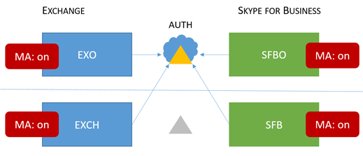

# 최신 인증과 함께 지원 되는 비즈니스용 Skype 토폴로지

이 문서에서는 비즈니스용 Skype의 최신 인증과 함께 지원 되는 온라인 및 온-프레미스 토폴로지와 각 토폴로지에 적용 되는 보안 기능에 대해 설명 합니다.

## 비즈니스용 Skype의 최신 인증

비즈니스용 Skype를 통해 최신 인증의 보안 이점을 활용할 수 있습니다. 비즈니스용 Skype는 Exchange와 긴밀 하 게 작동 하기 때문에 비즈니스용 Skype 클라이언트 사용자의 로그인 동작에 따라 Exchange의 MA 상태에도 영향을 받게 됩니다. 비즈니스용 Skype 분할이 있는 경우에도 적용 됩니다. 이동 하는 작업은 많지만 여기에서 소개 하는 목적은 지원 되는 토폴로지 목록을 시각화 하는 쉬운 방법입니다.

지정 된 비즈니스용 Skype, 비즈니스용 Skype online, Exchange Server 및 Exchange online의 경우 MA에서 지원 되는 토폴로지는 무엇입니까?

<!--  > [!TIP] > Not sure what Modern Authentication even is? No worries.  This Skype for Business article  4e6a99cd-7859-4062-8a30-5ac79ba36b52  explains it in the first paragraphs. -->

### 비즈니스용 Skype에서 지원 되는 MA 토폴로지

MA가 사용 하는 비즈니스용 Skype 토폴로지와 관련 된 두 대의 서버 응용 프로그램 및 Microsoft 365 또는 Office 365 작업에는 두 가지가 있습니다.

- 온-프레미스 비즈니스용 Skype 서버 (CU 5)

- 비즈니스용 Skype online (SFBO)

- Exchange server 온-프레미스

- Exchange server online (EXO)

MA의 또 다른 중요 한 부분은 사용자의 인증 (인증) 및 인증 (권한 부여)이 발생 하는 위치를 파악 하는 것입니다. 두 가지 옵션은 다음과 같습니다.

- Azure AD, Microsoft 클라우드의 온라인

- ADFS (Active Directory Federation Server) 온-프레미스

이를 위해 Azure AD를 사용 하는 클라우드 및 SFBO (Exchange Server) 및 SFB (비즈니스용 Skype 서버)의 온-프레미스에 EXO와 and를 함께 사용 하는 것과 같은 약간의 기능이 있습니다.

지원 되는 토폴로지는 다음과 같습니다. 그래픽의 키를 확인 하세요.

- 흐리게 또는 회색으로 표시 된 아이콘은 시나리오에서 사용 되지 않습니다.

- EXO는 Exchange Online입니다.

- SFBO는 비즈니스용 Skype 온라인입니다.

- EXCH는 Exchange 온-프레미스입니다.

- SFB는 온-프레미스 비즈니스용 Skype입니다.

- 예를 들어 서버에 대 한 권한 부여가 삼각형으로 표시 됨은 Azure AD는 그 뒤에 클라우드가 있는 삼각형입니다.

- 클라이언트가 지정 된 서버 리소스에 연결 하려고 할 때 사용 되는 권한 부여 서버를 가리킵니다.

먼저, 온-프레미스 전용 또는 클라우드 전용 토폴로지 둘 다에 비즈니스용 Skype를 사용 하도록 하겠습니다.

> [!IMPORTANT]
> 비즈니스용 Skype Online에서 최신 인증을 설정할 준비가 되셨습니까? 이 기능을 사용 하도록 설정 하는 단계는 [여기](https://social.technet.microsoft.com/wiki/contents/articles/34339.skype-for-business-online-enable-your-tenant-for-modern-authentication.aspx)에서 즉시 수행 됩니다.

|토폴로지 이름    |예제    |설명    |지원    |
|:-----|:-----|:-----|:-----|
|클라우드만    |사용자 홈/사서함 위치: 온라인    |MA는 EXO 및 SFBO 둘 다에 대해 on입니다.    따라서 인증 서버는 Azure AD입니다.    |MFA (다단계 인증), 클라이언트-인증서 기반 인증 (CBA), CA (조건부 액세스)/i p b (모바일 응용 프로그램 관리) (Intune 포함) \*    |
|온-프레미스만    |사용자 홈/사서함 위치: 온-프레미스    |SFB 온-프레미스에 대해 MA가 켜져 있습니다.    따라서 인증 서버는 ADFS입니다.    구성에 대 한 자세한 내용은 [이 문서](https://technet.microsoft.com/library/mt710548.aspx) 를 참조 하십시오.   |MFA (Windows 데스크톱 전용-모바일 클라이언트는 지원 되지 않음) Exchange 통합 기능이 없습니다.   
 **이 방법은 사용 하지 않는 것이 좋습니다. 다음 항목을 참조 하세요.**[https://aka.ms/ModernAuthOverview](https://aka.ms/ModernAuthOverview)
 |

> [!IMPORTANT]
> 메시지 수를 줄이기 위해 비즈니스용 Skype 및 Exchange (및 온라인 대응)에서 MA 상태를 동일 하 게 하는 것이 좋습니다.

혼합 토폴로지에는 SFB 분할 도메인 하이브리드 조합이 포함 됩니다. 현재 지원 되는 혼합 토폴로지는 다음과 같습니다.

|토폴로지 이름    |예제    |설명    |지원    |
|:-----|:-----|:-----|:-----|
|혼합 1    |             사용자 홈/사서함 위치: EXO 및 SFB    |MA는 SFB에 대해 사용 하도록 설정 되지 않습니다. 이 토폴로지에서는 SFB MA 기능을 사용할 수 없습니다.    |SFB에 대 한 MA 기능이 없습니다.    |
|혼합 2    |             사용자 홈/사서함 위치: EXCH and SFBO    |MA는 SFBO 전용입니다. 인증 서버는 SFBO에 있는 사용자의 Azure AD 이며 EXCH 온-프레미스에 대 한 AD입니다.    |Intune을 사용 하는 MFA, CBA, CA/MAM\*    |
|혼합 3    |             사용자 홈/사서함 위치: EXO + SFB 또는 EXO + SFB    |이 토폴로지에서 SFB MA 기능을 사용할 수 없음    |SFB에 대 한 MA 기능이 없습니다.    |
|혼합 4    |             사용자 홈/사서함 위치: EXCH + SFBO 또는 EXCH + SFB    |SFBO에 대해 MA가 설정 되어 있으므로 인증 서버는 SFBO에 속한 사용자의 Azure AD입니다. SFB의 프레미스 사용자 및 EXO AD 사용    |온라인 사용자만 Intune을 사용 하는 MFA, CBA, CA/MAM\*    |
|혼합 5    |             사용자 홈/사서함 위치: EXO + SFBO, EXO + SFB, EXO + SFBO 또는 EXO + SFB    |MA가 EXO 및 SFBO 둘 다에 설정 되어 있으므로 인증 서버는 SFBO에 있는 사용자의 Azure AD입니다. EXCH 및 SFB에서 AD를 사용 하는 프레미스 사용자    |온라인 사용자만 Intune을 사용 하는 MFA, CBA, CA/MAM\*    |
|혼합 6    |             사용자 홈/사서함 위치: EXO + SFBO, EXO + SFB, EXO + SFBO 또는 EXO + SFB    |MA는 모든 위치에서 설정 되므로 인증 서버는 모든 사용자에 대해 Azure AD입니다. (온라인 및 온-프레미스)     [https://aka.ms/ModernAuthOverview](https://aka.ms/ModernAuthOverview)배포 단계는를 참조 하세요.   |모든 사용자에 대 한 MFA, CBA 및 CA/MAM (Intune을 통해)    |

\*-MFA에는 Windows 데스크톱, MAC, iOS, Android 장치 및 Windows phone이 포함 되어 있습니다. CBA에는 Windows 데스크톱, iOS 및 Android 장치가 포함 되어 있습니다. Intune을 사용 하는 CA/MAM에는 Android 및 iOS 장치가 포함 됩니다.

> [!IMPORTANT]
> 모든 버전의 혼합 토폴로지의 경우와 마찬가지로, 일부 경우에는 사용자에 게 **여러 프롬프트가** 표시 될 수 있는데, 이러한 경우에는 클라이언트가 필요로 하 고 요청 하는 모든 서버 리소스에서 MA 상태가 동일 하지는 않습니다.

> [!IMPORTANT]
> 또한 경우에 따라 Windows 데스크톱 클라이언트에 대 한 적절 한 구성을 위해 [AllowADALForNonLyncIndependentOfLync](https://support.microsoft.com/help/3082803/info-about-the-allowadalfornonlyncindependentoflync-setting-in-skype-for-business,-lync-2013,-and-exchange-online) 레지스트리 키를 설정 해야 하는 경우도 있습니다 (1, 3, 5).

