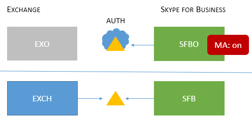

# 최신 인증으로 지원되는 비즈니스용 Skype 토폴로지

이 문서에서는 최신 인증을 통해 지원되는 온라인 및 비즈니스용 Skype 토폴로지와 각 토폴로지에 적용되는 보안 기능을 나열합니다.

## 최신 인증 비즈니스용 Skype

비즈니스용 Skype 최신 인증의 보안 이점을 활용할 수 있습니다. 비즈니스용 Skype 사용자와 밀접하게 Exchange 때문에 클라이언트 비즈니스용 Skype 로그인 동작도 클라이언트 사용자의 MA 상태의 영향을 Exchange. 분할 도메인 하이브리드가 있는 비즈니스용 Skype 적용됩니다. 이동 부분이 많지만 여기서는 지원되는 토폴로지 목록을 쉽게 시각화할 수 있습니다.

온라인 비즈니스용 Skype, 비즈니스용 Skype, Exchange Server 및 Exchange MA에서 지원되는 토폴로지는 무엇입니까?

<!--  > [!TIP] > Not sure what Modern Authentication even is? No worries.  This Skype for Business article  4e6a99cd-7859-4062-8a30-5ac79ba36b52  explains it in the first paragraphs. -->

### 지원되는 MA 토폴로지 비즈니스용 Skype

MA에서 사용하는 비즈니스용 Skype 토폴로지와 관련된 Microsoft 365 또는 Office 365 두 개의 서버 응용 프로그램이 있습니다.

- 비즈니스용 Skype 서버(CU 5) 사내

- 비즈니스용 Skype 온라인(SFBO)

- Exchange 서버

- Exchange 서버 온라인(EXO)

MA의 또 다른 중요한 부분은 사용자의 인증(authN) 및 권한 부여(authZ)가 어디서 이루어질지 아는 것입니다. 두 가지 옵션은 다음과 같습니다.

- Microsoft 클라우드에서 온라인으로 Azure AD

- ADFS(Active Directory Federation Server) 사내

따라서 Azure AD가 있는 클라우드의 EXO 및 SFBO와 EXCH(exCH) Exchange Server SFB(비즈니스용 Skype 서버)를 사용하여 약간 다음과 같이 됩니다.

다음은 지원되는 토폴로지입니다. 그래픽에 대한 키를 유의합니다.

- 아이콘이 희미해지거나 회색이면 시나리오에서 사용되지 않습니다.

- EXO가 Exchange Online.

- SFBO는 비즈니스용 Skype 있습니다.

- EXCH는 Exchange 지원됩니다.

- SFB는 비즈니스용 Skype 있습니다.

- 승인 서버는 삼각형으로 표현됩니다. 예를 들어 Azure AD는 클라우드가 뒤에 있는 삼각형입니다.

- 화살표는 클라이언트가 지정된 서버 리소스에 도달하려고 할 때 사용할 승인 서버의 지점입니다.

먼저, MA에 대해 비즈니스용 Skype 또는 클라우드 전용 토폴로지에서 모두 지원해보아야 합니다.

> [!IMPORTANT]
> 온라인에서 최신 인증을 설정할 비즈니스용 Skype 있나요? 이 기능을 사용하도록 설정하는 단계는 다음과 [같습니다](https://social.technet.microsoft.com/wiki/contents/articles/34339.skype-for-business-online-enable-your-tenant-for-modern-authentication.aspx).

|토폴로지 이름    |예제    |설명    |지원    |
|:-----|:-----|:-----|:-----|
|클라우드만    |사용자가 위치한 사용자: Online    |MA는 EXO 및 SFBO 둘 다에 대해 사용 중입니다.    따라서 권한 부여 서버는 Azure AD입니다.    |Intune을 사용하는 MFA(다단계 인증), CBA(클라이언트 인증서 기반 인증), CA(조건부 액세스)/MAM(모바일 응용 프로그램 관리)입니다. \*    |
|On-prem only(프레미스 전용)    |사용자가 위치한 사용자: On-premises    |MA는 SFB에 대해 On-premises입니다.    따라서 권한 부여 서버는 ADFS입니다.    구성 세부 정보는 이 문서를 [참조하세요.](/microsoft-365/enterprise/hybrid-modern-auth-overview)   |MFA(Windows 데스크톱 전용 - 모바일 클라이언트는 지원되지 않습니다. 통합 Exchange 없습니다.   
 **이 방법은 권장되지 않습니다. 여기를 참조하세요.** [https://aka.ms/ModernAuthOverview](/microsoft-365/enterprise/hybrid-modern-auth-overview)
 |

> [!IMPORTANT]
> 프롬프트 수를 줄이기 위해 MA 상태는 비즈니스용 Skype Exchange(및 온라인 대응)에서 동일하게 하는 것이 좋습니다.

혼합 토폴로지에는 SFB 분할 도메인 하이브리드의 조합이 수반됩니다. 다음은 현재 지원되는 혼합 토폴로지입니다.

|토폴로지 이름    |예제    |설명    |지원됨    |
|:-----|:-----|:-----|:-----|
|혼합 1    |             있는 사용자: EXO 및 SFB    |MA는 SFB에 대해 사용하도록 설정되지 않습니다. 이 토폴로지에서 사용할 수 있는 SFB MA 기능이 없습니다.    |SFB에 대한 MA 기능이 없습니다.    |
|혼합 2    |             위치한 사용자: EXCH 및 SFBO    |MA는 SFBO 전용입니다. 인증 서버는 SFBO에 있는 사용자를 위한 Azure AD이지만 EXCH의 경우 AD는 사내에 있습니다.    |MFA, CBA, CA/MAM with Intune.\*    |
|혼합 3    |             있는 사용자: EXO + SFB 또는 EXCH + SFB    |이 토폴로지에서 사용할 수 있는 SFB MA 기능 없음    |SFB에 대한 MA 기능이 없습니다.    |
|혼합 4    |             있는 사용자: EXCH +SFBO 또는 EXCH + SFB    |MA가 SFBO에 대해 설정됩니다. 따라서 인증 서버는 SFBO에 있는 사용자의 Azure AD입니다. SFB 및 EXO의 프레미스 사용자가 AD를 사용 합니다.    |온라인 사용자에 한해 MFA, CBA, CA/MAM(Intune 사용)\*    |
|혼합 5    |             있는 사용자: EXO + SFBO, EXO + SFB, EXCH + SFBO 또는 EXCH + SFB    |MA는 EXO와 SFBO 둘 다에 있으므로 인증 서버는 SFBO에 있는 사용자의 Azure AD입니다. EXCH 및 SFB의 프레미스 사용자가 AD를 사용 합니다.    |온라인 사용자에 한해 MFA, CBA, CA/MAM(Intune 사용)\*    |
|혼합 6    |             있는 사용자: EXO + SFBO, EXO + SFB, EXCH + SFBO 또는 EXCH + SFB    |MA는 모든 곳에서 사용하므로 권한 부여 서버는 모든 사용자에 대한 Azure AD입니다. (온라인 및 사내)     배포 단계를 [https://aka.ms/ModernAuthOverview](/microsoft-365/enterprise/hybrid-modern-auth-overview) 참조하세요.   |모든 사용자에 대한 MFA, CBA 및 CA/MAM(Intune을 통해)입니다.    |

\*- MFA에는 데스크톱, Windows, iOS, Android 장치 및 휴대폰이 Windows 포함됩니다. CBA에는 데스크톱, Windows 및 Android 장치가 포함됩니다. Intune을 포함하는 CA/MAM에는 Android 및 iOS 장치가 포함되어 있습니다.

> [!IMPORTANT]
> 혼합 토폴로지의 모든 버전에서와 동일  하게 클라이언트가 필요로 하여 요청할 수 있는 모든 서버 리소스에서 MA 상태가 같지 않은 경우 사용자에게 여러 프롬프트가 표시될 수 있습니다.

> [!IMPORTANT]
> 또한 일부 경우(특히 혼합 1, 3 및 5) [AllowADALForNonLyncIndependentOfLync](https://support.microsoft.com/help/3082803/info-about-the-allowadalfornonlyncindependentoflync-setting-in-skype-for-business,-lync-2013,-and-exchange-online) 레지스트리 키가 데스크톱 클라이언트에 적합한 구성을 위해 Windows 합니다.