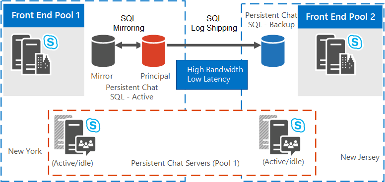

# 2015년 8월 영구 채팅 서버의 고가용성 및 재해 비즈니스용 Skype 서버 계획
 
**요약:** 이 항목을 통해 2015년 8월 영구 채팅 서버의 고가용성 및 재해 복구를 계획하는 비즈니스용 Skype 서버 있습니다.
  
영구 채팅 서버의 고가용성 및 재해 복구에는 일반적으로 전체 작업에 필요한 리소스 이외에 추가 리소스가 필요합니다. 
  
> [!NOTE]
> AlwaysOn SQL 그룹 사용은 영구 채팅 서버 데이터베이스에서 지원되지 않습니다. 

> [!NOTE] 
> 영구 채팅은 비즈니스용 Skype 서버 2015에서 사용할 수 있지만 2019년 8월에는 더 이상 비즈니스용 Skype 서버 없습니다. 동일한 기능을 사용할 수 Teams. 자세한 내용은 업그레이드 시작을 [Microsoft Teams 참조하세요.](/microsoftteams/upgrade-start-here) 영구 채팅을 사용해야 하는 경우 이 기능이 필요한 사용자를 Teams 또는 비즈니스용 Skype 서버 2015를 계속 사용할 수 있습니다. 
  
## 리소스 요구 사항

고가용성 및 재해 복구를 위해 영구 채팅 서버를 구성하기 전에 다음과 같은 추가 리소스를 확보해야 합니다. 
  
- 영구 채팅 서버 서비스의 홈 프런트 엔드가 있는 동일한 실제 데이터 센터에 있는 전용 데이터베이스 인스턴스 1개 이 데이터베이스는 기본 영구 채팅 SQL Server 미러로 사용됩니다. 원하는 경우 미러 데이터베이스에 대한 SQL Server 장애 조치(failover)를 원하는 경우 미러링 서버로 사용할 추가 데이터베이스를 지정합니다.
    
- 다른 실제 데이터 센터에 있는 전용 데이터베이스 인스턴스 하나. 이 데이터베이스는 기본 데이터 SQL Server 데이터베이스의 로그 전달 보조 데이터베이스로 사용됩니다.
    
- 보조 데이터베이스의 기본 미러로 사용할 전용 SQL Server 인스턴스입니다. 선택적으로 서버에 대한 추가 SQL Server 미러링된 미러링 서버로 지정합니다. 이 두 가지 모두 보조 데이터베이스와 동일한 실제 데이터 센터에 있어야 합니다.
    
- 영구 채팅 서버 준수를 사용하도록 설정한 경우 추가 3개의 전용 데이터베이스 인스턴스가 필요합니다. 이러한 배포는 영구 채팅 데이터베이스에 대해 이전에 설명한 배포와 동일합니다. 준수 데이터베이스가 영구 채팅 데이터베이스와 동일한 SQL Server 인스턴스를 공유할 수 있는 반면, 고가용성 및 재해 복구를 위한 독립 실행형 인스턴스를 권장합니다.
    
- 로그 전달 트랜잭션 로그에 대해 파일 공유를 SQL Server 지정해야 합니다. 영구 채팅 SQL 실행되는 두 데이터 센터의 모든 서버는 이 파일 공유에 대한 읽기/쓰기 권한이 있어야 합니다. 이 공유는 FileStore 역할의 일부로 정의되지 않습니다.
    
- 기본 서버 파일 공유에서 복사되는 SQL Server 로그의 대상 폴더로 사용할 보조 데이터베이스 서버의 파일 공유입니다.
    
## 재해 복구 및 고가용성 솔루션

비즈니스용 Skype 서버 미러링을 포함하여 백 엔드 서버에 대해 여러 가지 고가용성 모드를 지원할 수 있습니다. 자세한 내용은 [Plan for high availability and disaster recovery in 비즈니스용 Skype 서버 2015을 참조하십시오.](../../plan-your-deployment/high-availability-and-disaster-recovery/high-availability-and-disaster-recovery.md) 
  
이 항목에 설명된 영구 채팅 서버용 재해 복구 솔루션은 확장된 영구 채팅 서버 풀을 토대하여 구축됩니다. 확장된 VLAN(가상 로컬 영역 네트워크)에 대한 요구 사항은 없습니다. 영구 채팅 서버 풀을 확장하면 토폴로지에서 하나의 풀을 논리적으로 구성하지만 실제로는 두 개의 서로 다른 데이터 센터에 풀에 서버를 두게 됩니다. 동일한 SQL Server 데이터베이스 미러링을 구성하고 데이터베이스와 미러를 동일한 데이터 센터에 배포합니다. 보조 데이터 센터에는 백업 데이터베이스를 구성해야 합니다(재해 복구 중 고가용성을 제공하기 위한 선택적인 미러 포함). 이러한 백업 데이터베이스는 재해 복구 중 장애 조치(Failover)를 위해 사용됩니다. 
  
영구 채팅 서버에 대해 고가용성 및 재해 복구를 구성하는 방법에 대한 자세한 내용은 [Configure high availability and disaster recovery for Persistent Chat Server in 비즈니스용 Skype 서버 2015을 참조하세요.](../../deploy/deploy-persistent-chat-server/configure-hadr-for-persistent-chat.md) 
  
다음 그림에서는 서로 다른 두 개의 확장된 풀 토폴로지에서 영구 채팅 서버 풀을 구성할 수 있는 방법을 보여 주며,
  
- 데이터 센터가 높은 대역폭/짧은 대기 시간을 사용하여 지리적으로 분산된 경우의 확장 영구 채팅 서버 풀
    
- 데이터 센터가 낮은 대역폭/긴 대기 시간을 사용하여 지리적으로 분산된 경우의 확장 영구 채팅 서버 풀
    
그림 1은 데이터 센터가 높은 대역폭/짧은 대기 시간을 사용하여 지리적으로 위치하는 확장된 영구 채팅 서버 풀 토폴로지입니다. 논리적 및 물리적 토폴로지의 경우 다음을 가정합니다.
  
- 논리적 토폴로지는 다음으로 구성됩니다.
    
  - 1에서 8까지의 서버를 포함하는 사이트 1과 2의 영구 채팅 풀
    
  - 프런트 엔드 서버 풀, 영구 채팅 데이터베이스, 미러된 데이터베이스 및 사이트 1에 물리적으로 있는 미러 데이터베이스(다이어그램에 나와 있지 않은 경우)를 선택적으로 사용합니다. 
    
  - 사이트 2에 물리적으로 있는 두 번째 프런트 엔드 서버 풀 및 백업 데이터베이스
    
- 실제 토폴로지는 다음과 같이 사이트 1과 2로 구성됩니다.
    
  - 사이트 1에서 4까지, 활성 서버 2개, 사이트 1의 유휴 서버 2개가 포함된 영구 채팅 풀
    
  - 사이트 2에서 5~8, 활성 2개, 유휴 서버 2개가 포함된 영구 채팅 풀
    
  - 사이트 1의 프런트 엔드 서버 풀, 영구 채팅 데이터베이스, 미러된 데이터베이스 및 미러링된 데이터베이스(다이어그램에 나와 있지 않은 경우) 미러 데이터베이스(선택 사항)입니다.
    
  - 사이트 2의 프런트 엔드 서버 풀 및 SQL 전달 대상인 백업 데이터베이스
    
**데이터 센터가 높은 대역폭/짧은 대기 시간을 사용하여 지리적으로 위치한 경우 확장된 영구 채팅 서버 풀**

  
그림 2에서는 데이터 센터가 낮은 대역폭/높은 대기 시간으로 지리적으로 위치하는 확장된 영구 채팅 서버 풀 토폴로지가 표시되고 있습니다.
  
- 논리적 토폴로지는 다음으로 구성됩니다.
    
  - 1에서 8까지의 서버를 포함하는 사이트 1과 2의 영구 채팅 풀
    
  - 프런트 엔드 서버 풀, 영구 채팅 데이터베이스, 미러된 데이터베이스 및 사이트 1에 물리적으로 있는 미러 데이터베이스(다이어그램에 나와 있지 않은 경우)를 선택적으로 사용합니다. 
    
  - 사이트 2에 물리적으로 있는 두 번째 프런트 엔드 서버 풀 및 백업 데이터베이스
    
- 실제 토폴로지는 다음과 같이 사이트 1과 2로 구성됩니다.
    
  - 사이트 1에서 4까지의 서버가 모두 활성 상태인 영구 채팅 풀
    
  - 사이트 2에서 5~8까지의 모든 유휴 서버를 포함하는 영구 채팅 풀
    
  - 사이트 1의 프런트 엔드 서버 풀, 영구 채팅 데이터베이스, 미러된 데이터베이스 및 미러링된 데이터베이스(다이어그램에 나와 있지 않은 경우) 미러 데이터베이스(선택 사항)입니다.
    
  - 사이트 2의 프런트 엔드 서버 풀 및 SQL 전달 대상인 백업 데이터베이스
    
**데이터 센터가 낮은 대역폭/높은 대기 시간으로 지리적으로 위치한 경우 확장된 영구 채팅 서버 풀**

  

