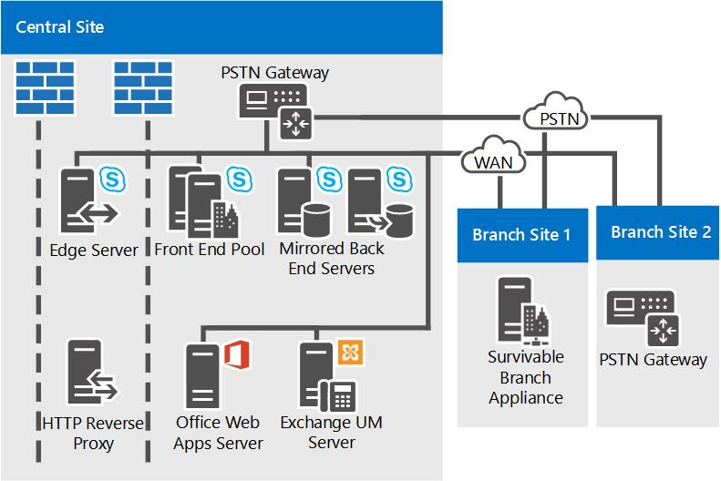

# 비즈니스용 Skype 서버에 대한 참조 토폴로지Reference topologies for Skype for Business Server

대규모, 중간 규모 및 소규모 조직을 위한 다이어그램 및 의사 결정 등 비즈니스용 Skype 서버에 대한 참조 토폴로지Reference topologies for Skype for Business Server, including diagrams and decisions to make for large, medium, and small organizations.

가장 적합한 비즈니스용 Skype 서버 토폴로지는 조직의 규모, 배포하려는 작업량 및 고가용성에 대한 기본 설정과 투자 비용에 따라 달라집니다.The best Skype for Business Server topology for you depends on your organization's size, the workloads you want to deploy, and your preferences for high availability versus cost of investment.

이 섹션에서는 각 토폴로지의 여러 결정에 대한 이유를 포함하여 세 가지 예제 참조 토폴로지에 대해 간략하게 설명합니다.This section outlines three sample reference topologies, including the reasoning behind many of the decisions that factored into each topology.

## 소규모 조직에 대한 참조 토폴로지Reference topology for a small organization

소규모 조직을 위한 참조 토폴로지에서는 비즈니스용 Skype 서버를 실행하는 세 대의 서버만 배포하여 강력한 고가용성 솔루션을 배포하는 방법을 보여줍니다.The reference topology for small organizations shows how you can deploy a robust, highly available solution by deploying only three servers running Skype for Business Server.

**소규모 조직을 위한 참조 토폴로지****Reference topology for small organizations**

- **배포된 Standard Edition Server 쌍** 이 조직의 중앙 사이트에는 4,000명이 있습니다.**Pair of Standard Edition Servers Deployed** This organization has 4,000 users at their central site. 또한 두 개의 Standard Edition 서버를 배포하고 쌍으로 연결하여 고가용성 및 재해 복구를 가능하게 합니다.They have deployed two Standard Edition servers and paired them together to enable high availability and disaster recovery. 각 서버는 2,000개의 사용자를 홈으로 하지만 모든 사용자에 대한 정보는 두 서버 간에 동기화됩니다.Each server homes 2,000 users, but information about all users is synchronized between the two servers. 한 사용자가 다운된 경우 관리자는 최소한 사용자에게 중단을 주어 다른 서버에서 서비스를 제공하지 못하게 해당 사용자를 장애 조치(fail over)할 수 있습니다.If one goes down, an administrator can fail over those users to be served by the other server, with a minimum of disruption to users. 비즈니스용 Skype 서버의 고가용성 및 재해 복구 기능에 대한 자세한 내용은 비즈니스용 Skype 서버의 고가용성 및 재해 복구 [계획을 참조하세요.](../../plan-your-deployment/high-availability-and-disaster-recovery/high-availability-and-disaster-recovery.md)For more information about high availability and disaster recovery features in Skype for Business Server, see [Plan for high availability and disaster recovery in Skype for Business Server](../../plan-your-deployment/high-availability-and-disaster-recovery/high-availability-and-disaster-recovery.md).

- **에지 서버 배포 권장.****Edge Server deployment is recommended.** 내부 IM, 현재 상태 및 회의에는 에지 서버를 배포하지 않아도 되지만 소규모 배포에도 에지 서버를 배포하는 것이 좋습니다.Although deploying an Edge Server is not required for internal IM, presence and conferencing, we recommend it even for small deployments. 에지 서버를 배포하여 현재 조직의 방화벽 외부에 있는 사용자에게 서비스를 제공하면 비즈니스용 Skype 서버 투자를 최대화할 수 있습니다.You can maximize your Skype for Business Server investment by deploying an Edge Server to provide service to users currently outside your organization's firewalls. 이점은 다음과 같습니다.The benefits include the following:

  - 조직의 사용자가 집에서 작업 중이거나 부재 중일 경우 비즈니스용 Skype 서버 기능을 사용할 수 있습니다.Your organization's own users can use Skype for Business Server functionality, if they are working from home or are out on the road.

  - 사용자가 외부 사용자를 모임에 초대할 수 있습니다.Your users can invite outside users to participate in meetings.

  - 비즈니스용 Skype 서버도 사용하는 파트너, 공급업체 또는 고객 조직이 있는 경우 해당 조직과의 페더리 관계를 구성할 수 있습니다.If you have a partner, vendor or customer organization that also uses Skype for Business Server, you can form a federated relationship with that organization. 그러면 비즈니스용 Skype 서버 배포에서 해당 페더레이션 조직의 사용자를 인식하여 공동 작업을 향상할 수 있습니다.Your Skype for Business Server deployment would then recognize users from that federated organization, leading to better collaboration.

  - 사용자는 일부 공용 IM 서비스의 사용자와 인스턴트 메시지를 교환할 수 있습니다.Your users can exchange instant messages with users of some public IM services.

- **분기 사이트 지속 가능성.****Branch site survivability.** 이 조직은 비즈니스용 Skype 서버의 Enterprise Voice 파일럿 프로그램을 실행하고 있습니다.This organization is running a pilot program of the Enterprise Voice feature of Skype for Business Server. 일부 사용자는 비즈니스용 Skype 서버를 단독 음성 솔루션으로 사용하고 있습니다.Some users are using Skype for Business Server as their sole voice solution. 이러한 Enterprise Voice 파일럿 사용자는 분기 사이트에 있습니다.Some of these Enterprise Voice pilot users are located at the branch site. 분기 사이트에는 중앙 사이트에 대한 안정적인 WAN(Wide Area Network) 링크가 있으므로 SSS(Survivable Branch Appliance)가 배포됩니다.The branch site does not have a reliable wide area network (WAN) link to the central site, so a Survivable Branch Appliance is deployed there. 이 배포를 통해 WAN 링크가 다운된 경우 분기 사이트의 사용자는 계속 전화를 걸고 받을 수 있습니다(조직 내의 통화와 PSTN 통화 모두), 음성 메일 기능을 사용할 수 있으며 두 사용자간 IM(인스턴트 메시징)과 통신할 수 있습니다.With this deployed, if the WAN link goes down, users at the branch site can still make and receive calls (both calls within the organization and PSTN calls), have voice mail functionality, and communicate with two-party instant messaging (IM). 또한 WAN 링크를 사용할 수 없는 경우에도 사용자가 인증을 받을 수 있습니다.Users can also be authenticated when the WAN link is unavailable as well. 자세한 내용은 비즈니스용 Skype 서버의 Enterprise Voice [계획(Plan for Enterprise Voice)을 참조하십시오.](../../plan-your-deployment/enterprise-voice-solution/enterprise-voice-resiliency.md)For more information, see [Plan for Enterprise Voice resiliency in Skype for Business Server](../../plan-your-deployment/enterprise-voice-solution/enterprise-voice-resiliency.md).

- **Exchange UM 배포****Exchange UM deployment.** 이 참조 토폴로지에는 비즈니스용 Skype 서버가 아니라 Microsoft Exchange Server 실행되는 Exchange UM(통합 메시징) 서버가 포함됩니다.This reference topology includes an Exchange Unified Messaging (UM) Server, which runs Microsoft Exchange Server, not Skype for Business Server.

- **Office Web Apps 서버.****Office Web Apps Server.** 웹 회의를 사용하는 모든 조직에서 Office Web Apps Server 또는 Office Web Apps Server 팜을 배포하는 것이 좋습니다.We recommend deploying an Office Web Apps Server or Office Web Apps Server farm in every organization that uses web conferencing. Office Web Apps 서버를 사용하면 PowerPoint 슬라이드를 웹 회의에서 볼 수 있습니다.Office Web Apps Server makes it possible for PowerPoint slides to be presented in web conferences..

## 중간 규모 조직에 대한 참조 토폴로지Reference topology for a medium organization

고가용성을 지원하고 단일 데이터 센터를 사용하는 참조 토폴로지는 하나의 중앙 사이트가 있는 중소 규모 조직용으로 설계되었습니다.The reference topology with high availability and a single data center is designed for a small-to-medium size organization with one central site. 다음 다이어그램의 토폴로지가 사용자 수가 20,000명인 조직에 대한 토폴로지입니다.The exact topology in the following diagram is for an organization of 20,000 users.

**중간 규모 조직에 대한 참조 토폴로지****Reference topology for medium organizations**

- **프런트 엔드 서버를 더 추가하여 더 많은 사용자를 수용할 수 있습니다.****Accommodate more users by adding more Front End Servers.** 이 다이어그램의 정확한 토폴로지에는 20,000명을 지원하는 세 개의 프런트 엔드 서버가 있습니다.The exact topology in this diagram has three Front End Servers to provide support for 20,000 users. 단일 중앙 사이트와 더 많은 사용자가 있는 경우 풀에 프런트 엔드 서버를 더 추가할 수 있습니다.If you have a single central site and more users, you can simply add more Front End Servers to the pool. 풀당 최대 사용자 수는 80,000명(프런트 엔드 서버 12대)입니다.The maximum number of users per pool is 80,000, with twelve Front End Servers.

    그러나 단일 사이트 토폴로지에서는 사이트에 다른 프런트 엔드 풀을 추가하여 훨씬 더 많은 사용자를 지원할 수 있습니다.However, the single site topology can support even more users by adding another Front End pool to the site.

- **재해 복구를 추가할 수 있습니다.****Disaster Recovery could be added.** 이 조직의 경우 비즈니스용 Skype 서버 서비스의 고가용성은 필수 기능이지만 재해 복구는 필요하지 않습니다.For this organization, high availability for their Skype for Business Server services is a necessary feature, but disaster recovery is not. 배포한 프런트 엔드 서버 풀은 고가용성을 제공합니다.The pool of Front End Servers they have deployed provides high availability.

    재해 복구 기능을 추가하기를 원할 경우 다른 데이터 센터를 설정하고 다른 프런트 엔드 풀을 추가한 다음 현재 데이터 센터의 프런트 엔드 풀과 페어링하는 것을 고려할 수 있습니다.If they wanted to add disaster recovery ability, they could consider establishing another datacenter and adding another Front End pool there, and pairing it with the Front End pool in their current datacenter. 그런 다음 기본 풀에 영향을 주는 재해가 발생하면 관리자가 사용자를 백업 풀로 장애 조치(fail over)할 수 있습니다.Then, if there was a disaster affecting their primary pool, the administrators could fail over users to the backup pool.

- **백 엔드 서버가 미러링됩니다.** 기본 사용자 기능에 대한 고가용성을 제공하기 위해 조직은 각 프런트 엔드 풀에 대해 미러된 백 엔드 서버 쌍을 배포했습니다.**Back End Servers are mirrored** To provide more high availability for basic user features, the organization has deployed a mirrored pair of Back End Servers for each Front End pool.

- **모니터링 서버 데이터베이스 옵션****Monitoring Server database options.** 이 조직은 통화 및 A/V 회의의 품질을 Enterprise Voice 모니터링을 배포했습니다.This organization has deployed Monitoring to ensure the quality of Enterprise Voice calls and A/V conferences. 모니터링은 모든 프런트 엔드 서버에 배포됩니다. 모니터링 데이터베이스는 백 엔드 서버와 함께 배치됩니다.Monitoring is deployed on every Front End Server, and the Monitoring database is collocated with the Back End Servers. 모니터링 데이터베이스가 별도의 서버에 있는 토폴로지도 지원됩니다.We also support topologies in which the Monitoring database is located on a separate server.

- **에지 서버 고가용성** 이 예에서는 사용자가 20,000명인 조직에서는 하나의 에지 서버만 성능에 충분합니다.**Edge Server high availability** In this example organization with 20,000 users, just one Edge Server would be sufficient for performance. 그러나 고가용성을 제공하기 위해 배포된 두 개의 에지 서버 풀을 배포했습니다.However, they have deployed a pool of two Edge Servers deployed to provide high availability.

- **분기 사이트 배포 옵션****Branch site deployment options.** 이 토폴로지의 조직은 Enterprise Voice 솔루션으로 배포됩니다.The organization in this topology has Enterprise Voice deployed as their voice solution. 분기 사이트 1에는 중앙 사이트에 대한 탄력적인 WAN(Wide Area Network) 링크가 없습니다. 따라서 중앙 사이트에 대한 WAN 링크가 다운될 경우 많은 비즈니스용 Skype 서버 기능을 유지 관리하기 위해 SSI(Survivable Branch Appliance)가 배포되어 있습니다.Branch Site 1 does not have a resilient wide area network (WAN) link to the central site, so it has a Survivable Branch Appliance deployed to maintain many Skype for Business Server features in case the WAN link to the central site goes down. 그러나 분기 사이트 2에는 탄력적인 WAN 링크가 있으므로 PSTN(Public Switched Telephone Network) 게이트웨이만 필요합니다.Branch Site 2 however has a resilient WAN link, so only a public switched telephone network (PSTN) gateway is needed. 배포된 PSTN 게이트웨이는 미디어 우회를 지원하기 때문에 분기 사이트 2에는 중재 서버가 필요하지 않습니다.The PSTN gateway deployed there supports media bypass, so no Mediation Server is needed at Branch Site 2. 자세한 내용은 비즈니스용 Skype 서버의 Enterprise Voice [계획(Plan for Enterprise Voice)을 참조하십시오.](../../plan-your-deployment/enterprise-voice-solution/enterprise-voice-resiliency.md)For more information, see [Plan for Enterprise Voice resiliency in Skype for Business Server](../../plan-your-deployment/enterprise-voice-solution/enterprise-voice-resiliency.md).

- **DNS 부하 분산**   프런트 엔드 풀, 에지 서버 풀 및 디렉터 풀에는 배포된 SIP 트래픽에 대한 DNS 부하 분산이 적용됩니다.**DNS load balancing.** 프런트 엔드 풀 및 에지 서버 풀에는 SIP 트래픽에 대한 DNS 부하 분산이 배포됩니다.The Front End pool and Edge Server pool, have DNS load balancing for SIP traffic deployed. 하드웨어 부하 분산 장치는 HTTP 트래픽에만 필요하기 때문입니다.This eliminates the need for hardware load balancers for the Edge Servers, and significantly lessens the setup and maintenance of the hardware load balancers for the other pools, as the hardware load balancers are needed only for HTTP traffic. 자세한 내용은 DNS 부하 [분산을 참조하세요.](../../plan-your-deployment/network-requirements/load-balancing.md#BKMK_DNSLoadBalancing)For more information, see [DNS load balancing](../../plan-your-deployment/network-requirements/load-balancing.md#BKMK_DNSLoadBalancing).

- **Exchange UM 배포****Exchange UM deployment.** 이 참조 토폴로지에는 비즈니스용 Skype 서버가 아니라 Microsoft Exchange Server 실행되는 Exchange UM(통합 메시징) 서버가 포함됩니다.This reference topology includes an Exchange Unified Messaging (UM) Server, which runs Microsoft Exchange Server, not Skype for Business Server.

- **Office Web Apps 서버.****Office Web Apps Server.** 웹 회의를 사용하는 모든 조직에서 Office Web Apps Server 또는 Office Web Apps Server 팜을 배포하는 것이 좋습니다.We recommend deploying an Office Web Apps Server or Office Web Apps Server farm in every organization that uses web conferencing. Office Web Apps 서버를 사용하면 웹 회의에서 Powerpoint 슬라이드를 제시할 수 있습니다.Office Web Apps Server makes it possible for Powerpoint slides to be presented in web conferences.

- **디렉터 추가 가능.****Directors could be added.** 이 조직이 서비스 거부 공격에 대한 보안을 강화하기를 원할 경우 이 조직은 또한 이사 풀을 배포할 수 있습니다.If this organization wanted to help to increase security against denial of service attacks, it could also deploy a pool of Directors. Director는 사용자 계정을 홈하지 않는 비즈니스용 Skype 서버에서 별도의 선택적 서버 역할로, 현재 상태 또는 회의 서비스를 제공하지 않습니다.A Director is a separate, optional server role in Skype for Business Server that does not home user accounts, or provide presence or conferencing services. 이 서버는 에지 서버가 내부 서버로 전송되는 인바운드 SIP 트래픽을 라우팅하는 내부 다음 홉 서버 역할을 합니다.It serves as an internal next hop server to which an Edge Server routes inbound SIP traffic destined for internal servers. 감독은 인바운드 요청을 미리 인증하고 사용자의 홈 풀 또는 서버로 리디렉션합니다.The Director pre-authenticates inbound requests and redirects them to the user's home pool or server. 디렉터에서의 사전 인증을 통해 배포에 알려지지 않은 사용자 계정에서 오는 요청을 끊을 수 있습니다.Pre-authentication at the Director allows for dropping of requests from user accounts unknown to the deployment. 감독은 DoS(서비스 거부) 공격과 같은 악의적인 트래픽으로부터 프런트 엔드 서버를 보호합니다.A Director helps insulate Front End Servers from malicious traffic such as denial-of-service (DoS) attacks. 네트워크가 이러한 공격에서 잘못된 외부 트래픽으로 넘쳐나면 트래픽은 감독에서 종료됩니다.If the network is flooded with invalid external traffic in such an attack, the traffic ends at the Director.

- **System Center Operations Manager를 권장합니다.****System Center Operations Manager is recommended.** 최종 사용자의 서비스 가용성을 보장하기 위해 비즈니스용 Skype 서버 배포의 상태는 모니터링하는 것이 좋습니다.We recommend that you monitor the health of your Skype for Business Server deployment to help ensure service availability for end-users. Microsoft에서 무료로 다운로드할 수 있는 비즈니스용 Skype용 System Center Operations Manager 관리 팩을 사용할 수 있습니다.You can use the System Center Operations Manager Management Pack for Skype for Business that is available as a free download from Microsoft. 비즈니스용 Skype 관리 팩을 사용하면 문제가 발생할 때 실시간 알림을 사전 예방적으로 받을 수 있으며, 가상 트랜잭션을 실행하여 종단 내 비즈니스용 Skype 기능을 테스트하고, 서비스 가용성에 대한 보고서를 받을 수 있습니다.With the Skype for Business Management Pack, you can proactively get real-time alerts when issues occur, run synthetic transactions to test end-to-end Skype for Business functionality, get reports for service availability, and so on. 이를 통해 최종 사용자가 문제를 경험하기 전에 배포에 대한 문제를 미리 해결할 수 있습니다.This helps you to proactively respond to issues with your deployment before end-users experience them.

## 대규모 조직에 대한 참조 토폴로지Reference topology for a large organization

여러 데이터 센터를 지원하는 대규모 조직용 참조 토폴로지는 둘 이상의 중앙 사이트가 있는 모든 규모의 조직에 적합합니다. 다음 다이어그램은 사용자 수가 50,000명(중앙 사이트 A에 20,000명, 중앙 사이트 B에 20,000명, 중앙 사이트 C와 분기 사이트에 총 10,000명)인 조직의 토폴로지입니다. 이 다이어그램에 표시된 유형의 토폴로지는 사용자 수에 관계없이 모든 규모의 조직에 적용될 수 있습니다.The reference topology for a large organization with multiple data centers support is for any size of organization with more than one central site. The exact topology in the following diagram is for an organization of 50,000 users, with 20,000 users at Central Site A, 20,000 at Central Site B. and a total of 10,000 at Central Site C and branch sites. The type of topology shown in this diagram can accommodate organizations with any number of users.

이 토폴로지에서는 프런트 엔드 서버 풀에서 제공하는 고가용성 외에도 재해 복구 지원을 추가합니다.In addition to the high availability provided by pools of Front End Servers, this topology adds disaster recovery support. 중앙 사이트 A와 B의 프런트 엔드 풀은 함께 페어링됩니다.The Front End pools at Central Sites A and B are paired together. 이러한 풀 중 하나가 다운될 경우 관리자는 영향을 받지 않은 사이트의 쌍으로 구성된 풀로 영향을 받은 사용자에 대한 서비스를 이동할 수 있습니다.If one of these pools goes down, the administrator can shift the services for the affected users to the paired pool at the unaffected site.

이 토폴로지는 여러 다이어그램으로 표시되어 있는데, 먼저 개요를 보여 준 다음 중앙 사이트에 대한 상세 보기를 제공합니다.This topology is shown in multiple diagrams, with an overview first followed by detailed views of the central sites.

**여러 데이터 센터가 있는 대규모 조직용 참조 토폴로지의 개요****Overview of the reference topology for large organizations with multiple data centers**

**대규모 조직용 참조 토폴로지: 중앙 사이트 A의 상세 보기****Reference topology for large organizations: Detailed view of Central Site A**

**대규모 조직용 참조 토폴로지: 중앙 사이트 B의 상세 보기****Reference topology for large organizations: Detailed view of Central Site B**

**대규모 조직용 참조 토폴로지: 중앙 사이트 C의 상세 보기****Reference topology for large organizations: Detailed view of Central Site C**

- **프런트 엔드 풀이 쌍으로 설정되어 재해 복구를 사용하도록 설정됩니다.****Front End pools Are Paired to Enable Disaster Recovery.** 사이트 A 및 사이트 B의 프런트 엔드 풀은 서로 쌍으로 하여 재해 복구 지원을 제공합니다.The Front End pools at Site A and Site B are paired with each other, to provide disaster recovery support. 한 사이트의 풀에 오류가 발생하면 관리자가 해당 사이트의 사용자를 다른 사이트의 페어링된 프런트 엔드 풀로 장애 조치(fail over)할 수 있으며, 이 경우 최소한 사용자의 서비스가 중단됩니다.If the pool at one site fails, the administrator can fail over the users from that site to the paired Front End pool at the other site, with a minimum of service interruption for users. 이러한 두 프런트 엔드 풀에는 각각 6개의 서버가 있어 장애 조치(failover) 시 두 풀에 있는 40,000명의 사용자 모두를 충분히 지원할 수 있습니다.Each of these two Front End pools has six servers, which is enough for all 40,000 users in both pools in case of failover. 자세한 내용은 비즈니스용 Skype 서버에서 고가용성 및 재해 복구 [계획을 참조하세요.](../../plan-your-deployment/high-availability-and-disaster-recovery/high-availability-and-disaster-recovery.md)For more information, see [Plan for high availability and disaster recovery in Skype for Business Server](../../plan-your-deployment/high-availability-and-disaster-recovery/high-availability-and-disaster-recovery.md).

- **백 엔드 서버가 미러링됩니다.** 기본 사용자 기능에 대한 고가용성을 제공하기 위해 조직은 각 프런트 엔드 풀에 대해 미러된 백 엔드 서버 쌍을 배포했습니다.**Back End Servers are mirrored** To provide more high availability for basic user features, the organization has deployed a mirrored pair of Back End Servers for each Front End pool. 이는 선택적 토폴로지이며 대신 단일 백 엔드 서버를 배포할 수 있습니다.This is an optional topology, and you could choose to deploy a single Back End Server instead. SQL 클러스터링 및 AlwaysOn 가용성 그룹도 지원됩니다.SQL clustering and AlwaysOn Availability groups are also supported. 자세한 내용은 비즈니스용 Skype 서버의 백 엔드 서버 [고가용성을 참조하세요.](../../plan-your-deployment/high-availability-and-disaster-recovery/back-end-server.md)For more information, see [Back End Server high availability in Skype for Business Server](../../plan-your-deployment/high-availability-and-disaster-recovery/back-end-server.md).

- **분기 사이트에서 Standard Edition 서버 사용****Using Standard Edition server at a branch site.** 이 조직은 직원 수가 600명뿐이기 때문에 사이트 C를 분기 사이트로 고려합니다.This organization considers Site C as a branch site because it has only 600 employees. 그러나 사용자에게는 여러 A/V 회의가 있습니다.However, the users there have many A/V conferences among themselves. 비즈니스용 Skype 서버에 분기 사이트로 배포된 경우 이러한 회의용 미디어는 프런트 엔드 서버가 배포된 중앙 사이트와 WAN(광역 네트워크)을 통해 실행됩니다.If it was deployed in Skype for Business Server as a branch site, the media for these conferences would run across the wide area network (WAN) to and from a central site that has a Front End Server deployed. 이러한 잠재적 대역폭 부하를 방지하기 위해 이 사이트에 이러한 회의를 호스팅할 Standard Edition 서버 쌍을 설치했습니다.To avoid this potential bandwidth load, they have installed a pair of Standard Edition servers at this site, which will host these conferences. 또한 Standard Edition 서버가 여기에 설치되어 있기 때문에 정의에 따라 비즈니스용 Skype 서버는 중앙 사이트로 간주하며 토폴로지 작성기 및 계획 도구에서와 같이 처리됩니다.And because Standard Edition servers are installed there, Skype for Business Server by definition considers it a central site, and it is treated as such in Topology Builder and the Planning Tool.

    여기에서는 Standard Edition 서버 하나만 성능에 충분하지만, 한 서버가 다운될 경우 조직에서 두 서버를 배포하고 쌍으로 연결하여 고가용성을 제공합니다.Just one Standard Edition server would be enough for performance here, but the organization has deployed two and paired them together to provide high availability in case one server goes down.

    사이트 C가 중앙 사이트로 간주되지만 여기에 에지 서버를 배포할 필요는 없습니다. 이 예에서는 사이트 C에서 사이트 A에 배포된 에지 서버를 사용합니다.Although Site C is considered a central site, you do not have to deploy Edge Servers there. In this example, Site C will use the Edge Servers deployed at Site A.

- **모니터링 및 보관** 이 조직은 모니터링과 보관을 모두 배포했습니다.**Monitoring and Archiving** This organization has deployed both Monitoring and Archiving. 모니터링 또는 보관을 배포하면 모든 프런트 엔드 서버에서 실행됩니다.When you deploy Monitoring or Archiving, it runs on every Front End Server. 이러한 기능의 데이터베이스는 백 엔드 데이터베이스와 함께 또는 별도의 서버에 위치할 수 있습니다.The databases for these features can be collocated with the Back End Database, or located on a separate server. 이 조직은 중앙 사이트 B의 백 엔드 서버와 별개인 서버에 이러한 데이터베이스를 위치했습니다. 이 데이터베이스는 모든 사이트의 프런트 엔드 서버에서 모니터링 및 보관 데이터를 수신합니다.This organization has located these databases on a server separate from the Back End Servers, in Central Site B. The databases here receive Monitoring and Archiving data from the Front End Servers in all sites.

- **분기 사이트 배포 옵션****Branch site deployment options.** 이 조직에는 실제로 50개가 넘는 분기 사이트가 있습니다. 이 중 2개만 자세한 다이어그램에 표시됩니다.This organization actually has over 50 branch sites, only two of which are shown in the detailed diagrams. 분기 사이트 1에는 중앙 사이트에 대한 탄력적인 WAN 링크가 없습니다. 따라서 중앙 사이트에 대한 WAN 링크가 다운될 경우 전화 서비스를 제공하기 위해 Survivable Branch Appliance가 배포되어 있습니다.Branch Site 1 does not have a resilient WAN link to the central site, so they have Survivable Branch Appliances deployed to provide telephone service in case the WAN link to the central site goes down. 그러나 분기 사이트 2에는 탄력적인 WAN 링크가 있으므로 PSTN(Public Switched Telephone Network) 게이트웨이만 필요합니다.Branch Site 2 however has a resilient WAN link, so it needs only a public switched telephone network (PSTN) gateway. 배포된 PSTN 게이트웨이는 미디어 우회를 지원하기 때문에 분기 사이트 2에는 중재 서버가 필요하지 않습니다.The PSTN gateway deployed there supports media bypass, so no Mediation Server is needed at Branch Site 2. 분기 사이트에서 설치할 설치를 결정하는 데 대한 자세한 내용은 비즈니스용 Skype 서버의 Enterprise Voice [계획(Plan for Enterprise Voice resiliency)을 참조하세요.](../../plan-your-deployment/enterprise-voice-solution/enterprise-voice-resiliency.md)For details about deciding what to install at a branch site, see [Plan for Enterprise Voice resiliency in Skype for Business Server](../../plan-your-deployment/enterprise-voice-solution/enterprise-voice-resiliency.md).

- **SIP 트렁크와 중재 서버.****SIP trunking and Mediation Server.** 중앙 사이트 B에는 중재 서버가 프런트 엔드 서버와 함께 배치되어 있지 않습니다.Notice that at Central Site B, Mediation Server is not collocated with the Front End Servers. 이는 SIP 트렁크를 사용하는 사이트에는 독립 실행형 중재 서버가 권장되기 때문입니다.This is because stand-alone Mediation Server is recommended for sites that use SIP trunking. 그 밖의 경우에는 대부분 중재 서버를 프런트 엔드 서버와 함께 배치하는 것이 좋습니다.In most other instances, we recommend you collocate Mediation Server with Front End Server. 중재 서버 토폴로지에 대한 자세한 내용은 계획 설명서에서 [Components and Topologies for Mediation Server](https://technet.microsoft.com/library/71397168-36c3-4d21-b8ef-db6a751634ee.aspx)를 참조하십시오.For details about Mediation Server topologies, see [Components and Topologies for Mediation Server](https://technet.microsoft.com/library/71397168-36c3-4d21-b8ef-db6a751634ee.aspx) in the Planning documentation.

- **영구 채팅이 배포됩니다.****Persistent Chat is Deployed.** 이 조직은 영구 채팅을 사용하도록 설정하는 데 필요한 서버를 배포했습니다.This organization has deployed the servers necessary to enable Persistent Chat. 풀의 사용자 수에 대한 부하를 처리하고 고가용성을 제공하기 위해 여러 영구 채팅 프런트 엔드 서버를 배포했습니다.It has deployed multiple Persistent Chat Front End Servers to both handle the load for the number of users in the pool, and to provide high availability. 또한 영구 채팅에 대한 준수를 배포하고 영구 채팅 저장소와 영구 채팅 준수 저장소를 별도의 서버에 배치했습니다.It has also deployed Compliance for Persistent Chat, and located the Persistent Chat Store and the Persistent Chat Compliance Store on separate servers. 이러한 저장소는 함께 함께 사용할 수 있으며 백 엔드 서버와 함께 함께 사용할 수도 있지만 이 조직에서는 더 나은 성능을 제공하기 위해 저장소를 분리하기로 선택했습니다.These stores could be collocated, and can even be collocated with the Back End Server, but this organization has chosen to separate them to provide better performance.

    > [!NOTE]
    > 영구 채팅은 비즈니스용 Skype 서버 2015에서 사용할 수 있지만 비즈니스용 Skype 서버 2019에서 더 이상 지원되지 않습니다.Persistent chat is available in Skype for Business Server 2015 but is no longer supported in Skype for Business Server 2019. Teams에서 동일한 기능을 사용할 수 있습니다.The same functionality is available in Teams. 자세한 내용은 Microsoft Teams 업그레이드 시작을 [참조하세요.](/microsoftteams/upgrade-start-here)For more information, see [Getting started with your Microsoft Teams upgrade](/microsoftteams/upgrade-start-here). 영구 채팅을 사용하려면 이 기능이 필요한 사용자를 Teams로 마이그레이션하거나 비즈니스용 Skype 서버 2015를 계속 사용할 수 있습니다.If you need to use Persistent chat, your choices are to either migrate users requiring this functionality to Teams, or to continue using Skype for Business Server 2015.

- **DNS 부하 분산**   프런트 엔드 풀, 에지 서버 풀 및 디렉터 풀에는 배포된 SIP 트래픽에 대한 DNS 부하 분산이 적용됩니다.**DNS load balancing.** 프런트 엔드 풀 및 에지 서버 풀은 DNS 부하 분산을 사용 합니다.The Front End pool and Edge Server pool use DNS load balancing. 이렇게 하면 에지 서버의 내부 인터페이스에 대한 하드웨어 부하 균형 조정을 사용할 필요가 없어지며, 하드웨어 부하가 HTTP 트래픽에만 필요하기 때문에 다른 풀에 대한 하드웨어 부하 균형 조정 프로그램의 설치 및 유지 관리에 소비하는 시간을 크게 줄입니다.This eliminates the need for hardware load balancers for the internal interface of the Edge Servers, and significantly decreases the amount of time you have to spend on the setup and maintenance of the hardware load balancers for the other pools, as the hardware load balancers are needed only for HTTP traffic. 자세한 내용은 (.)를 참조하세요. /.. /plan-your-deployment/network-requirements/load-balancing.md#BKMK_DNSLoadBalancing).For more information, see (../../plan-your-deployment/network-requirements/load-balancing.md#BKMK_DNSLoadBalancing).

- **Exchange UM 배포****Exchange UM deployment.** 비즈니스용 Skype 서버는 Exchange UM(통합 메시징) 및 호스팅된 Exchange UM의 모두에 대해 작동합니다.Skype for Business Server works with both on-premises deployments of Exchange Unified Messaging (UM) and hosted Exchange UM. 중앙 사이트 A에는 비즈니스용 Skype 서버가 아니라 Microsoft Exchange Server 실행되는 Exchange UM(통합 메시징) 서버가 포함되어 있습니다.Central Site A includes an Exchange Unified Messaging (UM) Server, which runs Microsoft Exchange Server, not Skype for Business Server. 비즈니스용 Skype 서버의 Exchange UM 기능은 프런트 엔드 풀에서 실행됩니다.The Exchange UM functionality for Skype for Business Server runs on the Front End pool.

    중앙 사이트 B에서는 호스팅된 Exchange를 사용하므로 Exchange UM 서버 기능도 호스팅됩니다.Central Site B uses hosted Exchange, so the Exchange UM Server functionality is also hosted.

    Exchange UM에 대한 자세한 내용은 계획 설명서의 [On-Premises Exchange 통합](https://technet.microsoft.com/library/e7c63a71-2d99-4aa9-b649-36c1a431bdf1.aspx) 메시징 통합 및 [호스팅된 Exchange 통합 메시징](https://technet.microsoft.com/library/f4de0165-da3b-499e-98fc-28ddd0db02d5.aspx) 통합을 참조하십시오.For details about Exchange UM, see [On-Premises Exchange Unified Messaging Integration](https://technet.microsoft.com/library/e7c63a71-2d99-4aa9-b649-36c1a431bdf1.aspx) and [Hosted Exchange Unified Messaging Integration](https://technet.microsoft.com/library/f4de0165-da3b-499e-98fc-28ddd0db02d5.aspx) in the Planning documentation.

- **Office Web Apps 서버.****Office Web Apps Server.** 웹 회의를 사용하는 모든 조직에서 Office Web Apps Server 또는 Office Web Apps Server 팜을 배포하는 것이 좋습니다.We recommend deploying an Office Web Apps Server or Office Web Apps Server farm in every organization that uses web conferencing. 단일 Office Web Apps Server 팜을 한 사이트에 배포하여 모든 사이트의 트래픽을 처리할 수도 있고 각 사이트에 배포할 수도 있습니다.You could deploy a single Office Web Apps Server farm in one site which serves traffic from all sites, or deploy it in each site. Office Web Apps 서버를 사용하면 웹 회의에서 Powerpoint 슬라이드를 제시할 수 있습니다.Office Web Apps Server makes it possible for Powerpoint slides to be presented in web conferences.

- **디렉터 추가 가능.****Directors could be added.** 이 조직에서 서비스 거부 공격에 대한 보안을 강화하려는 경우 디렉터 풀 하나를 배포할 수 있습니다.If this organization wanted to increase security against denial of service attacks, it could also deploy a pool of Directors. Director는 사용자 계정을 홈하지 않는 비즈니스용 Skype 서버에서 별도의 선택적 서버 역할로, 현재 상태 또는 회의 서비스를 제공하지 않습니다.A Director is a separate, optional server role in Skype for Business Server that does not home user accounts, or provide presence or conferencing services. 이 서버는 에지 서버가 내부 서버로 전송되는 인바운드 SIP 트래픽을 라우팅하는 내부 다음 홉 서버 역할을 합니다.It serves as an internal next hop server to which an Edge Server routes inbound SIP traffic destined for internal servers. 감독은 인바운드 요청을 미리 인증하고 사용자의 홈 풀 또는 서버로 리디렉션합니다.The Director pre-authenticates inbound requests and redirects them to the user's home pool or server. 디렉터에서의 사전 인증을 통해 배포에 알려지지 않은 사용자 계정에서 오는 요청을 끊을 수 있습니다.Pre-authentication at the Director allows for dropping of requests from user accounts unknown to the deployment. 감독은 DoS(서비스 거부) 공격과 같은 악의적인 트래픽으로부터 프런트 엔드 서버를 보호합니다.A Director helps insulate Front End Servers from malicious traffic such as denial-of-service (DoS) attacks. 네트워크가 이러한 공격에서 잘못된 외부 트래픽으로 넘쳐나면 트래픽은 감독에서 종료됩니다.If the network is flooded with invalid external traffic in such an attack, the traffic ends at the Director.

- **System Center Operations Manager를 권장합니다.****System Center Operations Manager is recommended.** 최종 사용자의 서비스 가용성을 보장하기 위해 비즈니스용 Skype 서버 배포의 상태는 모니터링하는 것이 좋습니다.We recommend that you monitor the health of your Skype for Business Server deployment to help ensure service availability for end-users. Microsoft에서 무료로 다운로드할 수 있는 비즈니스용 Skype용 System Center Operations Manager 관리 팩을 사용할 수 있습니다.You can use the System Center Operations Manager Management Pack for Skype for Business that is available as a free download from Microsoft. 비즈니스용 Skype 관리 팩을 사용하면 문제가 발생할 때 실시간 알림을 사전 예방적으로 받을 수 있으며, 가상 트랜잭션을 실행하여 종단 내 비즈니스용 Skype 기능을 테스트하고, 서비스 가용성에 대한 보고서를 받을 수 있습니다.With the Skype for Business Management Pack, you can proactively get real-time alerts when issues occur, run synthetic transactions to test end-to-end Skype for Business functionality, get reports for service availability, and so on. 이를 통해 최종 사용자가 문제를 경험하기 전에 배포에 대한 문제를 미리 해결할 수 있습니다.This helps you to proactively respond to issues with your deployment before end-users experience them.

