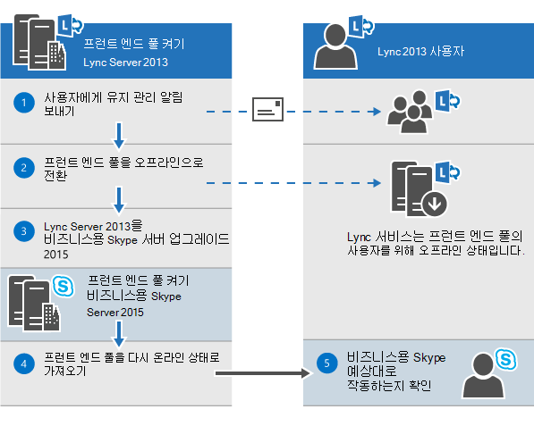
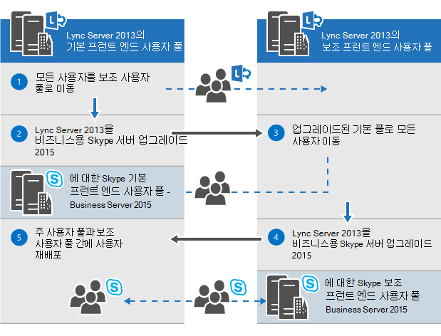
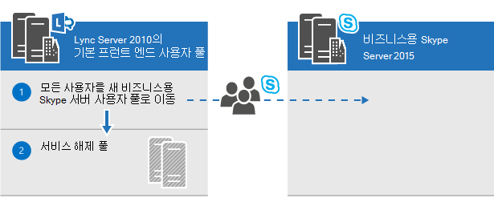
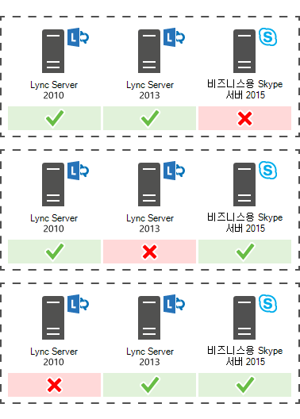

# 비즈니스용 Skype 서버 2015에 대 한 업그레이드 계획Plan to upgrade to Skype for Business Server 2015
 
요약: 비즈니스용 Skype 서버 2015에 대 한 업그레이드를 계획할 때 고려해 야 할 사항에 대해 알아봅니다.Summary: Learn about the things you should consider when you plan an upgrade to Skype for Business Server 2015. Microsoft 평가 센터에서 비즈니스용 Skype 서버 2015의 무료 평가판을 다운로드 하세요. [https://www.microsoft.com/evalcenter/evaluate-skype-for-business-server](https://www.microsoft.com/evalcenter/evaluate-skype-for-business-server)Download a free trial of Skype for Business Server 2015 from the Microsoft Evaluation center at: [https://www.microsoft.com/evalcenter/evaluate-skype-for-business-server](https://www.microsoft.com/evalcenter/evaluate-skype-for-business-server).
  
비즈니스용 Skype 서버 2015로 업그레이드 하는 계획의 일환으로이 항목을 사용 하 여 비즈니스용 Skype 서버 2015에 대 한 권장 업그레이드 경로, 전체 업그레이드 작동 방식, 지원 되는 동시 사용 시나리오 및 업그레이드 프로세스를 이해 합니다. 같습니다.As part of your plan to upgrade to Skype for Business Server 2015, use this topic to understand the recommended upgrade paths to Skype for Business Server 2015, how the In-Place Upgrade works, what the supported coexistence scenarios are, and what the upgrade process looks like.

> [!NOTE]
> 현재 위치 업그레이드는 비즈니스용 Skype 서버 2015에서 사용할 수 있었지만 비즈니스용 Skype 서버 2019에서는 더 이상 지원 되지 않습니다.In-place upgrades were available in Skype for Business Server 2015 but are no longer supported in Skype for Business Server 2019. Side-by-side coexistance 지원 됩니다. 자세한 내용은 [비즈니스용 Skype 서버 2019로 마이그레이션을](../../SfBServer2019/migration/migration-to-skype-for-business-server-2019.md) 참조 하세요.Side by side coexistance is supported, see [Migration to Skype for Business Server 2019](../../SfBServer2019/migration/migration-to-skype-for-business-server-2019.md) for more information.
  
## 비즈니스용 Skype 서버 2015에 대 한 권장 업그레이드 경로Recommended upgrade paths to Skype for Business Server 2015

 Lync Server 2013, Lync Server 2010 또는 Office Communications Server 2007 R2에서 비즈니스용 Skype 서버 2015로 업그레이드 하려면 다음 업그레이드 경로를 사용 합니다.To upgrade from Lync Server 2013, Lync Server 2010, or Office Communications Server 2007 R2 to Skype for Business Server 2015, use the following upgrade paths:
  
> [!CAUTION]
> 전체 업그레이드 전화 회의 디렉터리를 Lync Server 2013에서 비즈니스용 Skype 서버 2015로 자동으로 이동 합니다.In-Place Upgrade automatically moves conference directories from Lync Server 2013 to Skype for Business Server 2015. 그러나 전화 회의 디렉터리를 수동으로 이동 하려는 경우 비즈니스용 Skype 서버 2015 관리 셸을 사용 하는 것이 매우 중요 합니다.However, if you plan to manually move conference directories it is very important to use the Skype for Business Server 2015 Management Shell. Lync server 2013 관리 셸을 사용 하 여 전화 회의 디렉터리를 Lync Server 2013에서 비즈니스용 Skype 서버 2015로 이동 하려고 하면 데이터 손실이 발생할 수 있습니다.If you try to use the Lync Server 2013 Management Shell to move conference directories from Lync Server 2013 to Skype for Business Server 2015 then data loss can occur. 일반적으로 비즈니스용 Skype 서버 2015에서 모든 용량을 사용할 때마다 비즈니스용 Skype 서버 2015 도구 집합을 사용 해야 합니다.In general, whenever you are working with Skype for Business Server 2015 in any capacity you should use the Skype for Business Server 2015 tool set.  
  
|**버전****Version**|**추천****Recommendations**|
|:-----|:-----|
|Lync Server 2013Lync Server 2013    | 업그레이드 하려면 해당 풀과 연결 된 각 서버에서 비즈니스용 Skype 서버 토폴로지 작성기 및 새로운 전체 업그레이드 기능을 사용 합니다.To upgrade, use the Skype for Business Server Topology Builder and the new In-Place Upgrade feature on each of the servers associated with the pool. 자세한 단계는 [Lync server 2013에서 비즈니스용 Skype 서버 2015로 업그레이드 계획](upgrade.md#BKMK_PlanUpgradeFromLync2013) 및 [비즈니스용 skype 서버 2015으로 업그레이드](../deploy/upgrade-to-skype-for-business-server.md) 를 참조 하세요.see [Plan to upgrade from Lync Server 2013 to Skype for Business Server 2015](upgrade.md#BKMK_PlanUpgradeFromLync2013) and [Upgrade to Skype for Business Server 2015](../deploy/upgrade-to-skype-for-business-server.md) for detailed steps.   |
|Lync Server 2010 + Lync Server 2013 (이중 모드)Lync Server 2010 + Lync Server 2013 (dual-mode)    |먼저, Lync Server 2013로 업그레이드 한 다음 새로운 전체 업그레이드 기능을 사용 하 여 비즈니스용 Skype 서버 2015로 업그레이드 합니다.First, upgrade to Lync Server 2013, and then upgrade to Skype for Business Server 2015 by using the new In-Place Upgrade feature. 그러나 토폴로지가 기본 Lync Server 2010 인 경우 lync server 2013 구성 요소를 Lync Server 2010로 롤백한 다음 비즈니스용 Skype 서버 2015로 직접 업그레이드할 수도 있습니다.However, if your topology is primary Lync Server 2010 you can also roll back the Lync Server 2013 components to Lync Server 2010 and then upgrade directly to Skype for Business Server 2015. 이 경우에는 전체 업그레이드를 사용할 수 없으며 Lync Server 2010과 비즈니스용 Skype 서버 2015 사이에는 직접 공존을 사용 해야 합니다.In this case you would not be able to take advantage of In-Place Upgrade and would use straight co-existence between Lync Server 2010 and Skype for Business Server 2015. 3 번은 지원 되지 않지만 동시 존재는 지원 됩니다.Tri-existence is not supported but co-existence is supported.    |
|Lync Server 2010Lync Server 2010    |새 비즈니스용 Skype 서버 2015 풀을 가져온 다음 사용자를이 새 풀로 마이그레이션합니다.Bring up a new Skype for Business Server 2015 pool and then migrate users to this new pool. 그런 다음 이전 Lync Server 2010 풀을 해제할 수 있습니다.You can then decommission the old Lync Server 2010 pool. Lync server 2010에서 비즈니스용 Skype 서버 2015로 업그레이드 하는 것은 Lync Server 2010에서 Lync Server 2013로 업그레이드 하는 것과 비슷합니다.Upgrading from Lync Server 2010 to Skype for Business Server 2015 is similar to upgrading from Lync Server 2010 to Lync Server 2013. [Lync server 2010에서 Lync server 2013로 마이그레이션을](https://go.microsoft.com/fwlink/p/?LinkId=526615)참조 하세요.See [Migration from Lync Server 2010 to Lync Server 2013](https://go.microsoft.com/fwlink/p/?LinkId=526615).    |
|Office Communications Server 2007 R2Office Communications Server 2007 R2    | 다음 두 옵션 중 하나를 선택 합니다.Pick one of two options:    새 비즈니스용 Skype 서버 2015 환경을 설정 합니다.Set up a new Skype for Business Server 2015 environment.    또는 하드웨어 및 소프트웨어가 비즈니스용 Skype 서버 2015 요구 사항을 충족 하는 경우 새로운 전체 업그레이드 기능을 사용 하 여 Lync Server 2013로 업그레이드 한 다음 비즈니스용 Skype 서버 2015으로 업그레이드 합니다.Or if your hardware and software meet the requirements for Skype for Business Server 2015, upgrade to Lync Server 2013, and then upgrade to Skype for Business Server 2015 by using the new In-Place Upgrade feature. 자세한 내용은 [비즈니스용 Skype 서버 2015의 서버 요구 사항](requirements-for-your-environment/server-requirements.md) 및 [Office Communications Server 2007 R2에서 Lync server 2013로의 마이그레이션을](https://go.microsoft.com/fwlink/p/?LinkId=526616)참조 하십시오.For more information, see [Server requirements for Skype for Business Server 2015](requirements-for-your-environment/server-requirements.md) and [Migration from Office Communications Server 2007 R2 to Lync Server 2013](https://go.microsoft.com/fwlink/p/?LinkId=526616).    |
   
> [!NOTE]
> SQL Server 2014은 비즈니스용 Skype 서버 2015에서 지원 되지만 Lync Server 2013에서는 지원 되지 않습니다.SQL Server 2014 is supported in Skype for Business Server 2015 but is not supported in Lync Server 2013. SQL Server 2012에서 SQL Server 2014로 업그레이드 하려면 먼저이 문서에 설명 된 대로 전체 업그레이드 방법을 사용 하 여 풀을 비즈니스용 Skype 서버 2015로 업그레이드 해야 합니다.If you want to upgrade from SQL Server 2012 to SQL Server 2014 then the pool must first be upgraded to Skype for Business Server 2015 using the In-Place Upgrade method as described in this document. 그런 다음 SQL server 2012에서 SQL Server 2014로 업그레이드할 수 있으며 [Sql server 2014 업그레이드를](https://msdn.microsoft.com/library/bb677622%28v=sql.120%29.aspx)참조 하세요.You can then upgrade from SQL Server 2012 to SQL Server 2014, see [Upgrade to SQL Server 2014](https://msdn.microsoft.com/library/bb677622%28v=sql.120%29.aspx). 데이터베이스 요구 사항에 대 한 자세한 내용은 [비즈니스용 Skype 서버 2015에 대 한 서버 요구 사항을](requirements-for-your-environment/server-requirements.md)참조 하세요.To learn more about database requirements, see [Server requirements for Skype for Business Server 2015](requirements-for-your-environment/server-requirements.md). 
  
## Lync Server 2013에서 비즈니스용 Skype 서버 2015로의 업그레이드 계획Plan to upgrade from Lync Server 2013 to Skype for Business Server 2015

새로운 전체 업그레이드 기능을 사용 하 여 Lync Server 2013 시스템을 비즈니스용 Skype 서버 2015로 업그레이드할 수 있습니다.You can upgrade Lync Server 2013 systems to Skype for Business Server 2015 using the new In-Place Upgrade feature. 전체 업그레이드는 인증서를 백업 하 고, 서버 구성 요소를 제거 하 고, 로컬 데이터베이스를 업그레이드 하 고, 비즈니스용 Skype 서버 2015 역할을 설치 하는 한 클릭 솔루션을 제공 합니다.In-place upgrade provides a one-click solution that backs up certificates, uninstalls server components, upgrades local databases, and installs the Skype for Business Server 2015 roles. 현재 위치 업그레이드를 통해 기존 하드웨어 및 서버 투자를 유지 하 여 비즈니스용 Skype 서버 2015를 배포 하기 위한 전반적인 비용을 절감할 수 있습니다.In-place upgrade seeks to preserve existing hardware and server investments, reducing the overall cost to deploy Skype for Business Server 2015.
  
> [!NOTE]
> 전체 업그레이드를 사용 하면 비즈니스용 Skype 서버로 업그레이드할 때 동일한 하드웨어를 사용할 수 있습니다.In-Place Upgrade allows you to use the same hardware when upgrading to Skype for Business Server. 그러나 같은 하드웨어를 다시 사용 하는 것은 동일한 성능 용량으로 변환 되지 않습니다.However, reusing the same hardware does not translate into the same performance capacity. Lync Server 2013 및 비즈니스용 Skype 서버 2015에 대 한 성능 부하는 동일 하 게 예상 되어서는 안 됩니다.You should not expect the performance loads for Lync Server 2013 and Skype for Business Server 2015 to be identical. 
  
> [!NOTE]
> 전체 업그레이드에서는 비즈니스용 Skype 서버에 대 한 고가용성 또는 재해 복구를 지원 하지 않습니다.In-Place upgrade does not support high availability or disaster recovery for Skype for Business Server. 
  
전체 업그레이드는 Lync Server 2013 풀을 오프 라인으로 전환 하 여 비즈니스용 Skype 서버 2015 풀로 업그레이드 하는 작업을 수행 합니다.In-place upgrade involves taking the Lync Server 2013 pool offline and upgrading it to a Skype for Business Server 2015 pool. 
  
### 전체 업그레이드 계획 만들기Create an In-Place Upgrade plan

다음을 포함 하는 계획을 만듭니다.Make a plan that includes:
  
1. 현재 토폴로지에 대 한 이해An understanding of your current topology.
    
    > [!NOTE]
    > 전체 업그레이드를 실행 하기 전에 LRS Admin tool for Lync Server 2013을 먼저 제거 해야 합니다.Be sure to uninstall LRS Admin tool for Lync Server 2013 before running In-Place Upgrade. Lync Server 2013에 대 한 LRS 관리 도구는 비즈니스용 Skype 서버 2015과 함께 사용할 수 없습니다.The LRS Admin Tool for Lync Server 2013 cannot coexist with Skype for Business Server 2015. 전체 업그레이드를 실행 한 후에는 새 LRS 관리 도구를 설치 합니다.After running In-Place Upgrade install the new LRS Admin tool. 자세한 내용은 [비즈니스용 Skype 서버 2015에 대 한 Microsoft Lync 대화방 시스템 관리 웹 포털](https://go.microsoft.com/fwlink/?LinkID=544807) 을 참조 하세요.See [Microsoft Lync Room System Administrative Web Portal for Skype for Business Server 2015](https://go.microsoft.com/fwlink/?LinkID=544807) for more details.
  
2. 업그레이드에 대 한 기본 풀입니다.The primary pool for the upgrade.
    
3. 보관 및 모니터링 데이터베이스를 업그레이드할지 아니면 새로 만들지를 지정 합니다.Whether you'll upgrade the Archiving and Monitoring databases or create new ones.
    
4. 오프 라인 또는 사용자 이동을 사용 하 여 전체 업그레이드 방법을 사용할 수 있습니다.The In-Place Upgrade method you'll use: Offline or Move Users. 사용자 이동의 일부로 기본 풀과 연결 된 전역 회의 디렉터리도 마이그레이션해야 합니다.As part of Move Users you also will need to migrate the global conference directories associated with the primary pool. 
    
5. 영향을 받는 사용자에 대 한 통신 계획A communication plan for impacted users.
    
6. 업그레이드에 실패 하는 경우의 백업 계획A backup plan in case the upgrades fails.
    
업그레이드 중에 기본 풀에 있는 모든 사용자는 업그레이드가 완료 될 때까지 서비스를 사용할 수 없게 됩니다.Any users that are in the primary pool while it's being upgraded won't be able to use the services until the upgrade is complete. 보조 풀을 사용 하는 경우에는 업그레이드 전에 보조 풀로 이동 하 여 사용자에 게 영향을 주지 않도록 할 수 있습니다.If you have a working secondary pool, you can avoid impacting users by moving them to the secondary pool before the upgrade. 업그레이드 후에 사용자를 기본 풀로 다시 이동 합니다.After the upgrade, move the users back to the primary pool.
  
### 전체 업그레이드 방법In-place upgrade methods

현재 위치 업그레이드에는 다음과 같은 두 가지 시나리오가 있습니다.There are two scenarios for In-Place Upgrade: 
  
- 사용자 이동 방법-사용자에 대 한 가동 중지 시간이 필요 하지 않습니다.The Move User method, which requires no downtime for users. 
    
- 가동 중지 시간이 필요한 오프 라인 방법The Offline method, which requires downtime.
    
유지 관리 기간 중에는 오프 라인 메서드 업그레이드를 예약 하 고 사용자에 게 가동 중지 시간을 알리는 것이 좋습니다.We recommend that an Offline method upgrade be scheduled during a maintenance window and users are notified of the downtime.
  
> [!NOTE]
> Lync Server 2013의 페어링 된 풀을 업그레이드 하는 경우 두 풀을 비즈니스용 Skype 서버 2015로 업그레이드 하려는 경우When upgrading a paired pool on Lync Server 2013 and you want to upgrade both pools to Skype for Business Server 2015. 첫 번째 풀을 업그레이드 한 후에 두 번째 풀을 즉시 업그레이드 해야 합니다.Make sure to upgrade the second pool immediately after upgrading the first pool. 한 풀이 Lync Server 2013을 실행 하 고 두 번째 풀이 비즈니스용 Skype 서버 2015를 실행 하는 경우 재해 복구 옵션이 최소화 됩니다.When one pool is running Lync Server 2013 and the second pool is running Skype for Business Server 2015 then disaster recovery options are minimized. 예를 들어 한 풀이 2013을 실행 중이 고 두 번째는 2015이 고 재해가 발생 한 경우에는 연결 된 풀이 버전이 같을 때 재해 모드에서 풀 장애 조치 (failover)가 지원 되지 않으므로 데이터 손실이 발생할 수 있습니다.For example, if one pool is running 2013 and the second is 2015 and there is a disaster then you could experience data loss because pool failover is not supported in disaster mode when paired pools are not the same version. 
  
#### 전체 업그레이드 오프 라인 방법In-place upgrade Offline method

사용자 풀 간에 사용자를 이동 하지 않으려면이 방법을 사용 합니다.Use this method if you don't want to move users between user pools. 업그레이드 중에는 사용자가 Lync 또는 비즈니스용 Skype 서비스를 사용할 수 없게 됩니다.During the upgrade, users will not be able to use Lync or Skype for Business services. 
  
다음 다이어그램에서는이 프로세스의 개요를 보여 줍니다.The following diagram shows an overview of this process.
  

  
> [!NOTE]
> 연결 된 풀이 있는 경우 업그레이드 전에 unpair 하지 마십시오.If you have paired pools, do not unpair them before the upgrade. 
  
서버 풀 업그레이드를 시작한 후에는 전체 풀의 업그레이드를 완료 해야 합니다.Once you start to upgrade a server pool, you must complete the upgrade of the entire pool. 비즈니스용 Skype 서버는 풀 일부만 업그레이드 하는 것을 지원 하지 않습니다.Skype for Business Server doesn't support having only a portion of the pool upgraded. 
  
#### 사용자 이동 방법 (사용자 가동 중지 시간 없음)Move Users method (no user downtime)

이 방법을 사용 하려면 업그레이드를 시작 하기 전에 사용자를 다른 풀로 이동 합니다.To use this method, you move users to another pool before you start the upgrade. 업그레이드 중에는 사용자가 Lync services를 사용할 수 있습니다.During the upgrade, users can use Lync services. 업그레이드 된 풀로 이동한 후 비즈니스용 Skype를 사용할 수 있습니다.After they're moved to the upgraded pool, they can use Skype for Business. 다음 다이어그램에서는이 프로세스의 개요를 보여 줍니다.The following diagram shows an overview of this process.
  
> [!IMPORTANT]
> 사용자 이동의 일부로 기본 풀과 연결 된 전역 회의 디렉터리도 마이그레이션해야 합니다.As part of Move Users you also will need to migrate the global conference directories associated with the primary pool. PSTN 전화 접속 회의는 여전히 연결 된 풀 대신 업그레이드 되는 풀에 대 한 ConferenceID를 확인 합니다.PSTN dial-in conferencing will still resolve ConferenceID to the pool being upgraded, instead of the paired pool. 따라서 업그레이드 중에 풀에 예약 된 PSTN 회의에 액세스 하려면 전화 회의 디렉터리를 이동 해야 합니다.So you need to move Conference Directories, if you still want PSTN conferences scheduled in the pool to be accessible during upgrade. 
  

  
#### 하드웨어 업그레이드를 위해 사용자 이동Move users for hardware upgrade

 하드웨어가 [비즈니스용 Skype 서버 2015의 서버 요구 사항을](requirements-for-your-environment/server-requirements.md)충족 하지 않는 경우 비즈니스용 skype 서버 2015 환경을 새로 설치 하 고 사용자를 이동 합니다.If your hardware doesn't meet the [Server requirements for Skype for Business Server 2015](requirements-for-your-environment/server-requirements.md), set up a new Skype for Business Server 2015 environment, and move users there. 다음 다이어그램에서는이 Lync Server 2010의 업그레이드 프로세스에 대 한 개요를 보여 줍니다.The following diagram shows an overview of this process for upgrade from Lync Server 2010. 
  

  
### 전체 업그레이드 프로세스In-place upgrade process

 다음 단계를 사용 하 여 Lync Server 2013에서 비즈니스용 Skype 서버 2015로 업그레이드 합니다.Upgrade from Lync Server 2013 to Skype for Business Server 2015 using the following steps:
  
1. 업그레이드 전에 모든 데이터베이스를 백업 합니다.Back up all databases before the upgrade.
    
2. 업그레이드할 모든 서비스가 실행 중 상태 인지 확인 합니다.Make sure all services that are to be upgraded are in a running state.
    
3. 토폴로지 작성기를 사용 하 여 토폴로지 파일을 업그레이드 하 고 게시 합니다.Upgrade and publish the topology file using the topology builder.
    
4. 모든 프런트 엔드 서버에서 모든 서비스를 중지 합니다.Stop all services on all Front End servers.
    
5. 비즈니스용 Skype 서버에 필요한 새 필수 구성 요소를 설치 합니다.Install new prerequisites required for Skype for Business Server.
    
6. 각 프런트 엔드 서버에서 전체 업그레이드를 시작 합니다.On each Front End server, start the In-Place Upgrade.
    
7. 업그레이드가 완료 되 면 모든 서비스를 다시 시작 합니다.When the upgrade is complete, restart all services.
    
   - 프런트 엔드 풀에 대해 Start-CsPool 명령을 사용 하 여 서비스를 다시 시작 합니다.For the Front End pool, restart services using the command Start-CsPool.
    
   - 프런트 엔드 서버가 아닌 경우에는 CSWindowsService를 사용 합니다.For non-Front End servers, use Start-CSWindowsService.
    
> [!NOTE]
>  기존 보관 및 모니터링 데이터베이스를 업그레이드 하지 않으려면 토폴로지를 업그레이드 하기 전에 종속성을 제거 합니다.If you don't want to upgrade your existing Archiving and Monitoring databases, remove the dependency before you upgrade the topology. 새 보관 및 모니터링 데이터베이스를 만들려면 업그레이드 중에 새 SQL 저장소를 만들어 풀과 연결 하면 됩니다.If you want to create new Archiving and Monitoring databases, during the upgrade, you can create a new SQL store and associate it with the pool. 이 작업을 수행 하는 방법에 대 한 단계는[비즈니스용 Skype 서버 2015으로 업그레이드](../deploy/upgrade-to-skype-for-business-server.md)항목에서 찾을 수 있습니다.You can find the steps on how to do this in the topic,[Upgrade to Skype for Business Server 2015](../deploy/upgrade-to-skype-for-business-server.md). 전체 업그레이드 > 비즈니스용 Skype 서버에 대 한 고가용성 또는 재해 복구를 지원 하지 않습니다.>  In-place upgrade does not support high availability or disaster recovery for Skype for Business Server. 사용자의 서비스가 중단 되지 않도록 하려면 [Move users 메서드 (사용자가 중단 되지 않음)](upgrade.md#bkmk_MoveUsersMethod) 를 사용 하 여 업그레이드 합니다. 업그레이드 프로세스 중 > xds-복제본은 사용 가능한 공간이 가장 많은 디스크 드라이브의 로컬 공유 폴더에 놓입니다.To avoid interrupting users' services, use the [Move Users method (no user downtime)](upgrade.md#bkmk_MoveUsersMethod) to upgrade.>  During the upgrade process the xds-replica is placed in the local shared folder on the disk drive with the most free space. 해당 디스크를 나중에 제거 하는 경우 서비스가 시작 되지 않는 등의 문제가 발생할 수 있습니다.If that disk is later removed then you can run into issues such as services not starting.
  
### 업그레이드 순서Upgrade order

내부에서 외부로 토폴로지를 업그레이드 합니다.Upgrade the topology from the inside to the outside. 먼저 모든 풀을 업그레이드 한 다음에 지 서버와 CMS (중앙 관리 저장소) 풀을 차례로 클릭 합니다.Upgrade all your pools first, then the edge servers, and finally the Central Management Store (CMS) pool. 
  
### Kerberos 인증 고려 사항Kerberos authentication considerations

웹 서비스에 대해 Kerberos 인증을 사용 하는 경우에는 전체 업그레이드가 완료 된 후 Kerberos 계정을 다시 할당 하 고 암호를 다시 설정 해야 합니다.If you use Kerberos authentication for Web Services, you must reassign Kerberos accounts and reset the password after the In-Place Upgrade is complete. 이 작업을 수행 하는 방법에 대 한 자세한 내용은 [Kerberos 인증 설정을](https://go.microsoft.com/fwlink/p/?LinkId=530342)참조 하십시오.To learn how to do this, see [Setting up Kerberos authentication](https://go.microsoft.com/fwlink/p/?LinkId=530342).
  
## Lync Server 2013 및 Lync Server 2010의 동시 사용 지원Support for coexistence with Lync Server 2013 and Lync Server 2010

Lync Server 2013 또는 Lync Server 2010과 동일한 토폴로지에서 비즈니스용 Skype 서버 2015을 실행할 수는 있지만, 동일한 토폴로지에서 3 개를 모두 가질 수는 없습니다.You can run Skype for Business Server 2015 in the same topology as Lync Server 2013 or Lync Server 2010, but you can't have all three in the same topology.
  
Lync Server 2010와 Lync Server 2013 사이에 공존 하는 경우 전체 토폴로지를 Lync Server 2013로 업그레이드 한 다음, 현재 위치 업그레이드를 사용 하 여 비즈니스용 Skype 서버 2015로 업그레이드 하는 것이 좋습니다.If you have a co-existence between Lync Server 2010 and Lync Server 2013, it is recommended to upgrade the entire topology to Lync Server 2013, and then upgrade to Skype for Business Server 2015 using the In-Place Upgrade. 자세한 내용은 [Lync server 2010에서 Lync server 2013로 마이그레이션을](https://go.microsoft.com/fwlink/p/?LinkId=526615)참조 하세요.For more information, see [Migration from Lync Server 2010 to Lync Server 2013](https://go.microsoft.com/fwlink/p/?LinkId=526615).
  
토폴로지가 주로 Lync Server 2010 이면 비즈니스용 Skype 서버 2015로 토폴로지를 업그레이드 하기 전에 lync server 2013 구성 요소를 Lync Server 2010에 롤백합니다.If your topology is primarily Lync Server 2010, roll back the Lync Server 2013 components to Lync Server 2010 before upgrading the topology to Skype for Business Server 2015. 이 경우에는 전체 업그레이드의 이점을 잃게 되며 Lync Server 2010과 비즈니스용 Skype 서버 2015 간에 공존 토폴로지가 유지 됩니다.In this case, you lose the benefit of the In-Place Upgrade and have a co-existence topology between Lync Server 2010 and Skype for Business Server 2015.
  
다음 다이어그램은 Lync Server 2013 및 Lync Server 2010을 사용 하는 비즈니스용 Skype 서버 2015의 동시 사용 지원을 보여 줍니다.The following diagram shows the coexistence support of Skype for Business Server 2015 with Lync Server 2013 and Lync Server 2010.
  

  
## 기존 Sba (survivable Branch 기기 및 서버를 사용한 업그레이드 프로세스Upgrade process with existing Survivable Branch Appliance and Server

비즈니스용 Skype 서버 2015는 SBA (Sba (survivable Branch 기기의) 또는 SBS (Sba (survivable Branch Server)의 전체 업그레이드를 지원 하지 않습니다.Skype for Business Server 2015 doesn't support an In-Place Upgrade of a Survivable Branch Appliance (SBA) or a Survivable Branch Server (SBS).
  
그러나 Lync Server 2010 또는 Lync Server 2013 SBA/SBS와 함께 비즈니스용 Skype 서버 데이터 센터 공존을 지원 합니다.However, we do support coexistence of Skype for Business Server datacenters with Lync Server 2010 or Lync Server 2013 SBA/SBS. 
  
연결 된 분기를 사용 하 여 Lync Server 2013 프런트 엔드 (FE) 풀의 전체 업그레이드를 계획할 때는 기존 사용자를 Lync Server 2013 SBA/SBS에 남길 수 있습니다.When planning for an In-Place Upgrade of a Lync Server 2013 Front End (FE) pool with an associated branch, you can leave the existing users on the Lync Server 2013 SBA/SBS. 업그레이드 하는 동안 SBA/SBS 사용자는 복구 모드로 전환 되며 업그레이드가 완료 되 면 일반 기능으로 돌아갑니다.During the upgrade, the SBA/SBS users will go in resiliency mode and will return to normal functionality after the upgrade has completed. 복원 모드 중의 사용자 환경에 대 한 자세한 내용은 [Lync Server 2013의 분기 사이트 복구 기능](https://technet.microsoft.com/library/gg398715.aspx)을 참조 하십시오.For more information about the users' experience during the resiliency mode, please see [Branch-site resiliency features in Lync Server 2013](https://technet.microsoft.com/library/gg398715.aspx).
  
Lync Server 2010 토폴로지를 비즈니스용 Skype 서버 2015로 마이그레이션하는 경우 SBA/SBS는 Lync Server 2013로의 마이그레이션과 마찬가지로 토폴로지에 다시 추가 해야 합니다.When migrating a Lync Server 2010 topology to Skype for Business Server 2015, the SBA/SBS must re-added to the topology, similar to the migration to Lync Server 2013. 필요한 단계는 [Sba (survivable Branch 어플라이언스를 Lync Server 2013 프런트 엔드 풀에 연결을](https://technet.microsoft.com/library/jj688026.aspx)참조 하세요.For the required steps, please read [Connecting Survivable Branch Appliance to Lync Server 2013 Front End pool](https://technet.microsoft.com/library/jj688026.aspx).
  
Lync Server 2010 및 Lync Server 2013의 공존 토폴로지에 대 한 자세한 내용은 ' Lync Server 2013 및 Lync Server 2010의 동시 사용 지원 ' 섹션에 나오는 권장 사항에 먼저 맞춤을 따르십시오.For co-existence topologies of Lync Server 2010 and Lync Server 2013, align first to the recommendations made in the section 'Support for coexistence with Lync Server 2013 and Lync Server 2010'.
  
## 참고 항목See also

[비즈니스용 Skype 서버 2015로 업그레이드Upgrade to Skype for Business Server 2015](../deploy/upgrade-to-skype-for-business-server.md)
  
[비즈니스용 Skype 서버 2015에 대 한 환경 요구 사항Environmental requirements for Skype for Business Server 2015](requirements-for-your-environment/environmental-requirements.md)
  
[비즈니스용 Skype 서버 2015에 대 한 서버 요구 사항Server requirements for Skype for Business Server 2015](requirements-for-your-environment/server-requirements.md)
